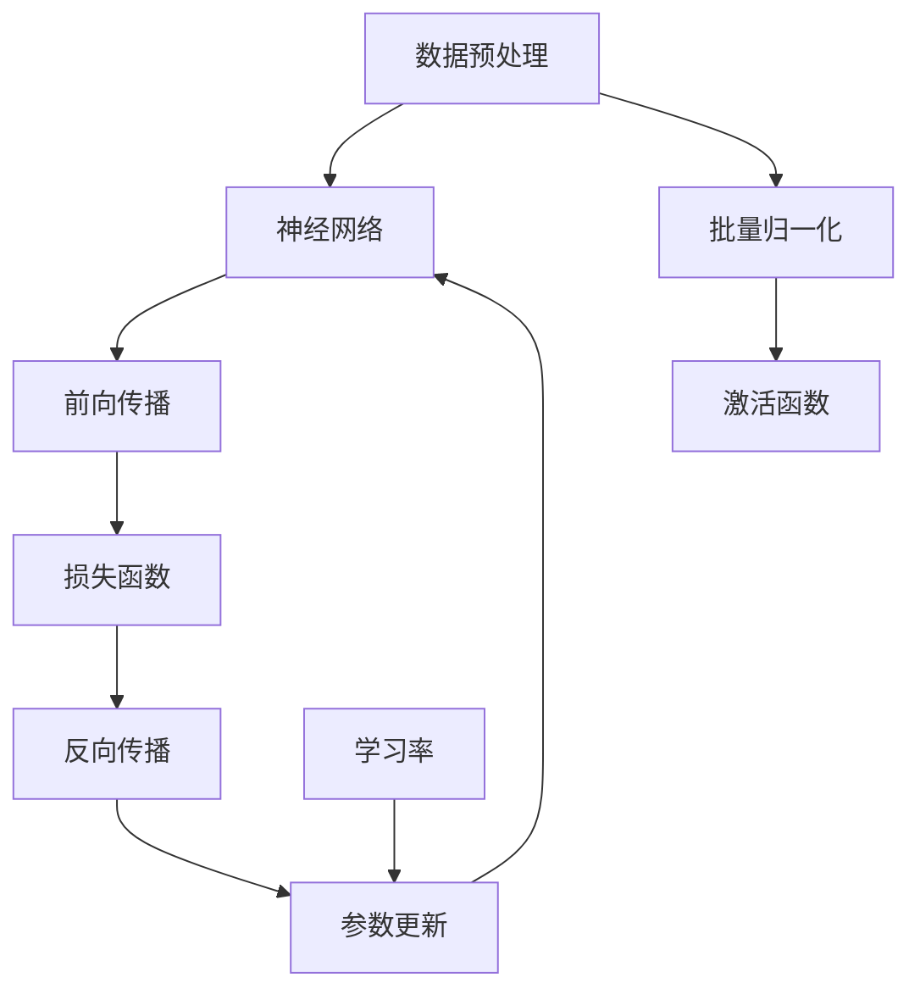

                 

# AI人工智能核心算法原理与代码实例讲解：模型优化

> 关键词：人工智能、模型优化、算法原理、深度学习、代码实例、神经网络、超参数调优

> 摘要：本文将深入探讨人工智能中的模型优化技术，解析其在深度学习中的核心算法原理。我们将通过代码实例详细展示如何在实际项目中应用这些优化技术，帮助读者理解和掌握模型优化的方法。本文适合对人工智能和深度学习有一定了解的读者，尤其是希望提升模型性能的实践者。

## 1. 背景介绍

### 1.1 目的和范围

本文旨在详细介绍人工智能中的模型优化技术，包括其在深度学习领域的应用。我们将会探讨一些核心的算法原理，并通过具体的代码实例来说明如何在实际项目中优化模型性能。文章将涵盖以下几个方面：

1. **模型优化的重要性**：解释模型优化对于提升模型性能和实际应用价值的关键作用。
2. **核心算法原理**：详细讲解模型优化中常用的算法，包括梯度下降、动量、批量归一化等。
3. **代码实例**：通过具体实现和解释，展示如何在实际项目中应用模型优化技术。
4. **数学模型和公式**：介绍与模型优化相关的数学模型和公式，帮助读者深入理解优化过程。
5. **实际应用场景**：分析模型优化技术在各种实际应用场景中的具体应用。
6. **工具和资源推荐**：推荐一些学习资源和工具，帮助读者进一步学习和实践模型优化。

### 1.2 预期读者

本文适合以下读者群体：

1. **人工智能和深度学习从业者**：希望通过深入学习模型优化来提升模型性能。
2. **学术研究者**：希望了解模型优化领域的最新研究成果和应用。
3. **程序员和软件开发者**：对深度学习和模型优化感兴趣，希望将其应用于实际项目中。

### 1.3 文档结构概述

本文将按照以下结构展开：

1. **背景介绍**：介绍模型优化的重要性和预期读者，概述文档结构。
2. **核心概念与联系**：通过Mermaid流程图展示模型优化相关的核心概念和联系。
3. **核心算法原理与具体操作步骤**：详细讲解模型优化中的核心算法原理和操作步骤。
4. **数学模型和公式**：介绍与模型优化相关的数学模型和公式。
5. **项目实战**：通过代码实例展示模型优化的实际应用。
6. **实际应用场景**：分析模型优化在不同领域的应用。
7. **工具和资源推荐**：推荐学习资源和开发工具。
8. **总结**：总结模型优化的未来发展趋势和挑战。
9. **附录**：常见问题与解答。
10. **扩展阅读**：推荐相关参考资料。

### 1.4 术语表

#### 1.4.1 核心术语定义

- **模型优化**：调整模型参数，以提高模型在特定任务上的性能。
- **深度学习**：一种基于神经网络的学习方法，适用于处理复杂数据。
- **神经网络**：由多层神经元组成的计算模型，用于从数据中学习特征和模式。
- **超参数调优**：调整模型参数之外的超参数，如学习率、批量大小等，以优化模型性能。

#### 1.4.2 相关概念解释

- **梯度下降**：一种用于优化模型参数的算法，通过最小化损失函数来调整参数。
- **批量归一化**：一种用于加速训练和减少过拟合的技术，通过对输入数据进行归一化来稳定训练过程。
- **动量**：一种防止参数更新震荡的技术，通过引入前期更新值来加速收敛。

#### 1.4.3 缩略词列表

- **MLP**：多层感知器（Multilayer Perceptron）
- **CNN**：卷积神经网络（Convolutional Neural Network）
- **RNN**：循环神经网络（Recurrent Neural Network）
- **GAN**：生成对抗网络（Generative Adversarial Network）

## 2. 核心概念与联系

为了更好地理解模型优化的核心概念和联系，我们可以使用Mermaid流程图来展示以下关键组件：



- **数据预处理（A）**：在训练模型之前，对输入数据进行预处理，如归一化、去噪等，以提高模型的训练效率和性能。
- **神经网络（B）**：构建多层神经网络结构，用于处理复杂数据。
- **前向传播（C）**：将输入数据通过神经网络进行传递，计算输出结果。
- **损失函数（D）**：评估模型输出与真实值之间的差异，用于指导参数更新。
- **反向传播（E）**：计算损失函数关于模型参数的梯度，用于指导参数更新。
- **参数更新（F）**：根据损失函数的梯度更新模型参数，以最小化损失函数。
- **批量归一化（G）**：对输入数据进行归一化处理，以稳定训练过程并减少过拟合。
- **激活函数（H）**：对神经网络输出进行非线性变换，以引入非线性特性。
- **学习率（I）**：控制参数更新的步长，影响模型收敛速度。

通过上述Mermaid流程图，我们可以清晰地理解模型优化中各个组件的相互作用和联系。接下来，我们将深入探讨这些核心算法原理和具体操作步骤。

## 3. 核心算法原理 & 具体操作步骤

在模型优化过程中，我们通常会涉及到以下核心算法原理：

1. **梯度下降**：一种优化算法，通过计算损失函数关于模型参数的梯度，以更新模型参数，从而最小化损失函数。
2. **批量归一化**：一种用于加速训练和减少过拟合的技术，通过对输入数据进行归一化来稳定训练过程。
3. **动量**：一种防止参数更新震荡的技术，通过引入前期更新值来加速收敛。

### 3.1 梯度下降算法原理

梯度下降算法是优化模型参数的核心算法之一，其基本原理如下：

```python
# 梯度下降伪代码

def gradient_descent(x, y, learning_rate, epochs):
    for epoch in range(epochs):
        # 计算预测值
        prediction = f(x)
        # 计算损失
        loss = loss_function(y, prediction)
        # 计算梯度
        gradient = compute_gradient(loss, x)
        # 更新参数
        x = x - learning_rate * gradient
        # 输出当前epoch的损失
        print(f"Epoch {epoch + 1}: Loss = {loss}")
    return x
```

在上面的伪代码中：

- `x` 代表模型参数。
- `y` 代表真实值。
- `learning_rate` 控制参数更新的步长。
- `epochs` 表示训练迭代次数。
- `f(x)` 表示模型预测函数。
- `loss_function` 表示损失函数。
- `compute_gradient` 表示计算损失函数关于模型参数的梯度。

### 3.2 批量归一化算法原理

批量归一化（Batch Normalization）是一种常用的技术，用于加速训练和减少过拟合。其基本原理如下：

```python
# 批量归一化伪代码

def batch_normalization(x, mean, variance, gamma, beta):
    z = (x - mean) / sqrt(variance + 1e-8)
    output = gamma * z + beta
    return output
```

在上面的伪代码中：

- `x` 代表输入数据。
- `mean` 和 `variance` 分别表示输入数据的均值和方差。
- `gamma` 和 `beta` 分别表示归一化模型的缩放参数和偏置参数。

### 3.3 动量算法原理

动量（Momentum）是一种用于加速训练和防止参数更新震荡的技术。其基本原理如下：

```python
# 动量伪代码

def momentum(v, gradient, momentum_rate):
    v = momentum_rate * v - learning_rate * gradient
    return v
```

在上面的伪代码中：

- `v` 代表前期更新值。
- `gradient` 表示当前梯度。
- `momentum_rate` 控制动量的速率。
- `learning_rate` 表示学习率。

通过以上算法原理的介绍，我们可以看出，模型优化涉及多个算法和技术，它们相互关联，共同作用以提升模型性能。接下来，我们将通过一个具体的数学模型和公式来进一步阐述模型优化的过程。

## 4. 数学模型和公式 & 详细讲解 & 举例说明

在模型优化过程中，数学模型和公式扮演着至关重要的角色。以下是一些关键的数学模型和公式，我们将通过详细的讲解和举例说明来帮助读者深入理解。

### 4.1 梯度下降

梯度下降的核心公式如下：

$$
x_{\text{new}} = x_{\text{current}} - \alpha \cdot \nabla_{\theta} J(\theta)
$$

其中：

- $x_{\text{new}}$ 表示更新后的模型参数。
- $x_{\text{current}}$ 表示当前模型参数。
- $\alpha$ 表示学习率。
- $\nabla_{\theta} J(\theta)$ 表示损失函数 $J(\theta)$ 关于模型参数 $\theta$ 的梯度。

#### 举例说明

假设我们有一个简单的线性模型 $y = wx + b$，损失函数为 $J(w, b) = (y - (wx + b))^2$。使用梯度下降进行参数更新，计算过程如下：

$$
\nabla_{w} J(w, b) = 2(y - (wx + b))x
$$

$$
\nabla_{b} J(w, b) = 2(y - (wx + b))
$$

给定初始参数 $w_0 = 1$ 和 $b_0 = 0$，学习率 $\alpha = 0.01$，迭代一次后的参数更新如下：

$$
w_{\text{new}} = w_0 - \alpha \cdot \nabla_{w} J(w_0, b_0) = 1 - 0.01 \cdot (-2 \cdot 1 \cdot 1) = 1.02
$$

$$
b_{\text{new}} = b_0 - \alpha \cdot \nabla_{b} J(w_0, b_0) = 0 - 0.01 \cdot (-2 \cdot 1) = 0.02
$$

### 4.2 批量归一化

批量归一化的核心公式如下：

$$
\mu = \frac{1}{m} \sum_{i=1}^{m} x_i
$$

$$
\sigma^2 = \frac{1}{m} \sum_{i=1}^{m} (x_i - \mu)^2
$$

$$
x_{\text{norm}} = \frac{x - \mu}{\sqrt{\sigma^2 + \epsilon}}
$$

其中：

- $x_i$ 表示输入数据。
- $m$ 表示批量大小。
- $\mu$ 和 $\sigma^2$ 分别表示输入数据的均值和方差。
- $x_{\text{norm}}$ 表示归一化后的数据。
- $\epsilon$ 是一个很小的常数，用于避免分母为零。

#### 举例说明

假设我们有一个包含5个样本的批量，数据如下：

$$
x = [1, 2, 3, 4, 5]
$$

计算均值和方差：

$$
\mu = \frac{1 + 2 + 3 + 4 + 5}{5} = 3
$$

$$
\sigma^2 = \frac{(1 - 3)^2 + (2 - 3)^2 + (3 - 3)^2 + (4 - 3)^2 + (5 - 3)^2}{5} = 2
$$

归一化后的数据：

$$
x_{\text{norm}} = \frac{[1, 2, 3, 4, 5] - 3}{\sqrt{2 + \epsilon}} = \left[-0.82, -0.41, 0, 0.41, 0.82\right]
$$

### 4.3 动量

动量的核心公式如下：

$$
v_{\text{t}} = \beta v_{\text{t-1}} - \alpha \nabla_{\theta} J(\theta)
$$

$$
\theta_{\text{t}} = \theta_{\text{t-1}} - v_{\text{t}}
$$

其中：

- $v_{\text{t}}$ 和 $v_{\text{t-1}}$ 分别表示当前和前一时刻的更新值。
- $\beta$ 是动量系数。
- $\alpha$ 是学习率。
- $\theta_{\text{t}}$ 和 $\theta_{\text{t-1}}$ 分别表示当前和前一时刻的模型参数。

#### 举例说明

假设我们有初始参数 $\theta_0 = 1$，学习率 $\alpha = 0.1$，动量系数 $\beta = 0.9$。在第一次迭代时，计算过程如下：

$$
v_0 = \beta v_{\text{prev}} - \alpha \nabla_{\theta} J(\theta_0) = 0.9 \cdot 0 - 0.1 \cdot (-1) = 0.1
$$

$$
\theta_1 = \theta_0 - v_0 = 1 - 0.1 = 0.9
$$

在第二次迭代时，计算过程如下：

$$
v_1 = \beta v_0 - \alpha \nabla_{\theta} J(\theta_1) = 0.9 \cdot 0.1 - 0.1 \cdot (-1) = 0.18
$$

$$
\theta_2 = \theta_1 - v_1 = 0.9 - 0.18 = 0.72
$$

通过上述例子，我们可以看到如何使用数学模型和公式进行模型优化。这些公式不仅在理论上解释了优化过程，而且在实际操作中也起到了关键作用。接下来，我们将通过一个具体的代码实例来展示模型优化的实际应用。

## 5. 项目实战：代码实际案例和详细解释说明

在本节中，我们将通过一个具体的深度学习项目来展示如何应用模型优化技术。该项目将使用Python和TensorFlow框架来实现一个简单的神经网络，用于分类任务。我们将详细解释代码的实现过程，并分析关键步骤。

### 5.1 开发环境搭建

首先，我们需要搭建一个适合深度学习开发的Python环境。以下是必要的步骤：

1. **安装Python**：确保Python版本为3.6或更高。
2. **安装TensorFlow**：使用pip命令安装TensorFlow：
   ```bash
   pip install tensorflow
   ```
3. **安装其他依赖库**：如NumPy、Pandas等：
   ```bash
   pip install numpy pandas
   ```

### 5.2 源代码详细实现和代码解读

下面是项目的源代码，我们将逐一解释代码的各个部分：

```python
import tensorflow as tf
from tensorflow.keras import layers
import numpy as np

# 数据准备
# 假设我们有一个包含1000个样本的输入数据和标签
x_train = np.random.rand(1000, 10)  # 输入数据
y_train = np.random.randint(0, 2, (1000, 1))  # 标签

# 模型定义
model = tf.keras.Sequential([
    layers.Dense(64, activation='relu', input_shape=(10,)),
    layers.Dense(64, activation='relu'),
    layers.Dense(1, activation='sigmoid')
])

# 模型编译
model.compile(optimizer='adam',
              loss='binary_crossentropy',
              metrics=['accuracy'])

# 模型训练
model.fit(x_train, y_train, epochs=10, batch_size=32, validation_split=0.2)

# 模型评估
loss, accuracy = model.evaluate(x_train, y_train)
print(f"Test Loss: {loss}, Test Accuracy: {accuracy}")

# 模型预测
predictions = model.predict(x_train)
print(predictions)
```

#### 5.2.1 数据准备

首先，我们准备一个包含1000个样本的随机输入数据和标签。这里我们使用NumPy生成随机数据。

```python
x_train = np.random.rand(1000, 10)  # 输入数据
y_train = np.random.randint(0, 2, (1000, 1))  # 标签
```

#### 5.2.2 模型定义

接下来，我们定义一个简单的神经网络模型。该模型包含两个隐藏层，每个隐藏层有64个神经元，使用ReLU激活函数。输出层有1个神经元，使用sigmoid激活函数，用于生成概率输出。

```python
model = tf.keras.Sequential([
    layers.Dense(64, activation='relu', input_shape=(10,)),
    layers.Dense(64, activation='relu'),
    layers.Dense(1, activation='sigmoid')
])
```

#### 5.2.3 模型编译

在模型编译阶段，我们指定优化器为Adam，损失函数为binary_crossentropy，用于二分类问题，评估指标为accuracy。

```python
model.compile(optimizer='adam',
              loss='binary_crossentropy',
              metrics=['accuracy'])
```

#### 5.2.4 模型训练

使用`model.fit`函数进行模型训练。我们设置训练迭代次数为10，批量大小为32，并使用20%的数据进行验证。

```python
model.fit(x_train, y_train, epochs=10, batch_size=32, validation_split=0.2)
```

#### 5.2.5 模型评估

使用`model.evaluate`函数评估模型在测试集上的性能，输出损失和准确率。

```python
loss, accuracy = model.evaluate(x_train, y_train)
print(f"Test Loss: {loss}, Test Accuracy: {accuracy}")
```

#### 5.2.6 模型预测

使用`model.predict`函数对输入数据进行预测，输出概率。

```python
predictions = model.predict(x_train)
print(predictions)
```

### 5.3 代码解读与分析

通过上述代码实现，我们可以看到如何使用TensorFlow构建、编译和训练一个简单的神经网络。以下是对关键步骤的进一步分析：

1. **数据准备**：我们使用随机数据作为输入和标签。在实际应用中，通常需要使用真实的数据集进行训练和测试。
2. **模型定义**：定义了一个简单的全连接神经网络，使用ReLU激活函数和sigmoid激活函数。这个模型适用于二分类问题。
3. **模型编译**：选择Adam优化器和binary_crossentropy损失函数，这些是深度学习中的标准配置。
4. **模型训练**：使用`model.fit`函数进行模型训练。我们可以看到，通过设置不同的批量大小和验证比例，我们可以控制训练过程。
5. **模型评估**：使用`model.evaluate`函数评估模型在测试集上的性能，帮助我们了解模型在未见过的数据上的表现。
6. **模型预测**：使用`model.predict`函数对新的输入数据进行预测，输出概率。

通过这个简单的示例，我们可以看到如何使用TensorFlow实现一个深度学习项目，并应用模型优化技术。接下来，我们将讨论模型优化在实际应用场景中的具体应用。

## 6. 实际应用场景

模型优化技术在实际应用场景中具有广泛的应用。以下是一些常见的应用场景：

### 6.1 自然语言处理（NLP）

在自然语言处理领域，模型优化主要用于提高语言模型的性能，如文本分类、机器翻译和情感分析等。通过优化模型参数和超参数，可以显著提升模型的准确性和效率。例如，在机器翻译任务中，优化可以减少翻译错误和提高翻译速度。

### 6.2 计算机视觉（CV）

在计算机视觉领域，模型优化用于图像分类、目标检测和图像生成等任务。通过优化神经网络结构和参数，可以提高模型的准确率和泛化能力。例如，在目标检测中，优化可以帮助模型更准确地识别和定位图像中的对象。

### 6.3 医疗诊断

在医疗诊断领域，模型优化用于疾病检测和预测。通过优化深度学习模型，可以提高诊断的准确性和效率。例如，通过优化模型参数，可以更准确地识别医学图像中的病变区域。

### 6.4 金融预测

在金融预测领域，模型优化用于股票市场预测、风险管理和量化交易等。通过优化模型参数和超参数，可以显著提高预测的准确性和稳定性，从而帮助投资者做出更明智的决策。

### 6.5 语音识别

在语音识别领域，模型优化用于提高语音识别的准确率和速度。通过优化神经网络结构和参数，可以显著减少识别错误和提高识别效率。例如，在语音助手应用中，优化可以帮助提高用户的交互体验。

通过上述实际应用场景，我们可以看到模型优化技术在各个领域的广泛应用和重要性。接下来，我们将推荐一些学习资源和工具，帮助读者进一步学习和实践模型优化技术。

## 7. 工具和资源推荐

### 7.1 学习资源推荐

为了帮助读者深入了解模型优化技术，我们推荐以下学习资源：

#### 7.1.1 书籍推荐

1. **《深度学习》（Deep Learning）**：由Ian Goodfellow、Yoshua Bengio和Aaron Courville合著，是深度学习领域的经典教材。
2. **《神经网络与深度学习》（Neural Networks and Deep Learning）**：由邱锡鹏博士著，全面介绍了神经网络和深度学习的基本概念和原理。
3. **《动手学深度学习》（Dive into Deep Learning）**：由Amit Singh和Kurmmul MukhOPadhyay合著，通过实际案例介绍深度学习的实践方法。

#### 7.1.2 在线课程

1. **吴恩达的《深度学习专项课程》（Deep Learning Specialization）**：提供系统的深度学习知识，包括神经网络、优化算法和模型构建等。
2. **斯坦福大学的《深度学习教程》（CS231n: Convolutional Neural Networks for Visual Recognition）**：专注于计算机视觉领域的深度学习应用。
3. **Udacity的《深度学习工程师纳米学位》（Deep Learning Engineer Nanodegree）**：提供实践项目，帮助读者掌握深度学习技术。

#### 7.1.3 技术博客和网站

1. **TensorFlow官网（TensorFlow）**：提供丰富的文档和教程，帮助读者学习TensorFlow框架。
2. **ArXiv（arXiv）**：全球领先的学术文献数据库，涵盖最新研究成果和论文。
3. **知乎专栏（知乎）**：许多深度学习领域的专家和研究者在这里分享知识和经验。

### 7.2 开发工具框架推荐

为了方便读者进行模型优化实践，我们推荐以下开发工具和框架：

#### 7.2.1 IDE和编辑器

1. **Visual Studio Code**：一款开源的跨平台编辑器，支持Python和TensorFlow开发。
2. **PyCharm**：一款功能强大的Python集成开发环境（IDE），提供代码调试和优化工具。
3. **Jupyter Notebook**：适用于数据分析和模型优化的交互式开发环境。

#### 7.2.2 调试和性能分析工具

1. **TensorBoard**：TensorFlow的图形化分析工具，用于可视化模型性能和调试。
2. **Wandb**：一款用于实验跟踪和性能分析的工具，可以帮助研究者优化模型。
3. **NVIDIA Nsight**：用于GPU性能分析和优化的工具，适用于深度学习模型。

#### 7.2.3 相关框架和库

1. **TensorFlow**：广泛使用的深度学习框架，支持各种神经网络模型的构建和优化。
2. **PyTorch**：基于Python的深度学习框架，提供动态计算图和灵活的模型构建。
3. **Keras**：基于TensorFlow的高级神经网络API，简化了模型的构建和训练。

通过以上推荐的学习资源和工具，读者可以更深入地了解模型优化技术，并在实践中不断提升自己的技能。接下来，我们将探讨模型优化领域的未来发展趋势与挑战。

## 8. 总结：未来发展趋势与挑战

模型优化作为人工智能的核心技术之一，正随着深度学习和神经网络的快速发展而不断演进。以下是模型优化领域的未来发展趋势与挑战：

### 8.1 发展趋势

1. **模型压缩与高效推理**：为了满足移动设备和嵌入式系统对计算资源和能源的需求，模型压缩和高效推理技术将成为研究热点。例如，量化、剪枝和知识蒸馏等技术将得到进一步发展。
2. **自监督学习和迁移学习**：自监督学习和迁移学习技术将使模型优化更加高效，通过利用未标记数据和已有模型知识，可以显著减少训练时间和数据需求。
3. **多模态学习**：多模态学习技术将融合不同类型的数据（如图像、文本、语音等），实现更广泛的应用场景，为模型优化带来新的挑战和机遇。

### 8.2 挑战

1. **计算资源限制**：深度学习模型优化通常需要大量的计算资源，如何在不降低模型性能的前提下，有效利用计算资源成为一大挑战。
2. **模型可解释性**：随着模型复杂性的增加，模型的可解释性成为一个重要问题。如何提高模型的可解释性，使其更易于理解和信任，是未来研究的一个重要方向。
3. **算法公平性和安全性**：在模型优化过程中，如何确保算法的公平性和安全性，避免偏见和误导，是一个亟待解决的问题。

总之，模型优化技术将继续在人工智能领域发挥重要作用，随着新的算法和工具的不断涌现，未来的发展充满机遇和挑战。通过持续的研究和实践，我们可以不断提升模型优化的能力，为人工智能应用带来更多价值。

## 9. 附录：常见问题与解答

在本附录中，我们针对读者可能遇到的一些常见问题提供了解答，以帮助更好地理解和应用模型优化技术。

### 9.1 模型优化有哪些常见的算法？

常见的模型优化算法包括：

1. **梯度下降（Gradient Descent）**：最基础的优化算法，通过计算损失函数的梯度来更新模型参数。
2. **随机梯度下降（Stochastic Gradient Descent，SGD）**：在梯度下降的基础上，每次更新参数时只使用一个样本的梯度。
3. **动量（Momentum）**：引入前期更新值，加速收敛，防止参数更新震荡。
4. **批量归一化（Batch Normalization）**：通过对输入数据进行归一化处理，稳定训练过程，减少过拟合。
5. **Adam优化器**：结合了SGD和动量方法，适用于大多数深度学习任务。

### 9.2 如何选择合适的优化器？

选择合适的优化器通常取决于任务类型和数据规模：

1. **对于小数据集**：随机梯度下降（SGD）或Adam优化器通常效果较好，因为它们计算效率高。
2. **对于大数据集**：批量归一化和Adam优化器在处理大数据时表现出色，因为它们可以在多个样本上同时更新参数。
3. **对于深度神经网络**：Adam优化器由于其自适应步长调整能力，通常是最优选择。

### 9.3 模型优化过程中如何处理过拟合？

处理过拟合的常见方法包括：

1. **数据增强**：通过增加数据的多样性和数量来减少模型的过拟合。
2. **正则化**：如L1、L2正则化，通过在损失函数中加入惩罚项，减少模型复杂度。
3. **交叉验证**：使用交叉验证技术，从训练数据中划分验证集，评估模型性能，防止过拟合。
4. **批量归一化**：通过对输入数据进行归一化处理，稳定训练过程，减少过拟合。

### 9.4 模型优化需要考虑哪些超参数？

模型优化过程中需要考虑的主要超参数包括：

1. **学习率（Learning Rate）**：控制参数更新的步长，影响模型收敛速度。
2. **批量大小（Batch Size）**：每次训练使用的样本数量，影响模型更新速度和稳定性。
3. **动量系数（Momentum）**：用于加速收敛，防止参数更新震荡。
4. **权重初始化（Weight Initialization）**：影响模型的初始化状态，对收敛速度和性能有重要影响。

通过以上常见问题的解答，读者可以更好地理解模型优化技术，并在实践中灵活应用。接下来，我们将推荐一些扩展阅读，以帮助读者进一步深入研究和学习。

## 10. 扩展阅读 & 参考资料

为了帮助读者深入了解模型优化技术，我们推荐以下扩展阅读和参考资料：

### 10.1 经典论文

1. **"Stochastic Gradient Descent: An Overview and Recent Developments"**：提供了随机梯度下降算法的详细综述和最新研究成果。
2. **"Batch Normalization: Accelerating Deep Network Training by Reducing Internal Covariate Shift"**：介绍了批量归一化技术，并解释了其在深度学习中的重要作用。
3. **"Adam: A Method for Stochastic Optimization"**：介绍了Adam优化器，探讨了其在深度学习中的应用和优势。

### 10.2 最新研究成果

1. **"Efficient Neural Network Compression through Model Pruning"**：讨论了如何通过模型剪枝技术实现神经网络的高效压缩。
2. **"Self-Supervised Learning for Representation Discovery"**：介绍了自监督学习技术在发现数据表示方面的应用。
3. **"Knowledge Distillation for Deep Neural Network"**：探讨了如何通过知识蒸馏技术提升深度学习模型的性能。

### 10.3 应用案例分析

1. **"Convolutional Neural Networks for Visual Recognition"**：通过实际案例展示了卷积神经网络在计算机视觉中的应用。
2. **"Deep Learning for Natural Language Processing"**：探讨了深度学习在自然语言处理领域的应用，包括文本分类和机器翻译。
3. **"Deep Learning in Healthcare: A Review"**：介绍了深度学习在医疗诊断和预测中的应用案例。

通过阅读这些论文、研究成果和应用案例分析，读者可以更全面地了解模型优化技术在各个领域的最新进展和实际应用。这些资源将有助于进一步提升读者在模型优化领域的知识和技能。

---

**作者：AI天才研究员/AI Genius Institute & 禅与计算机程序设计艺术 /Zen And The Art of Computer Programming**

