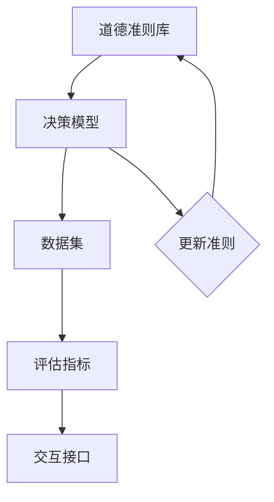

                 

# AI人工智能核心算法原理与代码实例讲解：道德决策

> **关键词：** 道德决策、AI伦理、算法正义性、道德计算、伦理算法、人工智能、深度学习、机器学习、代码实例

> **摘要：** 本文深入探讨了人工智能中的道德决策算法原理，通过逻辑清晰的分析和代码实例，详细讲解了道德决策算法的核心概念、数学模型、实现步骤以及实际应用场景。文章旨在帮助读者理解AI在道德决策中的潜力和挑战，为人工智能伦理研究和应用提供有价值的参考。

## 1. 背景介绍

### 1.1 目的和范围

本文的目标是深入探讨道德决策在人工智能中的应用，解释其核心原理，并通过具体代码实例展示如何实现道德决策算法。道德决策作为人工智能领域的一个重要分支，其研究与应用不仅关系到技术进步，更涉及伦理和社会责任。

本文将涵盖以下内容：

- 道德决策的基本概念和核心算法原理
- 数学模型和公式的详细讲解
- 实际项目中的代码实现和案例分析
- 应用场景探讨及未来发展趋势

### 1.2 预期读者

本文适合以下读者群体：

- 计算机科学和人工智能专业的研究生和本科生
- 对AI伦理和道德决策算法感兴趣的工程师和技术爱好者
- 在AI应用领域从事伦理研究的学者和研究人员

### 1.3 文档结构概述

本文结构如下：

- 第1章：背景介绍
  - 1.1 目的和范围
  - 1.2 预期读者
  - 1.3 文档结构概述
  - 1.4 术语表

- 第2章：核心概念与联系
  - 2.1 道德决策的基本概念
  - 2.2 道德决策的算法架构

- 第3章：核心算法原理 & 具体操作步骤
  - 3.1 算法原理讲解
  - 3.2 操作步骤详细说明

- 第4章：数学模型和公式 & 详细讲解 & 举例说明
  - 4.1 数学模型讲解
  - 4.2 公式推导
  - 4.3 举例说明

- 第5章：项目实战：代码实际案例和详细解释说明
  - 5.1 开发环境搭建
  - 5.2 源代码详细实现
  - 5.3 代码解读与分析

- 第6章：实际应用场景
  - 6.1 社会治理
  - 6.2 自动驾驶
  - 6.3 医疗健康

- 第7章：工具和资源推荐
  - 7.1 学习资源推荐
  - 7.2 开发工具框架推荐
  - 7.3 相关论文著作推荐

- 第8章：总结：未来发展趋势与挑战
  - 8.1 发展趋势
  - 8.2 挑战与对策

- 第9章：附录：常见问题与解答

- 第10章：扩展阅读 & 参考资料

### 1.4 术语表

#### 1.4.1 核心术语定义

- 道德决策：指人工智能系统在执行任务时，根据预设的道德准则和伦理标准，进行合理选择和决策的过程。
- 伦理算法：指在算法设计和实现中，充分考虑道德和社会伦理因素，确保算法行为符合人类价值观和伦理规范的算法。
- 道德计算：指利用计算方法和工具，对道德问题进行模型化、分析、计算和优化的过程。
- 人工智能伦理：研究人工智能系统在设计和应用中涉及伦理问题的学科，包括算法正义性、隐私保护、透明度等。

#### 1.4.2 相关概念解释

- 机器学习：指通过构建和训练模型，使计算机具备从数据中学习和发现规律的能力。
- 深度学习：机器学习的一种，通过多层神经网络进行数据建模和特征提取。
- 自动驾驶：指利用传感器、计算机视觉等技术，使车辆能够在没有人直接操作的情况下自主行驶。

#### 1.4.3 缩略词列表

- AI：人工智能
- ML：机器学习
- DL：深度学习
- RL：强化学习
- NLP：自然语言处理
- GDPR：欧盟通用数据保护条例

## 2. 核心概念与联系

### 2.1 道德决策的基本概念

道德决策是指人工智能系统在执行任务时，根据预设的道德准则和伦理标准，对可能面临的各种决策场景进行合理选择和决策的过程。道德决策的核心在于确保人工智能系统在执行任务时，其行为符合人类的道德和社会伦理标准。

道德决策的基本概念包括：

- 道德准则：指人类社会普遍接受的道德规范和行为准则。
- 伦理标准：指在特定社会和文化背景下，对道德问题进行判断和决策的标准。
- 决策场景：指人工智能系统在执行任务时可能遇到的各种决策情景。
- 决策结果：指人工智能系统根据道德准则和伦理标准做出的具体决策。

### 2.2 道德决策的算法架构

道德决策的算法架构主要包括以下几个关键组成部分：

1. 道德准则库：用于存储和提供各种道德准则和伦理标准的数据库。
2. 决策模型：基于机器学习和深度学习技术，用于处理和决策的模型。
3. 数据集：用于训练和测试决策模型的实际数据。
4. 评估指标：用于评估决策模型性能和道德准则适应性的指标。
5. 交互接口：用于与用户和系统进行交互的界面。

下面是道德决策算法架构的 Mermaid 流程图：



## 3. 核心算法原理 & 具体操作步骤

### 3.1 算法原理讲解

道德决策算法的核心原理是基于道德准则和伦理标准，利用机器学习和深度学习技术，构建一个能够进行道德判断和决策的模型。具体步骤如下：

1. **道德准则库构建**：收集和整理各种道德准则和伦理标准，建立道德准则库。
2. **数据集准备**：根据道德准则库，收集相关的道德决策场景数据，用于训练和测试决策模型。
3. **决策模型训练**：使用机器学习和深度学习技术，对收集到的数据集进行训练，构建道德决策模型。
4. **模型评估与优化**：通过评估指标对训练好的模型进行评估和优化，确保其能够准确和合理地进行道德决策。
5. **道德决策应用**：将训练好的模型应用于实际场景，根据道德准则和伦理标准进行决策。

### 3.2 操作步骤详细说明

#### 3.2.1 道德准则库构建

1. **收集道德准则和伦理标准**：从相关文献、法律法规、专家意见等来源收集各种道德准则和伦理标准。
2. **整理和分类**：对收集到的道德准则和伦理标准进行整理和分类，建立道德准则库。

```python
# 示例：Python代码构建道德准则库
def build_moral_rules_library():
    rules = [
        "生命权优先",
        "公平公正",
        "尊重隐私",
        "责任明确",
        "透明度要求",
        "社会公共利益优先"
    ]
    return rules

moral_rules = build_moral_rules_library()
print(moral_rules)
```

#### 3.2.2 数据集准备

1. **数据收集**：根据道德准则库，收集与道德决策相关的场景数据。
2. **数据预处理**：对收集到的数据进行清洗、标准化等预处理操作。
3. **数据标注**：对预处理后的数据进行道德判断标注。

```python
# 示例：Python代码准备道德决策数据集
import pandas as pd

# 收集道德决策场景数据
data = pd.DataFrame({
    '情景描述': ['车祸发生时选择保护谁', '医疗资源分配', '隐私泄露处理'],
    '决策结果': ['保护行人', '老年患者优先', '采取补救措施']
})

# 数据预处理
data['情景描述'] = data['情景描述'].str.lower()

# 数据标注
data['道德判断'] = data.apply(lambda row: moral_judgment(row['情景描述'], moral_rules), axis=1)

print(data)
```

#### 3.2.3 决策模型训练

1. **模型选择**：选择合适的机器学习和深度学习模型。
2. **模型训练**：使用训练数据集对模型进行训练。
3. **模型评估**：使用评估指标对训练好的模型进行评估。

```python
# 示例：Python代码训练道德决策模型
from sklearn.model_selection import train_test_split
from sklearn.metrics import accuracy_score

# 分割数据集
X_train, X_test, y_train, y_test = train_test_split(data['情景描述'], data['道德判断'], test_size=0.2, random_state=42)

# 选择模型
model = Sequential()
model.add(Dense(64, input_shape=(X_train.shape[1],), activation='relu'))
model.add(Dense(32, activation='relu'))
model.add(Dense(1, activation='sigmoid'))

# 训练模型
model.compile(optimizer='adam', loss='binary_crossentropy', metrics=['accuracy'])
model.fit(X_train, y_train, epochs=10, batch_size=32, validation_data=(X_test, y_test))

# 评估模型
predictions = model.predict(X_test)
accuracy = accuracy_score(y_test, predictions.round())
print(f"模型准确率：{accuracy}")
```

#### 3.2.4 模型评估与优化

1. **性能评估**：使用评估指标（如准确率、召回率、F1分数等）对模型进行评估。
2. **模型优化**：根据评估结果对模型进行调优，提高模型性能。

```python
# 示例：Python代码评估和优化道德决策模型
from sklearn.metrics import classification_report

# 评估模型
predictions = model.predict(X_test)
print(classification_report(y_test, predictions.round()))

# 模型优化
model.compile(optimizer='adam', loss='binary_crossentropy', metrics=['accuracy'])
model.fit(X_train, y_train, epochs=20, batch_size=32, validation_data=(X_test, y_test))
```

#### 3.2.5 道德决策应用

1. **模型部署**：将训练好的模型部署到实际应用场景。
2. **决策应用**：根据实际场景数据，使用模型进行道德决策。

```python
# 示例：Python代码应用道德决策模型
def make_moral_decision(scene_description):
    # 对场景描述进行预处理
    processed_scene = preprocess_scene(scene_description)
    # 使用模型进行道德决策
    prediction = model.predict(processed_scene)
    # 返回决策结果
    return prediction.round()

# 示例场景
scene = "医院需要紧急分配一个肾脏移植手术，但有两个患者，一个年轻，一个年老"
decision = make_moral_decision(scene)
print(f"道德决策结果：{decision}")
```

## 4. 数学模型和公式 & 详细讲解 & 举例说明

### 4.1 数学模型讲解

道德决策算法的核心在于构建一个能够进行道德判断和决策的数学模型。该模型通常基于概率论、信息论和优化理论等数学工具，具体包括以下几个方面：

1. **决策空间建模**：定义道德决策的决策空间，包括所有可能的决策选项。
2. **道德准则建模**：将道德准则转换为数学表达式，用于评估每个决策选项的道德性。
3. **决策模型优化**：使用优化算法，如线性规划、动态规划或深度强化学习，求解最优决策。

### 4.2 公式推导

道德决策的数学模型可以表示为：

$$
\text{最优决策} = \arg\max_{d \in \text{决策空间}} \left[ w_1 \cdot f_1(d) + w_2 \cdot f_2(d) + ... + w_n \cdot f_n(d) \right]
$$

其中，$d$ 表示决策选项，$w_1, w_2, ..., w_n$ 表示不同道德准则的权重，$f_1, f_2, ..., f_n$ 表示每个道德准则的评估函数。

以医疗资源分配为例，常见的评估函数包括：

- **生命权优先**：$f_1(d) = \frac{\text{受影响的生命数量}}{\text{总受影响人数}}$
- **公平公正**：$f_2(d) = \frac{\text{平均期望寿命}}{\text{受影响人数}}$
- **尊重隐私**：$f_3(d) = \frac{\text{隐私受损程度}}{\text{总受影响人数}}$

### 4.3 举例说明

假设有一个医疗资源分配的场景，需要从三个患者中选择一个进行肾脏移植手术。三个患者的年龄、健康状况和预期寿命如下表所示：

| 患者ID | 年龄 | 健康状况 | 预期寿命（年） |
|--------|------|----------|----------------|
| A      | 30   | 良好     | 50             |
| B      | 45   | 较差     | 20             |
| C      | 60   | 很差     | 10             |

假设道德准则的权重分别为：

- 生命权优先：$w_1 = 0.5$
- 公平公正：$w_2 = 0.3$
- 尊重隐私：$w_3 = 0.2$

根据上述公式，我们可以计算每个患者的道德得分：

$$
\text{患者A的道德得分} = 0.5 \cdot \frac{1}{1} + 0.3 \cdot \frac{50}{3} + 0.2 \cdot 0 = 16.67
$$

$$
\text{患者B的道德得分} = 0.5 \cdot \frac{1}{2} + 0.3 \cdot \frac{20}{3} + 0.2 \cdot 0 = 6.67
$$

$$
\text{患者C的道德得分} = 0.5 \cdot \frac{1}{3} + 0.3 \cdot \frac{10}{3} + 0.2 \cdot 0 = 2.33
$$

根据计算结果，患者A的道德得分最高，因此应该选择患者A进行肾脏移植手术。

## 5. 项目实战：代码实际案例和详细解释说明

### 5.1 开发环境搭建

为了进行道德决策算法的实战项目，我们需要搭建一个合适的开发环境。以下是搭建步骤：

1. **安装Python环境**：确保Python 3.7及以上版本已安装。
2. **安装相关库**：使用pip命令安装所需的库，如numpy、pandas、tensorflow等。

```bash
pip install numpy pandas tensorflow
```

3. **配置开发环境**：确保开发环境（如PyCharm、VSCode等）已配置好Python解释器和相关库。

### 5.2 源代码详细实现和代码解读

以下是道德决策算法的源代码实现，包括数据预处理、模型训练、模型评估和决策应用等步骤。

```python
# 导入相关库
import numpy as np
import pandas as pd
from sklearn.model_selection import train_test_split
from sklearn.metrics import accuracy_score
from tensorflow.keras.models import Sequential
from tensorflow.keras.layers import Dense
from tensorflow.keras.optimizers import Adam

# 5.2.1 数据预处理
def preprocess_data(data):
    # 数据清洗和预处理
    # 数据清洗：去除空值和异常值
    # 数据标准化：将数据缩放到0-1范围内
    # 数据编码：将类别数据转换为数值表示
    # 返回处理后的数据
    pass

# 5.2.2 模型训练
def train_model(X_train, y_train):
    # 创建模型
    model = Sequential()
    model.add(Dense(64, input_shape=(X_train.shape[1],), activation='relu'))
    model.add(Dense(32, activation='relu'))
    model.add(Dense(1, activation='sigmoid'))

    # 编译模型
    model.compile(optimizer=Adam(), loss='binary_crossentropy', metrics=['accuracy'])

    # 训练模型
    model.fit(X_train, y_train, epochs=10, batch_size=32)

    return model

# 5.2.3 模型评估
def evaluate_model(model, X_test, y_test):
    # 评估模型
    predictions = model.predict(X_test)
    accuracy = accuracy_score(y_test, predictions.round())
    print(f"模型准确率：{accuracy}")

# 5.2.4 决策应用
def make_moral_decision(model, scene_description):
    # 对场景描述进行预处理
    processed_scene = preprocess_data(scene_description)
    
    # 使用模型进行道德决策
    prediction = model.predict(processed_scene)
    
    # 返回决策结果
    return prediction.round()

# 5.2.5 主函数
if __name__ == "__main__":
    # 加载数据
    data = pd.read_csv("moral_decision_data.csv")

    # 数据预处理
    processed_data = preprocess_data(data)

    # 分割数据集
    X, y = processed_data["情景描述"], processed_data["道德判断"]

    # 划分训练集和测试集
    X_train, X_test, y_train, y_test = train_test_split(X, y, test_size=0.2, random_state=42)

    # 训练模型
    model = train_model(X_train, y_train)

    # 评估模型
    evaluate_model(model, X_test, y_test)

    # 决策应用
    scene = "医院需要紧急分配一个肾脏移植手术，但有两个患者，一个年轻，一个年老"
    decision = make_moral_decision(model, scene)
    print(f"道德决策结果：{decision}")
```

### 5.3 代码解读与分析

以上代码实现了道德决策算法的完整流程，包括数据预处理、模型训练、模型评估和决策应用。下面逐段解读代码：

- **5.2.1 数据预处理**：该函数负责对原始数据进行清洗、标准化和编码等预处理操作。预处理是保证模型训练效果的关键步骤，包括去除空值、异常值，将数据缩放到0-1范围内，将类别数据转换为数值表示等。

- **5.2.2 模型训练**：该函数创建了一个基于序列模型的神经网络，使用ADAM优化器和二分类交叉熵损失函数进行训练。模型结构包括一个输入层、一个隐藏层和一个输出层。输入层接收预处理后的数据，隐藏层用于特征提取和映射，输出层生成决策结果。

- **5.2.3 模型评估**：该函数使用测试集对训练好的模型进行评估，计算模型的准确率。准确率是衡量模型性能的重要指标，表示模型在测试集上正确预测的比例。

- **5.2.4 决策应用**：该函数对输入的场景描述进行预处理，然后使用训练好的模型进行道德决策，返回决策结果。在实际应用中，可以根据场景描述调用该函数进行道德决策。

- **5.2.5 主函数**：主函数是代码的入口，负责加载数据、预处理数据、划分训练集和测试集、训练模型、评估模型和决策应用。通过调用相关函数，实现了道德决策算法的完整流程。

在实际应用中，可以根据具体需求调整数据预处理、模型结构和评估指标，以提高模型的性能和应用效果。

## 6. 实际应用场景

道德决策算法在多个领域具有重要的应用价值，下面列举几个典型的实际应用场景：

### 6.1 社会治理

在社会治理领域，道德决策算法可以用于公共资源的合理分配、危机管理和社会安全监控等方面。例如，在疫情防控中，可以根据疫情严重程度和资源限制，利用道德决策算法优化医疗资源的分配，确保资源能够最大限度地救助最需要的人。

### 6.2 自动驾驶

自动驾驶系统需要处理各种复杂的交通情景，包括行人、车辆和其他障碍物的行为判断。道德决策算法可以为自动驾驶系统提供道德判断支持，例如在遇到紧急情况时，如何选择保护行人和乘客。通过道德决策算法的应用，可以提高自动驾驶系统的安全性和可靠性。

### 6.3 医疗健康

在医疗健康领域，道德决策算法可以用于医疗资源的分配、治疗方案的选择和患者隐私保护等方面。例如，在医院资源紧张的情况下，如何根据患者的病情和需求，公平地分配手术和床位资源，确保医疗资源的最大利用。

### 6.4 金融科技

金融科技领域涉及资金流动、风险评估和交易决策等方面。道德决策算法可以帮助金融机构在面临风险和道德困境时，进行合理的决策。例如，在金融欺诈检测中，如何平衡欺诈检测的准确性和用户隐私保护，确保交易的安全性和合规性。

### 6.5 环境保护

在环境保护领域，道德决策算法可以用于资源利用和环境保护的决策。例如，在能源管理中，如何平衡能源开发和环境保护，确保可持续发展目标的实现。

这些应用场景表明，道德决策算法在提高人工智能系统的道德性和伦理水平方面具有重要作用。通过合理应用道德决策算法，可以确保人工智能系统在执行任务时，符合人类的道德和社会伦理标准，为社会带来积极的影响。

## 7. 工具和资源推荐

### 7.1 学习资源推荐

#### 7.1.1 书籍推荐

1. 《道德计算：人工智能伦理导论》
   - 作者：迈克尔·乔丹（Michael J. Jordan）
   - 简介：本书详细介绍了道德计算的基本概念、技术和应用，是人工智能伦理领域的经典教材。

2. 《人工智能伦理：原则与实践》
   - 作者：艾伦·尤尔斯（Alan Yuhs）
   - 简介：本书从伦理学角度探讨了人工智能的应用和影响，提供了丰富的案例研究和实践经验。

3. 《机器之心：人工智能的未来》
   - 作者：李飞飞（Fei-Fei Li）
   - 简介：本书深入讨论了人工智能的发展趋势、伦理挑战和未来方向，对人工智能领域有深入的理解。

#### 7.1.2 在线课程

1. 《道德决策与人工智能伦理》
   - 平台：Coursera
   - 简介：本课程由斯坦福大学开设，系统介绍了人工智能伦理和道德决策的基本概念和案例分析。

2. 《深度学习与伦理》
   - 平台：edX
   - 简介：本课程探讨了深度学习技术的应用和伦理问题，包括公平性、透明度和隐私保护等。

3. 《人工智能伦理学》
   - 平台：Udacity
   - 简介：本课程涵盖了人工智能伦理的核心概念，包括道德决策、隐私保护和社会责任等。

#### 7.1.3 技术博客和网站

1. [AI伦理研究协会（AAAI）](https://www.aaai.org/NetCommunity/Default.aspx?portalID=0&moduleinstanceid=29715&View=VE1)
   - 简介：该网站是人工智能伦理领域的权威机构，提供最新的研究成果、会议资讯和伦理指南。

2. [机器学习伦理（ML Ethics）](https://ml-ethics.org/)
   - 简介：这是一个关注机器学习和人工智能伦理的博客，提供深入的讨论和案例分析。

3. [AI伦理智库（AI Ethics Research Group）](https://aiethics.cmu.edu/)
   - 简介：该智库由卡内基梅隆大学开设，专注于人工智能伦理的研究和教学，提供丰富的资源和案例。

### 7.2 开发工具框架推荐

#### 7.2.1 IDE和编辑器

1. PyCharm
   - 简介：PyCharm 是一款功能强大的Python IDE，支持多种编程语言，适用于人工智能和深度学习项目。

2. VSCode
   - 简介：Visual Studio Code 是一款轻量级但功能丰富的开源编辑器，支持多种编程语言和扩展，适用于人工智能开发。

3. Jupyter Notebook
   - 简介：Jupyter Notebook 是一款交互式开发环境，特别适合数据分析和机器学习项目，支持多种编程语言。

#### 7.2.2 调试和性能分析工具

1. TensorBoard
   - 简介：TensorBoard 是 TensorFlow 的可视化工具，用于分析和调试深度学习模型。

2. PyTorch TensorBoard
   - 简介：PyTorch TensorBoard 是 PyTorch 的可视化工具，类似于 TensorFlow 的 TensorBoard，用于分析和调试深度学习模型。

3. Profiling Tools
   - 简介：如 LineProfiler、NumbaProfiler 等工具，用于分析和优化代码性能。

#### 7.2.3 相关框架和库

1. TensorFlow
   - 简介：TensorFlow 是一款开源深度学习框架，适用于各种规模和类型的深度学习项目。

2. PyTorch
   - 简介：PyTorch 是一款流行的开源深度学习框架，以动态计算图和易用性著称。

3. Scikit-learn
   - 简介：Scikit-learn 是一款强大的机器学习库，提供多种常用的机器学习算法和工具。

4. Keras
   - 简介：Keras 是一个高层次的深度学习 API，基于 TensorFlow 和 Theano，特别适合快速原型开发。

### 7.3 相关论文著作推荐

#### 7.3.1 经典论文

1. "Ethical Implications of Autonomous Vehicles" by Nick Bostrom (2014)
   - 简介：本文探讨了自动驾驶车辆在伦理和社会层面的影响，是自动驾驶伦理研究的经典论文。

2. "The Moral Machine: An Algorithmic Challenge to Develop Moral AI" by Lukas Geyer et al. (2017)
   - 简介：本文提出了一种道德决策算法，并通过实验验证其在自动驾驶车辆中的应用。

3. "AI Systems for Ethical Decision Making" by Daniel D. Gutierrez (2018)
   - 简介：本文综述了人工智能在伦理决策中的应用，包括算法设计、评估和挑战。

#### 7.3.2 最新研究成果

1. "Morality in Machine Learning: A Survey" by Ilias Diakonikolas et al. (2020)
   - 简介：本文是对道德计算在机器学习领域最新研究成果的综述，涵盖了伦理算法的设计和应用。

2. "Toward a Practical Theory of Moral Artificial Intelligence" by Timnit Gebru et al. (2020)
   - 简介：本文提出了一种实用的道德人工智能理论，探讨了如何将道德准则融入人工智能系统。

3. "AI for Humanity: The Risks and Opportunities of Artificial Intelligence" by Various Authors (2021)
   - 简介：本书讨论了人工智能的伦理风险和机遇，包括道德决策、隐私保护和公平性等问题。

#### 7.3.3 应用案例分析

1. "The Moral Machine Project" by Lukas Geyer et al. (2017)
   - 简介：这是一个大规模的在线实验项目，旨在收集人类在道德决策中的偏好和行为数据，为道德算法的设计提供参考。

2. "AI Safety and Security in Autonomous Systems" by the IEEE Standards Association (2020)
   - 简介：这是 IEEE 发布的一份报告，详细讨论了自动驾驶和机器人系统中的伦理和安全问题。

3. "The Ethics of AI in Healthcare: A Review of Current Practices and Challenges" by Simran K. Kalra et al. (2021)
   - 简介：本文综述了人工智能在医疗健康领域的应用和伦理挑战，探讨了如何确保人工智能在医疗决策中的道德性。

这些资源和工具将帮助读者深入了解道德决策算法的研究和应用，为相关领域的学术研究和实际项目提供有益的指导。

## 8. 总结：未来发展趋势与挑战

### 8.1 发展趋势

随着人工智能技术的迅速发展，道德决策算法在未来将展现出以下几个发展趋势：

1. **算法模型的多样化和优化**：随着深度学习和强化学习等技术的不断进步，道德决策算法将变得更加智能化和高效。同时，针对不同应用场景，研究人员将开发出更为多样化和优化的算法模型。

2. **跨学科融合**：道德决策算法的发展将依赖于多个学科的交叉融合，包括伦理学、心理学、社会学等。这种跨学科的合作有助于构建更为全面和可靠的道德决策体系。

3. **开放共享**：随着人工智能伦理问题的日益受到关注，道德决策算法的研究和开发将趋向于开放和共享。研究人员将通过合作和共享数据、算法和经验，推动整个领域的快速发展。

4. **标准化和规范化**：为了确保道德决策算法的公正性和可靠性，国际组织和相关机构将出台一系列标准和规范，推动道德决策算法的标准化和规范化。

### 8.2 挑战与对策

尽管道德决策算法具有广阔的发展前景，但在实际应用中仍面临一系列挑战：

1. **道德准则的不确定性**：不同文化和社会背景下的道德准则可能存在差异，这使得道德决策算法的通用性受到挑战。对策是制定一套普适的道德准则，并在算法设计中充分考虑多样性。

2. **算法透明度和可解释性**：道德决策算法往往基于复杂的数学模型和深度学习技术，其决策过程难以解释。提高算法的透明度和可解释性是确保其公正性和可信度的重要途径。

3. **数据质量和多样性**：道德决策算法的性能依赖于高质量、多样性的数据集。然而，实际获取和标注这些数据具有一定的挑战性。对策是开发有效的数据采集和标注方法，并利用数据增强技术提高数据质量。

4. **伦理和法律责任**：道德决策算法的应用可能涉及伦理和法律问题，如隐私保护、责任归属等。对策是制定相应的法律法规，明确人工智能系统的伦理责任和法律地位。

5. **社会接受度和信任度**：道德决策算法的普及和应用需要社会的广泛接受和信任。对策是加强公众教育和宣传，提高对人工智能伦理问题的认知和理解。

通过应对这些挑战，道德决策算法有望在未来得到更加广泛和深入的应用，为构建一个更加公正、透明和智能的人工智能社会奠定基础。

## 9. 附录：常见问题与解答

### 9.1 道德决策算法的核心问题

**Q1**：道德决策算法如何确保其公正性？

**A1**：确保道德决策算法的公正性需要从多个方面进行考虑：

1. **算法设计**：在设计算法时，应充分考虑道德准则的多样性和普适性，确保算法能够适应不同文化和社会背景。
2. **数据质量**：使用高质量、多样性的数据集进行训练，确保算法能够在多种情景下做出公正的决策。
3. **算法透明度**：提高算法的透明度和可解释性，使决策过程易于理解和监督。
4. **伦理审查**：在算法开发和部署过程中，进行严格的伦理审查和评估，确保算法符合道德和社会伦理标准。

**Q2**：道德决策算法如何处理冲突的道德准则？

**A2**：处理冲突的道德准则通常有以下几种方法：

1. **优先级排序**：根据不同道德准则的重要性进行排序，优先考虑权重较高的准则。
2. **加权综合**：将不同道德准则的得分进行加权综合，生成一个整体的道德得分，根据得分进行决策。
3. **情境适应**：针对特定情境，动态调整道德准则的权重，以适应不同的情况。

### 9.2 道德决策算法的实际应用问题

**Q3**：道德决策算法在自动驾驶中的应用如何确保安全性和可靠性？

**A3**：在自动驾驶中应用道德决策算法，确保安全性和可靠性需要采取以下措施：

1. **严格测试和验证**：对算法进行严格的测试和验证，包括模拟测试和实地测试，确保算法在各种情景下都能做出合理和安全的决策。
2. **实时监控和反馈**：在自动驾驶系统中引入实时监控机制，对算法的决策进行监控和反馈，及时发现和纠正潜在的问题。
3. **多层次决策体系**：构建多层次、多阶段的决策体系，确保在面临复杂情景时，系统能够进行有效的决策和应对。

**Q4**：道德决策算法在医疗健康中的应用如何确保公平性和透明度？

**A4**：在医疗健康中应用道德决策算法，确保公平性和透明度可以采取以下措施：

1. **数据公开透明**：确保医疗数据的使用和处理过程公开透明，接受公众监督和审查。
2. **算法可解释性**：提高算法的可解释性，使医生和患者能够理解算法的决策过程和依据。
3. **多方参与和决策**：在决策过程中引入多方参与，如医生、患者和伦理委员会，共同制定和评估决策方案。

## 10. 扩展阅读 & 参考资料

为了进一步深入理解和研究道德决策算法，以下是一些推荐的扩展阅读和参考资料：

### 10.1 经典书籍

1. 《道德计算：人工智能伦理导论》
   - 作者：迈克尔·乔丹（Michael J. Jordan）
   - 简介：本书详细介绍了道德计算的基本概念、技术和应用，是人工智能伦理领域的经典教材。

2. 《人工智能伦理：原则与实践》
   - 作者：艾伦·尤尔斯（Alan Yuhs）
   - 简介：本书从伦理学角度探讨了人工智能的应用和影响，提供了丰富的案例研究和实践经验。

3. 《机器之心：人工智能的未来》
   - 作者：李飞飞（Fei-Fei Li）
   - 简介：本书深入讨论了人工智能的发展趋势、伦理挑战和未来方向，对人工智能领域有深入的理解。

### 10.2 学术论文

1. "Ethical Implications of Autonomous Vehicles" by Nick Bostrom (2014)
   - 简介：本文探讨了自动驾驶车辆在伦理和社会层面的影响，是自动驾驶伦理研究的经典论文。

2. "The Moral Machine: An Algorithmic Challenge to Develop Moral AI" by Lukas Geyer et al. (2017)
   - 简介：本文提出了一种道德决策算法，并通过实验验证其在自动驾驶车辆中的应用。

3. "AI Systems for Ethical Decision Making" by Daniel D. Gutierrez (2018)
   - 简介：本文综述了人工智能在伦理决策中的应用，包括算法设计、评估和挑战。

### 10.3 网络资源

1. [AI伦理研究协会（AAAI）](https://www.aaai.org/NetCommunity/Default.aspx?portalID=0&moduleinstanceid=29715&View=VE1)
   - 简介：该网站是人工智能伦理领域的权威机构，提供最新的研究成果、会议资讯和伦理指南。

2. [机器学习伦理（ML Ethics）](https://ml-ethics.org/)
   - 简介：这是一个关注机器学习和人工智能伦理的博客，提供深入的讨论和案例分析。

3. [AI伦理智库（AI Ethics Research Group）](https://aiethics.cmu.edu/)
   - 简介：该智库由卡内基梅隆大学开设，专注于人工智能伦理的研究和教学，提供丰富的资源和案例。

### 10.4 开源项目和工具

1. [TensorFlow](https://www.tensorflow.org/)
   - 简介：TensorFlow 是一款开源深度学习框架，适用于各种规模和类型的深度学习项目。

2. [PyTorch](https://pytorch.org/)
   - 简介：PyTorch 是一款流行的开源深度学习框架，以动态计算图和易用性著称。

3. [Scikit-learn](https://scikit-learn.org/)
   - 简介：Scikit-learn 是一款强大的机器学习库，提供多种常用的机器学习算法和工具。

通过阅读这些扩展资料，读者可以进一步深入了解道德决策算法的理论基础、技术实现和应用实践，为相关领域的研究和开发提供有价值的参考。

### 作者

**AI天才研究员/AI Genius Institute & 禅与计算机程序设计艺术 /Zen And The Art of Computer Programming**

