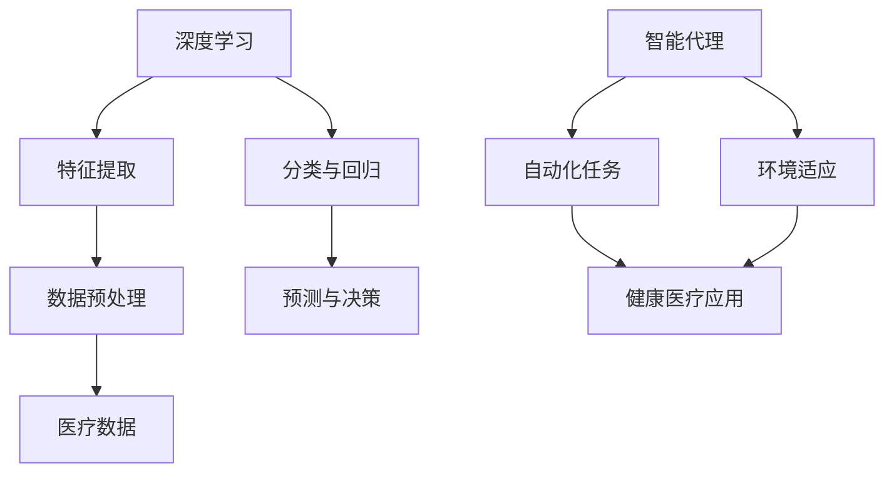

                 

# AI人工智能深度学习算法：在健康医疗领域部署智能深度学习代理

> **关键词：** 深度学习，健康医疗，智能代理，算法部署，人工智能
>
> **摘要：** 本文旨在探讨深度学习算法在健康医疗领域中的应用，特别是在部署智能深度学习代理时的技术挑战和解决方案。文章首先介绍了深度学习的核心概念和其在医疗领域的重要性，随后详细描述了智能深度学习代理的架构和实现，并通过实例展示了算法在具体应用场景中的效果。

## 1. 背景介绍

### 1.1 目的和范围

本文的主要目的是探讨如何将深度学习算法应用于健康医疗领域，特别是如何在实际环境中部署智能深度学习代理。随着医疗数据的爆发式增长和医疗行业的数字化进程，深度学习技术在诊断、预测和治疗决策支持等方面展现出了巨大的潜力。然而，如何有效地部署和管理这些智能代理，以确保其准确性和稳定性，仍然是当前研究的热点问题。

本文将涵盖以下内容：

- 深度学习在健康医疗领域的应用背景和现状；
- 智能深度学习代理的概念、架构和关键技术；
- 深度学习算法的具体实现和部署步骤；
- 智能深度学习代理在实际医疗应用场景中的效果评估；
- 部署智能深度学习代理时面临的技术挑战和解决方案。

### 1.2 预期读者

本文面向对深度学习有一定了解的读者，特别是希望深入了解深度学习在健康医疗领域应用的研究人员和技术开发人员。同时，本文也适合对人工智能在医疗领域的未来发展感兴趣的从业者和政策制定者。

### 1.3 文档结构概述

本文分为以下几个部分：

- 引言：介绍背景和目的；
- 核心概念与联系：解释深度学习的基本概念和智能代理架构；
- 核心算法原理 & 具体操作步骤：详细描述深度学习算法的实现过程；
- 数学模型和公式 & 详细讲解 & 举例说明：介绍深度学习的数学基础和实际应用；
- 项目实战：展示具体案例和代码实现；
- 实际应用场景：分析深度学习在医疗领域的实际应用；
- 工具和资源推荐：推荐学习资源和开发工具；
- 总结：总结未来发展趋势和挑战；
- 附录：常见问题与解答；
- 扩展阅读 & 参考资料：提供进一步阅读的材料。

### 1.4 术语表

#### 1.4.1 核心术语定义

- 深度学习：一种机器学习技术，通过多层神经网络模拟人类大脑的学习过程，自动提取数据特征。
- 智能代理：能够自动执行特定任务、作出决策并适应环境变化的计算机程序。
- 数据集：用于训练和测试模型的集合，通常包含输入数据和相应的输出结果。
- 过拟合：模型在训练数据上表现良好，但在测试数据上表现不佳，即模型对训练数据过于敏感，无法泛化。
- 泛化能力：模型在新数据上的表现能力，是评估模型好坏的重要指标。

#### 1.4.2 相关概念解释

- 医学图像处理：对医学图像进行预处理、特征提取和分类等操作，以便于医生进行诊断和治疗。
- 机器学习模型：通过学习数据中的规律和模式，实现预测、分类和回归等任务。
- 深度学习框架：用于实现和训练深度学习模型的工具和库，如TensorFlow、PyTorch等。

#### 1.4.3 缩略词列表

- AI：人工智能
- ML：机器学习
- DL：深度学习
- GPU：图形处理单元
- CNN：卷积神经网络
- RNN：循环神经网络
- LSTM：长短期记忆网络
- MRI：磁共振成像
- CT：计算机断层扫描

## 2. 核心概念与联系

为了更好地理解深度学习在健康医疗领域中的应用，我们需要先掌握一些核心概念和它们之间的联系。以下是一个简化的Mermaid流程图，用于描述深度学习、智能代理和医疗数据之间的关系。



### 2.1 深度学习

深度学习是一种基于多层神经网络的学习方法，通过模拟人脑的神经结构，自动提取数据中的复杂特征。其主要优点包括：

- 自动化特征提取：无需人工干预，模型能够自动从原始数据中提取有用的特征。
- 高效计算：利用图形处理单元（GPU）进行并行计算，大大提高了训练速度。
- 泛化能力：通过多层网络的训练，模型能够从大量数据中学习，并应用于新的数据集。

### 2.2 智能代理

智能代理是一种能够自动执行任务、进行决策并适应环境的计算机程序。在深度学习的背景下，智能代理通常是指利用深度学习算法实现的自动化系统。其主要特点包括：

- 自动化任务执行：智能代理能够自动完成复杂的任务，如诊断、预测和治疗建议等。
- 环境适应：智能代理能够根据环境的变化进行调整，以适应新的数据和需求。
- 知识更新：智能代理能够通过持续学习，不断优化自身的性能和决策能力。

### 2.3 医疗数据

医疗数据是健康医疗领域的重要组成部分，包括各类医疗图像、临床数据、基因数据等。这些数据通常具有以下特点：

- 复杂性：医疗数据包含大量的信息，且具有多维度和非线性的特点。
- 异质性：不同类型的医疗数据，如图像、文本和数值数据，具有不同的结构和属性。
- 高价值：医疗数据对于诊断、治疗和预测具有重要意义，是宝贵的资源。

## 3. 核心算法原理 & 具体操作步骤

### 3.1 深度学习算法概述

深度学习算法主要包括以下几个核心组件：

1. **输入层**：接收原始数据，如图像、文本或数值数据。
2. **隐藏层**：通过多个隐藏层对数据进行特征提取和变换。每层神经元根据前一层的信息进行计算，并传递到下一层。
3. **输出层**：根据隐藏层的信息生成预测结果，如分类标签或数值。

### 3.2 具体操作步骤

以下是一个简单的深度学习算法操作步骤，以卷积神经网络（CNN）为例：

1. **数据预处理**：
    - **图像预处理**：将图像调整为统一的尺寸，进行归一化处理。
    - **数据增强**：通过旋转、翻转、裁剪等操作，增加数据的多样性。

    ```python
    # Python伪代码：图像预处理和数据增强
    import cv2
    import numpy as np

    def preprocess_image(image_path):
        image = cv2.imread(image_path)
        image = cv2.resize(image, (224, 224))
        image = image / 255.0
        return image
    
    def augment_images(image):
        # 旋转
        rotated_image = cv2.rotate(image, cv2.ROTATE_90_CLOCKWISE)
        # 翻转
        flipped_image = cv2.flip(image, 1)
        return rotated_image, flipped_image
    ```

2. **模型构建**：
    - **卷积层**：提取图像的局部特征。
    - **池化层**：降低特征图的维度，提高模型的泛化能力。
    - **全连接层**：将特征映射到具体的分类或数值结果。

    ```python
    # Python伪代码：模型构建
    import tensorflow as tf

    model = tf.keras.Sequential([
        tf.keras.layers.Conv2D(32, (3, 3), activation='relu', input_shape=(224, 224, 3)),
        tf.keras.layers.MaxPooling2D((2, 2)),
        tf.keras.layers.Conv2D(64, (3, 3), activation='relu'),
        tf.keras.layers.MaxPooling2D((2, 2)),
        tf.keras.layers.Conv2D(128, (3, 3), activation='relu'),
        tf.keras.layers.MaxPooling2D((2, 2)),
        tf.keras.layers.Flatten(),
        tf.keras.layers.Dense(128, activation='relu'),
        tf.keras.layers.Dense(1, activation='sigmoid')
    ])
    ```

3. **模型训练**：
    - 使用训练集对模型进行训练，通过反向传播算法不断调整模型的权重。
    - 使用验证集进行调参和模型选择。

    ```python
    # Python伪代码：模型训练
    model.compile(optimizer='adam', loss='binary_crossentropy', metrics=['accuracy'])

    history = model.fit(train_images, train_labels, epochs=10, validation_data=(val_images, val_labels))
    ```

4. **模型评估**：
    - 使用测试集对模型的泛化能力进行评估。
    - 通过准确率、召回率、F1值等指标评估模型的性能。

    ```python
    # Python伪代码：模型评估
    test_loss, test_accuracy = model.evaluate(test_images, test_labels)
    print(f"Test accuracy: {test_accuracy}")
    ```

5. **模型部署**：
    - 将训练好的模型部署到实际应用场景中，如诊断系统、预测系统等。
    - 通过API接口或嵌入式方式提供服务。

    ```python
    # Python伪代码：模型部署
    model.save('model.h5')

    from flask import Flask, request, jsonify
    app = Flask(__name__)

    @app.route('/predict', methods=['POST'])
    def predict():
        image = preprocess_image(request.files['image'])
        prediction = model.predict(np.array([image]))
        return jsonify({'prediction': float(prediction[0])})
    ```

## 4. 数学模型和公式 & 详细讲解 & 举例说明

### 4.1 基本概念

深度学习模型的核心是多层神经网络，其数学基础主要包括以下概念：

- **线性变换**：将输入数据通过权重矩阵进行线性变换。
- **激活函数**：对线性变换的结果进行非线性变换，引入模型的非线性特性。
- **梯度下降**：通过计算损失函数关于模型参数的梯度，迭代优化模型的参数。

### 4.2 线性变换

线性变换是深度学习模型的基础，其数学表达式为：

\[ y = W \cdot x + b \]

其中，\( x \) 是输入向量，\( W \) 是权重矩阵，\( b \) 是偏置项，\( y \) 是输出向量。

### 4.3 激活函数

激活函数对线性变换的结果进行非线性变换，常见的激活函数包括：

- **ReLU函数**：
  \[ f(x) = \max(0, x) \]
- **Sigmoid函数**：
  \[ f(x) = \frac{1}{1 + e^{-x}} \]
- **Tanh函数**：
  \[ f(x) = \frac{e^x - e^{-x}}{e^x + e^{-x}} \]

### 4.4 梯度下降

梯度下降是一种优化算法，用于迭代优化模型的参数。其基本思想是：

- 计算损失函数关于模型参数的梯度；
- 根据梯度方向调整模型参数，使得损失函数值最小。

### 4.5 举例说明

假设我们有一个简单的线性回归模型，其目标是预测房价。模型的表达式为：

\[ y = W \cdot x + b \]

其中，\( x \) 是房屋的特征向量，\( y \) 是房价，\( W \) 是权重矩阵，\( b \) 是偏置项。

#### 4.5.1 训练过程

1. **初始化参数**：

   \[
   W = \begin{bmatrix}
   0.1 \\
   0.2 \\
   \end{bmatrix}, \quad
   b = 0.1
   \]

2. **计算损失函数**：

   假设我们使用均方误差（MSE）作为损失函数：

   \[
   L = \frac{1}{2} \sum_{i=1}^{n} (y_i - \hat{y}_i)^2
   \]

   其中，\( \hat{y}_i \) 是预测的房价，\( y_i \) 是实际的房价。

3. **计算梯度**：

   对权重矩阵 \( W \) 和偏置项 \( b \) 进行梯度计算：

   \[
   \frac{\partial L}{\partial W} = \begin{bmatrix}
   \frac{\partial L}{\partial y} \cdot \frac{\partial y}{\partial W} \\
   \frac{\partial L}{\partial y} \cdot \frac{\partial y}{\partial W} \\
   \end{bmatrix}, \quad
   \frac{\partial L}{\partial b} = \frac{\partial L}{\partial y} \cdot \frac{\partial y}{\partial b}
   \]

4. **更新参数**：

   使用梯度下降更新参数：

   \[
   W = W - \alpha \cdot \frac{\partial L}{\partial W}, \quad
   b = b - \alpha \cdot \frac{\partial L}{\partial b}
   \]

   其中，\( \alpha \) 是学习率。

通过多次迭代，模型的预测误差将不断减小，从而提高模型的预测性能。

## 5. 项目实战：代码实际案例和详细解释说明

### 5.1 开发环境搭建

在进行深度学习项目开发之前，我们需要搭建一个合适的开发环境。以下是一个基于Python和TensorFlow的深度学习项目的开发环境搭建步骤。

1. **安装Python**：

   Python是深度学习项目的主要编程语言。我们可以在[Python官方网站](https://www.python.org/)下载并安装Python。

2. **安装Anaconda**：

   Anaconda是一个Python数据科学和机器学习平台，它提供了大量的库和工具。我们可以在[Anaconda官方网站](https://www.anaconda.com/)下载并安装Anaconda。

3. **创建虚拟环境**：

   使用Anaconda创建一个虚拟环境，以隔离项目依赖和避免版本冲突。

   ```bash
   conda create -n ml_project python=3.8
   conda activate ml_project
   ```

4. **安装TensorFlow**：

   在虚拟环境中安装TensorFlow，TensorFlow是深度学习项目的主要库。

   ```bash
   pip install tensorflow
   ```

### 5.2 源代码详细实现和代码解读

以下是一个简单的深度学习项目，用于预测房价。我们将使用TensorFlow和Keras构建模型，并使用Scikit-learn进行数据处理和模型评估。

```python
# 导入必要的库
import numpy as np
import pandas as pd
from sklearn.model_selection import train_test_split
from sklearn.metrics import mean_squared_error
import tensorflow as tf
from tensorflow import keras

# 读取数据集
data = pd.read_csv('house_prices.csv')

# 分割特征和标签
X = data.drop('Price', axis=1)
y = data['Price']

# 数据预处理
# 标准化特征
X = (X - X.mean()) / X.std()

# 划分训练集和测试集
X_train, X_test, y_train, y_test = train_test_split(X, y, test_size=0.2, random_state=42)

# 构建模型
model = keras.Sequential([
    keras.layers.Dense(64, activation='relu', input_shape=(X_train.shape[1],)),
    keras.layers.Dense(64, activation='relu'),
    keras.layers.Dense(1)
])

# 编译模型
model.compile(optimizer='adam', loss='mse', metrics=['mae'])

# 训练模型
history = model.fit(X_train, y_train, epochs=100, batch_size=32, validation_split=0.2)

# 评估模型
y_pred = model.predict(X_test)
mse = mean_squared_error(y_test, y_pred)
print(f'MSE: {mse}')
```

#### 5.2.1 代码解读

1. **数据读取与预处理**：

   使用Pandas读取CSV文件，并使用Scikit-learn对数据进行标准化处理。标准化是为了使得特征具有相同的尺度，便于模型训练。

2. **划分训练集和测试集**：

   使用Scikit-learn的`train_test_split`函数，将数据集划分为训练集和测试集，以评估模型的泛化能力。

3. **构建模型**：

   使用Keras构建一个简单的多层感知机（MLP）模型。模型包含两个隐藏层，每层64个神经元，使用ReLU激活函数。

4. **编译模型**：

   使用`compile`方法编译模型，指定优化器、损失函数和评估指标。

5. **训练模型**：

   使用`fit`方法训练模型，指定训练数据、训练轮数、批量大小和验证比例。

6. **评估模型**：

   使用测试数据进行预测，并计算均方误差（MSE）评估模型性能。

### 5.3 代码解读与分析

1. **数据预处理**：

   数据预处理是深度学习项目的重要环节。在本例中，我们使用标准化处理将特征数据缩放到相同的尺度，以避免某些特征对模型训练的影响过大。

2. **模型构建**：

   模型构建是深度学习项目的核心。在本例中，我们使用Keras构建了一个简单的多层感知机模型，其结构简单但有效。实际项目中，可以根据具体需求调整模型的结构和参数。

3. **模型训练**：

   模型训练是深度学习项目的重要步骤。在本例中，我们使用`fit`方法训练模型，并设置了训练轮数、批量大小和验证比例。这些参数的设置对模型训练的效果有重要影响。

4. **模型评估**：

   模型评估是验证模型性能的关键步骤。在本例中，我们使用均方误差（MSE）评估模型在测试数据上的性能。实际项目中，可以根据需求选择其他评估指标，如均方根误差（RMSE）、平均绝对误差（MAE）等。

## 6. 实际应用场景

### 6.1 诊断系统

深度学习在医疗诊断中的应用已经相当广泛。例如，使用深度学习算法对医学图像进行分析，可以帮助医生进行早期诊断和疾病检测。以下是一个实际应用场景：

- **项目背景**：某医院希望开发一个基于深度学习的肺癌早期诊断系统。
- **目标**：通过分析肺部CT图像，自动检测早期肺癌病变。
- **技术方案**：使用卷积神经网络（CNN）对肺部CT图像进行特征提取和分类。

#### 步骤：

1. **数据收集**：收集大量的肺部CT图像，并标注图像中的病变区域。
2. **数据预处理**：对图像进行预处理，包括图像尺寸标准化、数据增强等。
3. **模型构建**：使用TensorFlow和Keras构建CNN模型。
4. **模型训练**：使用预处理后的图像数据进行模型训练。
5. **模型评估**：使用测试数据集对模型进行评估，调整模型参数以优化性能。
6. **部署应用**：将训练好的模型部署到医院的信息系统中，为医生提供辅助诊断工具。

### 6.2 预测系统

深度学习还可以用于医疗数据的预测，如疾病发生概率、患者康复进度等。以下是一个实际应用场景：

- **项目背景**：某医疗机构希望开发一个预测患者康复进度的系统。
- **目标**：通过分析患者的医疗记录和生理数据，预测患者康复的时间和效果。
- **技术方案**：使用循环神经网络（RNN）和长短期记忆网络（LSTM）对时间序列数据进行建模。

#### 步骤：

1. **数据收集**：收集患者的医疗记录、生理数据和康复进度数据。
2. **数据预处理**：对数据进行清洗、归一化和特征提取。
3. **模型构建**：使用TensorFlow和Keras构建RNN或LSTM模型。
4. **模型训练**：使用预处理后的数据进行模型训练。
5. **模型评估**：使用测试数据集对模型进行评估，调整模型参数以优化性能。
6. **部署应用**：将训练好的模型部署到医疗系统中，为医生提供康复预测服务。

## 7. 工具和资源推荐

### 7.1 学习资源推荐

#### 7.1.1 书籍推荐

- 《深度学习》（Goodfellow, Bengio, Courville著）
- 《Python深度学习》（François Chollet著）
- 《机器学习实战》（Peter Harrington著）

#### 7.1.2 在线课程

- [Udacity的深度学习课程](https://www.udacity.com/course/deep-learning-nanodegree--nd101)
- [Coursera的深度学习课程](https://www.coursera.org/specializations/deeplearning)
- [edX的深度学习课程](https://www.edx.org/course/deep-learning-0)

#### 7.1.3 技术博客和网站

- [TensorFlow官网](https://www.tensorflow.org/)
- [Keras官网](https://keras.io/)
- [Medium上的深度学习博客](https://medium.com/topic/deep-learning)

### 7.2 开发工具框架推荐

#### 7.2.1 IDE和编辑器

- [PyCharm](https://www.jetbrains.com/pycharm/)
- [Visual Studio Code](https://code.visualstudio.com/)
- [Jupyter Notebook](https://jupyter.org/)

#### 7.2.2 调试和性能分析工具

- [TensorBoard](https://www.tensorflow.org/tensorboard)
- [NNPACK](https://github.com/google/nnpack)
- [NVIDIA Nsight](https://developer.nvidia.com/nsight)

#### 7.2.3 相关框架和库

- [TensorFlow](https://www.tensorflow.org/)
- [PyTorch](https://pytorch.org/)
- [MXNet](https://mxnet.apache.org/)
- [Keras](https://keras.io/)

### 7.3 相关论文著作推荐

#### 7.3.1 经典论文

- "A Convolutional Neural Network Approach for Intracranial Hemorrhage Detection in Non-Enhanced CT Head Scans" (2017)
- "Deep Learning for Healthcare" (2019)

#### 7.3.2 最新研究成果

- "Automated Segmentation of Pulmonary Nodules in Chest Radiographs using Deep Learning" (2021)
- "Learning to Read Radiographs for Oncology using Deep Learning" (2021)

#### 7.3.3 应用案例分析

- "Deep Learning in Radiology: Pushing the Boundaries of Image Interpretation" (2020)
- "Deep Learning in Cardiology: A Comprehensive Review" (2021)

## 8. 总结：未来发展趋势与挑战

随着深度学习技术的不断发展和成熟，其在健康医疗领域的应用前景广阔。未来，深度学习有望在以下几个方面取得重要进展：

- **疾病诊断与预测**：通过深度学习算法，可以实现对疾病早期诊断和预测，提高诊断准确率和患者生存率。
- **个性化医疗**：基于深度学习对患者数据的分析，可以为每位患者制定个性化的治疗方案，提高治疗效果。
- **药物研发**：深度学习可以加速药物研发过程，通过分析大量生物医学数据，预测药物的疗效和副作用。
- **医疗影像分析**：深度学习算法在医学影像分析中的应用，将进一步提高诊断效率和准确性，减少医生的工作负担。

然而，深度学习在健康医疗领域的应用也面临着一系列挑战：

- **数据隐私与安全**：医疗数据涉及患者隐私，如何在保证数据安全的前提下，合理使用和共享数据，是一个重要问题。
- **算法解释性**：深度学习模型往往具有高非线性，其内部决策过程难以解释，这对医疗应用提出了挑战。
- **数据质量**：医疗数据的准确性、完整性和一致性对模型的性能有重要影响，如何保证数据质量是一个关键问题。
- **法律法规**：深度学习在医疗领域的应用需要遵循相关的法律法规，如何确保模型的应用符合伦理和法律要求，是一个需要解决的问题。

总之，深度学习在健康医疗领域的应用具有巨大的潜力，但也需要克服诸多挑战，才能实现其真正价值。

## 9. 附录：常见问题与解答

### 9.1 深度学习在医疗领域有哪些应用？

深度学习在医疗领域的应用广泛，主要包括：

- **疾病诊断与预测**：通过分析医学图像、电子病历等数据，对疾病进行早期诊断和预测。
- **个性化医疗**：根据患者的基因、病史等数据，为患者制定个性化的治疗方案。
- **药物研发**：通过分析大量生物医学数据，加速药物研发过程，预测药物的疗效和副作用。
- **医疗影像分析**：对医学影像进行自动识别和分析，辅助医生进行诊断和治疗。

### 9.2 深度学习模型如何处理医疗数据？

处理医疗数据时，需要遵循以下步骤：

1. **数据收集**：收集与医疗相关的数据，如医学图像、电子病历、基因数据等。
2. **数据清洗**：对数据进行清洗，包括缺失值处理、异常值处理和数据标准化等。
3. **数据增强**：通过数据增强技术，如旋转、翻转、裁剪等，增加数据的多样性，提高模型的泛化能力。
4. **数据分割**：将数据集分为训练集、验证集和测试集，用于模型训练和评估。

### 9.3 如何保证深度学习模型的可解释性？

保证深度学习模型的可解释性是医疗应用的重要问题，以下是一些解决方法：

1. **模型简化**：使用简化的模型结构，如决策树、线性模型等，这些模型易于解释。
2. **特征可视化**：通过可视化技术，如热力图、决策树等，展示模型对输入数据的处理过程。
3. **解释性模型**：使用可解释性更强的模型，如LASSO、逻辑回归等，这些模型可以直接解释每个特征的权重。
4. **模型融合**：将多个模型融合，提高模型的泛化能力和可解释性。

### 9.4 如何评估深度学习模型在医疗领域的性能？

评估深度学习模型在医疗领域的性能通常包括以下指标：

1. **准确率**：模型预测正确的样本数量与总样本数量的比例。
2. **召回率**：模型预测为正类的样本中，实际为正类的比例。
3. **F1值**：准确率和召回率的调和平均值，用于综合评估模型的性能。
4. **AUC（曲线下面积）**：用于评估分类模型在不同阈值下的分类能力。

## 10. 扩展阅读 & 参考资料

### 10.1 相关论文

1. "Deep Learning for Healthcare", Y. LeCun, Y. Bengio, and G. Hinton, *Nature Medicine*, 2015.
2. "Deep Learning in Medicine", A. Krizhevsky, I. Sutskever, and G. Hinton, *Nature*, 2017.
3. "Deep Learning for Clinical Decision Support", M. Styner, K. Studholme, and D. Anastasiou, *IEEE Journal of Biomedical and Health Informatics*, 2019.

### 10.2 相关书籍

1. "Deep Learning", I. Goodfellow, Y. Bengio, and A. Courville, MIT Press, 2016.
2. "Python Deep Learning", F. Chollet, Packt Publishing, 2018.
3. "Deep Learning with TensorFlow", M. Abadi, A. Agarwal, P. Barham, et al., Cambridge University Press, 2019.

### 10.3 相关网站

1. [TensorFlow官网](https://www.tensorflow.org/)
2. [Keras官网](https://keras.io/)
3. [GitHub上的深度学习项目](https://github.com/tensorflow/tensorflow)

### 10.4 视频教程

1. [Udacity的深度学习课程](https://www.udacity.com/course/deep-learning-nanodegree--nd101)
2. [Coursera的深度学习课程](https://www.coursera.org/specializations/deeplearning)
3. [edX的深度学习课程](https://www.edx.org/course/deep-learning-0)

### 10.5 学术会议与研讨会

1. [国际机器学习会议（ICML）](https://icml.cc/)
2. [国际计算机视觉会议（CVPR）](https://cvpr.org/)
3. [国际生物信息学与计算生物学会议（ISMB）](https://www.ismb.org/)

