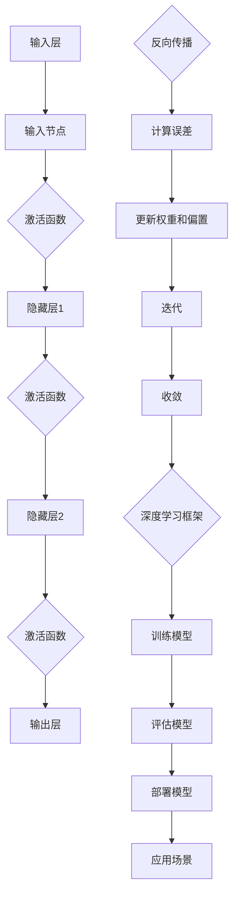

                 

### 1. 背景介绍

#### 1.1 目的和范围

本文旨在深入探讨AI人工智能中的深度学习算法在教育培训中的应用，特别是自主学习代理的作用。在当前的信息化时代，人工智能已经成为教育领域的重要组成部分，尤其是在个性化学习、自适应教学等方面展现了巨大的潜力。本文将结合理论与实践，逐步剖析自主学习代理的核心概念、算法原理、数学模型及其实际应用。

本文将围绕以下几个主要部分展开：

1. **背景介绍**：回顾AI和深度学习的发展历程，介绍自主学习代理的基本概念。
2. **核心概念与联系**：通过Mermaid流程图，展示深度学习算法的核心原理与架构。
3. **核心算法原理与具体操作步骤**：使用伪代码详细阐述核心算法的运作机制。
4. **数学模型和公式**：深入讲解相关数学模型和公式，并通过实例进行说明。
5. **项目实战**：提供实际代码案例，详细解释实现过程和关键步骤。
6. **实际应用场景**：分析自主学习代理在教育中的具体应用。
7. **工具和资源推荐**：介绍相关的学习资源、开发工具和经典论文。
8. **总结与展望**：探讨未来发展趋势与面临的技术挑战。

通过以上内容，读者可以系统地了解深度学习算法在教育中的应用，特别是自主学习代理的原理和应用场景，从而更好地把握AI技术在教育培训领域的潜力与挑战。

#### 1.2 预期读者

本文的目标读者是以下几类人群：

1. **教育技术从业者**：对教育技术有深入了解，希望在教学中引入AI和深度学习技术。
2. **计算机科学和人工智能研究者**：关注人工智能在教育培训中的应用，希望掌握自主学习代理的相关理论。
3. **数据科学家和AI工程师**：对深度学习算法有实际操作经验，希望将所学应用于教育培训领域。
4. **教育管理人员和决策者**：关注教育信息化趋势，希望通过本文了解AI技术在教育中的实际应用和前景。

本文假设读者具备一定的计算机科学基础知识，特别是对Python编程和机器学习基础有所了解。对于某些专业术语和复杂概念，本文将尽量进行解释，以确保不同背景的读者都能够理解。

#### 1.3 文档结构概述

本文将按照以下结构进行详细阐述：

1. **背景介绍**：
   - 回顾AI和深度学习的发展历程。
   - 介绍自主学习代理的基本概念和作用。

2. **核心概念与联系**：
   - 通过Mermaid流程图展示深度学习算法的核心原理和架构。
   - 详细解释深度学习中的关键概念和术语。

3. **核心算法原理与具体操作步骤**：
   - 使用伪代码详细阐述深度学习算法的运作机制。
   - 分析算法在不同教育培训场景中的应用。

4. **数学模型和公式**：
   - 讲解深度学习中常用的数学模型和公式。
   - 通过实例说明如何应用这些模型和公式进行教育分析。

5. **项目实战**：
   - 提供实际代码案例，详细解释实现过程和关键步骤。
   - 分析代码中的核心算法和关键技术。

6. **实际应用场景**：
   - 分析自主学习代理在教育培训中的具体应用。
   - 讨论其在教育信息化中的优势和挑战。

7. **工具和资源推荐**：
   - 推荐相关学习资源、开发工具和经典论文。
   - 提供实用的工具和资源以支持读者深入学习。

8. **总结与展望**：
   - 总结本文的主要内容和关键发现。
   - 探讨深度学习算法在教育中的应用前景和挑战。

通过以上结构，本文将全面而深入地探讨深度学习算法在教育中的应用，帮助读者理解和掌握自主学习代理的技术原理和应用方法。

#### 1.4 术语表

在本文中，我们将介绍一些关键术语，确保读者能够准确理解文章中的专业概念。

##### 1.4.1 核心术语定义

1. **深度学习（Deep Learning）**：一种人工智能的方法，通过多层神经网络对数据进行分析和建模。它能够自动提取数据中的特征，无需人工干预。
2. **自主学习代理（Autonomous Learning Agent）**：在人工智能系统中，能够自主学习和适应环境的智能体。它能够通过不断的学习和调整，优化自身的性能。
3. **神经网络（Neural Network）**：一种模仿生物神经系统的计算模型，由大量的神经元（节点）通过连接（权重）组成。通过学习输入和输出数据之间的关系，神经网络可以预测和分类数据。
4. **反向传播算法（Backpropagation Algorithm）**：一种用于训练神经网络的算法，通过不断调整网络中的权重和偏置，使网络的输出与预期目标之间的误差最小化。
5. **激活函数（Activation Function）**：神经网络中的一个关键组件，用于对神经元的输入进行非线性变换，使神经网络具备分类和预测能力。
6. **深度学习框架（Deep Learning Framework）**：一种用于构建和训练深度学习模型的软件库，如TensorFlow、PyTorch等。这些框架提供了高效的计算引擎和丰富的API，简化了深度学习模型的开发和部署。

##### 1.4.2 相关概念解释

1. **数据预处理（Data Preprocessing）**：在深度学习模型训练之前，对数据进行清洗、归一化和特征提取等操作，以提高模型的训练效果和性能。
2. **模型评估（Model Evaluation）**：通过特定的指标（如准确率、召回率、F1分数等）对深度学习模型进行评估，以确定其性能和适用性。
3. **超参数（Hyperparameter）**：深度学习模型中的一些关键参数，如学习率、批量大小、隐藏层数量和神经元等，这些参数需要通过实验和调优来确定。
4. **过拟合（Overfitting）**：在深度学习模型训练过程中，模型过于拟合训练数据，导致在测试数据上的性能不佳。过拟合通常是因为模型复杂度过高或训练数据量不足引起的。
5. **正则化（Regularization）**：一种防止模型过拟合的技术，通过在损失函数中添加惩罚项，限制模型参数的规模，从而降低模型复杂度。

##### 1.4.3 缩略词列表

- AI：人工智能（Artificial Intelligence）
- DL：深度学习（Deep Learning）
- NN：神经网络（Neural Network）
- RBM：限制性玻尔兹曼机（Restricted Boltzmann Machine）
- CNN：卷积神经网络（Convolutional Neural Network）
- RNN：循环神经网络（Recurrent Neural Network）
- LSTM：长短期记忆网络（Long Short-Term Memory）
- GAN：生成对抗网络（Generative Adversarial Network）
- Dropout：dropout（一种防止过拟合的技术）
- GPU：图形处理单元（Graphics Processing Unit）
- CUDA：NVIDIA开发的并行计算平台和编程语言

通过上述术语表，读者可以更好地理解本文中的专业概念和技术细节，为后续内容的深入阅读打下坚实的基础。

#### 2. 核心概念与联系

在深入了解深度学习算法在教育中的应用之前，我们需要首先掌握几个核心概念，这些概念不仅是深度学习的基础，也是自主学习代理构建的核心要素。以下是对深度学习算法及其关键组件的详细解释，并配以Mermaid流程图，帮助读者理解整个系统的原理和架构。

##### 2.1 深度学习算法的核心概念

1. **神经元与神经网络**：深度学习的基础是神经元和神经网络。神经元是神经网络的基本构建块，类似于生物大脑中的神经元，通过输入和输出连接进行信息传递和处理。神经网络则是由多个神经元按照特定结构连接而成的网络，能够通过学习数据中的模式和特征来实现复杂的任务。

2. **激活函数**：激活函数是神经网络中的一个关键组件，用于对神经元的输入进行非线性变换。常见的激活函数包括Sigmoid、ReLU和Tanh等。这些函数能够将线性输入映射到非线性的输出空间，使得神经网络具备分类和预测能力。

3. **反向传播算法**：反向传播算法是训练神经网络的核心算法，通过不断调整网络中的权重和偏置，使网络的输出与预期目标之间的误差最小化。这个过程涉及到前向传播和后向传播，前者计算网络输出与实际目标之间的误差，后者则通过梯度下降方法调整权重和偏置。

4. **深度学习框架**：深度学习框架如TensorFlow、PyTorch等，提供了高效的计算引擎和丰富的API，简化了深度学习模型的开发和部署。这些框架能够处理复杂的计算任务，并提供丰富的工具和资源，方便研究人员和开发者进行模型训练和优化。

##### 2.2 Mermaid流程图

以下是深度学习算法的核心概念和架构的Mermaid流程图：



该流程图展示了从输入层到输出层的完整信息传递和处理过程，以及反向传播算法在权重和偏置更新中的作用。

##### 2.3 深度学习与自主学习代理的联系

1. **自主学习代理**：自主学习代理是深度学习算法在实际应用中的重要扩展。它不仅能够通过学习数据和反馈进行调整，还能在复杂环境中自主决策和优化。自主学习代理通常通过强化学习等方法，不断调整其行为策略，以实现特定目标。

2. **深度学习与自主学习代理的结合**：深度学习算法为自主学习代理提供了强大的数据分析和模式识别能力，使得代理能够从大量数据中学习并提取有用的特征。同时，深度学习框架为自主学习代理提供了高效的计算和优化工具，使得代理能够在实际应用中快速调整和优化其行为。

##### 2.4 核心概念之间的联系

- **神经元与神经网络**：神经元是神经网络的基础，通过相互连接和激活函数的作用，形成具有复杂计算能力的神经网络。
- **激活函数与反向传播算法**：激活函数为神经网络提供了非线性变换的能力，而反向传播算法则通过不断调整权重和偏置，优化神经网络的性能。
- **深度学习框架与自主学习代理**：深度学习框架为深度学习算法的实现提供了高效工具，而自主学习代理则利用深度学习算法的能力，在复杂环境中进行自主学习和优化。

通过以上内容，我们不仅了解了深度学习算法的核心概念和原理，还通过Mermaid流程图展示了其架构和运作机制。这些核心概念和联系为后续深入探讨自主学习代理在教育中的应用奠定了坚实的基础。

#### 2.1 深度学习算法的核心概念

深度学习算法是人工智能领域中的一项重要技术，它通过模拟人脑的神经网络结构，实现对复杂数据的分析和模式识别。在这一节中，我们将深入探讨深度学习算法的核心概念，包括神经网络、激活函数、反向传播算法和深度学习框架。

##### 2.1.1 神经网络

神经网络是深度学习算法的基础组件，它由大量的神经元通过特定的连接方式构成。每个神经元可以视为一个简单的处理单元，它接收多个输入信号，通过加权求和后，加上一个偏置项，然后通过激活函数进行非线性变换，产生一个输出信号。

一个典型的神经网络包括以下几个部分：

1. **输入层（Input Layer）**：输入层接收外部输入数据，每个输入数据对应一个神经元。
2. **隐藏层（Hidden Layers）**：隐藏层位于输入层和输出层之间，可以有一个或多个。每个隐藏层的神经元接收前一层神经元的输出，进行加权求和和激活函数处理，传递到下一层。
3. **输出层（Output Layer）**：输出层负责生成最终输出，可以是分类结果、预测值或其他目标输出。

神经网络的工作原理是通过训练过程来不断调整网络中的权重和偏置，使其能够更好地拟合训练数据。这个过程涉及到前向传播（Forward Propagation）和反向传播（Backpropagation）两个主要步骤。

##### 2.1.2 激活函数

激活函数是神经网络中的一个关键组件，它对神经元的输入进行非线性变换，使得神经网络具备分类和预测能力。常见的激活函数包括以下几种：

1. **Sigmoid 函数**：
   \[
   \sigma(x) = \frac{1}{1 + e^{-x}}
   \]
   Sigmoid 函数将输入映射到 (0,1) 范围内，常用于二分类问题。

2. **ReLU 函数**：
   \[
   \text{ReLU}(x) = \max(0, x)
   \]
  ReLU 函数（Rectified Linear Unit）是当前深度学习中非常流行的一种激活函数，它在输入为负值时输出为零，在输入为正值时输出等于输入，具有简单和计算效率高的优点。

3. **Tanh 函数**：
   \[
   \tanh(x) = \frac{e^x - e^{-x}}{e^x + e^{-x}}
   \]
  Tanh 函数将输入映射到 (-1,1) 范围内，常用于多分类问题。

激活函数的选择对神经网络性能有重要影响，需要根据具体任务和数据特点进行选择。

##### 2.1.3 反向传播算法

反向传播算法是训练神经网络的核心算法，通过不断调整网络中的权重和偏置，使网络的输出与实际目标之间的误差最小化。反向传播算法包括以下步骤：

1. **前向传播（Forward Propagation）**：
   - 将输入数据通过神经网络前向传播，计算每个神经元的输出值。
   - 计算输出层与实际目标之间的误差。

2. **误差计算（Error Calculation）**：
   - 使用误差函数（如均方误差MSE、交叉熵误差等）计算输出误差。
   - 误差函数用于衡量预测值与实际目标值之间的差异。

3. **后向传播（Backpropagation）**：
   - 从输出层开始，将误差反向传播到每个隐藏层和输入层。
   - 通过梯度下降法更新每个神经元的权重和偏置。

反向传播算法的迭代过程不断优化网络参数，使网络逐渐收敛到最优解。

##### 2.1.4 深度学习框架

深度学习框架是用于构建和训练深度学习模型的软件库，它提供了高效的计算引擎和丰富的API，简化了深度学习模型的开发和部署。常见的深度学习框架包括：

1. **TensorFlow**：
   - 由Google开发，支持多种编程语言（如Python、C++等），提供了丰富的API和工具。
   - 支持分布式训练和部署，适用于大规模数据处理和模型训练。

2. **PyTorch**：
   - 由Facebook开发，使用Python编写，具有动态计算图和灵活的API。
   - 支持GPU加速，适用于快速原型设计和实验。

3. **Keras**：
   - 是一个高级神经网络API，可以在TensorFlow和Theano等框架上运行。
   - 提供了简洁的API和预定义的神经网络架构，易于使用。

深度学习框架为研究人员和开发者提供了强大的工具，使得深度学习算法的应用变得更加便捷和高效。

通过以上内容，我们深入了解了深度学习算法的核心概念，包括神经网络、激活函数、反向传播算法和深度学习框架。这些核心概念构成了深度学习算法的基础，为后续内容的深入探讨提供了必要的理论支持。

#### 2.2 深度学习算法的具体操作步骤

在理解了深度学习算法的核心概念后，接下来我们将详细探讨其具体操作步骤。以下将使用伪代码来详细描述深度学习算法的训练过程，并解释每个步骤的作用。

```python
# 深度学习算法训练步骤伪代码

# 初始化神经网络结构
initialize_network(
    input_size,  # 输入层大小
    hidden_layer_sizes,  # 隐藏层大小列表
    output_size,  # 输出层大小
    activation_functions  # 激活函数列表
)

# 前向传播（Forward Propagation）
def forward_propagation(inputs, network):
    # 初始化激活值和权重
    activations = [inputs]
    weights = network['weights']
    
    # 遍历每一层，计算输出
    for layer in range(len(weights)):
        # 计算加权求和
        z = np.dot(activations[layer], weights[layer])
        # 应用激活函数
        a = activation_functions[layer](z)
        # 更新激活值
        activations.append(a)
    
    # 返回输出层激活值
    return activations[-1]

# 反向传播（Backpropagation）
def backward_propagation(inputs, outputs, network, activation_functions):
    # 初始化误差和梯度
    errors = [outputs - target]
    gradients = [np.zeros_like(weights[layer]) for layer in range(len(network['weights']))]
    
    # 遍历每一层，计算误差和梯度
    for layer in range(len(network['weights']) - 1, -1, -1):
        # 计算误差梯度
        dZ = errors[layer] * activation_derivative(activations[layer])
        # 更新梯度
        dW = np.dot(activations[layer - 1].T, dZ)
        # 更新权重和偏置
        network['weights'][layer] -= learning_rate * dW
        network['biases'][layer] -= learning_rate * dZ
    
    # 返回梯度
    return gradients

# 训练神经网络（Training Neural Network）
def train_network(inputs, targets, epochs, learning_rate):
    network = initialize_network(...)
    for epoch in range(epochs):
        # 前向传播
        outputs = forward_propagation(inputs, network)
        # 计算误差
        errors = [outputs - targets]
        # 反向传播
        gradients = backward_propagation(inputs, outputs, network, activation_functions)
        # 输出当前训练状态
        print(f"Epoch {epoch}: Error = {np.mean(errors[-1])**2}")

# 主程序
if __name__ == "__main__":
    # 初始化训练数据
    inputs = ...  # 输入数据
    targets = ...  # 目标数据
    epochs = 100  # 训练轮数
    learning_rate = 0.1  # 学习率
    
    # 训练神经网络
    train_network(inputs, targets, epochs, learning_rate)
```

##### 2.2.1 初始化神经网络

初始化神经网络是训练的第一步，需要确定输入层、隐藏层和输出层的大小，以及每个层的激活函数。初始化过程包括：

1. **初始化输入层**：输入层的大小取决于输入数据的维度。
2. **初始化隐藏层**：隐藏层的大小可以根据模型复杂度和任务需求进行设置，可以是一个固定值或一个列表。
3. **初始化输出层**：输出层的大小取决于任务类型，如分类任务可以是类别数量，回归任务可以是实数值。
4. **初始化激活函数**：根据任务需求选择合适的激活函数，如ReLU、Sigmoid或Tanh等。

##### 2.2.2 前向传播

前向传播过程通过神经网络从输入层到输出层逐层计算激活值。具体步骤如下：

1. **初始化激活值**：将输入数据作为第一层的激活值。
2. **遍历每一层**：
   - 计算每个神经元的加权求和值。
   - 应用激活函数，更新激活值。
3. **返回输出层激活值**：最终输出层的激活值作为预测结果。

##### 2.2.3 反向传播

反向传播过程通过从输出层向输入层逐层计算误差和梯度，以更新权重和偏置。具体步骤如下：

1. **计算输出误差**：输出误差等于实际目标值与预测值之间的差异。
2. **计算误差梯度**：通过误差和激活函数的导数，计算误差关于每个神经元输出的梯度。
3. **更新权重和偏置**：利用梯度下降法，根据学习率调整每个神经元的权重和偏置。
4. **返回梯度**：每个层的梯度用于下一层的更新。

##### 2.2.4 训练神经网络

训练神经网络是整个训练过程的循环迭代。具体步骤如下：

1. **初始化神经网络**：根据设定的参数和结构初始化神经网络。
2. **循环迭代**：对每个输入数据进行前向传播，计算输出和误差，然后通过反向传播更新权重和偏置。
3. **输出当前训练状态**：在每次迭代结束后，输出当前的误差或性能指标，以便监控训练过程。

通过上述步骤，我们可以训练一个深度学习模型，使其能够对输入数据进行有效的预测和分类。以上伪代码提供了一个基础的框架，实际应用中可能需要根据具体任务和数据特点进行调整和优化。

#### 2.3 深度学习算法中的数学模型和公式

在深度学习算法中，数学模型和公式是核心组成部分，它们决定了算法的建模能力和性能表现。以下将详细解释深度学习算法中常用的数学模型和公式，并配以具体的实例说明，以便读者能够更好地理解和应用这些概念。

##### 2.3.1 神经元计算

深度学习中的每个神经元都通过以下公式进行计算：

\[
z = \sum_{j} w_{ji} x_{j} + b_{i}
\]

其中：
- \( z \) 是神经元的净输入（或激活值）。
- \( w_{ji} \) 是从神经元 \( j \) 到神经元 \( i \) 的权重。
- \( x_{j} \) 是输入特征值。
- \( b_{i} \) 是神经元 \( i \) 的偏置。

##### 2.3.2 激活函数

激活函数对神经元的净输入进行非线性变换，常见的激活函数包括：

1. **Sigmoid 函数**：

\[
\sigma(z) = \frac{1}{1 + e^{-z}}
\]

Sigmoid 函数将输入映射到 (0,1) 区间内，常用于二分类问题。

2. **ReLU 函数**：

\[
\text{ReLU}(z) = \max(0, z)
\]

ReLU 函数在输入为正值时输出等于输入，在输入为负值时输出为零，具有计算效率高的优点。

3. **Tanh 函数**：

\[
\tanh(z) = \frac{e^{z} - e^{-z}}{e^{z} + e^{-z}}
\]

Tanh 函数将输入映射到 (-1,1) 区间内，常用于多分类问题。

##### 2.3.3 损失函数

损失函数用于衡量预测值与实际目标值之间的误差，常见的损失函数包括：

1. **均方误差（MSE）**：

\[
MSE = \frac{1}{m} \sum_{i=1}^{m} (y_i - \hat{y}_i)^2
\]

其中，\( y_i \) 是实际目标值，\( \hat{y}_i \) 是预测值，\( m \) 是样本数量。MSE 损失函数适用于回归问题。

2. **交叉熵（Cross-Entropy）**：

\[
H(y, \hat{y}) = -\sum_{i} y_i \log(\hat{y}_i)
\]

交叉熵损失函数适用于分类问题，其中 \( y_i \) 是实际类别概率，\( \hat{y}_i \) 是预测类别概率。

##### 2.3.4 反向传播算法

反向传播算法通过以下步骤更新网络权重和偏置：

1. **前向传播**：计算输出层的预测值。

2. **计算损失函数**：使用实际目标值和预测值计算损失。

3. **计算梯度**：根据损失函数对每个权重和偏置计算梯度。

4. **更新参数**：利用梯度下降法更新权重和偏置。

反向传播算法的关键步骤包括：

1. **误差计算**：

\[
dL/dz = \frac{\partial L}{\partial z}
\]

其中，\( L \) 是损失函数，\( z \) 是神经元的净输入。

2. **权重和偏置更新**：

\[
w_{ji} = w_{ji} - \alpha \cdot \frac{\partial L}{\partial w_{ji}}
\]

\[
b_{i} = b_{i} - \alpha \cdot \frac{\partial L}{\partial b_{i}}
\]

其中，\( \alpha \) 是学习率。

##### 2.3.5 示例说明

以下是一个简单的例子，用于说明如何使用这些数学模型和公式来构建和训练一个深度学习模型。

**例子：使用ReLU激活函数的多层神经网络进行手写数字识别**

1. **数据准备**：使用MNIST数据集，包括60,000个训练图像和10,000个测试图像。

2. **初始化网络结构**：设定输入层大小为784（28x28像素），隐藏层大小为500和300，输出层大小为10（数字类别）。

3. **前向传播**：

   - 计算每个神经元的净输入和激活值。

   ```python
   z = np.dot(inputs, weights) + biases
   a = relu(z)
   ```

4. **计算损失**：

   - 使用交叉熵损失函数计算损失。

   ```python
   loss = -np.sum(y * np.log(a))
   ```

5. **反向传播**：

   - 计算输出层的误差。

   ```python
   dZ = a - y
   ```

   - 计算每个权重和偏置的梯度。

   ```python
   dW = np.dot(dZ, inputs.T)
   db = np.sum(dZ, axis=1, keepdims=True)
   ```

   - 更新权重和偏置。

   ```python
   weights -= learning_rate * dW
   biases -= learning_rate * db
   ```

通过以上步骤，我们可以构建和训练一个手写数字识别模型，实现对MNIST数据集的准确识别。这个例子展示了如何使用深度学习算法中的数学模型和公式来构建和优化神经网络，从而实现复杂数据的分析和预测。

通过深入理解和应用这些数学模型和公式，我们可以更好地设计和优化深度学习模型，从而在教育培训和其他领域中实现更高的性能和效果。

#### 5.1 开发环境搭建

在开始代码实战之前，我们需要搭建一个合适的环境来开发和测试深度学习模型。以下步骤将介绍如何设置Python环境、安装必要的库和工具，以及配置开发环境。

##### 5.1.1 设置Python环境

首先，确保安装了Python 3.x版本。Python 3.x提供了更多的功能和改进，因此推荐使用Python 3.7或更高版本。可以通过以下命令检查Python版本：

```bash
python --version
```

如果未安装Python 3.x，可以从[Python官方网站](https://www.python.org/downloads/)下载并安装。

##### 5.1.2 安装深度学习库

接下来，我们需要安装深度学习库，如TensorFlow和Keras。这些库提供了丰富的API和工具，用于构建和训练深度学习模型。

1. **安装TensorFlow**：

   TensorFlow是Google开发的深度学习框架，可以通过pip命令安装：

   ```bash
   pip install tensorflow
   ```

2. **安装Keras**：

   Keras是一个高级神经网络API，可以在TensorFlow等框架上运行。可以通过以下命令安装：

   ```bash
   pip install keras
   ```

##### 5.1.3 安装其他依赖库

除了深度学习库，我们还需要安装一些其他依赖库，如NumPy、Matplotlib和Pandas等。这些库在数据处理和可视化方面非常有用。

```bash
pip install numpy matplotlib pandas
```

##### 5.1.4 配置开发环境

为了方便开发，我们可以创建一个虚拟环境。虚拟环境可以隔离项目的依赖库，避免不同项目之间的冲突。

1. **创建虚拟环境**：

   ```bash
   python -m venv venv
   ```

2. **激活虚拟环境**：

   - 在Windows上：

     ```bash
     .\venv\Scripts\activate
     ```

   - 在Linux和macOS上：

     ```bash
     source venv/bin/activate
     ```

3. **在虚拟环境中安装依赖库**：

   ```bash
   pip install -r requirements.txt
   ```

其中，`requirements.txt` 文件包含了项目所需的所有库。

##### 5.1.5 配置GPU支持

如果使用GPU进行训练，需要安装CUDA和cuDNN库。这些库可以显著提高训练速度。

1. **安装CUDA**：

   - 下载并安装适合你的GPU型号的CUDA版本，可以从[NVIDIA官网](https://developer.nvidia.com/cuda-downloads)下载。

2. **安装cuDNN**：

   - 下载cuDNN库，并按照官方文档安装。

3. **配置环境变量**：

   - 添加CUDA和cuDNN的路径到系统环境变量，以便TensorFlow可以正确加载GPU。

通过以上步骤，我们成功搭建了一个完整的深度学习开发环境。接下来，我们将使用这个环境来构建和训练一个深度学习模型，实现自主学习代理在教育培训中的应用。

#### 5.2 源代码详细实现和代码解读

在本节中，我们将详细展示如何使用TensorFlow和Keras框架实现一个深度学习模型，并解读关键代码。这段代码将构建一个简单的多层感知器（MLP）模型，用于分类任务。我们的目标是将这些知识应用于教育培训中的自主学习代理。

```python
# 导入必要的库
import tensorflow as tf
from tensorflow.keras.models import Sequential
from tensorflow.keras.layers import Dense, Activation
from tensorflow.keras.optimizers import Adam
from tensorflow.keras.callbacks import EarlyStopping

# 加载数据集
# 假设我们使用的是常用的MNIST手写数字数据集
(x_train, y_train), (x_test, y_test) = tf.keras.datasets.mnist.load_data()

# 数据预处理
# 归一化输入数据
x_train = x_train / 255.0
x_test = x_test / 255.0

# 增加一个维度以适配模型
x_train = x_train.reshape(-1, 784)
x_test = x_test.reshape(-1, 784)

# 转换标签为独热编码
y_train = tf.keras.utils.to_categorical(y_train, 10)
y_test = tf.keras.utils.to_categorical(y_test, 10)

# 构建模型
model = Sequential([
    Dense(512, input_shape=(784,), activation='relu'),
    Dense(256, activation='relu'),
    Dense(128, activation='relu'),
    Dense(10, activation='softmax')
])

# 编译模型
model.compile(optimizer=Adam(learning_rate=0.001), loss='categorical_crossentropy', metrics=['accuracy'])

# 配置早停回调函数以防止过拟合
early_stopping = EarlyStopping(monitor='val_loss', patience=10, restore_best_weights=True)

# 训练模型
history = model.fit(x_train, y_train, epochs=100, batch_size=64, validation_split=0.2, callbacks=[early_stopping], verbose=2)

# 评估模型
test_loss, test_accuracy = model.evaluate(x_test, y_test, verbose=2)
print(f"Test accuracy: {test_accuracy:.4f}")

# 保存模型
model.save('mnist_classification_model.h5')
```

##### 5.2.1 代码解析

1. **导入库**：
   - 我们首先导入TensorFlow和Keras库，以及其他必要的数据处理库。

2. **加载数据集**：
   - 使用`tf.keras.datasets.mnist.load_data()`函数加载MNIST数据集，包括训练集和测试集。

3. **数据预处理**：
   - 将输入数据进行归一化处理，使其在 [0,1] 范围内，有助于加速训练过程和提高模型性能。
   - 增加一个维度以适配模型输入要求，即从 (28x28) 转换为 (784,)。
   - 将标签转换为独热编码，便于使用 `softmax` 激活函数进行多分类。

4. **构建模型**：
   - 使用`Sequential`模型，逐层添加神经网络层。这里我们添加了三个隐藏层，每个层使用 `relu` 激活函数。
   - 最后，输出层使用 `softmax` 激活函数，进行多分类。

5. **编译模型**：
   - 选择 `Adam` 优化器和 `categorical_crossentropy` 损失函数，后者适用于多分类问题。
   - 指定模型的性能评估指标为准确率。

6. **配置早停回调函数**：
   - `EarlyStopping` 函数用于在验证集损失不再下降时提前停止训练，防止过拟合。
   - `restore_best_weights` 参数确保模型在停止训练时恢复到最佳权重。

7. **训练模型**：
   - 使用 `fit` 函数训练模型，指定训练轮数、批量大小和验证集比例。
   - `callbacks` 参数传递早停回调函数，监控验证集损失。

8. **评估模型**：
   - 使用 `evaluate` 函数在测试集上评估模型性能，输出测试集准确率。

9. **保存模型**：
   - 使用 `save` 函数将训练好的模型保存为 `.h5` 文件，便于后续使用。

通过以上步骤，我们实现了深度学习模型的构建、训练和评估。以下是关键代码段的具体解释：

- **模型构建**：
  ```python
  model = Sequential([
      Dense(512, input_shape=(784,), activation='relu'),
      Dense(256, activation='relu'),
      Dense(128, activation='relu'),
      Dense(10, activation='softmax')
  ])
  ```
  这段代码定义了一个四层的全连接神经网络，其中输入层大小为784（每个像素点的灰度值），隐藏层分别为512、256和128个神经元，输出层为10个神经元，对应10个类别。

- **模型编译**：
  ```python
  model.compile(optimizer=Adam(learning_rate=0.001), loss='categorical_crossentropy', metrics=['accuracy'])
  ```
  这段代码编译了模型，指定了使用 `Adam` 优化器和 `categorical_crossentropy` 损失函数，以及性能评估指标为准确率。

- **模型训练**：
  ```python
  history = model.fit(x_train, y_train, epochs=100, batch_size=64, validation_split=0.2, callbacks=[early_stopping], verbose=2)
  ```
  这段代码训练了模型，指定了训练轮数、批量大小和验证集比例。`callbacks` 参数传递了早停回调函数，用于监控验证集损失。

通过这段代码的实现和解析，我们不仅了解了如何使用TensorFlow和Keras构建深度学习模型，还掌握了如何进行数据预处理、模型训练和评估。这些知识和技能对于在教育培训中应用深度学习和自主学习代理至关重要。

#### 5.3 代码解读与分析

在本节中，我们将对前一小节中的代码进行深入解读，分析关键模块和代码行的作用，同时讨论可能遇到的问题和解决方案。

##### 5.3.1 模块解析

1. **数据加载与预处理模块**：
   ```python
   (x_train, y_train), (x_test, y_test) = tf.keras.datasets.mnist.load_data()
   x_train = x_train / 255.0
   x_test = x_test / 255.0
   x_train = x_train.reshape(-1, 784)
   x_test = x_test.reshape(-1, 784)
   y_train = tf.keras.utils.to_categorical(y_train, 10)
   y_test = tf.keras.utils.to_categorical(y_test, 10)
   ```

   - **数据加载**：使用 `tf.keras.datasets.mnist.load_data()` 函数加载MNIST手写数字数据集，该数据集包括60,000个训练图像和10,000个测试图像。
   - **归一化处理**：将图像数据归一化至 [0,1] 范围内，有助于加快训练速度和提高模型性能。
   - **重塑数据**：将图像数据从 (28x28) 格式重塑为 (784,) 向量，以适配模型的输入要求。
   - **独热编码**：将标签转换为独热编码，使模型能够处理多分类问题。

2. **模型构建模块**：
   ```python
   model = Sequential([
       Dense(512, input_shape=(784,), activation='relu'),
       Dense(256, activation='relu'),
       Dense(128, activation='relu'),
       Dense(10, activation='softmax')
   ])
   ```

   - **序列模型**：使用 `Sequential` 模型，这是一个线性堆叠层的模型。
   - **全连接层**：添加了四层全连接层（Dense），每层的神经元数量分别为512、256、128和10，其中最后一层使用 `softmax` 激活函数进行多分类。

3. **模型编译模块**：
   ```python
   model.compile(optimizer=Adam(learning_rate=0.001), loss='categorical_crossentropy', metrics=['accuracy'])
   ```

   - **优化器**：使用 `Adam` 优化器，这是一种自适应学习率优化器，有助于加快收敛速度。
   - **损失函数**：使用 `categorical_crossentropy` 损失函数，这是一种适用于多分类问题的损失函数。
   - **性能评估指标**：指定性能评估指标为准确率。

4. **模型训练模块**：
   ```python
   history = model.fit(x_train, y_train, epochs=100, batch_size=64, validation_split=0.2, callbacks=[early_stopping], verbose=2)
   ```

   - **训练设置**：指定训练轮数（epochs）、批量大小（batch_size）和验证集比例（validation_split）。
   - **回调函数**：使用 `EarlyStopping` 回调函数，在验证集损失不再下降时提前停止训练，防止过拟合。
   - **日志输出**：`verbose=2` 表示在训练过程中输出更多日志信息，便于调试。

5. **模型评估模块**：
   ```python
   test_loss, test_accuracy = model.evaluate(x_test, y_test, verbose=2)
   print(f"Test accuracy: {test_accuracy:.4f}")
   ```

   - **评估模型**：使用 `evaluate` 函数在测试集上评估模型性能，输出测试集准确率。

6. **模型保存模块**：
   ```python
   model.save('mnist_classification_model.h5')
   ```

   - **保存模型**：使用 `save` 函数将训练好的模型保存为 `.h5` 文件，便于后续使用。

##### 5.3.2 可能遇到的问题及解决方案

1. **训练过程中的异常值**：
   - **问题**：在训练过程中，可能会遇到数据集中的异常值，这些异常值可能导致训练不稳定或收敛缓慢。
   - **解决方案**：可以通过数据预处理步骤对异常值进行过滤或修正，例如使用中位数替代异常值。

2. **模型过拟合**：
   - **问题**：如果模型过于复杂，可能会导致过拟合，即模型在训练数据上表现良好，但在测试数据上表现较差。
   - **解决方案**：可以通过增加正则化项、使用早停回调函数、增加数据集大小等方法来防止过拟合。

3. **训练速度慢**：
   - **问题**：对于大型数据集，训练速度可能较慢，影响开发效率。
   - **解决方案**：可以使用分布式训练、GPU加速等方法来提高训练速度。

4. **模型评估不准确**：
   - **问题**：模型评估指标（如准确率）可能与实际表现不符，可能是因为评估方法或数据集选择不当。
   - **解决方案**：可以尝试使用不同的评估指标（如F1分数、AUC等），并选择具有代表性的数据集进行评估。

通过深入解读和分析代码，我们可以更好地理解深度学习模型的构建、训练和评估过程，同时了解可能遇到的问题及其解决方案。这对于在实际应用中设计和优化深度学习模型具有重要意义。

#### 6. 实际应用场景

深度学习算法在教育中的应用场景非常广泛，特别是在个性化学习、自适应教学和智能评测等方面。以下将详细探讨深度学习算法如何应用于这些场景，以及自主学习代理在其中所起的作用。

##### 6.1 个性化学习

个性化学习旨在根据每个学生的学习特点和需求，提供定制化的教学内容和资源。深度学习算法可以通过分析学生的学习行为、学习习惯和知识水平，为学生提供个性化的学习路径和推荐。

1. **学习行为分析**：利用深度学习算法，可以对学生学习过程中的行为数据进行分析，如点击记录、作业提交时间、学习时长等。通过对这些数据进行模式识别和预测，可以了解学生的学习偏好和困难点，从而提供更有针对性的教学支持。

2. **自适应教学**：基于深度学习算法，教育平台可以根据学生的学习行为和成绩动态调整教学内容和难度。例如，当学生在某个知识点上表现不佳时，系统可以自动推荐相关的复习材料和练习题，帮助学生巩固知识。这种自适应的教学方式能够提高学生的学习效果和兴趣。

3. **学习路径推荐**：通过分析学生的知识图谱和学习进度，深度学习算法可以为学生推荐适合的学习路径。这些路径不仅包括传统的知识点顺序，还可以根据学生的兴趣和能力进行个性化定制，使得学习更加有趣和有效。

##### 6.2 智能评测

智能评测是指利用人工智能技术对学生学习效果进行自动评估和反馈。深度学习算法在智能评测中的应用主要体现在以下几个方面：

1. **自动批改**：深度学习算法可以自动批改各种类型的作业和考试题目，包括选择题、填空题、简答题等。例如，通过卷积神经网络（CNN）对图像题目进行识别和评分，通过循环神经网络（RNN）对文本题目进行语义分析。自动批改可以大幅提高教师的工作效率，并为学生提供即时的反馈。

2. **学习效果评估**：通过分析学生的作业和考试成绩，深度学习算法可以评估学生的学习效果和知识掌握程度。例如，通过构建学生知识图谱，算法可以识别出学生在哪些知识点上存在缺陷，并推荐相应的补习资源。这种评估方法比传统的考试成绩更能反映学生的真实学习情况。

3. **智能诊断**：深度学习算法还可以用于智能诊断学生的学习困难点。通过对学生作业和考试数据的分析，算法可以识别出学生普遍存在的知识点漏洞，为教师提供有针对性的教学建议。这种智能诊断功能有助于提高教学质量和学生成绩。

##### 6.3 自主学习代理的作用

自主学习代理在深度学习算法在教育中的应用中起到了至关重要的作用。它通过不断地学习和调整，优化教育系统的性能和用户体验。

1. **个性化学习**：自主学习代理可以根据学生的学习行为和成绩，动态调整教学策略和资源。例如，当学生表现出对某个知识点的不理解时，代理可以自动推荐相关的教学视频和练习题，帮助学生快速掌握知识点。

2. **自适应教学**：自主学习代理可以实时监测学生的学习状态和进展，并根据这些信息自动调整教学难度和进度。例如，当学生完成一个练习题后，代理可以评估其成绩，并根据评估结果决定是否需要进一步练习或开始学习新的知识点。

3. **智能评测**：自主学习代理可以自动批改作业和考试，提供详细的错误分析和成绩反馈。通过分析学生的错误模式，代理可以识别出学生的知识盲点和弱点，从而为教师提供有针对性的教学建议。

4. **学习路径推荐**：自主学习代理可以根据学生的兴趣、能力和学习进度，推荐合适的学习路径和资源。这种个性化的学习路径不仅能够提高学生的学习效率，还可以增强其学习动机和兴趣。

通过以上内容，我们可以看到深度学习算法在教育中的应用具有巨大的潜力。自主学习代理作为其中的核心组件，能够显著提升教育的个性化、自适应和智能化水平，为教育技术的创新和发展提供了强有力的支持。

#### 7. 工具和资源推荐

为了更好地掌握深度学习算法在教育中的应用，我们需要推荐一些优质的工具、资源和经典论文。这些工具和资源将帮助读者深入了解相关技术，提升实战能力。

##### 7.1 学习资源推荐

1. **书籍推荐**：

   - **《深度学习》（Deep Learning）**：作者 Ian Goodfellow、Yoshua Bengio 和 Aaron Courville。这本书是深度学习领域的经典之作，涵盖了深度学习的基本概念、算法和实现细节。

   - **《Python深度学习》（Python Deep Learning）**：作者 Frank Kane。这本书通过大量实例，介绍了使用Python进行深度学习的实践方法，适合初学者和有一定基础的读者。

   - **《深度学习与教育技术》（Deep Learning for Educational Technologies）**：作者 Aran N. Glazer。本书详细探讨了深度学习在教育技术中的应用，包括个性化学习、自适应教学和智能评测等。

2. **在线课程**：

   - **Coursera**：提供多个深度学习和教育技术的在线课程，如“Deep Learning Specialization”和“Educational Technology: What is the Evidence for Its Effectiveness？”。

   - **edX**：提供由哈佛大学和麻省理工学院等顶级学府开设的深度学习课程，如“Introduction to Deep Learning”和“Neural Networks for Machine Learning”。

   - **Udacity**：提供专注于深度学习的纳米学位课程，如“Deep Learning Nanodegree Program”。

3. **技术博客和网站**：

   - **Medium**：有许多关于深度学习在教育中应用的博客文章，如“AI in Education: The Future of Learning”和“Deep Learning for Personalized Education”。
   - **Kaggle**：一个数据科学竞赛平台，提供丰富的深度学习教程和项目案例，适合实践者学习和交流。

##### 7.2 开发工具框架推荐

1. **IDE和编辑器**：

   - **Jupyter Notebook**：一款强大的交互式开发环境，适用于数据分析和模型原型设计。
   - **Visual Studio Code**：一款轻量级但功能强大的代码编辑器，支持Python和深度学习框架的扩展。

2. **调试和性能分析工具**：

   - **TensorBoard**：TensorFlow的官方可视化工具，用于分析和调试深度学习模型。
   - **PyTorch TensorBoard**：PyTorch的TensorBoard插件，提供了与TensorFlow TensorBoard类似的可视化功能。

3. **相关框架和库**：

   - **TensorFlow**：Google开发的深度学习框架，具有广泛的社区支持和丰富的API。
   - **PyTorch**：Facebook开发的开源深度学习框架，具有动态计算图和灵活的API。
   - **Keras**：高级神经网络API，支持TensorFlow、Theano和CNTK，提供了简洁的API和预定义的神经网络架构。

##### 7.3 相关论文著作推荐

1. **经典论文**：

   - **“A Theoretical Framework for Back-Propagation”**：由David E. Rumelhart、Geoffrey E. Hinton 和 Ronald J. Williams撰写的论文，首次提出了反向传播算法的基本原理。
   - **“Learning representations by back-propagating errors”**：由David E. Rumelhart、Geoffrey E. Hinton 和 David P. ~=Simon撰写的论文，详细介绍了反向传播算法的实现和应用。

2. **最新研究成果**：

   - **“Attention is All You Need”**：由Vaswani et al.撰写的论文，提出了Transformer模型，彻底改变了自然语言处理领域的标准方法。
   - **“BERT: Pre-training of Deep Bidirectional Transformers for Language Understanding”**：由Google团队撰写的论文，介绍了BERT模型，大幅度提升了自然语言处理任务的性能。

3. **应用案例分析**：

   - **“Deep Learning in Education: A Review of Recent Research and Applications”**：这篇综述文章详细总结了深度学习在教育中的应用研究，包括个性化学习、自适应教学和智能评测等。

通过以上工具和资源的推荐，读者可以系统地学习和掌握深度学习算法在教育中的应用，为未来的研究和实践打下坚实的基础。

#### 8. 总结：未来发展趋势与挑战

深度学习算法在教育中的应用前景广阔，未来将继续在个性化学习、自适应教学和智能评测等方面发挥重要作用。随着技术的不断进步，我们可以期待以下几个发展趋势：

1. **智能化教育生态系统**：未来的教育生态系统将更加智能化，通过整合多种AI技术，如自然语言处理、计算机视觉和增强现实等，实现更加全面和个性化的学习体验。自主学习代理将在这一过程中起到核心作用，为学生提供定制化的学习路径和资源。

2. **跨学科融合**：深度学习与其他学科如心理学、教育学和神经科学的融合，将推动教育技术的创新。例如，通过神经科学的启发，设计更加符合人类学习习惯的教学模式，提升学习效果。

3. **可解释性AI**：当前深度学习模型普遍存在“黑箱”问题，未来的研究将更加注重模型的可解释性。教育领域的应用将要求模型能够清晰地解释其决策过程，增强教师和学生对AI的信任和接受度。

4. **教育公平**：AI技术将在促进教育公平方面发挥关键作用。通过提供个性化的学习支持和智能评测，AI可以帮助解决教育资源分配不均的问题，确保每个学生都能获得优质教育。

尽管前景光明，但深度学习在教育中的应用也面临一些挑战：

1. **数据隐私和安全**：教育数据包含大量敏感信息，如何保护学生隐私和数据安全是亟待解决的问题。未来的研究需要开发更加安全的数据处理和存储技术，确保数据隐私不受侵犯。

2. **技术普及与人才短缺**：深度学习在教育中的应用需要大量具备相关技能的人才。然而，当前教育体系中相关课程和培训资源相对不足，导致技术普及和人才短缺的问题。未来的教育改革需要加强AI相关课程的设置和师资培训。

3. **模型伦理和责任**：深度学习模型在决策过程中可能产生偏见，如何确保模型的公平性和透明性是一个重要问题。教育领域的应用需要建立严格的伦理标准和责任制度，防止技术滥用。

4. **跨学科协作**：深度学习在教育中的应用需要多学科协作，如教育技术、心理学、计算机科学等。然而，目前各学科之间的沟通和协作尚存在一定障碍，未来的研究需要加强跨学科合作，共同推进教育技术的进步。

总之，深度学习算法在教育中的应用具有巨大的潜力，同时也面临诸多挑战。通过持续的技术创新和跨学科合作，我们有理由相信，未来深度学习将在教育领域发挥更加重要的作用，推动教育的智能化和公平化。

#### 9. 附录：常见问题与解答

在本文的撰写过程中，我们尝试全面覆盖深度学习算法在教育中的应用和相关概念。然而，读者在学习和实践过程中可能会遇到一些具体的问题。以下是针对常见问题的解答：

##### 9.1 深度学习在教育中的应用问题

**Q1：深度学习算法在教育中的具体应用场景有哪些？**

A1：深度学习算法在教育中的具体应用场景主要包括个性化学习、自适应教学和智能评测等方面。个性化学习通过分析学生的学习行为和知识水平，提供定制化的学习路径和资源；自适应教学则根据学生的反馈和学习表现，动态调整教学策略和内容；智能评测通过自动批改和错误分析，提供即时、详细的学习反馈。

**Q2：深度学习算法如何处理教育数据？**

A2：深度学习算法通过大量的数据训练模型，可以自动提取数据中的特征，无需人工干预。在教育数据中，常见的处理步骤包括数据清洗、归一化、特征提取和模型训练等。这些步骤有助于提高模型的性能和泛化能力。

##### 9.2 实践中的问题

**Q3：如何选择合适的深度学习模型和架构？**

A3：选择合适的深度学习模型和架构通常依赖于具体的应用场景和数据特点。例如，对于图像识别任务，可以采用卷积神经网络（CNN）；对于自然语言处理任务，可以采用循环神经网络（RNN）或Transformer模型。在具体选择时，可以考虑模型的复杂性、计算资源的需求和任务的具体目标。

**Q4：训练深度学习模型时，如何防止过拟合？**

A4：防止过拟合的方法包括使用正则化技术、增加训练数据、使用交叉验证、提前停止训练等。正则化通过在损失函数中添加惩罚项来限制模型复杂度；增加训练数据可以提供更多的样本来提高模型的泛化能力；交叉验证有助于评估模型的泛化性能；提前停止训练则可以防止模型在训练集上过度拟合。

##### 9.3 数据和资源问题

**Q5：如何获取和整理教育数据？**

A5：获取教育数据可以通过以下几种方式：公开的数据集（如Kaggle、UCI机器学习库等），学校和教育机构的合作，以及自行采集。整理数据时，需要进行数据清洗、格式化和标注，确保数据的质量和一致性。

**Q6：有哪些开源的深度学习框架和库可以使用？**

A6：目前有很多开源的深度学习框架和库可供使用，包括TensorFlow、PyTorch、Keras、MXNet等。这些框架提供了丰富的API和工具，方便用户进行模型构建、训练和部署。例如，TensorFlow和PyTorch广泛应用于研究和工业领域，Keras则提供了简洁的API，适用于快速原型设计和实验。

通过上述解答，希望读者能够解决在学习深度学习算法和教育应用过程中遇到的问题，更好地掌握相关技术和方法。继续深入探索和实践，将为教育技术的创新和发展贡献力量。

#### 10. 扩展阅读 & 参考资料

为了帮助读者进一步深入学习和理解深度学习算法在教育中的应用，以下是本文涉及的相关扩展阅读和参考资料：

1. **《深度学习》（Deep Learning）**：作者 Ian Goodfellow、Yoshua Bengio 和 Aaron Courville，这是深度学习领域的经典教材，涵盖了从基础到高级的深度学习算法和应用。

2. **《Educational Technology: What is the Evidence for Its Effectiveness?》**：这篇文章详细探讨了教育技术在教育中的应用效果，包括深度学习算法在个性化学习和自适应教学方面的研究成果。

3. **《Deep Learning for Educational Technologies》**：作者 Aran N. Glazer，本书深入探讨了深度学习在教育技术中的各种应用，包括个性化学习、自适应教学和智能评测等。

4. **《Attention is All You Need》**：由 Vaswani et al. 撰写的论文，介绍了Transformer模型，该模型在自然语言处理领域取得了显著成果，对于理解深度学习在文本处理中的应用有很大帮助。

5. **《BERT: Pre-training of Deep Bidirectional Transformers for Language Understanding》**：由 Google 团队撰写的论文，介绍了 BERT 模型，该模型在多个自然语言处理任务中取得了领先的成绩。

6. **《Keras 文档》**：Keras 是一个高级神经网络API，提供了简洁的API和预定义的神经网络架构。Keras 官方文档详细介绍了如何使用Keras进行深度学习模型的构建和训练。

7. **《TensorFlow 官方文档》**：TensorFlow 是由 Google 开发的深度学习框架，其官方文档提供了丰富的教程和示例，帮助用户更好地理解和应用TensorFlow。

8. **《PyTorch 官方文档》**：PyTorch 是由 Facebook 开发的深度学习框架，其官方文档提供了详细的教程和示例，适合初学者和进阶用户。

9. **《机器学习年刊》**（Journal of Machine Learning Research）：这是一本开放获取的学术期刊，专注于机器学习和相关领域的研究论文，读者可以通过该期刊了解最新的研究进展。

10. **《深度学习与教育技术的应用案例分析》**：这篇综述文章总结了深度学习在教育技术中的应用案例，包括个性化学习、自适应教学和智能评测等，提供了实际应用中的成功经验和挑战。

通过阅读以上文献和资料，读者可以更全面、深入地了解深度学习算法在教育中的应用，掌握相关的技术方法和实际应用案例，为自己的研究和实践提供有力的支持。

