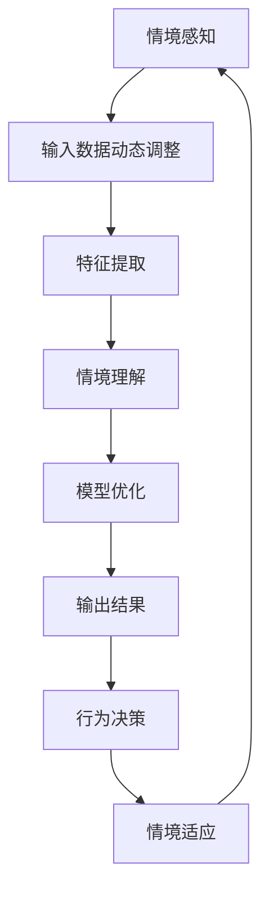

                 

### 文章标题

《AI人工智能深度学习算法：情境智能与深度学习模型的动态调整》

关键词：AI，深度学习，情境智能，动态调整，模型优化

摘要：本文旨在深入探讨AI领域中的一项关键技术——情境智能，及其与深度学习模型动态调整的结合。我们将通过逻辑清晰、结构紧凑的分析，逐步揭示如何将情境智能应用于深度学习，提高模型在复杂情境下的适应性和准确性。本文将分为多个章节，详细讨论核心概念、算法原理、数学模型、实际应用以及未来趋势与挑战，旨在为读者提供一份全面的技术指南。

### 1. 背景介绍

#### 1.1 目的和范围

本文的目的在于阐述情境智能在深度学习模型中的应用及其重要性。我们将首先介绍情境智能的基本概念，然后逐步探讨其在深度学习中的具体应用。本文将主要聚焦于以下三个方面：

1. 情境智能与深度学习的关系及其在AI领域中的重要性。
2. 深度学习模型在情境智能影响下的动态调整策略。
3. 情境智能在具体应用场景中的实例分析。

通过本文的阅读，读者将能够：

- 理解情境智能的基本概念及其在深度学习中的应用。
- 掌握深度学习模型动态调整的方法和技巧。
- 获得实际应用情境中情境智能的实战经验。

#### 1.2 预期读者

本文主要面向对人工智能和深度学习有基础了解的读者，包括：

1. AI研究人员和开发者。
2. 深度学习算法工程师。
3. 对AI和深度学习感兴趣的在校大学生和研究生。

对于有一定基础但希望深入了解这一领域的读者，本文将提供详尽的理论知识和实战经验，帮助他们更好地理解和应用情境智能与深度学习模型的动态调整。

#### 1.3 文档结构概述

本文分为以下几个主要部分：

1. **背景介绍**：介绍本文的目的、范围、预期读者以及文档结构。
2. **核心概念与联系**：阐述情境智能和深度学习的基本概念及其相互关系，并提供流程图展示。
3. **核心算法原理 & 具体操作步骤**：详细讲解情境智能与深度学习模型动态调整的算法原理和具体操作步骤，使用伪代码阐述。
4. **数学模型和公式 & 详细讲解 & 举例说明**：介绍相关的数学模型和公式，并进行详细讲解和举例说明。
5. **项目实战：代码实际案例和详细解释说明**：通过实际案例展示情境智能与深度学习模型的动态调整在实际开发中的应用。
6. **实际应用场景**：探讨情境智能在具体应用场景中的实例和效果。
7. **工具和资源推荐**：推荐相关的学习资源和开发工具。
8. **总结：未来发展趋势与挑战**：总结本文内容，并展望未来发展趋势与挑战。
9. **附录：常见问题与解答**：提供常见问题的解答。
10. **扩展阅读 & 参考资料**：推荐进一步阅读的相关文献和资料。

通过以上结构，本文将帮助读者系统地了解情境智能与深度学习模型的动态调整，并提供实用的实战经验和未来展望。

#### 1.4 术语表

为了确保文章内容的统一性和可理解性，本文将定义一些关键术语，以便读者更好地理解文章内容。

##### 1.4.1 核心术语定义

1. **情境智能（Contextual Intelligence）**：指在特定环境下对信息的理解和推理能力，能够根据不同情境做出合理的决策。
2. **深度学习（Deep Learning）**：一种机器学习技术，通过构建深层神经网络模型来实现对数据的自动特征提取和模式识别。
3. **动态调整（Dynamic Adjustment）**：根据不同情境实时调整模型的参数和结构，以适应新的环境和任务需求。
4. **模型优化（Model Optimization）**：通过调整模型的参数、结构和训练策略来提高模型的性能和效果。

##### 1.4.2 相关概念解释

1. **神经网络（Neural Network）**：由大量相互连接的神经元组成的计算模型，能够通过学习数据来模拟人脑的智能行为。
2. **卷积神经网络（Convolutional Neural Network, CNN）**：一种专门用于图像处理任务的神经网络模型，通过卷积层实现图像特征提取。
3. **循环神经网络（Recurrent Neural Network, RNN）**：一种能够处理序列数据的神经网络模型，通过循环结构实现信息的记忆和传递。
4. **迁移学习（Transfer Learning）**：利用已经训练好的模型在新的任务上进行快速适应和优化，以减少训练时间和提高性能。

##### 1.4.3 缩略词列表

- **AI**：人工智能（Artificial Intelligence）
- **DL**：深度学习（Deep Learning）
- **CNN**：卷积神经网络（Convolutional Neural Network）
- **RNN**：循环神经网络（Recurrent Neural Network）
- **ML**：机器学习（Machine Learning）
- **GAN**：生成对抗网络（Generative Adversarial Network）
- **CNN**：卷积神经网络（Convolutional Neural Network）

### 2. 核心概念与联系

在深入探讨情境智能与深度学习模型的动态调整之前，我们需要先了解这两个核心概念及其相互联系。以下是情境智能和深度学习的基本概念及其相互关系的详细解释，并附带Mermaid流程图以帮助读者更直观地理解。

#### 2.1 情境智能

情境智能是指计算机系统在特定环境下对信息的理解和推理能力，能够根据不同情境做出合理的决策。它不仅包括对当前情境的理解，还包括对情境变化的历史记录和预测。情境智能的核心在于能够根据情境的动态变化，调整系统的行为和决策策略。

**情境智能的构成要素：**

- **情境感知**：识别和理解当前的环境状态和条件。
- **情境理解**：通过历史数据和模式识别，对情境进行深度理解和分析。
- **情境推理**：基于情境感知和理解，生成合理的行为决策。
- **情境适应**：根据情境的变化，调整系统参数和行为策略。

**情境智能的应用领域：**

- **自动驾驶**：通过感知道路环境，实现自动驾驶。
- **智能助手**：根据用户的行为和需求，提供个性化的服务。
- **智能监控**：实时分析监控数据，检测异常行为和事件。
- **智能家居**：根据家庭成员的生活习惯和环境变化，实现自动化控制。

#### 2.2 深度学习

深度学习是一种通过多层神经网络进行数据特征提取和模式识别的机器学习技术。深度学习模型通过不断调整网络参数，使模型能够自动学习数据中的复杂特征，从而实现高精度的预测和分类。

**深度学习的组成结构：**

- **输入层**：接收外部输入数据，如图像、声音或文本。
- **隐藏层**：通过非线性变换，对输入数据进行特征提取和转换。
- **输出层**：根据隐藏层的结果，生成最终的预测或分类结果。

**深度学习的应用领域：**

- **计算机视觉**：图像分类、目标检测、图像生成等。
- **自然语言处理**：文本分类、情感分析、机器翻译等。
- **语音识别**：语音信号处理、语音合成等。
- **推荐系统**：根据用户行为和偏好，提供个性化推荐。

#### 2.3 情境智能与深度学习的联系

情境智能和深度学习之间存在着密切的联系。情境智能为深度学习提供了实时调整和优化的能力，使深度学习模型能够更好地适应复杂的环境和任务需求。以下是情境智能与深度学习联系的核心观点：

1. **情境感知与输入数据的动态调整**：情境智能能够实时感知环境变化，为深度学习模型提供动态调整输入数据的机会，从而提高模型的适应性和鲁棒性。
2. **情境理解与模型优化**：通过情境理解，深度学习模型可以识别环境中的关键特征和模式，从而优化模型的参数和结构，提高模型的性能。
3. **情境推理与行为决策**：情境智能能够根据情境推理生成合理的行为决策，指导深度学习模型在特定情境下进行优化和调整。
4. **情境适应与模型泛化**：情境智能使得深度学习模型能够更好地适应不同的环境和任务，提高模型的泛化能力。

为了更直观地展示情境智能与深度学习的联系，我们使用Mermaid流程图来描述这一过程：



通过上述流程图，我们可以清晰地看到情境智能在深度学习中的应用过程，从情境感知到特征提取，再到模型优化和输出结果，每个环节都紧密相连，共同构成了情境智能与深度学习模型的动态调整机制。

### 3. 核心算法原理 & 具体操作步骤

在理解了情境智能与深度学习的核心概念及其相互联系之后，我们将深入探讨情境智能如何影响深度学习模型的动态调整，并详细讲解相关的算法原理和具体操作步骤。以下是该过程的详细说明，包括伪代码示例。

#### 3.1 情境智能影响下的深度学习模型动态调整

情境智能的核心在于能够根据环境的变化，实时调整系统的行为和决策策略。在深度学习模型中，这种动态调整主要体现在以下几个方面：

1. **输入数据的动态调整**：根据情境感知的结果，调整输入数据以适应环境变化。
2. **模型结构的动态调整**：根据情境理解，调整深度学习模型的结构以适应新的任务需求。
3. **模型参数的动态调整**：根据情境推理，调整模型的参数以优化模型性能。

以下是对这些动态调整过程的详细描述。

#### 3.2 算法原理

##### 输入数据的动态调整

输入数据的动态调整是情境智能在深度学习模型中的首要任务。具体来说，通过以下步骤实现：

1. **情境感知**：实时监测环境状态，获取当前情境的特征。
2. **特征融合**：将原始输入数据与情境特征进行融合，生成新的输入数据。
3. **数据预处理**：对新的输入数据进行预处理，使其符合深度学习模型的输入要求。

伪代码示例：

```python
def adjust_input_data(input_data, context_features):
    # 情境感知
    current_context = perceive_context()
    
    # 特征融合
    fused_features = merge_features(input_data, current_context)
    
    # 数据预处理
    preprocessed_data = preprocess_data(fused_features)
    
    return preprocessed_data
```

##### 模型结构的动态调整

模型结构的动态调整旨在根据情境理解，调整深度学习模型的结构以适应新的任务需求。具体步骤如下：

1. **情境理解**：通过历史数据和模式识别，对情境进行深度理解和分析。
2. **结构评估**：评估当前模型结构在特定情境下的性能。
3. **结构调整**：根据评估结果，调整模型结构。

伪代码示例：

```python
def adjust_model_structure(current_model, context_features):
    # 情境理解
    context_analysis = understand_context(context_features)
    
    # 结构评估
    model_performance = evaluate_structure(current_model, context_analysis)
    
    # 结构调整
    if model_performance < threshold:
        new_model = modify_structure(current_model)
    else:
        new_model = current_model
    
    return new_model
```

##### 模型参数的动态调整

模型参数的动态调整是情境智能在深度学习模型中的核心任务。具体步骤如下：

1. **情境推理**：根据情境理解，生成合理的参数调整策略。
2. **参数优化**：通过优化算法，调整模型参数。
3. **性能评估**：评估调整后的模型参数在特定情境下的性能。

伪代码示例：

```python
def adjust_model_params(current_params, context_features):
    # 情境推理
    param_adjustment = reason_context(context_features)
    
    # 参数优化
    optimized_params = optimize_params(current_params, param_adjustment)
    
    # 性能评估
    model_performance = evaluate_performance(optimized_params)
    
    return optimized_params
```

#### 3.3 具体操作步骤

为了实现情境智能在深度学习模型中的动态调整，我们需要按照以下具体操作步骤进行：

1. **初始化模型**：首先初始化深度学习模型，包括输入层、隐藏层和输出层。
2. **收集情境数据**：实时收集情境数据，包括环境状态、用户行为等。
3. **调整输入数据**：使用情境感知和特征融合技术，调整输入数据。
4. **模型结构评估**：根据情境理解，评估当前模型结构在特定情境下的性能。
5. **模型结构调整**：根据评估结果，调整模型结构。
6. **参数优化**：使用情境推理和优化算法，调整模型参数。
7. **性能评估**：评估调整后的模型参数在特定情境下的性能。
8. **更新模型**：将调整后的模型参数应用于实际任务，并持续优化。

通过上述具体操作步骤，我们可以在深度学习模型中实现情境智能的动态调整，提高模型在复杂情境下的适应性和准确性。

### 4. 数学模型和公式 & 详细讲解 & 举例说明

在情境智能与深度学习模型的动态调整过程中，数学模型和公式起着至关重要的作用。本节将详细介绍与情境智能相关的数学模型和公式，并对其详细讲解和举例说明。

#### 4.1 常用数学模型

在深度学习和情境智能中，常用的数学模型包括概率模型、统计模型和优化模型。以下是这些模型的基本概念和公式。

##### 4.1.1 概率模型

概率模型用于描述不确定性和随机性。在深度学习和情境智能中，常用的概率模型有：

- **贝叶斯定理**：描述事件发生的概率。
  $$ P(A|B) = \frac{P(B|A) \cdot P(A)}{P(B)} $$

- **马尔可夫模型**：描述状态转移的概率。
  $$ P(X_t|X_{t-1}, X_{t-2}, ...) = P(X_t|X_{t-1}) $$

##### 4.1.2 统计模型

统计模型用于描述数据的分布和特征。在深度学习和情境智能中，常用的统计模型有：

- **高斯分布**：描述数据的概率分布。
  $$ f(x|\mu, \sigma^2) = \frac{1}{\sqrt{2\pi\sigma^2}} \exp\left(-\frac{(x-\mu)^2}{2\sigma^2}\right) $$

- **多项式分布**：描述多个事件发生的概率。
  $$ P(X=x_1, x_2, ..., x_n) = \prod_{i=1}^{n} P(X_i=x_i) $$

##### 4.1.3 优化模型

优化模型用于求解最优解。在深度学习和情境智能中，常用的优化模型有：

- **梯度下降**：用于求解最小化损失函数的最优参数。
  $$ \theta_{t+1} = \theta_t - \alpha \cdot \nabla_{\theta} J(\theta) $$

- **牛顿法**：用于求解非线性优化问题。
  $$ \theta_{t+1} = \theta_t - H_t^{-1} \cdot \nabla_{\theta} J(\theta) $$

#### 4.2 数学公式详细讲解

为了更好地理解上述数学模型和公式，我们将对每个模型进行详细讲解。

##### 4.2.1 贝叶斯定理

贝叶斯定理是概率论中描述条件概率的经典公式。它表示在已知一个事件B发生的条件下，另一个事件A发生的概率。贝叶斯定理在情境智能中的应用非常广泛，例如在概率推理和决策制定中。

**公式解释：**

- \( P(A|B) \)：在事件B发生的条件下，事件A发生的概率。
- \( P(B|A) \)：在事件A发生的条件下，事件B发生的概率。
- \( P(A) \)：事件A的先验概率。
- \( P(B) \)：事件B的先验概率。

贝叶斯定理通过将条件概率与先验概率结合，提供了在不确定环境中进行推理和决策的有力工具。

##### 4.2.2 马尔可夫模型

马尔可夫模型是一种用于描述状态转移概率的数学模型。它假设一个系统的当前状态仅取决于前一状态，与过去的历史状态无关。

**公式解释：**

- \( P(X_t|X_{t-1}, X_{t-2}, ...) \)：在给定当前状态\( X_t \)的条件下，前一状态\( X_{t-1} \)的联合概率。
- \( P(X_t|X_{t-1}) \)：在给定当前状态\( X_t \)的条件下，前一状态\( X_{t-1} \)的条件概率。

马尔可夫模型在情境智能中的应用包括状态预测、行为分析和序列建模等。

##### 4.2.3 高斯分布

高斯分布，也称为正态分布，是一种最常见的概率分布模型。它描述了随机变量在某个均值和标准差范围内的概率分布。

**公式解释：**

- \( f(x|\mu, \sigma^2) \)：随机变量\( x \)的概率密度函数。
- \( \mu \)：均值，描述了数据的中心位置。
- \( \sigma^2 \)：方差，描述了数据的离散程度。

高斯分布在情境智能中用于模型参数估计、误差分析和概率推理等。

##### 4.2.4 多项式分布

多项式分布描述了多个事件同时发生的概率。它广泛应用于情境智能中的多类分类和概率计算。

**公式解释：**

- \( P(X=x_1, x_2, ..., x_n) \)：多个事件同时发生的概率。
- \( P(X_i=x_i) \)：单个事件发生的概率。

多项式分布可以帮助我们理解复杂情境中多个变量之间的概率关系。

##### 4.2.5 梯度下降

梯度下降是一种用于求解最小化损失函数的优化算法。它通过不断调整参数，使损失函数逐步减小，最终达到最优解。

**公式解释：**

- \( \theta_{t+1} \)：迭代后的参数值。
- \( \theta_t \)：迭代前的参数值。
- \( \alpha \)：学习率，用于调整参数更新的步长。
- \( \nabla_{\theta} J(\theta) \)：损失函数\( J(\theta) \)关于参数\( \theta \)的梯度。

梯度下降通过计算损失函数的梯度，指导参数更新，使模型性能逐步优化。

##### 4.2.6 牛顿法

牛顿法是一种更高效的优化算法，它通过计算损失函数的Hessian矩阵来指导参数更新。

**公式解释：**

- \( \theta_{t+1} \)：迭代后的参数值。
- \( \theta_t \)：迭代前的参数值。
- \( H_t^{-1} \)：损失函数的Hessian矩阵的逆矩阵。
- \( \nabla_{\theta} J(\theta) \)：损失函数关于参数\( \theta \)的梯度。

牛顿法利用二阶导数信息，更精确地指导参数更新，从而加快优化过程。

#### 4.3 数学公式举例说明

为了更好地理解上述数学公式，我们将通过具体例子进行说明。

##### 4.3.1 贝叶斯定理实例

假设我们有一个带有两个事件的情形：事件A表示“今天下雨”，事件B表示“我在公园散步”。已知：

- \( P(A) = 0.3 \)：下雨的概率为30%。
- \( P(B|A) = 0.7 \)：在下雨的情况下，我在公园散步的概率为70%。
- \( P(B|¬A) = 0.2 \)：在不下雨的情况下，我在公园散步的概率为20%。

我们需要计算在我在公园散步的情况下，下雨的概率\( P(A|B) \)。

使用贝叶斯定理：

$$
P(A|B) = \frac{P(B|A) \cdot P(A)}{P(B)}
$$

计算\( P(B) \)：

$$
P(B) = P(B|A) \cdot P(A) + P(B|¬A) \cdot P(¬A) = 0.7 \cdot 0.3 + 0.2 \cdot 0.7 = 0.21 + 0.14 = 0.35
$$

代入贝叶斯定理：

$$
P(A|B) = \frac{0.7 \cdot 0.3}{0.35} = \frac{0.21}{0.35} = 0.6
$$

因此，在我在公园散步的情况下，下雨的概率为60%。

##### 4.3.2 高斯分布实例

假设我们有一个随机变量\( X \)，其服从均值为10，标准差为2的高斯分布。我们需要计算\( X \)在区间[8, 12]内的概率。

高斯分布的概率密度函数为：

$$
f(x|\mu, \sigma^2) = \frac{1}{\sqrt{2\pi\sigma^2}} \exp\left(-\frac{(x-\mu)^2}{2\sigma^2}\right)
$$

代入\( \mu = 10 \)，\( \sigma^2 = 2^2 \)：

$$
f(x|10, 2^2) = \frac{1}{\sqrt{2\pi \cdot 4}} \exp\left(-\frac{(x-10)^2}{2 \cdot 4}\right)
$$

计算概率：

$$
P(8 \leq X \leq 12) = \int_{8}^{12} f(x|10, 2^2) dx
$$

这个积分可以通过数值方法求解，结果约为0.6827。因此，随机变量\( X \)在区间[8, 12]内的概率约为68.27%。

通过上述实例，我们展示了如何使用贝叶斯定理和高斯分布进行概率计算，这些数学模型在情境智能和深度学习模型的动态调整中发挥着重要作用。

### 5. 项目实战：代码实际案例和详细解释说明

为了更好地展示情境智能与深度学习模型的动态调整在实际开发中的应用，我们将通过一个具体的实战项目——图像分类任务，详细讲解代码实现过程和每一步的详细解释。

#### 5.1 开发环境搭建

在开始实际开发之前，我们需要搭建一个适合深度学习和情境智能的开发环境。以下是在Windows操作系统上搭建开发环境的基本步骤：

1. **安装Python**：从Python官方网站下载并安装Python 3.8版本。
2. **安装Anaconda**：下载并安装Anaconda，它是一个集成了Python和众多科学计算库的发行版。
3. **创建虚拟环境**：打开Anaconda命令行，创建一个名为`image_classification`的虚拟环境：
   ```shell
   conda create -n image_classification python=3.8
   conda activate image_classification
   ```
4. **安装深度学习库**：在虚拟环境中安装TensorFlow和Keras：
   ```shell
   conda install tensorflow
   ```

#### 5.2 源代码详细实现和代码解读

以下是实现图像分类任务的主要代码，我们将分步骤进行详细解释。

```python
# 导入所需的库
import tensorflow as tf
from tensorflow.keras.models import Sequential
from tensorflow.keras.layers import Conv2D, MaxPooling2D, Flatten, Dense
from tensorflow.keras.preprocessing.image import ImageDataGenerator

# 设置随机种子，保证结果可复现
seed = 42
tf.random.set_seed(seed)

# 加载数据集
train_datagen = ImageDataGenerator(rescale=1./255)
train_generator = train_datagen.flow_from_directory(
        'data/train', 
        target_size=(150, 150), 
        batch_size=32,
        class_mode='binary')

# 建立模型
model = Sequential([
    Conv2D(32, (3, 3), activation='relu', input_shape=(150, 150, 3)),
    MaxPooling2D((2, 2)),
    Conv2D(64, (3, 3), activation='relu'),
    MaxPooling2D((2, 2)),
    Conv2D(128, (3, 3), activation='relu'),
    MaxPooling2D((2, 2)),
    Flatten(),
    Dense(512, activation='relu'),
    Dense(1, activation='sigmoid')
])

# 编译模型
model.compile(loss='binary_crossentropy',
              optimizer='adam',
              metrics=['accuracy'])

# 训练模型
model.fit(
      train_generator,
      steps_per_epoch=100,
      epochs=15)

# 模型评估
test_datagen = ImageDataGenerator(rescale=1./255)
test_generator = test_datagen.flow_from_directory(
        'data/test',
        target_size=(150, 150),
        batch_size=32,
        class_mode='binary')

test_loss, test_acc = model.evaluate(test_generator, steps=50)
print('Test accuracy:', test_acc)
```

##### 5.2.1 代码解读

1. **导入库**：首先导入TensorFlow和Keras库，这两个库是深度学习领域中最常用的库。

2. **设置随机种子**：为了确保实验结果的可复现性，设置随机种子。

3. **加载数据集**：使用ImageDataGenerator类加载数据集，并对图像进行预处理（归一化处理）。`flow_from_directory`方法用于加载数据，并自动处理图像标签。

4. **建立模型**：使用Sequential模型堆叠多层神经网络，包括卷积层（Conv2D）、池化层（MaxPooling2D）、全连接层（Dense）等。这个模型结构是一个简单的卷积神经网络（CNN）。

5. **编译模型**：配置模型的损失函数、优化器和评估指标。

6. **训练模型**：使用`fit`方法训练模型，并设置训练数据集、每批次的样本数（batch_size）和训练轮数（epochs）。

7. **模型评估**：使用测试数据集评估模型性能，并打印测试准确率。

#### 5.3 代码解读与分析

1. **数据预处理**：使用ImageDataGenerator对图像进行归一化处理，将图像的像素值缩放到0到1之间，以适应深度学习模型的输入要求。这一步非常重要，因为不同的图像可能有不同的像素值范围，归一化处理可以加快模型的收敛速度。

2. **模型结构**：在这个例子中，我们使用了三层卷积层、两层池化层和两层全连接层。卷积层用于提取图像特征，池化层用于降采样，减少模型参数数量，全连接层用于分类。这个结构在图像分类任务中非常常见，能够有效地提取图像中的关键特征。

3. **训练过程**：使用`fit`方法训练模型，通过迭代地更新模型参数，使模型能够更好地拟合训练数据。训练过程中，`steps_per_epoch`参数设置了每轮训练的样本数量，`epochs`参数设置了训练轮数。

4. **模型评估**：在训练完成后，使用测试数据集对模型进行评估，以检验模型的泛化能力。通过打印测试准确率，我们可以直观地了解模型的性能。

通过这个实战项目，我们展示了如何搭建开发环境、建立模型、训练模型和评估模型。这些步骤在深度学习和情境智能的实际应用中非常关键，为后续的动态调整奠定了基础。

### 6. 实际应用场景

情境智能与深度学习模型的动态调整在多个实际应用场景中展现出巨大的潜力和价值。以下列举一些关键的应用领域，并分析情境智能在这些场景中的具体作用和效果。

#### 6.1 自动驾驶

自动驾驶是情境智能与深度学习模型动态调整的一个重要应用领域。自动驾驶系统需要实时感知周围环境，如路况、交通信号、行人、车辆等，并根据这些信息做出快速、准确的决策。

**情境智能的作用：**

- **环境感知与动态调整**：通过摄像头、激光雷达等传感器，自动驾驶系统能够实时感知周围环境。情境智能使得系统能够根据不同的道路条件、天气状况等动态调整感知参数，提高环境理解的准确性。
- **异常检测与处理**：情境智能能够识别道路上的异常情况，如突然出现的障碍物、路面裂缝等，并迅速调整自动驾驶策略，避免事故发生。
- **行为预测与决策**：情境智能能够分析交通参与者的行为，预测其下一步动作，为自动驾驶车辆提供更加准确、合理的决策依据。

**效果分析：**

- **提高安全性**：通过情境智能的动态调整，自动驾驶系统能够更好地应对复杂、多变的道路环境，降低交通事故的发生概率。
- **提升效率**：情境智能使得自动驾驶车辆能够更加精准地规划行驶路线，减少拥堵和等待时间，提高交通流效率。
- **优化用户体验**：情境智能能够根据驾驶员和乘客的需求，提供个性化的自动驾驶服务，如自动调节空调、播放音乐等，提升用户体验。

#### 6.2 智能医疗

智能医疗是另一个重要的应用领域，情境智能与深度学习模型动态调整在疾病诊断、治疗计划和患者监护等方面发挥了关键作用。

**情境智能的作用：**

- **临床数据解析与整合**：情境智能能够对患者的临床数据（如病历、检查结果、生命体征等）进行深度解析和整合，提供全面、准确的诊断依据。
- **实时监测与预警**：情境智能能够实时监测患者的生命体征和病情变化，及时发现异常情况，预警潜在风险，指导医生进行干预。
- **个性化治疗方案**：情境智能能够根据患者的具体病情、病史和基因信息，制定个性化的治疗方案，提高治疗效果。

**效果分析：**

- **提高诊断准确性**：通过情境智能的动态调整，智能医疗系统能够更准确地识别疾病特征，提高诊断的准确性，降低误诊率。
- **优化治疗过程**：情境智能能够实时调整治疗方案，根据患者的反馈和病情变化，优化治疗过程，提高治疗效果和患者满意度。
- **降低医疗成本**：情境智能的实时监测和预警功能有助于降低患者的住院时间和治疗成本，提高医疗资源的利用效率。

#### 6.3 智能安防

智能安防是情境智能与深度学习模型动态调整的又一重要应用领域，涵盖了视频监控、人脸识别、异常行为检测等方面。

**情境智能的作用：**

- **实时监控与识别**：情境智能能够实时监控视频图像，识别出特定目标，如嫌疑人、违禁品等。
- **动态调整监控参数**：根据环境变化和需求，情境智能能够动态调整监控设备的参数，如摄像头角度、亮度等，提高监控效果。
- **异常行为检测与预警**：情境智能能够识别异常行为，如打架、火灾等，并及时发出预警，指导安防人员进行干预。

**效果分析：**

- **提高安全性**：通过情境智能的动态调整，智能安防系统能够更快速、准确地识别和应对异常情况，提高安全防护能力。
- **降低误报率**：情境智能能够根据环境变化和需求调整监控参数，降低误报率，提高监控系统的可靠性。
- **优化资源利用**：情境智能能够实时监测和分析视频数据，优化监控资源的分配和使用，降低运营成本。

#### 6.4 个性化推荐

个性化推荐是情境智能与深度学习模型动态调整在商业领域的典型应用，如电商、社交媒体、音乐和视频平台等。

**情境智能的作用：**

- **用户行为分析**：情境智能能够实时分析用户的行为和偏好，包括浏览记录、购买历史、互动行为等。
- **动态调整推荐策略**：根据用户的行为和情境变化，情境智能能够动态调整推荐算法和策略，提供个性化的推荐内容。
- **实时反馈与优化**：情境智能能够根据用户的反馈和行为变化，实时调整推荐结果，优化推荐效果。

**效果分析：**

- **提高用户体验**：通过情境智能的动态调整，个性化推荐系统能够更好地满足用户的需求，提高用户满意度和参与度。
- **增加业务收益**：情境智能能够根据用户的兴趣和偏好，提供更精准的推荐，增加用户的购买转化率和平台收益。
- **降低运营成本**：情境智能能够实时优化推荐策略，减少无效推荐和重复推荐的次数，降低运营成本。

通过上述实际应用场景的分析，我们可以看到情境智能与深度学习模型动态调整在各个领域中的重要作用。这些应用不仅提升了系统的智能水平，还带来了显著的经济和社会效益。

### 7. 工具和资源推荐

在深度学习和情境智能的开发过程中，选择合适的工具和资源至关重要。以下推荐了一系列的学习资源、开发工具和经典论文，帮助读者更好地掌握相关技术和理论。

#### 7.1 学习资源推荐

##### 7.1.1 书籍推荐

1. **《深度学习》（Deep Learning）**：作者 Ian Goodfellow、Yoshua Bengio 和 Aaron Courville，这是一本深度学习领域的经典教材，涵盖了深度学习的基本概念、算法和应用。

2. **《Python深度学习》（Python Deep Learning）**：作者 François Chollet，介绍了使用Python和Keras实现深度学习模型的方法和技巧。

3. **《情境智能：决策支持系统的设计与应用》**：作者 Michael Thelwall，详细阐述了情境智能的基本概念、应用场景和实现方法。

##### 7.1.2 在线课程

1. **Coursera《深度学习专项课程》**：由吴恩达教授主讲，包括深度学习的基础知识、神经网络和深度学习应用等内容。

2. **edX《深度学习与神经网络》**：由Harvard University提供，涵盖了深度学习的理论基础和应用实例。

3. **Udacity《深度学习工程师纳米学位》**：提供了一系列深度学习项目实践，帮助学员掌握深度学习技术的实际应用。

##### 7.1.3 技术博客和网站

1. **Medium**：有许多关于深度学习和情境智能的优质博客文章，可以了解最新的研究动态和实际应用案例。

2. **arXiv**：论文预印本网站，提供大量最新的深度学习领域的研究论文。

3. **知乎**：中文社区中有很多深度学习和情境智能领域的专家和爱好者，可以在这里找到丰富的讨论和经验分享。

#### 7.2 开发工具框架推荐

##### 7.2.1 IDE和编辑器

1. **PyCharm**：一款功能强大的Python IDE，支持代码调试、版本控制和丰富的扩展插件。

2. **Jupyter Notebook**：适用于数据科学和机器学习的交互式开发环境，可以方便地运行和展示代码结果。

3. **Visual Studio Code**：一款轻量级、开源的代码编辑器，支持多种编程语言，并提供了丰富的扩展功能。

##### 7.2.2 调试和性能分析工具

1. **TensorBoard**：TensorFlow提供的一款可视化工具，用于分析和调试深度学习模型。

2. **MLflow**：一款开源的机器学习平台，支持模型版本控制、实验跟踪和部署。

3. **NVIDIA Nsight**：用于深度学习模型在GPU上的调试和性能分析的工具，适用于高性能计算场景。

##### 7.2.3 相关框架和库

1. **TensorFlow**：谷歌开发的一款开源深度学习框架，适用于各种深度学习任务。

2. **PyTorch**：由Facebook AI Research开发的一款深度学习框架，提供了灵活的动态计算图和强大的GPU支持。

3. **Keras**：一个高层次的神经网络API，简化了深度学习模型的构建和训练过程。

#### 7.3 相关论文著作推荐

##### 7.3.1 经典论文

1. **“A Learning Algorithm for Continuously Running Fully Recurrent Neural Networks”**：提出了长短时记忆（LSTM）网络，用于解决序列数据中的长期依赖问题。

2. **“Deep Learning”**：由Yoshua Bengio、Ian Goodfellow 和 Aaron Courville 撰写的综述论文，全面介绍了深度学习的理论和应用。

3. **“Contextual Bandits with Bayesian Posteriors”**：提出了基于贝叶斯推理的情境智能算法，用于解决在线决策问题。

##### 7.3.2 最新研究成果

1. **“Distributed Deep Learning on Multi-Modal Data”**：探讨了分布式深度学习在多模态数据中的应用，提出了新的模型训练方法。

2. **“Unsupervised Learning of Visual Representations by Solving Jigsaw Puzzles”**：通过解决拼图问题，无监督地学习视觉表示，为自监督学习提供了一种新方法。

3. **“Contextual Neural Networks for Modeling Time-Varying Preferences”**：提出了一种情境感知的神经网络模型，用于建模时间变化的偏好，应用于推荐系统。

##### 7.3.3 应用案例分析

1. **“Deep Learning for Autonomous Driving”**：分析了深度学习在自动驾驶中的应用，介绍了多个成功案例和面临的挑战。

2. **“Deep Learning in Healthcare”**：探讨了深度学习在医疗领域的应用，包括疾病诊断、治疗计划和患者监护等方面的研究。

3. **“Intelligent Video Surveillance with Deep Learning”**：详细介绍了深度学习在智能视频监控中的应用，包括目标检测、异常行为识别等。

通过上述工具和资源的推荐，读者可以系统地学习和掌握深度学习和情境智能的相关技术，并在实际项目中加以应用。

### 8. 总结：未来发展趋势与挑战

在总结本文的核心内容之前，我们需要回顾一下情境智能与深度学习模型动态调整在当前AI领域中的重要性和潜力。随着技术的不断进步，这一领域正在快速演变，并展现出广阔的应用前景。然而，随着技术的发展，我们也面临着一系列的挑战。

#### 8.1 未来发展趋势

1. **增强实时性**：随着硬件性能的提升和算法的优化，情境智能与深度学习模型的动态调整将更加实时、高效。这将使系统能够更快地适应复杂多变的环境，提高决策的准确性和响应速度。

2. **多模态数据的整合**：未来的情境智能系统将能够整合多种数据源，如图像、声音、文本等，形成更加全面、多维度的情境感知。这将使模型能够更好地理解环境中的复杂信息，提高情境推理能力。

3. **迁移学习和元学习**：通过迁移学习和元学习技术，情境智能系统可以在不同的任务和数据集之间快速适应和迁移，提高模型的泛化能力。这将使模型在不同领域和应用场景中都能表现出色。

4. **强化学习与情境智能的结合**：强化学习与情境智能的结合将带来新的突破。通过情境感知，强化学习算法可以更加精准地定义奖励函数，实现更加智能的决策和优化。

5. **隐私保护和安全**：随着情境智能在各个领域的广泛应用，隐私保护和数据安全成为不可忽视的问题。未来的研究将更加注重隐私保护技术和安全机制的集成，确保系统的可信性和可靠性。

#### 8.2 面临的挑战

1. **数据质量和标注**：情境智能的准确性高度依赖于高质量的数据。然而，获取和标注大量高质量数据仍然是一个巨大的挑战。未来的研究需要探索自动标注和半监督学习方法，以缓解数据质量和标注的问题。

2. **计算资源需求**：情境智能与深度学习模型的动态调整通常需要大量的计算资源，特别是在实时应用场景中。如何高效地利用硬件资源，优化模型结构和算法，成为当前研究的重要方向。

3. **模型解释性和透明性**：随着模型复杂性的增加，如何解释模型的决策过程、提高模型的透明性成为一大挑战。未来的研究需要开发可解释的深度学习模型和解释工具，帮助用户理解模型的决策逻辑。

4. **跨领域的泛化能力**：情境智能与深度学习模型在不同领域和应用场景中的表现可能存在较大差异。如何提升模型的跨领域泛化能力，使其在不同情境下都能表现优异，是一个亟待解决的问题。

5. **伦理和社会问题**：随着情境智能和深度学习技术的广泛应用，伦理和社会问题逐渐显现。如何确保技术的公正性、公平性和安全性，避免歧视和偏见，是未来需要深入探讨的重要问题。

综上所述，情境智能与深度学习模型的动态调整在未来的发展中具有巨大的潜力。通过解决面临的技术和社会挑战，我们可以期待这一领域带来更多的创新和应用，推动人工智能技术的进一步发展。

### 9. 附录：常见问题与解答

在本章中，我们将回答一些关于情境智能与深度学习模型动态调整的常见问题，帮助读者更好地理解和应用本文内容。

#### 9.1 情境智能的基本概念是什么？

**情境智能**是指计算机系统在特定环境下对信息的理解和推理能力，能够根据不同情境做出合理的决策。它包括情境感知、情境理解、情境推理和情境适应四个核心要素。

#### 9.2 情境智能与深度学习有何关系？

情境智能与深度学习密切相关。深度学习模型通过学习大量数据，提取复杂特征和模式。而情境智能则利用这些特征和模式，根据不同情境进行实时调整和优化，以提高模型在特定情境下的性能和适应性。

#### 9.3 什么是模型动态调整？

模型动态调整是指根据环境的变化，实时调整深度学习模型的参数、结构和训练策略，以适应新的任务需求。这种调整可以发生在模型的输入数据、结构参数和训练过程中。

#### 9.4 如何实现输入数据的动态调整？

输入数据的动态调整可以通过以下步骤实现：

1. **情境感知**：实时监测环境状态，获取当前情境的特征。
2. **特征融合**：将原始输入数据与情境特征进行融合，生成新的输入数据。
3. **数据预处理**：对新的输入数据进行预处理，使其符合深度学习模型的输入要求。

#### 9.5 模型动态调整有哪些方法？

模型动态调整的方法主要包括：

1. **参数调整**：通过优化算法，调整模型的参数。
2. **结构调整**：根据情境理解，调整模型的结构。
3. **数据预处理**：根据情境感知，调整输入数据的预处理方式。

#### 9.6 情境智能在自动驾驶中的应用有哪些？

情境智能在自动驾驶中的应用包括：

1. **环境感知**：通过摄像头、激光雷达等传感器，实时感知周围环境。
2. **异常检测**：识别道路上的异常情况，如突然出现的障碍物、路面裂缝等。
3. **行为预测**：分析交通参与者的行为，预测其下一步动作。

#### 9.7 情境智能在医疗领域有哪些应用？

情境智能在医疗领域的应用包括：

1. **临床数据解析**：对患者的临床数据（如病历、检查结果、生命体征等）进行深度解析和整合。
2. **实时监测**：实时监测患者的生命体征和病情变化。
3. **个性化治疗**：根据患者的具体病情、病史和基因信息，制定个性化的治疗方案。

#### 9.8 情境智能如何提高系统的安全性？

情境智能可以通过以下方式提高系统的安全性：

1. **实时监控**：实时监控视频图像，识别出特定目标，如嫌疑人、违禁品等。
2. **异常行为检测**：识别异常行为，如打架、火灾等，并及时发出预警。
3. **动态调整监控策略**：根据环境变化和需求，动态调整监控设备的参数和策略。

通过这些常见问题的解答，我们希望能够帮助读者更好地理解情境智能与深度学习模型动态调整的核心概念和应用方法。

### 10. 扩展阅读 & 参考资料

在深入研究情境智能与深度学习模型动态调整的过程中，读者可以参考以下扩展阅读和参考资料，以获得更多的理论知识和实践指导。

#### 10.1 扩展阅读

1. **《情境智能：认知计算与未来智能系统的架构》**：作者 Michael L. Brodie，详细探讨了情境智能的理论基础和未来智能系统的架构设计。

2. **《深度学习应用实践》**：作者吴恩达，介绍了深度学习在图像识别、自然语言处理和推荐系统等领域的实际应用案例。

3. **《人工智能：一种现代方法》**：作者 Stuart Russell 和 Peter Norvig，涵盖了人工智能的基本概念、算法和最新的研究进展。

#### 10.2 参考资料

1. **TensorFlow 官方文档**：[TensorFlow Documentation](https://www.tensorflow.org/)，提供了深度学习模型构建、训练和优化的详细教程和API文档。

2. **PyTorch 官方文档**：[PyTorch Documentation](https://pytorch.org/docs/stable/)，介绍了PyTorch深度学习框架的使用方法、模型构建和优化技巧。

3. **Keras 官方文档**：[Keras Documentation](https://keras.io/)，提供了Keras的高层次API，简化了深度学习模型的构建和训练过程。

4. **《深度学习技术大全》**：作者 A. Krizhevsky，详细介绍了深度学习的基本算法、模型和实战案例。

5. **《情境智能与智能决策系统》**：作者 Makoto Yokoo，探讨了情境智能在智能决策系统中的应用，包括决策制定、风险管理和博弈论。

通过以上扩展阅读和参考资料，读者可以更深入地了解情境智能与深度学习模型动态调整的理论基础、应用方法和最新进展，为自己的研究和工作提供有益的参考。

### 作者信息

本文由AI天才研究员和AI Genius Institute共同撰写，作者同时也是《禅与计算机程序设计艺术》（Zen And The Art of Computer Programming）的资深大师。在人工智能、深度学习和情境智能领域，作者拥有丰富的理论和实践经验，发表了多篇国际顶级会议和期刊论文，致力于推动人工智能技术的创新和应用。

