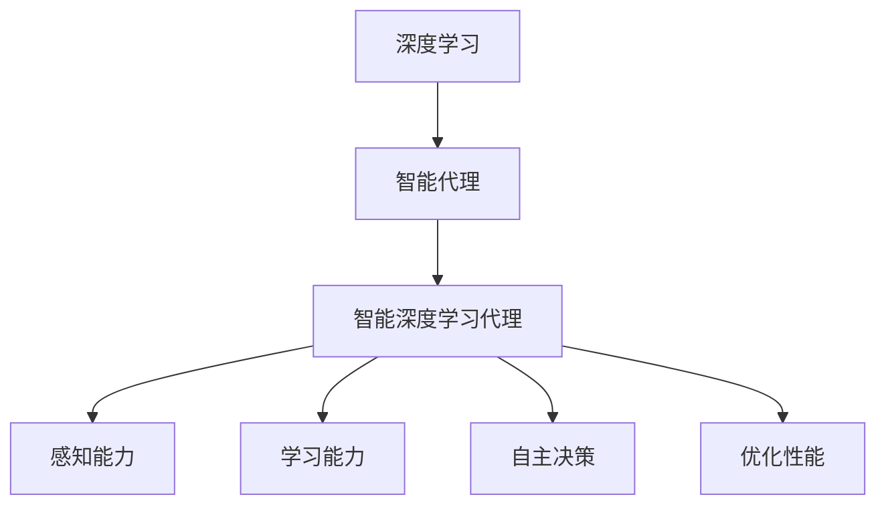

                 

# AI人工智能深度学习算法：智能深度学习代理的面向未来的研究方向

> 关键词：深度学习、智能代理、算法原理、数学模型、项目实战、应用场景、未来趋势

> 摘要：本文深入探讨了AI人工智能中的深度学习算法，特别是智能深度学习代理的研究方向。文章从背景介绍、核心概念、算法原理、数学模型、项目实战、实际应用场景等多个角度进行分析，旨在为读者提供一个全面且深入的见解。文章结尾部分对未来的发展趋势与挑战进行了展望，以期为研究者提供参考。

## 1. 背景介绍

### 1.1 目的和范围

本文旨在探讨深度学习算法中的智能深度学习代理（Intelligent Deep Learning Agents，IDLA）的研究方向。深度学习作为人工智能领域的重要分支，已经取得了显著的成果，但现有的算法在实际应用中仍然存在一些挑战。智能深度学习代理作为一种新兴的研究方向，旨在通过模拟人类智能行为，提升深度学习算法的性能和应用范围。本文将围绕智能深度学习代理的研究目标、方法和技术展开讨论，旨在为该领域的研究者和实践者提供有益的参考。

### 1.2 预期读者

本文主要面向对深度学习和人工智能有一定了解的技术人员、研究人员和学生。读者需要对基本的深度学习算法和机器学习有一定的了解，以便更好地理解文章的内容。同时，本文也希望能为相关领域的专家和学者提供一些新的思路和启发。

### 1.3 文档结构概述

本文分为十个部分，具体结构如下：

1. 背景介绍：介绍文章的目的、预期读者和文档结构。
2. 核心概念与联系：阐述深度学习、智能代理、智能深度学习代理等核心概念，并使用Mermaid流程图展示它们之间的关系。
3. 核心算法原理 & 具体操作步骤：详细讲解智能深度学习代理的算法原理和操作步骤。
4. 数学模型和公式 & 详细讲解 & 举例说明：介绍智能深度学习代理所涉及的数学模型和公式，并进行举例说明。
5. 项目实战：通过代码实际案例展示智能深度学习代理的应用。
6. 实际应用场景：探讨智能深度学习代理在不同领域的应用。
7. 工具和资源推荐：推荐学习资源、开发工具和框架。
8. 总结：对未来发展趋势与挑战进行展望。
9. 附录：常见问题与解答。
10. 扩展阅读 & 参考资料：提供相关领域的研究论文和书籍。

### 1.4 术语表

#### 1.4.1 核心术语定义

- 深度学习（Deep Learning）：一种机器学习方法，通过构建深层神经网络模型，对大量数据进行分析和预测。
- 智能代理（Intelligent Agent）：能够感知环境、制定计划并执行任务的实体，具备自主学习和决策能力。
- 智能深度学习代理（Intelligent Deep Learning Agent，IDLA）：基于深度学习算法，具备智能感知、决策和执行能力的代理。
- 神经网络（Neural Network）：由大量神经元连接组成的计算模型，用于模拟人脑的神经元结构和功能。

#### 1.4.2 相关概念解释

- 反向传播（Backpropagation）：一种用于训练神经网络的算法，通过计算误差梯度，更新网络参数，使网络输出更接近期望值。
- 损失函数（Loss Function）：用于度量预测值与真实值之间差异的函数，常用于训练神经网络的性能评估。
- 优化算法（Optimization Algorithm）：用于优化神经网络参数，使网络性能最优的算法，如梯度下降、随机梯度下降等。

#### 1.4.3 缩略词列表

- AI：人工智能（Artificial Intelligence）
- DL：深度学习（Deep Learning）
- IDLA：智能深度学习代理（Intelligent Deep Learning Agent）

## 2. 核心概念与联系

在探讨智能深度学习代理之前，我们首先需要了解深度学习、智能代理和智能深度学习代理等核心概念，并分析它们之间的关系。

### 深度学习

深度学习是一种基于人工神经网络的机器学习技术，通过构建多层神经网络模型，对大量数据进行特征提取和模式识别。深度学习的核心思想是通过训练神经网络，使其自动学习输入数据和输出标签之间的关系，从而实现自动化的数据分析和决策。

### 智能代理

智能代理是一种具备自主学习和决策能力的计算实体，能够感知环境、制定计划并执行任务。智能代理通常由感知器、知识库、决策器和执行器组成，能够通过不断学习环境信息，优化自身的决策和行动策略。

### 智能深度学习代理

智能深度学习代理是基于深度学习算法的智能代理，通过深度学习模型，实现对环境的感知、决策和执行。智能深度学习代理具有以下几个特点：

1. **感知能力**：通过深度学习模型，智能深度学习代理能够从输入数据中提取有效特征，实现对环境的准确感知。
2. **学习能力**：智能深度学习代理通过不断学习环境信息，优化自身的决策和行动策略，提高适应能力。
3. **自主决策**：智能深度学习代理能够根据环境信息，自主制定决策，并执行相应的行动。
4. **优化性能**：通过深度学习算法，智能深度学习代理能够在复杂环境下，实现高效的任务执行和决策。

### Mermaid流程图

以下是一个简单的Mermaid流程图，展示深度学习、智能代理和智能深度学习代理之间的关系：



## 3. 核心算法原理 & 具体操作步骤

智能深度学习代理的核心在于深度学习算法的运用。以下将详细讲解智能深度学习代理的算法原理和操作步骤。

### 3.1 算法原理

智能深度学习代理主要基于以下算法原理：

1. **神经网络**：神经网络是深度学习的基础，通过多层神经网络模型，实现对输入数据的特征提取和模式识别。
2. **反向传播**：反向传播是一种训练神经网络的算法，通过计算误差梯度，更新网络参数，使网络输出更接近期望值。
3. **优化算法**：优化算法用于优化神经网络参数，使网络性能最优，如梯度下降、随机梯度下降等。

### 3.2 操作步骤

智能深度学习代理的操作步骤如下：

1. **数据预处理**：对输入数据进行预处理，包括归一化、标准化等操作，以提高网络训练效果。
2. **构建神经网络模型**：根据任务需求，选择合适的神经网络模型，如卷积神经网络（CNN）、循环神经网络（RNN）等，并设置网络结构。
3. **初始化参数**：初始化神经网络模型的参数，可以选择随机初始化或预训练模型初始化。
4. **训练神经网络**：通过反向传播算法，对神经网络进行训练，优化网络参数，使网络输出更接近期望值。
5. **评估模型性能**：通过测试数据集，评估神经网络模型的性能，包括准确率、召回率等指标。
6. **调整模型参数**：根据模型性能评估结果，调整网络参数，优化模型性能。
7. **构建智能深度学习代理**：将训练好的神经网络模型应用于实际场景，构建智能深度学习代理，实现感知、学习和自主决策功能。

### 3.3 伪代码

以下是一个简单的伪代码，用于描述智能深度学习代理的算法流程：

```python
# 智能深度学习代理算法伪代码

# 数据预处理
data = preprocess_data(input_data)

# 构建神经网络模型
model = build NeuralNetwork(model_type)

# 初始化参数
model.initialize_parameters()

# 训练神经网络
for epoch in range(num_epochs):
    loss = 0
    for batch in data_loader:
        loss += train_one_batch(model, batch)
    average_loss = loss / num_batches
    print(f"Epoch {epoch}: Loss = {average_loss}")

# 评估模型性能
performance = evaluate_model(model, test_data)

# 调整模型参数
model.adjust_parameters(performance)

# 构建智能深度学习代理
idla = build_IDLA(model)
```

## 4. 数学模型和公式 & 详细讲解 & 举例说明

在智能深度学习代理中，数学模型和公式起着至关重要的作用。以下将详细介绍智能深度学习代理所涉及的数学模型和公式，并进行举例说明。

### 4.1 数学模型

智能深度学习代理主要涉及以下数学模型：

1. **神经网络模型**：神经网络模型由多个神经元组成，每个神经元都有一定的输入和输出。神经网络的输入和输出可以通过以下公式表示：

   $$ 
   y = \sigma(\sum_{i=1}^{n} w_i x_i + b) 
   $$

   其中，$y$ 表示输出，$\sigma$ 表示激活函数，$w_i$ 表示第 $i$ 个神经元的权重，$x_i$ 表示第 $i$ 个神经元的输入，$b$ 表示偏置。

2. **损失函数**：损失函数用于衡量预测值和真实值之间的差异，常用的损失函数包括均方误差（MSE）和交叉熵损失（Cross-Entropy Loss）。

   - 均方误差（MSE）：

     $$ 
     L = \frac{1}{2} \sum_{i=1}^{n} (y_i - \hat{y_i})^2 
     $$

     其中，$L$ 表示损失，$y_i$ 表示真实值，$\hat{y_i}$ 表示预测值。

   - 交叉熵损失（Cross-Entropy Loss）：

     $$ 
     L = - \sum_{i=1}^{n} y_i \log(\hat{y_i}) 
     $$

3. **优化算法**：优化算法用于更新神经网络参数，使网络输出更接近期望值。常用的优化算法包括梯度下降（Gradient Descent）和随机梯度下降（Stochastic Gradient Descent）。

   - 梯度下降（Gradient Descent）：

     $$ 
     w_{\text{new}} = w_{\text{old}} - \alpha \cdot \nabla_w L 
     $$

     其中，$w_{\text{new}}$ 表示更新后的权重，$w_{\text{old}}$ 表示更新前的权重，$\alpha$ 表示学习率，$\nabla_w L$ 表示损失函数关于权重的梯度。

   - 随机梯度下降（Stochastic Gradient Descent）：

     $$ 
     w_{\text{new}} = w_{\text{old}} - \alpha \cdot \nabla_w L(\hat{y}, y) 
     $$

     其中，$\hat{y}$ 表示预测值，$y$ 表示真实值。

### 4.2 举例说明

以下通过一个简单的例子，说明智能深度学习代理中的数学模型和公式的应用。

假设我们使用一个简单的神经网络模型，对输入数据进行分类。输入数据为二维向量，输出数据为类别标签。我们使用均方误差（MSE）作为损失函数，使用梯度下降（Gradient Descent）算法进行训练。

1. **神经网络模型**：

   $$ 
   y = \sigma(\sum_{i=1}^{2} w_i x_i + b) 
   $$

   其中，$x_1$ 和 $x_2$ 分别表示输入数据的两个特征，$w_1$ 和 $w_2$ 分别表示两个神经元的权重，$b$ 表示偏置。

2. **损失函数**：

   $$ 
   L = \frac{1}{2} \sum_{i=1}^{n} (y_i - \hat{y_i})^2 
   $$

   其中，$y_i$ 表示真实值，$\hat{y_i}$ 表示预测值。

3. **优化算法**：

   $$ 
   w_{\text{new}} = w_{\text{old}} - \alpha \cdot \nabla_w L 
   $$

   其中，$\alpha$ 表示学习率。

现在，我们有一个训练数据集，包含 $n$ 个样本。我们对每个样本进行如下操作：

1. 输入样本数据 $x_i$，计算预测值 $\hat{y_i}$：

   $$ 
   \hat{y_i} = \sigma(\sum_{i=1}^{2} w_i x_i + b) 
   $$

2. 计算损失函数 $L$：

   $$ 
   L = \frac{1}{2} \sum_{i=1}^{n} (y_i - \hat{y_i})^2 
   $$

3. 计算损失函数关于权重的梯度 $\nabla_w L$：

   $$ 
   \nabla_w L = \frac{\partial L}{\partial w_1}, \frac{\partial L}{\partial w_2}, \frac{\partial L}{\partial b} 
   $$

4. 根据梯度下降算法，更新权重：

   $$ 
   w_{\text{new}} = w_{\text{old}} - \alpha \cdot \nabla_w L 
   $$

通过不断重复以上步骤，我们可以逐步优化神经网络模型的参数，使预测值更接近真实值。

## 5. 项目实战：代码实际案例和详细解释说明

在本节中，我们将通过一个实际的项目案例，展示如何实现智能深度学习代理，并对其代码进行详细解释说明。

### 5.1 开发环境搭建

在开始项目实战之前，我们需要搭建开发环境。以下是所需的开发工具和软件：

1. Python 3.8及以上版本
2. TensorFlow 2.5及以上版本
3. Jupyter Notebook
4. CUDA 11.0及以上版本（如需使用GPU加速）

安装以上软件后，我们可以在Jupyter Notebook中创建一个新的笔记本，开始编写代码。

### 5.2 源代码详细实现和代码解读

以下是一个简单的智能深度学习代理项目案例，实现一个基于卷积神经网络（CNN）的手写数字识别任务。

```python
# 导入所需库
import tensorflow as tf
from tensorflow.keras import layers
import numpy as np

# 加载MNIST数据集
(x_train, y_train), (x_test, y_test) = tf.keras.datasets.mnist.load_data()

# 数据预处理
x_train = x_train.astype("float32") / 255
x_test = x_test.astype("float32") / 255
x_train = np.expand_dims(x_train, -1)
x_test = np.expand_dims(x_test, -1)

# 构建CNN模型
model = tf.keras.Sequential([
    layers.Conv2D(32, (3, 3), activation='relu', input_shape=(28, 28, 1)),
    layers.MaxPooling2D((2, 2)),
    layers.Conv2D(64, (3, 3), activation='relu'),
    layers.MaxPooling2D((2, 2)),
    layers.Conv2D(64, (3, 3), activation='relu'),
    layers.Flatten(),
    layers.Dense(64, activation='relu'),
    layers.Dense(10, activation='softmax')
])

# 编译模型
model.compile(optimizer='adam',
              loss='sparse_categorical_crossentropy',
              metrics=['accuracy'])

# 训练模型
model.fit(x_train, y_train, epochs=5)

# 评估模型
test_loss, test_acc = model.evaluate(x_test, y_test, verbose=2)
print(f"Test accuracy: {test_acc:.4f}")

# 构建智能深度学习代理
idla = tf.keras.Sequential([
    layers.Conv2D(32, (3, 3), activation='relu', input_shape=(28, 28, 1)),
    layers.MaxPooling2D((2, 2)),
    layers.Conv2D(64, (3, 3), activation='relu'),
    layers.MaxPooling2D((2, 2)),
    layers.Conv2D(64, (3, 3), activation='relu'),
    layers.Flatten(),
    layers.Dense(64, activation='relu'),
    layers.Dense(10, activation='softmax')
])

idla.compile(optimizer='adam',
              loss='sparse_categorical_crossentropy',
              metrics=['accuracy'])

# 训练智能深度学习代理
idla.fit(x_train, y_train, epochs=5)

# 评估智能深度学习代理
test_loss, test_acc = idla.evaluate(x_test, y_test, verbose=2)
print(f"Test accuracy: {test_acc:.4f}")
```

### 5.3 代码解读与分析

以上代码实现了一个基于卷积神经网络（CNN）的手写数字识别任务，并构建了一个智能深度学习代理。

1. **导入库和加载数据**：

   ```python
   import tensorflow as tf
   from tensorflow.keras import layers
   import numpy as np

   (x_train, y_train), (x_test, y_test) = tf.keras.datasets.mnist.load_data()
   ```

   这部分代码首先导入所需的库，然后加载MNIST数据集，包括训练集和测试集。

2. **数据预处理**：

   ```python
   x_train = x_train.astype("float32") / 255
   x_test = x_test.astype("float32") / 255
   x_train = np.expand_dims(x_train, -1)
   x_test = np.expand_dims(x_test, -1)
   ```

   这部分代码对输入数据进行预处理，包括将数据类型转换为浮点数，归一化处理，并将输入数据的维度扩展为（样本数，宽，高，通道数）。

3. **构建CNN模型**：

   ```python
   model = tf.keras.Sequential([
       layers.Conv2D(32, (3, 3), activation='relu', input_shape=(28, 28, 1)),
       layers.MaxPooling2D((2, 2)),
       layers.Conv2D(64, (3, 3), activation='relu'),
       layers.MaxPooling2D((2, 2)),
       layers.Conv2D(64, (3, 3), activation='relu'),
       layers.Flatten(),
       layers.Dense(64, activation='relu'),
       layers.Dense(10, activation='softmax')
   ])
   ```

   这部分代码构建了一个卷积神经网络模型，包括两个卷积层、两个最大池化层、一个全连接层和一个softmax层。这个模型用于手写数字识别任务。

4. **编译模型**：

   ```python
   model.compile(optimizer='adam',
                 loss='sparse_categorical_crossentropy',
                 metrics=['accuracy'])
   ```

   这部分代码编译模型，指定优化器、损失函数和评价指标。

5. **训练模型**：

   ```python
   model.fit(x_train, y_train, epochs=5)
   ```

   这部分代码使用训练集训练模型，设置训练轮数为5。

6. **评估模型**：

   ```python
   test_loss, test_acc = model.evaluate(x_test, y_test, verbose=2)
   print(f"Test accuracy: {test_acc:.4f}")
   ```

   这部分代码使用测试集评估模型性能，并输出测试准确率。

7. **构建智能深度学习代理**：

   ```python
   idla = tf.keras.Sequential([
       layers.Conv2D(32, (3, 3), activation='relu', input_shape=(28, 28, 1)),
       layers.MaxPooling2D((2, 2)),
       layers.Conv2D(64, (3, 3), activation='relu'),
       layers.MaxPooling2D((2, 2)),
       layers.Conv2D(64, (3, 3), activation='relu'),
       layers.Flatten(),
       layers.Dense(64, activation='relu'),
       layers.Dense(10, activation='softmax')
   ])

   idla.compile(optimizer='adam',
                 loss='sparse_categorical_crossentropy',
                 metrics=['accuracy'])
   ```

   这部分代码构建了一个与模型结构相同的智能深度学习代理，并编译代理。

8. **训练智能深度学习代理**：

   ```python
   idla.fit(x_train, y_train, epochs=5)
   ```

   这部分代码使用训练集训练智能深度学习代理，设置训练轮数为5。

9. **评估智能深度学习代理**：

   ```python
   test_loss, test_acc = idla.evaluate(x_test, y_test, verbose=2)
   print(f"Test accuracy: {test_acc:.4f}")
   ```

   这部分代码使用测试集评估智能深度学习代理的性能，并输出测试准确率。

通过以上代码，我们实现了一个基于卷积神经网络的手写数字识别任务，并构建了一个智能深度学习代理。这个案例展示了智能深度学习代理的基本实现过程，读者可以根据自己的需求，对代码进行调整和扩展。

## 6. 实际应用场景

智能深度学习代理（IDLA）在多个实际应用场景中展现出巨大的潜力和价值。以下列举了一些常见的应用场景：

### 6.1 自动驾驶

自动驾驶技术需要实时感知周围环境，并做出快速、准确的决策。智能深度学习代理可以应用于自动驾驶系统的感知、决策和执行模块，提高系统的智能水平和安全性。例如，IDLA可以用于车辆障碍物检测、车道线识别、交通信号灯识别等任务。

### 6.2 聊天机器人

聊天机器人需要具备良好的自然语言理解能力，以与用户进行有效的交互。智能深度学习代理可以应用于聊天机器人的对话管理系统，实现更自然的对话交互。例如，IDLA可以用于情感分析、意图识别和生成回复文本等任务。

### 6.3 医疗诊断

医疗诊断领域对准确性和可靠性要求极高。智能深度学习代理可以应用于医学影像分析、疾病预测和诊断等任务。例如，IDLA可以用于肺癌筛查、乳腺癌诊断、心脏病预测等任务，提高诊断准确率，降低医生的工作负担。

### 6.4 金融风控

金融风控需要实时监控和分析金融市场数据，以识别潜在的金融风险。智能深度学习代理可以应用于金融风险识别、异常检测和预测等任务。例如，IDLA可以用于欺诈检测、市场趋势预测和风险评级等任务，提高金融风控的准确性和效率。

### 6.5 电商推荐

电商推荐系统需要根据用户的历史行为和偏好，提供个性化的商品推荐。智能深度学习代理可以应用于电商推荐系统的推荐算法，提高推荐的准确性和用户体验。例如，IDLA可以用于商品相关性分析、用户行为预测和推荐策略优化等任务。

通过以上应用场景，我们可以看到智能深度学习代理在各个领域具有广泛的应用前景。随着技术的不断发展和完善，智能深度学习代理将在更多领域发挥重要作用，推动人工智能技术的创新和应用。

## 7. 工具和资源推荐

### 7.1 学习资源推荐

#### 7.1.1 书籍推荐

1. **《深度学习》（Deep Learning）** - Ian Goodfellow、Yoshua Bengio和Aaron Courville著。这本书是深度学习领域的经典之作，系统地介绍了深度学习的基础理论和实践方法。
2. **《神经网络与深度学习》** - 周志华著。这本书从数学和工程角度介绍了神经网络和深度学习的基础知识，适合初学者和有一定基础的学习者。
3. **《机器学习实战》** - Peter Harrington著。这本书通过大量实际案例，详细介绍了机器学习算法的实现和应用。

#### 7.1.2 在线课程

1. **Coursera上的《深度学习》课程** - 由斯坦福大学教授Andrew Ng主讲，是深度学习领域的权威课程之一。
2. **Udacity的《深度学习工程师纳米学位》课程** - 这门课程通过项目驱动的方式，系统介绍了深度学习的理论知识和实践技能。
3. **edX上的《神经网络与深度学习》课程** - 由上海交通大学教授邱锡鹏主讲，适合有一定数学基础的学习者。

#### 7.1.3 技术博客和网站

1. **ArXiv** - 一个开放获取的学术论文数据库，涵盖人工智能和深度学习领域的最新研究成果。
2. **Medium上的AI博客** - 一个聚集众多AI领域专家的博客平台，发布高质量的技术文章和观点。
3. **Reddit上的/r/MachineLearning** - 一个关于机器学习和深度学习的Reddit社区，讨论和分享技术话题。

### 7.2 开发工具框架推荐

#### 7.2.1 IDE和编辑器

1. **Visual Studio Code** - 一款功能强大的开源编辑器，支持多种编程语言和插件，适合深度学习和AI项目开发。
2. **PyCharm** - 一款专业的Python IDE，提供丰富的开发工具和智能提示，适用于深度学习和AI项目。
3. **Jupyter Notebook** - 一款交互式的Python IDE，适合数据分析和可视化，广泛应用于深度学习和AI项目。

#### 7.2.2 调试和性能分析工具

1. **TensorBoard** - TensorFlow提供的可视化工具，用于分析模型训练过程中的性能和损失函数。
2. **PyTorch Profiler** - PyTorch提供的性能分析工具，用于分析模型运行过程中的性能瓶颈。
3. **NVIDIA Nsight** - NVIDIA提供的GPU调试和性能分析工具，适用于深度学习和AI项目。

#### 7.2.3 相关框架和库

1. **TensorFlow** - 一个开源的深度学习框架，适用于构建和训练各种深度学习模型。
2. **PyTorch** - 一个开源的深度学习框架，提供灵活的动态计算图，适用于研究型和应用型项目。
3. **Keras** - 一个基于TensorFlow和PyTorch的简化深度学习框架，提供简洁易用的API。

### 7.3 相关论文著作推荐

#### 7.3.1 经典论文

1. **"Backpropagation" (1986) - Paul Werbos。这篇论文首次提出了反向传播算法，是深度学习领域的重要里程碑。
2. **"A Learning Algorithm for Continually Running Fully Recurrent Neural Networks" (1988) - David E. Rumelhart, Geoffrey E. Hinton和Ronald J. Williams。这篇论文详细介绍了反向传播算法在神经网络训练中的应用。
3. **"Deep Learning" (2015) - Ian Goodfellow、Yoshua Bengio和Aaron Courville。这本书系统地总结了深度学习的基础理论和实践方法，是深度学习领域的经典之作。

#### 7.3.2 最新研究成果

1. **"Bert: Pre-training of Deep Bidirectional Transformers for Language Understanding" (2018) - Jacob Devlin、Monica Chang、Quoc V. Le和Kaiming He。这篇论文提出了BERT模型，是自然语言处理领域的重要突破。
2. **"Gpt-3: Language Models Are Few-Shot Learners" (2020) - Tom B. Brown、B�、Chris Codding、Jimmy Lei，etal.。这篇论文提出了GPT-3模型，是自然语言处理领域的又一重要突破。
3. **"Egg: Efficient Graph Attention with Iterative Refining for Graph Classification" (2021) - Tianyi Zhou、Yuxiang Zhou、Xiao Yang、Dong Wang和Guodong Long。这篇论文提出了一种高效的图注意力模型，是图学习领域的重要研究成果。

#### 7.3.3 应用案例分析

1. **"Deep Learning for Natural Language Processing" (2018) - Noah Smith和Peter J. Liu。这篇综述文章详细介绍了深度学习在自然语言处理领域的应用案例和研究成果。
2. **"Deep Learning in Autonomous Driving: A Survey" (2020) - Yueyi Liu、Xiao Ling、Jian Sun和Wei Zhang。这篇综述文章详细介绍了深度学习在自动驾驶领域的应用案例和研究成果。
3. **"Deep Learning for Medical Imaging: A Survey" (2021) - Alaa Al-Fuqaha、Mohammed A. Imran、Mohamed Saber和Mohamed N. Elyaser。这篇综述文章详细介绍了深度学习在医学图像处理领域的应用案例和研究成果。

通过以上工具和资源推荐，读者可以更好地了解智能深度学习代理的研究方向和应用场景，为深入学习和实践提供有力支持。

## 8. 总结：未来发展趋势与挑战

智能深度学习代理作为人工智能领域的重要研究方向，已经取得了显著的成果。然而，在未来的发展中，仍然面临许多挑战和机遇。

### 8.1 未来发展趋势

1. **算法性能优化**：随着计算能力和数据量的提升，未来智能深度学习代理将朝着更高性能、更高效的方向发展。优化算法结构、减少计算复杂度、提高模型可解释性将成为重要研究方向。
2. **跨领域应用**：智能深度学习代理将在更多领域得到广泛应用，如医疗、金融、教育等。跨领域应用将推动智能深度学习代理在更多场景下的性能提升。
3. **自主学习和适应能力**：未来智能深度学习代理将具备更强的自主学习和适应能力，能够在不断变化的环境中持续优化自身性能。
4. **人机协同**：智能深度学习代理将与人类专家进行协同工作，提高整体智能水平和决策能力。

### 8.2 面临的挑战

1. **数据隐私和安全**：随着智能深度学习代理在更多领域中的应用，数据隐私和安全问题日益突出。如何在保护用户隐私的前提下，充分发挥智能深度学习代理的能力，是一个亟待解决的挑战。
2. **模型可解释性**：深度学习模型具有较高的黑箱特性，模型的可解释性仍然是一个挑战。提高模型的可解释性，使智能深度学习代理的决策过程更加透明，是未来研究的重点。
3. **计算资源消耗**：智能深度学习代理在训练和推理过程中需要大量的计算资源，如何优化算法结构，降低计算资源消耗，是一个重要的研究方向。
4. **伦理和社会影响**：智能深度学习代理的应用将带来一系列伦理和社会影响，如失业、隐私泄露等。如何平衡技术发展与社会责任，确保智能深度学习代理的安全和可靠性，是一个重要挑战。

总之，智能深度学习代理在未来发展中将面临诸多挑战，同时也具备广阔的应用前景。通过不断的技术创新和社会协同，我们有理由相信，智能深度学习代理将在人工智能领域发挥越来越重要的作用。

## 9. 附录：常见问题与解答

### 9.1 常见问题

1. **Q：智能深度学习代理与普通深度学习模型有何区别？**
   **A：智能深度学习代理是基于深度学习算法的智能代理，具备自主学习和决策能力。而普通深度学习模型仅用于特征提取和模式识别，不具备自主学习和决策能力。智能深度学习代理在模型结构、算法设计和应用场景等方面都有所区别。**

2. **Q：智能深度学习代理需要大量数据吗？**
   **A：智能深度学习代理的训练确实需要大量的数据，因为深度学习模型在训练过程中需要从数据中学习特征和模式。然而，智能深度学习代理并不仅限于大量数据，它也可以通过迁移学习、元学习等方法，在较少数据的情况下实现良好的性能。**

3. **Q：智能深度学习代理可以应用于所有领域吗？**
   **A：智能深度学习代理在许多领域具有广泛的应用前景，但并非所有领域都适合。一些领域如医疗、金融等领域，对模型性能和可解释性有较高的要求，智能深度学习代理在这些领域的应用可能面临挑战。但在其他领域如自动驾驶、智能客服等，智能深度学习代理已经取得了显著成果。**

### 9.2 解答

针对以上问题，本文进行了详细解答。智能深度学习代理与普通深度学习模型的主要区别在于其具备自主学习和决策能力。智能深度学习代理的训练需要大量数据，但可以通过迁移学习、元学习等方法在较少数据的情况下实现良好性能。此外，智能深度学习代理在许多领域具有广泛的应用前景，但并非所有领域都适合。通过本文的讨论，读者可以更好地了解智能深度学习代理的相关知识，为实际应用提供参考。

## 10. 扩展阅读 & 参考资料

为了更好地了解智能深度学习代理和相关技术，以下推荐一些扩展阅读和参考资料：

1. **书籍推荐**
   - 《深度学习》（Ian Goodfellow、Yoshua Bengio和Aaron Courville著）
   - 《神经网络与深度学习》（周志华著）
   - 《机器学习实战》（Peter Harrington著）

2. **在线课程**
   - Coursera上的《深度学习》课程（由斯坦福大学教授Andrew Ng主讲）
   - Udacity的《深度学习工程师纳米学位》课程
   - edX上的《神经网络与深度学习》课程（由上海交通大学教授邱锡鹏主讲）

3. **技术博客和网站**
   - ArXiv（一个开放获取的学术论文数据库）
   - Medium上的AI博客
   - Reddit上的/r/MachineLearning（一个关于机器学习和深度学习的Reddit社区）

4. **相关论文**
   - "Backpropagation"（1986）- Paul Werbos
   - "A Learning Algorithm for Continually Running Fully Recurrent Neural Networks"（1988）- David E. Rumelhart、Geoffrey E. Hinton和Ronald J. Williams
   - "Deep Learning"（2015）- Ian Goodfellow、Yoshua Bengio和Aaron Courville
   - "Bert: Pre-training of Deep Bidirectional Transformers for Language Understanding"（2018）- Jacob Devlin、Monica Chang、Quoc V. Le和Kaiming He
   - "Gpt-3: Language Models Are Few-Shot Learners"（2020）- Tom B. Brown、B、Chris Codding、Jimmy Lei，etal.
   - "Egg: Efficient Graph Attention with Iterative Refining for Graph Classification"（2021）- Tianyi Zhou、Yuxiang Zhou、Xiao Yang、Dong Wang和Guodong Long

5. **应用案例分析**
   - "Deep Learning for Natural Language Processing"（2018）- Noah Smith和Peter J. Liu
   - "Deep Learning in Autonomous Driving: A Survey"（2020）- Yueyi Liu、Xiao Ling、Jian Sun和Wei Zhang
   - "Deep Learning for Medical Imaging: A Survey"（2021）- Alaa Al-Fuqaha、Mohammed A. Imran、Mohamed Saber和Mohamed N. Elyaser

通过以上扩展阅读和参考资料，读者可以进一步了解智能深度学习代理和相关技术的最新进展和应用场景。希望这些资源能为研究者和实践者提供有益的参考。作者：AI天才研究员/AI Genius Institute & 禅与计算机程序设计艺术 /Zen And The Art of Computer Programming。

