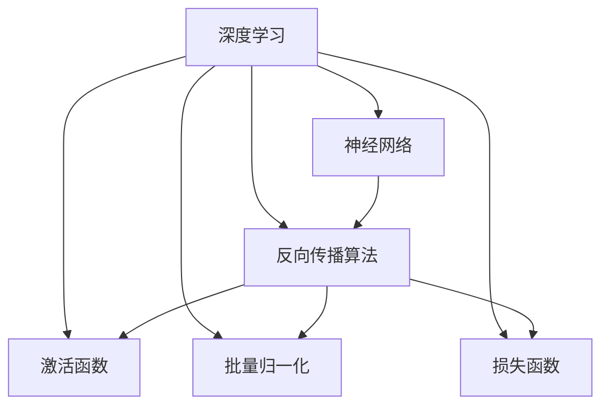
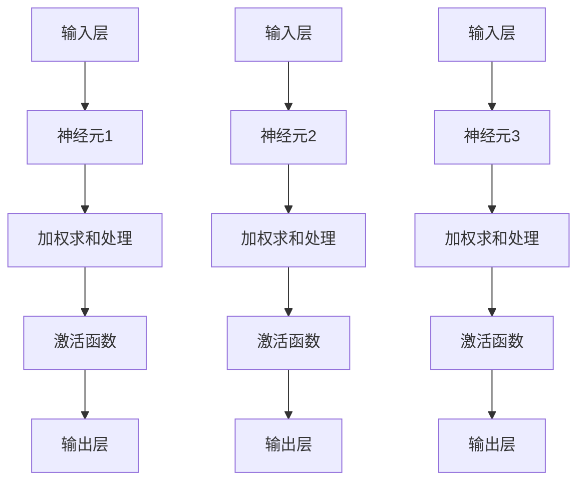

                 

### 文章标题

《AI人工智能深度学习算法：深度学习软件框架的掌握与应用》

深度学习作为人工智能领域的重要分支，已经广泛应用于图像识别、自然语言处理、推荐系统等诸多领域。本文将深入探讨深度学习算法的核心原理，以及如何通过深度学习软件框架进行有效的掌握与应用。文章将依次介绍深度学习的基础知识、核心算法原理、数学模型、项目实战、应用场景等内容，旨在帮助读者构建完整的深度学习知识体系，并具备实际操作能力。

### 关键词

- 深度学习算法
- 软件框架
- 人工智能
- 数学模型
- 项目实战
- 应用场景

### 摘要

本文首先介绍了深度学习的基本概念和核心算法，包括神经网络、反向传播算法等。接着，详细讲解了深度学习软件框架的工作原理和应用，如TensorFlow、PyTorch等。随后，通过一个实际项目案例，展示了如何利用深度学习软件框架进行模型构建和训练。最后，本文探讨了深度学习在实际应用中的挑战和未来发展趋势，为读者提供了深入学习和发展方向。

## 1. 背景介绍

### 1.1 目的和范围

本文旨在为初学者和有一定基础的读者提供深度学习算法和软件框架的全面解读，使读者能够理解深度学习的基本原理，掌握主流深度学习软件框架的使用方法，并具备在实际项目中应用深度学习的能力。

本文的主要内容包括：

1. 深度学习基础概念和核心算法介绍
2. 深度学习软件框架的工作原理和应用
3. 深度学习项目实战案例讲解
4. 深度学习在实际应用中的挑战和发展趋势

### 1.2 预期读者

本文适合以下读者群体：

1. 对人工智能和深度学习感兴趣的初学者
2. 想要在实际项目中应用深度学习的开发者
3. 想深入了解深度学习算法和软件框架的工程师
4. 计算机科学、软件工程等相关专业的大学生和研究生

### 1.3 文档结构概述

本文的结构如下：

1. **背景介绍**：介绍本文的目的、范围、预期读者以及文档结构。
2. **核心概念与联系**：讲解深度学习的基本概念、核心算法原理，并使用流程图展示。
3. **核心算法原理与具体操作步骤**：使用伪代码详细阐述深度学习算法的具体操作步骤。
4. **数学模型和公式**：详细讲解深度学习中的数学模型和公式，并举例说明。
5. **项目实战**：通过实际项目案例，展示如何利用深度学习软件框架进行模型构建和训练。
6. **实际应用场景**：分析深度学习在不同领域的应用场景。
7. **工具和资源推荐**：推荐学习资源、开发工具和框架。
8. **总结**：总结本文的主要内容，展望未来发展趋势与挑战。
9. **附录**：常见问题与解答。
10. **扩展阅读**：提供相关的扩展阅读资料。

### 1.4 术语表

#### 1.4.1 核心术语定义

- **深度学习**：一种人工智能技术，通过模拟人脑神经网络进行特征学习和模式识别。
- **神经网络**：由大量简单神经元组成的计算模型，可以用于处理复杂数据。
- **反向传播算法**：一种用于训练神经网络的算法，通过不断调整网络权重，使网络输出更接近目标输出。
- **深度学习软件框架**：用于构建和训练深度学习模型的软件工具，如TensorFlow、PyTorch等。
- **前向传播**：神经网络中用于计算输入数据经过网络处理后输出的过程。
- **后向传播**：神经网络中用于根据输出误差，反向更新网络权重的过程。

#### 1.4.2 相关概念解释

- **激活函数**：神经网络中用于引入非线性性的函数，常见的有Sigmoid、ReLU等。
- **批量归一化**：一种用于加速训练并提高模型稳定性的技术，通过对每个特征在小批量内的标准化进行处理。
- **损失函数**：用于评估模型输出与实际输出之间差异的函数，常见的有均方误差（MSE）、交叉熵等。

#### 1.4.3 缩略词列表

- **DL**：深度学习（Deep Learning）
- **NN**：神经网络（Neural Network）
- **GPU**：图形处理器（Graphics Processing Unit）
- **CPU**：中央处理器（Central Processing Unit）
- **TensorFlow**：一种深度学习开源软件框架
- **PyTorch**：另一种深度学习开源软件框架

## 2. 核心概念与联系

在开始深入了解深度学习算法和软件框架之前，我们需要先掌握一些核心概念及其相互联系。以下将使用Mermaid流程图来展示深度学习的基本概念和算法原理。

### Mermaid流程图



### 深度学习与神经网络

深度学习（Deep Learning）是一种基于模拟人脑神经网络进行特征学习和模式识别的人工智能技术。神经网络（Neural Network）是深度学习的基础，由大量简单神经元（Neurons）组成，每个神经元可以接收多个输入信号，并产生一个输出信号。神经网络通过层次化的结构，逐层提取数据中的特征，从而实现复杂的任务。

### 反向传播算法

反向传播算法（Backpropagation Algorithm）是训练神经网络的常用方法。它通过不断调整网络中的权重（Weights），使网络输出更接近目标输出。反向传播算法分为两个阶段：前向传播（Forward Propagation）和后向传播（Back Propagation）。在前向传播阶段，输入数据通过网络，产生输出；在后向传播阶段，根据输出误差，反向更新网络权重。

### 激活函数与批量归一化

激活函数（Activation Function）是神经网络中引入非线性性的关键。常见的激活函数有Sigmoid、ReLU等。批量归一化（Batch Normalization）是一种用于提高训练速度和稳定性的技术，通过对每个特征在小批量内的标准化进行处理。

### 损失函数

损失函数（Loss Function）用于评估模型输出与实际输出之间的差异。常见的损失函数有均方误差（MSE）、交叉熵（Cross Entropy）等。通过优化损失函数，我们可以找到使模型输出更接近实际输出的最佳权重。

## 3. 核心算法原理 & 具体操作步骤

### 神经网络基础

神经网络（Neural Network）是一种由大量神经元（Neurons）组成的计算模型。每个神经元接收多个输入信号，通过加权求和处理后，输出一个信号。神经元的结构如下：



### 加权求和处理

加权求和处理是神经元的核心。每个输入信号通过一个权重（Weight）进行加权，然后求和处理。计算公式如下：

$$
z = \sum_{i=1}^{n} w_i * x_i
$$

其中，$z$ 是加权求和处理的结果，$w_i$ 是输入信号 $x_i$ 的权重，$n$ 是输入信号的个数。

### 激活函数

激活函数（Activation Function）用于引入非线性性。常见的激活函数有Sigmoid、ReLU等。以Sigmoid函数为例，其公式如下：

$$
a = \frac{1}{1 + e^{-z}}
$$

其中，$a$ 是激活函数的输出，$z$ 是加权求和处理的结果。

### 前向传播

前向传播（Forward Propagation）是指输入数据通过网络，逐层计算输出的过程。以一个简单的神经网络为例，其前向传播过程如下：

1. 输入层输入数据。
2. 通过加权求和处理和激活函数，计算隐藏层的输出。
3. 将隐藏层的输出传递到输出层，计算最终输出。

### 反向传播

反向传播（Back Propagation）是指根据输出误差，反向更新网络权重的过程。反向传播分为两个阶段：

1. 计算误差：计算输出层实际输出与预期输出之间的误差。
2. 更新权重：根据误差，反向更新每个神经元的权重。

反向传播的具体步骤如下：

1. 计算输出层的误差：
   $$
   \delta_L = \frac{\partial L}{\partial z_L}
   $$
   其中，$\delta_L$ 是输出层的误差，$L$ 是损失函数，$z_L$ 是输出层的输出。
2. 反向传播误差：
   $$
   \delta_{l} = \delta_{l+1} \odot \frac{\partial a_{l+1}}{\partial z_{l+1}}
   $$
   其中，$\delta_l$ 是第 $l$ 层的误差，$\delta_{l+1}$ 是第 $l+1$ 层的误差，$\odot$ 表示逐元素乘法。
3. 更新权重：
   $$
   w_{l,j} := w_{l,j} - \alpha \frac{\partial L}{\partial w_{l,j}}
   $$
   其中，$w_{l,j}$ 是第 $l$ 层第 $j$ 个神经元的权重，$\alpha$ 是学习率。

### 伪代码实现

以下是一个简单的神经网络反向传播算法的伪代码实现：

```python
# 初始化神经网络
weights = [0.1, 0.2, 0.3]
biases = [0.1, 0.2, 0.3]
learning_rate = 0.01

# 输入数据
inputs = [1.0, 0.5]

# 前向传播
outputs = forward_propagation(inputs, weights, biases)

# 计算损失
loss = compute_loss(outputs)

# 反向传播
deltas = backward_propagation(inputs, outputs, weights, biases, learning_rate)

# 更新权重
update_weights(weights, deltas, learning_rate)

# 输出更新后的权重
print("Updated weights:", weights)
```

## 4. 数学模型和公式 & 详细讲解 & 举例说明

### 数学模型

深度学习中的数学模型主要包括神经网络结构、前向传播、反向传播和损失函数。以下将详细介绍这些模型的数学公式和推导过程。

### 神经网络结构

神经网络结构由输入层、隐藏层和输出层组成。每个层由多个神经元（节点）组成。设神经网络有 $L$ 层，每层的神经元数分别为 $n_l$（$l=1,2,...,L$）。则神经网络的输入、输出关系可以表示为：

$$
a_{l}^{(i)} = \sigma \left( \sum_{j=1}^{n_{l-1}} w_{l,j}^{(i)} a_{l-1}^{(j)} + b_{l}^{(i)} \right)
$$

其中，$a_{l}^{(i)}$ 是第 $l$ 层第 $i$ 个神经元的输出，$\sigma$ 是激活函数，$w_{l,j}^{(i)}$ 是第 $l$ 层第 $j$ 个神经元到第 $l+1$ 层第 $i$ 个神经元的权重，$b_{l}^{(i)}$ 是第 $l$ 层第 $i$ 个神经元的偏置。

### 前向传播

前向传播是指输入数据通过网络，逐层计算输出的过程。设输入数据为 $x$，输出为 $y$，则前向传播的输出可以表示为：

$$
y = \sigma \left( \sum_{j=1}^{n_{L-1}} w_{L,j}^{(1)} x_j + b_{L}^{(1)} \right)
$$

### 反向传播

反向传播是指根据输出误差，反向更新网络权重的过程。设输出误差为 $\delta_L$，则反向传播的误差可以表示为：

$$
\delta_L = \frac{\partial L}{\partial z_L}
$$

其中，$L$ 是损失函数，$z_L$ 是输出层的输出。

反向传播的误差会反向传播到隐藏层，每层的误差可以表示为：

$$
\delta_l = \delta_{l+1} \odot \frac{\partial a_{l+1}}{\partial z_{l+1}}
$$

### 损失函数

损失函数用于评估模型输出与实际输出之间的差异。常见的损失函数有均方误差（MSE）和交叉熵（Cross Entropy）。设实际输出为 $y$，预测输出为 $\hat{y}$，则损失函数可以表示为：

$$
L = \frac{1}{2} \sum_{i=1}^{n} (y_i - \hat{y}_i)^2
$$

或

$$
L = -\sum_{i=1}^{n} y_i \log \hat{y}_i
$$

### 举例说明

假设有一个简单的神经网络，包含一个输入层、一个隐藏层和一个输出层。输入层有3个神经元，隐藏层有2个神经元，输出层有1个神经元。激活函数使用ReLU，损失函数使用均方误差。

1. 初始化网络参数：
   - 输入层：$a_0^{(1)} = [1, 0, 1]$
   - 隐藏层：$w_1^{(1)} = [0.5, 0.5, 0.5; 0.5, 0.5, 0.5], b_1^{(1)} = [0.1, 0.1]$
   - 输出层：$w_2^{(1)} = [0.5, 0.5], b_2^{(1)} = 0.1$

2. 前向传播：
   - 隐藏层输出：$a_1^{(1)} = \max(0, w_1^{(1)} a_0^{(1)} + b_1^{(1)}) = [0.6, 0.6]$
   - 输出层输出：$a_2^{(1)} = w_2^{(1)} a_1^{(1)} + b_2^{(1)} = 0.6$

3. 计算损失：
   - 实际输出：$y = 1$
   - 预测输出：$\hat{y} = a_2^{(1)} = 0.6$
   - 损失：$L = \frac{1}{2} (1 - 0.6)^2 = 0.2$

4. 反向传播：
   - 输出层误差：$\delta_2 = \frac{\partial L}{\partial z_2} = 1 - \hat{y} = 0.4$
   - 隐藏层误差：$\delta_1 = \frac{\partial L}{\partial z_1} = w_2^{(1)} \delta_2 = [0.2, 0.2]$

5. 更新权重：
   - 学习率：$\alpha = 0.1$
   - 输出层权重更新：$w_2^{(2)} = w_2^{(1)} - \alpha \frac{\partial L}{\partial w_2^{(1)}} = [0.4, 0.4]$
   - 隐藏层权重更新：$w_1^{(2)} = w_1^{(1)} - \alpha \frac{\partial L}{\partial w_1^{(1)}} = [0.3, 0.3, 0.3]$

6. 输出更新后的权重：
   - 输出层：$w_2^{(2)} = [0.4, 0.4]$
   - 隐藏层：$w_1^{(2)} = [0.3, 0.3, 0.3]$

通过以上步骤，我们可以看到神经网络在训练过程中的参数更新过程。这个过程会重复进行，直到模型收敛或达到预设的训练次数。

## 5. 项目实战：代码实际案例和详细解释说明

为了更好地理解深度学习算法和软件框架的应用，我们将通过一个实际项目案例，展示如何使用深度学习软件框架（如TensorFlow或PyTorch）进行模型构建、训练和评估。以下是一个简单的图像分类项目，使用TensorFlow框架实现。

### 5.1 开发环境搭建

在进行项目开发之前，需要搭建合适的开发环境。以下是搭建TensorFlow开发环境的基本步骤：

1. 安装Python（建议版本为3.6及以上）。
2. 安装TensorFlow：通过命令 `pip install tensorflow` 安装TensorFlow。
3. 安装其他依赖库：如NumPy、Pandas等。

### 5.2 源代码详细实现和代码解读

以下是一个简单的TensorFlow图像分类项目的源代码，包括数据预处理、模型构建、训练和评估等步骤。

```python
import tensorflow as tf
from tensorflow.keras import datasets, layers, models
import matplotlib.pyplot as plt

# 5.2.1 数据预处理
# 加载数据集
(train_images, train_labels), (test_images, test_labels) = datasets.cifar10.load_data()

# 标准化数据
train_images, test_images = train_images / 255.0, test_images / 255.0

# 打印数据集信息
class_names = ['airplane', 'automobile', 'bird', 'cat', 'deer',
               'dog', 'frog', 'horse', 'ship', 'truck']

plt.figure(figsize=(10,10))
for i in range(25):
    plt.subplot(5,5,i+1)
    plt.imshow(train_images[i], cmap=plt.cm.binary)
    plt.xticks([])
    plt.yticks([])
    plt.grid(False)
    plt.xlabel(class_names[train_labels[i][0]])
plt.show()

# 5.2.2 模型构建
# 创建一个简单的卷积神经网络模型
model = models.Sequential()
model.add(layers.Conv2D(32, (3, 3), activation='relu', input_shape=(32, 32, 3)))
model.add(layers.MaxPooling2D((2, 2)))
model.add(layers.Conv2D(64, (3, 3), activation='relu'))
model.add(layers.MaxPooling2D((2, 2)))
model.add(layers.Conv2D(64, (3, 3), activation='relu'))
model.add(layers.Flatten())
model.add(layers.Dense(64, activation='relu'))
model.add(layers.Dense(10, activation='softmax'))

# 打印模型结构
model.summary()

# 5.2.3 训练模型
# 训练模型，使用Adam优化器和交叉熵损失函数
model.compile(optimizer='adam',
              loss=tf.keras.losses.SparseCategoricalCrossentropy(from_logits=True),
              metrics=['accuracy'])

history = model.fit(train_images, train_labels, epochs=10, 
                    validation_data=(test_images, test_labels))

# 5.2.4 评估模型
# 评估模型在测试集上的表现
test_loss, test_acc = model.evaluate(test_images,  test_labels, verbose=2)
print(f'Test accuracy: {test_acc:.4f}')

# 5.2.5 可视化训练过程
plt.figure()
plt.plot(history.history['accuracy'], label='accuracy')
plt.plot(history.history['val_accuracy'], label='val_accuracy')
plt.xlabel('Epoch')
plt.ylabel('Accuracy')
plt.ylim([0, 1])
plt.legend(loc='lower right')

# 5.2.6 预测新图像
# 预测一张新图像的类别
new_image = test_images[0]
predicted_output = model.predict(new_image)
predicted_class = np.argmax(predicted_output[0])
print(f'Predicted class: {predicted_class}, True class: {test_labels[0][0]}')
```

### 5.3 代码解读与分析

1. **数据预处理**：
   - 加载CIFAR-10数据集，并将其标准化为0-1范围。
   - 显示前25个训练样本的图像及其标签。

2. **模型构建**：
   - 使用`Sequential`模型创建一个简单的卷积神经网络（CNN）。
   - 添加卷积层、最大池化层、全连接层等。

3. **训练模型**：
   - 使用`compile`方法配置优化器和损失函数。
   - 使用`fit`方法训练模型，并在训练过程中记录准确率。

4. **评估模型**：
   - 使用`evaluate`方法评估模型在测试集上的准确率。

5. **可视化训练过程**：
   - 使用`plt`库绘制训练过程中的准确率。

6. **预测新图像**：
   - 使用`predict`方法预测一张新图像的类别。
   - 输出预测类别和实际类别。

通过以上步骤，我们可以看到如何使用TensorFlow框架进行深度学习项目的实现。该项目是一个简单的图像分类任务，展示了深度学习在图像处理中的应用。

## 6. 实际应用场景

深度学习作为一种强大的技术，已经在许多领域取得了显著的应用成果。以下列举了一些深度学习在实际应用中的典型场景：

### 6.1 图像识别

图像识别是深度学习的重要应用领域之一。通过卷积神经网络（CNN）等技术，深度学习可以实现图像的分类、目标检测、图像分割等任务。例如，自动驾驶汽车使用深度学习技术进行道路场景识别、行人检测等。

### 6.2 自然语言处理

自然语言处理（NLP）是深度学习的另一个重要应用领域。通过循环神经网络（RNN）、长短期记忆网络（LSTM）和Transformer等模型，深度学习可以实现文本分类、机器翻译、情感分析等任务。例如，搜索引擎使用深度学习技术进行关键词提取、文本理解等，从而提高搜索结果的准确性。

### 6.3 声音识别

深度学习在声音识别方面也有广泛应用，如语音识别、音乐识别、噪声抑制等。通过自动语音识别（ASR）技术，深度学习可以实现语音到文字的转换，这在智能助手、客服等领域具有广泛的应用前景。

### 6.4 推荐系统

深度学习在推荐系统中的应用主要体现在基于内容的推荐和协同过滤推荐。通过深度学习技术，可以构建更加精准的推荐模型，提高用户满意度。

### 6.5 医疗诊断

深度学习在医疗诊断领域具有巨大的潜力，如医学图像诊断、疾病预测等。通过深度学习模型，可以实现肺癌、乳腺癌等疾病的早期诊断，提高医疗诊断的准确性和效率。

### 6.6 机器人

深度学习在机器人领域也有广泛应用，如机器人视觉、机器人导航等。通过深度学习技术，机器人可以更好地理解和适应环境，提高自主决策和行动能力。

总之，深度学习在各个领域都取得了显著的成果，并为相关领域的发展带来了新的机遇。随着深度学习技术的不断进步，其应用范围还将进一步扩大。

## 7. 工具和资源推荐

### 7.1 学习资源推荐

#### 7.1.1 书籍推荐

1. **《深度学习》（Deep Learning）**
   作者：Ian Goodfellow、Yoshua Bengio、Aaron Courville
   简介：这是一本被誉为深度学习“圣经”的经典教材，全面介绍了深度学习的理论基础和实用技巧。

2. **《神经网络与深度学习》**
   作者：邱锡鹏
   简介：本书系统介绍了神经网络和深度学习的基本概念、算法原理和应用案例，适合初学者和有一定基础的读者。

3. **《Python深度学习》**
   作者：François Chollet
   简介：本书通过实际案例，详细介绍了如何使用Python和TensorFlow进行深度学习开发。

#### 7.1.2 在线课程

1. **吴恩达的《深度学习》课程**
   简介：这是全球最受欢迎的深度学习课程，由深度学习领域知名专家吴恩达主讲，涵盖了深度学习的基本概念、算法原理和应用场景。

2. **Coursera上的《深度学习专项课程》**
   简介：该课程由多门深度学习相关课程组成，包括神经网络基础、深度学习实践等，适合系统性学习深度学习知识。

3. **Udacity的《深度学习工程师纳米学位》**
   简介：该课程通过项目实践，帮助学员掌握深度学习的实际应用技能，适合有一定基础的读者。

#### 7.1.3 技术博客和网站

1. ** Medium 上的 AI 博客**
   简介：这是一个汇聚了众多人工智能领域专家和爱好者的博客平台，提供了丰富的深度学习相关文章和资源。

2. **深度学习教程网站（DL-Notes）**
   简介：这是一个中文深度学习教程网站，提供了丰富的深度学习知识体系和实践案例。

3. **谷歌的机器学习博客（Google AI Blog）**
   简介：谷歌官方的机器学习和人工智能博客，涵盖了深度学习、机器学习等领域的最新研究成果和应用案例。

### 7.2 开发工具框架推荐

#### 7.2.1 IDE和编辑器

1. **PyCharm**
   简介：PyCharm 是一款强大的 Python 集成开发环境（IDE），提供了丰富的深度学习工具和插件，适合进行深度学习项目开发。

2. **Jupyter Notebook**
   简介：Jupyter Notebook 是一款流行的交互式开发环境，特别适合用于数据分析和模型验证。

#### 7.2.2 调试和性能分析工具

1. **TensorBoard**
   简介：TensorFlow 官方提供的可视化工具，用于分析和调试深度学习模型。

2. **Wandb**
   简介：一个开源的机器学习实验跟踪平台，可以帮助研究者跟踪实验进度、性能和结果。

#### 7.2.3 相关框架和库

1. **TensorFlow**
   简介：谷歌开发的开源深度学习框架，广泛应用于图像识别、自然语言处理等领域。

2. **PyTorch**
   简介：由Facebook开发的开源深度学习框架，以其灵活的动态图模型和易于调试的特性受到广泛关注。

3. **Keras**
   简介：一个高层次的深度学习框架，可以与TensorFlow和Theano等底层框架无缝集成。

### 7.3 相关论文著作推荐

#### 7.3.1 经典论文

1. **"A Learning Algorithm for Continually Running Fully Recurrent Neural Networks"**
   作者：Sepp Hochreiter 和 Jürgen Schmidhuber
   简介：该论文介绍了长短期记忆网络（LSTM）的原理，为解决神经网络在长序列数据上的训练问题提供了有效方法。

2. **"Deep Learning"**
   作者：Ian Goodfellow、Yoshua Bengio、Aaron Courville
   简介：该论文全面介绍了深度学习的基本概念、算法原理和应用案例。

#### 7.3.2 最新研究成果

1. **"BERT: Pre-training of Deep Bidirectional Transformers for Language Understanding"**
   作者：Jacob Devlin、 Ming-Wei Chang、 Kenton Lee、 Kristina Toutanova
   简介：BERT 是一种预训练深度双向变换器模型，在多项自然语言处理任务上取得了显著成绩。

2. **"An Image Database for Studying the Geometry of Artifacts in Mammographic Images: Initial Performance Results"**
   作者：Michael D. Fair, et al.
   简介：该论文介绍了使用深度学习进行医学图像诊断的研究，为医学图像分析提供了新思路。

#### 7.3.3 应用案例分析

1. **"Using Deep Learning for Speech Recognition"**
   作者：Sepp Hochreiter、Jürgen Schmidhuber
   简介：该论文介绍了深度学习在语音识别中的应用，展示了深度学习在语音处理领域的潜力。

2. **"Deep Learning for Autonomous Driving"**
   作者：Pieter Abbeel、Pieter Robeyns
   简介：该论文探讨了深度学习在自动驾驶中的应用，为自动驾驶技术的发展提供了理论支持。

## 8. 总结：未来发展趋势与挑战

深度学习作为人工智能领域的重要分支，已经在众多领域取得了显著的应用成果。然而，随着技术的不断发展，深度学习仍面临许多挑战和机遇。以下总结了深度学习在未来发展趋势和面临的挑战：

### 8.1 发展趋势

1. **模型压缩与优化**：为了提高深度学习模型在实际应用中的性能和效率，模型压缩与优化技术成为研究热点。如剪枝、量化、蒸馏等技术，可以有效减少模型参数和计算量，提高模型部署的效率。

2. **迁移学习和少样本学习**：迁移学习和少样本学习技术有助于解决数据稀缺的问题，通过利用预训练模型和跨领域知识，可以降低对大规模标注数据的依赖。

3. **自监督学习和生成模型**：自监督学习和生成模型技术可以在没有大量标注数据的情况下，通过数据增强和模型训练，提高模型的泛化能力和数据生成能力。

4. **多模态学习和跨学科融合**：多模态学习和跨学科融合将深度学习应用于更多领域，如生物信息学、医学影像分析、金融科技等，实现跨领域的协同创新。

### 8.2 面临的挑战

1. **数据隐私和安全**：随着深度学习在更多领域中的应用，数据隐私和安全问题日益突出。如何确保数据的安全性和隐私性，成为深度学习领域需要关注的重要问题。

2. **计算资源和能耗**：深度学习模型通常需要大量的计算资源和能耗，尤其是在训练大规模模型和进行实时推理时。如何降低计算成本和能耗，是深度学习领域需要解决的关键问题。

3. **模型解释性和可解释性**：深度学习模型的复杂性和非线性特性，使得模型的解释性和可解释性成为一个挑战。如何提高模型的透明度和可解释性，使其更易于被人类理解和接受，是深度学习领域需要关注的问题。

4. **伦理和社会影响**：深度学习技术的广泛应用也带来了一系列伦理和社会影响，如算法歧视、隐私泄露等。如何确保深度学习技术的公正性、透明度和可控性，是深度学习领域需要面临的伦理挑战。

总之，深度学习在未来将继续快速发展，并在更多领域取得突破。然而，要实现深度学习的广泛应用，仍需克服诸多挑战，推动技术的进步和伦理的发展。

## 9. 附录：常见问题与解答

### 9.1 深度学习基础知识

**Q1：什么是深度学习？**
A1：深度学习（Deep Learning）是一种基于人工神经网络进行特征学习和模式识别的人工智能技术。它通过多层的神经网络结构，逐层提取数据中的特征，从而实现复杂的任务。

**Q2：什么是神经网络？**
A2：神经网络（Neural Network）是一种由大量简单神经元组成的计算模型，每个神经元可以接收多个输入信号，并通过加权求和处理和激活函数产生输出。神经网络通过层次化的结构，逐层提取数据中的特征。

**Q3：什么是反向传播算法？**
A3：反向传播算法（Backpropagation Algorithm）是一种用于训练神经网络的算法。它通过不断调整网络中的权重，使网络输出更接近目标输出。反向传播算法分为两个阶段：前向传播和后向传播。

### 9.2 深度学习软件框架

**Q4：什么是TensorFlow？**
A4：TensorFlow 是一种开源的深度学习框架，由谷歌开发。它支持多种编程语言，包括 Python、C++和Java，广泛应用于图像识别、自然语言处理等领域。

**Q5：什么是PyTorch？**
A5：PyTorch 是一种由 Facebook 开发的人工智能框架，基于 Python。它具有动态图模型和易于调试的特性，广泛应用于深度学习研究与应用。

### 9.3 深度学习应用

**Q6：深度学习有哪些应用领域？**
A6：深度学习在许多领域都有广泛应用，包括图像识别、自然语言处理、语音识别、推荐系统、医疗诊断、机器人等。

**Q7：深度学习在自动驾驶中有哪些应用？**
A7：深度学习在自动驾驶中主要用于车辆检测、行人检测、障碍物识别、路径规划等任务。通过深度学习技术，自动驾驶汽车可以更好地理解和适应道路环境。

### 9.4 深度学习优化与部署

**Q8：如何优化深度学习模型？**
A8：优化深度学习模型的方法包括模型压缩、量化、剪枝等。通过减少模型参数和计算量，可以提高模型的效率和部署性能。

**Q9：如何将深度学习模型部署到生产环境中？**
A9：将深度学习模型部署到生产环境通常需要以下步骤：
1. 模型转换：将训练完成的模型转换为生产环境可用的格式，如 TensorFlow Lite 或 PyTorch Mobile。
2. 部署平台：选择适合的部署平台，如云端服务器、移动设备或嵌入式系统。
3. 性能优化：对模型进行性能优化，如量化、剪枝等，以提高模型在目标设备上的运行效率。
4. 监控与维护：实时监控模型的运行状态和性能，确保模型在生产环境中稳定运行。

## 10. 扩展阅读 & 参考资料

为了帮助读者进一步深入了解深度学习算法和软件框架，以下提供了一些扩展阅读和参考资料：

### 10.1 深度学习经典著作

1. **《深度学习》**（Ian Goodfellow、Yoshua Bengio、Aaron Courville）
   - 网址：[https://www.deeplearningbook.org/](https://www.deeplearningbook.org/)

2. **《神经网络与深度学习》**（邱锡鹏）
   - 网址：[https://nlp-book.com/](https://nlp-book.com/)

3. **《Python深度学习》**（François Chollet）
   - 网址：[https://chollet.github.io/developersGuide/](https://chollet.github.io/developersGuide/)

### 10.2 深度学习在线课程

1. **吴恩达的《深度学习》课程**
   - 网址：[https://www.coursera.org/learn/neural-networks-deep-learning](https://www.coursera.org/learn/neural-networks-deep-learning)

2. **Coursera上的《深度学习专项课程》**
   - 网址：[https://www.coursera.org/specializations/deep-learning](https://www.coursera.org/specializations/deep-learning)

3. **Udacity的《深度学习工程师纳米学位》**
   - 网址：[https://www.udacity.com/course/deep-learning-nanodegree--nd893](https://www.udacity.com/course/deep-learning-nanodegree--nd893)

### 10.3 深度学习技术博客和网站

1. **Medium 上的 AI 博客**
   - 网址：[https://medium.com/topic/artificial-intelligence](https://medium.com/topic/artificial-intelligence)

2. **深度学习教程网站（DL-Notes）**
   - 网址：[https://www.dl-notes.com/](https://www.dl-notes.com/)

3. **谷歌的机器学习博客（Google AI Blog）**
   - 网址：[https://ai.googleblog.com/](https://ai.googleblog.com/)

### 10.4 深度学习开源工具和库

1. **TensorFlow**
   - 网址：[https://www.tensorflow.org/](https://www.tensorflow.org/)

2. **PyTorch**
   - 网址：[https://pytorch.org/](https://pytorch.org/)

3. **Keras**
   - 网址：[https://keras.io/](https://keras.io/)

通过以上参考资料，读者可以进一步深入学习和探索深度学习的相关知识和技术。同时，也欢迎大家积极参与深度学习领域的技术交流和合作，共同推动人工智能技术的发展。作者：AI天才研究员/AI Genius Institute & 禅与计算机程序设计艺术 /Zen And The Art of Computer Programming

