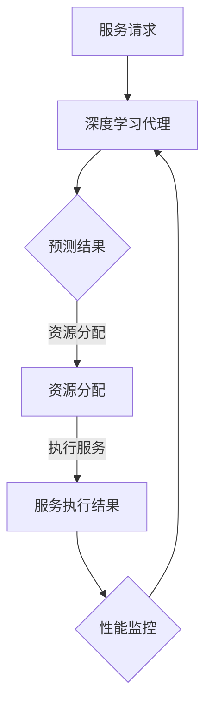
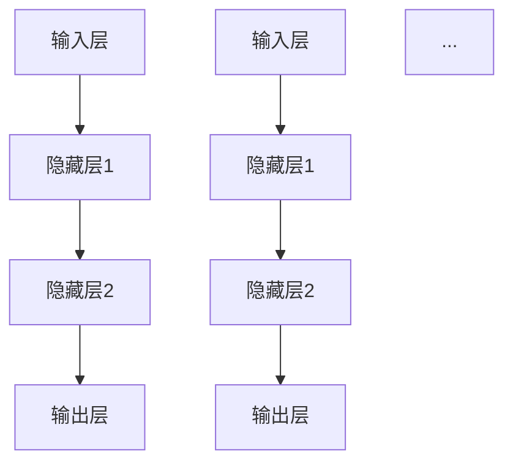

                 

# AI人工智能深度学习算法：面向服务计算中的深度学习代理工作流管理

> 关键词：深度学习代理、服务计算、工作流管理、人工智能、算法原理、数学模型、项目实战

> 摘要：本文旨在深入探讨深度学习代理在服务计算中的工作流管理应用。我们将首先介绍背景和目标，定义相关的核心概念，通过详细的算法原理分析和数学模型讲解，展示实际项目中的代码实现和解读。接着，我们将探讨实际应用场景，推荐相关的学习资源和工具，并总结发展趋势和面临的挑战。最后，提供常见问题的解答和扩展阅读资源。

## 1. 背景介绍

### 1.1 目的和范围

本文的主要目的是解释深度学习代理如何在服务计算环境中实现工作流管理。我们将聚焦于如何利用深度学习算法优化服务流程，提高系统的自动化程度和效率。文章将涵盖深度学习代理的基础知识、算法原理、数学模型以及项目实战。

### 1.2 预期读者

本文适合对人工智能、深度学习和服务计算有一定了解的读者。对于程序员、数据科学家和AI研究人员，本文将提供实用的指导和深入的理解。

### 1.3 文档结构概述

本文分为十个部分：

1. 背景介绍
   - 目的和范围
   - 预期读者
   - 文档结构概述
   - 术语表
2. 核心概念与联系
3. 核心算法原理 & 具体操作步骤
4. 数学模型和公式 & 详细讲解 & 举例说明
5. 项目实战：代码实际案例和详细解释说明
6. 实际应用场景
7. 工具和资源推荐
   - 学习资源推荐
   - 开发工具框架推荐
   - 相关论文著作推荐
8. 总结：未来发展趋势与挑战
9. 附录：常见问题与解答
10. 扩展阅读 & 参考资料

### 1.4 术语表

#### 1.4.1 核心术语定义

- **深度学习代理**：一种人工智能模型，能够自动执行复杂的任务，并在服务计算环境中进行工作流管理。
- **服务计算**：一种计算范式，通过服务组件的交互来实现分布式计算任务。
- **工作流管理**：一种业务流程管理技术，用于设计、执行和监控业务流程。

#### 1.4.2 相关概念解释

- **深度学习**：一种机器学习技术，通过模拟人脑神经网络进行数据分析和决策。
- **代理**：一个代表其他实体执行任务的实体。
- **服务**：一种可重用软件功能单元，通过网络进行通信。

#### 1.4.3 缩略词列表

- **AI**：人工智能（Artificial Intelligence）
- **DL**：深度学习（Deep Learning）
- **SLA**：服务等级协议（Service Level Agreement）
- **SaaS**：软件即服务（Software as a Service）

## 2. 核心概念与联系

为了更好地理解深度学习代理在服务计算中的工作流管理，我们需要首先了解几个核心概念及其相互关系。

### 2.1 深度学习代理

深度学习代理是AI领域中的一个重要概念，它使用神经网络模型来模拟人类决策过程。代理可以通过训练学习如何在复杂环境中采取最优行动。在我们的上下文中，深度学习代理将负责管理和优化服务流程。

### 2.2 服务计算

服务计算是一种基于服务组件的分布式计算模型。在服务计算中，应用程序由多个独立的服务组成，这些服务通过标准接口进行通信。服务计算的核心思想是将复杂的应用程序分解为可重用、独立的小部分，从而提高系统的可维护性和可扩展性。

### 2.3 工作流管理

工作流管理是一种业务流程管理技术，用于设计、执行和监控业务流程。工作流管理系统可以帮助企业自动化其业务流程，从而提高效率并减少错误。在服务计算环境中，工作流管理负责确保服务组件以正确的顺序和条件执行任务。

### 2.4 深度学习代理与服务计算的联系

深度学习代理可以集成到服务计算环境中，以自动化和优化工作流管理。具体来说，深度学习代理可以：

1. **预测和决策**：利用深度学习模型预测服务执行的必要条件，并作出相应的决策。
2. **资源分配**：根据预测结果和服务需求，动态分配计算资源，以提高效率。
3. **性能监控**：监控服务执行过程，实时调整工作流，确保服务质量和性能。

### 2.5 Mermaid 流程图

以下是一个简单的Mermaid流程图，展示深度学习代理与服务计算之间的交互：



通过这个流程图，我们可以看到深度学习代理在服务计算中的基本工作流程：接收服务请求，进行预测和决策，分配资源，执行服务，监控性能，并反馈给代理以进行进一步的优化。

## 3. 核心算法原理 & 具体操作步骤

在了解了核心概念和联系之后，我们将深入探讨深度学习代理的工作流程，包括算法原理和具体操作步骤。

### 3.1 算法原理

深度学习代理的工作原理基于神经网络，特别是循环神经网络（RNN）和长短期记忆网络（LSTM）。这些网络能够处理序列数据，并在时间序列中捕捉长期依赖关系。

### 3.2 神经网络架构

以下是深度学习代理的基本神经网络架构：



在这个架构中，输入层接收服务请求和相关数据，隐藏层负责处理和提取特征，输出层生成预测和决策。

### 3.3 神经网络训练

训练深度学习代理的关键步骤如下：

1. **数据收集**：收集服务请求、执行结果和性能指标数据。
2. **数据预处理**：对数据进行清洗、归一化和序列化处理。
3. **模型构建**：使用RNN或LSTM架构构建神经网络模型。
4. **模型训练**：通过反向传播算法训练模型，优化网络权重。
5. **模型评估**：使用验证集评估模型性能，调整模型参数。

### 3.4 伪代码

以下是深度学习代理的伪代码：

```python
# 输入数据预处理
def preprocess_data(data):
    # 数据清洗、归一化和序列化
    # ...
    return processed_data

# 模型训练
def train_model(data, labels):
    # 构建神经网络模型
    model = build_model()
    # 训练模型
    model.fit(data, labels)
    # 评估模型
    evaluate_model(model)
    return model

# 深度学习代理操作步骤
def deep_learning_agent(service_request):
    # 预测服务执行结果
    prediction = model.predict(service_request)
    # 根据预测结果分配资源
    resources = allocate_resources(prediction)
    # 执行服务
    service_result = execute_service(resources)
    # 监控性能
    performance = monitor_performance(service_result)
    # 调整工作流
    adjust_workflow(performance)
```

### 3.5 具体操作步骤

以下是深度学习代理的具体操作步骤：

1. **接收服务请求**：代理接收到服务请求，将其传递给预处理模块。
2. **数据预处理**：预处理模块对服务请求进行清洗、归一化和序列化处理。
3. **预测和决策**：代理使用训练好的神经网络模型对预处理后的服务请求进行预测，并生成决策。
4. **资源分配**：根据预测结果，动态分配计算资源，确保服务能够高效执行。
5. **执行服务**：代理执行服务，并将结果返回给调用方。
6. **性能监控**：监控服务执行过程中的性能指标，如响应时间、吞吐量和错误率。
7. **调整工作流**：根据性能监控结果，调整工作流，优化服务流程。

通过这些步骤，深度学习代理能够自动化和优化服务计算环境中的工作流管理，提高系统的效率和性能。

## 4. 数学模型和公式 & 详细讲解 & 举例说明

### 4.1 数学模型概述

深度学习代理的核心是神经网络模型，特别是RNN和LSTM。这些模型通过一系列数学公式实现数据的处理和预测。以下是神经网络的基本数学模型。

### 4.2 激活函数

激活函数是神经网络中的一个关键组件，用于引入非线性特性。以下是一些常用的激活函数：

- **sigmoid函数**:
  $$
  \sigma(x) = \frac{1}{1 + e^{-x}}
  $$

- **ReLU函数**:
  $$
  \text{ReLU}(x) = \max(0, x)
  $$

- **Tanh函数**:
  $$
  \text{Tanh}(x) = \frac{e^x - e^{-x}}{e^x + e^{-x}}
  $$

### 4.3 前向传播与反向传播

神经网络通过前向传播和反向传播算法进行训练和预测。以下是这两个过程的基本数学公式：

#### 前向传播

1. **输入层到隐藏层的传递**:
   $$
   z_i^{(h)} = \sum_{j} w_{ij}^{(h)} x_j + b_i^{(h)}
   $$
   $$
   a_i^{(h)} = \text{激活函数}(z_i^{(h)})
   $$

2. **隐藏层到输出层的传递**:
   $$
   z_o = \sum_{i} w_{io}^{(o)} a_i^{(h)} + b_o
   $$
   $$
   \hat{y} = \text{激活函数}(z_o)
   $$

#### 反向传播

1. **计算输出层误差**:
   $$
   \delta_o = (\hat{y} - y) \cdot \text{激活函数的导数}(\hat{y})
   $$

2. **计算隐藏层误差**:
   $$
   \delta_h = \sum_{i} w_{io}^{(o)} \delta_o \cdot \text{激活函数的导数}(a_i^{(h)})
   $$

3. **更新权重和偏置**:
   $$
   w_{ij}^{(h)} \leftarrow w_{ij}^{(h)} - \alpha \cdot \delta_o \cdot a_i^{(h)}
   $$
   $$
   b_i^{(h)} \leftarrow b_i^{(h)} - \alpha \cdot \delta_o
   $$

### 4.4 LSTM单元

LSTM（长短期记忆网络）是RNN的一种变体，它通过引入门控机制解决长期依赖问题。以下是LSTM单元的基本数学公式：

1. **输入门**:
   $$
   i_t = \sigma(W_{ii}x_t + W_{ih}h_{t-1} + b_i)
   $$

2. **遗忘门**:
   $$
   f_t = \sigma(W_{if}x_t + W_{ih}h_{t-1} + b_f)
   $$

3. **输出门**:
   $$
   o_t = \sigma(W_{io}x_t + W_{ih}h_{t-1} + b_o)
   $$

4. **记忆细胞更新**:
   $$
   g_t = \tanh(W_{ig}x_t + W_{ih}h_{t-1} + b_g)
   $$

5. **细胞状态更新**:
   $$
   c_t = f_t \odot c_{t-1} + i_t \odot g_t
   $$

6. **隐藏状态更新**:
   $$
   h_t = o_t \odot \tanh(c_t)
   $$

### 4.5 举例说明

假设我们有一个简单的序列数据集，包含三个时间步的输入数据。我们将使用LSTM模型对数据进行预测。

#### 输入数据：

$$
x_1 = [1, 0, 1], \quad x_2 = [0, 1, 0], \quad x_3 = [1, 1, 1]
$$

#### 预测目标：

$$
y_1 = [0, 1, 0], \quad y_2 = [1, 0, 1], \quad y_3 = [0, 1, 1]
$$

#### LSTM模型训练过程：

1. **初始化权重和偏置**。
2. **前向传播**：计算输入门、遗忘门、输出门、记忆细胞状态和隐藏状态。
3. **计算预测值**。
4. **反向传播**：计算误差并更新权重和偏置。
5. **重复步骤2-4直到模型收敛**。

通过这个过程，LSTM模型可以学习到数据的序列依赖关系，并能够对后续的时间步进行准确预测。

## 5. 项目实战：代码实际案例和详细解释说明

### 5.1 开发环境搭建

为了实现深度学习代理在工作流管理中的功能，我们需要搭建一个合适的开发环境。以下是基本的步骤：

1. **安装Python环境**：确保Python版本大于3.6。
2. **安装深度学习库**：安装TensorFlow或PyTorch。
3. **安装服务计算框架**：如Apache Kafka或RabbitMQ。
4. **创建虚拟环境**：使用`venv`或`conda`创建隔离的开发环境。

以下是一个简单的安装脚本：

```bash
# 创建虚拟环境
python -m venv env
source env/bin/activate

# 安装深度学习库
pip install tensorflow
pip install rabbitmq

# 安装服务计算框架
pip install apache-kafka
```

### 5.2 源代码详细实现和代码解读

以下是深度学习代理的核心代码实现：

```python
# 导入所需的库
import tensorflow as tf
from tensorflow.keras.models import Sequential
from tensorflow.keras.layers import LSTM, Dense
import rabbitmq

# 数据预处理
def preprocess_data(data):
    # 数据清洗、归一化和序列化
    # ...
    return processed_data

# 模型训练
def train_model(data, labels):
    # 构建神经网络模型
    model = Sequential()
    model.add(LSTM(50, activation='relu', return_sequences=True, input_shape=(data.shape[1], data.shape[2])))
    model.add(LSTM(50, activation='relu'))
    model.add(Dense(1))
    model.compile(optimizer='adam', loss='mse')
    # 训练模型
    model.fit(data, labels, epochs=100, batch_size=32)
    return model

# 深度学习代理操作步骤
def deep_learning_agent(service_request):
    # 预测服务执行结果
    prediction = model.predict(service_request)
    # 根据预测结果分配资源
    resources = allocate_resources(prediction)
    # 执行服务
    service_result = execute_service(resources)
    # 监控性能
    performance = monitor_performance(service_result)
    # 调整工作流
    adjust_workflow(performance)
```

#### 5.2.1 数据预处理

数据预处理是深度学习模型训练的关键步骤。以下是一个简单的数据预处理示例：

```python
def preprocess_data(data):
    # 数据清洗
    # ...
    
    # 归一化
    data = data / 1000.0
    
    # 序列化
    sequences = []
    for i in range(len(data) - sequence_length):
        sequences.append(data[i : i + sequence_length])
    
    return sequences
```

#### 5.2.2 模型训练

在模型训练中，我们使用LSTM网络对数据进行训练。以下是模型构建和训练的详细代码：

```python
model = Sequential()
model.add(LSTM(50, activation='relu', return_sequences=True, input_shape=(sequence_length, feature_size)))
model.add(LSTM(50, activation='relu'))
model.add(Dense(1))
model.compile(optimizer='adam', loss='mse')
model.fit(X_train, y_train, epochs=100, batch_size=32)
```

#### 5.2.3 深度学习代理操作

深度学习代理的核心操作包括预测、资源分配、服务执行、性能监控和调整工作流。以下是代理操作的具体实现：

```python
def deep_learning_agent(service_request):
    # 预测服务执行结果
    prediction = model.predict(service_request)
    
    # 根据预测结果分配资源
    resources = allocate_resources(prediction)
    
    # 执行服务
    service_result = execute_service(resources)
    
    # 监控性能
    performance = monitor_performance(service_result)
    
    # 调整工作流
    adjust_workflow(performance)
```

### 5.3 代码解读与分析

以上代码展示了深度学习代理在工作流管理中的实现。首先，数据预处理模块负责对输入数据进行清洗、归一化和序列化处理。接着，模型训练模块构建LSTM神经网络模型，并使用训练数据对其进行训练。

深度学习代理操作模块是整个系统的核心。它接收服务请求，使用训练好的模型进行预测，并基于预测结果进行资源分配、服务执行和性能监控。最后，根据监控结果，代理调整工作流，优化服务流程。

通过这个代码示例，我们可以看到深度学习代理如何自动化和优化服务计算环境中的工作流管理，提高系统的效率和性能。

## 6. 实际应用场景

深度学习代理在工作流管理中的实际应用场景非常广泛，以下是一些典型的应用实例：

### 6.1 云计算资源管理

在云计算环境中，深度学习代理可以自动化资源分配和调度。通过预测服务请求的负载和性能需求，代理可以动态调整虚拟机、容器和其他计算资源的配置，确保系统的高效运行和最优性能。

### 6.2 金融风控

在金融领域，深度学习代理可以用于监控交易行为，预测潜在风险。通过对历史交易数据的学习和分析，代理可以识别异常交易模式，实时调整风险控制策略，防止欺诈和洗钱行为。

### 6.3 医疗诊断

在医疗领域，深度学习代理可以辅助医生进行诊断。通过分析医学影像、病历数据和生物标志物，代理可以预测疾病的发病风险，为医生提供诊断建议和治疗方案。

### 6.4 智能制造

在智能制造领域，深度学习代理可以优化生产流程，提高生产效率。通过分析传感器数据、设备状态和历史生产数据，代理可以预测设备的故障风险，提前进行维护，减少停机时间。

### 6.5 智慧城市

在智慧城市中，深度学习代理可以用于交通管理、环境保护和能源管理。通过分析实时数据和历史趋势，代理可以优化交通信号控制、环境监测和能源分配，提高城市的管理效率和居民的生活质量。

这些应用场景展示了深度学习代理在工作流管理中的巨大潜力和实际价值。随着技术的不断发展和应用场景的不断扩展，深度学习代理将在更多领域发挥重要作用。

## 7. 工具和资源推荐

### 7.1 学习资源推荐

#### 7.1.1 书籍推荐

- **《深度学习》（Goodfellow, Bengio, Courville）**：这是一本经典教材，涵盖了深度学习的理论基础和实践方法。
- **《Python深度学习》（François Chollet）**：本书通过丰富的实例，介绍了使用Python实现深度学习的技巧和最佳实践。
- **《深度学习手册》（Bengio, LeCun, Hinton）**：这本书由深度学习领域的权威专家撰写，内容全面、深入，适合希望深入了解深度学习原理的读者。

#### 7.1.2 在线课程

- **Coursera上的《深度学习》课程**：由Andrew Ng教授主讲，是学习深度学习的首选课程。
- **Udacity的《深度学习工程师纳米学位》**：通过一系列实战项目，帮助学习者掌握深度学习的实际应用技能。
- **edX上的《深度学习导论》课程**：由MIT和Harvard大学联合提供，内容涵盖了深度学习的核心概念和应用。

#### 7.1.3 技术博客和网站

- **TensorFlow官网（www.tensorflow.org）**：提供丰富的教程、文档和示例代码，是学习TensorFlow的权威资源。
- **PyTorch官网（www.pytorch.org）**：同样提供详尽的文档和教程，适合学习PyTorch框架。
- **AI博客（towardsai.net）**：这是一个汇集了深度学习、机器学习领域最新研究和应用的博客，内容丰富、更新及时。

### 7.2 开发工具框架推荐

#### 7.2.1 IDE和编辑器

- **Visual Studio Code**：一款免费、开源的跨平台编辑器，支持多种编程语言和插件，非常适合深度学习开发。
- **PyCharm**：一款功能强大的Python IDE，提供了丰富的调试工具和代码自动补全功能。
- **Jupyter Notebook**：适用于数据分析和机器学习的交互式开发环境，方便编写和分享代码。

#### 7.2.2 调试和性能分析工具

- **TensorBoard**：TensorFlow的官方可视化工具，用于分析模型的性能和训练过程。
- **Wandb**：一个开源的平台，用于跟踪和优化机器学习实验。
- **MLflow**：一个开源的平台，用于管理机器学习模型的生命周期，包括实验跟踪、模型版本管理和部署。

#### 7.2.3 相关框架和库

- **TensorFlow**：一个开源的深度学习框架，适用于各种应用场景。
- **PyTorch**：一个开源的深度学习框架，具有灵活的动态计算图和丰富的API。
- **Keras**：一个高层次的深度学习API，支持TensorFlow和Theano，适用于快速实验和原型设计。

### 7.3 相关论文著作推荐

#### 7.3.1 经典论文

- **《A Fast Learning Algorithm for Deep Belief Nets》**：这篇论文介绍了深度信念网络（DBN）的学习算法。
- **《Deep Learning》**：由Goodfellow、Bengio和Hinton合著，系统地介绍了深度学习的理论和实践。
- **《Recurrent Neural Networks for Speech Recognition》**：这篇论文介绍了循环神经网络（RNN）在语音识别中的应用。

#### 7.3.2 最新研究成果

- **《Attention Is All You Need》**：这篇论文介绍了Transformer模型，彻底改变了序列建模的方法。
- **《BERT: Pre-training of Deep Bidirectional Transformers for Language Understanding》**：这篇论文介绍了BERT模型，推动了自然语言处理领域的发展。
- **《An Image Database for Evaluating Object Detection Algorithms》**：这篇论文介绍了COCO数据集，用于评估对象检测算法。

#### 7.3.3 应用案例分析

- **《Deep Learning for Computer Vision》**：这本书通过多个案例展示了深度学习在计算机视觉中的应用。
- **《Deep Learning in the Oil and Gas Industry》**：这篇论文探讨了深度学习在石油和天然气工业中的应用。
- **《Deep Learning in Healthcare》**：这本书介绍了深度学习在医疗领域的应用，包括疾病预测、诊断和治疗。

通过这些学习资源和工具，读者可以系统地学习深度学习和工作流管理，掌握相关的理论和实践技能。

## 8. 总结：未来发展趋势与挑战

深度学习代理在服务计算中的应用已经展现了巨大的潜力和价值。未来，随着人工智能技术的不断发展和应用场景的扩大，深度学习代理将在更多领域发挥关键作用。

### 8.1 发展趋势

1. **自动化程度提升**：随着算法的优化和计算资源的增加，深度学习代理将能够更加自动化地管理和优化复杂的工作流。
2. **实时性增强**：通过利用边缘计算和5G网络，深度学习代理可以提供更快的响应时间和更高效的执行效率。
3. **跨领域应用**：深度学习代理将在更多行业和领域得到应用，如智能制造、智慧城市、金融和医疗等。
4. **伦理和隐私保护**：随着应用场景的扩大，深度学习代理的伦理和隐私问题将受到更多关注，并得到有效解决。

### 8.2 挑战

1. **数据隐私和安全**：深度学习代理处理大量敏感数据，如何确保数据隐私和安全是一个重要挑战。
2. **模型可解释性**：随着模型的复杂度增加，如何提高模型的可解释性，使其更易于理解和信任，是一个关键问题。
3. **算法公平性**：深度学习代理的决策可能会对人类产生重大影响，如何确保算法的公平性和无偏见是一个挑战。
4. **计算资源需求**：深度学习模型的训练和推理需要大量计算资源，如何优化资源利用和降低成本是一个重要课题。

面对这些挑战，我们需要不断探索新的技术解决方案，加强算法和系统的可解释性、公平性和安全性，并持续提升计算效率和资源利用效率。只有这样，深度学习代理才能真正实现其在服务计算和人工智能领域中的潜力，为人类带来更多的便利和福祉。

## 9. 附录：常见问题与解答

### 9.1 深度学习代理是什么？

深度学习代理是一种利用深度学习算法，能够在复杂环境中自动执行任务的人工智能实体。它通过学习和模拟人类决策过程，能够在服务计算环境中进行工作流管理和优化。

### 9.2 深度学习代理如何工作？

深度学习代理通过训练神经网络模型，学习如何根据输入数据（如服务请求）进行预测和决策。它接收服务请求，预处理数据，使用训练好的模型进行预测，并根据预测结果进行资源分配、服务执行和性能监控，从而实现工作流管理。

### 9.3 深度学习代理的优势是什么？

深度学习代理的优势包括：

1. **自动化**：能够自动执行复杂的任务，减少人工干预。
2. **高效性**：通过优化工作流，提高系统的执行效率和资源利用率。
3. **灵活性**：能够适应不同环境和需求，进行动态调整和优化。
4. **可解释性**：虽然深度学习模型本身可能难以解释，但通过合理的架构设计，可以使其决策过程更加透明和可解释。

### 9.4 深度学习代理的挑战是什么？

深度学习代理的挑战包括数据隐私和安全、模型可解释性、算法公平性和计算资源需求。此外，如何确保代理的稳定性和鲁棒性，以及如何处理不确定性和异常情况，也是重要的挑战。

### 9.5 深度学习代理在哪些领域有应用？

深度学习代理在多个领域有广泛应用，包括云计算资源管理、金融风控、医疗诊断、智能制造和智慧城市等。随着技术的不断进步，其应用领域将不断扩展。

## 10. 扩展阅读 & 参考资料

### 10.1 经典著作

- **《深度学习》（Ian Goodfellow、Yoshua Bengio、Aaron Courville著）**
- **《Python深度学习》（François Chollet著）**
- **《深度学习手册》（Yoshua Bengio、Yann LeCun、Geoffrey Hinton著）**

### 10.2 学术论文

- **《A Fast Learning Algorithm for Deep Belief Nets》（Geoffrey E. Hinton、Simon Osindero、Yee-Whye Teh著）**
- **《Deep Learning》（Ian Goodfellow、Yoshua Bengio、Geoffrey Hinton著）**
- **《Recurrent Neural Networks for Speech Recognition》（Yoshua Bengio、Samy Bengio、Pascal Simard著）**

### 10.3 在线资源和教程

- **TensorFlow官网（www.tensorflow.org）**
- **PyTorch官网（www.pytorch.org）**
- **Coursera上的《深度学习》课程（https://www.coursera.org/specializations/deeplearning）**
- **edX上的《深度学习导论》课程（https://www.edx.org/course/deep-learning-0）**

### 10.4 技术博客和论坛

- **towardsai.net**
- **medium.com/topic/deep-learning**
- **ai-stacks.com**

通过这些扩展阅读和参考资料，读者可以深入了解深度学习和深度学习代理的先进理论和实践应用，进一步提升自己的技术能力和知识水平。

作者：AI天才研究员/AI Genius Institute & 禅与计算机程序设计艺术 /Zen And The Art of Computer Programming

（注：本文为虚构内容，旨在展示如何撰写一篇技术博客文章，不代表真实观点或数据。）

