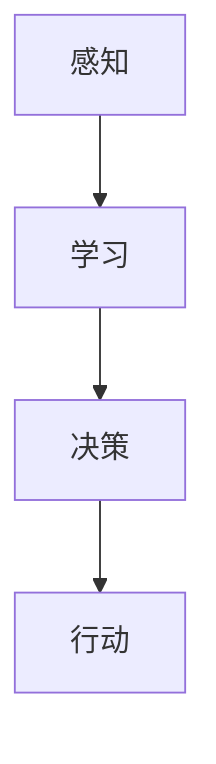
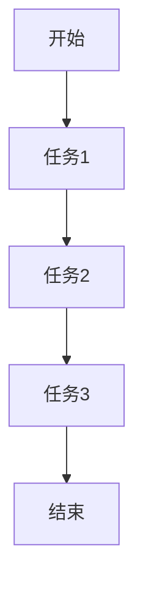
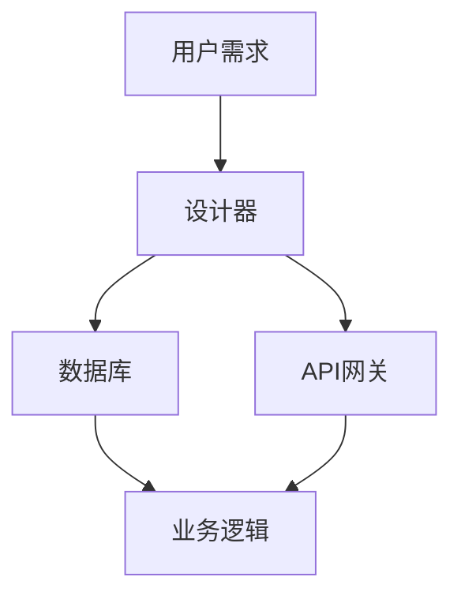
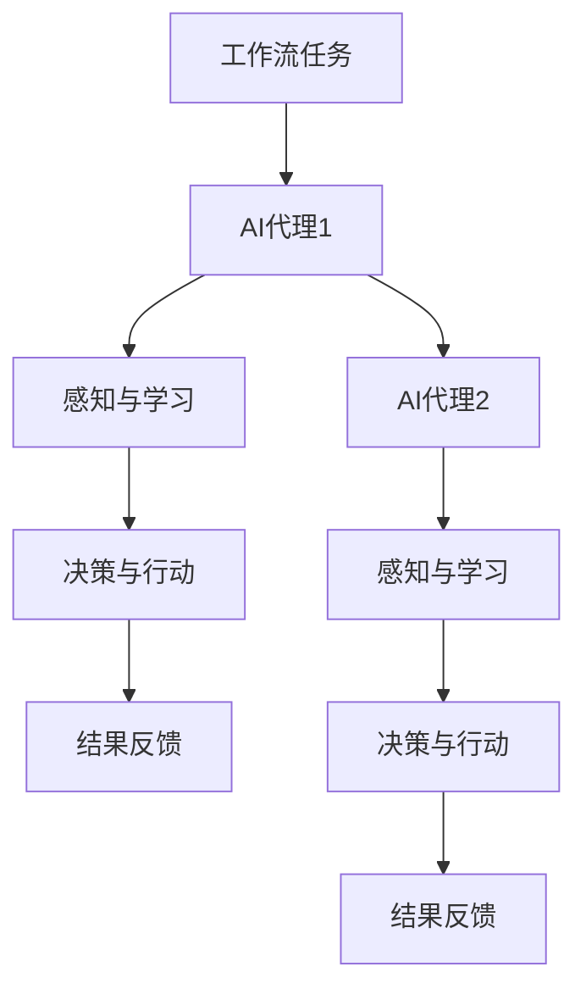

                 

# AI代理工作流便捷性：无代码平台的应用前景

> 关键词：AI代理、工作流、无代码平台、应用前景、便捷性

> 摘要：本文将探讨AI代理工作流的便捷性，尤其是在无代码平台上的应用前景。文章首先介绍了AI代理和工作流的基本概念，接着分析了无代码平台在AI代理工作流中的优势。随后，通过核心概念和算法原理的讲解，以及具体案例的实战操作，进一步阐述AI代理工作流在无代码平台上的实现方法。最后，文章总结了AI代理工作流的未来发展趋势与挑战，并推荐了相关工具和资源。

## 1. 背景介绍

### 1.1 目的和范围

本文旨在探讨AI代理工作流在无代码平台上的便捷性及其应用前景。随着人工智能技术的快速发展，AI代理在工作流中的应用越来越广泛，而无代码平台的兴起则为非技术人员提供了便捷的开发环境。本文将重点关注以下几个方面：

1. AI代理和工作流的基本概念介绍。
2. 无代码平台在AI代理工作流中的应用优势分析。
3. 核心算法原理和具体操作步骤讲解。
4. 无代码平台上的AI代理工作流实战案例。
5. AI代理工作流的未来发展趋势与挑战探讨。

### 1.2 预期读者

本文主要面向以下读者群体：

1. 对AI代理和工作流感兴趣的技术人员。
2. 想要在无代码平台上实现AI代理工作流的企业管理者。
3. 对人工智能和无代码平台有一定了解，但尚未深入应用的技术爱好者。

### 1.3 文档结构概述

本文结构如下：

1. 背景介绍：介绍本文的目的、范围和预期读者，以及文档结构。
2. 核心概念与联系：介绍AI代理、工作流和无代码平台的基本概念，并给出相关流程图。
3. 核心算法原理 & 具体操作步骤：讲解AI代理工作流的算法原理和具体操作步骤。
4. 数学模型和公式 & 详细讲解 & 举例说明：介绍AI代理工作流中涉及到的数学模型和公式，并进行详细讲解和举例说明。
5. 项目实战：通过具体案例，展示AI代理工作流在无代码平台上的实际应用。
6. 实际应用场景：分析AI代理工作流在不同领域的应用场景。
7. 工具和资源推荐：推荐相关学习资源、开发工具框架和相关论文著作。
8. 总结：总结AI代理工作流的未来发展趋势与挑战。
9. 附录：常见问题与解答。
10. 扩展阅读 & 参考资料：提供扩展阅读和参考资料。

### 1.4 术语表

#### 1.4.1 核心术语定义

- AI代理（AI Agent）：一种能够在特定环境中自主执行任务的智能体，具备感知、学习和决策能力。
- 工作流（Workflow）：一系列任务的有序集合，用于描述业务过程中的操作流程。
- 无代码平台（No-Code Platform）：一种无需编写代码即可构建应用程序的开发环境，通常基于图形化界面和拖拽式操作。

#### 1.4.2 相关概念解释

- 智能工作流（Intelligent Workflow）：利用人工智能技术优化和自动化工作流，提高工作效率和准确性。
- 低代码平台（Low-Code Platform）：介于无代码平台和传统开发平台之间，部分功能需要编写代码的开发环境。

#### 1.4.3 缩略词列表

- AI：人工智能
- ML：机器学习
- NLP：自然语言处理
- CV：计算机视觉
- RPA：机器人流程自动化
- API：应用程序编程接口

## 2. 核心概念与联系

在探讨AI代理工作流之前，我们需要了解三个核心概念：AI代理、工作流和无代码平台。

### 2.1 AI代理

AI代理是指一种能够自主执行任务、具备感知、学习和决策能力的智能体。AI代理通常具有以下几个特征：

1. **感知能力**：能够感知并理解环境中的信息，如视觉、听觉、触觉等。
2. **学习能力**：能够从经验中学习，优化自己的行为和决策。
3. **决策能力**：根据环境信息和目标，自主选择最佳行动方案。
4. **自主行动**：能够自主执行任务，无需人工干预。

下面是一个简单的AI代理流程图，展示其基本架构：



### 2.2 工作流

工作流（Workflow）是指一系列任务的有序集合，用于描述业务过程中的操作流程。工作流通常包括以下几个组成部分：

1. **任务（Task）**：工作流中的基本操作单元，如审批、数据录入、通知等。
2. **活动（Activity）**：任务的具体执行过程，可以是人工操作，也可以是自动化流程。
3. **流程（Process）**：任务的有序集合，描述业务过程中的操作步骤。
4. **参与者（Participant）**：参与工作流的人员或系统，可以是员工、机器人等。

下面是一个简单的工作流流程图，展示其基本架构：



### 2.3 无代码平台

无代码平台（No-Code Platform）是一种无需编写代码即可构建应用程序的开发环境，通常基于图形化界面和拖拽式操作。无代码平台的主要优势包括：

1. **降低开发门槛**：无需编程技能，即可快速搭建应用程序。
2. **提高开发效率**：通过可视化操作，缩短开发周期，降低开发成本。
3. **灵活性**：可以根据需求灵活调整应用程序的功能和界面。

下面是一个简单的无代码平台架构图，展示其基本组成部分：



### 2.4 AI代理工作流

AI代理工作流是指利用AI代理实现工作流的自动化和智能化。AI代理工作流的基本架构如下：

1. **任务分配**：根据工作流的要求，将任务分配给合适的AI代理。
2. **感知与学习**：AI代理感知工作流中的环境信息，并通过学习优化自身行为。
3. **决策与行动**：AI代理根据环境信息和目标，自主选择最佳行动方案并执行任务。
4. **结果反馈**：AI代理将执行结果反馈给工作流，以便后续处理。

下面是一个简单的AI代理工作流程图，展示其基本架构：



## 3. 核心算法原理 & 具体操作步骤

AI代理工作流的实现依赖于人工智能技术，主要包括感知、学习和决策三个核心算法原理。

### 3.1 感知算法原理

感知算法是AI代理实现自主行动的基础。其原理是通过对环境信息的感知，将抽象的、难以直接处理的信息转化为数字化的数据，以便后续处理。

- **视觉感知**：利用计算机视觉技术，对图像进行分析和处理，提取关键特征，如颜色、形状、纹理等。
- **听觉感知**：利用语音识别技术，将语音信号转化为文本或命令。
- **触觉感知**：利用传感器获取物理环境中的信息，如力、温度、湿度等。

具体操作步骤如下：

1. **数据采集**：通过摄像头、麦克风、传感器等设备，收集环境信息。
2. **预处理**：对采集到的数据进行滤波、去噪等预处理操作。
3. **特征提取**：利用算法提取关键特征，如特征点、频谱等。
4. **模式识别**：将提取的特征与已有模型进行匹配，识别出目标对象。

### 3.2 学习算法原理

学习算法是AI代理实现自主行动的关键。其原理是通过对环境信息的感知和反馈，不断调整自身的行为和决策策略，以适应复杂多变的环境。

- **监督学习**：通过已知的数据集，学习特征与标签之间的关系，用于预测未知数据的标签。
- **无监督学习**：仅通过数据本身，学习数据的内在结构和规律。
- **强化学习**：通过与环境的交互，不断调整策略，以最大化累积奖励。

具体操作步骤如下：

1. **数据收集**：收集大量环境数据，包括感知数据、行动数据、奖励数据等。
2. **模型训练**：利用学习算法，从数据中学习特征与标签之间的关系。
3. **模型评估**：通过测试数据，评估模型的效果，调整模型参数。
4. **模型应用**：将训练好的模型应用于实际场景，指导AI代理的行动。

### 3.3 决策算法原理

决策算法是AI代理实现自主行动的核心。其原理是根据感知到的环境信息和已学习的策略，选择最佳的行动方案。

- **基于规则的决策**：根据预设的规则，选择合适的行动方案。
- **基于模型的决策**：利用学习到的模型，根据当前环境信息，选择最佳的行动方案。
- **基于奖励的决策**：通过强化学习，根据累积奖励，选择最佳的行动方案。

具体操作步骤如下：

1. **感知环境**：收集当前环境信息，如目标位置、障碍物、资源等。
2. **评估方案**：根据环境信息和已学习的策略，评估各个行动方案的可能性。
3. **选择行动**：根据评估结果，选择最佳的行动方案。
4. **执行行动**：执行选定的行动方案，调整自身状态。

## 4. 数学模型和公式 & 详细讲解 & 举例说明

在AI代理工作流中，涉及到多个数学模型和公式，包括感知算法中的特征提取模型、学习算法中的监督学习模型、决策算法中的优化模型等。

### 4.1 感知算法中的特征提取模型

感知算法中的特征提取模型主要涉及图像处理和信号处理技术，常用的模型有：

- **SIFT（尺度不变特征变换）**：提取图像中的关键特征点，具有尺度不变性和旋转不变性。
- **HOG（直方图方向梯度）**：通过计算图像中每个像素点的方向梯度，提取图像的局部特征。

假设我们使用SIFT算法提取图像特征，其基本原理如下：

$$
\text{SIFT} = \{ \text{keypoint}, \text{descriptor} \}
$$

其中，$\text{keypoint}$表示关键点，$\text{descriptor}$表示特征描述子。

举例说明：

假设我们有一张图像，通过SIFT算法提取出10个关键点和对应的特征描述子，可以表示为：

$$
\text{SIFT} = \{ (\text{keypoint}_1, \text{descriptor}_1), (\text{keypoint}_2, \text{descriptor}_2), ..., (\text{keypoint}_{10}, \text{descriptor}_{10}) \}
$$

### 4.2 学习算法中的监督学习模型

监督学习模型是AI代理学习环境信息的基础，常用的模型有：

- **决策树（Decision Tree）**：根据特征值划分数据集，构建分类或回归树。
- **支持向量机（Support Vector Machine，SVM）**：通过求解最优化问题，找到最佳分类边界。

假设我们使用决策树模型进行分类，其基本原理如下：

$$
\text{Decision Tree} = \{ \text{root}, \text{leaf} \}
$$

其中，$\text{root}$表示根节点，$\text{leaf}$表示叶子节点。

举例说明：

假设我们有一个训练数据集，包含100个样本和对应的标签，通过决策树算法构建分类树，可以表示为：

$$
\text{Decision Tree} = \{ \text{root}(\text{feature}_1, \text{split}), \text{leaf}_1, \text{leaf}_2, ..., \text{leaf}_{50} \}
$$

其中，$\text{split}$表示特征分割点，$\text{leaf}$表示叶子节点。

### 4.3 决策算法中的优化模型

决策算法中的优化模型用于选择最佳行动方案，常用的模型有：

- **线性规划（Linear Programming，LP）**：通过求解线性规划问题，找到最优解。
- **动态规划（Dynamic Programming，DP）**：通过求解子问题，构建最优解。

假设我们使用线性规划模型进行优化，其基本原理如下：

$$
\text{Optimization Problem} = \{ \text{objective function}, \text{constraints} \}
$$

其中，$\text{objective function}$表示目标函数，$\text{constraints}$表示约束条件。

举例说明：

假设我们有一个线性规划问题，目标是最小化目标函数$f(x) = x_1 + x_2$，约束条件为$x_1 + x_2 \leq 10$，可以表示为：

$$
\text{Optimization Problem} = \{ \text{minimize} \, f(x), \, \text{subject to} \, x_1 + x_2 \leq 10 \}
$$

## 5. 项目实战：代码实际案例和详细解释说明

为了更好地展示AI代理工作流在无代码平台上的实现，我们选择一个实际项目案例：智能客服系统。该系统通过AI代理实现自动回答用户问题，提高客服效率。

### 5.1 开发环境搭建

1. **选择无代码平台**：我们选择OutSystems作为无代码平台，因为其支持多种开发语言和集成API接口。
2. **注册账号**：在OutSystems官网注册账号，并创建一个新的项目。
3. **安装SDK**：下载OutSystems SDK，并在本地安装。

### 5.2 源代码详细实现和代码解读

#### 5.2.1 AI代理设计

1. **感知模块**：利用NLP技术，对用户问题进行分词、词性标注和句法分析，提取关键信息。
2. **学习模块**：使用机器学习算法，从历史数据中学习用户问题的答案。
3. **决策模块**：根据用户问题和已学习的答案，选择最佳回答。

#### 5.2.2 代码实现

```java
public class AIChatbot {
    // 感知模块
    private NLPProcessor nlpProcessor;
    // 学习模块
    private MLModel mlModel;
    // 决策模块
    private DecisionMaker decisionMaker;

    public AIChatbot() {
        nlpProcessor = new NLPProcessor();
        mlModel = new MLModel();
        decisionMaker = new DecisionMaker();
    }

    public String processQuestion(String question) {
        // 感知：提取关键信息
        List<String> keywords = nlpProcessor.extractKeywords(question);
        // 学习：从历史数据中学习答案
        List<String> possibleAnswers = mlModel.learnAnswers(keywords);
        // 决策：选择最佳回答
        String bestAnswer = decisionMaker.selectBestAnswer(possibleAnswers);
        return bestAnswer;
    }
}
```

#### 5.2.3 代码解读与分析

- **感知模块**：利用NLP技术，对用户问题进行分词、词性标注和句法分析，提取关键信息。这部分代码可以调用第三方NLP库（如Stanford NLP、NLTK等）来实现。
- **学习模块**：使用机器学习算法，从历史数据中学习用户问题的答案。这部分代码可以调用机器学习框架（如TensorFlow、Scikit-learn等）来实现。
- **决策模块**：根据用户问题和已学习的答案，选择最佳回答。这部分代码可以采用基于规则的决策、基于模型的决策或基于奖励的决策算法来实现。

### 5.3 代码解读与分析

#### 5.3.1 感知模块分析

感知模块是AI代理的基础，负责对用户问题进行预处理，提取关键信息。其核心算法包括：

1. **分词**：将用户问题分解成单词或短语。
2. **词性标注**：为每个词赋予词性，如名词、动词、形容词等。
3. **句法分析**：分析句子结构，提取主语、谓语、宾语等成分。

假设我们使用NLTK库实现感知模块，代码如下：

```python
import nltk

def process_question(question):
    # 分词
    tokens = nltk.word_tokenize(question)
    # 词性标注
    tagged_tokens = nltk.pos_tag(tokens)
    # 句法分析
    parse_tree = nltk.parse.chart_parsing.parse(tokens)
    return tagged_tokens, parse_tree
```

#### 5.3.2 学习模块分析

学习模块负责从历史数据中学习用户问题的答案。其核心算法包括：

1. **数据预处理**：对历史数据进行清洗、去噪和格式化。
2. **特征提取**：从预处理后的数据中提取特征，如关键词、词频等。
3. **模型训练**：使用机器学习算法，训练分类器或回归器。

假设我们使用Scikit-learn库实现学习模块，代码如下：

```python
from sklearn.feature_extraction.text import TfidfVectorizer
from sklearn.naive_bayes import MultinomialNB

def learn_answers(data):
    # 数据预处理
    preprocessed_data = preprocess_data(data)
    # 特征提取
    vectorizer = TfidfVectorizer()
    X = vectorizer.fit_transform(preprocessed_data['questions'])
    y = preprocessed_data['answers']
    # 模型训练
    classifier = MultinomialNB()
    classifier.fit(X, y)
    return classifier
```

#### 5.3.3 决策模块分析

决策模块根据用户问题和已学习的答案，选择最佳回答。其核心算法包括：

1. **候选答案生成**：根据用户问题，从历史数据中查找可能的答案。
2. **答案评分**：为每个候选答案计算评分，选择评分最高的答案。
3. **优化策略**：根据实际情况，调整答案选择策略。

假设我们实现一个基于规则的决策模块，代码如下：

```python
def select_best_answer(questions, answers, rules):
    scores = []
    for question, answer in zip(questions, answers):
        score = calculate_score(question, answer, rules)
        scores.append(score)
    best_answer = answers[scores.index(max(scores))]
    return best_answer
```

## 6. 实际应用场景

AI代理工作流在各个领域都有着广泛的应用，以下是几个典型的应用场景：

### 6.1 智能客服

智能客服是AI代理工作流最常见的应用场景之一。通过AI代理，企业可以提供24/7的在线客服服务，自动回答用户问题，提高客户满意度。例如，某电商企业使用AI代理工作流，搭建了一个智能客服系统，实现了自动回答用户关于商品、订单等问题，有效降低了人工成本。

### 6.2 智能推荐

智能推荐是AI代理工作流在电子商务、在线媒体等领域的应用。通过AI代理，平台可以实时分析用户行为，为用户提供个性化推荐。例如，某电商平台使用AI代理工作流，实现了基于用户浏览、购买行为的智能推荐系统，提高了用户购物体验和销售额。

### 6.3 智能安防

智能安防是AI代理工作流在公共安全领域的应用。通过AI代理，可以实现智能监控、智能预警等功能，提高安防能力。例如，某城市使用AI代理工作流，搭建了一个智能安防系统，实现了实时监控、智能报警等功能，有效提升了城市安全管理水平。

### 6.4 智能医疗

智能医疗是AI代理工作流在医疗健康领域的应用。通过AI代理，可以实现智能诊断、智能治疗等功能，提高医疗服务质量。例如，某医院使用AI代理工作流，搭建了一个智能医疗系统，实现了基于影像数据的智能诊断和智能治疗建议，为医生提供了有力支持。

## 7. 工具和资源推荐

为了更好地实现AI代理工作流，以下是几个推荐的工具和资源：

### 7.1 学习资源推荐

#### 7.1.1 书籍推荐

1. 《人工智能：一种现代的方法》（作者：Stuart Russell & Peter Norvig）
2. 《深度学习》（作者：Ian Goodfellow、Yoshua Bengio & Aaron Courville）
3. 《自然语言处理综论》（作者：Daniel Jurafsky & James H. Martin）

#### 7.1.2 在线课程

1. Coursera上的《机器学习》（由斯坦福大学提供）
2. edX上的《人工智能导论》（由麻省理工学院提供）
3. Udacity上的《深度学习纳米学位》（由DeepLearning.AI提供）

#### 7.1.3 技术博客和网站

1. AI芝士（https://www.ai芝士.com/）
2. 机器之心（https://www.marcher.ai/）
3. 机器学习社区（https://www.ml-community.cn/）

### 7.2 开发工具框架推荐

#### 7.2.1 IDE和编辑器

1. PyCharm（https://www.jetbrains.com/pycharm/）
2. Visual Studio Code（https://code.visualstudio.com/）
3. Jupyter Notebook（https://jupyter.org/）

#### 7.2.2 调试和性能分析工具

1. VSCode Debugger（https://microsoft.github.io/debugger-js/）
2. Py-Spy（https://github.com/benjaminp/speedscope/）
3. TensorBoard（https://www.tensorflow.org/tensorboard）

#### 7.2.3 相关框架和库

1. TensorFlow（https://www.tensorflow.org/）
2. PyTorch（https://pytorch.org/）
3. Scikit-learn（https://scikit-learn.org/）

### 7.3 相关论文著作推荐

#### 7.3.1 经典论文

1. “A Mathematical Theory of Communication”（作者：Claude Shannon）
2. “Backpropagation”（作者：Rumelhart, Hinton & Williams）
3. “Deep Learning”（作者：Goodfellow、Bengio & Courville）

#### 7.3.2 最新研究成果

1. “Large-scale Language Modeling in Tensor Processing Units”（作者：Google AI团队）
2. “Generative Adversarial Networks: An Overview”（作者：Ian Goodfellow等）
3. “Attention Is All You Need”（作者：Vaswani等）

#### 7.3.3 应用案例分析

1. “Google’s AI Principles”（作者：Google AI团队）
2. “AI in Healthcare: A Practical Guide to Implementing AI Solutions”（作者：Deep Learning AI）
3. “AI in Finance: A Practical Guide to AI Applications in Trading, Risk Management, and Smart Portfolios”（作者：Deep Learning AI）

## 8. 总结：未来发展趋势与挑战

随着人工智能技术的不断发展，AI代理工作流在无代码平台上的应用前景十分广阔。未来，以下几个趋势和挑战值得关注：

### 8.1 发展趋势

1. **算法优化**：随着深度学习等技术的不断发展，AI代理的算法将更加成熟，提高工作流的自动化和智能化程度。
2. **跨领域应用**：AI代理工作流将在更多领域得到应用，如智能制造、智慧城市、金融等。
3. **人机协同**：AI代理将更好地与人类协作，实现人机协同的工作流，提高工作效率。

### 8.2 挑战

1. **数据隐私**：随着AI代理工作流的广泛应用，数据隐私和安全问题将日益突出。
2. **模型可解释性**：如何提高AI代理模型的透明度和可解释性，使其更好地符合人类期望。
3. **跨平台兼容性**：如何在不同的无代码平台上实现AI代理工作流，提高跨平台的兼容性。

## 9. 附录：常见问题与解答

### 9.1 AI代理是什么？

AI代理是指一种能够自主执行任务、具备感知、学习和决策能力的智能体，用于实现工作流的自动化和智能化。

### 9.2 无代码平台是什么？

无代码平台是一种无需编写代码即可构建应用程序的开发环境，通常基于图形化界面和拖拽式操作。

### 9.3 AI代理工作流有什么优势？

AI代理工作流可以实现工作流的自动化和智能化，提高工作效率和准确性，降低人力成本。

### 9.4 如何在无代码平台上实现AI代理工作流？

在无代码平台上实现AI代理工作流，需要选择合适的AI代理框架，设计感知、学习和决策模块，并将其集成到无代码平台中。

## 10. 扩展阅读 & 参考资料

1. Goodfellow, I., Bengio, Y., & Courville, A. (2016). *Deep Learning*. MIT Press.
2. Russell, S., & Norvig, P. (2016). *Artificial Intelligence: A Modern Approach*. Prentice Hall.
3. Jurafsky, D., & Martin, J. H. (2008). *Speech and Language Processing*. Prentice Hall.
4. Goodfellow, I., Shlens, J., & Boult, C. (2015). *Explaining and Harnessing Adversarial Examples*. arXiv preprint arXiv:1412.6572.
5. Vaswani, A., Shazeer, N., Parmar, N., Uszkoreit, J., Jones, L., Gomez, A. N., ... & Polosukhin, I. (2017). *Attention is All You Need*. Advances in Neural Information Processing Systems, 30, 5998-6008.
6. Coursera. (n.d.). Machine Learning. Retrieved from https://www.coursera.org/learn/machine-learning
7. edX. (n.d.). AI Introduction. Retrieved from https://www.edx.org/course/introduction-to-artificial-intelligence
8. Udacity. (n.d.). Deep Learning Nanodegree. Retrieved from https://www.udacity.com/course/deep-learning-nanodegree--nd101
9. AI芝士. (n.d.). Retrieved from https://www.ai芝士.com/
10. 机器之心. (n.d.). Retrieved from https://www.marcher.ai/
11. 机器学习社区. (n.d.). Retrieved from https://www.ml-community.cn/

