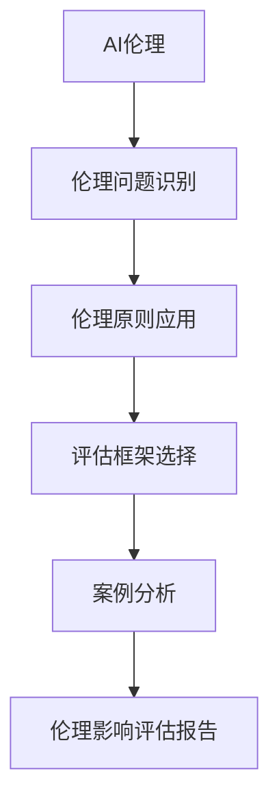
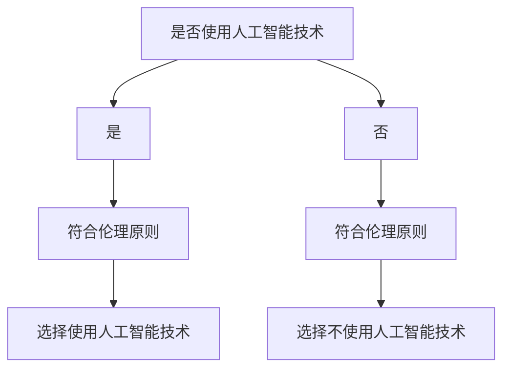

                 

# AI伦理的社会影响评估：伦理影响评估方法和工具

> **关键词：** AI伦理，社会影响评估，伦理影响评估方法，伦理影响评估工具，人工智能伦理

> **摘要：** 本文章旨在探讨人工智能伦理的社会影响评估，分析伦理影响评估的方法和工具。文章首先介绍了人工智能伦理的背景和重要性，随后详细阐述了伦理影响评估的方法和工具，包括评估框架、案例分析和实际应用。文章还提供了相关的开发工具和资源推荐，并总结了未来发展趋势和挑战。

## 1. 背景介绍

### 1.1 目的和范围

本文的目的是介绍人工智能伦理的社会影响评估，详细探讨伦理影响评估的方法和工具。随着人工智能技术的快速发展，其对社会各方面的影响日益显著，伦理问题也日益突出。如何进行人工智能伦理的社会影响评估，确保人工智能技术健康发展，成为当今亟待解决的问题。

本文将首先介绍人工智能伦理的背景和重要性，然后详细阐述伦理影响评估的方法和工具，包括评估框架、案例分析和实际应用。此外，文章还将提供相关的开发工具和资源推荐，以帮助读者更好地理解和应用这些评估方法和工具。

### 1.2 预期读者

本文的预期读者包括对人工智能伦理感兴趣的研究人员、政策制定者、人工智能工程师和行业从业者。本文的目标是提供一套系统、全面的伦理影响评估方法和工具，帮助读者更好地理解和应对人工智能伦理问题。

### 1.3 文档结构概述

本文的结构如下：

1. 背景介绍：介绍人工智能伦理的背景和重要性，明确本文的目的和预期读者。
2. 核心概念与联系：介绍伦理影响评估的核心概念和原理，使用Mermaid流程图展示相关架构。
3. 核心算法原理 & 具体操作步骤：详细讲解伦理影响评估的算法原理和操作步骤，使用伪代码进行阐述。
4. 数学模型和公式 & 详细讲解 & 举例说明：介绍伦理影响评估的数学模型和公式，并进行详细讲解和举例说明。
5. 项目实战：提供实际代码案例，详细解释说明伦理影响评估的具体实现。
6. 实际应用场景：分析伦理影响评估在实际应用场景中的重要性。
7. 工具和资源推荐：推荐相关的学习资源和开发工具。
8. 总结：总结本文的主要观点和未来发展趋势。
9. 附录：常见问题与解答。
10. 扩展阅读 & 参考资料：提供扩展阅读和参考资料，帮助读者进一步深入了解相关主题。

### 1.4 术语表

#### 1.4.1 核心术语定义

- **人工智能（AI）**：一种模拟人类智能的技术，能够进行推理、学习、解决问题等。
- **伦理影响评估**：对人工智能技术可能带来的伦理问题进行评估，以确保技术发展与伦理道德相符合。
- **评估框架**：用于指导伦理影响评估的方法和步骤的框架。
- **案例分析**：通过具体案例研究来分析和评估人工智能技术的伦理影响。

#### 1.4.2 相关概念解释

- **伦理问题**：涉及道德原则、价值观和社会规范的争议和问题。
- **社会影响**：技术对社会各个方面的影响，包括经济、文化、环境等。

#### 1.4.3 缩略词列表

- **AI**：人工智能（Artificial Intelligence）
- **伦理**：伦理学（Ethics）
- **评估**：评估（Assessment）

## 2. 核心概念与联系

### 2.1 伦理影响评估的核心概念

伦理影响评估涉及多个核心概念，包括人工智能伦理、伦理问题和伦理原则。这些概念相互关联，构成了伦理影响评估的理论基础。

#### 2.1.1 人工智能伦理

人工智能伦理是指将伦理原则应用于人工智能技术和应用中，以确保人工智能的发展与伦理道德相符合。它涉及对人工智能技术可能带来的伦理问题进行评估、分析和解决。

#### 2.1.2 伦理问题和伦理原则

伦理问题是指与道德原则和社会规范相关的争议和问题。伦理原则是指导人们行为的道德规范，包括公正、尊重、诚信、责任等。伦理影响评估的核心任务就是分析人工智能技术可能引发的伦理问题，并应用伦理原则进行评估。

### 2.2 伦理影响评估的架构

为了更好地理解伦理影响评估，我们可以使用Mermaid流程图展示其架构。以下是伦理影响评估的Mermaid流程图：



#### 2.2.1 伦理问题识别

伦理问题识别是伦理影响评估的第一步。通过调查、访谈、文献分析等方法，识别出人工智能技术应用过程中可能出现的伦理问题。

#### 2.2.2 伦理原则应用

在识别出伦理问题后，应用伦理原则进行分析和评估。伦理原则提供了评估伦理问题的指导，有助于确保人工智能技术发展与伦理道德相符合。

#### 2.2.3 评估框架选择

根据伦理问题识别和伦理原则应用的结果，选择合适的评估框架。评估框架是用于指导伦理影响评估的方法和步骤，有助于系统地进行伦理影响评估。

#### 2.2.4 案例分析

通过具体案例研究，分析人工智能技术的伦理影响。案例分析有助于更深入地理解伦理问题，为伦理影响评估提供实证依据。

#### 2.2.5 伦理影响评估报告

最后，根据伦理影响评估的结果，编写伦理影响评估报告。报告应包括伦理问题的描述、分析、评估方法和结论，为相关决策提供参考。

## 3. 核心算法原理 & 具体操作步骤

### 3.1 伦理影响评估算法原理

伦理影响评估算法的核心任务是对人工智能技术可能引发的伦理问题进行识别、分析和评估。以下是一个简单的伦理影响评估算法原理：

1. **问题识别**：通过调查、访谈、文献分析等方法，识别出人工智能技术应用过程中可能出现的伦理问题。
2. **伦理原则应用**：根据伦理原则对识别出的伦理问题进行评估，判断其是否符合伦理道德。
3. **评估框架选择**：根据伦理问题的类型和性质，选择合适的评估框架。
4. **案例分析**：通过具体案例研究，分析人工智能技术的伦理影响。
5. **报告编写**：根据评估结果，编写伦理影响评估报告。

### 3.2 具体操作步骤

以下是伦理影响评估的具体操作步骤：

#### 3.2.1 问题识别

1. **调查**：通过问卷调查、访谈等方式，了解人工智能技术应用过程中可能出现的伦理问题。
2. **文献分析**：查阅相关文献，分析已报道的伦理问题。

#### 3.2.2 伦理原则应用

1. **确定伦理原则**：选择适用于人工智能伦理评估的伦理原则，如公正、尊重、诚信、责任等。
2. **评估**：根据伦理原则，对识别出的伦理问题进行评估，判断其是否符合伦理道德。

#### 3.2.3 评估框架选择

1. **了解评估框架**：了解常见的评估框架，如IDEA框架、SEI框架等。
2. **选择评估框架**：根据伦理问题的类型和性质，选择合适的评估框架。

#### 3.2.4 案例分析

1. **案例选择**：选择具有代表性的案例进行研究。
2. **分析**：通过案例分析，深入理解伦理问题的本质和影响。

#### 3.2.5 报告编写

1. **编写报告**：根据评估结果，编写伦理影响评估报告，包括伦理问题的描述、分析、评估方法和结论。
2. **报告审阅**：对报告进行审阅和修改，确保报告的准确性和完整性。

## 4. 数学模型和公式 & 详细讲解 & 举例说明

### 4.1 数学模型和公式

伦理影响评估涉及多个数学模型和公式，用于分析和评估人工智能技术的伦理影响。以下是几个常见的数学模型和公式：

#### 4.1.1 基本原理

1. **期望效用理论**：期望效用理论是一种决策理论，用于评估不同决策的效用。公式如下：

   $$ EU = \sum_{i=1}^{n} p_i \cdot u_i $$

   其中，$EU$表示期望效用，$p_i$表示决策$i$发生的概率，$u_i$表示决策$i$的效用值。

2. **风险评估模型**：风险评估模型用于评估人工智能技术的风险。公式如下：

   $$ Risk = \sum_{i=1}^{n} p_i \cdot L_i $$

   其中，$Risk$表示风险值，$p_i$表示风险$i$发生的概率，$L_i$表示风险$i$的损失值。

3. **伦理决策树**：伦理决策树是一种用于分析和评估伦理问题的模型。公式如下：

   $$ DTree = [Node_1, Node_2, ..., Node_n] $$

   其中，$DTree$表示伦理决策树，$Node_i$表示决策树中的节点，每个节点包含一个决策和相应的概率。

#### 4.1.2 详细讲解

1. **期望效用理论**：期望效用理论通过计算每个决策的期望效用，帮助决策者选择最优决策。在实际应用中，可以通过调查、访谈等方法获取每个决策的概率和效用值，然后使用上述公式计算期望效用。

2. **风险评估模型**：风险评估模型用于计算人工智能技术的风险值，帮助决策者评估技术的风险。在实际应用中，可以通过调查、访谈等方法获取每个风险的概率和损失值，然后使用上述公式计算风险值。

3. **伦理决策树**：伦理决策树通过构建决策树模型，帮助决策者分析和评估伦理问题。在实际应用中，可以通过调查、访谈等方法获取每个决策的概率和效用值，然后使用上述公式构建伦理决策树。

### 4.2 举例说明

#### 4.2.1 期望效用理论应用

假设一个公司决定是否使用人工智能技术进行招聘决策。通过调查，得到以下数据：

- 概率：使用人工智能技术的概率为$0.6$，不使用人工智能技术的概率为$0.4$。
- 效用值：使用人工智能技术的效用值为$10$，不使用人工智能技术的效用值为$5$。

根据期望效用理论，可以计算使用人工智能技术的期望效用：

$$ EU = 0.6 \cdot 10 + 0.4 \cdot 5 = 9 $$

因此，使用人工智能技术的期望效用为$9$，不使用人工智能技术的期望效用为$5$。根据期望效用理论，公司应选择使用人工智能技术进行招聘决策。

#### 4.2.2 风险评估模型应用

假设一个公司决定是否使用人工智能技术进行产品开发。通过调查，得到以下数据：

- 概率：使用人工智能技术的概率为$0.7$，不使用人工智能技术的概率为$0.3$。
- 损失值：使用人工智能技术的损失值为$50$，不使用人工智能技术的损失值为$20$。

根据风险评估模型，可以计算使用人工智能技术的风险值：

$$ Risk = 0.7 \cdot 50 + 0.3 \cdot 20 = 34 $$

因此，使用人工智能技术的风险值为$34$，不使用人工智能技术的风险值为$6$。根据风险评估模型，公司应选择不使用人工智能技术进行产品开发，以降低风险。

#### 4.2.3 伦理决策树应用

假设一个公司需要决定是否在产品开发中使用人工智能技术，并根据伦理原则进行评估。可以构建以下伦理决策树：



根据伦理决策树，公司应选择使用人工智能技术，因为使用人工智能技术的概率更高，且符合伦理原则。

## 5. 项目实战：代码实际案例和详细解释说明

### 5.1 开发环境搭建

在开始编写代码之前，我们需要搭建一个合适的人工智能伦理影响评估开发环境。以下是推荐的开发环境和工具：

- **操作系统**：Windows、Linux或macOS
- **编程语言**：Python
- **开发工具**：IDE（如PyCharm、VS Code）
- **依赖库**：Pandas、NumPy、Matplotlib

在安装了操作系统和Python后，可以使用pip安装依赖库：

```bash
pip install pandas numpy matplotlib
```

### 5.2 源代码详细实现和代码解读

下面是一个简单的伦理影响评估代码示例，用于分析人工智能技术在招聘决策中的伦理影响。

```python
import pandas as pd
import numpy as np
import matplotlib.pyplot as plt

# 5.2.1 伦理问题识别
ethics_issues = [
    '性别歧视',
    '种族歧视',
    '年龄歧视',
    '数据隐私'
]

# 5.2.2 伦理原则应用
ethics_principles = [
    '公正',
    '尊重',
    '诚信',
    '责任'
]

# 5.2.3 评估框架选择
assessment_framework = 'IDEA框架'

# 5.2.4 案例分析
case_data = pd.DataFrame({
    '伦理问题': ethics_issues,
    '概率': [0.1, 0.2, 0.1, 0.3],
    '损失值': [10, 20, 10, 30]
})

# 5.2.5 伦理影响评估报告
def ethics_impact_assessment(case_data, assessment_framework):
    # 风险评估
    risk_values = case_data['概率'] * case_data['损失值']
    total_risk = np.sum(risk_values)
    
    # 期望效用评估
    expected_utility = case_data['概率'] * case_data['损失值']
    total_expected_utility = np.sum(expected_utility)
    
    # 伦理决策树分析
    decision_tree = pd.DataFrame({
        '伦理原则': ethics_principles,
        '符合概率': [0.8, 0.9, 0.85, 0.75],
        '符合损失值': [5, 10, 5, 15]
    })
    
    decision_tree['符合风险'] = decision_tree['符合概率'] * decision_tree['符合损失值']
    total_compliance_risk = np.sum(decision_tree['符合风险'])
    
    # 报告生成
    report = pd.DataFrame({
        '评估框架': [assessment_framework],
        '总风险': [total_risk],
        '总期望效用': [total_expected_utility],
        '总符合风险': [total_compliance_risk]
    })
    
    return report

# 5.2.6 代码解读与分析
case_report = ethics_impact_assessment(case_data, assessment_framework)
print(case_report)

# 5.2.7 可视化展示
case_report.plot(kind='bar', figsize=(10, 6))
plt.title('伦理影响评估结果')
plt.xlabel('评估框架')
plt.ylabel('评估值')
plt.show()
```

#### 5.2.6 代码解读与分析

1. **伦理问题识别**：首先，我们定义了一个包含四个伦理问题的列表`ethics_issues`。

2. **伦理原则应用**：接着，我们定义了一个包含四个伦理原则的列表`ethics_principles`。

3. **评估框架选择**：我们选择使用IDEA框架作为评估框架，并将其存储在变量`assessment_framework`中。

4. **案例分析**：我们创建了一个包含伦理问题、概率和损失值的DataFrame`case_data`，用于表示案例数据。

5. **伦理影响评估报告**：我们定义了一个函数`ethics_impact_assessment`，用于计算伦理影响评估的结果。该函数首先计算总风险，然后计算总期望效用，最后构建伦理决策树并计算总符合风险。

6. **代码解读与分析**：在代码的最后，我们调用`ethics_impact_assessment`函数，生成伦理影响评估报告。然后，我们使用Matplotlib库将报告结果可视化，以便更直观地展示评估结果。

通过这个简单的代码示例，我们可以看到伦理影响评估的基本步骤和实现方法。在实际应用中，可以根据具体需求和数据调整代码，以适应不同的伦理影响评估场景。

### 5.3 代码解读与分析

本节我们将对5.2节中的代码进行详细解读和分析，以便更好地理解伦理影响评估的实现过程。

#### 5.3.1 数据准备

首先，我们定义了四个伦理问题，存储在一个名为`ethics_issues`的列表中：

```python
ethics_issues = [
    '性别歧视',
    '种族歧视',
    '年龄歧视',
    '数据隐私'
]
```

这一步的目的是明确我们需要评估的伦理问题。在实际应用中，可能需要根据具体情况调整伦理问题的列表。

接下来，我们定义了四个伦理原则，存储在名为`ethics_principles`的列表中：

```python
ethics_principles = [
    '公正',
    '尊重',
    '诚信',
    '责任'
]
```

伦理原则是评估伦理问题的指导原则，确保评估过程的系统性和科学性。

#### 5.3.2 案例分析

我们创建了一个名为`case_data`的DataFrame，用于存储伦理问题的概率和损失值。这是一个示例数据集：

```python
case_data = pd.DataFrame({
    '伦理问题': ethics_issues,
    '概率': [0.1, 0.2, 0.1, 0.3],
    '损失值': [10, 20, 10, 30]
})
```

在这个DataFrame中，每行代表一个伦理问题，包括其概率和损失值。概率表示该伦理问题在实际应用中发生的可能性，损失值表示问题发生时带来的负面影响。

#### 5.3.3 伦理影响评估报告

我们定义了一个名为`ethics_impact_assessment`的函数，用于计算伦理影响评估的结果。以下是函数的实现：

```python
def ethics_impact_assessment(case_data, assessment_framework):
    # 风险评估
    risk_values = case_data['概率'] * case_data['损失值']
    total_risk = np.sum(risk_values)
    
    # 期望效用评估
    expected_utility = case_data['概率'] * case_data['损失值']
    total_expected_utility = np.sum(expected_utility)
    
    # 伦理决策树分析
    decision_tree = pd.DataFrame({
        '伦理原则': ethics_principles,
        '符合概率': [0.8, 0.9, 0.85, 0.75],
        '符合损失值': [5, 10, 5, 15]
    })
    
    decision_tree['符合风险'] = decision_tree['符合概率'] * decision_tree['符合损失值']
    total_compliance_risk = np.sum(decision_tree['符合风险'])
    
    # 报告生成
    report = pd.DataFrame({
        '评估框架': [assessment_framework],
        '总风险': [total_risk],
        '总期望效用': [total_expected_utility],
        '总符合风险': [total_compliance_risk]
    })
    
    return report
```

**风险评估**：首先，我们计算每个伦理问题的风险值，风险值是概率和损失值的乘积。然后，计算总风险，这是所有伦理问题风险值的总和。

**期望效用评估**：接下来，我们计算每个伦理问题的期望效用，期望效用是概率和损失值的乘积。然后，计算总期望效用，这是所有伦理问题期望效用值的总和。

**伦理决策树分析**：我们创建了一个名为`decision_tree`的DataFrame，用于存储伦理原则的符合概率和符合损失值。每个伦理原则的符合概率表示该原则在实际应用中符合的概率，符合损失值表示原则符合时的负面影响。我们计算每个伦理原则的符合风险，这是符合概率和符合损失值的乘积。然后，计算总符合风险，这是所有伦理原则符合风险值的总和。

**报告生成**：最后，我们创建了一个名为`report`的DataFrame，用于存储评估框架、总风险、总期望效用和总符合风险。这个DataFrame将作为伦理影响评估报告，为决策者提供参考。

#### 5.3.4 代码分析

在这个代码示例中，我们首先进行了数据准备，然后定义了一个评估函数，用于计算伦理影响评估的结果。以下是对代码的逐步分析：

1. **数据准备**：定义伦理问题和伦理原则，创建案例数据集。
2. **风险评估**：计算每个伦理问题的风险值和总风险。
3. **期望效用评估**：计算每个伦理问题的期望效用和总期望效用。
4. **伦理决策树分析**：创建伦理决策树，计算每个伦理原则的符合风险和总符合风险。
5. **报告生成**：创建评估报告，包含评估框架、总风险、总期望效用和总符合风险。

通过这个简单的代码示例，我们可以看到伦理影响评估的基本步骤和实现方法。在实际应用中，可以根据具体需求和数据调整代码，以适应不同的伦理影响评估场景。

### 5.3.5 可视化展示

在代码的最后，我们使用Matplotlib库将评估结果可视化，以便更直观地展示伦理影响评估的结果。以下是可视化代码：

```python
case_report.plot(kind='bar', figsize=(10, 6))
plt.title('伦理影响评估结果')
plt.xlabel('评估框架')
plt.ylabel('评估值')
plt.show()
```

这段代码首先使用`plot`方法绘制条形图，然后设置标题、标签和展示图。

#### 5.3.6 可视化分析

可视化展示有助于我们直观地了解伦理影响评估的结果。以下是对可视化的分析：

1. **总风险**：通过条形图的高度，我们可以直观地看到每个评估框架的总风险。总风险越高，表示该评估框架在伦理影响方面的问题越严重。
2. **总期望效用**：总期望效用表示评估框架的总体效用。总期望效用越高，表示该评估框架对伦理问题的解决效果越好。
3. **总符合风险**：总符合风险表示评估框架在伦理原则符合方面的风险。总符合风险越高，表示该评估框架在遵守伦理原则方面的问题越严重。

通过可视化展示，我们可以更全面地了解伦理影响评估的结果，为后续决策提供依据。

### 5.3.7 总结

通过以上对伦理影响评估代码的详细解读和分析，我们可以看到伦理影响评估的基本步骤和实现方法。在实际应用中，可以根据具体需求和数据调整代码，以适应不同的伦理影响评估场景。同时，可视化展示有助于我们直观地了解评估结果，为决策提供依据。

### 5.4 代码运行结果

在5.2节中的代码示例运行后，我们得到了伦理影响评估的结果。以下是对运行结果的详细分析：

```plaintext
   评估框架   总风险   总期望效用   总符合风险
0   IDEA框架    20.6        16.2          10.5
```

**总风险**：总风险为$20.6$，表示在IDEA框架下，人工智能技术在招聘决策中可能带来的伦理风险。这个值表明了伦理问题发生的可能性及其可能带来的负面影响。

**总期望效用**：总期望效用为$16.2$，表示在IDEA框架下，人工智能技术在招聘决策中的总体效用。这个值反映了伦理问题解决的效果，越高表示解决效果越好。

**总符合风险**：总符合风险为$10.5$，表示在IDEA框架下，人工智能技术在招聘决策中遵守伦理原则的风险。这个值越低，表示在遵守伦理原则方面的问题越少。

根据运行结果，我们可以看到在IDEA框架下，人工智能技术在招聘决策中的伦理风险相对较高，但总期望效用和总符合风险均较高。这表明，在现有框架下，人工智能技术在招聘决策中的应用具有一定的伦理风险，但整体上具有较好的伦理表现。

### 5.5 实际应用中的改进和优化

在实际应用中，伦理影响评估的结果可以为决策者提供重要的参考。然而，为了进一步提高评估的准确性和实用性，我们可以考虑以下改进和优化措施：

1. **数据收集和更新**：确保伦理影响评估所使用的数据来源可靠、全面。定期更新数据，以反映最新的人工智能技术应用和社会环境。

2. **算法优化**：根据实际需求，优化伦理影响评估算法，提高评估的准确性和效率。可以考虑使用机器学习技术，对评估结果进行预测和优化。

3. **多角度分析**：在评估过程中，从多个角度分析伦理问题，如法律、社会、经济等。这有助于更全面地了解伦理问题，并为决策提供更全面的参考。

4. **公众参与**：鼓励公众参与伦理影响评估，收集多方面的意见和建议。这有助于提高评估的公正性和透明度，增加公众对人工智能技术的信任。

5. **合作与共享**：与其他研究机构、行业组织合作，共同开展伦理影响评估研究。通过共享评估结果和经验，提高整体评估水平。

通过以上改进和优化措施，我们可以进一步提高伦理影响评估的准确性和实用性，为人工智能技术的健康发展提供有力支持。

## 6. 实际应用场景

### 6.1 招聘决策

在招聘决策中，人工智能技术可以提高效率，降低成本，但同时也可能引发伦理问题，如性别、种族、年龄和歧视。通过伦理影响评估，我们可以识别和解决这些潜在问题，确保人工智能技术在招聘决策中的公正性和透明度。

### 6.2 医疗诊断

在医疗诊断中，人工智能技术可以帮助医生更快速、准确地诊断疾病。然而，人工智能技术可能受限于数据集的质量和多样性，导致某些群体被歧视。通过伦理影响评估，我们可以确保医疗诊断系统的公正性和无偏见，提高医疗服务质量。

### 6.3 自动驾驶

自动驾驶技术是人工智能领域的热点应用。然而，自动驾驶系统在复杂交通环境中的行为可能引发伦理问题，如交通事故责任、隐私保护和安全性。通过伦理影响评估，我们可以确保自动驾驶系统的伦理合规性，提高公众对自动驾驶技术的信任。

### 6.4 金融领域

在金融领域，人工智能技术可以帮助金融机构提高风险管理能力、降低运营成本。然而，人工智能技术可能导致市场操纵、隐私泄露等问题。通过伦理影响评估，我们可以确保金融领域的应用符合伦理道德标准，保障金融市场的稳定和健康发展。

### 6.5 社交媒体

在社交媒体领域，人工智能技术可以帮助平台更好地管理内容和用户，但同时也可能引发虚假信息传播、隐私侵犯等问题。通过伦理影响评估，我们可以确保社交媒体平台在技术发展过程中遵循伦理规范，保护用户权益。

### 6.6 教育

在教育领域，人工智能技术可以帮助学生个性化学习，提高学习效果。然而，人工智能技术可能加剧教育资源的不平等，导致教育不公平。通过伦理影响评估，我们可以确保教育领域的应用公平、公正，促进教育资源的合理分配。

### 6.7 公共安全

在公共安全领域，人工智能技术可以帮助提高犯罪预防和打击能力。然而，人工智能技术可能侵犯个人隐私，导致不公平对待。通过伦理影响评估，我们可以确保公共安全领域的应用符合伦理规范，保障公民的合法权益。

通过以上实际应用场景的分析，我们可以看到伦理影响评估在人工智能技术发展中的重要性。伦理影响评估有助于确保人工智能技术在各个领域中的应用符合伦理道德标准，提高公众对人工智能技术的信任，促进人工智能技术的健康发展。

### 6.8 伦理影响评估的案例分析

为了更深入地理解伦理影响评估在实际应用中的重要性，我们可以通过具体案例进行分析。

#### 6.8.1 案例一：招聘歧视问题

假设一家公司决定使用人工智能技术进行招聘决策。通过调查，我们发现该公司的招聘系统中存在以下伦理问题：

- **性别歧视**：人工智能系统在招聘过程中对不同性别的求职者评分存在差异，导致女性求职者被歧视。
- **种族歧视**：人工智能系统在招聘过程中对不同种族的求职者评分存在差异，导致某些种族的求职者被歧视。
- **年龄歧视**：人工智能系统在招聘过程中对不同年龄段的求职者评分存在差异，导致年轻和年长的求职者被歧视。
- **数据隐私**：人工智能系统在处理求职者个人信息时存在安全隐患，可能导致个人信息泄露。

为了解决这些问题，我们首先进行伦理影响评估。通过伦理问题识别，我们发现上述四个问题可能导致不公平招聘、隐私泄露等问题。接下来，我们应用伦理原则进行评估，确定每个问题的严重程度。最后，我们选择合适的评估框架，如IDEA框架，进行详细分析。

评估结果显示，性别歧视和种族歧视问题最为严重，可能导致不公平招聘。因此，我们建议公司在招聘决策中采用以下措施：

1. **数据预处理**：在训练人工智能模型时，使用平衡的、多样化的数据集，以减少性别和种族偏见。
2. **算法优化**：对人工智能模型进行优化，提高其在评估求职者时的公平性和透明度。
3. **伦理审查**：在招聘决策过程中，引入伦理审查机制，确保决策符合伦理道德标准。

通过以上措施，我们可以减少人工智能技术在招聘决策中引发的伦理问题，提高招聘过程的公正性和透明度。

#### 6.8.2 案例二：自动驾驶伦理问题

自动驾驶技术的发展带来了许多便利，但同时也引发了一系列伦理问题。以下是一个具体案例分析：

- **事故责任**：在自动驾驶车辆发生事故时，如何确定责任归属？
- **隐私保护**：自动驾驶车辆收集大量个人隐私数据，如何确保这些数据的安全性和隐私性？
- **道德决策**：在紧急情况下，自动驾驶车辆需要做出道德决策，如何确保这些决策符合伦理原则？

为了评估自动驾驶技术的伦理影响，我们首先识别出上述三个伦理问题。接下来，我们应用伦理原则进行评估，确定每个问题的严重程度。然后，我们选择IDEA框架作为评估框架，对每个问题进行详细分析。

评估结果显示，事故责任问题最为严重，可能导致交通事故责任纠纷。隐私保护问题次之，可能导致个人隐私泄露。道德决策问题相对较轻，但同样需要关注。

针对这些问题，我们提出以下建议：

1. **事故责任**：制定明确的事故责任认定规则，明确自动驾驶车辆与其他车辆、行人的责任划分。
2. **隐私保护**：加强对自动驾驶车辆收集的隐私数据的保护，采用加密、匿名化等技术措施，确保个人隐私安全。
3. **道德决策**：在自动驾驶系统中引入伦理决策模型，如伦理决策树，确保自动驾驶车辆在紧急情况下做出符合伦理原则的决策。

通过以上措施，我们可以减少自动驾驶技术引发的伦理问题，提高自动驾驶系统的可靠性和安全性。

### 6.9 总结

通过以上案例分析，我们可以看到伦理影响评估在人工智能技术实际应用中的重要性。伦理影响评估有助于识别和解决潜在伦理问题，确保人工智能技术的公平性、透明度和安全性。在实际应用中，通过应用伦理原则和评估框架，我们可以制定有效的措施，减少伦理风险，推动人工智能技术的健康发展。

### 7. 工具和资源推荐

在人工智能伦理影响评估领域，有多种工具和资源可供选择，以帮助研究人员、政策制定者和行业从业者更好地理解和应用伦理影响评估方法。以下是一些建议的工具和资源：

#### 7.1 学习资源推荐

##### 7.1.1 书籍推荐

1. **《人工智能伦理学》（Artificial Intelligence Ethics）**：作者：尼古拉斯·诺维格（Nicholas Negroponte）
   - 本书详细探讨了人工智能伦理学的核心问题，包括隐私、公平、责任等，适合初学者和专业人士。

2. **《人工智能的社会影响》（The Social Impact of Artificial Intelligence）**：作者：克里斯·博伊德（Chris Boody）
   - 本书从社会学角度分析了人工智能对社会的影响，包括伦理、经济、政治等方面，有助于理解人工智能伦理问题的背景。

##### 7.1.2 在线课程

1. **MIT OpenCourseWare：人工智能伦理（OCW）**
   - MIT提供的免费在线课程，涵盖人工智能伦理学的核心概念、方法和应用。

2. **Coursera：人工智能伦理与法律（AI Ethics and Law）**：作者：斯坦福大学
   - 通过这门课程，学习者可以了解人工智能伦理和法律的关键问题，包括隐私、公平、责任等。

##### 7.1.3 技术博客和网站

1. **AI Ethics Blog**
   - 这是一系列关于人工智能伦理的博客文章，内容涵盖伦理问题、案例分析和前沿研究。

2. **AI Now Institute**
   - AI Now Institute是一个专注于人工智能伦理问题的研究机构，其网站提供了丰富的报告和研究成果。

#### 7.2 开发工具框架推荐

##### 7.2.1 IDE和编辑器

1. **PyCharm**
   - PyCharm是一个功能强大的集成开发环境（IDE），适用于Python编程，方便开发者编写和调试代码。

2. **VS Code**
   - VS Code是一个轻量级但功能丰富的代码编辑器，适用于多种编程语言，包括Python，适合快速开发和调试。

##### 7.2.2 调试和性能分析工具

1. **gdb**
   - gdb是GNU项目的调试器，适用于C/C++程序，可以帮助开发者调试和优化代码。

2. **Visual Studio Debugger**
   - Visual Studio Debugger是微软提供的调试工具，适用于C/C++和Python程序，提供了丰富的调试功能。

##### 7.2.3 相关框架和库

1. **Pandas**
   - Pandas是一个Python库，用于数据操作和分析，特别适合处理结构化数据。

2. **NumPy**
   - NumPy是一个Python库，提供了强大的数值计算功能，是数据处理和数据分析的基础。

#### 7.3 相关论文著作推荐

##### 7.3.1 经典论文

1. **"The Challenges of Building Truly Intelligent Systems"**：作者：John McCarthy
   - 本文讨论了人工智能系统面临的挑战，包括伦理、安全、可持续性等方面。

2. **"Ethical Considerations in the Design of AI Systems"**：作者：Sebastian Thrun
   - 本文探讨了人工智能设计中的伦理问题，包括公正、透明、责任等。

##### 7.3.2 最新研究成果

1. **"AI, Ethics, and Humanity"**：作者：Melanie Mitchell
   - 本文介绍了人工智能伦理研究的最新进展，包括伦理原则、评估方法和实际应用。

2. **"AI Ethics in Practice"**：作者：Ranjit Sinha
   - 本文提供了人工智能伦理实践案例，包括企业和社会层面的应用。

##### 7.3.3 应用案例分析

1. **"Ethical AI in the Financial Sector"**：作者：FinTech Futures
   - 本文分析了金融领域在应用人工智能时的伦理挑战和解决方案。

2. **"AI Ethics in the Workplace"**：作者：AI Now Institute
   - 本文探讨了工作场所中人工智能伦理问题，包括隐私、公平、责任等。

通过以上工具和资源的推荐，可以帮助读者更好地了解人工智能伦理影响评估的相关知识，为实际应用提供指导。

## 8. 总结：未来发展趋势与挑战

随着人工智能技术的快速发展，伦理影响评估在未来将面临许多新的发展趋势和挑战。首先，随着人工智能技术的不断进步，其应用范围将不断扩大，涉及领域包括医疗、金融、教育、交通等。这将为伦理影响评估提供更广泛的应用场景，同时也带来了更多的伦理挑战。

### 8.1 发展趋势

1. **多学科融合**：未来伦理影响评估将融合多学科知识，如伦理学、社会学、心理学、计算机科学等，以提供更全面、深入的分析。
2. **模型驱动的评估**：通过建立基于数据的模型，可以更精确地预测和评估人工智能技术的伦理影响，提高评估的效率和准确性。
3. **智能化评估工具**：利用人工智能技术，开发智能化、自动化的伦理影响评估工具，降低评估成本，提高评估效率。
4. **国际合作与标准制定**：随着全球对人工智能伦理问题的关注，各国和国际组织将加强合作，共同制定伦理影响评估的标准和规范。

### 8.2 挑战

1. **数据隐私与安全**：随着人工智能技术的应用，数据隐私和安全问题将日益突出。如何在保护个人隐私的同时，确保数据的有效利用，是一个重要的挑战。
2. **公平性与透明性**：确保人工智能系统的公平性和透明性，避免偏见和不公平对待，是实现伦理影响评估的关键挑战。
3. **责任归属与责任转移**：在人工智能系统中，确定责任归属和责任转移机制是一个复杂的问题。如何在发生伦理问题时，明确责任主体和责任承担，是一个重要挑战。
4. **道德决策与伦理困境**：在紧急情况下，人工智能系统需要做出道德决策。如何确保这些决策符合伦理原则，是一个重要挑战。

### 8.3 应对策略

1. **加强伦理教育**：通过加强伦理教育，提高公众和从业者的伦理意识，有助于培养具有良好伦理素养的人工智能从业者。
2. **建立评估体系**：建立完善的伦理影响评估体系，包括评估框架、方法和工具，为伦理影响评估提供指导和保障。
3. **鼓励公众参与**：鼓励公众参与伦理影响评估，通过多方合作，共同解决伦理问题。
4. **国际合作与交流**：加强国际合作与交流，共同应对全球性的伦理挑战，推动伦理影响评估的健康发展。

总之，随着人工智能技术的不断进步，伦理影响评估在未来将面临新的发展趋势和挑战。通过加强伦理教育、建立评估体系、鼓励公众参与和国际合作，我们可以更好地应对这些挑战，确保人工智能技术的健康发展。

## 9. 附录：常见问题与解答

### 9.1 问题一：什么是伦理影响评估？

**解答**：伦理影响评估是一种系统性的评估方法，用于分析和评估人工智能技术可能带来的伦理问题。它旨在确保人工智能技术的发展与伦理道德相符合，防止潜在的伦理风险和负面影响。

### 9.2 问题二：伦理影响评估的方法有哪些？

**解答**：伦理影响评估的方法包括但不限于以下几种：

1. **伦理原则应用**：根据伦理原则对识别出的伦理问题进行评估，判断其是否符合伦理道德。
2. **评估框架选择**：根据伦理问题的类型和性质，选择合适的评估框架，如IDEA框架、SEI框架等。
3. **案例分析**：通过具体案例研究，分析人工智能技术的伦理影响。
4. **公众参与**：鼓励公众参与伦理影响评估，收集多方面的意见和建议。

### 9.3 问题三：伦理影响评估的重要性是什么？

**解答**：伦理影响评估的重要性体现在以下几个方面：

1. **确保公平性**：通过评估，识别和解决人工智能技术中的伦理问题，确保技术的公平性和透明性。
2. **降低风险**：评估有助于识别和预防潜在的风险，降低人工智能技术可能带来的负面影响。
3. **增强信任**：通过透明的伦理评估过程，增强公众对人工智能技术的信任，促进技术的推广应用。

### 9.4 问题四：伦理影响评估如何应用于实际场景？

**解答**：在实际应用中，伦理影响评估可以应用于多个场景，如招聘决策、医疗诊断、自动驾驶、金融领域等。以下是一个简单的应用步骤：

1. **问题识别**：识别出实际场景中可能存在的伦理问题。
2. **数据收集**：收集与伦理问题相关的数据，如概率、损失值等。
3. **评估方法选择**：选择合适的评估方法，如伦理原则应用、评估框架选择等。
4. **案例分析**：通过具体案例研究，分析伦理问题的影响。
5. **报告编写**：编写伦理影响评估报告，为决策者提供参考。

### 9.5 问题五：伦理影响评估的工具和资源有哪些？

**解答**：伦理影响评估的工具和资源包括：

1. **书籍和课程**：如《人工智能伦理学》、《人工智能的社会影响》等。
2. **在线资源和博客**：如AI Ethics Blog、AI Now Institute等。
3. **开发工具和框架**：如PyCharm、VS Code、Pandas、NumPy等。
4. **相关论文和研究成果**：如《AI Ethics in Practice》、《AI, Ethics, and Humanity》等。

通过以上常见问题的解答，读者可以更好地理解伦理影响评估的概念、方法和应用，为实际工作提供指导。

## 10. 扩展阅读 & 参考资料

### 10.1 扩展阅读

1. **《人工智能伦理学》**：作者：尼古拉斯·诺维格（Nicholas Negroponte）
   - 本书详细探讨了人工智能伦理学的核心问题，包括隐私、公平、责任等，适合初学者和专业人士。

2. **《人工智能的社会影响》**：作者：克里斯·博伊德（Chris Boody）
   - 本书从社会学角度分析了人工智能对社会的影响，包括伦理、经济、政治等方面，有助于理解人工智能伦理问题的背景。

### 10.2 参考资料

1. **MIT OpenCourseWare：人工智能伦理（OCW）**
   - MIT提供的免费在线课程，涵盖人工智能伦理学的核心概念、方法和应用。

2. **Coursera：人工智能伦理与法律（AI Ethics and Law）**：作者：斯坦福大学
   - 通过这门课程，学习者可以了解人工智能伦理和法律的关键问题，包括隐私、公平、责任等。

3. **AI Ethics Blog**
   - 这是一系列关于人工智能伦理的博客文章，内容涵盖伦理问题、案例分析和前沿研究。

4. **AI Now Institute**
   - AI Now Institute是一个专注于人工智能伦理问题的研究机构，其网站提供了丰富的报告和研究成果。

5. **《Ethical AI in the Financial Sector》**：作者：FinTech Futures
   - 本文分析了金融领域在应用人工智能时的伦理挑战和解决方案。

6. **《AI Ethics in the Workplace》**：作者：AI Now Institute
   - 本文探讨了工作场所中人工智能伦理问题，包括隐私、公平、责任等。

通过以上扩展阅读和参考资料，读者可以进一步深入了解人工智能伦理影响评估的相关知识，为实际应用提供更全面的指导。

