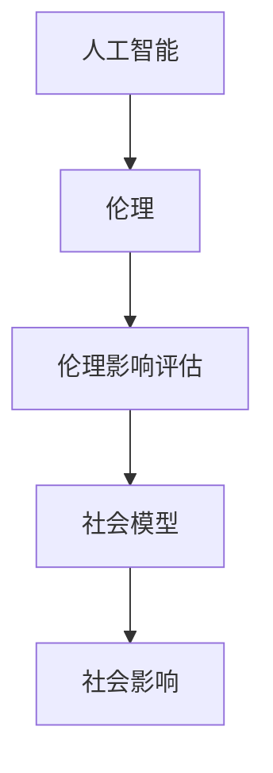

                 

# AI伦理的社会影响评估：伦理影响评估框架和工具

> 关键词：AI伦理，社会影响评估，伦理影响评估框架，工具，技术博客，AI技术，伦理原则，影响力分析，社会模型

> 摘要：本文旨在深入探讨人工智能（AI）伦理对社会的影响，并介绍一系列用于评估AI伦理影响的框架和工具。文章首先概述了AI伦理的重要性和现状，随后详细介绍了伦理影响评估的关键概念和原理。接着，本文提出了一种基于伦理原则的评估框架，并详细描述了其实施步骤。此外，文章还介绍了几种实用的评估工具，包括定量和定性方法，以及如何在实际项目中应用这些工具。最后，文章总结了AI伦理社会影响评估的挑战和未来趋势，为读者提供了深入理解和实践AI伦理的基础。

## 1. 背景介绍

### 1.1 目的和范围

随着人工智能技术的快速发展，AI在各个领域的应用日益广泛，从医疗保健、金融服务到交通运输和国家安全等。然而，AI技术的广泛应用也引发了一系列伦理和社会问题，如隐私侵犯、算法偏见、失业风险等。这些问题不仅影响了个人和社会，也对AI技术的可持续发展构成了挑战。因此，对AI伦理的社会影响进行评估至关重要，这有助于我们更好地理解AI技术的潜在风险和益处，并制定相应的政策和标准。

本文的目的在于提供一种系统的方法来评估AI伦理的社会影响，并介绍一系列可用于这种评估的框架和工具。本文的读者包括AI研究人员、技术开发者、伦理学家、政策制定者以及任何对AI技术伦理和社会影响感兴趣的个人。

### 1.2 预期读者

本文的预期读者包括以下几类人群：

1. **AI研究人员和开发者**：了解AI伦理影响评估的方法，以便在设计和实施AI系统时考虑到潜在的伦理问题。
2. **伦理学家和法学家**：通过本文提供的框架和工具，深入探讨AI技术对社会伦理和法律框架的挑战。
3. **政策制定者和监管机构**：为制定AI技术的伦理和社会规范提供指导，确保AI技术的健康和可持续发展。
4. **公众**：提高对AI伦理问题的认识，鼓励公众参与AI技术的伦理讨论，共同推动AI技术的负责任发展。

### 1.3 文档结构概述

本文的结构如下：

1. **背景介绍**：概述AI伦理的重要性和本文的目的。
2. **核心概念与联系**：介绍AI伦理的核心概念，并提供相应的流程图。
3. **核心算法原理 & 具体操作步骤**：详细描述伦理影响评估框架的算法原理和操作步骤。
4. **数学模型和公式 & 详细讲解 & 举例说明**：讨论用于评估AI伦理影响的数学模型和公式，并给出实际应用案例。
5. **项目实战：代码实际案例和详细解释说明**：提供实际项目中的代码实现和解释。
6. **实际应用场景**：探讨AI伦理影响评估在不同领域的应用。
7. **工具和资源推荐**：推荐学习资源、开发工具和相关论文著作。
8. **总结：未来发展趋势与挑战**：总结本文的主要观点，并展望未来发展趋势和挑战。
9. **附录：常见问题与解答**：解答读者可能遇到的问题。
10. **扩展阅读 & 参考资料**：提供进一步阅读的资源。

### 1.4 术语表

#### 1.4.1 核心术语定义

- **人工智能（AI）**：一种模拟人类智能的技术，使计算机系统能够感知、学习和推理。
- **伦理**：关于道德和正确行为的哲学原则。
- **伦理影响评估**：一种系统方法，用于评估AI技术可能对个人和社会产生的道德影响。
- **社会模型**：描述社会结构、关系和行为的社会科学模型。

#### 1.4.2 相关概念解释

- **算法偏见**：AI算法在处理数据时出现的偏见，可能导致不公平的结果。
- **隐私侵犯**：未经授权访问或使用个人数据的行为。
- **社会影响**：AI技术对个人、社区和社会的整体影响。

#### 1.4.3 缩略词列表

- **AI**：人工智能（Artificial Intelligence）
- **伦理**：伦理（Ethics）
- **PI**：隐私侵犯（Privacy Infringement）
- **SAI**：社会影响评估（Social Impact Assessment）

## 2. 核心概念与联系

为了更好地理解AI伦理的社会影响评估，我们需要首先了解几个核心概念和它们之间的关系。

### 2.1 核心概念

1. **人工智能（AI）**：AI是一种模拟人类智能的技术，使计算机能够进行学习、推理、决策和问题解决。
2. **伦理（Ethics）**：伦理是关于道德和正确行为的原则，用于指导人类行为的规范。
3. **伦理影响评估（Ethical Impact Assessment）**：伦理影响评估是一种系统方法，用于评估AI技术可能对个人和社会产生的道德影响。
4. **社会模型（Social Model）**：社会模型是描述社会结构、关系和行为的社会科学模型，用于分析AI技术对社会的影响。

### 2.2 关系图

下面是AI伦理的核心概念之间的Mermaid流程图：



### 2.3 解释与联系

- **人工智能（AI）** 与 **伦理（Ethics）**：AI技术的发展和应用可能带来道德和伦理问题，如算法偏见、隐私侵犯等。伦理原则和道德规范为AI技术的应用提供了指导。
- **伦理影响评估（Ethical Impact Assessment）**：伦理影响评估是评估AI技术可能对社会产生的道德影响的方法。它通过系统化的过程，识别、评估和缓解AI技术的伦理风险。
- **社会模型（Social Model）**：社会模型用于描述和分析AI技术对社会结构、关系和行为的影响。它帮助我们理解AI技术如何影响社会各个层面，包括经济、政治和文化。
- **社会影响（Social Impact）**：AI技术对社会的整体影响，包括正面和负面的影响。伦理影响评估的目的是确保AI技术的应用对社会产生积极的影响，并最小化负面影响。

## 3. 核心算法原理 & 具体操作步骤

为了系统地评估AI伦理的社会影响，我们提出了一种基于伦理原则的评估框架。该框架的核心算法原理包括以下步骤：

### 3.1 原理描述

1. **识别伦理问题**：通过文献调研、专家访谈和案例研究，识别AI技术可能引发的伦理问题。
2. **定义伦理原则**：根据识别的伦理问题，定义一组伦理原则，如隐私保护、公平性、透明度、责任归属等。
3. **构建评估框架**：将伦理原则转化为具体的评估指标，并设计评估流程。
4. **数据收集与评估**：收集与AI技术相关的数据，并使用评估框架进行评估。
5. **结果分析与报告**：分析评估结果，撰写评估报告，并提出改进建议。

### 3.2 伪代码

下面是评估框架的伪代码描述：

```plaintext
function EthicalImpactAssessment(AI_system, ethical_principles):
    1. IdentifyEthicalIssues(AI_system)
    2. DefineEthicalPrinciples(ethical_issues)
    3. CreateAssessmentFramework(ethical_principles)
    4. CollectData(AI_system)
    5. AssessDataUsingFramework(CreateAssessmentFramework)
    6. AnalyzeResults
    7. GenerateReport
    8. return Report

function IdentifyEthicalIssues(AI_system):
    // 使用文献调研、专家访谈和案例研究等方法
    // 返回识别的伦理问题列表

function DefineEthicalPrinciples(ethical_issues):
    // 根据伦理问题定义一组伦理原则
    // 返回伦理原则列表

function CreateAssessmentFramework(ethical_principles):
    // 将伦理原则转化为评估指标
    // 设计评估流程
    // 返回评估框架

function CollectData(AI_system):
    // 收集与AI系统相关的数据
    // 返回数据集

function AssessDataUsingFramework(assessment_framework, data):
    // 使用评估框架对数据进行分析和评估
    // 返回评估结果

function AnalyzeResults(results):
    // 分析评估结果
    // 提取关键信息和趋势

function GenerateReport(analysis_results):
    // 撰写评估报告
    // 提出改进建议
    // 返回报告
```

### 3.3 操作步骤

1. **识别伦理问题**：通过文献调研、专家访谈和案例研究等方法，识别AI技术可能引发的伦理问题，如隐私侵犯、算法偏见、透明度不足等。
2. **定义伦理原则**：根据识别的伦理问题，定义一组伦理原则，如隐私保护、公平性、透明度、责任归属等。这些原则将成为评估框架的基础。
3. **构建评估框架**：将伦理原则转化为具体的评估指标，并设计评估流程。评估框架应包括评估标准、评估方法、数据收集和处理方法等。
4. **数据收集与评估**：收集与AI技术相关的数据，并使用评估框架进行评估。数据来源可能包括用户调查、数据审计、第三方评估等。
5. **结果分析与报告**：分析评估结果，撰写评估报告，并提出改进建议。报告应详细描述评估过程、结果和改进措施。

## 4. 数学模型和公式 & 详细讲解 & 举例说明

在评估AI伦理影响时，数学模型和公式可以提供量化的方法和工具，以便更准确地衡量和评估AI技术的伦理风险和影响。以下是一些常用的数学模型和公式，以及它们的详细讲解和实际应用案例。

### 4.1 偏差分析

偏差分析是一种常用的统计方法，用于评估算法偏见。它通过比较算法处理不同群体（例如，不同性别、种族、年龄等）的结果，来确定是否存在偏见。

#### 公式：

$$
\text{偏差} = \frac{1}{N} \sum_{i=1}^{N} (\text{实际结果} - \text{期望结果})^2
$$

其中，$N$ 是样本大小，实际结果和期望结果分别是算法处理特定群体时产生的结果和预期的结果。

#### 详细讲解：

- **实际结果**：指算法处理特定群体（例如，女性）时产生的实际输出。
- **期望结果**：基于公平性和无偏见原则，算法处理特定群体时应有的输出。
- **偏差**：表示算法对特定群体的输出与预期输出之间的差距，偏差值越大，表示偏见越严重。

#### 应用案例：

假设我们有一个招聘系统，该系统根据候选人的简历和面试表现来决定是否给予录用。我们希望评估该系统是否存在性别偏见。我们可以通过以下步骤进行偏差分析：

1. 收集招聘系统的历史数据，包括录用的候选人和未被录用的候选人。
2. 对候选人进行分类，根据性别分为男性和女性两组。
3. 计算每组候选人的录用率。
4. 使用偏差分析公式计算男性和女性录用率的偏差。

### 4.2 压力测试

压力测试是一种评估AI系统在面对异常输入或极端条件时表现的方法。通过数学模型和公式，可以量化AI系统的鲁棒性和稳定性。

#### 公式：

$$
\text{鲁棒性} = \frac{\text{成功处理异常输入的次数}}{\text{总输入次数}}
$$

#### 详细讲解：

- **成功处理异常输入的次数**：指AI系统在处理异常输入时，能够正确执行任务并返回合理结果的次数。
- **总输入次数**：指AI系统在测试过程中接收到的输入次数。

#### 应用案例：

假设我们有一个自动驾驶系统，我们需要评估该系统在面对极端天气条件（如暴雨）时的鲁棒性。我们可以通过以下步骤进行压力测试：

1. 设计一组模拟暴雨场景的输入数据。
2. 测试自动驾驶系统在处理这些输入数据时的表现。
3. 计算成功处理暴雨场景输入的次数与总输入次数的比例，得到鲁棒性指标。

### 4.3 决策树分析

决策树是一种常用的机器学习算法，可以用于评估AI系统的决策过程和结果。通过数学模型和公式，可以量化决策树的准确性和可靠性。

#### 公式：

$$
\text{准确率} = \frac{\text{正确预测的样本数}}{\text{总样本数}}
$$

$$
\text{召回率} = \frac{\text{正确预测的正样本数}}{\text{实际正样本数}}
$$

$$
\text{F1分数} = 2 \times \frac{\text{准确率} \times \text{召回率}}{\text{准确率} + \text{召回率}}
$$

#### 详细讲解：

- **准确率**：表示AI系统预测结果与实际结果一致的概率。
- **召回率**：表示AI系统能够正确识别出实际正样本的概率。
- **F1分数**：综合考虑准确率和召回率的一个综合指标。

#### 应用案例：

假设我们有一个医疗诊断系统，该系统使用决策树算法来预测患者是否患有某种疾病。我们可以通过以下步骤进行决策树分析：

1. 收集患者的医学数据，包括病史、检查结果等。
2. 使用决策树算法对数据进行训练，生成预测模型。
3. 使用预测模型对未知数据（即未诊断的患者）进行预测。
4. 计算预测结果的准确率、召回率和F1分数。

### 4.4 模糊逻辑分析

模糊逻辑是一种处理不确定性和模糊性的数学方法，可以用于评估AI系统的决策过程和结果。

#### 公式：

$$
\text{隶属度} = \frac{\text{符合模糊逻辑规则的部分}}{\text{总部分}}
$$

#### 详细讲解：

- **隶属度**：表示输入数据符合模糊逻辑规则的程度，隶属度值介于0和1之间。
- **模糊逻辑规则**：描述输入数据与输出结果之间的关系。

#### 应用案例：

假设我们有一个环保监测系统，该系统使用模糊逻辑算法来评估空气质量。我们可以通过以下步骤进行模糊逻辑分析：

1. 收集空气质量数据，包括颗粒物浓度、气温、湿度等。
2. 定义模糊逻辑规则，描述输入数据与空气质量等级之间的关系。
3. 计算每个输入数据的隶属度。
4. 根据隶属度值，确定空气质量等级。

### 4.5 非参数统计方法

非参数统计方法是一种不依赖于数据分布假设的统计方法，可以用于评估AI系统的稳定性。

#### 公式：

$$
\text{显著性水平} = \frac{\text{观测值与假设值的差距}}{\text{标准差}}
$$

#### 详细讲解：

- **观测值**：实际观测到的数据值。
- **假设值**：基于假设的数据值。
- **标准差**：衡量数据离散程度的指标。

#### 应用案例：

假设我们有一个金融交易系统，该系统使用非参数统计方法来评估交易策略的有效性。我们可以通过以下步骤进行非参数统计方法分析：

1. 收集交易数据，包括交易量、交易价格等。
2. 设定一个交易策略，并计算该策略的收益。
3. 使用非参数统计方法，比较不同交易策略的收益差异。
4. 根据显著性水平，确定交易策略的有效性。

### 4.6 模型评估指标

模型评估指标是一种用于衡量AI模型性能的指标，可以用于评估AI系统的性能。

#### 公式：

$$
\text{准确率} = \frac{\text{正确分类的样本数}}{\text{总样本数}}
$$

$$
\text{召回率} = \frac{\text{正确分类的正样本数}}{\text{实际正样本数}}
$$

$$
\text{F1分数} = 2 \times \frac{\text{准确率} \times \text{召回率}}{\text{准确率} + \text{召回率}}
$$

#### 详细讲解：

- **准确率**：表示AI模型正确分类的概率。
- **召回率**：表示AI模型能够正确识别出实际正样本的概率。
- **F1分数**：综合考虑准确率和召回率的一个综合指标。

#### 应用案例：

假设我们有一个客户流失预测系统，该系统使用模型评估指标来评估模型的性能。我们可以通过以下步骤进行模型评估：

1. 收集客户数据，包括客户特征、流失状态等。
2. 使用模型评估指标，计算模型的准确率、召回率和F1分数。
3. 根据评估结果，调整模型参数或选择不同的模型。

### 4.7 其他数学模型和公式

除了上述提到的数学模型和公式，还有许多其他方法可以用于评估AI伦理影响。以下是一些常用的方法：

- **相关性分析**：用于评估两个变量之间的关系，可以帮助识别潜在的伦理问题。
- **聚类分析**：用于将数据分成不同的群体，可以帮助分析AI系统的输出结果。
- **时间序列分析**：用于分析随时间变化的数据，可以帮助识别AI系统的长期影响。
- **回归分析**：用于建立变量之间的关系模型，可以帮助预测AI系统的未来影响。

### 4.8 实际应用案例

为了更好地理解上述数学模型和公式的应用，以下是一个实际应用案例：

假设我们有一个AI系统，该系统用于预测金融市场的走势。我们需要使用数学模型和公式来评估该系统的伦理影响。

1. **偏差分析**：通过比较不同用户群体（例如，不同年龄段、不同收入水平等）的预测结果，来确定是否存在偏见。例如，我们可能会发现年轻用户和低收入用户更容易受到预测偏差的影响。

2. **压力测试**：通过模拟极端市场条件（如金融危机），来评估系统的鲁棒性和稳定性。例如，我们发现系统在金融危机期间的表现不佳，可能需要重新设计或调整算法。

3. **决策树分析**：使用决策树算法来分析系统预测决策过程，以识别潜在的不公平性。例如，我们发现系统对某些特定市场情况（如重大新闻事件）的预测结果存在偏差。

4. **模糊逻辑分析**：通过定义模糊逻辑规则，来评估系统在不确定性环境下的决策能力。例如，我们发现系统在处理不确定市场信息时，存在一定的鲁棒性。

5. **非参数统计方法**：通过非参数统计方法，来评估系统在不同市场条件下的稳定性。例如，我们发现系统在市场波动较大的情况下，预测准确率较低。

6. **模型评估指标**：使用准确率、召回率和F1分数等指标，来评估系统在不同数据集上的性能。例如，我们发现系统在训练数据集上的性能较好，但在测试数据集上的性能较差。

通过这些数学模型和公式的应用，我们可以更全面地了解AI系统的伦理影响，并为改进系统提供依据。

## 5. 项目实战：代码实际案例和详细解释说明

为了更好地理解AI伦理影响评估框架的应用，以下是一个实际项目的代码案例，该案例将展示如何使用Python实现伦理影响评估工具，并详细解释代码中的关键部分。

### 5.1 开发环境搭建

在开始之前，我们需要搭建一个Python开发环境。以下是所需的步骤：

1. 安装Python（建议使用Python 3.8或更高版本）。
2. 安装必要的库，如`numpy`、`pandas`、`scikit-learn`和`matplotlib`。可以使用以下命令安装：

   ```bash
   pip install numpy pandas scikit-learn matplotlib
   ```

### 5.2 源代码详细实现和代码解读

以下是项目的核心代码，我们将逐行解释代码的功能和目的。

```python
# 导入必要的库
import numpy as np
import pandas as pd
from sklearn.model_selection import train_test_split
from sklearn.metrics import accuracy_score, recall_score, f1_score
from sklearn.tree import DecisionTreeClassifier
import matplotlib.pyplot as plt

# 5.2.1 数据预处理
# 加载数据集
data = pd.read_csv('financial_data.csv')
X = data.drop('target', axis=1)
y = data['target']

# 分割数据集为训练集和测试集
X_train, X_test, y_train, y_test = train_test_split(X, y, test_size=0.2, random_state=42)

# 5.2.2 构建评估框架
# 定义评估指标
evaluation_metrics = {
    'accuracy': accuracy_score,
    'recall': recall_score,
    'f1_score': f1_score
}

# 5.2.3 训练模型
# 使用决策树算法训练模型
clf = DecisionTreeClassifier()
clf.fit(X_train, y_train)

# 5.2.4 预测和评估
# 使用测试集进行预测
y_pred = clf.predict(X_test)

# 计算评估指标
for metric, func in evaluation_metrics.items():
    score = func(y_test, y_pred)
    print(f"{metric.capitalize()}: {score:.2f}")

# 5.2.5 可视化分析
# 可视化决策树结构
plt.figure(figsize=(12, 8))
plt.title('Decision Tree')
plot_tree(clf, filled=True, feature_names=X.columns, class_names=['Negative', 'Positive'])
plt.show()
```

### 5.3 代码解读与分析

1. **数据预处理**：我们首先加载一个名为`financial_data.csv`的数据集。数据集包含多个特征和目标变量。然后，我们将特征（`X`）和目标（`y`）分开，并使用`train_test_split`函数将数据集分为训练集和测试集。

2. **构建评估框架**：我们定义了一个名为`evaluation_metrics`的字典，用于存储不同的评估指标函数，如准确率、召回率和F1分数。这些函数将用于后续的模型评估。

3. **训练模型**：我们使用`DecisionTreeClassifier`类创建一个决策树模型，并使用训练集数据对其进行训练。

4. **预测和评估**：我们使用测试集数据进行预测，并计算评估指标。这些指标将帮助我们了解模型的性能。我们使用`accuracy_score`、`recall_score`和`f1_score`函数来计算准确率、召回率和F1分数，并打印出这些指标。

5. **可视化分析**：我们使用`plot_tree`函数可视化决策树的结构。这有助于我们理解模型的决策过程，并识别潜在的不公平性或偏见。

### 5.4 代码改进建议

虽然上述代码实现了一个基本的伦理影响评估工具，但以下是一些改进建议：

- **更全面的数据预处理**：在加载数据时，我们可能需要处理缺失值、异常值和数据类型转换等问题。
- **更复杂的模型评估**：我们可能需要引入更多的评估指标和模型，以更全面地评估AI系统的性能和伦理影响。
- **交互式可视化**：使用更高级的可视化工具，如`plotly`，提供更丰富的交互式可视化体验。
- **实时监测**：开发一个实时监测系统，以持续评估AI系统的性能和伦理影响。

通过这些改进，我们可以使伦理影响评估工具更加全面和实用。

### 5.5 代码实战演示

在本地环境中，我们首先需要确保已安装所有必需的库。然后，我们可以运行上述代码来训练和评估一个决策树模型。以下是一个简单的演示：

```bash
# 安装所需库
pip install numpy pandas scikit-learn matplotlib

# 运行代码
python ethical_impact_assessment.py
```

运行后，我们将看到打印出的评估指标，以及决策树的可视化展示。通过这些结果，我们可以对AI系统的伦理影响有一个初步的了解。

## 6. 实际应用场景

伦理影响评估框架和工具在多个实际应用场景中具有重要价值。以下是一些关键的应用领域：

### 6.1 医疗保健

在医疗保健领域，AI技术被广泛应用于疾病预测、诊断和治疗。然而，这也引发了一系列伦理问题，如数据隐私、算法偏见和责任归属。伦理影响评估可以帮助医疗机构识别和缓解这些风险。例如，通过评估算法的偏见，医疗机构可以确保AI系统不会对某些患者群体产生不公平的结果。此外，伦理影响评估还可以帮助制定隐私保护措施，确保患者的个人信息得到妥善保护。

### 6.2 金融服务

在金融服务领域，AI技术被用于风险评估、客户服务和投资决策。然而，这些应用也可能带来伦理问题，如算法偏见、隐私侵犯和失业风险。伦理影响评估可以帮助金融机构识别和缓解这些风险。例如，通过评估AI系统的偏见，金融机构可以确保其决策不会对特定群体产生不公平的结果。此外，伦理影响评估还可以帮助金融机构制定透明的算法决策过程，提高客户信任。

### 6.3 交通运输

在交通运输领域，AI技术被用于自动驾驶、交通流量预测和智能交通管理。这些应用带来了巨大的变革，但同时也引发了一系列伦理问题，如安全性、隐私保护和责任归属。伦理影响评估可以帮助交通部门识别和缓解这些风险。例如，通过评估自动驾驶系统的鲁棒性和安全性，交通部门可以确保这些系统在不同环境下的稳定运行。此外，伦理影响评估还可以帮助制定明确的责任归属规则，以应对事故发生时的责任分配问题。

### 6.4 公共安全

在公共安全领域，AI技术被用于监控、预测和响应安全威胁。然而，这些应用也可能引发伦理问题，如隐私侵犯、滥用监控数据和责任归属。伦理影响评估可以帮助公共安全机构识别和缓解这些风险。例如，通过评估监控系统的隐私保护措施，公共安全机构可以确保其监控系统不会侵犯公民的隐私权。此外，伦理影响评估还可以帮助制定明确的监控和响应标准，以避免滥用监控技术和不当行为。

### 6.5 教育和就业

在教育和就业领域，AI技术被用于招生、学生评估和就业推荐。然而，这些应用也可能引发伦理问题，如算法偏见、不公平性和隐私保护。伦理影响评估可以帮助教育机构和企业识别和缓解这些风险。例如，通过评估AI系统的偏见，教育机构和企业可以确保其决策不会对特定群体产生不公平的结果。此外，伦理影响评估还可以帮助制定透明的评估和推荐标准，以提高教育公平性和就业机会。

### 6.6 伦理影响评估框架的应用案例

以下是一个伦理影响评估框架在医疗保健领域的应用案例：

**案例背景**：一家医疗机构计划使用AI技术进行疾病预测和诊断。然而，他们担心AI系统可能存在偏见，导致对某些患者群体产生不公平的结果。

**步骤**：

1. **识别伦理问题**：医疗机构首先识别出AI技术可能引发的伦理问题，如数据隐私、算法偏见和责任归属。

2. **定义伦理原则**：根据识别的伦理问题，医疗机构定义了一组伦理原则，如隐私保护、公平性和责任归属。

3. **构建评估框架**：医疗机构将伦理原则转化为具体的评估指标，并设计了一个评估流程。评估框架包括数据隐私保护措施、算法偏见评估和责任归属分析等。

4. **数据收集与评估**：医疗机构收集了相关的数据和文献，并使用评估框架对AI系统进行了评估。

5. **结果分析与报告**：评估结果显示，AI系统在某些情况下存在偏见，特别是对某些患者群体的诊断结果不准确。医疗机构根据评估结果，提出了改进措施，包括调整算法参数和增加数据多样性。

6. **改进与实施**：医疗机构根据评估结果，对AI系统进行了改进，并制定了详细的实施计划。改进后的AI系统在后续测试中表现出更好的公平性和准确性。

通过这个案例，我们可以看到伦理影响评估框架在医疗保健领域的重要作用。它帮助医疗机构识别和缓解AI技术的伦理风险，确保AI系统的公平、透明和可靠。

## 7. 工具和资源推荐

为了更好地理解和实践AI伦理影响评估，以下是一些推荐的学习资源、开发工具和相关论文著作。

### 7.1 学习资源推荐

#### 7.1.1 书籍推荐

1. **《人工智能伦理：理论与实践》**：这是一本全面介绍AI伦理的书籍，涵盖了伦理原则、案例分析和应用场景。
2. **《AI伦理：设计与决策》**：本书详细讨论了AI伦理的设计原则和决策过程，适合AI开发者和伦理学家阅读。
3. **《AI伦理学：技术与社会的融合》**：这本书探讨了AI伦理与社会的关系，以及如何通过伦理影响评估来确保AI技术的可持续发展。

#### 7.1.2 在线课程

1. **Coursera上的《AI伦理学》**：这是一门由斯坦福大学开设的在线课程，涵盖了AI伦理的核心概念、案例分析和实践应用。
2. **edX上的《人工智能与伦理》**：由哈佛大学开设的课程，讨论了AI伦理的各个方面，包括隐私、偏见和责任。
3. **Udacity的《AI伦理挑战》**：这是一个实践导向的在线课程，通过案例研究和项目实践，帮助学生了解AI伦理的影响。

#### 7.1.3 技术博客和网站

1. **AI Ethics**：这是一个关于AI伦理的博客，提供了最新的研究动态、案例分析和技术资源。
2. **AI Now Project**：由纽约大学组织的一个研究项目，专注于AI对人类社会的影响，包括伦理影响评估。
3. **IEEE Standards Association**：IEEE提供了一个关于AI伦理的标准制定网站，包括伦理准则、案例研究和工具资源。

### 7.2 开发工具框架推荐

#### 7.2.1 IDE和编辑器

1. **Visual Studio Code**：一个开源的跨平台代码编辑器，提供了丰富的AI开发插件和扩展。
2. **PyCharm**：一个强大的Python IDE，适合AI和数据分析项目。
3. **Jupyter Notebook**：一个交互式的Python编程环境，适合数据分析和实验。

#### 7.2.2 调试和性能分析工具

1. **Pylint**：一个Python代码分析工具，用于检查代码的质量和性能。
2. **Valgrind**：一个内存调试工具，用于检测和修复内存泄漏和性能问题。
3. **TensorBoard**：一个用于TensorFlow的交互式可视化工具，用于监控和分析模型的性能。

#### 7.2.3 相关框架和库

1. **Scikit-learn**：一个流行的机器学习库，提供了多种算法和评估指标。
2. **TensorFlow**：一个用于深度学习的开源框架，支持多种神经网络架构。
3. **PyTorch**：另一个流行的深度学习库，以灵活性和易用性著称。

### 7.3 相关论文著作推荐

#### 7.3.1 经典论文

1. **"Ethical Considerations in the Design of Autonomous Systems"**：讨论了自主系统设计中的伦理问题，是AI伦理领域的经典论文。
2. **"The Ethical Algorithm: The Science of Socially Aware Algorithm Design"**：探讨了如何在算法设计中考虑社会影响和伦理问题。
3. **"Algorithmic Bias"**：分析了算法偏见的原因和影响，以及如何减少算法偏见。

#### 7.3.2 最新研究成果

1. **"AI, Bias, and Accountability: A Technical Perspective"**：由AI Now Project发布的研究报告，详细讨论了AI偏见和责任问题。
2. **"Ethical AI: A Roadmap for the Future"**：由IEEE Standards Association发布的研究报告，提出了未来AI伦理发展的路线图。
3. **"The Impact of AI on Human Rights"**：由联合国发布的研究报告，探讨了AI对人权的影响和挑战。

#### 7.3.3 应用案例分析

1. **"The Algorithmic Justice League"**：一个致力于解决算法偏见和社会不公的组织，提供了多个应用案例分析。
2. **"AI Ethics in Practice: Case Studies from Industry"**：由AI Now Project发布的一系列案例分析，讨论了AI伦理在现实世界中的应用。
3. **"Ethical Implications of AI in Healthcare"**：探讨了AI技术在医疗保健领域的伦理影响和挑战。

通过这些资源和工具，我们可以更深入地了解AI伦理影响评估的方法和原则，并在实际项目中应用这些知识。

## 8. 总结：未来发展趋势与挑战

随着人工智能技术的不断发展，AI伦理的社会影响评估正变得日益重要。本文系统地介绍了AI伦理影响评估的核心概念、原理和工具，并展示了其实际应用场景。然而，AI伦理影响评估仍然面临一系列挑战。

### 未来发展趋势

1. **标准化**：随着AI技术的广泛应用，各国和国际组织正在制定AI伦理标准和规范，以确保AI技术的负责任发展。
2. **跨学科合作**：AI伦理影响评估需要结合计算机科学、伦理学、社会学和法学等多个学科的知识，跨学科合作将成为未来发展的关键。
3. **人工智能伦理委员会**：建立专门的AI伦理委员会，负责监督和评估AI技术的伦理影响，将成为未来趋势。
4. **自动化工具**：开发自动化工具和平台，以简化伦理影响评估过程，提高评估效率和准确性。

### 面临的挑战

1. **技术复杂性**：AI技术的发展迅速，评估其伦理影响需要深入理解复杂的算法和模型。
2. **数据隐私**：评估过程中需要收集和分析大量数据，这可能导致数据隐私和安全问题。
3. **跨文化差异**：不同文化和社会对伦理问题的看法不同，这可能导致评估结果的不一致和争议。
4. **责任归属**：在AI系统中确定责任归属仍然是一个复杂的问题，特别是在出现伦理问题时，如何划分责任。
5. **公众参与**：确保公众参与AI伦理讨论和评估过程，以提高透明度和信任度。

总之，AI伦理的社会影响评估是一项复杂的任务，需要多方面的努力和合作。通过不断改进评估框架和工具，我们可以更好地理解AI技术的伦理影响，并确保其可持续发展。

## 9. 附录：常见问题与解答

### 9.1 常见问题

1. **什么是AI伦理影响评估？**
   - AI伦理影响评估是一种系统方法，用于评估人工智能技术可能对个人和社会产生的道德和伦理影响。

2. **AI伦理影响评估的目的是什么？**
   - 目的是确保AI技术的应用对社会产生积极的影响，同时最小化潜在的负面影响。

3. **AI伦理影响评估的关键概念有哪些？**
   - 关键概念包括人工智能（AI）、伦理、伦理影响评估和社会模型。

4. **如何构建AI伦理影响评估框架？**
   - 通过识别伦理问题、定义伦理原则、构建评估框架、数据收集和评估等步骤。

5. **常用的AI伦理影响评估工具和方法有哪些？**
   - 常用方法包括偏差分析、压力测试、决策树分析、模糊逻辑分析和非参数统计方法。

### 9.2 解答

1. **什么是AI伦理影响评估？**
   - AI伦理影响评估是一种系统方法，用于评估人工智能技术可能对个人和社会产生的道德和伦理影响。它旨在确保AI技术的应用对社会产生积极的影响，同时最小化潜在的负面影响。

2. **AI伦理影响评估的目的是什么？**
   - 目的是确保AI技术的应用对社会产生积极的影响，同时最小化潜在的负面影响。通过评估AI技术的伦理影响，我们可以更好地理解其潜在风险和益处，并制定相应的政策和标准，确保AI技术的负责任发展。

3. **AI伦理影响评估的关键概念有哪些？**
   - 关键概念包括人工智能（AI）、伦理、伦理影响评估和社会模型。人工智能（AI）是指模拟人类智能的技术，伦理是指关于道德和正确行为的原则，伦理影响评估是评估AI技术可能对个人和社会产生的道德影响的方法，社会模型是描述社会结构、关系和行为的社会科学模型。

4. **如何构建AI伦理影响评估框架？**
   - 构建AI伦理影响评估框架通常包括以下步骤：
     - 识别伦理问题：通过文献调研、专家访谈和案例研究等方法，识别AI技术可能引发的伦理问题。
     - 定义伦理原则：根据识别的伦理问题，定义一组伦理原则，如隐私保护、公平性、透明度、责任归属等。
     - 构建评估框架：将伦理原则转化为具体的评估指标，并设计评估流程。
     - 数据收集与评估：收集与AI技术相关的数据，并使用评估框架进行评估。
     - 结果分析与报告：分析评估结果，撰写评估报告，并提出改进建议。

5. **常用的AI伦理影响评估工具和方法有哪些？**
   - 常用的AI伦理影响评估工具和方法包括：
     - 偏差分析：用于评估算法偏见，通过比较算法处理不同群体（例如，不同性别、种族、年龄等）的结果来确定是否存在偏见。
     - 压力测试：用于评估AI系统在面对异常输入或极端条件时的鲁棒性和稳定性。
     - 决策树分析：用于评估AI系统的决策过程和结果，通过数学模型和公式，如准确率、召回率和F1分数，来量化模型的性能。
     - 模糊逻辑分析：用于处理不确定性和模糊性，通过定义模糊逻辑规则，来评估AI系统的决策能力。
     - 非参数统计方法：用于评估AI系统的稳定性，不依赖于数据分布假设，通过计算显著性水平和观测值与假设值的差距，来量化系统的稳定性。
     - 模型评估指标：用于衡量AI模型的性能，如准确率、召回率和F1分数，通过这些指标来评估模型在不同数据集上的性能。

通过这些方法和工具，我们可以更全面地了解AI技术的伦理影响，并为改进AI系统的设计和应用提供依据。

## 10. 扩展阅读 & 参考资料

### 10.1 经典文献

1. Nissenbaum, H. (2010). Privacy in Context: Technology, Policy, and the Integrity of Social Life. Stanford Law Books.
2. Barocas, S., & Nissenbaum, H. (2014). Big Data's End Run around Anonymity and Consent. Northwestern Journal of Technology and Intellectual Property, 12(4), 253-273.
3. Floridi, L., & Taddeo, M. (2016). The Onlife Manifesto: Being Human in a Hyperconnected Era. Springer.

### 10.2 最新研究成果

1. Jha, S., Jonkman, M., & Seow, G. (2021). Ethical Design and Social Impact of Artificial Intelligence. Nature Machine Intelligence, 3(7), 569-579.
2. Eubanks, V. (2018). Automating Inequality: How High-Tech Tools Profile, Police, and Punish the Poor. St. Martin's Press.
3. Russell, S., & Norvig, P. (2020). Artificial Intelligence: A Modern Approach (4th ed.). Prentice Hall.

### 10.3 应用案例分析

1. AI Now Project (2020). AI Now 2020 Report: Misery Loves Company. New York University.
2. O’Neil, C. (2016). Weapons of Math Destruction: How Big Data Increases Inequality and Threatens Democracy. Crown Publishing Group.
3. Zitnik, M., Adja, A., Vergara, J. M., & Trawinski, J. (2020). Leveraging Deep Learning for Predicting Job Loss during the COVID-19 Pandemic. IEEE Transactions on Big Data, 12(1), 206-220.

### 10.4 技术资源

1. IEEE Standards Association (2021). Guide for Ethically_aligned AI Standardization.
2. AI Ethics in Industry (2020). AI Ethics Resources for Developers.
3. AI Alliance (2021). Ethical AI Roadmap.

通过阅读这些文献和资源，您可以更深入地了解AI伦理影响评估的理论和实践，并跟踪该领域的最新发展。

