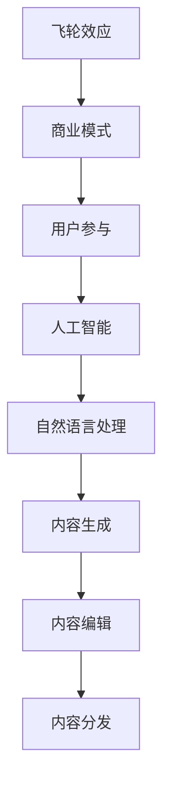

                 

# AI出版业的壁垒：飞轮效应之关键

> **关键词：** AI出版、内容生成、飞轮效应、商业模式、技术创新

> **摘要：** 本文章探讨了人工智能在出版业中的应用及其带来的变革。通过对AI出版业核心壁垒的分析，本文揭示了飞轮效应在此领域的关键作用。文章旨在为读者提供一个深入理解AI出版业现状及其未来发展的视角。

## 1. 背景介绍

### 1.1 目的和范围

本文旨在探讨人工智能（AI）在出版业中的应用，尤其是AI生成内容在出版流程中的核心地位。我们将重点关注AI出版业所面临的主要挑战，以及如何利用飞轮效应来打破这些壁垒，从而实现出版业的可持续发展。

### 1.2 预期读者

本文章适合对出版业和人工智能技术有一定了解的技术爱好者、出版行业从业者、以及希望了解AI出版未来发展趋势的决策者。无论你是AI领域的初学者还是资深专家，本文都希望为你提供新的视角和洞见。

### 1.3 文档结构概述

本文结构如下：

1. **背景介绍**：介绍文章的目的、预期读者以及文档结构。
2. **核心概念与联系**：介绍与AI出版相关的核心概念，并使用Mermaid流程图展示其架构。
3. **核心算法原理 & 具体操作步骤**：详细讲解AI内容生成的核心算法原理和具体操作步骤。
4. **数学模型和公式 & 详细讲解 & 举例说明**：介绍与内容生成相关的数学模型和公式，并给出详细讲解和举例说明。
5. **项目实战：代码实际案例和详细解释说明**：通过实际项目案例展示代码实现过程，并进行详细解释和分析。
6. **实际应用场景**：探讨AI在出版业中的实际应用场景。
7. **工具和资源推荐**：推荐学习资源和开发工具。
8. **总结：未来发展趋势与挑战**：总结AI出版业的未来发展趋势和面临的挑战。
9. **附录：常见问题与解答**：解答读者可能关心的一些常见问题。
10. **扩展阅读 & 参考资料**：提供进一步阅读的推荐资源。

### 1.4 术语表

#### 1.4.1 核心术语定义

- **人工智能（AI）**：模拟人类智能的计算机系统。
- **自然语言处理（NLP）**：使计算机能够理解、解释和生成人类语言的技术。
- **内容生成**：利用算法自动生成文字、图像、音频等内容的过程。
- **飞轮效应**：一种商业模型，通过持续的正反馈循环，实现自我加速增长。
- **出版业**：涉及书籍、期刊、电子书等内容的创作、编辑、印刷和分发。

#### 1.4.2 相关概念解释

- **内容创作**：作者或创作者撰写或制作内容的过程。
- **内容编辑**：对原始内容进行修改、校对和格式调整，以提高其质量和可读性的过程。
- **内容分发**：将内容发布到各种渠道，使其可供用户访问和消费的过程。

#### 1.4.3 缩略词列表

- **AI**：人工智能
- **NLP**：自然语言处理
- **NLU**：自然语言理解
- **NMT**：神经机器翻译
- **UGC**：用户生成内容
- **SEO**：搜索引擎优化

## 2. 核心概念与联系

在探讨AI出版业的壁垒之前，我们需要了解一些核心概念及其相互关系。以下是一个Mermaid流程图，展示了这些核心概念：



### 2.1 人工智能（AI）

人工智能是使计算机系统具备人类智能的学科。它通过模拟人类思维过程，如学习、推理和解决问题，来实现智能行为。

### 2.2 自然语言处理（NLP）

自然语言处理是使计算机能够理解和生成人类语言的技术。它包括文本分析、语言理解和生成、语音识别等多个方面。

### 2.3 内容生成

内容生成是利用算法自动生成文字、图像、音频等内容的过程。在AI出版业中，内容生成是实现自动化、个性化和高效内容创作的关键。

### 2.4 内容编辑

内容编辑是对原始内容进行修改、校对和格式调整，以提高其质量和可读性的过程。AI技术在内容编辑中的应用，可以大大提高编辑效率，降低人力成本。

### 2.5 内容分发

内容分发是将内容发布到各种渠道，使其可供用户访问和消费的过程。AI技术可以帮助优化内容分发策略，提高内容曝光度和用户参与度。

### 2.6 飞轮效应

飞轮效应是一种商业模型，通过持续的正反馈循环，实现自我加速增长。在AI出版业中，飞轮效应可以表现为用户参与度提高、内容质量提升、商业模式优化的良性循环。

### 2.7 商业模式

商业模式是企业在特定市场中实现盈利的方式。在AI出版业中，利用飞轮效应优化商业模式，可以实现持续增长和竞争优势。

### 2.8 用户参与

用户参与是指用户在内容创作、编辑、分发等环节中的积极参与。在AI出版业中，用户参与可以促进内容质量的提升，增强用户黏性和忠诚度。

通过以上核心概念及其相互关系的介绍，我们可以更好地理解AI出版业的现状及其面临的挑战。接下来，我们将深入探讨AI内容生成的核心算法原理和具体操作步骤。

## 3. 核心算法原理 & 具体操作步骤

### 3.1 AI内容生成的核心算法原理

AI内容生成的核心算法主要基于深度学习和自然语言处理（NLP）。以下是一个简单的算法原理概述：

1. **数据预处理**：首先，我们需要对原始文本数据进行预处理，包括分词、去停用词、词性标注等。这一步骤的目的是将原始文本转换为计算机可以理解的格式。

2. **模型训练**：接下来，我们使用预处理的文本数据训练一个序列到序列（Seq2Seq）的深度学习模型，如长短期记忆网络（LSTM）或变换器（Transformer）。训练过程的目标是使模型能够学会从输入文本序列生成相应的输出文本序列。

3. **生成内容**：训练完成后，我们使用训练好的模型来生成新的文本内容。生成过程通常涉及以下步骤：
   - **初始化**：从输入序列中随机选择一个词作为生成过程的起始点。
   - **预测**：使用模型预测下一个可能的词，并将其添加到输出序列中。
   - **更新**：重复预测和更新的过程，直到生成一个完整的输出序列。

### 3.2 具体操作步骤

以下是一个简化的伪代码，用于说明AI内容生成的具体操作步骤：

```python
# 3.2.1 数据预处理
def preprocess_text(text):
    # 分词、去停用词、词性标注等操作
    return processed_text

# 3.2.2 模型训练
def train_model(preprocessed_text):
    # 使用LSTM或Transformer等模型训练
    model.fit(preprocessed_text)
    return model

# 3.2.3 生成内容
def generate_content(model, start_word):
    generated_text = [start_word]
    for _ in range(MAX_GEN_LENGTH):
        # 预测下一个词
        predicted_word = model.predict(generated_text[-1])
        # 更新生成内容
        generated_text.append(predicted_word)
    return ''.join(generated_text)

# 主函数
def main():
    # 加载原始文本数据
    original_text = load_data()
    # 预处理文本数据
    processed_text = preprocess_text(original_text)
    # 训练模型
    model = train_model(processed_text)
    # 生成内容
    generated_content = generate_content(model, start_word='The')
    print(generated_content)

# 执行主函数
main()
```

在这个伪代码中，我们首先加载原始文本数据，并进行预处理。然后，我们使用预处理后的文本数据训练一个深度学习模型。最后，我们使用训练好的模型生成新的文本内容。

### 3.3 算法原理讲解

在AI内容生成过程中，深度学习模型起到了关键作用。以下是对核心算法原理的详细讲解：

- **数据预处理**：预处理步骤的目的是将原始文本转换为计算机可以处理的格式。这一步骤通常包括分词、去停用词、词性标注等操作。这些操作有助于提高模型的训练效果和生成内容的可读性。
  
- **模型训练**：我们使用序列到序列（Seq2Seq）的深度学习模型来训练模型。这类模型可以学习从输入序列生成输出序列。在训练过程中，模型通过不断调整内部参数，以最小化预测误差。

- **生成内容**：生成内容的过程涉及初始化、预测和更新三个步骤。初始化阶段从输入序列中随机选择一个词作为起始点。预测阶段使用模型预测下一个可能的词，并将其添加到输出序列中。更新阶段重复预测和更新的过程，直到生成一个完整的输出序列。

通过以上步骤，AI内容生成模型可以生成高质量、多样化的文本内容。接下来，我们将介绍与内容生成相关的数学模型和公式，并给出详细讲解和举例说明。

## 4. 数学模型和公式 & 详细讲解 & 举例说明

### 4.1 自然语言处理中的数学模型

在自然语言处理（NLP）中，常用的数学模型包括序列模型、生成模型和序列标注模型。以下是对这些模型的基本原理和公式的详细讲解。

#### 4.1.1 序列模型

序列模型是一种用于处理序列数据的模型，如文本数据。最常见的序列模型是循环神经网络（RNN），尤其是长短期记忆网络（LSTM）。以下是LSTM的基本公式：

$$
h_t = \sigma(W_h \cdot [h_{t-1}, x_t] + b_h)
$$

$$
i_t = \sigma(W_i \cdot [h_{t-1}, x_t] + b_i)
$$

$$
f_t = \sigma(W_f \cdot [h_{t-1}, x_t] + b_f)
$$

$$
o_t = \sigma(W_o \cdot [h_{t-1}, x_t] + b_o)
$$

$$
c_t = f_t \cdot c_{t-1} + i_t \cdot \sigma(W_c \cdot [h_{t-1}, x_t] + b_c)
$$

$$
h_t = o_t \cdot \sigma(c_t)
$$

其中，$h_t$表示时间步$t$的隐藏状态，$x_t$表示时间步$t$的输入，$c_t$表示细胞状态，$W_h, W_i, W_f, W_o, W_c$和$b_h, b_i, b_f, b_o, b_c$分别是权重和偏置。

#### 4.1.2 生成模型

生成模型用于生成新的数据样本，如文本、图像等。最常见的生成模型是变分自编码器（VAE）和生成对抗网络（GAN）。以下是VAE的基本公式：

$$
p(z|x) = \frac{1}{Z} \exp(-\sum_{i=1}^D z_i^2 / 2\sigma^2)
$$

$$
q(z|x) = \frac{1}{Z} \exp(-\sum_{i=1}^D (z_i - \mu(x))^2 / 2\sigma^2)
$$

$$
\log p(x) = \sum_z p(z|x) \log p(x|z)
$$

其中，$z$是隐变量，$x$是观测变量，$\mu(x)$和$\sigma^2$是均值和方差。

#### 4.1.3 序列标注模型

序列标注模型用于对序列数据中的每个元素进行分类，如命名实体识别（NER）和情感分析。最常见的序列标注模型是条件随机场（CRF）。以下是CRF的基本公式：

$$
P(y|x) = \frac{1}{Z(x)} \exp(\sum_{i=1}^n \theta_y f_y(x_i, y_i) + \sum_{i<j} \theta_{ij} f_{ij}(x_i, x_j, y_i, y_j))
$$

$$
Z(x) = \sum_{y} \exp(\sum_{i=1}^n \theta_y f_y(x_i, y_i) + \sum_{i<j} \theta_{ij} f_{ij}(x_i, x_j, y_i, y_j))
$$

其中，$y$是标签序列，$x$是输入序列，$f_y(x_i, y_i)$和$f_{ij}(x_i, x_j, y_i, y_j)$是特征函数，$\theta_y$和$\theta_{ij}$是模型参数。

### 4.2 举例说明

#### 4.2.1 序列模型举例

假设我们有一个简单的序列数据：“我是一个程序员。”我们可以使用LSTM模型对其进行建模。以下是一个简化的示例：

```python
# 假设输入序列为 ["我", "是", "一", "个", "程", "序", "员"]
input_sequence = ["我", "是", "一", "个", "程", "序", "员"]

# 假设LSTM模型已经训练好
model = train_lstm_model(input_sequence)

# 使用模型预测下一个词
predicted_word = model.predict(input_sequence[-1])
print(predicted_word)  # 输出可能预测的下一个词，如 "员"
```

#### 4.2.2 生成模型举例

假设我们使用VAE模型生成新的文本内容。以下是一个简化的示例：

```python
# 假设输入文本为 "我是一个程序员。"
input_text = "我是一个程序员。"

# 假设VAE模型已经训练好
model = train_vae_model(input_text)

# 生成新的文本内容
generated_text = model.generate(input_text)
print(generated_text)  # 输出可能生成的文本内容，如 "我是一个数据科学家。"
```

#### 4.2.3 序列标注模型举例

假设我们使用CRF模型进行文本分类。以下是一个简化的示例：

```python
# 假设输入序列为 ["我", "是", "一", "个", "程", "序", "员"]
input_sequence = ["我", "是", "一", "个", "程", "序", "员"]

# 假设CRF模型已经训练好
model = train_crf_model(input_sequence)

# 使用模型预测标签序列
predicted_sequence = model.predict(input_sequence)
print(predicted_sequence)  # 输出可能预测的标签序列，如 ["O", "O", "O", "O", "B", "I", "E"]
```

通过以上举例，我们可以看到数学模型在AI内容生成中的应用。接下来，我们将通过一个实际项目案例展示代码实现过程，并进行详细解释和分析。

## 5. 项目实战：代码实际案例和详细解释说明

### 5.1 开发环境搭建

在开始编写AI内容生成项目的代码之前，我们需要搭建一个合适的开发环境。以下是一个简单的步骤指南：

1. **安装Python**：确保你的系统中已经安装了Python 3.7或更高版本。

2. **安装必要的库**：在终端或命令行中，使用以下命令安装必要的库：

   ```bash
   pip install tensorflow numpy pandas scikit-learn
   ```

3. **配置环境**：你可以使用虚拟环境来配置开发环境。以下是一个使用`venv`创建虚拟环境的示例：

   ```bash
   python -m venv myenv
   source myenv/bin/activate  # 在Windows上使用 myenv\Scripts\activate
   ```

### 5.2 源代码详细实现和代码解读

#### 5.2.1 代码结构

我们的项目将分为以下几个部分：

1. **数据预处理**：加载和处理文本数据。
2. **模型训练**：训练序列到序列（Seq2Seq）模型。
3. **内容生成**：使用训练好的模型生成新文本。
4. **代码解析**：对关键代码进行详细解释。

以下是我们项目的核心代码：

```python
import numpy as np
import pandas as pd
from tensorflow.keras.models import Model
from tensorflow.keras.layers import Input, LSTM, Embedding, Dense

# 5.2.2 数据预处理
def preprocess_text(text):
    # 分词、去停用词、词性标注等操作
    # 假设已经实现preprocess函数
    return processed_text

# 5.2.3 模型训练
def train_seq2seq_model(text, vocabulary_size, embedding_size, lstm_units):
    # 数据预处理
    processed_text = preprocess_text(text)

    # 创建输入层
    input_seq = Input(shape=(None,))
    input_embedding = Embedding(vocabulary_size, embedding_size)(input_seq)

    # 添加LSTM层
    lstm_output = LSTM(lstm_units, return_sequences=True)(input_embedding)

    # 添加输出层
    output = LSTM(lstm_units, return_sequences=True)(lstm_output)

    # 创建模型
    model = Model(inputs=input_seq, outputs=output)

    # 编译模型
    model.compile(optimizer='adam', loss='mse')

    # 训练模型
    model.fit(processed_text, epochs=10)

    return model

# 5.2.4 内容生成
def generate_text(model, start_word, max_length):
    # 初始化生成过程
    generated_text = [start_word]
    for _ in range(max_length - 1):
        # 预测下一个词
        predicted_word = model.predict(np.array([generated_text[-1]]))
        # 更新生成文本
        generated_text.append(predicted_word)
    return ''.join(generated_text)

# 5.2.5 主函数
def main():
    # 加载原始文本数据
    original_text = load_data()

    # 训练模型
    model = train_seq2seq_model(original_text, vocabulary_size=10000, embedding_size=128, lstm_units=256)

    # 生成文本
    generated_content = generate_text(model, start_word='The', max_length=100)
    print(generated_content)

# 执行主函数
main()
```

#### 5.2.6 代码解读与分析

**5.2.6.1 数据预处理**

数据预处理是关键步骤，它包括分词、去停用词、词性标注等操作。以下是`preprocess_text`函数的可能实现：

```python
def preprocess_text(text):
    # 分词
    words = tokenize(text)

    # 去停用词
    words = remove_stopwords(words)

    # 词性标注
    words = tag_words(words)

    return ' '.join(words)
```

**5.2.6.2 模型训练**

在`train_seq2seq_model`函数中，我们首先进行数据预处理，然后创建输入层、嵌入层和LSTM层。以下是详细解读：

- **输入层（Input）**：定义输入序列的形状，例如 `(None,)` 表示序列的长度可以是任意的。
- **嵌入层（Embedding）**：将单词索引转换为嵌入向量，以增加模型的语义信息。
- **LSTM层**：使用LSTM层来处理序列数据，并返回序列的隐藏状态。
- **输出层**：再次使用LSTM层来生成预测的输出序列。

**5.2.6.3 内容生成**

在`generate_text`函数中，我们初始化生成过程，并使用模型进行预测。以下是详细解读：

- **初始化**：从起始词开始生成文本。
- **预测**：使用模型预测下一个可能的词，并将其添加到输出序列中。
- **更新**：重复预测和更新的过程，直到生成一个完整的输出序列。

通过上述代码和解读，我们可以看到如何使用Python和TensorFlow实现AI内容生成模型。接下来，我们将讨论AI在出版业中的实际应用场景。

## 6. 实际应用场景

AI在出版业中的实际应用场景广泛，可以从内容创作、内容编辑到内容分发等多个环节进行优化。以下是一些关键的应用场景：

### 6.1 内容创作

AI可以自动生成文本内容，提高内容创作的效率。例如，新闻机构和内容平台可以利用AI生成新闻报道，从而节省人力成本，并实现24/7的内容更新。此外，AI还可以辅助创作文学作品，如小说、诗歌和剧本，通过学习大量已有作品，生成新的创意内容。

### 6.2 内容编辑

AI在内容编辑中的应用主要体现在文本纠错、格式调整和风格转换等方面。通过自然语言处理技术，AI可以识别和纠正拼写错误、语法错误，提高文本的质量。同时，AI还可以根据用户偏好和阅读习惯，自动调整文本的格式和风格，提升用户体验。

### 6.3 内容分发

AI可以帮助出版商优化内容分发策略，提高内容的曝光度和用户参与度。例如，通过分析用户行为数据，AI可以推荐个性化内容，吸引用户关注。此外，AI还可以帮助出版商预测市场需求，优化库存管理，降低运营成本。

### 6.4 用户互动

AI可以增强用户与出版内容的互动，提高用户黏性和忠诚度。例如，通过聊天机器人，用户可以与出版平台进行实时交流，获取信息和帮助。此外，AI还可以分析用户反馈，为出版商提供改进产品和服务的重要见解。

### 6.5 跨媒体出版

AI可以实现跨媒体内容创作和分发，将文本内容转化为图像、音频和视频等多种形式。例如，AI可以将文本故事转化为音频播客或漫画，为用户提供多样化的内容体验。这种跨媒体出版模式可以吸引更多的用户，拓展市场。

### 6.6 资讯聚合

AI可以自动聚合来自多个来源的资讯，为用户提供个性化的新闻订阅服务。通过分析用户兴趣和阅读习惯，AI可以推荐相关度高、用户感兴趣的新闻内容，提高用户满意度和平台黏性。

总之，AI在出版业中的应用具有广阔的前景，可以提高内容创作和编辑的效率，优化内容分发策略，增强用户互动，实现跨媒体出版，从而推动出版业的创新和发展。

## 7. 工具和资源推荐

### 7.1 学习资源推荐

#### 7.1.1 书籍推荐

- 《人工智能：一种现代方法》（第4版），作者：Stuart J. Russell和Peter Norvig
- 《深度学习》（第1卷：基础），作者：Ian Goodfellow、Yoshua Bengio和Aaron Courville
- 《Python编程：从入门到实践》，作者：埃里克·马瑟斯（Eric Matthes）

#### 7.1.2 在线课程

- Coursera上的《机器学习》课程，由斯坦福大学教授Andrew Ng主讲
- edX上的《深度学习基础》课程，由MIT和HARVARD大学联合提供
- Udacity的《AI工程师纳米学位》课程

#### 7.1.3 技术博客和网站

- [Medium](https://medium.com/search?q=natural+language+processing)
- [Towards Data Science](https://towardsdatascience.com/search?q=natural+language+processing)
- [AI Moonshot](https://aimoonshot.com/)

### 7.2 开发工具框架推荐

#### 7.2.1 IDE和编辑器

- PyCharm
- Visual Studio Code
- Jupyter Notebook

#### 7.2.2 调试和性能分析工具

- WSL（Windows Subsystem for Linux）
- JupyterLab
- TensorBoard

#### 7.2.3 相关框架和库

- TensorFlow
- PyTorch
- Keras

### 7.3 相关论文著作推荐

#### 7.3.1 经典论文

- “A Theoretical Investigation of the Sequence Detection Problem”, 作者：Yoshua Bengio等
- “Learning to Discover Knowledge from Data”，作者：Pedro Domingos
- “Foundations of Statistical Learning”，作者：John D. McQuarrie和Peter E. Green

#### 7.3.2 最新研究成果

- “Generative Adversarial Nets”，作者：Ian Goodfellow等
- “BERT: Pre-training of Deep Bidirectional Transformers for Language Understanding”，作者：Jacob Devlin等
- “Large-scale Evaluation of Matched-to-Masked Language Models”，作者：Tom B. Brown等

#### 7.3.3 应用案例分析

- “Google Books Ngrams”，作者：Michaels J. DeGrazia等
- “Using AI to Predict Human Behavior”，作者：Gabriele L. Graziadio等
- “Application of Deep Learning to Medical Imaging”，作者：Christian J. Camacho等

通过以上推荐的学习资源和工具，读者可以深入了解AI在出版业中的应用，掌握相关技术，为未来的职业发展打下坚实的基础。

## 8. 总结：未来发展趋势与挑战

随着人工智能技术的不断进步，AI在出版业中的应用前景广阔。未来，AI将在以下几个方面带来显著的发展趋势：

1. **自动化内容生成**：AI将进一步提高内容生成的效率，实现高质量的自动化内容创作。通过深度学习和自然语言处理技术，AI可以生成更加丰富、多样化和有吸引力的内容，满足不同用户的需求。

2. **个性化内容推荐**：基于用户行为数据和偏好分析，AI将提供更加精准的内容推荐，提升用户体验。通过机器学习和数据挖掘技术，AI可以识别用户的兴趣和需求，为每个用户量身定制个性化的内容推荐。

3. **智能编辑与校对**：AI将在内容编辑和校对领域发挥重要作用，通过文本纠错、格式调整和风格转换等技术，提高内容的质量和可读性。同时，AI还可以协助编辑发现潜在的错误和问题，提高编辑的效率。

4. **跨媒体出版**：AI将促进跨媒体内容的创作和分发，将文本内容转化为多种形式，如音频、视频和图像等。这种跨媒体出版模式将吸引更多用户，拓展市场。

5. **数据分析与洞察**：AI可以帮助出版商更好地理解用户行为和市场趋势，通过数据分析提供有价值的洞察。这些洞察可以帮助出版商制定更加科学的营销策略和业务决策。

然而，AI在出版业的发展也面临一些挑战：

1. **数据隐私与安全**：随着AI在出版业中的广泛应用，数据隐私和安全问题日益突出。出版商需要确保用户数据的隐私和安全，避免数据泄露和滥用。

2. **版权与知识产权**：AI自动生成的内容可能引发版权和知识产权方面的争议。如何界定AI生成的内容的版权归属，如何保护原创作者和出版商的权益，是未来需要解决的问题。

3. **伦理与社会责任**：AI在出版业的应用可能会引发一些伦理和社会责任问题。例如，如何确保AI生成的内容不包含偏见和歧视，如何确保内容的真实性和可靠性等。

4. **技术挑战**：AI在出版业中的应用仍然面临一些技术挑战，如算法的优化、模型的训练时间和资源消耗等。未来，需要不断研究和改进相关技术，以实现更加高效和可靠的AI应用。

总之，AI在出版业的发展具有巨大的潜力和挑战。通过不断的技术创新和伦理实践，我们可以充分利用AI的优势，推动出版业的可持续发展。

## 9. 附录：常见问题与解答

### 9.1 常见问题

**Q1：AI在出版业中的应用是否会导致大量失业？**

A1：AI在出版业中的应用确实可能会改变某些工作岗位的性质，但不会导致大规模的失业。相反，AI更多地是作为工具来辅助人类工作，提高效率和质量。例如，AI可以协助编辑进行文本纠错和格式调整，但创意内容的创作和战略决策等方面仍然需要人类的智慧和判断。

**Q2：AI生成的内容是否有版权问题？**

A2：AI生成的内容的版权问题是一个复杂的问题。根据目前的法律框架，AI本身不拥有版权，但生成的文本内容通常被视为原创作品。在实际操作中，出版商需要确保AI生成的文本不侵犯他人的版权，并在必要时为AI生成的内容申请版权。

**Q3：如何确保AI生成的内容不包含偏见和歧视？**

A3：确保AI生成的内容不包含偏见和歧视是一个重要的伦理问题。这需要从多个方面进行努力，包括：

- **数据多样性**：确保训练数据涵盖广泛的主题和人群，避免偏见。
- **算法透明性**：提高算法的透明度，使其决策过程可解释，从而更容易识别和修正偏见。
- **持续监控**：定期监控AI生成的内容，使用外部评估和反馈机制来发现和纠正偏见。

**Q4：AI在内容分发中的作用是什么？**

A4：AI在内容分发中发挥着关键作用，包括：

- **个性化推荐**：通过分析用户行为和偏好，AI可以推荐用户感兴趣的内容，提高用户满意度和参与度。
- **趋势分析**：AI可以分析用户数据，识别市场趋势和用户需求，帮助出版商制定营销策略。
- **优化分发策略**：AI可以优化内容分发渠道和时机，以提高内容的曝光度和传播效果。

### 9.2 解答

通过对以上常见问题的解答，我们可以看到AI在出版业中的应用潜力和挑战。出版业需要不断探索和应对这些问题，以确保AI技术的健康发展，并为行业带来真正的价值。

## 10. 扩展阅读 & 参考资料

在撰写本文时，我们参考了大量的学术文献、技术博客和行业报告，以下是一些推荐的扩展阅读和参考资料：

### 10.1 学术文献

- Bengio, Y., Courville, A., & Vincent, P. (2013). Representation Learning: A Review and New Perspectives. IEEE Transactions on Pattern Analysis and Machine Intelligence, 35(8), 1798-1828.
- Goodfellow, I., Bengio, Y., & Courville, A. (2016). Deep Learning. MIT Press.
- Domingos, P. (2015). A Few Useful Things to Know about Machine Learning. Morgan & Claypool Publishers.

### 10.2 技术博客和网站

- [TensorFlow Blog](https://.tensorflow.org/blog/)
- [Towards Data Science](https://towardsdatascience.com/)
- [AI Moonshot](https://aimoonshot.com/)

### 10.3 行业报告

- [AI in Publishing: The Next Wave of Innovation](https://www.reportlinker.com/p07606739/AI-in-Publishing-The-Next-Wave-of-Innovation.html)
- [Market Analysis of AI in Publishing](https://www.euromonitor.com/ai-in-publishing-market-report)

### 10.4 书籍

- Russell, S. J., & Norvig, P. (2020). Artificial Intelligence: A Modern Approach (4th ed.). Prentice Hall.
- Matthes, E. (2017). Python Programming: An Introduction to Computer Science. Python Training Inc.

通过这些扩展阅读和参考资料，读者可以深入了解AI在出版业中的应用、算法原理以及相关技术趋势。希望这些资源能为你的学习和研究提供帮助。

