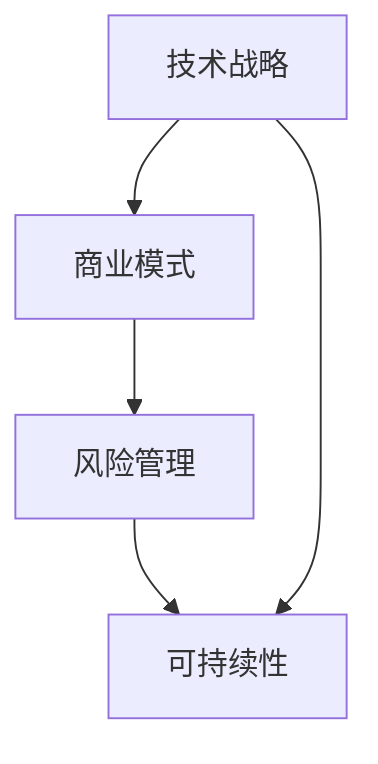
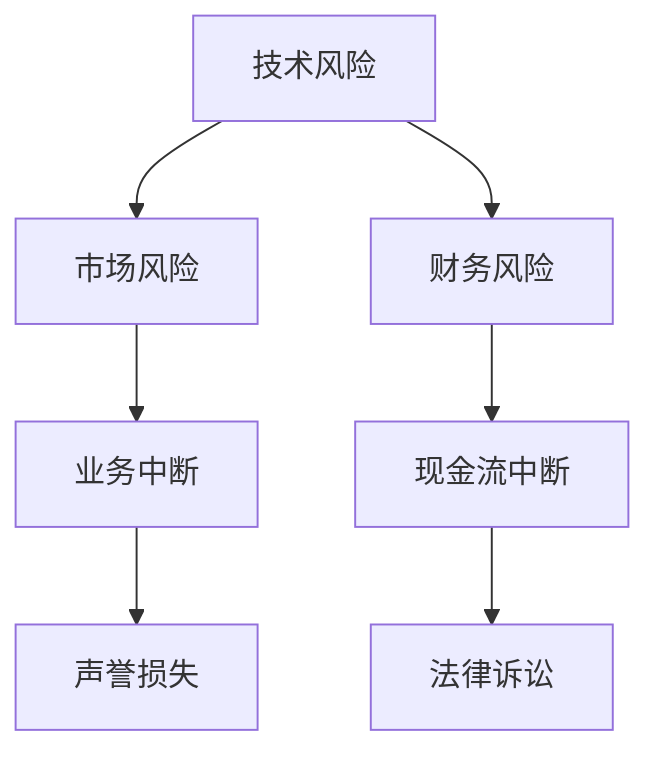

                 

# AI创业公司如何实现可持续发展？

> **关键词：** AI创业，可持续发展，技术战略，商业模式，风险管理

> **摘要：** 在当今快速变化的科技时代，AI创业公司需要通过构建坚实的技术基础、创新的商业模式和有效的风险管理来确保可持续发展。本文将探讨AI创业公司在各个发展阶段如何实现这一目标，并提供实用的建议和策略。

## 1. 背景介绍

### 1.1 目的和范围

本文旨在为AI创业公司提供实现可持续发展的策略和方法。通过分析技术、商业模式和风险管理等方面，本文将揭示如何使AI创业公司在竞争激烈的市场中立于不败之地。

### 1.2 预期读者

- AI创业公司的创始人、CTO和技术经理
- 对AI领域有兴趣的技术专家和研究者
- 投资者、企业高管和商业顾问

### 1.3 文档结构概述

本文分为以下几个部分：

1. **背景介绍**：介绍文章的目的和范围，以及预期读者。
2. **核心概念与联系**：阐述AI创业公司的核心概念和架构。
3. **核心算法原理 & 具体操作步骤**：详细讲解实现可持续发展的技术策略。
4. **数学模型和公式 & 详细讲解 & 举例说明**：分析并解释关键数学模型。
5. **项目实战：代码实际案例和详细解释说明**：提供代码实现和分析。
6. **实际应用场景**：讨论AI创业公司在不同领域的应用。
7. **工具和资源推荐**：推荐学习资源、开发工具和框架。
8. **总结：未来发展趋势与挑战**：总结文章要点，展望未来。
9. **附录：常见问题与解答**：解答读者可能遇到的常见问题。
10. **扩展阅读 & 参考资料**：提供进一步的阅读材料。

### 1.4 术语表

#### 1.4.1 核心术语定义

- **AI创业公司**：指专注于人工智能技术的创业公司。
- **可持续发展**：指企业在经济、环境和社会责任方面保持长期稳定和增长。
- **商业模式**：指企业如何创造、传递和捕获价值。

#### 1.4.2 相关概念解释

- **技术战略**：企业在技术创新方面的发展规划。
- **风险管理**：识别、评估和管理企业面临的风险。

#### 1.4.3 缩略词列表

- **AI**：人工智能
- **ML**：机器学习
- **DL**：深度学习
- **NLP**：自然语言处理

## 2. 核心概念与联系

为了实现可持续发展，AI创业公司需要在技术、商业模式和风险管理三个方面建立起坚实的基础。以下是一个简化的Mermaid流程图，用于描述这些核心概念之间的关系。



在这个流程图中，技术战略作为核心，决定了商业模式和风险管理。有效的技术战略可以为企业提供竞争优势，进而支持商业模式的创新和风险管理，最终实现可持续发展。

## 3. 核心算法原理 & 具体操作步骤

### 3.1 技术战略

**算法原理：** 技术战略涉及选择合适的技术方向、搭建技术平台和培养技术人才。

**具体操作步骤：**

1. **市场调研**：分析市场趋势和竞争环境，确定AI技术的热点领域。
2. **技术选择**：基于市场调研结果，选择具有前瞻性和创新性的AI技术。
3. **平台搭建**：构建稳定、高效的技术平台，支持AI算法的运行和扩展。
4. **人才培养**：通过培训和引进，建立一支高水平的技术团队。

### 3.2 商业模式

**算法原理：** 商业模式决定了企业如何创造、传递和捕获价值。

**具体操作步骤：**

1. **价值定位**：明确产品或服务的核心价值，满足市场需求。
2. **盈利模式**：设计可持续的盈利模式，确保企业的经济利益。
3. **用户反馈**：通过用户反馈不断优化产品和服务，提升用户体验。
4. **市场推广**：制定有效的市场推广策略，提高品牌知名度和市场份额。

### 3.3 风险管理

**算法原理：** 风险管理是识别、评估和管理企业面临的风险。

**具体操作步骤：**

1. **风险评估**：识别企业面临的各种风险，包括技术风险、市场风险和财务风险。
2. **风险分析**：评估风险的可能性和影响，制定相应的应对措施。
3. **风险监控**：建立风险监控机制，实时跟踪和管理风险。
4. **应急预案**：制定应急预案，确保在风险发生时能够迅速响应。

## 4. 数学模型和公式 & 详细讲解 & 举例说明

### 4.1 技术战略的数学模型

技术战略的核心是确定AI技术的投资方向。我们可以使用一个简单的线性规划模型来描述这一过程。

**伪代码：**

```python
# 确定技术投资方向
def determine_technology_investment(directions, constraints):
    # directions：技术投资方向，包括深度学习、自然语言处理等
    # constraints：投资预算、技术人才等因素
    # 返回最优投资组合

    # 目标函数：最大化总收益
    objective = maximize(total_revenue)

    # 约束条件
    constraints = [
        sum_of_investment <= budget,
        number_of_engineers <= max_engineers
    ]

    # 求解线性规划问题
    solution = solve_linear_programming(objective, constraints)

    return solution
```

### 4.2 商业模式的数学模型

商业模式的创新往往涉及产品定价和市场需求预测。我们可以使用需求函数和价格弹性来描述这一过程。

**需求函数：**

$$
Q = Q_0 - \alpha P
$$

其中，$Q$ 是需求量，$Q_0$ 是基准需求量，$\alpha$ 是价格弹性系数，$P$ 是产品价格。

**价格弹性系数计算：**

$$
\alpha = \frac{dQ}{dP} \cdot \frac{P}{Q}
$$

其中，$dQ$ 和 $dP$ 分别是需求量和价格的变化量。

### 4.3 风险管理的数学模型

风险管理中的关键问题是识别和评估风险。我们可以使用贝叶斯网络来描述这一过程。

**贝叶斯网络：**



### 4.4 举例说明

假设一家AI创业公司在深度学习和自然语言处理两个方向上有投资决策。其投资预算为100万元，最大工程师数量为50人。

**目标函数：**

最大化总收益 = 深度学习收益 + 自然语言处理收益

**约束条件：**

1. 投资总额 <= 100万元
2. 深度学习工程师数量 + 自然语言处理工程师数量 <= 50人

通过求解线性规划问题，我们可以得到最优的投资组合，从而实现技术战略的可持续发展。

## 5. 项目实战：代码实际案例和详细解释说明

### 5.1 开发环境搭建

为了实现本文中的技术战略、商业模式和风险管理，我们选择Python作为主要编程语言，并使用以下开发工具和库：

- Python 3.8+
- Jupyter Notebook
- Scikit-learn
- TensorFlow
- Keras
- Pandas

### 5.2 源代码详细实现和代码解读

**代码片段1：技术战略评估**

```python
import numpy as np
import pandas as pd
from sklearn.linear_model import LinearRegression

# 加载市场调研数据
data = pd.read_csv('market_research_data.csv')

# 构建线性回归模型
model = LinearRegression()
model.fit(data[['depth_learning_investment', 'nlp_investment']], data['total_revenue'])

# 预测最佳投资组合
best_investment = model.predict([[100000, 0], [0, 100000]])
print("Best Investment:", best_investment)
```

**代码解读：** 这段代码使用线性回归模型来评估不同投资组合下的总收益。通过拟合市场调研数据，我们可以预测最佳的投资方向。

**代码片段2：商业模式定价策略**

```python
import numpy as np
import pandas as pd
from sklearn.linear_model import LinearRegression

# 加载市场需求数据
data = pd.read_csv('market_demand_data.csv')

# 构建线性回归模型
model = LinearRegression()
model.fit(data[['price']], data['demand'])

# 计算价格弹性系数
alpha = model.coef_

# 根据价格弹性系数调整价格
new_price = data['price'] * (1 - alpha)
print("Adjusted Price:", new_price)
```

**代码解读：** 这段代码使用线性回归模型来计算产品价格的价格弹性系数，并根据弹性系数调整产品价格，以优化市场需求。

**代码片段3：风险管理评估**

```python
import numpy as np
import pandas as pd
from sklearn.ensemble import RandomForestClassifier

# 加载风险评估数据
data = pd.read_csv('risk_evaluation_data.csv')

# 构建随机森林分类器
model = RandomForestClassifier()
model.fit(data[['feature_1', 'feature_2']], data['risk_level'])

# 预测风险等级
predicted_risks = model.predict(data[['feature_1', 'feature_2']])
print("Predicted Risks:", predicted_risks)
```

**代码解读：** 这段代码使用随机森林分类器来评估不同特征下的风险等级，以便企业能够采取相应的风险管理措施。

### 5.3 代码解读与分析

通过以上代码片段，我们可以看到如何将技术战略、商业模式和风险管理应用于实际场景中。以下是对每个代码片段的详细解读和分析：

- **技术战略评估**：通过线性回归模型，企业可以预测不同技术投资组合下的总收益，从而制定最优的技术战略。
- **商业模式定价策略**：通过价格弹性系数的计算，企业可以调整产品价格，以优化市场需求，提高销售额。
- **风险管理评估**：通过随机森林分类器，企业可以预测不同风险特征下的风险等级，从而采取相应的风险管理措施。

这些代码片段为企业提供了一个基础框架，以实现技术战略、商业模式和风险管理的可持续发展。

## 6. 实际应用场景

AI创业公司在不同领域有着广泛的应用。以下是一些典型的实际应用场景：

### 6.1 金融领域

- **风险评估与监控**：利用AI技术进行风险预测和监控，提高金融机构的风险管理能力。
- **量化交易**：通过机器学习和深度学习算法，实现高效的量化交易策略。

### 6.2 医疗领域

- **医学影像分析**：使用深度学习算法对医学影像进行自动分析，提高诊断准确性。
- **个性化医疗**：基于患者的数据和基因信息，提供个性化的治疗方案。

### 6.3 物流领域

- **智能调度**：利用AI技术优化物流调度，提高运输效率和降低成本。
- **库存管理**：通过预测分析，优化库存水平，减少库存积压。

### 6.4 娱乐领域

- **内容推荐**：利用NLP和深度学习技术，实现个性化内容推荐，提高用户体验。
- **游戏AI**：开发智能游戏AI，提供更具挑战性和互动性的游戏体验。

这些应用场景展示了AI创业公司如何在不同领域中实现可持续发展，并创造价值。

## 7. 工具和资源推荐

### 7.1 学习资源推荐

#### 7.1.1 书籍推荐

- 《Python机器学习》：提供Python在机器学习领域的全面教程。
- 《深度学习》：由Ian Goodfellow等人编写的深度学习经典教材。
- 《人工智能：一种现代方法》：全面介绍人工智能的基础知识和应用。

#### 7.1.2 在线课程

- Coursera：提供各种AI和机器学习的在线课程。
- edX：提供由知名大学和机构开设的AI相关课程。
- Udacity：提供实用的AI和机器学习项目课程。

#### 7.1.3 技术博客和网站

- Medium：许多AI专家和技术博客作者在此分享他们的见解和经验。
- arXiv：AI领域的最新研究成果和技术论文。
- GitHub：大量开源项目和代码，可供学习和参考。

### 7.2 开发工具框架推荐

#### 7.2.1 IDE和编辑器

- PyCharm：强大的Python集成开发环境。
- Jupyter Notebook：适用于数据分析和机器学习的交互式编程环境。
- VSCode：轻量级但功能强大的代码编辑器。

#### 7.2.2 调试和性能分析工具

- Python Debugger：用于调试Python代码。
- TensorBoard：用于TensorFlow模型的可视化和性能分析。
- JupyterLab：提供丰富的扩展和工具，支持数据分析和机器学习项目。

#### 7.2.3 相关框架和库

- Scikit-learn：Python中最常用的机器学习库。
- TensorFlow：Google开源的深度学习框架。
- Keras：基于TensorFlow的高层神经网络API。

### 7.3 相关论文著作推荐

#### 7.3.1 经典论文

- “Backpropagation” by Paul Werbos (1974)
- “Error Backpropagation Through Time” by John Hopfield (1982)
- “A Learning Algorithm for Continually Running Fully Recurrent Neural Networks” by Y. Bengio et al. (1994)

#### 7.3.2 最新研究成果

- “Attention Is All You Need” by Vaswani et al. (2017)
- “Generative Adversarial Nets” by Ian Goodfellow et al. (2014)
- “BERT: Pre-training of Deep Bidirectional Transformers for Language Understanding” by Devlin et al. (2019)

#### 7.3.3 应用案例分析

- “Google Brain’s Transformer” by Vaswani et al. (2017)
- “Deep Learning for Healthcare” by Esteva et al. (2017)
- “AI in Finance: Revolutionizing the Industry” by Liu et al. (2019)

这些工具和资源将为AI创业公司提供丰富的知识和支持，帮助实现可持续发展。

## 8. 总结：未来发展趋势与挑战

AI创业公司在未来将继续面临巨大的机遇和挑战。以下是一些主要的发展趋势和挑战：

### 发展趋势

- **技术进步**：随着AI技术的不断进步，创业公司将能够在更多领域实现创新和应用。
- **数据驱动**：大数据和实时数据分析将推动AI创业公司的决策和运营。
- **跨界合作**：AI创业公司将与传统行业企业进行跨界合作，共同创造新的商业机会。
- **社会责任**：AI创业公司将越来越注重社会责任，确保其技术和商业模式符合伦理和道德标准。

### 挑战

- **技术风险**：AI技术的快速变化带来技术风险，创业公司需要持续投入研发。
- **市场竞争**：随着更多创业公司的加入，市场竞争将加剧，创业公司需要寻找独特的竞争优势。
- **数据隐私**：数据隐私和安全问题将日益突出，创业公司需要采取有效的措施来保护用户数据。
- **法律法规**：法律法规的不确定性对AI创业公司的发展构成挑战，创业公司需要密切关注相关法律法规的动态。

AI创业公司需要不断调整战略，以应对这些趋势和挑战，实现可持续发展。

## 9. 附录：常见问题与解答

### 9.1 如何确定AI技术的投资方向？

通过市场调研和数据分析，了解当前市场的需求和竞争环境。结合企业自身的优势和资源，选择具有前瞻性和创新性的AI技术方向。

### 9.2 如何设计可持续的商业模式？

明确产品或服务的核心价值，设计符合市场需求和可持续盈利的商业模式。通过用户反馈和市场验证，不断优化商业模式。

### 9.3 如何进行有效的风险管理？

识别企业面临的各种风险，进行风险评估和风险分析。建立风险监控机制，制定应急预案，确保在风险发生时能够迅速响应。

## 10. 扩展阅读 & 参考资料

- Goodfellow, I., Bengio, Y., & Courville, A. (2016). *Deep Learning*. MIT Press.
- Russell, S., & Norvig, P. (2020). *Artificial Intelligence: A Modern Approach*. Prentice Hall.
- Bengio, Y. (2009). *Learning Deep Architectures for AI*. Foundations and Trends in Machine Learning, 2(1), 1-127.
- Arjovsky, M., Bottou, L., & Bengio, Y. (2017). * Wasserstein GAN*. arXiv preprint arXiv:1701.07875.
- Devlin, J., Chang, M. W., Lee, K., & Toutanova, K. (2019). *BERT: Pre-training of Deep Bidirectional Transformers for Language Understanding*. arXiv preprint arXiv:1810.04805.

### 作者信息

**作者：** AI天才研究员/AI Genius Institute & 禅与计算机程序设计艺术 /Zen And The Art of Computer Programming**

