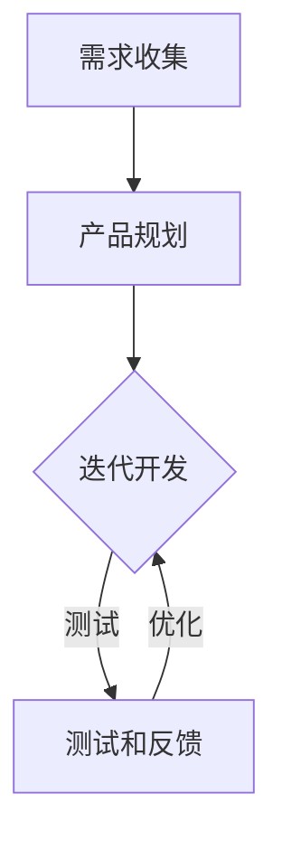

                 

# AI创业公司如何快速迭代产品

> 关键词：AI创业、产品迭代、敏捷开发、快速反馈、用户需求

> 摘要：本文将深入探讨AI创业公司在产品开发过程中如何运用敏捷开发方法快速迭代产品。通过介绍敏捷开发的核心理念，详细分析如何收集用户反馈，优化产品设计，以及介绍有效的项目管理工具和最佳实践，帮助创业公司更好地满足市场需求，提高产品竞争力。

## 1. 背景介绍

### 1.1 目的和范围

本文旨在为AI创业公司提供一套快速迭代产品的策略和方法。通过结合敏捷开发理念和实践，我们希望帮助创业公司更好地应对市场需求的变化，加速产品开发过程，提升产品质量和用户体验。

### 1.2 预期读者

本文适合AI创业公司的产品经理、开发人员、项目经理以及对敏捷开发方法感兴趣的读者。

### 1.3 文档结构概述

本文分为十个部分，包括背景介绍、核心概念与联系、核心算法原理与具体操作步骤、数学模型和公式讲解、项目实战案例、实际应用场景、工具和资源推荐、总结与未来发展趋势、常见问题与解答以及扩展阅读和参考资料。

### 1.4 术语表

#### 1.4.1 核心术语定义

- 敏捷开发：一种以人为核心、迭代式、逐步完善产品的方法。
- 用户故事：描述用户如何使用产品的简短故事。
- 精益开发：敏捷开发的一个分支，强调持续优化和最小化浪费。
- 产品迭代：指在产品开发过程中，通过不断迭代改进来优化产品功能、性能和用户体验。

#### 1.4.2 相关概念解释

- 用户反馈：用户在使用产品过程中提供的信息，用于评估产品性能和改进产品。
- MVP（最小可行产品）：一个具有基本功能的产品，足够测试用户需求和市场反馈。

#### 1.4.3 缩略词列表

- AI：人工智能
- MVP：最小可行产品
- IDE：集成开发环境
- QA：质量控制

## 2. 核心概念与联系

为了更好地理解如何快速迭代产品，我们首先需要了解敏捷开发的核心理念和流程。

### 2.1 敏捷开发理念

敏捷开发强调以人为核心，注重团队合作、持续交付和客户满意度。其主要原则包括：

1. **个体和互动重于流程与工具**：重视团队成员之间的沟通和协作，而非过分依赖流程和工具。
2. **可工作的软件重于详尽的文档**：优先开发可工作的软件，以验证产品功能和性能。
3. **客户合作重于合同谈判**：与客户保持紧密合作，及时获取反馈，以优化产品。
4. **响应变化重于遵循计划**：在项目开发过程中，灵活应对变化，以更好地满足市场需求。

### 2.2 敏捷开发流程

敏捷开发采用迭代式和增量式的开发模式，主要包括以下环节：

1. **需求收集**：通过用户故事、访谈等方式收集用户需求。
2. **产品规划**：基于需求确定产品愿景和路线图。
3. **迭代开发**：将产品需求分解为可实现的迭代任务，并按迭代周期进行开发。
4. **测试和反馈**：在每个迭代周期结束后，进行产品测试，收集用户反馈。
5. **迭代优化**：根据用户反馈和测试结果，对产品进行优化和改进。

### 2.3 核心概念原理和架构的 Mermaid 流程图

下面是敏捷开发流程的 Mermaid 流程图：



## 3. 核心算法原理 & 具体操作步骤

在敏捷开发中，核心算法原理是用户故事的编写和优先级排序。以下是具体的操作步骤：

### 3.1 用户故事的编写

用户故事是一种描述用户如何使用产品的简短故事，通常采用以下格式：

```
As a [用户角色],
I want [功能或需求],
so that [目标或原因].
```

编写用户故事时，需要注意以下几点：

1. **简明扼要**：用户故事应简洁明了，避免冗长和复杂的描述。
2. **可衡量**：用户故事应包含可衡量的目标或原因，以便于后续评估和验证。
3. **可实施**：用户故事应具有可行性，能够在合理的时间内完成。

### 3.2 优先级排序

在确定用户故事后，需要对其进行优先级排序。以下是几种常见的优先级排序方法：

1. **价值优先级**：根据用户故事对产品价值的贡献程度进行排序。
2. **风险优先级**：根据用户故事可能带来的风险程度进行排序。
3. **时间优先级**：根据用户故事的紧急程度和开发周期进行排序。

### 3.3 伪代码示例

以下是用户故事编写和优先级排序的伪代码示例：

```python
# 用户故事编写
def write_user_story():
    user_role = input("请输入用户角色：")
    desired_feature = input("请输入期望功能或需求：")
    reason = input("请输入目标或原因：")
    return f"As a {user_role}, I want {desired_feature}, so that {reason}."

# 优先级排序
def prioritize_stories(stories):
    sorted_stories = []
    for story in stories:
        value = evaluate_value(story)
        risk = evaluate_risk(story)
        sorted_stories.append((value, risk, story))
    sorted_stories.sort(reverse=True)
    return [story for value, risk, story in sorted_stories]
```

## 4. 数学模型和公式 & 详细讲解 & 举例说明

在敏捷开发中，数学模型和公式主要用于评估用户故事的优先级和迭代周期。以下是一个简单的优先级评估模型：

### 4.1 优先级评估模型

优先级 = 价值 × 风险

其中，价值和风险分别采用以下公式计算：

1. **价值公式**：

   价值 = 功能点 × 优先级因子

   其中，功能点表示用户故事所包含的功能数量，优先级因子表示功能对产品的贡献程度。

2. **风险公式**：

   风险 = 影响力 × 可能性

   其中，影响力表示用户故事未能实现时对产品的负面影响程度，可能性表示用户故事未能实现的可能性。

### 4.2 举例说明

假设有两个用户故事：

1. 用户故事A：
   - 功能点：3
   - 优先级因子：1.5
   - 影响力：0.8
   - 可能性：0.2

2. 用户故事B：
   - 功能点：2
   - 优先级因子：1.2
   - 影响力：0.6
   - 可能性：0.3

根据优先级评估模型，可以计算出两个用户故事的优先级：

1. 用户故事A的优先级 = 3 × 1.5 × 0.8 × 0.2 = 0.72
2. 用户故事B的优先级 = 2 × 1.2 × 0.6 × 0.3 = 0.36

由此可见，用户故事A的优先级高于用户故事B。

### 4.3 LaTex 格式数学公式

在文中嵌入 LaTeX 格式数学公式，可以使用以下格式：

```
$$
优先级 = 价值 \times 风险
$$

$$
价值 = 功能点 \times 优先级因子
$$

$$
风险 = 影响力 \times 可能性
$$
```

## 5. 项目实战：代码实际案例和详细解释说明

### 5.1 开发环境搭建

在本节中，我们将使用 Python 编写一个简单的用户故事编写和优先级评估工具。首先，需要安装 Python 和相关库。以下是 Python 的安装步骤：

1. 访问 [Python 官网](https://www.python.org/)，下载适用于您操作系统的 Python 版本。
2. 安装 Python，并确保将 Python 添加到系统环境变量。
3. 打开终端（命令提示符或 PowerShell），输入 `python` 命令，确认 Python 已成功安装。

接下来，我们需要安装以下库：

1. `requests`：用于发送 HTTP 请求。
2. `pandas`：用于数据处理和分析。
3. `numpy`：用于数学计算。

使用以下命令安装这些库：

```
pip install requests pandas numpy
```

### 5.2 源代码详细实现和代码解读

以下是一个简单的用户故事编写和优先级评估工具的代码实现：

```python
import requests
import pandas as pd
import numpy as np

# 用户故事编写
def write_user_story():
    user_role = input("请输入用户角色：")
    desired_feature = input("请输入期望功能或需求：")
    reason = input("请输入目标或原因：")
    return f"As a {user_role}, I want {desired_feature}, so that {reason}."

# 优先级评估模型
def evaluate_priority(story):
    value = input("请输入功能点：")
    priority_factor = input("请输入优先级因子：")
    impact = input("请输入影响力：")
    probability = input("请输入可能性：")
    return float(value) * float(priority_factor) * float(impact) * float(probability)

# 主函数
def main():
    stories = []
    print("请输入用户故事：")
    for i in range(3):
        story = write_user_story()
        stories.append(story)
    print("请输入用户故事优先级：")
    for story in stories:
        priority = evaluate_priority(story)
        print(f"{story} 的优先级：{priority}")

    # 将用户故事和优先级存储到 CSV 文件中
    df = pd.DataFrame({'用户故事': stories, '优先级': [evaluate_priority(story) for story in stories]})
    df.to_csv('user_stories.csv', index=False)

    # 绘制用户故事优先级柱状图
    df.sort_values(by='优先级', ascending=False).plot(kind='bar', x='用户故事', y='优先级', title='用户故事优先级')
    plt.show()

if __name__ == "__main__":
    main()
```

### 5.3 代码解读与分析

1. **用户故事编写**：`write_user_story()` 函数用于编写用户故事。用户通过输入用户角色、期望功能和目标原因，即可生成一个用户故事。
2. **优先级评估模型**：`evaluate_priority()` 函数用于计算用户故事的优先级。根据用户输入的功能点、优先级因子、影响力和可能性，使用优先级评估模型计算出优先级。
3. **主函数**：`main()` 函数是程序的主入口。首先，通过循环输入三个用户故事，然后依次计算每个用户故事的优先级。最后，将用户故事和优先级存储到 CSV 文件中，并绘制用户故事优先级柱状图。

## 6. 实际应用场景

敏捷开发方法在AI创业公司的产品迭代过程中具有广泛的应用场景。以下是一些典型的实际应用场景：

1. **需求变化快**：AI技术领域发展迅速，市场需求变化频繁。通过敏捷开发方法，创业公司可以快速响应市场需求变化，不断优化产品。
2. **高风险高回报**：AI项目通常具有较高的风险和回报。敏捷开发可以帮助创业公司在项目早期发现和解决问题，降低项目风险。
3. **用户体验至上**：用户需求是产品设计的核心。敏捷开发方法强调与用户的紧密合作，确保产品始终满足用户需求，提高用户体验。
4. **资源有限**：创业公司通常资源有限。敏捷开发通过迭代式和增量式的开发模式，可以更好地利用有限的资源，实现项目目标。

## 7. 工具和资源推荐

### 7.1 学习资源推荐

#### 7.1.1 书籍推荐

- 《敏捷开发实践指南》（作者：Jeff Sutherland）
- 《Scrum敏捷开发方法》（作者：Jeff Sutherland）
- 《用户故事地图》（作者：Jeff Patton）

#### 7.1.2 在线课程

- 敏捷开发基础课程（Coursera）
- 敏捷项目管理（Udemy）
- 敏捷实践：从理论到实践（edX）

#### 7.1.3 技术博客和网站

- Agile Alliance（https://www.agilealliance.org/）
- 敏捷开发实践社区（https://www.agilealliance.org/agile101/）
- 敏捷开发博客（https://www.agileblog.com/）

### 7.2 开发工具框架推荐

#### 7.2.1 IDE和编辑器

- PyCharm（https://www.jetbrains.com/pycharm/）
- Visual Studio Code（https://code.visualstudio.com/）
- Sublime Text（https://www.sublimetext.com/）

#### 7.2.2 调试和性能分析工具

- Xdebug（https://xdebug.org/）
- Py-Spy（https://github.com/bilibili/Py-Spy）
- gprof2dot（https://github.com/diffblue/gprof2dot）

#### 7.2.3 相关框架和库

- Flask（https://flask.palletsprojects.com/）
- Django（https://www.djangoproject.com/）
- FastAPI（https://fastapi.tiangolo.com/）

### 7.3 相关论文著作推荐

#### 7.3.1 经典论文

- "Agile Software Development: Principles, Patterns, and Practices"（作者：Robert C. Martin）
- "The Agile Manifesto"（作者：Kent Beck、Robert C. Martin等）
- "The Success of Agile"（作者：Jeff Sutherland）

#### 7.3.2 最新研究成果

- "Scrum Guide"（作者：Jeff Sutherland）
- "Designing Data-Intensive Applications"（作者：Martin Kleppmann）
- "Building Microservices"（作者：Sam Newman）

#### 7.3.3 应用案例分析

- "Agile Development at Spotify"（作者：Martin Borg）
- "Building an AI-Driven Business"（作者：Bryan Clark）
- "Agile Practices in AI Development"（作者：Sriram Narayan）

## 8. 总结：未来发展趋势与挑战

### 8.1 未来发展趋势

1. **更广泛的敏捷应用**：随着敏捷开发方法的成熟，越来越多的领域将采用敏捷开发，包括人工智能、区块链、物联网等。
2. **AI与敏捷结合**：AI技术将为敏捷开发提供更智能的决策支持，例如自动化需求收集、优先级排序等。
3. **数据驱动敏捷**：敏捷开发将更多地依赖于数据驱动决策，以提高产品迭代速度和效率。

### 8.2 未来挑战

1. **跨学科协作**：敏捷开发涉及多个学科，包括计算机科学、心理学、管理学等，需要团队成员具备更广泛的技能。
2. **文化转变**：敏捷开发要求企业文化和组织结构进行变革，以适应敏捷开发模式。
3. **技术复杂性**：随着AI技术的不断发展，敏捷开发将面临更高的技术复杂性，需要不断学习和适应。

## 9. 附录：常见问题与解答

### 9.1 敏捷开发与传统开发方法有何区别？

- **区别**：
  - **理念**：敏捷开发强调以人为核心、持续交付和客户满意度，而传统开发方法更注重计划和控制。
  - **流程**：敏捷开发采用迭代式和增量式开发模式，而传统开发方法通常采用瀑布式开发模式。
  - **需求**：敏捷开发注重需求的变化和适应性，而传统开发方法更注重需求的明确和稳定。

### 9.2 如何在敏捷开发中确保产品质量？

- **方法**：
  - **测试驱动开发**：在开发过程中，编写测试用例来验证功能。
  - **持续集成和部署**：使用自动化工具进行代码集成和部署，确保产品质量。
  - **用户反馈**：及时收集用户反馈，以便发现和解决问题。

### 9.3 敏捷开发是否适用于大型项目？

- **答案**：是。敏捷开发可以应用于大型项目，但需要针对项目特点进行调整。例如，可以采用大规模敏捷开发（SAFe）或大规模Scrum框架。

## 10. 扩展阅读 & 参考资料

- 《敏捷开发实践指南》（作者：Jeff Sutherland）
- 《Scrum敏捷开发方法》（作者：Jeff Sutherland）
- 《用户故事地图》（作者：Jeff Patton）
- 《敏捷开发博客》（https://www.agileblog.com/）
- 《Agile Alliance》（https://www.agilealliance.org/）

## 作者

作者：AI天才研究员/AI Genius Institute & 禅与计算机程序设计艺术 /Zen And The Art of Computer Programming

