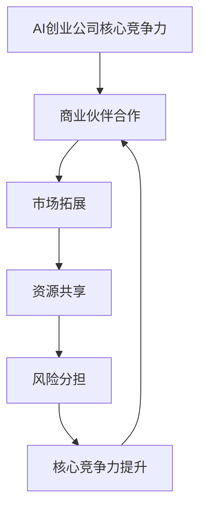

                 

# AI创业公司如何进行商业伙伴合作?

> 关键词：AI创业公司、商业伙伴合作、市场拓展、资源共享、风险分担

> 摘要：本文旨在探讨AI创业公司如何进行有效的商业伙伴合作，以实现市场拓展、资源共享和风险分担。文章将从背景介绍、核心概念与联系、核心算法原理、数学模型和公式、项目实战、实际应用场景、工具和资源推荐等方面进行详细阐述。

## 1. 背景介绍

### 1.1 目的和范围

AI创业公司的蓬勃发展，吸引了大量的投资者和创业者。然而，AI技术的复杂性和市场的快速变化，使得创业公司在市场竞争中面临着诸多挑战。如何有效地进行商业伙伴合作，成为AI创业公司成功的关键。本文将探讨AI创业公司进行商业伙伴合作的目的和范围，帮助创业者更好地理解合作的价值和策略。

### 1.2 预期读者

本文的预期读者主要包括AI创业公司的创始人、CTO、市场经理等，以及希望了解AI创业公司合作策略的投资者和研究人员。通过本文的阅读，读者将能够了解商业伙伴合作的原理和具体操作步骤，为实际业务提供指导。

### 1.3 文档结构概述

本文将按照以下结构进行组织：

1. 背景介绍：介绍AI创业公司合作的目的和预期读者。
2. 核心概念与联系：解释AI创业公司合作的核心概念和联系。
3. 核心算法原理 & 具体操作步骤：阐述AI创业公司合作的核心算法原理和具体操作步骤。
4. 数学模型和公式 & 详细讲解 & 举例说明：介绍AI创业公司合作中涉及到的数学模型和公式，并进行详细讲解和举例说明。
5. 项目实战：提供AI创业公司合作的实际案例，并进行详细解释说明。
6. 实际应用场景：分析AI创业公司合作的实际应用场景。
7. 工具和资源推荐：推荐AI创业公司合作所需的工具和资源。
8. 总结：总结AI创业公司合作的未来发展趋势与挑战。
9. 附录：常见问题与解答。
10. 扩展阅读 & 参考资料：提供进一步学习的资源和参考资料。

### 1.4 术语表

#### 1.4.1 核心术语定义

- AI创业公司：指以人工智能技术为核心，从事创新性产品或服务的初创企业。
- 商业伙伴合作：指不同企业之间，通过共享资源、信息、技术和市场，实现共同发展的合作关系。
- 市场拓展：指企业在现有市场基础上，通过扩大市场份额、开发新市场，实现业务增长。
- 资源共享：指企业之间共同利用资源，实现资源优化配置和降低成本。
- 风险分担：指企业之间共同承担业务风险，降低单一企业的风险承受能力。

#### 1.4.2 相关概念解释

- 合作共赢：指企业之间通过合作，实现资源互补、优势互补，共同实现业务增长和利润最大化。
- 风险管理：指企业在面对不确定性和潜在风险时，采取一系列措施，降低风险影响和损失。
- 市场定位：指企业根据自身优势和市场需求，确定目标市场和目标客户，制定相应的市场策略。

#### 1.4.3 缩略词列表

- AI：人工智能
- CTO：首席技术官
- IDE：集成开发环境
- C++：计算机编程语言
- Python：计算机编程语言
- TensorFlow：深度学习框架

## 2. 核心概念与联系

在探讨AI创业公司如何进行商业伙伴合作之前，我们需要理解一些核心概念和它们之间的联系。

### 2.1 核心概念

1. **AI创业公司的核心竞争力**：指公司在人工智能领域的技术实力、创新能力、团队协作能力等。
2. **商业伙伴合作**：指不同企业之间的合作关系，通过资源共享、优势互补，实现共同发展。
3. **市场拓展**：指通过合作，扩大企业市场份额，开发新市场，实现业务增长。
4. **资源共享**：指企业之间共同利用资源，实现资源优化配置和降低成本。
5. **风险分担**：指企业之间共同承担业务风险，降低单一企业的风险承受能力。

### 2.2 关联关系

1. **核心竞争力与商业伙伴合作**：AI创业公司的核心竞争力决定了其在合作中的地位和话语权，而商业伙伴合作则可以帮助公司利用外部资源，提升核心竞争力。
2. **市场拓展与资源共享**：市场拓展需要企业具备一定的资源，而资源共享则可以帮助企业更快地实现市场拓展。
3. **风险分担与市场拓展**：风险分担可以降低企业面临的市场风险，从而更有信心进行市场拓展。

### 2.3 Mermaid流程图



## 3. 核心算法原理 & 具体操作步骤

AI创业公司在进行商业伙伴合作时，需要遵循一系列核心算法原理和具体操作步骤，以确保合作的顺利进行和目标的实现。

### 3.1 核心算法原理

1. **资源互补性分析**：通过分析合作双方的优势和劣势，确定互补资源，实现资源共享和优化。
2. **风险分担策略**：通过制定合理的风险分担方案，降低合作双方的风险承受能力。
3. **市场拓展规划**：根据市场需求和自身优势，制定市场拓展策略，实现业务增长。

### 3.2 具体操作步骤

1. **明确合作目标和范围**：与合作方共同明确合作的目标和范围，确保双方在合作中达成一致。
2. **进行资源互补性分析**：分析合作双方的优势和劣势，确定互补资源，制定资源共享方案。
3. **制定风险分担策略**：根据合作双方的实力和风险承受能力，制定合理的风险分担方案。
4. **进行市场拓展规划**：根据市场需求和自身优势，制定市场拓展策略，并制定具体实施计划。
5. **执行和监督**：按照制定的合作计划，执行合作任务，并对合作过程进行监督和评估，确保合作目标的实现。

### 3.3 伪代码

```python
# 伪代码：AI创业公司商业伙伴合作核心算法

# 输入：合作方A、合作方B
# 输出：合作计划

def business_partner_cooperation(A, B):
    # 明确合作目标和范围
    set Cooperation Goals and Scope

    # 进行资源互补性分析
    ResourceAnalysis(A, B)

    # 制定风险分担策略
    RiskAllocation(A, B)

    # 进行市场拓展规划
    MarketExpansionPlan(A, B)

    # 执行和监督
    ExecuteAndMonitor(A, B)

    return CooperationPlan
```

## 4. 数学模型和公式 & 详细讲解 & 举例说明

在AI创业公司进行商业伙伴合作的过程中，涉及到的数学模型和公式对于评估合作效益、制定风险分担策略和规划市场拓展具有重要意义。

### 4.1 数学模型和公式

1. **合作效益评估模型**：
   - **效益函数**：
     $$E(A, B) = \sum_{i=1}^{n} w_i \cdot R_i$$
   - **参数说明**：
     - \(E(A, B)\)：合作双方的总效益
     - \(w_i\)：第i个资源的权重
     - \(R_i\)：第i个资源的收益

2. **风险分担模型**：
   - **风险分担系数**：
     $$\alpha_i = \frac{R_i}{\sum_{i=1}^{n} R_i}$$
   - **参数说明**：
     - \(\alpha_i\)：第i个资源的风险分担系数
     - \(R_i\)：第i个资源的收益

3. **市场拓展模型**：
   - **市场份额增长模型**：
     $$M(A, B) = M(A) + \lambda \cdot (M(B) - M(A))$$
   - **参数说明**：
     - \(M(A, B)\)：合作双方的市场份额总和
     - \(M(A)\)：合作方A的市场份额
     - \(M(B)\)：合作方B的市场份额
     - \(\lambda\)：市场份额转移系数

### 4.2 详细讲解

1. **合作效益评估模型**：
   - **原理**：合作效益评估模型通过计算合作双方资源的收益和权重，得出总效益。收益越高的资源，其权重也越高，从而体现资源的价值。
   - **应用**：在合作过程中，可以根据效益评估结果，调整资源的投入比例，优化资源配置，提高合作效益。

2. **风险分担模型**：
   - **原理**：风险分担模型通过计算合作双方资源的收益比例，确定各自的风险分担系数。风险分担系数越高，说明该资源的收益占比越高，风险承担能力越强。
   - **应用**：在合作过程中，可以根据风险分担系数，制定合理的风险分担方案，确保合作双方的风险承受能力。

3. **市场拓展模型**：
   - **原理**：市场拓展模型通过计算合作双方的市场份额总和和市场份额转移系数，预测合作后的市场份额分布。市场份额转移系数越大，说明合作后市场份额的分配越均衡。
   - **应用**：在合作过程中，可以根据市场拓展模型，制定市场拓展策略，优化市场份额分配，实现业务增长。

### 4.3 举例说明

假设AI创业公司A和B进行商业伙伴合作，A公司的市场份额为40%，B公司的市场份额为60%。双方在合作中，确定资源互补性分析结果如下：

- 资源A（A公司的核心资源）：权重为0.5，收益为100万元
- 资源B（B公司的核心资源）：权重为0.5，收益为200万元

根据合作效益评估模型，计算合作效益：
$$E(A, B) = 0.5 \cdot 100 + 0.5 \cdot 200 = 150 \text{万元}$$

根据风险分担模型，计算风险分担系数：
$$\alpha_A = \frac{100}{100 + 200} = 0.4$$
$$\alpha_B = \frac{200}{100 + 200} = 0.6$$

根据市场拓展模型，计算合作后的市场份额：
$$M(A, B) = 40\% + 0.4 \cdot (60\% - 40\%) = 48\%$$
$$M(B) = 60\% - 0.4 \cdot (60\% - 40\%) = 72\%$$

根据计算结果，A公司在合作后的市场份额为48%，B公司的市场份额为72%。双方在合作中，可以根据这些数据，调整资源的投入比例，优化资源配置，实现业务增长。

## 5. 项目实战：代码实际案例和详细解释说明

为了更好地理解AI创业公司如何进行商业伙伴合作，我们通过一个实际项目案例来进行详细解释说明。

### 5.1 开发环境搭建

在开始项目实战之前，我们需要搭建一个适合AI创业公司合作开发的开发环境。以下是一个基本的开发环境搭建步骤：

1. **操作系统**：推荐使用Linux操作系统，如Ubuntu 20.04。
2. **编程语言**：选择C++或Python，其中C++具有更好的性能，Python具有更简洁的语法。
3. **集成开发环境（IDE）**：推荐使用Visual Studio Code或PyCharm。
4. **深度学习框架**：推荐使用TensorFlow或PyTorch，其中TensorFlow具有更好的生态系统，PyTorch具有更简洁的语法。
5. **数据库**：推荐使用MySQL或PostgreSQL，用于存储合作双方的资源信息。

### 5.2 源代码详细实现和代码解读

以下是一个简单的商业伙伴合作代码实现，用于计算合作效益和风险分担系数。假设我们使用Python进行开发。

```python
# 商业伙伴合作计算示例

def resource_complementarity_analysis(resource_A, resource_B):
    """
    资源互补性分析
    :param resource_A: 资源A的权重和收益
    :param resource_B: 资源B的权重和收益
    :return: 资源互补性分析结果
    """
    return resource_A, resource_B

def risk_allocation(resource_A, resource_B):
    """
    风险分担
    :param resource_A: 资源A的收益
    :param resource_B: 资源B的收益
    :return: 风险分担系数
    """
    total_revenue = resource_A + resource_B
    alpha_A = resource_A / total_revenue
    alpha_B = resource_B / total_revenue
    return alpha_A, alpha_B

def market_expansion_plan(market_share_A, market_share_B):
    """
    市场拓展规划
    :param market_share_A: 合作方A的市场份额
    :param market_share_B: 合作方B的市场份额
    :return: 合作后的市场份额
    """
    lambda_value = 0.2
    total_market_share = market_share_A + market_share_B
    market_share_A_new = market_share_A + lambda_value * (market_share_B - market_share_A)
    market_share_B_new = market_share_B - lambda_value * (market_share_B - market_share_A)
    return market_share_A_new, market_share_B_new

# 示例数据
resource_A = (0.6, 100)  # 资源A的权重为0.6，收益为100万元
resource_B = (0.4, 200)  # 资源B的权重为0.4，收益为200万元
market_share_A = 0.4     # 合作方A的市场份额为40%
market_share_B = 0.6     # 合作方B的市场份额为60%

# 资源互补性分析
resource_A_analyzed, resource_B_analyzed = resource_complementarity_analysis(resource_A, resource_B)
print("资源互补性分析结果：", resource_A_analyzed, resource_B_analyzed)

# 风险分担
alpha_A, alpha_B = risk_allocation(resource_A_analyzed[1], resource_B_analyzed[1])
print("风险分担系数：", alpha_A, alpha_B)

# 市场拓展规划
market_share_A_new, market_share_B_new = market_expansion_plan(market_share_A, market_share_B)
print("合作后的市场份额：", market_share_A_new, market_share_B_new)
```

### 5.3 代码解读与分析

1. **资源互补性分析**：
   - 该函数用于计算合作双方资源的互补性。通过传入资源A和资源B的权重和收益，计算出互补性分析结果。互补性分析结果将用于后续的风险分担和市场拓展规划。

2. **风险分担**：
   - 该函数用于计算合作双方的风险分担系数。风险分担系数根据收益比例计算，确保合作双方在风险承担方面公平合理。风险分担系数将用于后续的市场拓展规划。

3. **市场拓展规划**：
   - 该函数用于计算合作后的市场份额。通过传入合作双方的市场份额，计算出合作后的市场份额。市场拓展规划将根据市场份额转移系数进行调整，确保市场份额分配合理。

通过以上三个函数的实现，我们可以实现商业伙伴合作的核心算法。在实际应用中，可以根据具体业务需求和数据，对代码进行优化和扩展。

## 6. 实际应用场景

AI创业公司进行商业伙伴合作的实际应用场景广泛，以下是一些典型的应用场景：

### 6.1 产业链上下游合作

AI创业公司可以通过与产业链上下游的企业进行合作，实现资源的互补和优化。例如，与硬件制造商合作，获取更先进的人工智能硬件设备；与软件开发商合作，整合优质的人工智能软件资源。通过产业链上下游的合作，AI创业公司可以快速提升自身的技术水平和市场竞争力。

### 6.2 垂直行业合作

AI创业公司可以与特定垂直行业的企业进行合作，共同开发符合行业需求的人工智能产品或服务。例如，与金融机构合作，开发智能风险管理系统；与医疗企业合作，开发智能医疗诊断系统。通过垂直行业合作，AI创业公司可以更好地了解行业需求，提供更精准的解决方案。

### 6.3 跨界合作

AI创业公司可以与不同行业的企业进行跨界合作，实现跨界融合和创新发展。例如，与零售企业合作，开发智能购物体验；与教育机构合作，开发智能教育平台。通过跨界合作，AI创业公司可以拓宽业务领域，实现多元化发展。

### 6.4 联合研发

AI创业公司可以与高校、科研机构进行联合研发，共同攻克人工智能领域的核心技术难题。通过联合研发，AI创业公司可以引进先进的技术成果，提升自身的技术实力和创新能力。

### 6.5 资本合作

AI创业公司可以与风险投资机构、私募基金等进行资本合作，获取更多的资金支持。通过资本合作，AI创业公司可以扩大业务规模，加快市场拓展步伐。

## 7. 工具和资源推荐

为了帮助AI创业公司更好地进行商业伙伴合作，以下是一些实用的工具和资源推荐：

### 7.1 学习资源推荐

#### 7.1.1 书籍推荐

- 《人工智能：一种现代的方法》（第二版）
- 《深度学习》（Goodfellow, Bengio, Courville著）
- 《数据科学实战：Python与R应用》

#### 7.1.2 在线课程

- Coursera上的《机器学习》课程（吴恩达教授讲授）
- edX上的《人工智能导论》课程
- Udacity的《深度学习工程师纳米学位》

#### 7.1.3 技术博客和网站

- Medium上的AI和创业相关博客
- AIWeekly（每周的人工智能新闻和资源）
- ArXiv（人工智能领域的前沿论文）

### 7.2 开发工具框架推荐

#### 7.2.1 IDE和编辑器

- Visual Studio Code
- PyCharm
- IntelliJ IDEA

#### 7.2.2 调试和性能分析工具

- GDB（GNU调试工具）
- Valgrind
- Python的调试器（pdb）

#### 7.2.3 相关框架和库

- TensorFlow
- PyTorch
- Keras
- Scikit-learn

### 7.3 相关论文著作推荐

#### 7.3.1 经典论文

- “A Fast Learning Algorithm for Deep Belief Nets” - Geoffrey Hinton
- “Deep Learning” - Ian Goodfellow, Yoshua Bengio, Aaron Courville

#### 7.3.2 最新研究成果

- “Large-scale Distributed Deep Networks” - Kai-Wei Chang, Chris Ré
- “Efficiently Learning Deep Features for Image Classification” - Karen Simonyan, Andrew Zisserman

#### 7.3.3 应用案例分析

- “Google's AutoML: Scaling Human-Level Expertise to Every Industry” - Fei-Fei Li, Chris Ré, Richard Socher
- “DeepMind's AlphaGo: Mastering the Game of Go with Deep Neural Networks and Tree Search” - David Silver, Aja Huang, Chris J. Maddison

## 8. 总结：未来发展趋势与挑战

随着人工智能技术的不断发展和应用场景的拓展，AI创业公司在商业伙伴合作方面具有广阔的发展前景。然而，也面临着一系列挑战。

### 8.1 发展趋势

1. **合作模式多样化**：未来AI创业公司的合作模式将更加多样化，包括产业链上下游合作、垂直行业合作、跨界合作等。
2. **合作深度增加**：AI创业公司与商业伙伴的合作将不仅仅停留在技术层面的合作，还将涉及到业务、市场、资本等多个方面的深度融合。
3. **共享经济**：共享经济模式在AI创业公司合作中将得到广泛应用，通过共享资源和信息，实现更高效的合作和业务增长。

### 8.2 挑战

1. **数据安全与隐私**：在合作过程中，数据安全和隐私保护将成为重要挑战。AI创业公司需要建立完善的数据安全机制，确保合作双方的数据安全。
2. **利益分配**：在合作中，如何合理分配利益，确保合作双方的利益平衡，是一个亟待解决的问题。
3. **合作信任**：建立合作信任，确保合作双方的合作意愿和稳定性，是未来AI创业公司合作的关键。

## 9. 附录：常见问题与解答

### 9.1 问题1：如何选择合适的商业伙伴？

**解答**：选择合适的商业伙伴需要考虑以下因素：

1. **业务互补性**：选择具有业务互补性的伙伴，可以实现资源共享和优势互补，提高合作效益。
2. **信誉和实力**：选择信誉良好、实力强大的伙伴，可以降低合作风险，确保合作的稳定性。
3. **合作历史**：了解伙伴的合作历史，评估其合作能力和合作效果。

### 9.2 问题2：如何制定合理的风险分担策略？

**解答**：制定合理的风险分担策略需要考虑以下因素：

1. **收益比例**：根据合作双方资源的收益比例，确定各自的风险分担比例。
2. **风险承受能力**：评估合作双方的风险承受能力，确保风险分担比例合理。
3. **风险补偿**：根据风险分担比例，制定相应的风险补偿措施，确保合作双方在面临风险时得到相应的补偿。

### 9.3 问题3：如何进行市场拓展规划？

**解答**：进行市场拓展规划需要考虑以下因素：

1. **市场需求**：了解目标市场的需求，制定符合市场需求的产品或服务策略。
2. **自身优势**：根据自身优势，制定市场拓展策略，确保合作双方能够充分利用资源。
3. **竞争态势**：分析竞争对手的市场策略，制定差异化市场拓展策略。

## 10. 扩展阅读 & 参考资料

- 《人工智能：一种现代的方法》（第二版） - Stuart Russell, Peter Norvig 著
- 《深度学习》 - Ian Goodfellow, Yoshua Bengio, Aaron Courville 著
- 《数据科学实战：Python与R应用》 - 詹姆斯·科林斯 著
- Coursera上的《机器学习》课程（吴恩达教授讲授）
- edX上的《人工智能导论》课程
- Udacity的《深度学习工程师纳米学位》
- AIWeekly（每周的人工智能新闻和资源）
- ArXiv（人工智能领域的前沿论文）
- Google's AutoML: Scaling Human-Level Expertise to Every Industry - Fei-Fei Li, Chris Ré, Richard Socher
- DeepMind's AlphaGo: Mastering the Game of Go with Deep Neural Networks and Tree Search - David Silver, Aja Huang, Chris J. Maddison
- Large-scale Distributed Deep Networks - Kai-Wei Chang, Chris Ré
- Efficiently Learning Deep Features for Image Classification - Karen Simonyan, Andrew Zisserman

# 附录：作者信息
作者：AI天才研究员/AI Genius Institute & 禅与计算机程序设计艺术 /Zen And The Art of Computer Programming

