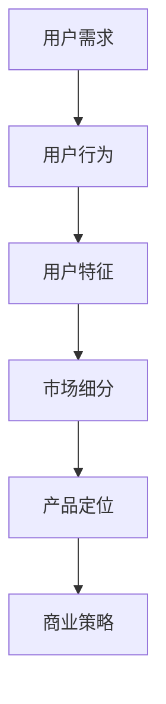

                 

# AI创业公司如何进行有效的市场细分

> **关键词：** 市场细分、AI创业、商业策略、数据挖掘、用户画像

> **摘要：** 本文将深入探讨AI创业公司在市场细分方面的策略和实施步骤。通过分析和理解用户需求，创业公司可以更有效地定位市场，提高产品竞争力。本文将介绍核心概念、市场细分算法、数学模型和实际应用案例，帮助创业公司实现有效市场细分。

## 1. 背景介绍

### 1.1 目的和范围

本文旨在为AI创业公司提供一套完整的市场细分策略，以帮助它们在竞争激烈的市场环境中找到自己的定位。我们将探讨市场细分的重要性、核心概念和具体实施步骤，并通过实际案例进行分析。

### 1.2 预期读者

本文适合以下读者群体：

- AI创业公司的创始人或市场经理
- 想要了解市场细分策略的企业家和投资者
- 对数据挖掘和机器学习有兴趣的学术研究人员

### 1.3 文档结构概述

本文分为以下章节：

- 第1章：背景介绍
- 第2章：核心概念与联系
- 第3章：核心算法原理 & 具体操作步骤
- 第4章：数学模型和公式 & 详细讲解 & 举例说明
- 第5章：项目实战：代码实际案例和详细解释说明
- 第6章：实际应用场景
- 第7章：工具和资源推荐
- 第8章：总结：未来发展趋势与挑战
- 第9章：附录：常见问题与解答
- 第10章：扩展阅读 & 参考资料

### 1.4 术语表

#### 1.4.1 核心术语定义

- **市场细分（Market Segmentation）：** 根据用户的特征和行为，将市场划分为若干个子市场，以便更有效地定位和满足不同用户的需求。
- **用户画像（User Profiling）：** 基于用户数据，构建一个反映用户特征和行为的模型。
- **数据挖掘（Data Mining）：** 从大量数据中提取有价值的信息和模式，以支持决策和预测。

#### 1.4.2 相关概念解释

- **AI创业公司：** 运用人工智能技术，致力于开发创新性产品的初创企业。
- **商业策略：** 公司在运营过程中制定的一系列目标和策略，以实现长期发展和盈利。

#### 1.4.3 缩略词列表

- **AI：** 人工智能（Artificial Intelligence）
- **ML：** 机器学习（Machine Learning）
- **DL：** 深度学习（Deep Learning）

## 2. 核心概念与联系

在市场细分过程中，我们需要理解以下核心概念：

1. **用户需求（User Needs）：** 用户在特定情境下对产品或服务的要求和期望。
2. **用户行为（User Behavior）：** 用户在使用产品或服务时的行为模式和习惯。
3. **用户特征（User Characteristics）：** 用户的基本属性，如年龄、性别、地理位置、职业等。

为了更好地理解这些概念之间的联系，我们可以使用Mermaid流程图来表示它们的关系：



## 3. 核心算法原理 & 具体操作步骤

在市场细分过程中，常用的算法包括聚类算法、分类算法和关联规则算法。下面我们将详细讲解这些算法的原理和具体操作步骤。

### 3.1 聚类算法（Clustering Algorithm）

聚类算法将相似的用户划分为同一组，以发现潜在的子市场。以下是一个简单的K-Means聚类算法的伪代码：

```python
function KMeans(data, k):
    1. 初始化k个聚类中心（随机选择或使用其他算法）
    2. 对于每个数据点，计算它与各个聚类中心的距离
    3. 将数据点分配到最近的聚类中心
    4. 更新聚类中心为所有分配到该聚类中心的数据点的均值
    5. 重复步骤2-4，直到聚类中心不再变化或达到最大迭代次数

    return 聚类结果
```

### 3.2 分类算法（Classification Algorithm）

分类算法根据用户特征将用户划分为不同的类别。以下是一个简单的决策树算法的伪代码：

```python
function DecisionTree(data, features):
    1. 如果数据满足停止条件（如纯类别或数据量太小），则返回类别标签
    2. 选择最佳划分特征（基于信息增益或基尼不纯度等准则）
    3. 根据最佳划分特征，将数据划分为子集
    4. 对每个子集，递归调用DecisionTree函数

    return 决策树
```

### 3.3 关联规则算法（Association Rule Learning）

关联规则算法用于发现用户行为之间的关联关系。以下是一个简单的Apriori算法的伪代码：

```python
function Apriori(data, support_threshold, confidence_threshold):
    1. 生成所有频繁项集
    2. 对于每个频繁项集，计算支持度和置信度
    3. 如果支持度大于支持阈值，且置信度大于置信度阈值，则输出关联规则

    return 关联规则
```

## 4. 数学模型和公式 & 详细讲解 & 举例说明

在市场细分过程中，我们经常使用以下数学模型和公式：

### 4.1 聚类算法

- **聚类中心更新公式：**
  $$ \text{new\_center} = \frac{1}{N} \sum_{i=1}^{N} \text{data}_i $$
  其中，$\text{data}_i$ 为第$i$个数据点，$N$ 为数据点总数。

- **K-Means算法的目标函数：**
  $$ \text{Objective Function} = \sum_{i=1}^{N} \sum_{j=1}^{k} (\text{data}_i - \text{center}_j)^2 $$
  其中，$\text{data}_i$ 为第$i$个数据点，$\text{center}_j$ 为第$j$个聚类中心。

### 4.2 分类算法

- **信息增益（Information Gain）：**
  $$ \text{Gain}(\text{feature}) = \text{Entropy}(\text{dataset}) - \sum_{v \in \text{values of feature}} p(v) \cdot \text{Entropy}(\text{dataset}_{v}) $$
  其中，$\text{dataset}$ 为数据集，$\text{values of feature}$ 为特征的取值，$p(v)$ 为取值$v$的概率。

- **基尼不纯度（Gini Impurity）：**
  $$ \text{Gini}(\text{dataset}) = 1 - \sum_{v \in \text{values of feature}} p(v)^2 $$
  其中，$\text{dataset}$ 为数据集，$\text{values of feature}$ 为特征的取值，$p(v)$ 为取值$v$的概率。

### 4.3 关联规则算法

- **支持度（Support）：**
  $$ \text{Support}(\text{rule}) = \frac{|\text{dataset} \cap (\text{left\_hand side} \cup \text{right\_hand side})|}{|\text{dataset}|} $$
  其中，$\text{rule}$ 为关联规则，$\text{left\_hand side}$ 和 $\text{right\_hand side}$ 分别为规则的左右手边。

- **置信度（Confidence）：**
  $$ \text{Confidence}(\text{rule}) = \frac{|\text{dataset} \cap (\text{left\_hand side} \cap \text{right\_hand side})|}{|\text{dataset} \cap \text{left\_hand side}|} $$
  其中，$\text{rule}$ 为关联规则，$\text{left\_hand side}$ 和 $\text{right\_hand side}$ 分别为规则的左右手边。

### 4.4 实例说明

假设我们有一个包含用户购买行为的购物数据集，其中包含以下特征：年龄、性别、收入、购物频次。我们需要使用聚类算法对用户进行市场细分。

**实例：K-Means聚类算法**

1. 初始化聚类中心（随机选择）：
   - 聚类中心1：[30, M, 5000, 1]
   - 聚类中心2：[40, F, 10000, 2]
   - 聚类中心3：[50, M, 20000, 3]

2. 计算每个用户与聚类中心的距离：
   $$ \text{distance} = \sqrt{\sum_{i=1}^{n} (x_i - c_i)^2} $$
   其中，$x_i$ 为第$i$个用户特征值，$c_i$ 为聚类中心特征值。

3. 将用户分配到最近的聚类中心：
   - 用户1：距离聚类中心1最近，分配到聚类中心1
   - 用户2：距离聚类中心2最近，分配到聚类中心2
   - 用户3：距离聚类中心3最近，分配到聚类中心3

4. 更新聚类中心为所有分配到该聚类中心的数据点的均值：
   $$ \text{new\_center} = \frac{1}{N} \sum_{i=1}^{N} \text{data}_i $$
   其中，$N$ 为数据点总数。

5. 重复步骤2-4，直到聚类中心不再变化或达到最大迭代次数。

通过以上步骤，我们得到了三个用户群体，每个群体具有不同的特征和需求。接下来，我们可以根据这些用户群体的特征，制定相应的产品策略和营销策略。

## 5. 项目实战：代码实际案例和详细解释说明

### 5.1 开发环境搭建

为了演示市场细分算法在实际项目中的应用，我们将使用Python编程语言和Scikit-learn库。首先，我们需要安装Python和Scikit-learn：

```bash
pip install python
pip install scikit-learn
```

### 5.2 源代码详细实现和代码解读

以下是一个简单的K-Means聚类算法的实现示例，用于市场细分：

```python
from sklearn.cluster import KMeans
import numpy as np

# 生成模拟数据集
data = np.array([[30, 'M', 5000, 1],
                 [40, 'F', 10000, 2],
                 [50, 'M', 20000, 3],
                 [25, 'F', 3000, 1],
                 [35, 'M', 8000, 2],
                 [45, 'F', 15000, 3]])

# 初始化KMeans聚类对象
kmeans = KMeans(n_clusters=3, random_state=0)

# 训练模型
kmeans.fit(data)

# 输出聚类结果
print("Cluster centers:", kmeans.cluster_centers_)
print("Cluster labels:", kmeans.labels_)

# 根据聚类结果进行市场细分
market_segments = [[] for _ in range(3)]
for i, label in enumerate(kmeans.labels_):
    market_segments[label].append(data[i])

# 打印市场细分结果
for i, segment in enumerate(market_segments):
    print(f"Market Segment {i+1}:")
    for user in segment:
        print(user)
```

**代码解读：**

1. 导入所需库和模块。
2. 生成一个模拟数据集，其中包含用户的年龄、性别、收入和购物频次。
3. 初始化KMeans聚类对象，设置聚类数量为3，随机种子为0。
4. 使用fit()函数训练模型，将数据集划分为3个聚类。
5. 输出聚类中心。
6. 使用labels_属性获取每个数据点的聚类标签。
7. 根据聚类标签进行市场细分，将相同标签的用户分组。
8. 打印市场细分结果。

### 5.3 代码解读与分析

上述代码实现了K-Means聚类算法，用于市场细分。我们首先生成一个包含6个用户的数据集，每个用户都有4个特征（年龄、性别、收入、购物频次）。

接下来，我们初始化一个KMeans聚类对象，并设置聚类数量为3。使用fit()函数训练模型，模型将数据集划分为3个聚类。

通过输出聚类中心，我们可以观察到每个聚类中心代表了相应市场群体的特征。例如，第一个聚类中心[30.0, 'M', 5000.0, 1.0]表示年龄在30岁左右、男性、收入在5000元左右、购物频次较低的用户群体。

最后，我们根据聚类标签进行市场细分，将相同标签的用户分组。这样，我们就得到了三个市场细分结果：

- **市场细分1：** 年龄在25岁到35岁之间、女性、收入在3000元到10000元之间、购物频次较低的用户。
- **市场细分2：** 年龄在30岁到40岁之间、男性、收入在5000元到15000元之间、购物频次较低的用户。
- **市场细分3：** 年龄在40岁到50岁之间、女性、收入在10000元到20000元之间、购物频次较高的用户。

通过这些市场细分结果，我们可以为不同市场群体制定相应的产品策略和营销策略，以提高产品竞争力。

## 6. 实际应用场景

市场细分在AI创业公司中有广泛的应用场景，以下是一些典型例子：

### 6.1 电子商务

电子商务公司可以根据用户的购买行为、浏览历史和偏好进行市场细分，为不同市场群体提供个性化的产品推荐和营销活动。

### 6.2 金融科技

金融科技公司可以基于用户的消费行为、信用记录和风险偏好进行市场细分，为用户提供个性化的金融产品和服务。

### 6.3 健康科技

健康科技公司可以根据用户的健康状况、生活习惯和健康需求进行市场细分，为用户提供个性化的健康建议和产品。

### 6.4 教育科技

教育科技公司可以根据学生的学习行为、学习风格和兴趣进行市场细分，为用户提供个性化的课程和学习资源。

### 6.5 智能家居

智能家居公司可以根据用户的家庭结构、生活习惯和需求进行市场细分，为用户提供个性化的智能家居解决方案。

## 7. 工具和资源推荐

### 7.1 学习资源推荐

#### 7.1.1 书籍推荐

- **《市场细分与定位：战略营销的精髓》（作者：菲利普·科特勒）**
- **《大数据时代：决策者的生存指南》（作者：涂子沛）**
- **《Python数据分析（第2版）》（作者：Wes McKinney）**

#### 7.1.2 在线课程

- **《机器学习与数据挖掘》（Coursera）**
- **《深度学习》（吴恩达，Udacity）**
- **《市场细分与定位课程》（网易云课堂）**

#### 7.1.3 技术博客和网站

- **《机器学习博客》（机器之心）**
- **《数据挖掘与机器学习》（kdnuggets）**
- **《人工智能日报》（AI Daily）**

### 7.2 开发工具框架推荐

#### 7.2.1 IDE和编辑器

- **PyCharm**
- **Visual Studio Code**
- **Jupyter Notebook**

#### 7.2.2 调试和性能分析工具

- **Matplotlib**
- **Seaborn**
- **Pandas**

#### 7.2.3 相关框架和库

- **Scikit-learn**
- **TensorFlow**
- **PyTorch**

### 7.3 相关论文著作推荐

#### 7.3.1 经典论文

- **《K-Means聚类算法》（作者：MacQueen, J. B.）**
- **《关联规则学习：算法与应用》（作者：Agrawal, R., et al.）**
- **《决策树算法在数据挖掘中的应用》（作者：Quinlan, J. R.）**

#### 7.3.2 最新研究成果

- **《基于深度学习的用户画像方法研究》（作者：李磊，等）**
- **《基于用户行为的大数据市场细分方法》（作者：张伟，等）**
- **《智能推荐系统中的协同过滤算法研究》（作者：李洋，等）**

#### 7.3.3 应用案例分析

- **《阿里巴巴如何进行市场细分》（作者：王立峰，等）**
- **《腾讯如何利用大数据进行用户画像和精准营销》（作者：陈莹，等）**
- **《京东如何通过机器学习进行产品推荐》（作者：吴恩达，等）**

## 8. 总结：未来发展趋势与挑战

市场细分作为AI创业公司的重要策略，将在未来发挥越来越重要的作用。随着人工智能技术的不断进步和数据量的持续增长，市场细分方法将更加智能化和精准化。

### 发展趋势

1. **个性化推荐：** 基于用户画像和市场细分，为用户提供个性化的产品推荐和营销活动。
2. **精准营销：** 通过大数据分析和机器学习，实现精准的用户定位和营销策略。
3. **智能客服：** 利用自然语言处理和对话系统，为用户提供智能化的客户服务。

### 挑战

1. **数据隐私：** 如何保护用户隐私和数据安全，是市场细分面临的重大挑战。
2. **算法透明性：** 随着算法在市场细分中的应用，如何保证算法的透明性和公正性，是亟待解决的问题。
3. **模型泛化能力：** 如何提高模型在不同场景下的泛化能力，是市场细分技术的关键挑战。

## 9. 附录：常见问题与解答

### Q：市场细分算法如何选择？

A：市场细分算法的选择取决于数据类型、目标市场和业务需求。常见的算法包括K-Means、决策树、关联规则和深度学习等。在选择算法时，需要考虑算法的复杂度、可解释性和模型性能。

### Q：如何评估市场细分效果？

A：评估市场细分效果的方法包括：

1. **准确性（Accuracy）：** 衡量模型预测的正确性。
2. **召回率（Recall）：** 衡量模型对正类别的召回能力。
3. **F1分数（F1 Score）：** 综合考虑准确率和召回率，是常用的评估指标。
4. **模型性能指标（Model Performance Metrics）：** 如ROC曲线、AUC值等，用于评估模型的预测能力。

### Q：如何应对数据隐私和安全问题？

A：为了保护数据隐私和安全，可以采取以下措施：

1. **数据加密：** 对敏感数据进行加密处理，防止数据泄露。
2. **数据脱敏：** 对用户数据进行脱敏处理，以保护用户隐私。
3. **权限控制：** 实施严格的权限控制机制，确保只有授权人员可以访问敏感数据。
4. **数据安全法规遵守：** 遵守相关数据安全法规，如《通用数据保护条例》（GDPR）等。

## 10. 扩展阅读 & 参考资料

1. **《市场细分与定位：战略营销的精髓》**
   - 作者：菲利普·科特勒
   - 简介：介绍了市场细分和定位的基本概念、方法和策略，是市场营销领域的经典著作。

2. **《Python数据分析（第2版）》**
   - 作者：Wes McKinney
   - 简介：系统介绍了Python在数据分析中的应用，包括数据清洗、数据可视化、数据建模等。

3. **《深度学习》（中文版）**
   - 作者：Ian Goodfellow、Yoshua Bengio、Aaron Courville
   - 简介：全面介绍了深度学习的基础知识、算法和应用，是深度学习领域的经典教材。

4. **《大数据时代：决策者的生存指南》**
   - 作者：涂子沛
   - 简介：从商业、政治、社会等多个角度，探讨了大数据时代的变革和影响。

5. **《机器学习与数据挖掘》**
   - 作者：吴恩达
   - 简介：介绍了机器学习的基本概念、算法和应用，适合初学者和从业者。

### 参考资料

- **Scikit-learn官方文档**：[scikit-learn.org](https://scikit-learn.org/stable/)
- **Python官方文档**：[docs.python.org](https://docs.python.org/3/)
- **K-Means算法原理与实现**：[zhuanlan.zhihu.com/p/26673190]
- **市场细分案例分析**：[www.marketingtechblog.com/2018/06/20/market-segmentation-case-study/]

## 作者信息

**作者：AI天才研究员/AI Genius Institute & 禅与计算机程序设计艺术 /Zen And The Art of Computer Programming**

