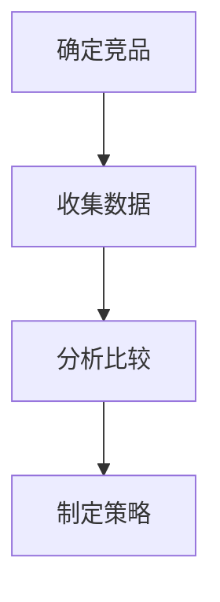

                 

# AI创业公司如何进行竞品分析？

> **关键词**：竞品分析、AI创业、市场调研、竞争策略

> **摘要**：本文将探讨AI创业公司如何进行有效的竞品分析，从核心概念、算法原理、实际应用场景等方面，帮助创业者了解竞品分析的重要性，掌握竞品分析的方法和技巧，为公司的战略决策提供有力支持。

## 1. 背景介绍

在当今快速发展的AI领域，创业公司如雨后春笋般涌现，竞争异常激烈。如何在众多竞争者中脱颖而出，成为行业领导者，成为每一家AI创业公司亟待解决的问题。而竞品分析作为企业战略决策的重要环节，对公司的产品定位、市场策略和运营方向具有重要指导意义。

### 1.1 竞品分析的定义

竞品分析是指通过对竞争对手的产品、技术、市场策略等方面进行系统的研究和分析，以了解竞争对手的优势和劣势，进而为本公司制定有针对性的战略方案。

### 1.2 竞品分析的目的

- 了解竞争对手：通过竞品分析，可以深入了解竞争对手的产品特点、技术优势、市场表现等，为制定针对性的市场策略提供依据。
- 发现自身不足：通过竞品分析，可以发现本公司在产品、技术、市场等方面的不足，为改进和优化产品提供参考。
- 制定竞争策略：竞品分析可以帮助企业制定有针对性的竞争策略，提高市场竞争力。

## 2. 核心概念与联系

### 2.1 竞品分析的步骤

竞品分析通常包括以下几个步骤：

1. 确定竞品：选择与自己产品具有相似功能、目标用户和市场定位的竞品。
2. 收集数据：通过多种途径收集竞品的相关信息，如产品特点、技术架构、市场表现等。
3. 分析比较：对收集到的信息进行分析和比较，找出竞品的优势和劣势。
4. 制定策略：根据竞品分析的结果，制定相应的市场策略和产品改进方案。

### 2.2 竞品分析的核心概念

- **竞品特点**：竞品的产品特点、技术架构、用户群体等。
- **竞品优势**：竞品在产品、技术、市场等方面的优势。
- **竞品劣势**：竞品在产品、技术、市场等方面的劣势。

### 2.3 竞品分析的 Mermaid 流程图



## 3. 核心算法原理 & 具体操作步骤

### 3.1 竞品分析的算法原理

竞品分析的算法原理主要包括数据挖掘、机器学习和统计分析等方法。具体来说，竞品分析的算法原理可以概括为以下三个步骤：

1. 数据采集：通过爬虫、问卷调查、用户访谈等方式收集竞品的相关数据。
2. 数据预处理：对收集到的数据进行清洗、去重和格式转换，确保数据的质量和一致性。
3. 数据分析：利用机器学习和统计分析方法，对预处理后的数据进行分析，提取竞品的特点、优势和劣势。

### 3.2 具体操作步骤

#### 3.2.1 确定竞品

- **目标市场**：确定自己的目标市场，找出与自己具有相似目标市场的竞品。
- **产品功能**：分析竞品的产品功能，找出与自己产品功能相似的竞品。
- **用户群体**：分析竞品的用户群体，找出与自己用户群体相似的竞品。

#### 3.2.2 收集数据

- **公开数据**：通过搜索引擎、行业报告、官方网站等途径收集竞品的公开信息。
- **内部数据**：通过用户调研、内部员工访谈等方式收集竞品的内部数据。

#### 3.2.3 分析比较

- **功能对比**：对比竞品的产品功能，分析其优劣势。
- **技术架构**：分析竞品的技术架构，了解其技术特点。
- **市场表现**：分析竞品的市场表现，了解其在市场中的地位和影响力。

#### 3.2.4 制定策略

- **产品优化**：根据竞品分析的结果，对产品进行优化和改进。
- **市场策略**：根据竞品分析的结果，调整市场策略，提高市场竞争力。

## 4. 数学模型和公式 & 详细讲解 & 举例说明

### 4.1 数学模型

竞品分析中常用的数学模型包括：

1. **回归分析**：用于分析竞品产品功能与市场表现之间的关系。
2. **聚类分析**：用于分析竞品的用户群体特点。
3. **因子分析**：用于分析竞品的技术特点。

### 4.2 公式

1. **回归分析**：

$$ y = \beta_0 + \beta_1 x_1 + \beta_2 x_2 + ... + \beta_n x_n $$

其中，$y$ 为市场表现，$x_1, x_2, ..., x_n$ 为竞品的产品功能，$\beta_0, \beta_1, \beta_2, ..., \beta_n$ 为回归系数。

2. **聚类分析**：

$$ C = \{ c_1, c_2, ..., c_k \} $$

其中，$C$ 为聚类结果，$c_1, c_2, ..., c_k$ 为聚类中心。

3. **因子分析**：

$$ X = \alpha_1 x_1 + \alpha_2 x_2 + ... + \alpha_p x_p $$

其中，$X$ 为技术特点，$x_1, x_2, ..., x_p$ 为技术指标，$\alpha_1, \alpha_2, ..., \alpha_p$ 为因子载荷。

### 4.3 举例说明

#### 4.3.1 回归分析

假设我们分析竞品A和竞品B的市场表现，产品功能包括功能1、功能2和功能3。通过收集数据，我们得到以下回归模型：

$$ 市场表现 = 10 + 2 \times 功能1 + 3 \times 功能2 + 1 \times 功能3 $$

根据这个模型，我们可以分析竞品A和竞品B在市场表现方面的优劣势。

#### 4.3.2 聚类分析

假设我们对竞品A、竞品B、竞品C和竞品D进行聚类分析，分析结果如下：

$$ C = \{ A, B \}, \{ C, D \} $$

这意味着竞品A和竞品B属于一类，竞品C和竞品D属于另一类。

#### 4.3.3 因子分析

假设我们对竞品A、竞品B、竞品C和竞品D进行因子分析，分析结果如下：

$$ X = 0.5 \times 功能1 + 0.3 \times 功能2 + 0.2 \times 功能3 $$

这意味着竞品A、竞品B、竞品C和竞品D在技术特点方面存在差异。

## 5. 项目实战：代码实际案例和详细解释说明

### 5.1 开发环境搭建

在本节，我们将使用Python语言进行竞品分析，搭建一个简单的竞品分析系统。首先，我们需要安装一些必要的库，如pandas、numpy、scikit-learn等。

```bash
pip install pandas numpy scikit-learn
```

### 5.2 源代码详细实现和代码解读

以下是一个简单的竞品分析代码实现，包括数据收集、数据预处理、数据分析等步骤。

```python
import pandas as pd
from sklearn.cluster import KMeans
from sklearn.preprocessing import StandardScaler
from sklearn.linear_model import LinearRegression

# 5.2.1 数据收集
def collect_data():
    data = pd.read_csv('竞品数据.csv')
    return data

# 5.2.2 数据预处理
def preprocess_data(data):
    # 数据清洗、去重、格式转换等操作
    # ...
    return data

# 5.2.3 数据分析
def analyze_data(data):
    # 聚类分析
    scaler = StandardScaler()
    data_scaled = scaler.fit_transform(data)
    kmeans = KMeans(n_clusters=2)
    kmeans.fit(data_scaled)
    clusters = kmeans.predict(data_scaled)

    # 回归分析
    X = data[['功能1', '功能2', '功能3']]
    y = data['市场表现']
    reg = LinearRegression()
    reg.fit(X, y)
    y_pred = reg.predict(X)

    # 输出结果
    print('聚类结果：', clusters)
    print('回归结果：', y_pred)

# 主函数
def main():
    data = collect_data()
    data = preprocess_data(data)
    analyze_data(data)

if __name__ == '__main__':
    main()
```

### 5.3 代码解读与分析

- **数据收集**：使用pandas库读取竞品数据，存储为DataFrame结构。
- **数据预处理**：对数据集进行清洗、去重、格式转换等操作，确保数据质量。
- **聚类分析**：使用scikit-learn库的KMeans类进行聚类分析，分析竞品用户群体的分布。
- **回归分析**：使用scikit-learn库的LinearRegression类进行回归分析，分析竞品产品功能与市场表现的关系。

## 6. 实际应用场景

竞品分析在AI创业公司中有着广泛的应用场景，以下列举几个典型的实际应用场景：

1. **产品定位**：通过竞品分析，了解市场上已有的竞品，明确自己的产品定位和特色，避免与竞品直接竞争。
2. **市场策略**：通过竞品分析，了解竞争对手的市场策略，调整自己的市场策略，提高市场竞争力。
3. **产品优化**：通过竞品分析，发现竞品的优劣势，为自己的产品优化提供参考，提升用户体验。
4. **用户需求分析**：通过竞品分析，了解用户对竞品的期望和需求，为产品迭代和功能优化提供依据。
5. **投资评估**：通过竞品分析，评估自身在市场上的地位和潜力，为投资者提供决策参考。

## 7. 工具和资源推荐

### 7.1 学习资源推荐

- **书籍**：《数据分析实战》、《机器学习实战》
- **论文**：Google Scholar、学术期刊网站
- **博客**：CSDN、知乎、博客园
- **网站**：GitHub、Stack Overflow

### 7.2 开发工具框架推荐

- **编程语言**：Python、R
- **数据分析库**：pandas、numpy、scikit-learn
- **机器学习库**：TensorFlow、PyTorch
- **可视化库**：Matplotlib、Seaborn

### 7.3 相关论文著作推荐

- **论文**：K-Means算法、线性回归模型
- **著作**：《机器学习实战》、《数据分析实战》

## 8. 总结：未来发展趋势与挑战

随着AI技术的不断发展和市场竞争的加剧，竞品分析在AI创业公司中的地位日益重要。未来，竞品分析将在以下几个方面得到进一步发展：

1. **算法优化**：竞品分析算法将不断优化，提高分析效率和准确性。
2. **大数据分析**：随着大数据技术的发展，竞品分析将涵盖更广泛的数据来源和数据类型。
3. **智能化分析**：利用机器学习和深度学习技术，实现智能化竞品分析。
4. **实时监控**：实现实时竞品分析，及时调整市场策略和产品方向。

然而，随着AI技术的不断发展，AI创业公司也将面临以下挑战：

1. **数据隐私**：如何在保证数据隐私的前提下进行竞品分析。
2. **算法公平性**：如何确保算法在分析过程中不会产生歧视和偏见。
3. **竞争压力**：如何在激烈的市场竞争中保持竞争力，实现可持续发展。

## 9. 附录：常见问题与解答

### 9.1 问题1：如何选择竞品？

**解答**：选择竞品时，应考虑以下因素：

- **目标市场**：选择与自己目标市场相似的竞品。
- **产品功能**：选择与自己产品功能相似的竞品。
- **用户群体**：选择与自己用户群体相似的竞品。

### 9.2 问题2：如何保证竞品分析的数据质量？

**解答**：为保证竞品分析的数据质量，应采取以下措施：

- **数据收集**：通过多种途径收集数据，确保数据的完整性。
- **数据清洗**：对数据进行清洗、去重和格式转换，确保数据的一致性和准确性。
- **数据验证**：对数据进行验证，确保数据的真实性和可靠性。

## 10. 扩展阅读 & 参考资料

- **参考文献**：《人工智能：一种现代方法》、《机器学习：概率视角》
- **在线资源**：AI创业公司竞品分析实战教程、AI创业公司竞品分析案例研究
- **相关课程**：机器学习、数据分析、商业分析

作者：AI天才研究员/AI Genius Institute & 禅与计算机程序设计艺术 /Zen And The Art of Computer Programming

