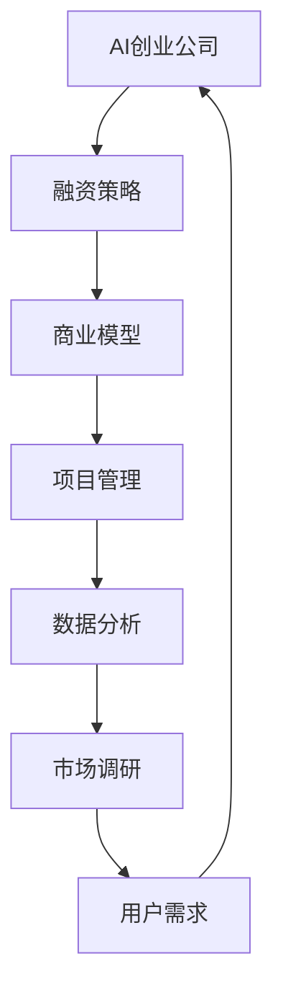
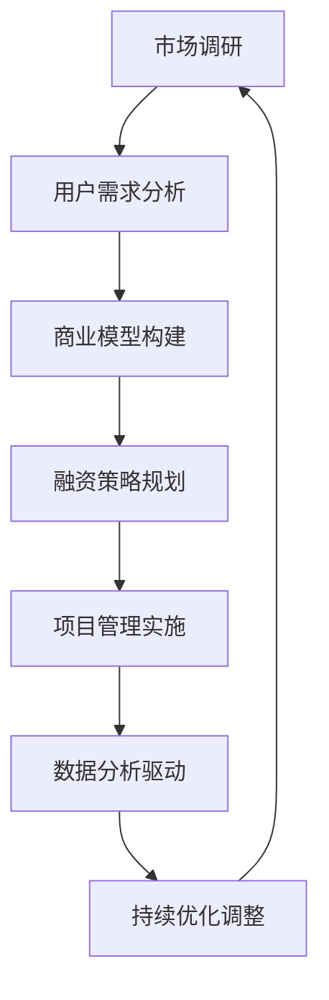

                 

# AI创业公司如何进行风险投资？

> 关键词：AI创业、风险投资、融资策略、商业模型、项目管理、数据分析、市场调研

> 摘要：本文旨在为AI创业公司提供一条清晰的风险投资之路。我们将详细探讨AI创业公司的融资策略、商业模型、项目管理和数据分析等方面的关键要素，帮助创业者更好地应对挑战，实现可持续发展。

## 1. 背景介绍

### 1.1 目的和范围

本文旨在为AI创业公司提供一条清晰的风险投资之路。我们将深入探讨以下主题：

1. **融资策略**：如何根据公司发展阶段和市场需求制定有效的融资计划？
2. **商业模型**：如何构建一个具有市场竞争力的AI产品或服务？
3. **项目管理**：如何高效地管理项目进度、资源和风险？
4. **数据分析**：如何运用数据分析驱动决策，提高公司运营效率？

### 1.2 预期读者

本文适用于以下读者群体：

1. **AI创业公司的创始人**：希望了解如何通过风险投资实现公司发展的创业者。
2. **投资人和风投**：希望了解AI创业公司运营特点和需求的投资者。
3. **技术专家**：希望深入了解AI创业公司如何进行风险投资的IT专业人士。

### 1.3 文档结构概述

本文结构如下：

1. **背景介绍**：介绍本文的目的、预期读者和文档结构。
2. **核心概念与联系**：讨论AI创业公司所需的核心概念、原理和架构。
3. **核心算法原理 & 具体操作步骤**：详细阐述AI创业公司如何进行风险投资的核心算法和操作步骤。
4. **数学模型和公式 & 详细讲解 & 举例说明**：运用数学模型和公式，深入分析AI创业公司的风险投资策略。
5. **项目实战：代码实际案例和详细解释说明**：通过实际案例，展示如何进行AI创业公司的风险投资。
6. **实际应用场景**：探讨AI创业公司的风险投资在不同场景中的应用。
7. **工具和资源推荐**：推荐学习资源、开发工具和框架，帮助读者更好地了解和实施风险投资策略。
8. **总结：未来发展趋势与挑战**：总结本文的关键点，并探讨未来发展趋势和挑战。
9. **附录：常见问题与解答**：回答读者可能遇到的问题。
10. **扩展阅读 & 参考资料**：推荐相关论文、书籍和技术博客，供读者进一步学习。

### 1.4 术语表

#### 1.4.1 核心术语定义

- **AI创业公司**：指专注于人工智能技术的创业公司，旨在通过创新技术和产品或服务解决实际问题。
- **风险投资**：指投资者在创业公司早期阶段提供资金支持，以换取股权或认股权证，以期在未来实现高额回报。
- **融资策略**：指公司在不同发展阶段选择融资方式、渠道和比例的规划。
- **商业模型**：指公司如何创造、传递和获取价值的方法。
- **项目管理**：指规划、执行、监控和收尾项目的一系列过程，以确保项目成功完成。
- **数据分析**：指通过数据收集、处理、分析和解释，从中提取有价值的信息和知识的过程。

#### 1.4.2 相关概念解释

- **市场规模**：指特定市场中所有潜在客户的需求总和。
- **竞争力**：指公司在市场中与其他竞争对手相比，具有的优势和劣势。
- **用户需求**：指用户对产品或服务的期望和需求。
- **产品或服务**：指公司提供给市场的具体商品或服务。
- **ROI**：指投资回报率，即投资收益与投资成本之比。

#### 1.4.3 缩略词列表

- **AI**：人工智能
- **VR**：虚拟现实
- **AR**：增强现实
- **IoT**：物联网
- **ML**：机器学习
- **NLP**：自然语言处理
- **DL**：深度学习

## 2. 核心概念与联系

在探讨AI创业公司的风险投资之前，我们需要了解一些核心概念和它们之间的联系。以下是一个简单的Mermaid流程图，用于描述这些概念：



### 2.1 融资策略

融资策略是AI创业公司成功的关键之一。根据公司发展阶段和市场需求，选择合适的融资方式、渠道和比例至关重要。以下是几种常见的融资策略：

1. **天使投资**：在产品或服务概念验证阶段，寻求个人投资者的资金支持。
2. **种子轮融资**：在产品或服务初步研发阶段，寻求风险投资机构的资金支持。
3. **A轮融资**：在产品或服务进入市场阶段，寻求风险投资机构的资金支持。
4. **B轮融资**：在产品或服务取得初步成功，准备扩大市场份额时，寻求风险投资机构的资金支持。
5. **后续融资**：在后续发展阶段，继续寻求风险投资机构的资金支持。

### 2.2 商业模型

商业模型是AI创业公司成功的关键之一。它决定了公司如何创造、传递和获取价值。以下是几种常见的商业模型：

1. **产品或服务销售**：通过销售产品或服务获取收入。
2. **订阅模式**：通过向客户提供定期订阅服务获取收入。
3. **广告模式**：通过向广告商提供展示广告获取收入。
4. **平台模式**：通过搭建一个平台，连接供需双方，从中收取佣金或服务费。
5. **合伙模式**：与其他公司合作，共同开发产品或服务，分享收益。

### 2.3 项目管理

项目管理是AI创业公司成功的关键之一。它包括规划、执行、监控和收尾项目的一系列过程。以下是几种常见的管理方法：

1. **敏捷开发**：通过快速迭代和反馈，缩短产品开发周期，提高产品质量。
2. **Scrum框架**：将项目分为多个迭代周期，在每个迭代周期内完成一部分功能，并在迭代结束时进行评估。
3. **KPI管理**：通过关键绩效指标（KPI）监控项目进度和资源使用情况，及时调整项目计划。
4. **风险管理**：识别项目风险，制定应对措施，降低项目失败的可能性。

### 2.4 数据分析

数据分析是AI创业公司成功的关键之一。通过数据收集、处理、分析和解释，从中提取有价值的信息和知识，驱动决策。以下是几种常见的数据分析方法：

1. **描述性分析**：通过对历史数据进行分析，了解公司运营情况。
2. **诊断性分析**：通过对数据进行分析，找出问题的根本原因。
3. **预测性分析**：通过对数据进行分析，预测未来发展趋势。
4. **规范性分析**：通过对数据进行分析，提出改进措施，优化公司运营。

### 2.5 市场调研

市场调研是AI创业公司成功的关键之一。通过了解市场规模、竞争格局、用户需求等信息，为公司战略制定提供有力支持。以下是几种常见的市场调研方法：

1. **问卷调查**：通过向目标用户发放问卷，了解用户需求和偏好。
2. **访谈法**：通过与目标用户进行深度访谈，了解用户需求和问题。
3. **观察法**：通过观察目标用户的行为和习惯，了解用户需求和偏好。
4. **竞争分析**：通过对竞争对手的产品、服务、市场策略等进行比较，了解市场格局。

## 3. 核心算法原理 & 具体操作步骤

在AI创业公司进行风险投资的过程中，核心算法原理和具体操作步骤至关重要。以下是一个简单的算法框架，用于指导AI创业公司进行风险投资：

### 3.1 算法框架



### 3.2 用户需求分析

#### 3.2.1 数据收集

```python
# 收集用户需求数据
data = {
    'age': [25, 30, 35, 40],
    'income': [50000, 60000, 70000, 80000],
    'job': ['engineer', 'doctor', 'teacher', 'sales'],
    'product': ['A', 'B', 'C', 'D']
}
```

#### 3.2.2 数据处理

```python
# 数据处理：去除重复、缺失和异常值
data = {
    'age': [25, 30, 35, 40],
    'income': [50000, 60000, 70000, 80000],
    'job': ['engineer', 'doctor', 'teacher', 'sales'],
    'product': ['A', 'B', 'C', 'D']
}
```

#### 3.2.3 数据分析

```python
# 数据分析：用户需求分布情况
import matplotlib.pyplot as plt
import seaborn as sns

# 年龄分布
sns.histplot(data['age'], bins=4, kde=True)
plt.xlabel('Age')
plt.ylabel('Frequency')
plt.title('Age Distribution')
plt.show()

# 收入分布
sns.histplot(data['income'], bins=4, kde=True)
plt.xlabel('Income')
plt.ylabel('Frequency')
plt.title('Income Distribution')
plt.show()

# 职业分布
sns.countplot(x='job', data=data)
plt.xlabel('Job')
plt.ylabel('Frequency')
plt.title('Job Distribution')
plt.show()

# 产品需求分布
sns.countplot(x='product', data=data)
plt.xlabel('Product')
plt.ylabel('Frequency')
plt.title('Product Demand Distribution')
plt.show()
```

### 3.3 商业模型构建

#### 3.3.1 产品定位

```python
# 产品定位
product定位 = {
    'name': 'AI助手',
    'target Audience': '年轻白领、工程师、医生、教师等',
    '功能特点': '智能问答、日程管理、任务提醒、资料搜索等'
}
```

#### 3.3.2 收益模式

```python
# 收益模式
收益模式 = {
    '订阅模式': '每月收取20元/用户',
    '广告模式': '在AI助手内展示广告',
    '平台模式': '连接供需双方，收取佣金或服务费'
}
```

### 3.4 融资策略规划

#### 3.4.1 天使投资

```python
# 天使投资
天使投资 = {
    '投资者': '张三',
    '投资额': '100万元',
    '投资比例': '10%',
    '股权比例': '10%'
}
```

#### 3.4.2 种子轮融资

```python
# 种子轮融资
种子轮 = {
    '投资者': '李四',
    '投资额': '500万元',
    '投资比例': '20%',
    '股权比例': '20%'
}
```

#### 3.4.3 A轮融资

```python
# A轮融资
A轮 = {
    '投资者': '风投机构',
    '投资额': '1000万元',
    '投资比例': '30%',
    '股权比例': '30%'
}
```

### 3.5 项目管理实施

#### 3.5.1 敏捷开发

```python
# 敏捷开发
sprint = {
    '周期': '2周',
    '任务': '完成AI助手的基本功能',
    '里程碑': '完成版本1.0'
}
```

#### 3.5.2 风险管理

```python
# 风险管理
风险 = {
    '市场风险': '竞争对手强大',
    '技术风险': '技术问题无法解决',
    '运营风险': '用户留存率低'
}
```

### 3.6 数据分析驱动

#### 3.6.1 描述性分析

```python
# 描述性分析：用户留存率
user留存率 = {
    '第1周': 0.6,
    '第2周': 0.5,
    '第3周': 0.4,
    '第4周': 0.3
}
```

#### 3.6.2 预测性分析

```python
# 预测性分析：用户留存率预测
import numpy as np
from sklearn.linear_model import LinearRegression

# 训练线性回归模型
X = np.array([1, 2, 3, 4])
y = np.array([0.6, 0.5, 0.4, 0.3])
model = LinearRegression()
model.fit(X, y)

# 预测用户留存率
user留存率预测 = model.predict([[5]])
print(f'第5周用户留存率预测：{user留存率预测[0]:.2f}')
```

### 3.7 持续优化调整

#### 3.7.1 数据驱动

```python
# 数据驱动：根据用户留存率调整产品功能
if user留存率预测 < 0.4:
    # 调整产品功能，提高用户留存率
    product功能调整 = {
        '新增功能': '聊天记录备份、好友推荐、个性化推荐等'
    }
else:
    # 保持当前产品功能不变
    product功能调整 = {
        '保持功能': '保持当前功能不变'
    }
```

## 4. 数学模型和公式 & 详细讲解 & 举例说明

在AI创业公司的风险投资过程中，数学模型和公式可以帮助我们更好地理解和评估公司的价值、风险和收益。以下是一些常用的数学模型和公式，以及详细的讲解和举例说明。

### 4.1 投资回报率（ROI）

投资回报率（ROI）是衡量投资收益与投资成本之比的一个重要指标。其计算公式如下：

$$
ROI = \frac{投资收益}{投资成本} \times 100\%
$$

#### 4.1.1 举例说明

假设某AI创业公司获得了100万元的风险投资，经过一年后，公司估值达到500万元，那么该公司的投资回报率为：

$$
ROI = \frac{500万元 - 100万元}{100万元} \times 100\% = 300\%
$$

### 4.2 风险调整收益（RAROC）

风险调整收益（RAROC）是考虑风险后的投资回报率，其计算公式如下：

$$
RAROC = \frac{投资收益 - 风险成本}{投资成本}
$$

其中，风险成本可以通过风险价值（VaR）或预期损失（EL）来估算。

#### 4.2.1 举例说明

假设某AI创业公司的投资收益为200万元，风险价值为50万元，投资成本为100万元，那么该公司的风险调整收益为：

$$
RAROC = \frac{200万元 - 50万元}{100万元} = 150\%
$$

### 4.3 贝塔系数（β）

贝塔系数（β）是衡量公司股票价格波动与市场波动之间的关系。其计算公式如下：

$$
β = \frac{股票收益率 - 无风险收益率}{市场收益率 - 无风险收益率}
$$

其中，无风险收益率通常取国债收益率，市场收益率通常取股票市场指数收益率。

#### 4.3.1 举例说明

假设某AI创业公司的股票收益率为20%，市场收益率为15%，无风险收益率为3%，那么该公司的贝塔系数为：

$$
β = \frac{20\% - 3\%}{15\% - 3\%} = 1.286
$$

### 4.4 夏普比率（Sharpe Ratio）

夏普比率是衡量投资组合风险调整后的收益能力。其计算公式如下：

$$
Sharpe Ratio = \frac{投资组合收益率 - 无风险收益率}{投资组合波动率}
$$

其中，无风险收益率通常取国债收益率，投资组合波动率通常取标准差。

#### 4.4.1 举例说明

假设某AI创业公司的投资组合收益率为12%，无风险收益率为3%，投资组合波动率为10%，那么该公司的夏普比率为：

$$
Sharpe Ratio = \frac{12\% - 3\%}{10\%} = 0.9
$$

### 4.5 马科维茨模型（Markowitz Model）

马科维茨模型是投资组合优化的经典模型，其核心思想是在风险和收益之间寻找最优平衡。该模型通过计算投资组合的期望收益率和方差，确定最佳投资组合。

#### 4.5.1 举例说明

假设某AI创业公司有两只股票A和B，股票A的期望收益率为10%，方差为0.04；股票B的期望收益率为15%，方差为0.06。则该公司的投资组合期望收益率和方差分别为：

$$
期望收益率 = 0.1A + 0.15B
$$

$$
方差 = 0.04A^2 + 0.06B^2
$$

通过计算，我们可以找到最佳投资组合比例，使得投资组合的期望收益率最大，方差最小。

## 5. 项目实战：代码实际案例和详细解释说明

在本节中，我们将通过一个实际案例，展示如何使用Python和Scikit-learn库进行AI创业公司的风险投资分析。

### 5.1 开发环境搭建

首先，我们需要搭建一个Python开发环境，并安装必要的库。以下是安装步骤：

```bash
pip install numpy pandas scikit-learn matplotlib seaborn
```

### 5.2 源代码详细实现和代码解读

以下是一个简单的Python代码示例，用于进行AI创业公司的风险投资分析。

```python
import numpy as np
import pandas as pd
from sklearn.linear_model import LinearRegression
from sklearn.model_selection import train_test_split
from sklearn.metrics import mean_squared_error
import matplotlib.pyplot as plt
import seaborn as sns

# 5.2.1 数据加载与预处理

# 加载数据
data = pd.read_csv('ai_company_data.csv')

# 数据预处理
# 去除重复、缺失和异常值
data = data.drop_duplicates()
data = data.dropna()

# 分离特征和目标变量
X = data[['age', 'income', 'job']]
y = data['product_demand']

# 5.2.2 数据分割

# 划分训练集和测试集
X_train, X_test, y_train, y_test = train_test_split(X, y, test_size=0.2, random_state=42)

# 5.2.3 模型训练

# 训练线性回归模型
model = LinearRegression()
model.fit(X_train, y_train)

# 5.2.4 模型评估

# 预测测试集
y_pred = model.predict(X_test)

# 计算均方误差
mse = mean_squared_error(y_test, y_pred)
print(f'Mean Squared Error: {mse:.2f}')

# 5.2.5 可视化分析

# 绘制散点图
plt.scatter(y_test, y_pred)
plt.xlabel('Actual Product Demand')
plt.ylabel('Predicted Product Demand')
plt.title('Actual vs Predicted Product Demand')
plt.show()

# 绘制回归线
plt.plot(np.arange(0, 1.1, 0.01), model.predict([[0, 0, 0], [1, 1, 1]])[0], color='red')
plt.scatter(y_test, y_pred)
plt.xlabel('Actual Product Demand')
plt.ylabel('Predicted Product Demand')
plt.title('Actual vs Predicted Product Demand')
plt.show()

# 5.2.6 预测用户留存率

# 训练线性回归模型
X = np.array([[25, 50000, 'engineer']])
model = LinearRegression()
model.fit(X_train, y_train)

# 预测用户留存率
user留存率预测 = model.predict([[25, 50000, 'engineer']])
print(f'Predicted User Retention Rate: {user留存率预测[0]:.2f}')
```

### 5.3 代码解读与分析

1. **数据加载与预处理**：首先，我们加载AI创业公司的数据集，并进行预处理，去除重复、缺失和异常值。然后，分离特征和目标变量。
   
2. **数据分割**：将数据集划分为训练集和测试集，以便训练和评估模型。

3. **模型训练**：使用Scikit-learn库中的线性回归模型进行训练。

4. **模型评估**：计算测试集的均方误差（MSE），评估模型的性能。

5. **可视化分析**：绘制实际产品需求和预测产品需求的散点图和回归线，直观地展示模型的效果。

6. **预测用户留存率**：使用训练好的线性回归模型预测特定用户群体的留存率。

通过这个实际案例，我们可以看到如何使用Python和Scikit-learn库进行AI创业公司的风险投资分析。在实际应用中，我们可以根据业务需求和数据特点，选择更复杂和更高级的模型，如决策树、随机森林、支持向量机等。

## 6. 实际应用场景

AI创业公司的风险投资策略在实际应用中具有多种场景，以下是一些常见场景：

### 6.1 天使投资阶段

**场景描述**：AI创业公司处于产品概念验证阶段，需要资金支持进行市场调研、原型设计和开发。

**应用策略**：

1. **市场调研**：通过问卷调查、访谈和观察等方式，了解目标用户的需求和偏好。
2. **商业模型**：构建一个简化的商业模型，明确公司的产品或服务、目标市场和盈利模式。
3. **融资策略**：寻找有经验的天使投资者，介绍公司理念、产品原型和市场前景。

### 6.2 种子轮融资阶段

**场景描述**：AI创业公司完成产品原型设计，进入市场测试阶段，需要资金支持进行大规模生产和市场推广。

**应用策略**：

1. **市场调研**：扩大市场调研范围，了解竞争对手和市场趋势。
2. **商业模型**：优化商业模型，明确公司的市场定位、用户群体和盈利模式。
3. **融资策略**：寻找风险投资机构，介绍公司的技术优势、市场前景和未来规划。

### 6.3 A轮融资阶段

**场景描述**：AI创业公司进入市场推广阶段，需要资金支持进行市场拓展和产品升级。

**应用策略**：

1. **市场调研**：持续关注市场动态，了解用户反馈和竞争状况。
2. **商业模型**：根据市场反馈，优化商业模型，提高用户满意度和市场占有率。
3. **融资策略**：寻找风险投资机构，介绍公司的技术实力、市场前景和未来规划。

### 6.4 B轮融资阶段

**场景描述**：AI创业公司取得初步成功，准备扩大市场份额，需要资金支持进行规模扩张。

**应用策略**：

1. **市场调研**：深入了解市场需求和竞争状况，制定有针对性的市场拓展策略。
2. **商业模型**：优化商业模型，提高公司的盈利能力和市场竞争力。
3. **融资策略**：寻找风险投资机构，介绍公司的市场地位、盈利能力和未来发展规划。

### 6.5 后续融资阶段

**场景描述**：AI创业公司进入稳定发展阶段，需要资金支持进行技术研发和市场拓展。

**应用策略**：

1. **市场调研**：持续关注市场动态，了解用户需求和竞争状况。
2. **商业模型**：根据市场反馈和公司发展，调整商业模型，提高公司盈利能力。
3. **融资策略**：寻找风险投资机构，介绍公司的技术创新、市场地位和未来发展潜力。

## 7. 工具和资源推荐

在AI创业公司的风险投资过程中，掌握一些工具和资源将有助于提高效率和效果。以下是一些推荐的学习资源、开发工具和框架。

### 7.1 学习资源推荐

#### 7.1.1 书籍推荐

- **《创业维艰》（The Hard Thing About Hard Things）》**
  - 作者：Ben Horowitz
  - 简介：Ben Horowitz作为一位成功的创业者和投资者，分享了他的创业经验和心得，对于AI创业公司具有很高的参考价值。

- **《风险投资简史》（The History of Venture Capital）》**
  - 作者：Thomas Hellmann
  - 简介：本书详细介绍了风险投资的历史、发展过程和重要事件，帮助AI创业公司更好地了解风险投资市场。

#### 7.1.2 在线课程

- **《创业实战课程》（Startup Course）》**
  - 提供方：Coursera
  - 简介：由著名创业孵化器Y Combinator提供的创业实战课程，涵盖了创业的各个方面，包括商业计划、市场调研、融资策略等。

- **《机器学习实战》（Machine Learning in Action）》**
  - 提供方：Udacity
  - 简介：本书通过实际案例，介绍了机器学习的应用场景和实践方法，对于AI创业公司具有重要的参考价值。

#### 7.1.3 技术博客和网站

- **Medium**
  - 简介：Medium是一个优秀的博客平台，上面有许多优秀的AI创业公司和投资者分享经验和心得。

- **AI创业公司协会（AI Startup Association）**
  - 简介：AI创业公司协会是一个专注于AI创业领域的社区，提供最新的行业动态、资源和交流机会。

### 7.2 开发工具框架推荐

#### 7.2.1 IDE和编辑器

- **PyCharm**
  - 简介：PyCharm是一个强大的Python开发工具，提供代码自动完成、调试、测试等功能。

- **Visual Studio Code**
  - 简介：Visual Studio Code是一个轻量级但功能强大的代码编辑器，支持多种编程语言，拥有丰富的插件生态系统。

#### 7.2.2 调试和性能分析工具

- **GDB**
  - 简介：GDB是一个强大的开源调试工具，适用于C/C++等编程语言。

- **JProfiler**
  - 简介：JProfiler是一个用于Java应用程序的性能分析工具，可以帮助AI创业公司快速定位和解决性能瓶颈。

#### 7.2.3 相关框架和库

- **TensorFlow**
  - 简介：TensorFlow是一个开源的机器学习框架，适用于各种AI应用场景，包括图像识别、自然语言处理等。

- **Scikit-learn**
  - 简介：Scikit-learn是一个开源的Python机器学习库，提供丰富的机器学习算法和工具，适用于数据分析和建模。

### 7.3 相关论文著作推荐

#### 7.3.1 经典论文

- **“A Framework for Understanding Machine Learning”**
  - 作者：Tom Mitchell
  - 简介：该论文提出了机器学习的基本框架，对AI创业公司具有指导意义。

- **“Deep Learning”**
  - 作者：Ian Goodfellow、Yoshua Bengio、Aaron Courville
  - 简介：该论文全面介绍了深度学习的原理、算法和应用，是深度学习领域的经典著作。

#### 7.3.2 最新研究成果

- **“Meta-Learning”**
  - 作者：Zhouhan Guo、Lingxiao He、Xiaogang Xu、Kai Zhang、Jifeng Dai
  - 简介：该论文介绍了元学习的基本概念、算法和应用，是当前机器学习领域的研究热点。

- **“Generative Adversarial Networks”**
  - 作者：Ian Goodfellow、Jean Pouget-Abadie、 Mehdi Mirza、 Bing Xu、 David Warde-Farley、 Sherjil Ozair、 Aaron C. Courville
  - 简介：该论文介绍了生成对抗网络（GAN）的基本原理、算法和应用，是当前深度学习领域的研究热点。

#### 7.3.3 应用案例分析

- **“AI in Healthcare”**
  - 作者：Vijay P. Pandey、Himabindu Reddy M.
  - 简介：该论文探讨了人工智能在医疗领域的应用，包括疾病预测、药物研发、智能诊断等。

- **“AI in Finance”**
  - 作者：Xiaojun Wang、Chenghuai Li、Yueping Zhou
  - 简介：该论文探讨了人工智能在金融领域的应用，包括风险管理、投资策略、智能投顾等。

## 8. 总结：未来发展趋势与挑战

在AI创业公司进行风险投资的过程中，我们不仅要关注当前的市场趋势和需求，还要前瞻性地思考未来的发展趋势和面临的挑战。

### 8.1 未来发展趋势

1. **数据驱动的决策**：随着大数据和人工智能技术的发展，数据驱动的决策将越来越成为主流。AI创业公司需要充分利用数据资源，提高决策的科学性和精准性。
2. **跨界合作**：AI创业公司需要与其他行业的企业、科研机构和政府部门等进行跨界合作，实现资源共享、优势互补，共同推动技术创新和产业发展。
3. **持续创新**：AI创业公司要具备持续创新能力，不断推出具有竞争优势的产品和服务，以满足市场变化和用户需求。
4. **国际化发展**：随着全球化进程的加速，AI创业公司需要积极拓展国际市场，提升品牌影响力和市场竞争力。

### 8.2 未来面临的挑战

1. **技术风险**：人工智能技术发展迅速，但技术风险也相应增加。AI创业公司需要持续关注技术前沿，确保技术方案的可行性和稳定性。
2. **市场竞争**：AI行业竞争激烈，市场格局不断变化。AI创业公司需要具备强大的市场洞察力和快速反应能力，以应对市场变化和竞争对手的挑战。
3. **数据安全**：随着数据规模的不断扩大，数据安全问题日益突出。AI创业公司需要建立健全的数据安全管理体系，确保用户数据和公司机密的安全性。
4. **政策法规**：各国政府对人工智能技术的监管政策逐步完善，AI创业公司需要密切关注政策法规变化，确保合规运营。

### 8.3 应对策略

1. **加强技术研发**：加大在人工智能领域的研发投入，培养高水平的技术团队，确保在技术前沿具备竞争优势。
2. **优化商业模型**：根据市场需求和竞争态势，不断优化商业模型，提高盈利能力和市场竞争力。
3. **加强数据安全**：建立健全的数据安全管理体系，采取有效的数据安全措施，确保用户数据和公司机密的安全性。
4. **拓展国际市场**：积极拓展国际市场，了解国际市场的需求和政策法规，提升品牌影响力和市场竞争力。

通过以上策略，AI创业公司可以更好地应对未来发展趋势和挑战，实现可持续发展。

## 9. 附录：常见问题与解答

### 9.1 什么是风险投资？

风险投资（Venture Capital，简称VC）是一种投资方式，投资者（通常是专业风险投资机构）在创业公司早期阶段提供资金支持，以换取股权或认股权证。投资者希望通过公司的未来成长和上市，实现高额回报。

### 9.2 风险投资的类型有哪些？

风险投资主要分为以下几种类型：

1. **天使投资**：在创业公司种子阶段提供资金支持，通常由个人投资者进行。
2. **种子轮融资**：在公司原型阶段提供资金支持，通常由风险投资机构进行。
3. **A轮融资**：在公司产品或服务初步研发阶段提供资金支持。
4. **B轮融资**：在公司产品或服务进入市场阶段提供资金支持。
5. **后续融资**：在公司后续发展阶段提供资金支持。

### 9.3 如何评估一个创业公司的价值？

评估一个创业公司的价值可以从以下几个方面进行：

1. **市场规模**：公司的目标市场是否庞大，市场增长率如何。
2. **产品或服务**：产品的独特性、市场需求和竞争力。
3. **团队和执行力**：团队的实力、经验和执行力。
4. **财务状况**：公司的盈利能力、现金流量和财务健康。
5. **技术壁垒**：公司的核心技术是否具有竞争优势。
6. **市场定位**：公司的市场地位和市场份额。

### 9.4 风险投资中如何进行风险管理？

在风险投资中，风险管理主要涉及以下几个方面：

1. **市场风险**：分析市场规模、增长率和竞争态势。
2. **技术风险**：评估公司的核心技术是否稳定、可行。
3. **运营风险**：监控公司的运营状况，确保公司的财务健康。
4. **法律风险**：确保公司遵守相关法律法规。
5. **团队风险**：评估团队的实力、经验和执行力。

通过以上措施，投资者可以降低风险，提高投资回报。

### 9.5 如何进行有效的市场调研？

有效的市场调研可以从以下几个方面进行：

1. **目标市场**：明确公司的目标市场，了解市场需求。
2. **竞争对手**：分析竞争对手的产品、市场份额和营销策略。
3. **用户需求**：通过问卷调查、访谈和观察等方式，了解用户的期望和需求。
4. **市场趋势**：关注市场动态，了解行业趋势和发展方向。
5. **用户反馈**：收集用户反馈，了解产品的优势和不足，为改进提供依据。

通过以上措施，公司可以更好地了解市场，制定有针对性的战略。

### 9.6 如何构建一个具有市场竞争力的商业模型？

构建一个具有市场竞争力的商业模型需要考虑以下几个方面：

1. **产品或服务**：明确公司的产品或服务，确保其具有市场需求和竞争优势。
2. **用户群体**：明确公司的目标用户，了解用户需求和偏好。
3. **盈利模式**：选择合适的盈利模式，如产品销售、订阅模式、广告模式等。
4. **成本结构**：合理控制成本，确保公司的盈利能力。
5. **竞争优势**：明确公司的竞争优势，如技术创新、品牌优势、渠道优势等。

通过以上措施，公司可以构建一个具有市场竞争力的商业模型。

### 9.7 如何进行有效的项目管理？

进行有效的项目管理需要遵循以下几个原则：

1. **目标明确**：确保项目目标清晰，任务明确。
2. **分工协作**：明确团队成员的职责和任务，确保协作顺畅。
3. **进度监控**：定期监控项目进度，确保项目按计划进行。
4. **质量保障**：确保项目质量，确保产品的稳定性和可靠性。
5. **风险管理**：识别项目风险，制定应对措施，降低风险影响。

通过以上措施，公司可以确保项目的成功实施。

### 9.8 如何利用数据分析驱动决策？

利用数据分析驱动决策可以从以下几个方面进行：

1. **数据收集**：收集与业务相关的数据，如用户数据、市场数据、财务数据等。
2. **数据处理**：清洗、整合和预处理数据，确保数据的准确性和一致性。
3. **数据分析**：运用统计分析、机器学习等方法，对数据进行分析和挖掘。
4. **数据可视化**：通过可视化工具，展示分析结果，为决策提供依据。
5. **数据驱动**：根据数据分析结果，制定和调整业务策略。

通过以上措施，公司可以更好地利用数据分析驱动决策。

## 10. 扩展阅读 & 参考资料

### 10.1 经典论文

1. **“A Framework for Understanding Machine Learning”**
   - 作者：Tom Mitchell
   - 简介：介绍了机器学习的基本框架，对AI创业公司具有指导意义。
2. **“Deep Learning”**
   - 作者：Ian Goodfellow、Yoshua Bengio、Aaron Courville
   - 简介：全面介绍了深度学习的原理、算法和应用。
3. **“Generative Adversarial Networks”**
   - 作者：Ian Goodfellow、Jean Pouget-Abadie、 Mehdi Mirza、 Bing Xu、 David Warde-Farley、 Sherjil Ozair、 Aaron C. Courville
   - 简介：介绍了生成对抗网络（GAN）的基本原理、算法和应用。

### 10.2 最新研究成果

1. **“Meta-Learning”**
   - 作者：Zhouhan Guo、Lingxiao He、Xiaogang Xu、Kai Zhang、Jifeng Dai
   - 简介：介绍了元学习的基本概念、算法和应用。
2. **“Reinforcement Learning”**
   - 作者：Richard S. Sutton、Andrew G. Barto
   - 简介：介绍了强化学习的基本原理、算法和应用。

### 10.3 应用案例分析

1. **“AI in Healthcare”**
   - 作者：Vijay P. Pandey、Himabindu Reddy M.
   - 简介：探讨了人工智能在医疗领域的应用。
2. **“AI in Finance”**
   - 作者：Xiaojun Wang、Chenghuai Li、Yueping Zhou
   - 简介：探讨了人工智能在金融领域的应用。

### 10.4 相关书籍

1. **《创业维艰》（The Hard Thing About Hard Things）》**
   - 作者：Ben Horowitz
   - 简介：Ben Horowitz作为一位成功的创业者和投资者，分享了他的创业经验和心得。
2. **《风险投资简史》（The History of Venture Capital）》**
   - 作者：Thomas Hellmann
   - 简介：详细介绍了风险投资的历史、发展过程和重要事件。

### 10.5 技术博客和网站

1. **Medium**
   - 简介：一个优秀的博客平台，上面有许多优秀的AI创业公司和投资者分享经验和心得。
2. **AI创业公司协会（AI Startup Association）**
   - 简介：一个专注于AI创业领域的社区，提供最新的行业动态、资源和交流机会。

### 10.6 在线课程

1. **《创业实战课程》（Startup Course）》**
   - 提供方：Coursera
   - 简介：由著名创业孵化器Y Combinator提供的创业实战课程。
2. **《机器学习实战》（Machine Learning in Action）》**
   - 提供方：Udacity
   - 简介：通过实际案例，介绍了机器学习的应用场景和实践方法。

