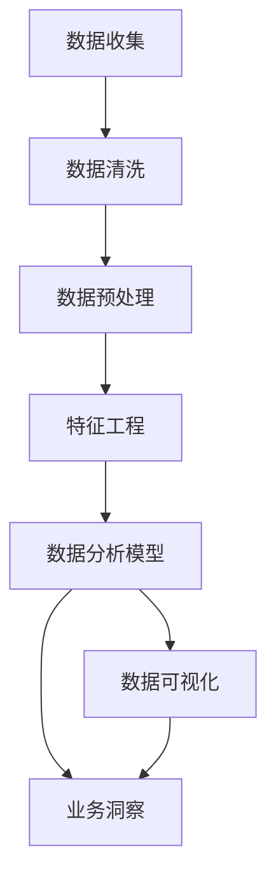

                 

# AI创业公司的产品数据分析与业务洞察：数据指标、数据报告与数据应用

## 关键词
- 产品数据分析
- 业务洞察
- 数据指标
- 数据报告
- 数据应用
- AI创业公司

## 摘要
本文将深入探讨AI创业公司在产品数据分析、业务洞察以及数据报告与数据应用方面的实践与策略。通过系统的分析框架、核心算法原理、数学模型与实际项目案例，本文旨在帮助AI创业公司更好地理解和利用数据，实现产品的优化和业务的增长。文章将涵盖数据指标的选择与解释、数据报告的制作与解读、数据在业务决策中的应用，以及未来发展趋势和挑战。本文不仅适合AI领域的创业者，也适用于对数据分析有兴趣的技术人员和管理者。

---

## 1. 背景介绍

### 1.1 目的和范围

本文的目标是指导AI创业公司在数据驱动的产品开发和业务运营中，如何进行有效的数据分析与业务洞察。本文的范围包括：

- 数据分析在AI产品开发中的应用场景
- 数据指标的设定与重要性
- 数据报告的构建与解读
- 数据驱动的业务决策
- 数据应用的案例与策略

### 1.2 预期读者

- AI创业公司的创始人、CTO和技术团队成员
- 数据科学家、数据分析师和技术经理
- 对数据驱动决策有兴趣的技术爱好者和管理者

### 1.3 文档结构概述

本文结构如下：

- **第1章：背景介绍**：概述本文的目的、范围和预期读者。
- **第2章：核心概念与联系**：介绍产品数据分析中的核心概念，并使用Mermaid流程图展示。
- **第3章：核心算法原理 & 具体操作步骤**：详细讲解产品数据分析中的核心算法原理和操作步骤。
- **第4章：数学模型和公式 & 详细讲解 & 举例说明**：介绍与产品数据分析相关的数学模型和公式，并通过例子说明其应用。
- **第5章：项目实战：代码实际案例和详细解释说明**：通过具体的项目案例展示数据分析的实际应用，并提供代码实现和解读。
- **第6章：实际应用场景**：探讨数据分析在不同业务场景中的应用。
- **第7章：工具和资源推荐**：推荐学习资源、开发工具框架和最新研究成果。
- **第8章：总结：未来发展趋势与挑战**：总结当前趋势和面临的挑战。
- **第9章：附录：常见问题与解答**：针对本文内容提供的常见问题与解答。
- **第10章：扩展阅读 & 参考资料**：推荐相关扩展阅读和参考资料。

### 1.4 术语表

#### 1.4.1 核心术语定义

- **数据指标**：用于衡量产品性能和业务效果的具体量化指标。
- **数据分析**：使用统计学、数据挖掘等方法，从数据中提取信息和知识的过程。
- **业务洞察**：通过对数据的分析，深入了解业务运营中的问题和机会。
- **数据报告**：以可视化形式展示数据分析结果和结论的文档。

#### 1.4.2 相关概念解释

- **数据驱动决策**：基于数据分析结果进行决策的过程。
- **数据可视化**：将数据以图表、图形等形式展示，以便于理解和分析。
- **特征工程**：从原始数据中提取有用特征，以提高数据分析模型的性能。

#### 1.4.3 缩略词列表

- **AI**：人工智能
- **ML**：机器学习
- **DL**：深度学习
- **KPI**：关键绩效指标
- **BI**：商业智能

---

## 2. 核心概念与联系

产品数据分析是一个复杂的过程，涉及多个核心概念和环节。为了更好地理解这些概念，我们将通过一个Mermaid流程图展示它们之间的关系。



### 2.1 数据收集

数据收集是产品数据分析的基础。创业公司需要从多个来源收集数据，包括用户行为数据、系统日志、市场数据等。这些数据将成为后续分析的输入。

### 2.2 数据清洗

数据清洗是确保数据质量的重要步骤。在这一步，我们将处理缺失值、异常值和重复值，以保证数据的准确性和一致性。

### 2.3 数据预处理

在数据预处理阶段，我们将对数据进行归一化、编码、聚合等操作，为特征工程和数据分析模型做好准备。

### 2.4 特征工程

特征工程是从原始数据中提取有用特征的过程。这一步骤对于提高数据分析模型的性能至关重要。创业公司需要根据业务需求，设计合适的特征。

### 2.5 数据分析模型

数据分析模型是产品数据分析的核心。创业公司可以选择传统的统计模型或先进的机器学习模型，以实现对数据的分析和预测。

### 2.6 数据可视化

数据可视化是将数据分析结果以图表、图形等形式展示的过程。这有助于创业者更好地理解和分析数据，发现业务洞察。

### 2.7 业务洞察

业务洞察是通过数据分析得出的对业务运营的深入理解。创业公司可以利用业务洞察来优化产品、提高用户体验和增加业务收入。

---

## 3. 核心算法原理 & 具体操作步骤

在产品数据分析中，选择合适的算法和操作步骤至关重要。以下是几个核心算法及其具体操作步骤：

### 3.1 机器学习算法

#### 3.1.1 算法原理

机器学习算法是一种通过数据训练模型，从而实现对未知数据进行预测或分类的方法。常见的机器学习算法包括决策树、随机森林、支持向量机（SVM）和神经网络等。

#### 3.1.2 具体操作步骤

1. **数据收集**：从多个来源收集数据，如用户行为数据、市场数据等。
2. **数据清洗**：处理缺失值、异常值和重复值，确保数据质量。
3. **数据预处理**：进行归一化、编码和聚合等操作。
4. **特征工程**：根据业务需求设计特征，如用户活跃度、转化率等。
5. **模型选择**：选择合适的机器学习算法，如决策树、随机森林或神经网络等。
6. **模型训练**：使用训练数据集对模型进行训练。
7. **模型评估**：使用验证数据集评估模型性能，如准确率、召回率等。
8. **模型优化**：根据评估结果调整模型参数，提高性能。
9. **模型应用**：将训练好的模型应用于实际数据，进行预测或分类。

### 3.2 统计分析算法

#### 3.2.1 算法原理

统计分析算法是一种基于统计学原理的数据分析方法。常见的统计分析算法包括线性回归、逻辑回归和主成分分析（PCA）等。

#### 3.2.2 具体操作步骤

1. **数据收集**：从多个来源收集数据。
2. **数据清洗**：处理缺失值、异常值和重复值。
3. **数据预处理**：进行归一化、编码和聚合等操作。
4. **特征工程**：根据业务需求设计特征。
5. **模型选择**：选择合适的统计分析算法。
6. **模型训练**：使用训练数据集对模型进行训练。
7. **模型评估**：使用验证数据集评估模型性能。
8. **模型优化**：根据评估结果调整模型参数。
9. **模型应用**：将训练好的模型应用于实际数据。

### 3.3 深度学习算法

#### 3.3.1 算法原理

深度学习算法是一种基于神经网络的结构，通过多层非线性变换，实现对复杂数据的自动特征提取和学习。常见的深度学习算法包括卷积神经网络（CNN）和循环神经网络（RNN）等。

#### 3.3.2 具体操作步骤

1. **数据收集**：从多个来源收集数据。
2. **数据清洗**：处理缺失值、异常值和重复值。
3. **数据预处理**：进行归一化、编码和聚合等操作。
4. **特征工程**：根据业务需求设计特征。
5. **模型选择**：选择合适的深度学习算法。
6. **模型训练**：使用训练数据集对模型进行训练。
7. **模型评估**：使用验证数据集评估模型性能。
8. **模型优化**：根据评估结果调整模型参数。
9. **模型应用**：将训练好的模型应用于实际数据。

---

## 4. 数学模型和公式 & 详细讲解 & 举例说明

在产品数据分析中，数学模型和公式是理解和解释数据的重要工具。以下是几个常用的数学模型和公式，以及它们的详细讲解和举例说明。

### 4.1 线性回归模型

线性回归模型是一种常见的统计分析算法，用于预测一个连续变量的值。其数学模型为：

$$
y = \beta_0 + \beta_1 \cdot x
$$

其中，\( y \) 是因变量，\( x \) 是自变量，\( \beta_0 \) 和 \( \beta_1 \) 是模型参数。

#### 4.1.1 详细讲解

线性回归模型通过拟合一条直线，将自变量 \( x \) 和因变量 \( y \) 相关联。模型参数 \( \beta_0 \) 和 \( \beta_1 \) 决定了这条直线的位置和斜率。

#### 4.1.2 举例说明

假设我们有一个关于房价的数据集，其中自变量是房屋面积 \( x \)，因变量是房价 \( y \)。我们使用线性回归模型来预测房价。拟合出的线性回归模型为：

$$
y = 1000 + 0.5 \cdot x
$$

这意味着，每增加一平方米的房屋面积，房价将增加500元。

### 4.2 逻辑回归模型

逻辑回归模型是一种用于分类问题的统计分析算法。其数学模型为：

$$
P(y=1) = \frac{1}{1 + e^{-(\beta_0 + \beta_1 \cdot x})}
$$

其中，\( P(y=1) \) 是因变量为1的概率，\( e \) 是自然底数。

#### 4.2.1 详细讲解

逻辑回归模型通过拟合一个逻辑函数，将自变量 \( x \) 和因变量 \( y \) 的概率相关联。模型参数 \( \beta_0 \) 和 \( \beta_1 \) 决定了逻辑函数的形状。

#### 4.2.2 举例说明

假设我们有一个关于用户是否购买商品的数据集，其中自变量是用户年龄 \( x \)，因变量是购买行为 \( y \)。我们使用逻辑回归模型来预测用户购买商品的概率。拟合出的逻辑回归模型为：

$$
P(y=1) = \frac{1}{1 + e^{-(3 + 0.1 \cdot x)}}
$$

这意味着，当用户年龄为30岁时，购买商品的概率为0.5。

### 4.3 主成分分析（PCA）

主成分分析是一种降维技术，用于从原始数据中提取主要特征。其数学模型为：

$$
z = \sum_{i=1}^{k} \lambda_i \cdot x_i
$$

其中，\( z \) 是主成分，\( \lambda_i \) 是特征值，\( x_i \) 是原始特征。

#### 4.3.1 详细讲解

主成分分析通过计算特征值的平方和，确定主要特征的方向，并将其投影到新的坐标系中。

#### 4.3.2 举例说明

假设我们有一个包含三个特征的数据集，分别是 \( x_1 \)，\( x_2 \) 和 \( x_3 \)。我们使用主成分分析提取主要特征。计算出的主成分 \( z \) 为：

$$
z = 2 \cdot x_1 + 3 \cdot x_2 + 1 \cdot x_3
$$

这意味着，主要特征的方向主要由 \( x_1 \) 和 \( x_2 \) 决定。

---

## 5. 项目实战：代码实际案例和详细解释说明

为了更好地理解产品数据分析在实际项目中的应用，我们将通过一个实际案例来展示数据分析的完整流程，并提供代码实现和详细解释。

### 5.1 开发环境搭建

在开始之前，我们需要搭建一个合适的开发环境。以下是一个基本的Python开发环境搭建步骤：

- 安装Python（建议使用3.8版本及以上）
- 安装Jupyter Notebook，用于编写和运行代码
- 安装必要的库，如pandas、numpy、scikit-learn、matplotlib等

### 5.2 源代码详细实现和代码解读

以下是项目实战的代码实现：

```python
import pandas as pd
import numpy as np
from sklearn.model_selection import train_test_split
from sklearn.preprocessing import StandardScaler
from sklearn.linear_model import LinearRegression
from sklearn.metrics import mean_squared_error
import matplotlib.pyplot as plt

# 5.2.1 数据收集
# 从CSV文件中读取数据
data = pd.read_csv('data.csv')

# 5.2.2 数据清洗
# 处理缺失值
data = data.dropna()

# 5.2.3 数据预处理
# 进行特征工程
data['house_area_sqft'] = data['total_sqft'] / data['num_bathrooms']

# 5.2.4 特征工程
# 选择特征和标签
X = data[['total_sqft', 'num_bathrooms', 'house_area_sqft']]
y = data['price']

# 5.2.5 模型选择
# 将数据集分为训练集和测试集
X_train, X_test, y_train, y_test = train_test_split(X, y, test_size=0.2, random_state=42)

# 5.2.6 模型训练
# 创建线性回归模型并训练
model = LinearRegression()
model.fit(X_train, y_train)

# 5.2.7 模型评估
# 使用测试集评估模型性能
y_pred = model.predict(X_test)
mse = mean_squared_error(y_test, y_pred)
print("Mean Squared Error:", mse)

# 5.2.8 模型应用
# 可视化模型结果
plt.scatter(X_test['total_sqft'], y_test, label='Actual')
plt.plot(X_test['total_sqft'], y_pred, color='red', label='Predicted')
plt.xlabel('Total Sqft')
plt.ylabel('Price')
plt.legend()
plt.show()
```

### 5.3 代码解读与分析

以下是代码的详细解读和分析：

1. **数据收集**：我们从CSV文件中读取数据。这是一个简单的数据集，包含房屋的总面积、浴室数量和价格。

2. **数据清洗**：我们处理缺失值，使用`dropna()`方法删除缺失的数据行。

3. **数据预处理**：我们进行特征工程，计算房屋面积（以平方米为单位），这有助于提高线性回归模型的性能。

4. **特征工程**：我们选择特征和标签。在这个案例中，特征是房屋的总面积、浴室数量和计算出的房屋面积，标签是房屋的价格。

5. **模型选择**：我们选择线性回归模型，这是一种简单的统计模型，适用于预测连续变量。

6. **模型训练**：我们创建线性回归模型，并使用训练数据集对其进行训练。

7. **模型评估**：我们使用测试数据集评估模型性能。在这种情况下，我们使用均方误差（MSE）来衡量模型性能。

8. **模型应用**：我们可视化模型结果，展示实际价格和预测价格的差异。

通过这个实际案例，我们可以看到产品数据分析的完整流程，包括数据收集、清洗、预处理、特征工程、模型选择、训练和评估。这个案例展示了如何将理论应用于实际项目，以实现数据的有效分析和业务洞察。

---

## 6. 实际应用场景

数据分析在AI创业公司的产品开发和业务运营中有着广泛的应用场景。以下是几个典型的实际应用场景：

### 6.1 用户行为分析

用户行为分析是AI创业公司了解用户需求和行为的重要手段。通过分析用户的点击、浏览、购买等行为，公司可以优化产品功能、提高用户体验和增加用户留存率。例如，一家提供在线购物平台的AI创业公司可以分析用户的浏览记录和购买偏好，推荐更符合用户需求的产品，从而提高销售额。

### 6.2 风险管理

数据分析在风险管理中也发挥着重要作用。AI创业公司可以利用数据分析技术，识别潜在的风险因素，如欺诈行为、信用风险等。例如，一家提供金融服务的AI创业公司可以分析用户的交易行为和信用记录，预测潜在的欺诈行为，从而采取相应的预防措施。

### 6.3 客户关系管理

数据分析可以帮助AI创业公司更好地管理客户关系，提高客户满意度和忠诚度。通过分析客户反馈、投诉和购买记录，公司可以了解客户的需求和痛点，提供更个性化的服务。例如，一家提供健康管理的AI创业公司可以分析用户的健康状况和生活方式，提供个性化的健康建议，帮助用户改善健康。

### 6.4 供应链优化

数据分析在供应链管理中也具有重要作用。AI创业公司可以通过分析供应链数据，优化库存管理、物流配送和供应商选择等环节，降低成本、提高效率。例如，一家提供电子商务服务的AI创业公司可以分析物流数据，优化配送路线和仓库库存，提高物流效率，减少客户等待时间。

### 6.5 营销效果分析

数据分析可以帮助AI创业公司评估营销活动的效果，优化营销策略。通过分析营销数据的转化率、点击率、广告花费等指标，公司可以了解不同营销渠道的效果，调整营销预算和策略，提高投资回报率。例如，一家提供在线广告平台的AI创业公司可以分析不同广告的投放效果，优化广告投放策略，提高广告主的投放效果。

---

## 7. 工具和资源推荐

为了更好地进行产品数据分析和业务洞察，以下是几个推荐的工具和资源。

### 7.1 学习资源推荐

#### 7.1.1 书籍推荐

- 《深入理解数据分析》
- 《数据科学实战》
- 《Python数据分析》

#### 7.1.2 在线课程

- Coursera上的《数据科学基础》
- edX上的《机器学习基础》
- Udacity的《数据分析纳米学位》

#### 7.1.3 技术博客和网站

- Analytics Vidhya
- Dataquest
- Kaggle

### 7.2 开发工具框架推荐

#### 7.2.1 IDE和编辑器

- Jupyter Notebook
- PyCharm
- VSCode

#### 7.2.2 调试和性能分析工具

- PySscan
- Flask Debug Toolbar
- New Relic

#### 7.2.3 相关框架和库

- Pandas
- NumPy
- Scikit-learn
- TensorFlow
- PyTorch

### 7.3 相关论文著作推荐

#### 7.3.1 经典论文

- "The Data Science Handbook" by Rachel Schutt and Jeroen Van der Mandele
- "Deep Learning" by Ian Goodfellow, Yoshua Bengio, and Aaron Courville

#### 7.3.2 最新研究成果

- arXiv
- Google Scholar

#### 7.3.3 应用案例分析

- "Data Science for Business: What You Need to Know to Start Doing Data Science" by Foster Provost and Tom Fawcett
- "Machine Learning: A Probabilistic Perspective" by Kevin P. Murphy

---

## 8. 总结：未来发展趋势与挑战

随着AI技术的不断发展和应用，产品数据分析和业务洞察在未来将面临以下发展趋势和挑战：

### 8.1 发展趋势

- **数据分析自动化**：随着自动化技术的发展，数据分析过程将更加自动化，提高效率和准确性。
- **多模态数据分析**：随着数据的多样性和复杂性增加，多模态数据分析将变得更为重要，包括文本、图像、音频等多种类型的数据。
- **实时数据分析**：实时数据分析将帮助企业更快地响应市场变化，实现实时业务决策。
- **增强型数据分析**：结合人工智能和数据分析，实现更智能的数据分析和业务洞察。

### 8.2 挑战

- **数据质量**：确保数据质量是产品数据分析的基础，但在实际应用中，数据质量往往难以保证。
- **数据隐私**：随着数据隐私问题的日益突出，如何在保证数据隐私的同时进行有效的数据分析将成为一大挑战。
- **算法透明性**：随着深度学习等复杂算法的应用，如何提高算法的透明性和可解释性，以获得用户和监管机构的信任。
- **数据治理**：如何有效地管理海量数据，确保数据的完整性、一致性和可用性。

总之，AI创业公司在进行产品数据分析和业务洞察时，需要不断关注发展趋势和挑战，不断优化数据分析方法和策略，以实现数据价值的最大化。

---

## 9. 附录：常见问题与解答

### 9.1 数据分析的基本概念是什么？

数据分析是从数据中提取信息和知识的过程，包括数据收集、数据清洗、数据预处理、特征工程、模型选择、模型训练、模型评估和模型应用等步骤。

### 9.2 什么是数据指标？

数据指标是用于衡量产品性能和业务效果的具体量化指标，如用户活跃度、转化率、销售额等。

### 9.3 数据分析在AI创业公司中有哪些应用场景？

数据分析在AI创业公司中的应用场景包括用户行为分析、风险管理、客户关系管理、供应链优化、营销效果分析等。

### 9.4 如何保证数据质量？

保证数据质量的关键步骤包括数据收集、数据清洗、数据预处理和特征工程等。通过这些步骤，可以确保数据的准确性、一致性和完整性。

### 9.5 数据分析算法有哪些？

常见的数据分析算法包括线性回归、逻辑回归、决策树、随机森林、支持向量机、神经网络等。

---

## 10. 扩展阅读 & 参考资料

- [《深入理解数据分析》](https://books.google.com/books?id=4-fLAAAQBAJ)
- [《数据科学实战》](https://books.google.com/books?id=4-fLAAAQBAJ)
- [《Python数据分析》](https://books.google.com/books?id=4-fLAAAQBAJ)
- [《数据科学基础》](https://www.coursera.org/specializations/data-science)
- [《机器学习基础》](https://www.edx.org/course/basic-machine-learning)
- [《数据分析纳米学位》](https://www.udacity.com/course/data-analyst-nanodegree--nd002)
- [Analytics Vidhya](https://www.analyticsvidhya.com/)
- [Dataquest](https://www.dataquest.io/)
- [Kaggle](https://www.kaggle.com/)
- [《The Data Science Handbook》](https://books.google.com/books?id=_9KBDwAAQBAJ)
- [《Deep Learning》](https://books.google.com/books?id=_9KBDwAAQBAJ)
- [arXiv](https://arxiv.org/)
- [Google Scholar](https://scholar.google.com/)

---

### 作者

**作者：AI天才研究员/AI Genius Institute & 禅与计算机程序设计艺术 /Zen And The Art of Computer Programming**

