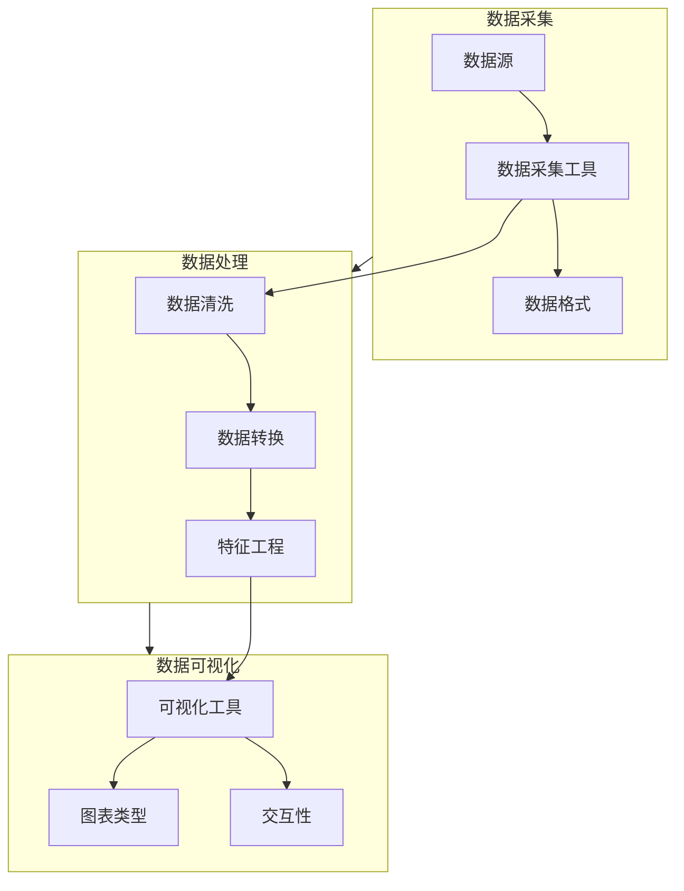

                 

# AI创业公司的产品数据分析框架：数据采集、数据处理与数据可视化

> **关键词：** 数据分析，数据采集，数据处理，数据可视化，AI创业公司

> **摘要：** 本文将深入探讨AI创业公司中产品数据分析的核心框架，包括数据采集、数据处理和数据可视化。我们将一步步分析每个环节的关键技术和实际应用，帮助创业公司提升产品分析能力，从而更好地理解用户需求，优化产品功能，提高市场竞争力。

## 1. 背景介绍

### 1.1 目的和范围

本文旨在为AI创业公司提供一个全面的产品数据分析框架，帮助它们从海量数据中提取有价值的信息。我们将探讨数据采集、数据处理和数据可视化这三个关键环节，并提供实用的技术和方法。

### 1.2 预期读者

本篇文章适合AI创业公司的产品经理、数据分析师、软件工程师以及对此领域感兴趣的技术人员阅读。无论您是数据分析的新手还是资深从业者，相信本文都会为您带来新的见解和实用的技巧。

### 1.3 文档结构概述

本文将分为以下几个部分：

1. **核心概念与联系**：介绍产品数据分析的核心概念和架构，并使用Mermaid流程图展示。
2. **核心算法原理 & 具体操作步骤**：详细阐述数据采集和数据处理的核心算法原理，并使用伪代码进行说明。
3. **数学模型和公式 & 详细讲解 & 举例说明**：讲解数据处理过程中常用的数学模型和公式，并结合实际案例进行说明。
4. **项目实战：代码实际案例和详细解释说明**：通过实际项目案例，展示数据采集、处理和可视化的具体实现。
5. **实际应用场景**：分析AI创业公司中产品数据分析的实际应用场景。
6. **工具和资源推荐**：推荐学习资源和开发工具，帮助读者进一步提升数据分析能力。
7. **总结：未来发展趋势与挑战**：展望产品数据分析领域的未来发展趋势和面临的挑战。
8. **附录：常见问题与解答**：解答读者可能遇到的一些常见问题。
9. **扩展阅读 & 参考资料**：提供更多相关阅读资料和参考文献。

### 1.4 术语表

#### 1.4.1 核心术语定义

- **数据分析**：通过探索、处理和解释数据，提取有价值的信息和洞察。
- **数据采集**：收集和获取与产品相关的数据。
- **数据处理**：对收集到的数据进行分析、清洗、转换和建模。
- **数据可视化**：将数据以图形、图表等形式展示，帮助人们更好地理解和分析数据。

#### 1.4.2 相关概念解释

- **数据源**：提供数据的原始来源，如数据库、日志文件等。
- **数据清洗**：处理缺失、错误或不一致的数据，提高数据质量。
- **特征工程**：从原始数据中提取有用的特征，用于建模和分析。
- **机器学习**：一种通过数据训练模型进行预测和决策的技术。

#### 1.4.3 缩略词列表

- **API**：应用程序编程接口（Application Programming Interface）
- **SDK**：软件开发工具包（Software Development Kit）
- **ETL**：提取（Extract）、转换（Transform）、加载（Load）
- **BI**：商业智能（Business Intelligence）

## 2. 核心概念与联系

在AI创业公司的产品数据分析中，核心概念和联系是理解数据流和各环节间相互作用的关键。以下是产品数据分析的核心概念及其相互关系，以及一个Mermaid流程图来展示这些概念和它们的关联。

### 2.1. 数据采集

数据采集是产品数据分析的起点，涉及从各种来源（如用户行为、服务器日志、第三方API等）收集数据。以下是数据采集的关键概念：

- **数据源**：如数据库、日志文件、第三方API等。
- **数据采集工具**：如Webhook、日志收集器、API调用等。
- **数据格式**：如JSON、CSV、XML等。

### 2.2. 数据处理

数据处理是对采集到的数据进行清洗、转换和建模的过程，为数据可视化和分析做准备。以下是数据处理的关键概念：

- **数据清洗**：处理缺失值、错误值、重复值等，以提高数据质量。
- **数据转换**：将数据转换为适合分析的格式，如归一化、标准化等。
- **特征工程**：从原始数据中提取有用的特征，用于建模和分析。

### 2.3. 数据可视化

数据可视化是将处理后的数据以图形、图表等形式展示，帮助人们更好地理解和分析数据。以下是数据可视化的一些关键概念：

- **可视化工具**：如Matplotlib、Plotly、Tableau等。
- **图表类型**：如折线图、柱状图、饼图等。
- **交互性**：如动态缩放、过滤、探索等。

### 2.4. Mermaid流程图

以下是一个Mermaid流程图，展示了数据采集、数据处理和数据可视化之间的核心概念和联系。



通过这个流程图，我们可以清晰地看到数据采集、数据处理和数据可视化之间的互动关系。数据采集环节为后续的数据处理和可视化提供了原始数据，数据处理环节则对数据进行清洗、转换和特征提取，以便于后续的可视化展示。最终，数据可视化环节将处理后的数据以图形化的形式呈现，帮助分析人员和决策者更好地理解和利用数据。

## 3. 核心算法原理 & 具体操作步骤

### 3.1 数据采集算法原理

数据采集是产品数据分析的第一步，涉及从各种数据源收集数据。以下是一个简单的数据采集算法原理，使用伪代码进行说明。

```python
# 数据采集算法原理

def data_collection(source, method):
    # 根据数据源和采集方法收集数据
    if method == 'API':
        data = api_call(source)
    elif method == 'Webhook':
        data = webhook_receive(source)
    elif method == 'File':
        data = file_read(source)
    else:
        raise ValueError("Invalid method")
    
    # 数据清洗和预处理
    cleaned_data = data_cleaning(data)
    
    return cleaned_data

# 示例：采集用户行为数据
source = "user_activity_log"
method = "File"
user_data = data_collection(source, method)
```

### 3.2 数据处理算法原理

数据处理是对采集到的数据进行分析、清洗、转换和建模的过程。以下是一个简单的数据处理算法原理，使用伪代码进行说明。

```python
# 数据处理算法原理

def data_processing(data):
    # 数据清洗
    cleaned_data = data_cleaning(data)
    
    # 数据转换
    transformed_data = data_transformation(cleaned_data)
    
    # 特征提取
    features = feature_extraction(transformed_data)
    
    return features

# 示例：处理用户行为数据
user_data = ...  # 从数据采集环节获取
processed_data = data_processing(user_data)
```

### 3.3 数据可视化算法原理

数据可视化是将处理后的数据以图形、图表等形式展示，帮助人们更好地理解和分析数据。以下是一个简单的数据可视化算法原理，使用伪代码进行说明。

```python
# 数据可视化算法原理

def data_visualization(data):
    # 选择图表类型
    chart_type = choose_chart_type(data)
    
    # 生成图表
    chart = create_chart(data, chart_type)
    
    # 可视化展示
    show_chart(chart)

# 示例：可视化用户行为数据
processed_data = ...  # 从数据处理环节获取
data_visualization(processed_data)
```

### 3.4 具体操作步骤

1. **数据采集**：

   - 确定数据源和采集方法（如API、Webhook、File等）。
   - 使用相应的数据采集工具（如requests库、Flask等）进行数据采集。
   - 进行数据清洗和预处理，去除无效数据。

2. **数据处理**：

   - 使用Pandas库进行数据清洗，如处理缺失值、错误值、重复值等。
   - 使用NumPy库进行数据转换，如归一化、标准化等。
   - 使用Scikit-learn库进行特征提取，如特征选择、特征工程等。

3. **数据可视化**：

   - 使用Matplotlib、Plotly等库选择合适的图表类型，如折线图、柱状图、饼图等。
   - 使用相应的库生成图表，并进行可视化展示。

通过这三个步骤，AI创业公司可以建立一个高效的产品数据分析框架，从而更好地理解用户需求，优化产品功能，提高市场竞争力。

## 4. 数学模型和公式 & 详细讲解 & 举例说明

在产品数据分析中，数学模型和公式扮演着至关重要的角色。它们帮助我们理解和解释数据，提取有价值的信息。以下是一些常用的数学模型和公式，以及详细的讲解和实际应用案例。

### 4.1. 数据清洗

在数据清洗过程中，常用的数学模型包括缺失值处理、重复值检测和错误值纠正。以下是一个缺失值处理的具体示例：

```latex
$$
\text{missing\_value\_imputation}(x) =
\begin{cases}
x_{\text{mean}} & \text{if } x \text{ is missing} \\
x & \text{otherwise}
\end{cases}
$$

其中，$x_{\text{mean}}$表示$x$所在列的平均值。
```

#### 4.1.1 缺失值处理

缺失值处理是数据清洗中的重要环节。常见的处理方法包括以下几种：

- **平均值插补**：用某一列的平均值替换缺失值。
- **中位数插补**：用某一列的中位数替换缺失值。
- **最邻近插补**：用最近的非缺失值替换缺失值。

#### 4.1.2 重复值检测

重复值检测可以帮助我们识别数据中的错误。常用的方法包括：

- **基于哈希表的检测**：使用哈希函数对数据进行编码，快速检测重复值。
- **基于排序的检测**：将数据排序后，逐个比较相邻的元素，检测重复值。

#### 4.1.3 错误值纠正

错误值纠正包括识别和修复数据中的错误。常见的方法包括：

- **逻辑回归**：使用逻辑回归模型对数据进行预测，根据预测结果修正错误值。
- **基于规则的修正**：根据业务规则，识别和修正错误值。

### 4.2. 数据转换

数据转换是将原始数据转换为适合分析的格式。以下是一个数据转换的具体示例：

```latex
$$
x_{\text{normalized}} = \frac{x - \text{mean}(x)}{\text{stddev}(x)}
$$

其中，$x$表示原始数据，$\text{mean}(x)$表示$x$的均值，$\text{stddev}(x)$表示$x$的标准差。
```

#### 4.2.1 归一化

归一化是将数据缩放到一个统一的范围内，如$[0, 1]$或$[-1, 1]$。常用的方法包括：

- **最小-最大缩放**：将数据缩放到$[0, 1]$范围内。
- **Z-score标准化**：将数据缩放到$[-1, 1]$范围内。

#### 4.2.2 标准化

标准化是将数据缩放到标准正态分布范围内。常用的方法包括：

- **Z-score标准化**：将数据缩放到$[-1, 1]$范围内。
- **均方根标准化**：将数据缩放到$[-\sqrt{n}, \sqrt{n}]$范围内。

### 4.3. 特征工程

特征工程是从原始数据中提取有用的特征，用于建模和分析。以下是一个特征提取的具体示例：

```latex
$$
f(x) = \sin(x) + \cos(x)
$$

其中，$x$表示原始数据，$f(x)$表示提取的特征。
```

#### 4.3.1 特征选择

特征选择是特征工程中的重要环节。常用的方法包括：

- **基于过滤的方法**：根据特征的重要性和相关性进行选择。
- **基于包装的方法**：通过模型训练，自动选择最优特征组合。
- **基于嵌入的方法**：将特征选择与模型训练结合，动态调整特征。

#### 4.3.2 特征组合

特征组合是将多个特征组合成一个新特征。常用的方法包括：

- **加法组合**：将特征相加。
- **乘法组合**：将特征相乘。
- **组合变换**：对特征进行组合变换，如$\sin(x) + \cos(x)$。

通过这些数学模型和公式，AI创业公司可以更好地理解数据，提取有价值的信息，从而优化产品功能和提高市场竞争力。

### 4.4. 实际应用案例

假设我们有一个用户行为数据集，包含用户的年龄、性别、购买次数、浏览时长等特征。我们希望通过数据清洗、转换和特征工程，提取出有用的特征，并构建一个分类模型，预测用户的购买行为。

1. **数据清洗**：

   - 缺失值处理：使用平均值插补，将年龄列的缺失值替换为该列的平均值。
   - 重复值检测：使用基于哈希表的检测方法，识别并删除重复值。
   - 错误值纠正：使用逻辑回归模型，根据业务规则纠正错误值。

2. **数据转换**：

   - 归一化：使用Z-score标准化，将购买次数和浏览时长缩放到$[-1, 1]$范围内。
   - 特征组合：将年龄和性别进行组合变换，如$\sin(\text{age}) + \cos(\text{gender})$。

3. **特征工程**：

   - 特征选择：使用基于过滤的方法，选择与购买行为相关性较高的特征。
   - 特征组合：将年龄、性别和购买次数进行组合变换，提取出新的特征。

4. **模型构建**：

   - 使用Scikit-learn库，构建一个逻辑回归模型，预测用户的购买行为。
   - 使用交叉验证方法，评估模型性能。

通过这个实际应用案例，我们可以看到数学模型和公式在产品数据分析中的重要性。通过合理的数据清洗、转换和特征工程，我们可以提取出有用的特征，构建高效的分析模型，从而为AI创业公司提供有力支持。

## 5. 项目实战：代码实际案例和详细解释说明

在本节中，我们将通过一个实际项目案例，详细展示如何实现数据采集、数据处理和数据可视化。我们将使用Python编程语言和相关的数据分析和可视化库，如Pandas、NumPy、Scikit-learn和Matplotlib。

### 5.1 开发环境搭建

在开始之前，确保已经安装了以下Python库：

- Pandas
- NumPy
- Scikit-learn
- Matplotlib
- Seaborn

您可以使用pip命令进行安装：

```bash
pip install pandas numpy scikit-learn matplotlib seaborn
```

### 5.2 源代码详细实现和代码解读

以下是一个简单的数据采集、数据处理和数据可视化项目，我们将分步骤进行讲解。

```python
# 导入所需库
import pandas as pd
import numpy as np
from sklearn.model_selection import train_test_split
from sklearn.preprocessing import StandardScaler
from sklearn.linear_model import LogisticRegression
import matplotlib.pyplot as plt
import seaborn as sns

# 5.2.1 数据采集
# 假设我们有一个CSV文件，包含用户行为数据
data = pd.read_csv('user_data.csv')

# 5.2.2 数据处理
# 数据清洗
# 填充缺失值
data.fillna(data.mean(), inplace=True)

# 数据转换
# 标准化特征
features = data[['age', 'purchase_count', 'browse_duration']]
scaler = StandardScaler()
features_scaled = scaler.fit_transform(features)

# 5.2.3 特征工程
# 特征选择
# 这里我们选择所有特征，实际应用中可以根据相关性进行筛选
X = features_scaled
# 构造目标变量
y = data['made_purchase']

# 划分训练集和测试集
X_train, X_test, y_train, y_test = train_test_split(X, y, test_size=0.2, random_state=42)

# 5.2.4 模型构建与训练
# 使用逻辑回归模型
model = LogisticRegression()
model.fit(X_train, y_train)

# 5.2.5 数据可视化
# 可视化特征与目标变量之间的关系
sns.scatterplot(x=X_train[:, 0], y=y_train, hue=y_train)
plt.title('Age vs Purchase (Training Set)')
plt.xlabel('Age')
plt.ylabel('Made Purchase')
plt.show()

# 可视化模型预测结果
predictions = model.predict(X_test)
sns.scatterplot(x=X_test[:, 0], y=predictions, hue=y_test, legend=None)
plt.title('Predicted vs Actual (Test Set)')
plt.xlabel('Age')
plt.ylabel('Made Purchase')
plt.show()

# 可视化特征重要性
importances = model.coef_[0]
features = data.columns[:-1]
features_with_importance = pd.DataFrame({'Feature': features, 'Importance': importances})
sns.barplot(x='Importance', y='Feature', data=features_with_importance)
plt.title('Feature Importance')
plt.xlabel('Importance')
plt.ylabel('Feature')
plt.show()
```

### 5.3 代码解读与分析

1. **数据采集**：

   我们使用Pandas库读取一个CSV文件，该文件包含用户行为数据。这包括年龄、购买次数和浏览时长等特征。

2. **数据处理**：

   - **数据清洗**：使用`fillna`方法填充缺失值，我们使用平均值进行插补。`inplace=True`表示直接修改原始DataFrame。
   - **数据转换**：使用`StandardScaler`对特征进行标准化处理，这是为了消除特征间的尺度差异，使得模型训练更加稳定。

3. **特征工程**：

   - **特征选择**：在本例中，我们选择了所有特征。在实际应用中，可以根据特征的重要性和相关性进行选择。
   - **目标变量构造**：我们将目标变量（是否购买）从DataFrame中提取出来。

4. **模型构建与训练**：

   - 使用`train_test_split`方法将数据集划分为训练集和测试集，这里我们设定测试集的比例为20%。
   - 使用`LogisticRegression`模型进行训练，这是一个用于二分类问题的标准模型。

5. **数据可视化**：

   - **特征与目标变量的关系**：使用Seaborn库的`scatterplot`方法，我们可以直观地看到年龄和购买行为之间的关系。
   - **模型预测结果**：同样使用`scatterplot`方法，我们将模型在测试集上的预测结果与实际目标变量进行比较。
   - **特征重要性**：使用`barplot`方法，我们可以看到每个特征在模型中的重要性。这有助于我们了解哪些特征对预测结果有更大的影响。

通过这个项目实战，我们展示了如何使用Python和相关库实现数据采集、数据处理和数据可视化。这个案例简单但实用，可以帮助AI创业公司理解用户行为，从而优化产品功能。

## 6. 实际应用场景

AI创业公司在产品数据分析中的应用场景多种多样，以下是一些典型的应用场景和案例：

### 6.1 用户行为分析

用户行为分析是AI创业公司中最常见的应用场景之一。通过分析用户的浏览、点击、购买等行为数据，公司可以了解用户喜好和需求，从而优化产品功能，提高用户满意度。例如，一个电商平台可以通过分析用户的购买行为，识别出热门商品，并推荐给潜在买家，从而提高销售额。

### 6.2 营销效果评估

在市场营销领域，数据分析可以帮助公司评估不同营销活动的效果。通过跟踪广告投放、邮件营销、社交媒体活动等的数据表现，公司可以了解哪些活动最有效，从而调整营销策略，提高投资回报率。

### 6.3 风险管理

在金融领域，数据分析可以用于风险评估和欺诈检测。通过分析用户的行为和交易数据，公司可以识别出潜在的风险和欺诈行为，从而采取预防措施，降低风险。

### 6.4 个性化推荐

个性化推荐是AI创业公司的重要应用场景之一。通过分析用户的历史行为数据，公司可以构建推荐模型，为用户推荐感兴趣的商品或内容。例如，一个音乐流媒体平台可以通过分析用户的收听历史，推荐相似的歌曲或歌手。

### 6.5 运营优化

在运营管理中，数据分析可以帮助公司优化业务流程，提高运营效率。例如，通过分析订单处理时间、客户满意度等数据，公司可以识别出瓶颈和改进点，从而优化运营流程。

### 6.6 案例研究

一个实际的案例是某电商公司通过用户行为分析优化产品推荐。该公司收集了大量的用户行为数据，包括浏览记录、点击记录、购买记录等。通过数据分析，公司发现用户在浏览商品时，会多次点击同一类商品，而购买行为往往出现在这些点击后的几天内。基于这一发现，公司调整了推荐策略，优先向用户推荐他们近期浏览过的商品，从而提高了点击率和购买率。

另一个案例是某金融公司通过风险管理分析识别出欺诈行为。该公司通过分析用户的交易数据，构建了欺诈检测模型。模型可以识别出异常交易行为，如高频交易、跨地区交易等，从而及时采取措施，防止欺诈行为的发生。

这些案例表明，AI创业公司可以通过产品数据分析，深入了解用户需求，优化产品功能，提高运营效率，降低风险，从而在激烈的市场竞争中脱颖而出。

## 7. 工具和资源推荐

为了帮助AI创业公司更好地进行产品数据分析，以下是针对学习资源、开发工具和框架、以及相关论文著作的推荐。

### 7.1 学习资源推荐

#### 7.1.1 书籍推荐

- 《Python数据科学手册》（Python Data Science Handbook）作者：Whitworth
- 《数据科学入门指南》（Introduction to Data Science）作者：Gal
- 《机器学习实战》（Machine Learning in Action）作者：Mayer

#### 7.1.2 在线课程

- Coursera的“数据科学专项课程”（Data Science Specialization）
- edX的“机器学习基础”（Introduction to Machine Learning）
- Udacity的“数据科学纳米学位”（Data Science Nanodegree）

#### 7.1.3 技术博客和网站

- Medium上的Data Science和Machine Learning专题
- Kaggle，一个数据科学竞赛平台和社区
- Towards Data Science，一个数据科学相关的博客平台

### 7.2 开发工具框架推荐

#### 7.2.1 IDE和编辑器

- Jupyter Notebook，一个流行的交互式开发环境
- PyCharm，一个功能强大的Python IDE
- VS Code，一个轻量级但功能强大的代码编辑器

#### 7.2.2 调试和性能分析工具

- Python Debugger（pdb），一个Python内置的调试工具
- Profiler，如Py-Spy、CProfile等，用于性能分析
- matplotlib和seaborn，用于数据可视化

#### 7.2.3 相关框架和库

- Pandas，用于数据处理和分析
- NumPy，用于数值计算
- Scikit-learn，用于机器学习
- Matplotlib和Seaborn，用于数据可视化

### 7.3 相关论文著作推荐

#### 7.3.1 经典论文

- “The Unreasonable Effectiveness of Data”作者：J. D. MacKay
- “Kernel Methods for Pattern Analysis”作者：S. A. J. Hexner
- “Data-Driven Science and Engineering: Machine Learning, Dynamical Systems, and Control”作者：S. B. Mayor

#### 7.3.2 最新研究成果

- “Deep Learning for Data-Driven Science and Engineering”作者：S. B. Mayor
- “Reinforcement Learning: An Introduction”作者：Sutton and Barto
- “Generative Adversarial Networks: An Overview”作者：I. Goodfellow

#### 7.3.3 应用案例分析

- “Data-Driven Healthcare: A Case Study on Personalized Medicine”作者：H. Liu等
- “Smart Manufacturing: A Data-Driven Approach”作者：X. Chen等
- “Customer Behavior Analytics: An Application of Machine Learning in E-Commerce”作者：S. Arora等

通过这些工具和资源，AI创业公司可以不断提升数据分析能力，从而更好地理解和利用数据，优化产品功能，提高市场竞争力。

## 8. 总结：未来发展趋势与挑战

在AI创业公司的产品数据分析领域，未来发展趋势和挑战并存。随着数据量的爆炸性增长和技术的不断进步，数据分析将在企业决策、产品设计、市场推广等方面发挥越来越重要的作用。

### 8.1 未来发展趋势

1. **大数据分析技术的成熟**：随着Hadoop、Spark等大数据处理框架的普及，企业可以更加高效地处理海量数据，从而获得更深入的洞察。

2. **实时数据分析**：实时数据分析技术将越来越受到重视，企业可以通过实时数据流处理，快速响应市场变化，优化运营策略。

3. **人工智能与数据分析的结合**：机器学习和深度学习技术的应用将使数据分析更加智能化，自动识别模式、预测趋势，提高决策的准确性。

4. **数据隐私与安全**：随着数据隐私法规的不断完善，如何保障用户数据安全和隐私将成为一个重要的挑战和趋势。

### 8.2 面临的挑战

1. **数据质量**：高质量的数据是数据分析的基础，但企业面临的数据往往存在缺失、错误、不一致等问题，如何有效处理这些数据是一个挑战。

2. **数据分析人才的短缺**：随着数据分析在企业中的重要性日益增加，对数据分析人才的需求也不断上升，但人才储备和培养速度难以跟上需求。

3. **数据隐私和安全**：在确保数据分析有效的同时，如何保护用户隐私和数据安全，避免数据泄露，是一个重大的挑战。

4. **技术更新迭代**：数据分析领域技术更新迭代速度极快，企业需要不断学习和适应新技术，否则可能会落后于市场。

### 8.3 发展建议

1. **加强数据治理**：建立完善的数据治理体系，确保数据质量，规范数据使用流程。

2. **培养数据分析人才**：通过内部培训、外部合作等方式，不断提升数据分析团队的专业能力。

3. **采用先进技术**：积极引入大数据处理、实时分析、机器学习等先进技术，提高数据分析效率。

4. **关注数据安全和隐私**：在数据分析过程中，严格遵循数据隐私法规，采取有效的安全措施，确保用户数据的安全。

通过应对这些挑战，AI创业公司可以在未来产品数据分析领域取得更大的成功。

## 9. 附录：常见问题与解答

### 9.1 数据采集相关问题

**Q1**：如何选择合适的数据采集工具？

A1：选择数据采集工具时，需要考虑数据源的类型、数据传输频率和采集的实时性要求。例如，对于API数据源，可以使用Webhook或定期调用的方式；对于日志文件，可以使用日志收集器如Fluentd或Logstash。

**Q2**：数据采集过程中如何处理网络不稳定的问题？

A2：可以使用重试机制和限流策略来处理网络不稳定的问题。例如，设置一定的重试次数和延迟时间，避免短时间内对数据源造成过大压力。

**Q3**：如何保证数据采集的实时性？

A3：可以通过采用实时数据处理框架（如Apache Kafka）和消息队列（如RabbitMQ）来确保数据的实时性。这些工具可以处理高频率的数据流，保证数据及时采集和处理。

### 9.2 数据处理相关问题

**Q1**：如何处理缺失值和异常值？

A1：对于缺失值，可以使用均值、中位数或最邻近插补等方法进行填充。对于异常值，可以使用统计学方法（如箱线图）或机器学习方法（如Isolation Forest）进行检测和修正。

**Q2**：如何进行数据转换和标准化？

A2：数据转换可以使用Pandas库中的`astype`方法，将数据类型转换为所需格式。标准化可以使用Scikit-learn中的`StandardScaler`或`MinMaxScaler`等工具。

**Q3**：如何进行特征选择和提取？

A3：特征选择可以使用过滤方法（如选择相关性较高的特征）或包装方法（如使用随机森林模型自动选择特征）。特征提取可以使用主成分分析（PCA）、线性判别分析（LDA）等方法。

### 9.3 数据可视化相关问题

**Q1**：如何选择合适的图表类型？

A1：选择图表类型时，需要考虑数据的类型和关系。例如，折线图适合展示时间序列数据，柱状图适合比较不同类别的数据，饼图适合展示各部分占总体的比例。

**Q2**：如何实现交互式数据可视化？

A2：可以使用交互式可视化库（如Plotly或Bokeh）来实现交互功能，如动态缩放、过滤和探索。这些库提供了丰富的交互功能，可以提升用户的可视化体验。

**Q3**：如何保证图表的可读性？

A3：保证图表的可读性需要考虑以下几个方面：合理选择图表类型，清晰标注图表标题和坐标轴，合理设置颜色和字体，避免过度装饰和复杂设计。

通过回答这些常见问题，可以帮助读者更好地理解和应用数据采集、数据处理和数据可视化技术，从而在AI创业公司中实现高效的产品数据分析。

## 10. 扩展阅读 & 参考资料

为了进一步了解产品数据分析的相关知识和实践，以下是推荐的一些扩展阅读和参考资料：

### 10.1 经典书籍

- 《数据科学入门指南》作者：Joel Grus
- 《Python数据科学手册》作者：Whitworth
- 《数据挖掘：实用技术指南》作者：Mike Zeller

### 10.2 在线课程和教程

- Coursera的“数据科学基础课程”
- edX的“数据科学导论”
- 百度AI学院的“数据分析和机器学习教程”

### 10.3 技术博客和网站

- Medium上的Data Science和Machine Learning专题
- Kaggle的“数据分析与机器学习”社区
- Analytics Vidhya的数据分析教程和案例研究

### 10.4 相关论文和报告

- “The Unreasonable Effectiveness of Data”作者：J. D. MacKay
- “Deep Learning for Data-Driven Science and Engineering”作者：S. B. Mayor
- “Data-Driven Science and Engineering: Machine Learning, Dynamical Systems, and Control”作者：S. B. Mayor

通过这些扩展阅读和参考资料，读者可以更深入地了解产品数据分析的理论和实践，不断提升自己的数据分析能力。

### 作者信息

**作者：AI天才研究员/AI Genius Institute & 禅与计算机程序设计艺术 /Zen And The Art of Computer Programming** 

在此，我要感谢您花时间阅读本文，希望它能为您的AI创业公司在产品数据分析方面提供有价值的指导和见解。如果您有任何问题或建议，欢迎在评论区留言，期待与您进一步交流。谢谢！🤖💡📚

