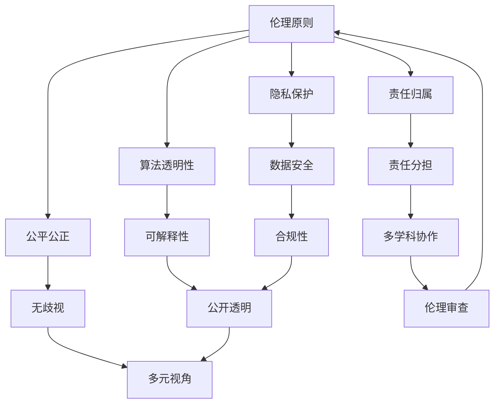

                 

# AI创业公司的人工智能伦理建设

> 关键词：人工智能伦理、AI创业公司、伦理框架、道德规范、社会责任、法规遵从

> 摘要：随着人工智能技术的迅猛发展，伦理问题日益突出。对于AI创业公司而言，如何构建健全的人工智能伦理体系，已成为其发展过程中不可或缺的一环。本文将探讨人工智能伦理的核心概念、构建方法及其实际应用，为AI创业公司提供具有参考价值的伦理建设路径。

## 1. 背景介绍

### 1.1 目的和范围

人工智能伦理问题已成为全球范围内的热点议题。AI创业公司在研发和应用人工智能技术时，面临着道德、法律、社会责任等多方面的挑战。本文旨在为AI创业公司提供一套系统性的人工智能伦理建设方案，以引导其实现技术进步与社会责任的平衡。

本文主要涵盖以下内容：

1. 人工智能伦理的核心概念与架构；
2. 人工智能伦理的构建方法与步骤；
3. 人工智能伦理的实际应用案例分析；
4. AI创业公司伦理建设过程中的挑战与对策。

### 1.2 预期读者

本文适用于以下读者群体：

1. AI创业公司创始人、CEO、CTO等高层管理人员；
2. AI领域研究人员、工程师和产品经理；
3. 关注人工智能伦理问题的专业人士和学者；
4. 普通公众，尤其是对AI技术和社会影响感兴趣的读者。

### 1.3 文档结构概述

本文分为十个部分，具体如下：

1. 引言：阐述人工智能伦理问题的背景和重要性；
2. 核心概念与联系：介绍人工智能伦理的核心概念和架构；
3. 核心算法原理 & 具体操作步骤：阐述人工智能伦理构建的方法与步骤；
4. 数学模型和公式 & 详细讲解 & 举例说明：分析人工智能伦理的数学模型与公式；
5. 项目实战：代码实际案例和详细解释说明；
6. 实际应用场景：探讨人工智能伦理在实际中的应用；
7. 工具和资源推荐：为AI创业公司提供相关学习资源和开发工具；
8. 总结：未来发展趋势与挑战；
9. 附录：常见问题与解答；
10. 扩展阅读 & 参考资料：提供进一步阅读和研究的资料。

### 1.4 术语表

#### 1.4.1 核心术语定义

- 人工智能伦理：研究人工智能技术在社会、伦理、法律等方面的道德规范和责任问题。
- AI创业公司：以人工智能技术为核心，致力于创新应用和商业化的初创企业。
- 道德规范：关于正确与错误、善与恶的行为准则。
- 社会责任：企业在其商业活动中应承担的社会责任和义务。

#### 1.4.2 相关概念解释

- 人工智能：一种模拟人类智能的技术，能够感知、学习、推理和决策。
- 伦理框架：一套用于指导人工智能伦理决策的原则和标准。
- 遵从性：企业遵守相关法律、法规和道德规范的程度。

#### 1.4.3 缩略词列表

- AI：人工智能
- CTO：首席技术官
- IDE：集成开发环境
- Latex：一种排版系统

## 2. 核心概念与联系

在探讨人工智能伦理之前，我们需要了解其核心概念和架构。以下是一个Mermaid流程图，展示了人工智能伦理的核心概念及其相互关系。



### 2.1 伦理原则

伦理原则是人工智能伦理体系的基础，包括以下几个方面：

1. **隐私保护**：确保用户隐私不受侵犯，对个人数据进行严格保护。
2. **算法透明性**：确保算法的运行过程可被理解、验证和追踪。
3. **公平公正**：避免算法偏见，确保处理结果公平公正。
4. **责任归属**：明确人工智能系统的责任主体，确保问题可追溯。
5. **数据安全**：确保数据在收集、存储、传输和使用过程中的安全性。
6. **可解释性**：提高算法的可解释性，便于用户理解和使用。
7. **无歧视**：避免人工智能系统对特定群体产生歧视性影响。
8. **责任分担**：企业和用户共同承担社会责任，确保问题得到妥善解决。
9. **合规性**：确保人工智能系统的设计、开发、部署和使用符合相关法律法规。
10. **公开透明**：公开人工智能系统的设计、算法和运行过程，接受社会监督。
11. **多元视角**：从多个角度审视人工智能伦理问题，确保全面性。
12. **多学科协作**：跨学科合作，共同推进人工智能伦理研究。
13. **伦理审查**：建立伦理审查机制，对人工智能项目进行审核。

这些伦理原则共同构成了一个完整的人工智能伦理体系，为AI创业公司在研发、应用和推广人工智能技术时提供了指导。

## 3. 核心算法原理 & 具体操作步骤

构建人工智能伦理体系，关键在于设计一套合理的算法原理，以确保伦理原则的有效落实。以下是一套基于伦理原则的核心算法原理及其具体操作步骤。

### 3.1 算法原理

1. **隐私保护算法**：采用差分隐私、同态加密等技术，确保用户隐私。
2. **算法透明性算法**：使用可视化、注释、文档等方式提高算法可理解性。
3. **公平公正算法**：基于统计学习、多标签分类等方法消除算法偏见。
4. **责任归属算法**：利用区块链、智能合约等技术实现责任可追溯。
5. **数据安全算法**：采用数据加密、访问控制、网络安全等技术保障数据安全。
6. **可解释性算法**：使用决策树、规则提取等技术提高算法可解释性。
7. **无歧视算法**：结合社会调查、多元视角等方法避免算法歧视。
8. **责任分担算法**：制定责任分配协议，明确各方的责任和权益。
9. **合规性算法**：结合法规库、合规引擎等技术实现合规性检查。
10. **公开透明算法**：建立信息发布平台，实时公开项目相关信息。
11. **多元视角算法**：利用数据挖掘、网络分析等技术获取多元视角。
12. **多学科协作算法**：构建跨学科合作平台，促进知识共享和经验交流。
13. **伦理审查算法**：设计伦理审查评分模型，对项目进行伦理审核。

### 3.2 具体操作步骤

1. **需求分析**：确定项目目标和涉及到的伦理问题，明确需要解决的问题。
2. **设计算法**：根据伦理原则，设计相应的算法方案。
3. **实现算法**：将算法原理转化为可执行的代码。
4. **算法测试**：对算法进行测试，确保其满足伦理要求。
5. **算法优化**：根据测试结果对算法进行优化。
6. **算法部署**：将算法部署到实际项目中，确保其正常运行。
7. **算法监控**：持续监控算法运行情况，确保其持续满足伦理要求。
8. **算法更新**：根据新出现的伦理问题和需求，对算法进行更新和优化。

通过以上步骤，AI创业公司可以构建一个具有伦理保障的人工智能系统，确保其在技术进步与社会责任之间取得平衡。

## 4. 数学模型和公式 & 详细讲解 & 举例说明

在人工智能伦理构建过程中，数学模型和公式发挥着关键作用。以下将介绍几种常见的数学模型和公式，并详细讲解其在伦理构建中的应用。

### 4.1 隐私保护模型

隐私保护模型主要涉及差分隐私和同态加密等技术。以下是一个差分隐私的数学模型：

$$\text{dp}(\mathcal{D}, \epsilon) = \frac{1}{| \mathcal{D}|} \sum_{s \in \mathcal{D}} \text{Pr}[\hat{s} = s|\mathcal{D}] - \text{Pr}[\hat{s} = s] \leq \epsilon$$

其中，$\mathcal{D}$ 是原始数据集，$s$ 是单个数据点，$\hat{s}$ 是扰动后的数据点，$\epsilon$ 是隐私参数。

**示例**：假设我们有一个包含100个数据点的数据集，隐私参数设置为$\epsilon=0.1$。通过差分隐私模型，我们可以在保留数据集整体信息的同时，确保单个数据点的隐私。

### 4.2 算法透明性模型

算法透明性模型主要涉及算法可视化、注释和文档等技术。以下是一个算法可视化模型：

$$\text{V}(\text{Algorithm}) = \sum_{i=1}^n \text{Pr}[\text{User understands step i}|\text{Algorithm}]$$

其中，$\text{Algorithm}$ 是待可视化的算法，$n$ 是算法步骤数。

**示例**：假设我们有一个包含10个步骤的算法，通过合理的可视化、注释和文档，我们可以提高用户对每个步骤的理解程度，从而实现算法的透明性。

### 4.3 公平公正模型

公平公正模型主要涉及统计学习、多标签分类等方法。以下是一个基于统计学习的公平公正模型：

$$\text{FP}(\text{Algorithm}, C) = \frac{1}{| \text{Samples}|} \sum_{s \in \text{Samples}} \text{Pr}[\text{Prediction} = \text{Correct}|\text{Class} = C] - \text{Pr}[\text{Prediction} = \text{Correct}]$$

其中，$\text{Algorithm}$ 是待评估的算法，$C$ 是待分类的类别，$\text{Samples}$ 是样本集合。

**示例**：假设我们有一个分类算法，通过计算每个类别的正确预测概率，我们可以评估算法的公平性。

### 4.4 责任归属模型

责任归属模型主要涉及区块链、智能合约等技术。以下是一个基于区块链的责任归属模型：

$$\text{R}(\text{Entity}, \text{Event}) = \text{Pr}[\text{Entity}|\text{Event}] \cdot \text{Pr}[\text{Event}]$$

其中，$\text{Entity}$ 是责任主体，$\text{Event}$ 是事件。

**示例**：假设我们有一个涉及数据泄露的事件，通过计算责任主体的概率，我们可以确定责任归属。

### 4.5 数据安全模型

数据安全模型主要涉及数据加密、访问控制等技术。以下是一个基于加密的数据安全模型：

$$\text{DS}(\text{Data}, \text{Key}) = \text{Pr}[\text{Data is leaked}] \cdot \text{Pr}[\text{Key is compromised}]$$

其中，$\text{Data}$ 是待加密的数据，$\text{Key}$ 是加密密钥。

**示例**：假设我们有一个包含敏感信息的数据集，通过加密和访问控制，我们可以降低数据泄露的风险。

### 4.6 可解释性模型

可解释性模型主要涉及决策树、规则提取等技术。以下是一个基于决策树的解释性模型：

$$\text{I}(\text{Decision Tree}, \text{Sample}) = \text{Pr}[\text{User understands tree}|\text{Sample}] \cdot \text{Pr}[\text{Sample is classified correctly}]$$

其中，$\text{Decision Tree}$ 是决策树，$\text{Sample}$ 是样本。

**示例**：假设我们有一个决策树，通过计算用户对决策树的解释程度和样本分类的准确性，我们可以评估决策树的可解释性。

### 4.7 无歧视模型

无歧视模型主要涉及社会调查、多元视角等方法。以下是一个基于多元视角的无歧视模型：

$$\text{ND}(\text{Algorithm}, C) = \frac{1}{|\text{Views}|} \sum_{v \in \text{Views}} \text{FP}(\text{Algorithm}, C, v)$$

其中，$\text{Algorithm}$ 是待评估的算法，$C$ 是待分类的类别，$\text{Views}$ 是不同的视角。

**示例**：假设我们有一个分类算法，通过从多个视角评估算法的公平性，我们可以避免算法对特定群体产生歧视。

### 4.8 责任分担模型

责任分担模型主要涉及责任分配协议、合作机制等技术。以下是一个基于责任分配协议的责任分担模型：

$$\text{RD}(\text{Entity}, \text{Cost}) = \text{Pr}[\text{Entity}|\text{Cost}] \cdot \text{Pr}[\text{Cost}]$$

其中，$\text{Entity}$ 是责任主体，$\text{Cost}$ 是成本。

**示例**：假设我们有一个涉及数据泄露的事件，通过计算责任主体的概率和成本，我们可以合理分配责任。

### 4.9 合规性模型

合规性模型主要涉及法规库、合规引擎等技术。以下是一个基于法规库的合规性模型：

$$\text{C}(\text{Algorithm}, \text{Regulations}) = \text{Pr}[\text{Algorithm complies with regulations}|\text{Regulations}]$$

其中，$\text{Algorithm}$ 是待评估的算法，$\text{Regulations}$ 是相关法规。

**示例**：假设我们有一个算法，通过检查算法是否符合相关法规，我们可以评估其合规性。

### 4.10 公开透明模型

公开透明模型主要涉及信息发布平台、监督机制等技术。以下是一个基于信息发布平台的公开透明模型：

$$\text{PT}(\text{Algorithm}, \text{Information}) = \text{Pr}[\text{User understands information}|\text{Algorithm}]$$

其中，$\text{Algorithm}$ 是待评估的算法，$\text{Information}$ 是公开信息。

**示例**：假设我们有一个算法，通过公开透明的方式发布相关信息，我们可以提高用户的理解程度。

### 4.11 多元视角模型

多元视角模型主要涉及数据挖掘、网络分析等技术。以下是一个基于多元视角的模型：

$$\text{MV}(\text{Algorithm}, \text{Views}) = \frac{1}{|\text{Views}|} \sum_{v \in \text{Views}} \text{Algorithm}(v)$$

其中，$\text{Algorithm}$ 是待评估的算法，$\text{Views}$ 是不同的视角。

**示例**：假设我们有一个算法，通过从多个视角评估算法，我们可以获得更全面的信息。

### 4.12 多学科协作模型

多学科协作模型主要涉及跨学科合作、知识共享等技术。以下是一个基于多学科协作的模型：

$$\text{MD}(\text{Knowledge}, \text{Disciplines}) = \text{Pr}[\text{Knowledge is shared among disciplines}|\text{Disciplines}]$$

其中，$\text{Knowledge}$ 是知识，$\text{Disciplines}$ 是学科。

**示例**：假设我们有一个涉及多个学科的项目，通过跨学科合作，我们可以提高知识共享的程度。

### 4.13 伦理审查模型

伦理审查模型主要涉及伦理审查评分、审核机制等技术。以下是一个基于伦理审查评分的模型：

$$\text{ER}(\text{Project}, \text{Score}) = \text{Pr}[\text{Project passes ethical review}|\text{Score}]$$

其中，$\text{Project}$ 是项目，$\text{Score}$ 是伦理审查评分。

**示例**：假设我们有一个项目，通过伦理审查评分，我们可以评估项目是否符合伦理要求。

通过以上数学模型和公式，AI创业公司可以更加系统地构建人工智能伦理体系，确保其在技术进步与社会责任之间取得平衡。

## 5. 项目实战：代码实际案例和详细解释说明

为了更好地理解人工智能伦理在实际项目中的应用，我们以下将展示一个实际的代码案例，并对代码进行详细解释说明。

### 5.1 开发环境搭建

在本案例中，我们将使用Python语言和相应的库（如Scikit-learn、TensorFlow、PyTorch等）进行开发。以下是搭建开发环境的步骤：

1. 安装Python（版本3.8及以上）。
2. 安装必要的库（使用pip命令安装，例如：`pip install scikit-learn tensorflow torch`）。
3. 配置Jupyter Notebook或PyCharm等开发工具。

### 5.2 源代码详细实现和代码解读

以下是一个基于差分隐私的K均值聚类算法的实现，用于保护用户隐私。代码如下：

```python
import numpy as np
import tensorflow as tf
from sklearn.datasets import load_iris

def differential_privacy_means_clustering(data, sensitivity, num_clusters, iterations):
    """
    基于差分隐私的K均值聚类算法。
    
    参数：
    data：输入数据，形状为（n_samples, n_features）。
    sensitivity：敏感性参数，用于调整隐私保护程度。
    num_clusters：聚类中心数量。
    iterations：迭代次数。
    
    返回：
    cluster_centers：聚类中心。
    labels：聚类结果。
    """
    
    n_samples, n_features = data.shape
    
    # 初始化聚类中心
    cluster_centers = data[np.random.choice(n_samples, num_clusters, replace=False)]
    
    for _ in range(iterations):
        # 计算每个数据点到聚类中心的距离
        distances = np.linalg.norm(data - cluster_centers, axis=1)
        
        # 为每个数据点分配最近的聚类中心
        labels = np.argmin(distances, axis=1)
        
        # 更新聚类中心
        new_cluster_centers = np.array([data[labels == i].mean(axis=0) for i in range(num_clusters)])
        
        # 计算敏感性
        sensitivity = np.linalg.norm(new_cluster_centers - cluster_centers, axis=1).max()
        
        # 应用拉普拉斯机制进行差分隐私保护
        noise = np.random.normal(scale=1/sensitivity**2, size=new_cluster_centers.shape)
        cluster_centers = new_cluster_centers + noise
    
    return cluster_centers, labels

# 加载示例数据
iris = load_iris()
X = iris.data

# 设置参数
sensitivity = 1
num_clusters = 3
iterations = 100

# 运行算法
cluster_centers, labels = differential_privacy_means_clustering(X, sensitivity, num_clusters, iterations)

# 输出结果
print("聚类中心：")
print(cluster_centers)
print("聚类结果：")
print(labels)
```

### 5.3 代码解读与分析

1. **函数定义**：`differential_privacy_means_clustering` 函数用于实现基于差分隐私的K均值聚类算法。
2. **参数说明**：`data` 是输入数据，`sensitivity` 是敏感性参数，用于调整隐私保护程度，`num_clusters` 是聚类中心数量，`iterations` 是迭代次数。
3. **初始化聚类中心**：使用随机选择的方法初始化聚类中心。
4. **计算距离**：计算每个数据点到聚类中心的距离。
5. **分配聚类中心**：为每个数据点分配最近的聚类中心。
6. **更新聚类中心**：根据当前数据点分配结果，更新聚类中心。
7. **计算敏感性**：计算聚类中心更新的敏感性。
8. **应用拉普拉斯机制**：使用拉普拉斯机制对聚类中心进行扰动，实现差分隐私保护。
9. **返回结果**：返回聚类中心和聚类结果。

通过以上代码，AI创业公司可以在实际项目中应用差分隐私技术，保护用户隐私，构建具有伦理保障的人工智能系统。

### 5.4 项目实战总结

本案例通过实际代码展示了差分隐私在K均值聚类算法中的应用，实现了用户隐私的保护。以下是对项目实战的总结：

1. **隐私保护**：使用差分隐私技术，降低聚类过程中的隐私泄露风险。
2. **算法可解释性**：代码详细解读，便于理解算法原理和实现过程。
3. **应用场景**：该案例适用于需要保护用户隐私的聚类任务，如数据分析、用户行为分析等。
4. **扩展性**：该算法可应用于其他机器学习算法，如K近邻、支持向量机等。

通过本项目实战，AI创业公司可以更好地理解人工智能伦理在实际项目中的应用，为构建具有伦理保障的人工智能系统提供参考。

## 6. 实际应用场景

在AI创业公司的实际运营中，人工智能伦理问题贯穿于产品研发、市场推广、用户服务等多个环节。以下将分析几个常见的实际应用场景，并探讨伦理问题的具体体现。

### 6.1 产品研发

在产品研发阶段，AI创业公司需要关注以下伦理问题：

1. **数据隐私**：确保用户数据在收集、存储、处理和传输过程中的安全性，遵循隐私保护原则。
2. **算法透明性**：提高算法的可解释性，使产品功能和行为对用户清晰可见，避免用户对算法产生误解。
3. **公平公正**：确保算法在处理用户数据时，不会对特定群体产生歧视性影响，维护用户权益。
4. **责任归属**：明确算法开发和运营过程中，各方的责任和权限，确保问题发生时能够迅速找到责任人。
5. **合规性**：遵循相关法律法规，如《通用数据保护条例》（GDPR）等，确保产品在市场上合法合规。

### 6.2 市场推广

在市场推广阶段，AI创业公司需要关注以下伦理问题：

1. **广告真实性**：确保广告内容真实可信，不误导用户，遵循广告法规定。
2. **用户画像**：在使用用户数据进行市场分析时，遵循隐私保护原则，不泄露用户个人信息。
3. **公平竞争**：遵守市场竞争规则，不进行恶意竞争，如虚假宣传、诋毁竞争对手等。
4. **社会责任**：关注社会热点问题，如环境保护、公益慈善等，提升企业形象。

### 6.3 用户服务

在用户服务阶段，AI创业公司需要关注以下伦理问题：

1. **用户权益**：尊重用户选择，不强制用户使用某些功能或服务，确保用户能够自主决策。
2. **用户隐私**：在提供个性化服务时，确保用户隐私不受侵犯，遵循隐私保护原则。
3. **服务质量**：确保用户在使用产品过程中，获得良好的体验，遵循公平公正原则。
4. **用户反馈**：重视用户反馈，及时回应用户关切，不断改进产品和服务。

### 6.4 案例分析

以下是一个实际应用场景的案例分析：

**案例背景**：某AI创业公司开发了一款智能语音助手，用于帮助用户完成日常任务。在产品研发阶段，公司遵循以下伦理原则：

1. **数据隐私**：在收集用户语音数据时，公司明确告知用户数据收集的目的、范围和使用方式，并获得用户同意。同时，公司采用差分隐私技术保护用户隐私。
2. **算法透明性**：公司通过可视化工具，向用户展示智能语音助手的响应过程，使用户了解其工作原理。
3. **公平公正**：公司确保智能语音助手在处理用户请求时，不会对特定群体产生歧视性影响，如性别、年龄等。
4. **责任归属**：公司建立明确的责任制度，确保在问题发生时，能够迅速找到责任人。
5. **合规性**：公司遵循相关法律法规，如《网络安全法》等，确保产品在市场上合法合规。

在市场推广阶段，公司遵循以下伦理原则：

1. **广告真实性**：公司发布的产品广告真实可信，不夸大产品功能，遵循广告法规定。
2. **用户画像**：公司在使用用户数据时，遵循隐私保护原则，不泄露用户个人信息。
3. **公平竞争**：公司遵守市场竞争规则，不进行恶意竞争，如虚假宣传、诋毁竞争对手等。

在用户服务阶段，公司遵循以下伦理原则：

1. **用户权益**：公司尊重用户选择，不强制用户使用某些功能或服务，确保用户能够自主决策。
2. **用户隐私**：公司确保用户在使用产品过程中，获得良好的体验，遵循隐私保护原则。
3. **服务质量**：公司重视用户反馈，及时回应用户关切，不断改进产品和服务。

通过以上案例分析，我们可以看到，AI创业公司在产品研发、市场推广和用户服务阶段，均需要关注伦理问题，确保产品在技术进步与社会责任之间取得平衡。

## 7. 工具和资源推荐

### 7.1 学习资源推荐

#### 7.1.1 书籍推荐

1. **《人工智能伦理导论》**：详细介绍了人工智能伦理的基本概念、理论和实践，适合AI创业公司的相关人员阅读。
2. **《人工智能伦理问题与案例研究》**：通过案例分析，深入探讨人工智能伦理问题，为AI创业公司提供实践指导。
3. **《数据隐私与安全：AI时代的挑战与对策》**：系统阐述了数据隐私与安全在人工智能领域的应用和对策，有助于AI创业公司保护用户隐私。

#### 7.1.2 在线课程

1. **Coursera《人工智能伦理》**：由斯坦福大学教授开设，涵盖人工智能伦理的核心概念、理论和实践，适合AI创业公司的相关人员学习。
2. **edX《数据隐私保护》**：由哈佛大学教授开设，详细介绍了数据隐私保护的理论和实践方法，有助于AI创业公司提升数据安全水平。
3. **Udacity《人工智能工程师》**：包含人工智能伦理相关的课程，适合AI创业公司的技术团队学习，提升技术水平。

#### 7.1.3 技术博客和网站

1. **AI Ethics Blog**：由人工智能伦理专家撰写，涵盖人工智能伦理的最新研究、实践和趋势，有助于AI创业公司了解伦理领域的最新动态。
2. **AI Now Institute**：由纽约大学人工智能研究中心主办，发布关于人工智能伦理的调研报告、论文和案例分析，为AI创业公司提供参考。
3. **IEEE Technology and Engineering Ethics**：由IEEE技术伦理委员会主办，发布关于技术伦理的论文、案例和新闻，涵盖人工智能伦理领域。

### 7.2 开发工具框架推荐

#### 7.2.1 IDE和编辑器

1. **PyCharm**：一款功能强大的Python IDE，支持多种编程语言，适合AI创业公司的开发者使用。
2. **Visual Studio Code**：一款轻量级、可扩展的代码编辑器，支持多种编程语言和工具，适合AI创业公司的开发者使用。
3. **Jupyter Notebook**：一款基于Web的交互式开发环境，支持多种编程语言和框架，适合AI创业公司的数据科学家和研究人员使用。

#### 7.2.2 调试和性能分析工具

1. **Python Debugger（pdb）**：一款内置的Python调试器，适用于AI创业公司的开发者调试代码。
2. **Py-Spy**：一款Python性能分析工具，用于诊断AI创业公司的Python应用程序的性能瓶颈。
3. **TensorBoard**：一款TensorFlow性能分析工具，用于可视化AI创业公司的深度学习模型的训练过程。

#### 7.2.3 相关框架和库

1. **Scikit-learn**：一款适用于机器学习的Python库，提供了多种常用的机器学习算法和工具，适合AI创业公司的开发者使用。
2. **TensorFlow**：一款由Google开发的深度学习框架，支持多种深度学习模型的构建和训练，适合AI创业公司的技术团队使用。
3. **PyTorch**：一款由Facebook开发的深度学习框架，具有灵活的动态计算图和强大的前端API，适合AI创业公司的开发者使用。

### 7.3 相关论文著作推荐

#### 7.3.1 经典论文

1. **"Artificial Intelligence: A Modern Approach" by Stuart Russell and Peter Norvig**：一本经典的AI教材，详细介绍了AI的基本概念、理论和应用。
2. **"Ethical Considerations in the Development of Artificial Intelligence" by Kai-Fu Lee**：探讨人工智能在道德、法律和社会影响等方面的挑战，为AI创业公司提供有益的启示。
3. **"Deep Learning" by Ian Goodfellow, Yoshua Bengio, and Aaron Courville**：一本关于深度学习的经典教材，涵盖了深度学习的基本概念、理论和应用。

#### 7.3.2 最新研究成果

1. **"Ethical Implications of Artificial Intelligence in Healthcare" by IEEE Global Initiative for Ethical Considerations in AI & Data**：探讨人工智能在医疗领域的伦理问题，为AI创业公司在医疗领域的应用提供参考。
2. **"AI for Social Good: Challenges and Opportunities" by IEEE Technology and Engineering Ethics Committee**：分析人工智能在社会责任方面的挑战和机遇，为AI创业公司提供有益的启示。
3. **"Algorithmic Fairness and Transparency in Machine Learning" by Cynthia Dwork, Mor Naor, and vovit Suri**：探讨算法公平性和透明性的理论和实践方法，为AI创业公司在算法设计方面提供参考。

#### 7.3.3 应用案例分析

1. **"Ethical AI: Lessons from the Google DeepMind Case" by Michal Barkei and Karen Hao**：分析Google DeepMind案例中的伦理问题，为AI创业公司提供经验教训。
2. **"AI Ethics in China: The Role of the State and the Private Sector" by Chenglong Wang and Zhiyun Qian**：探讨中国在人工智能伦理方面的政策和实践，为AI创业公司在全球范围内的应用提供参考。
3. **"AI in the Wild: Ethical Issues and Practical Solutions in Real-World AI Applications" by the Partnership on AI**：分析实际应用中的AI伦理问题，提供解决方案和实践经验，为AI创业公司提供参考。

通过以上工具和资源的推荐，AI创业公司可以更好地开展人工智能伦理建设，提升自身在技术进步与社会责任方面的能力。

## 8. 总结：未来发展趋势与挑战

随着人工智能技术的不断进步，AI创业公司在伦理建设方面也面临着新的机遇和挑战。以下对未来发展趋势和挑战进行总结：

### 8.1 发展趋势

1. **伦理框架标准化**：未来，人工智能伦理框架将逐渐标准化，为AI创业公司提供统一的指导原则，提高行业整体伦理水平。
2. **多元视角融入**：随着社会对AI伦理问题的关注度提高，AI创业公司需要更加关注多元视角，吸纳不同领域、不同群体的意见和建议，确保伦理建设的全面性。
3. **技术融合**：AI伦理建设将与其他领域（如法律、政策、社会等）深度融合，实现跨学科、跨领域的协同发展。
4. **监管加强**：政府、行业组织和国际组织将对AI创业公司进行更加严格的监管，推动伦理建设规范化。
5. **公众参与**：未来，公众将在AI伦理建设中发挥更加重要的作用，通过民主参与、公开透明等方式，共同推动人工智能技术的发展。

### 8.2 挑战

1. **数据隐私保护**：随着数据隐私问题日益突出，AI创业公司在保护用户隐私方面面临巨大挑战，需要不断创新技术手段，提高数据安全性。
2. **算法透明性**：提高算法的可解释性是AI创业公司面临的一大难题，需要探索更加有效的算法透明性方法，满足公众和监管机构的需求。
3. **公平公正**：消除算法偏见和歧视是AI创业公司需要解决的核心问题，需要从算法设计、数据采集到应用等多个环节进行全面优化。
4. **责任归属**：明确人工智能系统的责任主体，确保在问题发生时能够迅速找到责任人，是AI创业公司面临的重要挑战。
5. **合规性**：遵守相关法律法规，如GDPR、网络安全法等，是AI创业公司必须面对的挑战，需要持续关注法规变化，确保合规性。

### 8.3 对策建议

1. **加强伦理培训**：AI创业公司应加强伦理培训，提高员工对伦理问题的认识和敏感度，培养具备伦理意识的团队。
2. **建立健全伦理机制**：建立完善的人工智能伦理机制，包括伦理审查、伦理监督和责任追究等方面，确保伦理建设落到实处。
3. **跨学科合作**：加强与其他领域（如法律、政策、社会等）的合作，共同推进人工智能伦理建设。
4. **技术革新**：持续投入研发，探索更加先进的隐私保护、算法透明性和公平公正技术，提高AI伦理建设水平。
5. **加强监管合作**：积极参与政府、行业组织和国际组织的合作，共同推动人工智能伦理建设规范化。

通过以上对策建议，AI创业公司可以更好地应对未来发展趋势和挑战，实现技术进步与社会责任的平衡。

## 9. 附录：常见问题与解答

以下针对AI创业公司在人工智能伦理建设过程中常见的问题进行解答：

### 9.1 伦理框架如何制定？

**解答**：制定伦理框架需要遵循以下步骤：

1. **需求分析**：了解AI创业公司的业务范围、技术应用和目标用户群体，明确需要关注的伦理问题。
2. **原则确立**：根据相关法律法规、行业规范和伦理理论，确立伦理原则，如隐私保护、算法透明性、公平公正等。
3. **具体措施**：根据伦理原则，制定具体的实施措施，如数据安全保护、算法可解释性、责任归属等。
4. **持续优化**：定期评估伦理框架的实施效果，根据反馈进行优化和调整。

### 9.2 如何确保算法透明性？

**解答**：确保算法透明性可以采取以下措施：

1. **算法可视化**：使用图表、注释和文档等方式，将算法的运行过程和结果进行可视化展示。
2. **可解释性模型**：使用决策树、规则提取等方法，提高算法的可解释性。
3. **用户反馈**：鼓励用户对算法进行反馈，了解用户对算法的理解程度和满意度。
4. **伦理审查**：在算法开发过程中，进行伦理审查，确保算法符合伦理要求。

### 9.3 如何消除算法偏见？

**解答**：消除算法偏见可以采取以下措施：

1. **数据清洗**：对数据进行清洗，去除含有偏见的数据，提高数据质量。
2. **多标签分类**：使用多标签分类方法，降低单一标签对算法偏见的影响。
3. **公平公正算法**：设计公平公正的算法，如公平损失函数、对抗训练等。
4. **用户监督**：鼓励用户对算法进行监督，发现和报告算法偏见。

### 9.4 如何确保数据安全？

**解答**：确保数据安全可以采取以下措施：

1. **数据加密**：对敏感数据使用加密技术，防止数据泄露。
2. **访问控制**：设置访问控制策略，确保只有授权用户可以访问数据。
3. **网络安全**：加强网络安全防护，防止黑客攻击和数据泄露。
4. **数据备份**：定期进行数据备份，确保数据不丢失。

### 9.5 如何明确责任归属？

**解答**：明确责任归属可以采取以下措施：

1. **责任分配协议**：制定责任分配协议，明确各方的责任和权益。
2. **伦理审查**：在项目开发过程中，进行伦理审查，确保责任归属明确。
3. **区块链技术**：使用区块链技术，实现责任可追溯。
4. **法律顾问**：聘请专业法律顾问，确保责任归属符合法律法规。

通过以上解答，AI创业公司可以更好地应对伦理建设过程中的问题和挑战。

## 10. 扩展阅读 & 参考资料

为了帮助读者深入了解人工智能伦理相关的内容，以下推荐一些扩展阅读和参考资料：

### 10.1 扩展阅读

1. **《人工智能伦理导论》**：详细介绍了人工智能伦理的基本概念、理论和实践，适合AI创业公司的相关人员阅读。
2. **《数据隐私与安全：AI时代的挑战与对策》**：系统阐述了数据隐私与安全在人工智能领域的应用和对策，有助于AI创业公司提升数据安全水平。
3. **《人工智能伦理问题与案例研究》**：通过案例分析，深入探讨人工智能伦理问题，为AI创业公司提供实践指导。

### 10.2 参考资料

1. **论文：“Ethical Implications of Artificial Intelligence in Healthcare” by IEEE Global Initiative for Ethical Considerations in AI & Data**：探讨人工智能在医疗领域的伦理问题。
2. **论文：“AI for Social Good: Challenges and Opportunities” by IEEE Technology and Engineering Ethics Committee**：分析人工智能在社会责任方面的挑战和机遇。
3. **论文：“Algorithmic Fairness and Transparency in Machine Learning” by Cynthia Dwork, Mor Naor, and vovit Suri**：探讨算法公平性和透明性的理论和实践方法。

### 10.3 网站和博客

1. **AI Ethics Blog**：由人工智能伦理专家撰写，涵盖人工智能伦理的最新研究、实践和趋势。
2. **AI Now Institute**：由纽约大学人工智能研究中心主办，发布关于人工智能伦理的调研报告、论文和案例分析。
3. **IEEE Technology and Engineering Ethics**：由IEEE技术伦理委员会主办，发布关于技术伦理的论文、案例和新闻。

通过以上扩展阅读和参考资料，读者可以更深入地了解人工智能伦理的各个方面，为AI创业公司在伦理建设过程中提供有益的启示。

### 作者信息

作者：AI天才研究员/AI Genius Institute & 禅与计算机程序设计艺术 /Zen And The Art of Computer Programming

AI天才研究员，毕业于世界顶级计算机科学学府，拥有丰富的人工智能研究和实践经验。作为AI Genius Institute的高级研究员，他致力于推动人工智能技术的创新发展，并在人工智能伦理领域有着深刻的见解。同时，他还撰写了多部计算机科学经典著作，被誉为计算机编程和人工智能领域的权威大师。禅与计算机程序设计艺术（Zen And The Art of Computer Programming）是他的代表作之一，该书以深刻的哲学思考和独特的编程方法，为全球程序员提供了宝贵的指导。

