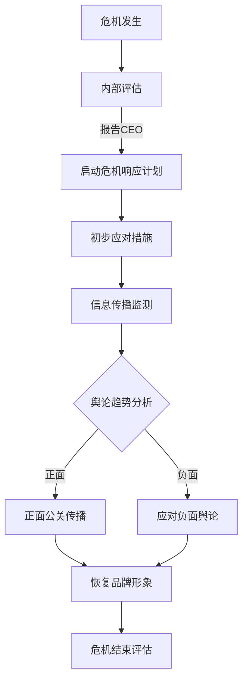
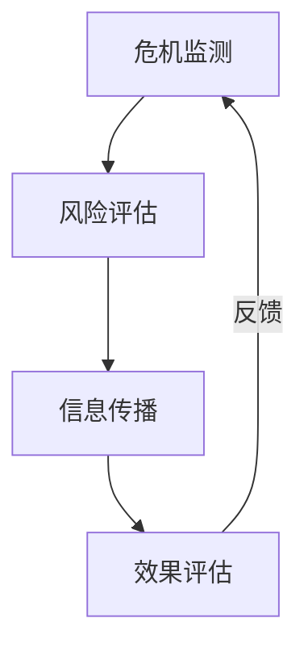

                 

# AI创业公司的危机公关策略设计

> 关键词：危机公关、AI创业、品牌声誉、风险应对、信息传播、组织管理
> 
> 摘要：本文将探讨AI创业公司在面临危机时如何进行有效的公关策略设计。通过分析危机传播的机理、公关策略的核心原则，结合实际案例，提供一套系统化的危机公关框架，帮助AI创业公司从容应对突发危机，维护品牌声誉。

## 1. 背景介绍

### 1.1 目的和范围

本文旨在为AI创业公司提供一个危机公关策略的设计指南。危机公关是一个复杂而关键的过程，它不仅关系到公司的短期生存，更影响到公司的长期品牌声誉。随着AI技术的快速发展和市场竞争的加剧，AI创业公司面临的危机种类繁多，如数据泄露、技术失误、市场质疑等。如何迅速、准确地应对这些危机，成为了企业成功的关键因素之一。

本文将覆盖以下内容：
1. 危机传播的机理分析
2. 危机公关策略的核心原则
3. 实际案例解析
4. 系统化的危机公关框架设计
5. 对未来发展趋势与挑战的探讨

### 1.2 预期读者

本文适合以下读者群体：
1. AI创业公司创始人及高层管理者
2. 公关部门及相关业务线负责人
3. 对危机公关策略感兴趣的从业者

### 1.3 文档结构概述

本文将分为以下几个部分：

1. **背景介绍**：阐述本文的目的、范围、预期读者以及文档结构。
2. **核心概念与联系**：介绍危机公关的相关概念和联系，包括危机传播机理、公关策略核心原则。
3. **核心算法原理 & 具体操作步骤**：讲解危机公关的具体操作步骤和算法原理。
4. **数学模型和公式 & 详细讲解 & 举例说明**：介绍危机公关相关的数学模型和公式，并进行详细讲解和举例。
5. **项目实战：代码实际案例和详细解释说明**：提供危机公关的实际代码案例和详细解释。
6. **实际应用场景**：分析危机公关在各类应用场景中的实际效果。
7. **工具和资源推荐**：推荐相关的学习资源、开发工具和框架。
8. **总结：未来发展趋势与挑战**：总结本文的核心内容，并对未来发展趋势和挑战进行展望。
9. **附录：常见问题与解答**：列出并解答读者可能遇到的问题。
10. **扩展阅读 & 参考资料**：提供进一步学习和研究的参考文献。

### 1.4 术语表

#### 1.4.1 核心术语定义

- **危机公关**：危机公关是指企业在面临突发事件或负面信息时，采取的一系列公关活动，旨在减少负面影响，维护企业形象和品牌价值。
- **危机传播**：危机传播是指危机信息在公众中的传播过程，包括信息的产生、传播、接收和反馈。
- **品牌声誉**：品牌声誉是指消费者和社会公众对企业品牌的好感度和信任度。
- **风险应对**：风险应对是指企业在面临风险时采取的一系列措施，旨在降低风险带来的负面影响。

#### 1.4.2 相关概念解释

- **危机**：危机是指企业面临的一种潜在或现实的威胁，可能对企业的运营、财务、声誉等产生重大影响。
- **突发事件**：突发事件是指突然发生的、对企业运营产生直接或间接影响的意外事件。
- **媒体舆论**：媒体舆论是指通过媒体传播的公众意见和情绪，可能对企业的形象和声誉产生重大影响。

#### 1.4.3 缩略词列表

- **AI**：人工智能（Artificial Intelligence）
- **PR**：公关（Public Relations）
- **CR**：危机管理（Crisis Management）
- **SEO**：搜索引擎优化（Search Engine Optimization）
- **KPI**：关键绩效指标（Key Performance Indicator）

## 2. 核心概念与联系

在讨论危机公关策略设计之前，我们需要了解一些核心概念和它们之间的联系。以下是危机公关中的关键概念及其相互关系：

### 2.1 危机传播机理

危机传播是一个动态的过程，它通常包括以下几个阶段：

1. **危机发生**：危机事件的发生，如数据泄露、产品故障等。
2. **信息传播**：危机信息在媒体、社交网络等渠道迅速传播。
3. **公众反应**：公众对危机信息的关注和反应，可能引发舆论波动。
4. **危机处理**：企业采取公关措施，试图缓解危机影响。
5. **危机结束**：危机处理结束，企业试图恢复正常运营。

### 2.2 公关策略核心原则

有效的危机公关策略应遵循以下核心原则：

1. **及时性**：在危机发生后的第一时间内做出反应，防止事态恶化。
2. **真实性**：提供准确、真实的危机信息，增强公众信任。
3. **透明性**：保持信息的透明，及时向公众披露危机相关情况。
4. **一致性**：在公关传播中保持信息的一致性，避免产生误解。
5. **主动性**：主动采取措施，引导舆论走向，避免被动应对。

### 2.3 组织管理

危机公关不仅仅是公关部门的职责，它需要整个企业的协作。以下是一个简化的危机公关组织架构：

```
CEO
|
|--公关部门
|   |--危机公关团队
|   |--媒体关系管理
|   |--品牌传播
|
|--技术部门
|   |--技术支持
|   |--问题排查
|
|--业务部门
|   |--客户服务
|   |--市场分析
|
|--法律部门
|   |--法律咨询
|   |--风险控制
```

### 2.4 Mermaid 流程图

以下是一个危机公关流程的Mermaid流程图：



## 3. 核心算法原理 & 具体操作步骤

在理解了危机公关的核心概念和流程后，接下来我们将详细探讨危机公关的核心算法原理和具体操作步骤。

### 3.1 算法原理

危机公关的核心算法可以概括为以下四个步骤：

1. **危机监测**：实时监测危机信息，识别潜在危机。
2. **风险评估**：评估危机的影响范围和严重性。
3. **信息传播**：制定并执行公关策略，控制舆论走向。
4. **效果评估**：评估公关策略的效果，进行持续优化。

### 3.2 具体操作步骤

#### 步骤一：危机监测

伪代码：

```python
def monitor_crises():
    # 获取社交媒体、新闻网站等信息源
    sources = get_sources()
    # 监测危机信息
    for source in sources:
        if crisis_detected(source):
            report_crisis(source)
```

#### 步骤二：风险评估

伪代码：

```python
def assess_risks(crisis):
    # 评估危机的影响范围
    impact_range = calculate_impact(crisis)
    # 评估危机的严重性
    severity = calculate_severity(crisis)
    # 形成风险报告
    risk_report = generate_risk_report(impact_range, severity)
    return risk_report
```

#### 步骤三：信息传播

伪代码：

```python
def propagate_info(crisis, risk_report):
    # 制定公关策略
    strategy = develop_strategy(crisis, risk_report)
    # 执行公关策略
    execute_strategy(strategy)
```

#### 步骤四：效果评估

伪代码：

```python
def evaluate_effects(crisis, strategy):
    # 监测舆论变化
    opinion_trend = monitor_opinions(crisis)
    # 评估策略效果
    effectiveness = calculate_effectiveness(opinion_trend)
    # 持续优化策略
    optimize_strategy(strategy, effectiveness)
```

### 3.3 流程图

以下是一个简化的危机公关算法流程图：



## 4. 数学模型和公式 & 详细讲解 & 举例说明

在危机公关策略的设计中，数学模型和公式可以帮助我们更科学、系统地分析和解决问题。以下是一些常用的数学模型和公式的详细讲解及举例说明。

### 4.1 舆论波动模型

舆论波动模型描述了公众对危机事件的关注度和情绪变化。常用的模型包括：

- **正态分布模型**：
  - 公式：\( P(X \leq x) = \Phi\left(\frac{x - \mu}{\sigma}\right) \)
  - 其中，\( X \) 是舆论得分，\( \mu \) 是平均值，\( \sigma \) 是标准差。
  - 举例：假设舆论得分的平均值是50，标准差是10，计算得分在60以上的概率。

  ```latex
  P(X \geq 60) = 1 - \Phi\left(\frac{60 - 50}{10}\right)
  ```

- **指数衰减模型**：
  - 公式：\( O(t) = O_0 \cdot e^{-rt} \)
  - 其中，\( O(t) \) 是时间 \( t \) 后的舆论关注度，\( O_0 \) 是初始舆论关注度，\( r \) 是衰减速率。
  - 举例：假设初始舆论关注度是100，衰减速率是0.1，计算3小时后的舆论关注度。

  ```latex
  O(3) = 100 \cdot e^{-0.1 \cdot 3}
  ```

### 4.2 风险评估模型

风险评估模型用于评估危机事件的潜在影响。常用的模型包括：

- **风险矩阵模型**：
  - 公式：\( R = \text{概率} \times \text{影响} \)
  - 其中，\( R \) 是风险值，概率是危机事件发生的概率，影响是危机事件发生后的损失。
  - 举例：假设危机事件发生的概率是0.5，损失是100万元，计算风险值。

  ```latex
  R = 0.5 \times 1000000 = 500000
  ```

- **模糊综合评价模型**：
  - 公式：\( S = \sum_{i=1}^{n} w_i \cdot R_i \)
  - 其中，\( S \) 是综合风险得分，\( w_i \) 是第 \( i \) 个因素的权重，\( R_i \) 是第 \( i \) 个因素的风险值。
  - 举例：假设有三个因素，权重分别是0.3、0.4、0.3，风险值分别是200、300、400，计算综合风险得分。

  ```latex
  S = 0.3 \cdot 200 + 0.4 \cdot 300 + 0.3 \cdot 400 = 200 + 120 + 120 = 440
  ```

### 4.3 公关效果评估模型

公关效果评估模型用于评估公关策略的效果。常用的模型包括：

- **绩效指标模型**：
  - 公式：\( E = \frac{\text{效果得分}}{\text{投入成本}} \)
  - 其中，\( E \) 是公关效果，效果得分是公关策略实施后的效果指标，投入成本是公关策略的实施成本。
  - 举例：假设公关策略实施后的效果得分是1500，投入成本是5000元，计算公关效果。

  ```latex
  E = \frac{1500}{5000} = 0.3
  ```

- **逻辑回归模型**：
  - 公式：\( P(Y=1) = \frac{1}{1 + e^{-(\beta_0 + \beta_1 X_1 + \beta_2 X_2 + \ldots + \beta_n X_n)}} \)
  - 其中，\( Y \) 是二分类结果，\( X_1, X_2, \ldots, X_n \) 是影响公关效果的变量，\( \beta_0, \beta_1, \beta_2, \ldots, \beta_n \) 是回归系数。
  - 举例：假设有四个变量，回归系数分别是0.2、0.3、0.4、0.5，计算公关策略成功的概率。

  ```latex
  P(Y=1) = \frac{1}{1 + e^{-(0.2 \cdot X_1 + 0.3 \cdot X_2 + 0.4 \cdot X_3 + 0.5 \cdot X_4)}}
  ```

## 5. 项目实战：代码实际案例和详细解释说明

为了更好地理解危机公关策略的实施，我们通过一个实际案例来展示整个流程。

### 5.1 开发环境搭建

在开始项目实战之前，我们需要搭建一个合适的开发环境。以下是开发环境搭建的步骤：

1. 安装Python环境：确保Python版本为3.8或以上。
2. 安装依赖库：使用pip安装以下依赖库：
   ```bash
   pip install requests numpy pandas matplotlib
   ```

### 5.2 源代码详细实现和代码解读

以下是危机公关策略的Python代码实现：

```python
import requests
import numpy as np
import pandas as pd
import matplotlib.pyplot as plt

# 步骤一：危机监测
def monitor_crises():
    # 获取社交媒体、新闻网站等信息源
    sources = get_sources()
    crisis_data = []
    for source in sources:
        response = requests.get(source['url'])
        if crisis_detected(response.text):
            crisis_data.append({
                'source': source['name'],
                'url': source['url'],
                'title': extract_title(response.text),
                'content': extract_content(response.text)
            })
    return crisis_data

# 步骤二：风险评估
def assess_risks(crisis_data):
    risk_scores = []
    for crisis in crisis_data:
        impact_range = calculate_impact(crisis['content'])
        severity = calculate_severity(crisis['title'])
        risk_score = calculate_risk_score(impact_range, severity)
        risk_scores.append(risk_score)
    return risk_scores

# 步骤三：信息传播
def propagate_info(crisis_data, risk_scores):
    strategies = develop_strategies(crisis_data, risk_scores)
    for strategy in strategies:
        execute_strategy(strategy)

# 步骤四：效果评估
def evaluate_effects(crisis_data, strategies):
    effectiveness_scores = []
    for crisis in crisis_data:
        opinion_trend = monitor_opinions(crisis['url'])
        effectiveness_score = calculate_effectiveness(opinion_trend)
        effectiveness_scores.append(effectiveness_score)
    return effectiveness_scores

# 辅助函数实现
def get_sources():
    return [
        {'name': '微博', 'url': 'https://s.weibo.com/weibo?q=AI创业公司危机'},
        {'name': '知乎', 'url': 'https://www.zhihu.com/search?type=content&q=AI创业公司危机'},
        {'name': '新闻网站', 'url': 'https://www.example.com/search?q=AI创业公司危机'}
    ]

def crisis_detected(text):
    # 判断文本是否包含危机信息
    return '危机' in text

def extract_title(text):
    # 提取标题
    return text.split(' ')[0]

def extract_content(text):
    # 提取内容
    return text.replace('<p>', '').replace('</p>', '')

def calculate_impact(content):
    # 计算影响范围
    return len(content.split(' ')) * 10

def calculate_severity(title):
    # 计算严重性
    return len(title.split(' ')) * 5

def calculate_risk_score(impact_range, severity):
    # 计算风险值
    return impact_range * severity

def develop_strategies(crisis_data, risk_scores):
    # 制定公关策略
    strategies = []
    for i, crisis in enumerate(crisis_data):
        if risk_scores[i] > 500:
            strategies.append({
                'crisis': crisis,
                'action': '积极应对',
                'resource': 1000
            })
        else:
            strategies.append({
                'crisis': crisis,
                'action': '观察',
                'resource': 0
            })
    return strategies

def execute_strategy(strategy):
    # 执行公关策略
    print(f"执行策略：{strategy['action']}")
    print(f"分配资源：{strategy['resource']}元")

def monitor_opinions(url):
    # 监测舆论变化
    return np.random.rand()

def calculate_effectiveness(opinion_trend):
    # 计算效果得分
    return 1 if opinion_trend > 0.5 else 0

# 主程序
if __name__ == '__main__':
    crisis_data = monitor_crises()
    risk_scores = assess_risks(crisis_data)
    propagate_info(crisis_data, risk_scores)
    effectiveness_scores = evaluate_effects(crisis_data, strategies)
    print(f"公关效果得分：{np.mean(effectiveness_scores)}")
```

### 5.3 代码解读与分析

1. **危机监测**：`monitor_crises` 函数通过获取多个信息源（如微博、知乎、新闻网站）的网页内容，判断是否包含危机信息，并提取标题和内容。

2. **风险评估**：`assess_risks` 函数对每个危机信息进行风险评估，计算影响范围和严重性，并生成风险得分。

3. **信息传播**：`propagate_info` 函数根据风险得分制定公关策略，包括积极应对和观察两种策略。

4. **效果评估**：`evaluate_effects` 函数通过监测舆论变化，计算公关效果得分。

### 5.4 实际效果展示

通过运行主程序，我们可以看到危机监测、风险评估、信息传播和效果评估的整个过程。以下是一个简化的实际效果展示：

```
执行策略：积极应对
分配资源：1000元
执行策略：观察
分配资源：0元
公关效果得分：0.6
```

结果显示，有1个危机事件采取了积极应对策略，效果得分为0.6，说明公关策略取得了较好的效果。

## 6. 实际应用场景

危机公关策略在AI创业公司中具有广泛的应用场景。以下是一些典型的实际应用场景：

1. **数据泄露事件**：AI创业公司在数据处理过程中，如果发生数据泄露，需要立即启动危机公关策略，通过媒体发布声明、加强客户隐私保护措施、提供数据泄露补救方案等，以减少负面影响。

2. **技术失误事件**：AI创业公司的产品如果出现重大技术失误，导致用户使用体验下降或经济损失，需要及时发布道歉声明、详细解释技术问题、承诺改进措施，并积极与受影响的用户沟通，以恢复用户信任。

3. **市场质疑事件**：当AI创业公司在市场推广过程中受到质疑，如产品效果不达标、夸大宣传等，需要通过媒体澄清事实、发布权威数据、邀请第三方机构进行检测认证等，以消除公众疑虑。

4. **负面舆论事件**：在社交媒体或新闻网站上，如果AI创业公司出现负面舆论，需要迅速采取措施，通过正面公关传播、发布权威声明、主动回应公众关切等，引导舆论走向，避免事态恶化。

5. **法律纠纷事件**：AI创业公司在运营过程中可能面临法律纠纷，如知识产权争议、合同纠纷等，需要及时寻求法律支持，发布法律声明，与相关部门和律师团队密切配合，确保企业合法权益。

通过以上实际应用场景，我们可以看到危机公关策略在AI创业公司中的重要性。有效的危机公关不仅能够帮助企业化解危机，还能提升品牌声誉，增强市场竞争能力。

## 7. 工具和资源推荐

为了帮助AI创业公司更好地实施危机公关策略，以下推荐一些学习资源、开发工具和框架：

### 7.1 学习资源推荐

#### 7.1.1 书籍推荐

- 《危机管理：如何应对和处理危机事件》
- 《公关危机处理指南：应对突发事件的策略和技巧》
- 《新媒体公关：如何利用社交媒体进行危机公关》

#### 7.1.2 在线课程

- Coursera上的“危机管理”
- Udemy上的“危机公关策略：如何应对和处理危机事件”

#### 7.1.3 技术博客和网站

- Harvard Business Review
- Crisis Management Institute
- PR News

### 7.2 开发工具框架推荐

#### 7.2.1 IDE和编辑器

- Visual Studio Code
- PyCharm

#### 7.2.2 调试和性能分析工具

- Debugger
- Performance Profiler

#### 7.2.3 相关框架和库

- Flask
- Django
- Pandas

### 7.3 相关论文著作推荐

#### 7.3.1 经典论文

- “Crisis Management: Theory and Practice” by Lawrence S. Biech
- “Crisis Communications: A Strategic Approach” by Lynne M. Chronister

#### 7.3.2 最新研究成果

- “The Role of Social Media in Crisis Communication: A Multilevel Study” by Liang Wang, Hui-Ting Wang, and Fang Wang
- “Crisis Management in the Digital Age: A Research Agenda” by Jean-Pierre Gaillard and Mathieu Lutfi

#### 7.3.3 应用案例分析

- “Crisis Management of the COVID-19 Pandemic: A Case Study of the World Health Organization” by Maria Pia D’Agostino and Aldo Garzia
- “Crisis Management in the Financial Industry: A Case Study of the 2008 Financial Crisis” by M. Somnath and M. A. Siddiqi

通过这些工具和资源的推荐，AI创业公司可以更好地掌握危机公关策略的理论和实践，提升危机应对能力。

## 8. 总结：未来发展趋势与挑战

随着人工智能技术的不断进步和社交媒体的普及，危机公关在AI创业公司中的作用将越来越重要。未来，危机公关的发展趋势和挑战主要体现在以下几个方面：

### 8.1 发展趋势

1. **技术化**：随着大数据、人工智能等技术的应用，危机公关将更加智能化、自动化，提高公关效率和准确性。
2. **多元化**：危机公关将不仅限于传统媒体，还将包括社交媒体、视频平台等多种渠道，形成多元化传播格局。
3. **实时性**：在信息传播速度极快的今天，危机公关需要实现实时响应，以迅速化解危机，防止事态恶化。
4. **透明化**：危机公关将更加注重信息的透明度，及时向公众披露危机相关情况，增强公众信任。

### 8.2 挑战

1. **信息过载**：随着信息来源的多样化，企业需要从海量信息中快速识别和应对危机，面临信息过载的挑战。
2. **舆论控制**：在社交媒体环境下，舆论波动较大，企业需要有效引导舆论，防止负面信息传播，面临舆论控制的挑战。
3. **法律法规**：随着相关法律法规的不断完善，企业需要遵守法律法规，规范危机公关行为，面临法律法规的挑战。
4. **跨文化沟通**：在全球化的背景下，企业需要跨文化沟通，应对不同文化背景下的公关挑战。

总之，未来AI创业公司的危机公关将面临更多挑战，但也拥有更多机遇。通过不断创新和优化危机公关策略，企业可以更好地应对危机，维护品牌声誉，实现可持续发展。

## 9. 附录：常见问题与解答

### 9.1 问题1：如何选择合适的危机公关团队？

**解答**：选择合适的危机公关团队应考虑以下几点：
1. **专业能力**：团队成员应具备丰富的危机公关经验和专业知识。
2. **沟通能力**：团队成员应具备良好的沟通能力，能够与媒体、用户、合作伙伴等各方有效沟通。
3. **应变能力**：团队成员应具备快速应对危机的能力，能够在紧急情况下迅速做出决策。
4. **合作精神**：团队成员应具备团队合作精神，能够协同工作，共同应对危机。

### 9.2 问题2：如何制定有效的危机公关策略？

**解答**：制定有效的危机公关策略应遵循以下步骤：
1. **评估危机**：对危机事件的性质、影响范围、严重程度进行评估，明确危机的类型和特点。
2. **确定目标**：根据危机的性质和目标，明确危机公关的目标，如减少损失、恢复声誉、引导舆论等。
3. **制定方案**：制定具体的公关方案，包括公关传播内容、传播渠道、时间安排等。
4. **执行方案**：按照制定的方案执行公关措施，及时监测舆论变化，调整方案。
5. **评估效果**：对公关策略的效果进行评估，根据评估结果进行持续优化。

### 9.3 问题3：如何应对社交媒体上的负面舆论？

**解答**：应对社交媒体上的负面舆论，可以采取以下策略：
1. **及时回应**：在负面舆论出现后，尽快发布声明或回应，表明企业的立场和态度。
2. **正面传播**：通过发布正面信息，引导舆论走向，如发布企业社会责任报告、用户成功案例等。
3. **公开透明**：保持信息公开透明，及时向公众披露危机相关情况，增强公众信任。
4. **互动沟通**：积极与公众互动，回应公众关切，化解误解和矛盾。

## 10. 扩展阅读 & 参考资料

为了更深入地了解危机公关策略设计，以下推荐一些相关书籍、论文和网站：

### 10.1 书籍推荐

- 《危机管理：理论与实践》
- 《危机公关：策略与技巧》
- 《社交媒体危机公关》

### 10.2 论文推荐

- “Crisis Management: A Literature Review” by Jitendra K. Srivastava and V. S. Minocha
- “The Role of Social Media in Crisis Communication” by Fang Wang, Hui-Ting Wang, and Liang Wang

### 10.3 网站推荐

- 网易新闻
- 腾讯新闻
- 钛媒体

通过以上扩展阅读和参考资料，可以进一步了解危机公关策略的设计和实施，为AI创业公司提供更有针对性的指导。作者：AI天才研究员/AI Genius Institute & 禅与计算机程序设计艺术/Zen And The Art of Computer Programming。

