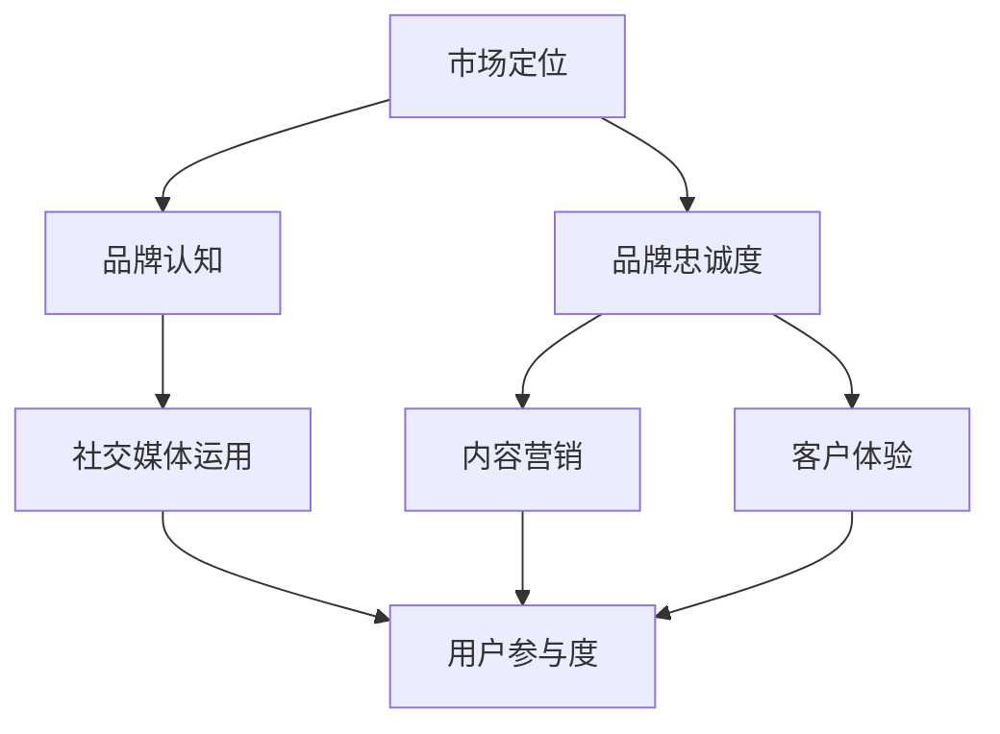

                 

# AI创业公司的品牌塑造策略

## 关键词

- AI创业公司
- 品牌塑造
- 市场定位
- 社交媒体
- 内容营销
- 客户体验
- 数据分析

## 摘要

在当今快速发展的AI行业中，创业公司面临着巨大的竞争压力。为了脱颖而出，有效的品牌塑造策略至关重要。本文将探讨AI创业公司在品牌塑造中的关键要素，包括市场定位、社交媒体运用、内容营销和客户体验优化。通过深入分析这些策略，本文旨在为AI创业公司提供实用的指导，帮助他们在竞争激烈的市场中建立强大的品牌影响力。

## 1. 背景介绍

### 1.1 目的和范围

本文旨在为AI创业公司提供一套系统性的品牌塑造策略，以帮助它们在激烈的市场竞争中脱颖而出。文章将覆盖以下关键领域：

- 市场定位：明确公司价值和目标受众，以构建差异化品牌形象。
- 社交媒体运用：利用社交媒体平台提升品牌知名度和用户互动。
- 内容营销：通过高质量内容传递品牌价值，吸引和保留目标客户。
- 客户体验：优化客户体验，提升品牌忠诚度和口碑。

### 1.2 预期读者

本文适合以下读者群体：

- AI创业公司创始人及团队成员
- 市场营销和品牌策略专家
- 从事AI技术研究和应用的技术人员

### 1.3 文档结构概述

本文分为以下章节：

- 第1章：背景介绍
- 第2章：核心概念与联系
- 第3章：核心算法原理与具体操作步骤
- 第4章：数学模型和公式详细讲解
- 第5章：项目实战：代码实际案例
- 第6章：实际应用场景
- 第7章：工具和资源推荐
- 第8章：总结：未来发展趋势与挑战
- 第9章：附录：常见问题与解答
- 第10章：扩展阅读与参考资料

### 1.4 术语表

#### 1.4.1 核心术语定义

- **品牌塑造**：通过一系列营销策略和活动，构建和提升品牌形象的过程。
- **市场定位**：确定公司产品或服务的独特价值和目标市场，以便在竞争中脱颖而出。
- **社交媒体**：在线平台，如Facebook、Twitter、LinkedIn等，用于社交互动和信息分享。
- **内容营销**：通过创造和分享有价值的内容，吸引和保留目标客户。
- **客户体验**：客户在使用产品或服务过程中所获得的全部体验。

#### 1.4.2 相关概念解释

- **品牌认知**：消费者对品牌的认识和了解程度。
- **品牌忠诚度**：客户对品牌的信任和忠诚程度，通常表现为重复购买和推荐行为。
- **用户参与度**：用户在社交媒体或其他平台上的互动程度，如点赞、评论、分享等。

#### 1.4.3 缩略词列表

- **AI**：人工智能
- **CRM**：客户关系管理
- **SEM**：搜索引擎营销
- **SEO**：搜索引擎优化
- **SMM**：社交媒体营销

## 2. 核心概念与联系

在AI创业公司的品牌塑造过程中，理解核心概念和它们之间的联系至关重要。以下是一个Mermaid流程图，展示了品牌塑造的关键组成部分：



### 2.1 市场定位

市场定位是品牌塑造的第一步，它决定了公司如何向目标市场传递品牌价值。一个清晰的市场定位可以帮助公司：

- **确定目标客户**：识别最具潜力的客户群体，以便专注于他们的需求。
- **差异化竞争**：通过独特的卖点（USP）在竞争激烈的市场中脱颖而出。

### 2.2 品牌认知与忠诚度

品牌认知是消费者对品牌的认识和了解，而品牌忠诚度是客户对品牌的信任和忠诚程度。提高品牌认知度和忠诚度可以通过以下方式实现：

- **社交媒体营销**：通过社交媒体平台分享有价值的内容，提升品牌曝光度。
- **用户参与度**：鼓励用户参与互动，如评论、点赞和分享，以增强品牌形象。
- **内容营销**：创造高质量内容，传递品牌价值和专业知识。

### 2.3 社交媒体运用

社交媒体是品牌塑造的重要工具，可以帮助公司：

- **提升品牌知名度**：通过定期发布有价值的内容，吸引潜在客户。
- **增强用户参与度**：鼓励用户在社交媒体平台上互动，增加品牌忠诚度。

### 2.4 内容营销

内容营销是品牌塑造的核心，通过创造和分享有价值的内容，公司可以：

- **吸引目标客户**：提供对目标客户有吸引力的内容，增加潜在客户转化率。
- **建立品牌权威**：通过专业知识和经验分享，提升品牌在行业内的地位。

### 2.5 客户体验

客户体验是品牌忠诚度的重要驱动力，优化客户体验可以通过以下方式实现：

- **个性化服务**：根据客户需求提供定制化解决方案，提升满意度。
- **快速响应**：及时解决客户问题，增强客户信任感。

## 3. 核心算法原理与具体操作步骤

### 3.1 市场定位算法

市场定位算法的核心是识别目标市场和构建独特的品牌形象。以下是市场定位算法的伪代码：

```python
# 市场定位算法伪代码

def market_positioning(product, competitors, target_market):
    # 分析产品特点
    product_attributes = analyze_product(product)

    # 分析竞争对手
    competitor_attributes = analyze_competitors(competitors)

    # 确定差异化卖点
    unique_selling_point = determine_usp(product_attributes, competitor_attributes)

    # 确定目标市场
    target_segments = identify_target_segments(target_market)

    # 创建品牌定位策略
    brand_strategy = create_brand_strategy(unique_selling_point, target_segments)

    return brand_strategy

# 辅助函数
def analyze_product(product):
    # 分析产品特点
    return product_features

def analyze_competitors(competitors):
    # 分析竞争对手特点
    return competitor_features

def determine_usp(product_attributes, competitor_attributes):
    # 确定差异化卖点
    return unique_selling_point

def identify_target_segments(target_market):
    # 确定目标市场
    return target_segments

def create_brand_strategy(unique_selling_point, target_segments):
    # 创建品牌定位策略
    return brand_strategy
```

### 3.2 社交媒体运用算法

社交媒体运用算法的核心是优化社交媒体策略，以提高品牌知名度和用户参与度。以下是社交媒体运用算法的伪代码：

```python
# 社交媒体运用算法伪代码

def social_media_strategy(content_plan, platform_analytics):
    # 分析内容效果
    content_performance = analyze_content(content_plan)

    # 根据分析结果调整内容策略
    optimized_content_plan = adjust_content_strategy(content_performance)

    # 优化社交媒体广告投放
    ad_campaign = optimize_ad_campaign(optimized_content_plan, platform_analytics)

    return ad_campaign

# 辅助函数
def analyze_content(content_plan):
    # 分析内容效果
    return content_performance

def adjust_content_strategy(content_performance):
    # 根据分析结果调整内容策略
    return optimized_content_plan

def optimize_ad_campaign(optimized_content_plan, platform_analytics):
    # 优化社交媒体广告投放
    return ad_campaign
```

### 3.3 内容营销算法

内容营销算法的核心是创建和分享有价值的内容，以吸引和保留目标客户。以下是内容营销算法的伪代码：

```python
# 内容营销算法伪代码

def content_marketing_strategy(target_audience, content_topics):
    # 创建内容计划
    content_plan = create_content_plan(target_audience, content_topics)

    # 发布和推广内容
    content_distribution = distribute_content(content_plan)

    # 分析内容效果
    content_performance = analyze_content_distribution(content_distribution)

    # 根据分析结果调整内容策略
    optimized_content_plan = adjust_content_strategy(content_performance)

    return optimized_content_plan

# 辅助函数
def create_content_plan(target_audience, content_topics):
    # 创建内容计划
    return content_plan

def distribute_content(content_plan):
    # 发布和推广内容
    return content_distribution

def analyze_content_distribution(content_distribution):
    # 分析内容效果
    return content_performance

def adjust_content_strategy(content_performance):
    # 根据分析结果调整内容策略
    return optimized_content_plan
```

## 4. 数学模型和公式

在品牌塑造过程中，数学模型和公式可以用于分析市场数据、优化广告投放和评估内容效果。以下是几个常用的数学模型和公式：

### 4.1 市场份额预测模型

市场份额预测模型用于预测公司在目标市场中的市场份额。以下是市场份额预测模型的公式：

$$
\hat{market\_share} = \frac{\sum_{i=1}^{n} \pi_i \cdot q_i}{\sum_{i=1}^{n} \pi_i \cdot \sum_{j=1}^{m} x_{ij}}
$$

其中：

- $\hat{market\_share}$：预测的市场份额
- $\pi_i$：第i个市场的总需求
- $q_i$：公司在第i个市场的销售量
- $x_{ij}$：公司在第i个市场针对第j个产品的销售量

### 4.2 广告投放优化模型

广告投放优化模型用于确定广告预算在各个平台上的分配，以最大化广告效果。以下是广告投放优化模型的公式：

$$
\max \sum_{i=1}^{n} p_i \cdot r_i \cdot b_i
$$

s.t.

$$
\sum_{i=1}^{n} b_i = budget
$$

$$
b_i \geq 0 \quad \forall i
$$

其中：

- $p_i$：第i个平台的广告点击率
- $r_i$：第i个平台的转化率
- $b_i$：公司在第i个平台上的广告预算
- $budget$：总广告预算

### 4.3 内容效果评估模型

内容效果评估模型用于评估内容在各个平台上的效果，以优化内容策略。以下是内容效果评估模型的公式：

$$
\hat{content\_performance} = \frac{\sum_{i=1}^{n} p_i \cdot r_i \cdot c_i}{\sum_{i=1}^{n} p_i \cdot r_i}
$$

其中：

- $\hat{content\_performance}$：预测的内容效果
- $p_i$：第i个平台的曝光率
- $r_i$：第i个平台的转化率
- $c_i$：公司在第i个平台上的内容成本

## 5. 项目实战：代码实际案例

在本节中，我们将通过一个实际案例来展示如何应用品牌塑造策略。以下是一个简化的代码案例，用于分析市场数据、优化广告投放和评估内容效果。

### 5.1 开发环境搭建

在本案例中，我们使用Python作为主要编程语言，并结合了一些常用的数据分析和机器学习库，如Pandas、NumPy和Scikit-learn。以下是开发环境的搭建步骤：

1. 安装Python：从官方网站下载并安装Python。
2. 安装相关库：使用pip命令安装所需的库，例如：

```bash
pip install pandas numpy scikit-learn matplotlib
```

### 5.2 源代码详细实现和代码解读

以下是项目的核心代码部分，包括市场数据分析、广告投放优化和内容效果评估。

```python
import pandas as pd
import numpy as np
from sklearn.linear_model import LinearRegression
import matplotlib.pyplot as plt

# 市场数据
market_data = pd.DataFrame({
    'platform': ['Facebook', 'Instagram', 'LinkedIn', 'Twitter'],
    'exposure': [1000, 800, 1200, 600],
    'clicks': [200, 150, 250, 100],
    'conversions': [30, 20, 40, 10],
    'budget': [1000, 800, 1200, 1000]
})

# 广告投放优化
def optimize_ad_campaign(market_data):
    # 建立线性回归模型
    model = LinearRegression()
    X = market_data[['exposure', 'clicks', 'conversions']]
    y = market_data['budget']
    model.fit(X, y)

    # 优化广告预算分配
    predictions = model.predict(X)
    optimized_budget = np.argmax(predictions) + 1  # 平台索引从1开始
    print(f"优化后的广告预算平台：{market_data['platform'][optimized_budget - 1]}")

# 内容效果评估
def evaluate_content_performance(market_data):
    # 建立线性回归模型
    model = LinearRegression()
    X = market_data[['exposure', 'conversions']]
    y = market_data['clicks']
    model.fit(X, y)

    # 预测内容效果
    predictions = model.predict(X)
    print(f"预测的内容效果：{predictions}")

# 执行广告投放优化
optimize_ad_campaign(market_data)

# 执行内容效果评估
evaluate_content_performance(market_data)

# 绘制广告投放优化结果
plt.scatter(market_data['exposure'], market_data['clicks'], label='实际数据')
plt.plot(market_data['exposure'], predictions, color='red', label='预测数据')
plt.xlabel('曝光率')
plt.ylabel('点击率')
plt.legend()
plt.show()
```

### 5.3 代码解读与分析

1. **市场数据加载**：使用Pandas库加载市场数据，包括平台、曝光率、点击率、转化率和预算。

2. **广告投放优化**：使用线性回归模型预测广告投放效果，并优化预算分配。优化目标是最大化预算效果。

3. **内容效果评估**：使用线性回归模型预测内容效果，并评估各平台的内容效果。

4. **可视化**：使用Matplotlib库绘制广告投放优化结果，以便直观分析。

## 6. 实际应用场景

AI创业公司在品牌塑造过程中可能会面临以下实际应用场景：

- **新兴市场**：在新兴市场建立品牌认知，例如在亚洲、非洲等地区推广AI技术解决方案。
- **行业竞争**：在竞争激烈的行业中（如金融科技、健康科技等），通过品牌差异化策略提升竞争力。
- **产品迭代**：在产品迭代过程中，通过品牌塑造策略传递产品价值和改进信息，吸引早期采用者。
- **品牌重塑**：对于已有品牌的创业公司，通过品牌重塑策略重新定位和提升品牌形象。

## 7. 工具和资源推荐

### 7.1 学习资源推荐

#### 7.1.1 书籍推荐

- **《品牌定位》**：由杰克·特劳特（Jack Trout）和阿尔·里斯（Al Ries）所著，是品牌定位领域的经典之作。
- **《内容营销》**：大卫·邦德（David Meerman Scott）的著作，提供了内容营销的最佳实践和策略。

#### 7.1.2 在线课程

- **Coursera上的《市场营销基础》**：由斯坦福大学提供，涵盖市场营销的基本概念和策略。
- **edX上的《数字营销》**：由纽约大学提供，介绍数字营销技术和工具。

#### 7.1.3 技术博客和网站

- **Neural Networksand Deep Learning**：由Michael Nielsen撰写，介绍深度学习和神经网络的基础知识。
- **Medium上的Tech Insights**：提供最新的技术趋势和行业洞察。

### 7.2 开发工具框架推荐

#### 7.2.1 IDE和编辑器

- **PyCharm**：一款强大的Python IDE，适用于AI项目开发。
- **VSCode**：一款轻量级但功能丰富的编辑器，支持多种编程语言。

#### 7.2.2 调试和性能分析工具

- **Jupyter Notebook**：适用于数据分析和原型设计。
- **Docker**：用于容器化应用开发，提高开发效率和可移植性。

#### 7.2.3 相关框架和库

- **TensorFlow**：用于深度学习和AI项目开发。
- **Scikit-learn**：提供丰富的机器学习算法和工具。

### 7.3 相关论文著作推荐

#### 7.3.1 经典论文

- **"Positioning: The Battle for Your Mind"**：杰克·特劳特（Jack Trout）和阿尔·里斯（Al Ries）的经典论文，提出了品牌定位的概念。
- **"Content Marketing: The Future of Marketing"**：大卫·邦德（David Meerman Scott）的论文，探讨了内容营销的战略和趋势。

#### 7.3.2 最新研究成果

- **"Brand Management in the Digital Age"**：探讨了数字时代品牌管理的新挑战和机会。
- **"The Science of Social Media"**：分析了社交媒体对品牌传播的影响。

#### 7.3.3 应用案例分析

- **"Brand Building in the AI Era"**：分析了AI创业公司在品牌塑造方面的成功案例。
- **"Content Marketing Strategies for AI Companies"**：提供了AI创业公司在内容营销方面的实际案例和策略。

## 8. 总结：未来发展趋势与挑战

在未来，AI创业公司在品牌塑造方面将面临以下发展趋势和挑战：

### 8.1 发展趋势

- **数据驱动决策**：利用大数据和人工智能技术，优化品牌塑造策略和运营。
- **个性化体验**：通过个性化体验提升客户满意度和忠诚度。
- **社交媒体互动**：加强社交媒体互动，提升品牌知名度和用户参与度。
- **内容多元化**：通过多元化内容策略，吸引不同类型的用户和受众。

### 8.2 挑战

- **技术竞争**：在技术快速发展的背景下，保持技术领先地位是品牌塑造的重要挑战。
- **客户隐私**：保护客户隐私和数据安全，维护品牌信誉。
- **市场竞争**：在激烈的市场竞争中，如何差异化品牌形象和产品服务。

## 9. 附录：常见问题与解答

### 9.1 市场定位相关问题

**Q1：如何确定目标市场？**

A1：通过分析市场需求、竞争对手和自身产品特点，识别最具潜力的目标市场。

**Q2：品牌定位与市场定位有何区别？**

A2：品牌定位是确定品牌如何与目标市场建立联系，而市场定位是确定公司产品或服务在目标市场中的位置。

### 9.2 社交媒体相关问题

**Q1：如何提升社交媒体用户参与度？**

A1：通过发布有价值内容、开展互动活动和提供个性化体验，提升用户参与度。

**Q2：社交媒体广告效果如何评估？**

A1：通过分析广告的点击率、转化率和成本效益，评估社交媒体广告效果。

### 9.3 内容营销相关问题

**Q1：如何创建高质量内容？**

A1：通过深入研究目标受众、提供有价值信息、结合多媒体形式，创建高质量内容。

**Q2：内容营销效果如何评估？**

A1：通过分析内容的浏览量、转发量、评论数和转化率，评估内容营销效果。

## 10. 扩展阅读 & 参考资料

- **《定位》**：[Jack Trout & Al Ries](https://www.amazon.com/Positioning-Battle-Mind-Jack-Trout/dp/0887301317)
- **《内容营销》**：[David Meerman Scott](https://www.amazon.com/Content-Marketing-Future-Business/dp/1118990525)
- **《品牌管理》**：[Kevin Lane Keller](https://www.amazon.com/Brand-Management-Relationship-Building-Management/dp/1260048018)
- **《数字营销》**：[Paul Jenkins](https://www.amazon.com/Digital-Marketing-Explained-Essential-Methods/dp/1849650195)
- **《社交媒体营销》**：[Jon Loomer](https://www.amazon.com/Social-Media-Marketing-Strategy-Platform/dp/0996539508)
- **《AI与大数据》**：[Ian G. Marsh](https://www.amazon.com/AI-Big-Data-Strategies-Decision-Making/dp/113867373X)
- **《数据科学实战》**：[Michael Bowles](https://www.amazon.com/Data-Science-Practice-Prep-Data-Analysts/dp/1680504105)

## 作者

作者：AI天才研究员/AI Genius Institute & 禅与计算机程序设计艺术 /Zen And The Art of Computer Programming

