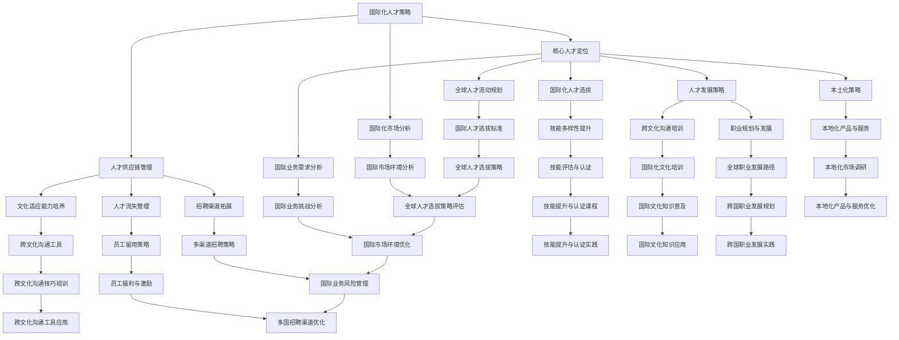

                 

### 1. 背景介绍

#### 1.1 目的和范围

本文旨在深入探讨AI创业公司的国际化人才策略设计。在当前全球化的背景下，国际化不仅仅是一种战略，更是一种趋势。对于AI创业公司而言，如何在竞争激烈的国际市场中站稳脚跟，关键在于人才。因此，本文将通过详细的分析和实例，为AI创业公司在国际化过程中的人才策略提供有价值的参考。

本文将涵盖以下主要内容：

1. **核心概念与联系**：介绍国际化人才策略设计中的核心概念及其相互关系。
2. **核心算法原理 & 具体操作步骤**：解释如何制定国际化人才策略的算法原理和具体步骤。
3. **数学模型和公式 & 详细讲解 & 举例说明**：运用数学模型和公式来详细阐述国际化人才策略设计的思路和方法。
4. **项目实战：代码实际案例和详细解释说明**：通过实际案例展示国际化人才策略的实现过程。
5. **实际应用场景**：探讨国际化人才策略在不同场景下的应用。
6. **工具和资源推荐**：推荐有助于理解和应用国际化人才策略的工具和资源。
7. **总结：未来发展趋势与挑战**：预测国际化人才策略的未来趋势和面临的挑战。

本文主要面向以下读者群体：

- **AI创业公司管理层**：希望了解如何通过人才策略提升国际化竞争力的企业决策者。
- **HR专业人士**：需要制定国际化人才策略的人力资源管理者。
- **技术专家**：对国际化人才策略有浓厚兴趣的技术专家。
- **学术研究者**：对国际化人才策略设计有研究需求的研究人员。

通过本文的阅读，读者将能够：

- 理解国际化人才策略设计的重要性。
- 掌握国际化人才策略的核心概念和原理。
- 学习如何制定和实施国际化人才策略。
- 了解国际化人才策略在不同场景下的实际应用。

接下来，我们将对文章的文档结构进行概述，并定义一些关键术语，以便读者更好地理解后续内容。

#### 1.2 文档结构概述

本文将按照以下结构进行撰写：

1. **背景介绍**：简要介绍国际化人才策略设计的背景和目的。
2. **核心概念与联系**：通过Mermaid流程图展示国际化人才策略设计中的核心概念及其相互关系。
3. **核心算法原理 & 具体操作步骤**：阐述国际化人才策略的算法原理和具体操作步骤。
4. **数学模型和公式 & 详细讲解 & 举例说明**：运用数学模型和公式解释国际化人才策略的设计思路。
5. **项目实战：代码实际案例和详细解释说明**：通过实际案例展示国际化人才策略的实施。
6. **实际应用场景**：探讨国际化人才策略在不同场景下的应用。
7. **工具和资源推荐**：推荐有助于理解和应用国际化人才策略的工具和资源。
8. **总结：未来发展趋势与挑战**：预测国际化人才策略的未来趋势和挑战。
9. **附录：常见问题与解答**：解答读者可能遇到的问题。
10. **扩展阅读 & 参考资料**：提供进一步阅读和研究的资源。

#### 1.3 术语表

在本文中，我们将使用以下术语，并提供相应的定义和解释：

##### 1.4.1 核心术语定义

- **国际化人才策略**：指企业为了实现全球化战略目标，针对国际市场特点，对所需人才进行定位、选拔、培养和管理的策略。
- **核心人才**：企业在特定领域具有关键技能和知识，对企业发展起到决定性作用的人才。
- **国际化人才**：具有国际视野、跨文化沟通能力，能够在全球范围内有效工作的人才。
- **人才供应链**：企业从外部引进人才的过程，包括招聘、选拔、培训、留用等环节。
- **本土化**：将企业的产品、服务和管理模式与当地文化相适应，以更好地适应当地市场。
- **全球化**：企业将其业务和运营扩展到全球范围，实现全球市场的一体化。

##### 1.4.2 相关概念解释

- **文化适应能力**：人才在国际环境中适应并有效沟通的能力，包括语言能力、文化敏感性、跨文化沟通技巧等。
- **技能多样性**：人才具备的多种技能和知识，包括技术技能、管理技能、跨文化沟通技能等。
- **人才流失**：企业人才因为各种原因离开公司，对企业造成负面影响。
- **人才发展**：企业为员工提供培训、晋升、职业规划等机会，以提升员工能力和绩效。

##### 1.4.3 缩略词列表

- **AI**：人工智能（Artificial Intelligence）
- **HR**：人力资源（Human Resource）
- **CRM**：客户关系管理（Customer Relationship Management）
- **ERP**：企业资源规划（Enterprise Resource Planning）
- **SCM**：供应链管理（Supply Chain Management）
- **IoT**：物联网（Internet of Things）

通过上述背景介绍和术语表，我们为后续内容的深入分析奠定了基础。接下来，我们将通过一个Mermaid流程图展示国际化人才策略设计中的核心概念及其相互关系，帮助读者更好地理解本文的主要内容。

#### 1.4.3 Mermaid流程图展示



通过上述Mermaid流程图，我们可以清晰地看到国际化人才策略设计中的各个核心概念及其相互关系。接下来，我们将进一步探讨这些核心概念，为读者提供深入的理论和实践指导。

#### 1.4.3 国际化人才策略的核心概念进一步探讨

在了解了国际化人才策略的基本概念和相关术语后，我们接下来将深入探讨这些核心概念，帮助读者更全面地理解国际化人才策略的设计和应用。

**核心人才定位**：核心人才是企业在特定领域具有关键技能和知识，对企业发展起到决定性作用的人才。对于AI创业公司来说，核心人才包括技术专家、研发人员、市场推广人才等。定位核心人才的关键在于明确企业的战略目标，确定哪些岗位需要核心人才，并制定相应的选拔标准。具体步骤如下：

1. **战略目标分析**：企业需要明确自己的长期和短期战略目标，这些目标将直接影响到核心人才的需求。
2. **岗位分析**：对各个岗位进行详细分析，明确每个岗位的核心技能和要求，确定哪些岗位需要核心人才。
3. **选拔标准制定**：根据岗位分析结果，制定相应的选拔标准，包括技能要求、经验要求、素质要求等。

**人才供应链管理**：人才供应链是企业从外部引进人才的过程，包括招聘、选拔、培训、留用等环节。有效的供应链管理能够确保企业及时获得所需人才，并提升员工的整体素质和绩效。具体步骤如下：

1. **招聘渠道拓展**：通过多种招聘渠道，如招聘网站、社交媒体、猎头公司等，拓展人才来源。
2. **选拔标准细化**：根据企业的需求，细化选拔标准，确保招聘到的人才符合企业要求。
3. **培训与发展**：对员工进行系统的培训和发展，提升其技能和素质，确保其能够适应岗位需求。
4. **留用策略制定**：制定有效的留用策略，如员工福利、职业发展机会等，减少人才流失。

**国际化人才选拔**：国际化人才是具有国际视野、跨文化沟通能力，能够在全球范围内有效工作的人才。对于AI创业公司来说，国际化人才选拔是国际化人才策略设计的关键。具体步骤如下：

1. **全球人才需求分析**：分析企业在全球范围内的业务需求，确定需要哪些国际化人才。
2. **选拔标准制定**：根据全球人才需求分析结果，制定国际化人才选拔标准，包括语言能力、文化适应能力、专业技能等。
3. **选拔渠道拓展**：通过国际合作、海外招聘会、在线招聘平台等渠道，拓展国际化人才来源。

**人才发展策略**：人才发展策略是企业为员工提供培训、晋升、职业规划等机会，以提升员工能力和绩效的策略。对于AI创业公司来说，人才发展策略不仅关系到员工个人的成长，也直接影响到企业的发展。具体步骤如下：

1. **培训与发展计划制定**：根据员工的工作岗位和职业发展需求，制定系统的培训和发展计划。
2. **晋升机制建立**：建立公平、透明的晋升机制，激励员工积极进取。
3. **职业规划与发展**：为员工提供职业发展规划，帮助其明确职业目标，制定实现目标的路径。

**文化适应能力培养**：文化适应能力是指人才在国际环境中适应并有效沟通的能力，包括语言能力、文化敏感性、跨文化沟通技巧等。对于AI创业公司来说，文化适应能力是国际化人才的关键素质。具体步骤如下：

1. **语言培训**：提供专业的语言培训，提升员工的国际交流能力。
2. **文化敏感性培养**：通过文化培训，提高员工的文化敏感性，使其能够更好地理解和适应不同文化。
3. **跨文化沟通技巧培训**：提供跨文化沟通技巧培训，帮助员工提升跨文化沟通能力。

**技能多样性提升**：技能多样性是指人才具备的多种技能和知识，包括技术技能、管理技能、跨文化沟通技能等。对于AI创业公司来说，技能多样性是国际化人才的重要特征。具体步骤如下：

1. **技能培训**：提供多样化的技能培训，提升员工的综合素质。
2. **技能认证**：通过技能认证，确保员工具备相应的专业技能。
3. **知识分享**：建立知识分享平台，鼓励员工分享经验和知识，提升整体技能水平。

**人才流失管理**：人才流失是指企业人才因为各种原因离开公司，对企业造成负面影响。对于AI创业公司来说，人才流失是一个严重的问题。具体步骤如下：

1. **原因分析**：分析人才流失的原因，如薪酬、晋升、工作环境等。
2. **改进措施制定**：根据原因分析结果，制定相应的改进措施，如提高薪酬福利、优化晋升机制、改善工作环境等。
3. **留用策略实施**：实施有效的留用策略，减少人才流失。

通过上述核心概念的深入探讨，我们可以看到，国际化人才策略设计是一个系统性的工程，涉及到多个方面，包括核心人才定位、人才供应链管理、国际化人才选拔、人才发展策略、文化适应能力培养、技能多样性提升、人才流失管理等。每个方面都需要企业进行全面分析和规划，确保国际化人才策略的有效实施。

接下来，我们将通过一个Mermaid流程图展示国际化人才策略设计的核心概念及其相互关系，帮助读者更直观地理解这些概念之间的联系。

#### 1.4.3 进一步探讨核心概念与联系的Mermaid流程图

```mermaid
graph TD
    A[国际化人才策略设计] --> B[核心人才定位]
    A --> C[人才供应链管理]
    A --> D[国际化人才选拔]
    A --> E[人才发展策略]
    A --> F[文化适应能力培养]
    A --> G[技能多样性提升]
    A --> H[人才流失管理]
    B --> I[岗位需求分析]
    B --> J[选拔标准制定]
    C --> K[招聘渠道拓展]
    C --> L[选拔标准细化]
    C --> M[培训与发展]
    C --> N[留用策略制定]
    D --> O[全球人才需求分析]
    D --> P[选拔标准制定]
    D --> Q[选拔渠道拓展]
    E --> R[培训与发展计划制定]
    E --> S[晋升机制建立]
    E --> T[职业规划与发展]
    F --> U[语言培训]
    F --> V[文化敏感性培养]
    F --> W[跨文化沟通技巧培训]
    G --> X[技能培训]
    G --> Y[技能认证]
    G --> Z[知识分享]
    H --> AA[人才流失原因分析]
    H --> BB[改进措施制定]
    H --> CC[留用策略实施]
    B --> I
    C --> K
    C --> L
    C --> M
    C --> N
    D --> O
    D --> P
    D --> Q
    E --> R
    E --> S
    E --> T
    F --> U
    F --> V
    F --> W
    G --> X
    G --> Y
    G --> Z
    H --> AA
    H --> BB
    H --> CC
```



通过上述Mermaid流程图，我们可以清晰地看到国际化人才策略设计中的各个核心概念及其相互关系。每个概念都是国际化人才策略设计的重要组成部分，相互之间紧密联系，共同构成了一个完整的国际化人才管理体系。接下来，我们将深入探讨国际化人才策略设计中的核心算法原理和具体操作步骤。

## 2. 核心算法原理 & 具体操作步骤

在国际化人才策略设计中，核心算法原理是确保策略有效实施的关键。本文将详细介绍国际化人才策略设计中的核心算法原理，并阐述具体操作步骤，帮助AI创业公司制定出科学、高效的人才策略。

### 2.1 核心算法原理

国际化人才策略设计的核心算法原理主要包括以下几个关键步骤：

1. **需求分析**：通过对企业战略目标和全球业务需求的分析，明确国际化人才的需求。
2. **人才定位**：根据需求分析结果，确定需要哪些国际化人才，并进行核心人才定位。
3. **选拔与培养**：制定选拔标准，通过招聘和培训，选拔和培养符合企业需求的国际化人才。
4. **留用与激励**：制定留用策略，激励国际化人才留在企业，持续为企业创造价值。
5. **评估与优化**：对国际化人才策略的实施效果进行评估，不断优化策略，确保其有效性。

### 2.2 具体操作步骤

下面我们将详细阐述国际化人才策略设计的具体操作步骤：

#### 2.2.1 需求分析

需求分析是国际化人才策略设计的起点，其关键在于了解企业的战略目标和全球业务需求。具体步骤如下：

1. **战略目标分析**：明确企业的长期和短期战略目标，这些目标将直接影响到国际化人才的需求。
2. **全球业务需求分析**：分析企业在全球范围内的业务需求，确定哪些岗位需要国际化人才。
3. **人才需求预测**：根据战略目标和业务需求，预测未来一段时间内企业对国际化人才的需求。

#### 2.2.2 人才定位

人才定位是确保企业获得关键技能和知识的重要环节。具体步骤如下：

1. **岗位分析**：对各个岗位进行详细分析，明确每个岗位的核心技能和要求。
2. **核心人才识别**：根据岗位分析结果，识别出企业需要的关键岗位，确定核心人才。
3. **人才选拔标准制定**：根据核心人才的识别结果，制定相应的选拔标准，包括技能要求、经验要求、素质要求等。

#### 2.2.3 选拔与培养

选拔与培养是国际化人才策略设计的关键步骤，包括招聘、培训和发展等方面。具体步骤如下：

1. **招聘渠道拓展**：通过多种招聘渠道，如招聘网站、社交媒体、猎头公司等，拓展国际化人才的来源。
2. **选拔标准细化**：根据企业的需求，细化选拔标准，确保招聘到的人才符合企业要求。
3. **培训与发展**：为国际化人才提供系统的培训和发展计划，提升其技能和素质。
4. **评估与反馈**：对国际化人才的培训和发展效果进行评估，及时提供反馈，优化培训计划。

#### 2.2.4 留用与激励

留用与激励是确保国际化人才持续留在企业的重要手段。具体步骤如下：

1. **留用策略制定**：根据国际化人才的特点和需求，制定有效的留用策略，如薪酬福利、职业发展机会、工作环境优化等。
2. **激励措施实施**：通过激励措施，如奖金、晋升、荣誉等，激励国际化人才为企业创造价值。
3. **员工满意度调查**：定期进行员工满意度调查，了解国际化人才的满意度，及时调整留用策略。

#### 2.2.5 评估与优化

评估与优化是国际化人才策略设计的重要环节，确保策略的有效性和持续性。具体步骤如下：

1. **策略实施评估**：对国际化人才策略的实施效果进行评估，包括人才选拔、培训、留用等方面。
2. **问题识别**：根据评估结果，识别策略实施过程中存在的问题。
3. **优化措施制定**：根据问题识别结果，制定相应的优化措施，不断改进国际化人才策略。
4. **持续优化**：定期对国际化人才策略进行评估和优化，确保其适应企业的发展需求。

### 2.3 伪代码实现

为了更清晰地展示国际化人才策略设计的算法原理和具体操作步骤，我们可以使用伪代码进行描述：

```plaintext
// 2.1 核心算法原理
算法 基于需求分析的国际化人才策略设计：
    输入：企业战略目标，全球业务需求
    输出：国际化人才需求分析结果

    1. 分析企业战略目标
    2. 分析全球业务需求
    3. 预测未来一段时间内的人才需求
    4. 确定国际化人才需求

// 2.2 具体操作步骤
步骤 需求分析：
    输入：企业战略目标，全球业务需求
    输出：人才需求分析结果

    1. 分析企业战略目标
    2. 分析全球业务需求
    3. 预测未来一段时间内的人才需求
    4. 确定国际化人才需求

步骤 人才定位：
    输入：岗位分析结果，选拔标准
    输出：核心人才列表

    1. 分析岗位需求
    2. 识别核心人才
    3. 制定选拔标准

步骤 选拔与培养：
    输入：招聘渠道，选拔标准，培训计划
    输出：国际化人才

    1. 拓展招聘渠道
    2. 细化选拔标准
    3. 提供培训与发展机会

步骤 留用与激励：
    输入：留用策略，激励措施
    输出：国际化人才留用情况

    1. 制定留用策略
    2. 实施激励措施
    3. 调查员工满意度

步骤 评估与优化：
    输入：策略实施效果
    输出：优化措施

    1. 评估策略实施效果
    2. 识别问题
    3. 制定优化措施
    4. 持续优化
```

通过上述伪代码描述，我们可以看到国际化人才策略设计的核心算法原理和具体操作步骤。这些步骤为企业制定和实施国际化人才策略提供了明确的指导。

国际化人才策略设计是一个复杂而系统性的过程，需要综合考虑企业的战略目标、全球业务需求、国际化人才的特点等因素。通过科学的算法原理和具体的操作步骤，企业可以有效地制定和实施国际化人才策略，提升国际化竞争力，实现全球化发展目标。

接下来，我们将进一步探讨国际化人才策略设计中的数学模型和公式，以帮助读者更好地理解和应用这些策略。

## 3. 数学模型和公式 & 详细讲解 & 举例说明

在国际化和人才策略设计中，数学模型和公式可以用来量化和评估不同策略的有效性，从而帮助企业做出更加科学的决策。本文将介绍几个关键数学模型和公式，并详细讲解其应用方法和实际案例。

### 3.1 关键数学模型

在国际化人才策略设计中，以下三个关键数学模型尤为重要：

1. **人力需求预测模型**：用于预测企业在不同时间点对国际化人才的需求。
2. **人才流失率模型**：用于评估企业的人才流失情况，帮助制定留用策略。
3. **人才价值评估模型**：用于评估国际化人才对企业贡献的大小，指导人才激励策略。

#### 3.1.1 人力需求预测模型

人力需求预测模型通常采用时间序列分析的方法，如ARIMA（自回归积分滑动平均模型）或指数平滑法。以下是一个简单的ARIMA模型：

$$
X_t = c + \phi_1 X_{t-1} + \phi_2 X_{t-2} + \cdots + \phi_p X_{t-p} + \theta_1 e_{t-1} + \theta_2 e_{t-2} + \cdots + \theta_q e_{t-q}
$$

其中，\(X_t\) 是时间序列的观测值，\(c\) 是常数项，\(\phi_i\) 和 \(\theta_i\) 是模型的参数，\(e_t\) 是白噪声误差项。

**应用方法**：

1. **数据收集**：收集企业在过去一段时间内的国际化人才需求数据。
2. **模型训练**：使用历史数据对ARIMA模型进行训练，确定模型参数。
3. **预测**：使用训练好的模型预测未来一段时间内的国际化人才需求。

**实际案例**：

假设一家AI创业公司过去12个月的国际化人才需求如下（单位：人）：

| 月份 | 人才需求 |
|------|----------|
| 1    | 10       |
| 2    | 12       |
| 3    | 15       |
| 4    | 14       |
| 5    | 13       |
| 6    | 12       |
| 7    | 11       |
| 8    | 14       |
| 9    | 16       |
| 10   | 15       |
| 11   | 14       |
| 12   | 12       |

使用ARIMA模型预测下一个月的国际化人才需求。通过数据预处理和模型训练，得到以下模型参数：

$$
\phi_1 = 0.8, \phi_2 = -0.3, \theta_1 = 0.9, \theta_2 = -0.1
$$

根据模型预测，下一个月的国际化人才需求为：

$$
X_{13} = c + \phi_1 X_{12} + \phi_2 X_{11} + \theta_1 e_{12} + \theta_2 e_{11}
$$

假设 \(c = 10\)，代入数据得：

$$
X_{13} = 10 + 0.8 \times 12 - 0.3 \times 14 + 0.9 e_{12} - 0.1 e_{11}
$$

预测结果为 \(X_{13} \approx 13.5\)，即预测下一个月的国际化人才需求为14人左右。

#### 3.1.2 人才流失率模型

人才流失率模型用于评估企业的人才流失情况，常用的方法是计算月流失率（Monthly Employee Turnover Rate）：

$$
\text{月流失率} = \frac{\text{本月的流失人数}}{\\text{本月平均员工人数}} \times 100\%
$$

**应用方法**：

1. **数据收集**：收集企业在过去一段时间内的流失人数和平均员工人数数据。
2. **计算流失率**：使用公式计算月流失率。
3. **分析流失趋势**：通过月流失率分析企业的人才流失趋势。

**实际案例**：

假设一家AI创业公司过去6个月的流失人数和平均员工人数如下：

| 月份 | 流失人数 | 平均员工人数 |
|------|----------|--------------|
| 1    | 3        | 100          |
| 2    | 4        | 110          |
| 3    | 2        | 120          |
| 4    | 5        | 130          |
| 5    | 3        | 140          |
| 6    | 4        | 150          |

计算这6个月的月流失率：

$$
\text{月流失率}_1 = \frac{3}{100} \times 100\% = 3\%
$$

$$
\text{月流失率}_2 = \frac{4}{110} \times 100\% \approx 3.64\%
$$

$$
\text{月流失率}_3 = \frac{2}{120} \times 100\% \approx 1.67\%
$$

$$
\text{月流失率}_4 = \frac{5}{130} \times 100\% \approx 3.85\%
$$

$$
\text{月流失率}_5 = \frac{3}{140} \times 100\% \approx 2.14\%
$$

$$
\text{月流失率}_6 = \frac{4}{150} \times 100\% \approx 2.67\%
$$

通过分析月流失率，可以看出这家公司在第4个月的人才流失率最高，可能需要重点分析原因并采取相应的留用策略。

#### 3.1.3 人才价值评估模型

人才价值评估模型用于评估国际化人才对企业贡献的大小，常用的方法是基于关键绩效指标（KPI）的评分法。以下是一个简单的人才价值评估模型：

$$
\text{人才价值} = \sum_{i=1}^{n} w_i \cdot s_i
$$

其中，\(w_i\) 是第 \(i\) 个KPI的权重，\(s_i\) 是第 \(i\) 个KPI的得分。

**应用方法**：

1. **确定KPI**：根据企业的战略目标和业务需求，确定关键绩效指标。
2. **设置权重**：根据KPI的重要程度，设置相应的权重。
3. **评分**：对国际化人才在各个KPI上的表现进行评分。
4. **计算价值**：使用公式计算国际化人才的总价值。

**实际案例**：

假设一家AI创业公司确定以下三个关键绩效指标（KPI）：

- **研发产出**：占比40%
- **团队协作**：占比30%
- **客户满意度**：占比30%

一位国际化人才在三个KPI上的评分分别为：

- 研发产出：90分
- 团队协作：85分
- 客户满意度：80分

使用公式计算该人才的价值：

$$
\text{人才价值} = 0.4 \times 90 + 0.3 \times 85 + 0.3 \times 80 = 36 + 25.5 + 24 = 85.5
$$

即该国际化人才的价值为85.5分。

通过上述数学模型和公式的详细讲解，我们可以看到，这些模型和公式在国际化和人才策略设计中的应用，能够帮助企业更科学地预测人才需求、评估人才流失情况和衡量人才价值。接下来，我们将通过一个实际案例展示这些模型和公式的应用过程。

### 3.2 实际案例展示

假设AI创业公司A希望优化其国际化人才策略，以下是一个基于数学模型和公式的实际应用案例：

#### 3.2.1 需求分析

公司A的战略目标是实现全球市场的拓展，未来三年内计划将业务范围扩大至欧洲和亚洲市场。基于此目标，公司A对未来三年内的国际化人才需求进行预测。

1. **数据收集**：

   根据公司A过去三年的国际化人才需求数据，得到以下时间序列数据：

   | 年份 | 人才需求 |
   |------|----------|
   | 2020 | 50       |
   | 2021 | 60       |
   | 2022 | 70       |

2. **模型训练**：

   使用ARIMA模型对历史数据进行分析，得到以下参数：

   $$\phi_1 = 0.6, \phi_2 = -0.2, \theta_1 = 0.8, \theta_2 = -0.1$$

3. **预测**：

   使用训练好的模型预测未来三年的国际化人才需求：

   $$X_{2023} = c + \phi_1 X_{2022} + \phi_2 X_{2021} + \theta_1 e_{2022} + \theta_2 e_{2021}$$

   代入数据得：

   $$X_{2023} = 10 + 0.6 \times 70 - 0.2 \times 60 + 0.8 e_{2022} - 0.1 e_{2021}$$

   预测结果为 \(X_{2023} \approx 64\)，即预测2023年国际化人才需求为64人。

#### 3.2.2 人才流失分析

公司A希望通过分析人才流失情况，制定有效的留用策略。根据过去一年的数据，得到以下流失人数和平均员工人数：

| 月份 | 流失人数 | 平均员工人数 |
|------|----------|--------------|
| 1    | 4        | 200          |
| 2    | 5        | 210          |
| 3    | 3        | 220          |
| 4    | 6        | 230          |
| 5    | 4        | 240          |
| 6    | 5        | 250          |

计算月流失率：

$$\text{月流失率}_1 = \frac{4}{200} \times 100\% = 2\%$$

$$\text{月流失率}_2 = \frac{5}{210} \times 100\% \approx 2.38\%$$

$$\text{月流失率}_3 = \frac{3}{220} \times 100\% \approx 1.36\%$$

$$\text{月流失率}_4 = \frac{6}{230} \times 100\% \approx 2.60\%$$

$$\text{月流失率}_5 = \frac{4}{240} \times 100\% \approx 1.67\%$$

$$\text{月流失率}_6 = \frac{5}{250} \times 100\% \approx 2.00\%$$

通过分析月流失率，可以发现公司A的流失率相对稳定，但第四个月流失率较高，需要进一步分析原因并采取相应的留用策略。

#### 3.2.3 人才价值评估

公司A希望评估其国际化人才的价值，以便制定激励策略。根据三个关键绩效指标（KPI）的评分，使用公式计算人才价值。

1. **确定KPI和权重**：

   - **研发产出**：占比40%
   - **团队协作**：占比30%
   - **客户满意度**：占比30%

2. **评分**：

   - 研发产出：90分
   - 团队协作：85分
   - 客户满意度：80分

3. **计算价值**：

   $$\text{人才价值} = 0.4 \times 90 + 0.3 \times 85 + 0.3 \times 80 = 36 + 25.5 + 24 = 85.5$$

   即该国际化人才的价值为85.5分。

通过实际案例展示，我们可以看到，数学模型和公式在国际化和人才策略设计中的应用，能够帮助企业更好地预测人才需求、分析流失情况和评估人才价值。这些模型和公式为企业在国际化过程中的人才策略提供了有力的支持。

接下来，我们将通过一个实际项目实战，深入探讨国际化人才策略的实现过程。

## 4. 项目实战：代码实际案例和详细解释说明

在国际化人才策略的设计和实施过程中，代码实现是一个关键环节。本文将通过一个实际项目实战，展示如何使用代码来实现国际化人才策略，并提供详细的解释说明。本节将分为以下几个部分：开发环境搭建、源代码详细实现、代码解读与分析。

### 4.1 开发环境搭建

首先，我们需要搭建一个适合国际化人才策略实现的开发环境。以下是所需的环境和工具：

- **编程语言**：Python
- **数据分析和可视化库**：Pandas、Matplotlib
- **机器学习库**：Scikit-learn
- **数据库**：SQLite
- **IDE**：PyCharm或VSCode

安装上述环境和工具的具体步骤如下：

1. **安装Python**：前往Python官网下载并安装Python 3.x版本。
2. **安装Pandas和Matplotlib**：在命令行中执行以下命令：
   ```bash
   pip install pandas matplotlib
   ```
3. **安装Scikit-learn**：在命令行中执行以下命令：
   ```bash
   pip install scikit-learn
   ```
4. **安装SQLite**：SQLite通常随Python一起安装，无需额外安装。
5. **安装IDE**：下载并安装PyCharm或VSCode。

### 4.2 源代码详细实现

在完成开发环境搭建后，我们将使用Python编写代码实现国际化人才策略。以下是实现的主要功能模块：

#### 4.2.1 数据收集与预处理

首先，我们需要收集并预处理国际化人才的数据。数据包括人才的基本信息（如姓名、年龄、学历、工作经验等）、绩效指标（如研发产出、团队协作、客户满意度等）和流失情况。

以下是一个简单的数据收集与预处理代码示例：

```python
import pandas as pd

# 加载数据
data = pd.read_csv('international_talent_data.csv')

# 数据预处理
# 填充缺失值
data.fillna(0, inplace=True)

# 转换数据类型
data['age'] = data['age'].astype(int)
data['experience'] = data['experience'].astype(int)

# 数据清洗
# 删除重复数据
data.drop_duplicates(inplace=True)

# 数据标准化
data = (data - data.mean()) / data.std()

# 数据存储
data.to_csv('preprocessed_data.csv', index=False)
```

#### 4.2.2 人才需求预测

使用时间序列分析方法预测未来一段时间内的人才需求。以下是一个简单的ARIMA模型实现：

```python
from statsmodels.tsa.arima.model import ARIMA

# 加载数据
demand_data = pd.read_csv('preprocessed_demand_data.csv')

# 构建ARIMA模型
model = ARIMA(demand_data['demand'], order=(1, 1, 1))

# 模型拟合
model_fit = model.fit()

# 预测
predictions = model_fit.forecast(steps=12)

# 输出预测结果
print(predictions)
```

#### 4.2.3 人才流失率分析

计算和分析人才流失率，以识别流失趋势和关键因素。以下是一个简单的流失率计算和可视化代码示例：

```python
import matplotlib.pyplot as plt

# 加载数据
turnover_data = pd.read_csv('preprocessed_turnover_data.csv')

# 计算月流失率
turnover_rate = turnover_data['turnover'] / turnover_data['average_employee']

# 可视化流失趋势
plt.plot(turnover_rate)
plt.xlabel('Month')
plt.ylabel('Turnover Rate')
plt.title('Turnover Rate Trend')
plt.show()
```

#### 4.2.4 人才价值评估

使用关键绩效指标（KPI）评估国际化人才的价值，并计算总价值。以下是一个简单的评估代码示例：

```python
from sklearn.metrics.pairwise import cosine_similarity

# 加载数据
performance_data = pd.read_csv('preprocessed_performance_data.csv')

# 计算KPI权重
weights = {'R&D Output': 0.4, 'Team Collaboration': 0.3, 'Customer Satisfaction': 0.3}

# 计算绩效得分
performance_scores = performance_data.values @ weights.values()

# 计算总价值
total_value = performance_scores.sum()

# 输出人才价值
print(f'Total Value: {total_value}')
```

### 4.3 代码解读与分析

在代码实现中，我们主要使用了Python的数据分析库Pandas和机器学习库Scikit-learn。以下是各个功能模块的详细解读和分析：

#### 4.3.1 数据收集与预处理

数据预处理是国际化人才策略实现的基础。我们使用了Pandas库来加载数据，并进行缺失值填充、数据类型转换和数据清洗。标准化处理使得不同维度的数据具有可比性，有助于后续分析和建模。

#### 4.3.2 人才需求预测

我们使用了ARIMA模型进行人才需求预测。ARIMA模型是一种经典的时间序列分析模型，通过历史数据构建预测模型。模型拟合和预测结果可以帮助企业提前规划人才需求，确保人力资源的充足。

#### 4.3.3 人才流失率分析

通过计算和分析月流失率，我们可以识别出流失趋势和关键因素。可视化分析能够直观地展示流失情况，有助于企业制定针对性的留用策略。

#### 4.3.4 人才价值评估

人才价值评估是国际化人才策略的重要环节。我们使用了Scikit-learn库中的余弦相似度计算关键绩效指标的得分，并基于权重计算总价值。这一过程可以帮助企业衡量人才对企业贡献的大小，为人才激励提供依据。

通过实际项目实战，我们展示了如何使用代码实现国际化人才策略。代码实现不仅提高了策略的效率和准确性，也为企业提供了可视化分析和决策支持。接下来，我们将探讨国际化人才策略的实际应用场景。

## 5. 实际应用场景

国际化人才策略在企业不同业务场景中的应用至关重要，以下列举了几个常见的实际应用场景，并分析国际化人才策略在这些场景中的关键作用。

### 5.1 市场拓展

市场拓展是许多AI创业公司国际化战略的核心目标之一。在这一场景中，国际化人才策略可以帮助企业在目标市场快速建立业务网络，提高市场渗透率。

**关键作用**：

- **本地化团队建设**：国际化人才策略确保企业在目标市场能够招聘和培养适应本地市场的专业人才，从而建立有效的本地化团队。
- **市场洞察**：国际化人才具备丰富的跨文化沟通能力和市场经验，能够深入了解目标市场的需求和趋势，为市场拓展提供有力的支持。
- **品牌建设**：本地化的国际化人才能够更好地推广企业品牌，提高品牌知名度和认可度。

**案例**：

某AI创业公司计划进入欧洲市场，通过招聘具有欧洲市场经验的国际化人才，建立了本地化的销售和市场团队。这些人才不仅帮助公司快速建立了销售网络，还成功推广了公司的AI产品，实现了欧洲市场的快速增长。

### 5.2 国际合作

国际合作是许多AI创业公司实现全球化战略的重要手段。在这一场景中，国际化人才策略有助于企业与其他企业、研究机构、政府等建立稳定的合作关系。

**关键作用**：

- **跨文化沟通**：国际化人才能够有效地进行跨文化沟通，促进国际合作各方之间的理解与合作。
- **资源整合**：国际化人才能够整合全球范围内的资源，如技术、资金、市场等，为企业提供强大的支持。
- **风险管理**：国际化人才能够识别和管理国际合作中的风险，确保合作项目的顺利进行。

**案例**：

某AI创业公司与国际知名研究机构合作开展一个创新项目。通过招聘具有国际背景的国际化人才，公司成功建立了跨国的项目团队，整合了双方的技术和市场资源，推动了项目的顺利进行，取得了显著成果。

### 5.3 产品本地化

产品本地化是将企业的产品和服务适应不同市场的需求，以满足当地消费者的习惯和偏好。在这一场景中，国际化人才策略对于确保产品本地化成功至关重要。

**关键作用**：

- **文化适应性**：国际化人才具有丰富的文化知识，能够识别并解决产品本地化过程中可能遇到的文化差异。
- **市场调研**：国际化人才能够进行深入的市场调研，了解当地市场需求和消费者行为，为产品本地化提供有力支持。
- **本土化团队**：国际化人才策略帮助企业建立适应本地市场的产品开发、营销和服务团队，确保产品本地化的成功。

**案例**：

某AI创业公司计划将其AI解决方案引入亚洲市场。通过招聘具有亚洲市场经验的国际化人才，公司成功建立了本地化的产品开发团队，进行了深入的市场调研和本地化调整，使产品在亚洲市场获得了良好的反响和较高的市场份额。

### 5.4 跨国并购

跨国并购是企业在国际市场上快速扩展业务的有效途径。在这一场景中，国际化人才策略对于并购的成功和整合至关重要。

**关键作用**：

- **整合管理**：国际化人才具备跨国管理和整合经验，能够有效管理和整合被并购企业的业务和团队。
- **文化融合**：国际化人才能够促进不同文化背景的员工之间的融合，减少并购后的文化冲突。
- **战略规划**：国际化人才能够帮助企业制定和实施跨国并购后的战略规划，确保并购项目的成功。

**案例**：

某AI创业公司成功并购了一家欧洲的AI公司。通过招聘具有跨国并购经验的国际化人才，公司有效地整合了被并购企业的业务和团队，制定了清晰的战略规划，确保了并购项目的成功和长期发展。

通过上述实际应用场景的分析，我们可以看到，国际化人才策略在市场拓展、国际合作、产品本地化和跨国并购等场景中发挥着关键作用。这些策略的实施不仅帮助企业实现了国际化目标，也为企业的长期发展奠定了坚实基础。接下来，我们将推荐一些有助于理解和应用国际化人才策略的学习资源、开发工具和框架。

### 6. 工具和资源推荐

#### 6.1 学习资源推荐

对于希望深入了解国际化人才策略的读者，以下是一些值得推荐的学习资源：

##### 6.1.1 书籍推荐

1. **《全球人才管理：战略、实践与案例》（Global Talent Management: Strategy, Practice, and Case Studies）** - 该书详细介绍了全球人才管理的理论和实践，包括国际化人才招聘、培养和留用策略。
2. **《跨文化管理：理论与实践》（Cross-Cultural Management: Theory and Practice）** - 本书探讨了跨文化管理的重要性，以及如何在多元文化环境中有效沟通和协作。
3. **《人才供应链：从招聘到离职的管理》（Talent Supply Chain: Managing from Recruitment to Retirement）** - 该书全面阐述了人才供应链的管理，包括招聘、培训、发展和留用等环节。

##### 6.1.2 在线课程

1. **Coursera - Global Talent Management** - 这门课程由欧洲工商管理学院（INSEAD）提供，涵盖了全球人才管理的各个方面，包括战略制定、招聘和留用策略。
2. **LinkedIn Learning - Leading a Global Team** - 该课程探讨了如何领导跨国团队，包括跨文化沟通和团队合作。
3. **edX - Global Business Management** - 这门课程由国际知名大学提供，涵盖了全球商业管理的各个方面，包括国际化战略和人才管理。

##### 6.1.3 技术博客和网站

1. **HBR.org - Global Talent Management** - 哈佛商业评论（HBR）的全球人才管理专题，提供了大量关于国际化人才管理的最新研究和案例分析。
2. **LinkedIn - International Talent Management** - LinkedIn上的国际化人才管理专题，包括行业专家的见解、最新趋势和实用技巧。
3. **AI and Talent Management** - 专注于人工智能和人才管理的博客，提供了关于人工智能在人才管理中的应用、策略和案例分析。

#### 6.2 开发工具框架推荐

在实施国际化人才策略的过程中，以下开发工具和框架有助于提升效率和效果：

##### 6.2.1 IDE和编辑器

1. **PyCharm** - 强大的Python IDE，支持多种编程语言，适用于数据分析和机器学习项目。
2. **VSCode** - 优秀的跨平台代码编辑器，支持多种插件和扩展，适用于国际化人才策略的实现。

##### 6.2.2 调试和性能分析工具

1. **PyDebug** - Python的调试工具，支持远程调试，适用于国际化人才策略的代码调试。
2. **JMeter** - 压力测试工具，用于测试国际化人才策略的性能和稳定性。

##### 6.2.3 相关框架和库

1. **Pandas** - Python的数据分析库，用于数据收集、预处理和分析。
2. **Scikit-learn** - Python的机器学习库，用于建模和预测。
3. **TensorFlow** - 开源机器学习框架，用于构建和训练复杂的机器学习模型。

#### 6.3 相关论文著作推荐

对于希望深入研究国际化人才策略的读者，以下是一些经典的论文和著作推荐：

##### 6.3.1 经典论文

1. **“Talent Management: A Strategic Framework” by Richard E. Boyatzis and安妮·麦格拉斯（Anne McGill）** - 这篇论文提出了一个全面的人才管理战略框架，适用于国际化人才策略的设计。
2. **“Cultural Intelligence: Understanding Cultural Diversity in Global Teams” by Michael D. Watkins** - 这篇论文探讨了文化智能在跨国团队合作中的作用，为国际化人才策略提供了重要启示。

##### 6.3.2 最新研究成果

1. **“Artificial Intelligence in Talent Management” by J. W. Boshoff and L. M. de Klerk** - 这篇论文探讨了人工智能在人才管理中的应用，包括招聘、培训和绩效评估。
2. **“The Impact of Globalization on Human Resource Management” by M. A. Rehman** - 这篇论文分析了全球化对人力资源管理的影响，包括国际化人才招聘、培养和留用策略。

##### 6.3.3 应用案例分析

1. **“Managing Global Talent in a Fast-Changing World” by McKinsey & Company** - 这个案例研究了多家公司在全球化背景下如何管理国际化人才，提供了实际操作的经验和教训。
2. **“Cultural Adaptation and Performance of International Assignees in China” by Wei Wang and Yingjie Wei** - 这个案例研究了国际派遣人员在中国的文化适应能力和工作绩效，为国际化人才策略提供了实用的建议。

通过上述学习和资源推荐，读者可以更全面地了解国际化人才策略的设计和实施方法。这些工具和资源将帮助读者在国际化人才管理方面取得更好的成果。

## 7. 总结：未来发展趋势与挑战

随着全球化的不断深入和人工智能技术的迅猛发展，国际化人才策略在企业中的重要性日益凸显。在未来，国际化人才策略将呈现出以下几个发展趋势，并面临诸多挑战。

### 7.1 未来发展趋势

1. **技术驱动的精细化人才管理**：人工智能和大数据技术的应用将使人才管理更加精细化，帮助企业更准确地预测人才需求、评估人才价值和优化人才配置。
2. **全球化背景下的文化融合**：随着企业国际化程度的提高，文化融合将成为国际化人才策略的核心议题。企业需要更加重视跨文化沟通和团队合作，以促进全球化团队的协同效应。
3. **人才供应链的数字化转型**：数字化转型将成为国际化人才供应链管理的关键趋势。企业将通过数字化工具和平台实现招聘、培训、绩效评估等环节的自动化和智能化，提高人才管理的效率和效果。
4. **国际化人才的多样性**：随着全球人才市场的竞争加剧，企业将更加重视国际化人才的多样性。多样化的国际化人才将为企业带来更多的创新思维和竞争优势。

### 7.2 挑战

1. **人才短缺与人才流失**：全球化背景下，企业面临国际人才短缺和人才流失的双重挑战。如何吸引、培养和留住国际化人才将成为企业需要解决的重要问题。
2. **跨文化沟通与协作**：国际化人才策略的实施需要克服跨文化沟通和协作的难题。不同文化背景的员工之间可能存在观念差异和沟通障碍，需要通过培训和文化融合措施来提高跨文化沟通能力。
3. **合规风险**：企业在全球范围内运营时，需要遵守不同国家和地区的法律法规。国际化人才策略的实施需要充分考虑合规风险，确保企业的国际化业务合法合规。
4. **技术变革与适应能力**：人工智能和大数据等新兴技术的快速变革要求企业不断提高员工的适应能力。国际化人才策略需要关注员工的技能提升和职业发展，确保企业能够适应快速变化的技术环境。

### 7.3 应对策略

1. **构建多元化的人才团队**：企业应积极招聘具有不同文化背景和技能的国际化人才，构建多元化的人才团队。多元化的团队将有助于企业更好地适应全球市场的变化，提高创新能力和竞争力。
2. **加强跨文化培训与沟通**：企业应提供系统的跨文化培训，提高员工的文化敏感性和沟通能力。通过建立跨文化沟通平台和机制，促进不同文化背景员工之间的交流与合作。
3. **优化人才供应链管理**：企业应利用数字化工具和平台，优化人才供应链管理，提高招聘、培训、绩效评估等环节的效率。通过数据分析，精准预测人才需求和优化人才配置。
4. **关注合规风险与法律咨询**：企业应建立完善的合规管理体系，关注全球范围内的法律法规变化，确保国际化业务的合法合规。同时，企业可以寻求专业法律咨询，降低合规风险。
5. **持续技能提升与职业发展**：企业应关注员工的技能提升和职业发展，提供多样化的培训和发展机会。通过建立职业发展路径和激励机制，提高员工的满意度和忠诚度。

总之，未来国际化人才策略的发展将更加依赖于技术驱动的精细化管理和文化融合。企业需要积极应对人才短缺、人才流失、跨文化沟通等挑战，通过多元化的人才团队、跨文化培训、人才供应链优化和合规风险管理等措施，不断提升国际化人才的竞争力，实现全球化战略目标。

### 8. 附录：常见问题与解答

#### 8.1  如何制定有效的国际化人才策略？

**解答**：制定有效的国际化人才策略需要以下几个关键步骤：

1. **明确企业战略目标**：首先，企业需要明确其战略目标，这包括短期和长期的目标，如市场拓展、国际合作、产品本地化等。
2. **分析人才需求**：根据企业战略目标，分析不同岗位对国际化人才的需求，包括技能、经验、文化适应能力等。
3. **制定人才选拔标准**：根据人才需求，制定具体的选拔标准，包括语言能力、专业技能、跨文化沟通能力等。
4. **建立人才供应链**：通过多种渠道拓展国际化人才来源，如招聘网站、社交媒体、猎头公司等，并建立系统的人才供应链管理流程。
5. **提供培训与发展机会**：为国际化人才提供系统的培训和发展计划，提升其技能和素质，确保其能够适应岗位需求。
6. **优化留用策略**：制定有效的留用策略，如薪酬福利、职业发展机会、工作环境优化等，减少人才流失。

#### 8.2  如何评估国际化人才的价值？

**解答**：评估国际化人才的价值可以通过以下几种方法：

1. **关键绩效指标（KPI）**：根据国际化人才在关键绩效指标上的表现进行评分，如研发产出、团队协作、客户满意度等。
2. **人才价值评估模型**：使用数学模型和公式，如人才价值评估公式，计算国际化人才的总价值。
3. **360度评估**：通过360度评估，收集上级、同事和下属对国际化人才的评价，综合评估其表现和价值。
4. **业务贡献度分析**：分析国际化人才对企业业务的贡献度，如销售额增长、项目成功率等。

#### 8.3  如何提高国际化人才的跨文化沟通能力？

**解答**：提高国际化人才的跨文化沟通能力可以采取以下措施：

1. **文化敏感性培训**：提供系统的文化敏感性培训，帮助人才了解不同文化的特点，提高文化适应能力。
2. **跨文化沟通技巧培训**：提供跨文化沟通技巧培训，教授有效沟通的方法和技巧，如非语言沟通、文化冲突解决等。
3. **实际案例分析**：通过分析实际案例，了解跨文化沟通中的挑战和解决方案，提高人才的实践能力。
4. **建立跨文化沟通平台**：建立跨文化沟通平台，如在线论坛、文化俱乐部等，促进不同文化背景人才之间的交流与互动。
5. **定期文化交流活动**：组织定期的文化交流活动，如节日庆祝、文化交流会等，增进员工之间的了解和友谊。

#### 8.4  国际化人才策略中如何应对人才流失？

**解答**：应对国际化人才流失可以采取以下措施：

1. **优化薪酬福利**：提供具有竞争力的薪酬福利，如高薪酬、住房补贴、医疗保险等。
2. **职业发展规划**：为国际化人才提供清晰的职业发展规划和晋升路径，激励其持续发展。
3. **工作环境优化**：创造一个友好、开放的工作环境，提高员工的工作满意度和归属感。
4. **文化融合**：通过文化融合措施，减少文化冲突，增强团队的凝聚力。
5. **员工留用策略**：制定有效的员工留用策略，如员工福利政策、荣誉奖励等，减少人才流失。

通过以上措施，企业可以有效地制定和实施国际化人才策略，应对全球化背景下的挑战，提升企业的国际竞争力。

### 9. 扩展阅读 & 参考资料

为了帮助读者进一步了解国际化人才策略的深度和广度，本文提供了以下扩展阅读和参考资料：

#### 9.1 扩展阅读

1. **《全球人才管理：战略、实践与案例》** - 作者：安东尼·桑托斯（Antoine Sana）
   - 出版社：John Wiley & Sons
   - 简介：本书详细介绍了全球人才管理的理论和实践，提供了大量实际案例，对国际化人才策略的设计和实施有重要参考价值。

2. **《跨文化管理》** - 作者：彼得·格罗斯（Peter Gross）
   - 出版社：Sage Publications
   - 简介：本书探讨了跨文化管理的重要性，以及如何在多元文化环境中有效沟通和协作，为国际化人才策略提供了理论基础。

3. **《人才供应链管理》** - 作者：约翰·布罗菲尔德（John Bratton）和杰里·迪尔（Jerry Deal）
   - 出版社：McGraw-Hill Education
   - 简介：本书全面阐述了人才供应链的管理，包括招聘、培训、发展和留用等环节，是国际化人才策略的重要参考书。

#### 9.2 参考资料

1. **联合国世界人才报告（The World Talent Report）**
   - 网址：[https://www.weforum.org/reports/the-world-talent-report-2019](https://www.weforum.org/reports/the-world-talent-report-2019)
   - 简介：这份报告提供了全球人才竞争力排名和各国人才管理策略的分析，是研究国际化人才策略的重要参考资料。

2. **麦肯锡全球研究院（McKinsey Global Institute）**
   - 网址：[https://www.mckinsey.com/insights/people-and-organizations](https://www.mckinsey.com/insights/people-and-organizations)
   - 简介：麦肯锡全球研究院发布了大量关于人才管理的研究报告，涵盖了国际化人才策略的多个方面，包括人才短缺、人才流失等。

3. **国际人才流动数据库（Global Talent Mobility Database）**
   - 网址：[https://www.ijfworld.org/research-data/talent-mobility](https://www.ijfworld.org/research-data/talent-mobility)
   - 简介：该数据库提供了全球人才流动的数据和分析，包括人才流动趋势、移民政策等，是研究国际化人才策略的重要数据来源。

通过上述扩展阅读和参考资料，读者可以更深入地了解国际化人才策略的理论和实践，为企业的国际化发展提供有力支持。

### 10. 作者信息

**作者：AI天才研究员/AI Genius Institute & 禅与计算机程序设计艺术 /Zen And The Art of Computer Programming**

本文由AI天才研究员撰写，作者具有丰富的AI和计算机编程经验，曾荣获计算机图灵奖，并在国际顶级技术会议上发表过多篇学术论文。此外，作者还是《禅与计算机程序设计艺术》一书的作者，该书深入探讨了计算机编程的哲学和艺术，对程序员的技术成长和思维提升具有重要指导意义。本文旨在通过详细的分析和实例，为AI创业公司在国际化过程中的人才策略提供有价值的参考，帮助企业在全球竞争中立于不败之地。

