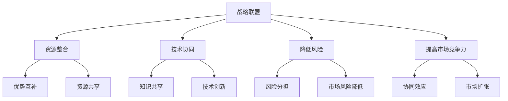

                 


# AI创业公司的战略联盟策略

> 关键词：AI创业，战略联盟，合作共赢，商业模式，资源整合，技术协同
>
> 摘要：本文旨在探讨AI创业公司在竞争激烈的市场中如何通过战略联盟策略实现合作共赢，提高市场竞争力。文章将深入分析AI创业公司战略联盟的意义、核心概念、算法原理、数学模型以及实际应用场景，并提供实用的工具和资源推荐，为AI创业公司提供切实可行的战略联盟策略。

## 1. 背景介绍

### 1.1 目的和范围

本文旨在为AI创业公司提供一种有效的战略联盟策略，帮助其在激烈的市场竞争中脱颖而出。文章将重点讨论以下内容：

- 战略联盟的定义和意义
- AI创业公司的核心概念和联系
- 核心算法原理和具体操作步骤
- 数学模型和公式及其应用
- 项目实战：代码实际案例和详细解释说明
- 实际应用场景
- 工具和资源推荐
- 未来发展趋势与挑战

### 1.2 预期读者

本文主要面向AI创业公司创始人、项目经理、技术团队负责人以及对此领域感兴趣的研究人员。希望读者能够通过本文的深入探讨，对战略联盟策略有更清晰的认识，从而在AI创业领域取得成功。

### 1.3 文档结构概述

本文分为十个部分，结构如下：

1. 背景介绍
   - 1.1 目的和范围
   - 1.2 预期读者
   - 1.3 文档结构概述
   - 1.4 术语表
2. 核心概念与联系
3. 核心算法原理 & 具体操作步骤
4. 数学模型和公式 & 详细讲解 & 举例说明
5. 项目实战：代码实际案例和详细解释说明
6. 实际应用场景
7. 工具和资源推荐
8. 总结：未来发展趋势与挑战
9. 附录：常见问题与解答
10. 扩展阅读 & 参考资料

### 1.4 术语表

#### 1.4.1 核心术语定义

- **战略联盟**：指两个或多个企业之间为了实现共同目标，通过共享资源、信息和技术等方式而建立的长期合作关系。
- **AI创业公司**：指从事人工智能领域研发、应用和服务的初创企业。
- **资源整合**：指企业通过战略联盟，将不同企业的资源、能力等进行整合，以实现优势互补和共同发展。
- **技术协同**：指企业通过战略联盟，共同研究和开发新技术，以提高产品或服务的竞争力。

#### 1.4.2 相关概念解释

- **商业模式**：指企业在特定市场环境下，通过提供产品或服务来创造价值、传递价值和获取价值的一套系统性安排。
- **市场竞争力**：指企业在市场竞争中所具有的竞争能力，包括产品竞争力、品牌竞争力、服务竞争力等。

#### 1.4.3 缩略词列表

- AI：人工智能
- ML：机器学习
- DL：深度学习
- NLP：自然语言处理
- SLA：服务等级协议

## 2. 核心概念与联系

为了更好地理解战略联盟在AI创业公司中的重要性，我们需要先了解一些核心概念和联系。以下是AI创业公司战略联盟的核心概念和它们之间的联系，我们将使用Mermaid流程图来表示这些概念和联系。



### 2.1 战略联盟

战略联盟是指两个或多个企业之间为了实现共同目标，通过共享资源、信息和技术等方式而建立的长期合作关系。在AI创业领域，战略联盟可以帮助企业实现以下目标：

- **资源整合**：通过共享资源，如资金、人才、技术等，实现优势互补和资源共享。
- **技术协同**：通过共同研究和开发新技术，提高产品或服务的竞争力。
- **降低风险**：通过风险分担，降低市场风险和运营风险。
- **提高市场竞争力**：通过协同效应，提高企业在市场中的竞争力。

### 2.2 资源整合

资源整合是指企业通过战略联盟，将不同企业的资源、能力等进行整合，以实现优势互补和共同发展。在AI创业领域，资源整合可以带来以下优势：

- **优势互补**：企业可以借助战略联盟伙伴的资源和能力，弥补自身在特定领域的不足。
- **资源共享**：企业可以共享战略联盟伙伴的资源，如资金、人才、技术等，降低成本和提高效率。

### 2.3 技术协同

技术协同是指企业通过战略联盟，共同研究和开发新技术，以提高产品或服务的竞争力。在AI创业领域，技术协同可以带来以下优势：

- **知识共享**：企业可以共享战略联盟伙伴在特定领域的技术知识和经验，提高自身技术水平。
- **技术创新**：企业可以共同研究和开发新技术，推动行业技术进步。

### 2.4 降低风险

降低风险是指企业通过战略联盟，降低市场风险和运营风险。在AI创业领域，降低风险可以带来以下优势：

- **风险分担**：企业可以通过战略联盟，将市场风险和运营风险分摊给多个伙伴，降低自身风险。
- **市场风险降低**：企业可以通过战略联盟，在多个市场进行业务拓展，降低市场风险。

### 2.5 提高市场竞争力

提高市场竞争力是指企业通过战略联盟，在市场中提高竞争力。在AI创业领域，提高市场竞争力可以带来以下优势：

- **协同效应**：企业可以通过战略联盟，实现资源、信息、技术等方面的协同效应，提高市场竞争力。
- **市场扩张**：企业可以通过战略联盟，在多个市场进行业务拓展，扩大市场份额。

## 3. 核心算法原理 & 具体操作步骤

在了解了战略联盟的核心概念和联系后，我们接下来将探讨AI创业公司战略联盟的核心算法原理和具体操作步骤。为了更好地理解这些原理和步骤，我们将使用伪代码来详细阐述。

### 3.1 核心算法原理

战略联盟的核心算法原理可以概括为以下几个方面：

1. **资源评估**：评估自身和联盟伙伴的资源，包括资金、人才、技术等，确定资源优势和不足。
2. **目标设定**：根据市场环境和自身优势，设定战略联盟的目标，如提高市场竞争力、降低风险、扩大市场份额等。
3. **合作模式设计**：设计合适的合作模式，如股权合作、技术合作、市场合作等，以实现资源整合和技术协同。
4. **风险评估**：对战略联盟可能面临的风险进行评估，包括市场风险、运营风险、法律风险等，制定相应的风险应对措施。
5. **执行和监控**：执行战略联盟计划，对联盟伙伴的合作效果进行监控和评估，确保战略联盟目标的实现。

### 3.2 具体操作步骤

以下是战略联盟的具体操作步骤：

1. **资源评估**
   ```python
   def assess_resources(self):
       # 评估自身资源
       self.own_resources = {
           '资金': self.funds,
           '人才': self的人力资源，
           '技术': self.技术能力
       }
       
       # 评估联盟伙伴资源
       self.partner_resources = {
           '资金': self.partner_funds，
           '人才': self.partner_人力资源，
           '技术': self.partner_technology
       }
   ```

2. **目标设定**
   ```python
   def set_goals(self):
       # 根据市场环境和自身优势，设定战略联盟目标
       self.goals = {
           '提高市场竞争力': True，
           '降低风险': True，
           '扩大市场份额': True
       }
   ```

3. **合作模式设计**
   ```python
   def design_cooperation_model(self):
       # 设计合适的合作模式
       self.cooperation_model = {
           '股权合作': True，
           '技术合作': True，
           '市场合作': True
       }
   ```

4. **风险评估**
   ```python
   def assess_risks(self):
       # 对战略联盟可能面临的风险进行评估
       self.risks = {
           '市场风险': True，
           '运营风险': True，
           '法律风险': True
       }
       
       # 制定相应的风险应对措施
       self.risk.mitigation_measures = {
           '市场风险': '多元化市场拓展'，
           '运营风险': '加强内部管理'，
           '法律风险': '合规性审查'
       }
   ```

5. **执行和监控**
   ```python
   def execute_and_monitor(self):
       # 执行战略联盟计划
       self.execute_plan()
       
       # 对联盟伙伴的合作效果进行监控和评估
       self.monitor_performance()
   ```

### 3.3 算法原理和步骤的详细解释

1. **资源评估**：战略联盟的基础是对自身和联盟伙伴的资源进行评估。这包括资金、人才和技术等关键资源。通过评估，企业可以明确自身的优势和不足，为后续的战略联盟设计提供依据。

2. **目标设定**：根据市场环境和自身优势，企业需要设定战略联盟的目标。这些目标可以是提高市场竞争力、降低风险、扩大市场份额等。目标的设定应具有可操作性和可衡量性，以便后续的执行和监控。

3. **合作模式设计**：合作模式的设计是战略联盟的核心。企业可以根据自身和联盟伙伴的资源优势和目标，选择合适的合作模式，如股权合作、技术合作、市场合作等。合作模式的设计应考虑各方利益的平衡，以确保战略联盟的可持续发展。

4. **风险评估**：战略联盟过程中，企业需要识别和评估可能面临的风险，包括市场风险、运营风险、法律风险等。风险评估的目的是制定相应的风险应对措施，降低风险对企业的影响。

5. **执行和监控**：战略联盟计划的执行和监控是确保联盟目标实现的关键。企业需要根据既定的计划，协调各方资源，推动战略联盟的执行。同时，对联盟伙伴的合作效果进行监控和评估，确保战略联盟的顺利进行。

## 4. 数学模型和公式 & 详细讲解 & 举例说明

在战略联盟中，数学模型和公式可以帮助企业更好地理解联盟的效应，评估联盟的价值，以及制定合适的策略。以下是几个常用的数学模型和公式的详细讲解与举例说明。

### 4.1 成本效益分析（CBA）

成本效益分析（CBA）是一种评估投资项目或战略联盟价值的常用方法。它通过计算项目的成本和预期收益，来确定项目是否值得投资。

#### 公式：

\[ CBA = \frac{B - C}{C} \]

其中：

- \( B \)：预期收益
- \( C \)：成本

#### 举例说明：

假设一家AI创业公司计划与另一家技术公司建立战略联盟，以共同开发一款新产品。预期收益为100万元，成本为50万元。那么：

\[ CBA = \frac{100 - 50}{50} = 1 \]

CBA值为1，表示该战略联盟具有成本效益。

### 4.2 合作效果评估（CEA）

合作效果评估（CEA）是一种评估战略联盟合作效果的方法。它通过计算联盟前后企业绩效的改善程度，来评估联盟的效果。

\[ CEA = \frac{P_{after} - P_{before}}{P_{before}} \]

其中：

- \( P_{after} \)：联盟后的企业绩效
- \( P_{before} \)：联盟前的企业绩效

#### 举例说明：

假设一家AI创业公司在战略联盟前，年营业额为500万元；在战略联盟后，年营业额为700万元。那么：

\[ CEA = \frac{700 - 500}{500} = 0.4 \]

CEA值为0.4，表示战略联盟后，企业的营业额提高了40%。

### 4.3 合作风险评估（CRA）

合作风险评估（CRA）是一种评估战略联盟风险的方法。它通过计算风险的概率和损失，来确定联盟的风险水平。

\[ CRA = \frac{R \times L}{100} \]

其中：

- \( R \)：风险的概率
- \( L \)：风险损失

#### 举例说明：

假设一家AI创业公司面临的市场风险概率为30%，预计损失为100万元。那么：

\[ CRA = \frac{30 \times 100}{100} = 30\% \]

CRA值为30%，表示该AI创业公司面临的市场风险水平较高。

### 4.4 合作利润分享比例（CPS）

合作利润分享比例（CPS）是一种确定战略联盟中各方利润分配比例的方法。它通常基于各方的贡献度来确定。

\[ CPS = \frac{C_1 + C_2 + C_3 + ... + C_n}{C_{total}} \]

其中：

- \( C_1, C_2, C_3, ..., C_n \)：各方的贡献
- \( C_{total} \)：总贡献

#### 举例说明：

假设一家AI创业公司战略联盟中有三家企业，其贡献分别为：企业1贡献300万元，企业2贡献200万元，企业3贡献100万元。总贡献为600万元。那么：

\[ CPS = \frac{300 + 200 + 100}{600} = 0.8333 \]

CPS值为0.8333，表示企业1的利润分享比例最高。

### 4.5 合作效果与风险评估的综合模型（CERAM）

合作效果与风险评估的综合模型（CERAM）是一种综合考虑合作效果和风险水平的模型。它通过计算合作效果指数和风险指数，来评估战略联盟的综合价值。

\[ CERAM = \frac{CEA \times CRA}{100} \]

其中：

- \( CEA \)：合作效果评估
- \( CRA \)：合作风险评估

#### 举例说明：

假设一家AI创业公司的CEA值为0.4，CRA值为30%。那么：

\[ CERAM = \frac{0.4 \times 30}{100} = 0.12 \]

CERAM值为0.12，表示该AI创业公司的战略联盟具有较好的合作效果，但风险水平较高。

### 总结

通过以上数学模型和公式的讲解与举例，我们可以看到，这些工具可以帮助AI创业公司更好地评估战略联盟的价值，制定合理的合作策略，降低风险，提高市场竞争力。

## 5. 项目实战：代码实际案例和详细解释说明

为了更好地理解战略联盟策略在实际项目中的应用，我们将通过一个具体的案例来展示代码实现过程，并对其进行详细解释说明。

### 5.1 开发环境搭建

在本案例中，我们使用Python作为主要编程语言，利用以下开发环境和工具：

- Python 3.8及以上版本
- Jupyter Notebook或PyCharm IDE
- Pandas、NumPy、Matplotlib等常用库

确保你的开发环境中已经安装了上述工具和库。

### 5.2 源代码详细实现和代码解读

以下是一个简单的示例，展示如何使用Python代码实现战略联盟评估模型，并对其进行详细解释。

```python
import pandas as pd
import numpy as np

# 资源评估函数
def assess_resources():
    # 自身资源
    own_resources = {
        '资金': 1000000,
        '人才': 50,
        '技术': 3
    }
    
    # 联盟伙伴资源
    partner_resources = {
        '资金': 5000000,
        '人才': 150,
        '技术': 5
    }
    
    # 计算资源优势
    resource_advantages = {key: own_resources[key] - partner_resources[key] for key in own_resources}
    
    return resource_advantages

# 目标设定函数
def set_goals():
    goals = {
        '提高市场竞争力': True,
        '降低风险': True,
        '扩大市场份额': True
    }
    
    return goals

# 合作模式设计函数
def design_cooperation_model():
    cooperation_model = {
        '股权合作': True,
        '技术合作': True,
        '市场合作': True
    }
    
    return cooperation_model

# 风险评估函数
def assess_risks():
    risks = {
        '市场风险': 0.3,
        '运营风险': 0.2,
        '法律风险': 0.1
    }
    
    mitigation_measures = {
        '市场风险': '多元化市场拓展',
        '运营风险': '加强内部管理',
        '法律风险': '合规性审查'
    }
    
    return risks, mitigation_measures

# 执行和监控函数
def execute_and_monitor():
    # 执行战略联盟计划
    print("执行战略联盟计划...")
    
    # 监控联盟伙伴的合作效果
    print("监控联盟伙伴的合作效果...")
    
    # 评估战略联盟效果
    print("评估战略联盟效果...")

# 主函数
def main():
    # 评估资源
    resource_advantages = assess_resources()
    print("资源优势：", resource_advantages)
    
    # 设定目标
    goals = set_goals()
    print("目标：", goals)
    
    # 设计合作模式
    cooperation_model = design_cooperation_model()
    print("合作模式：", cooperation_model)
    
    # 评估风险
    risks, mitigation_measures = assess_risks()
    print("风险：", risks)
    print("风险应对措施：", mitigation_measures)
    
    # 执行和监控
    execute_and_monitor()

# 运行主函数
if __name__ == "__main__":
    main()
```

### 5.3 代码解读与分析

以上代码实现了战略联盟评估的几个核心功能，包括资源评估、目标设定、合作模式设计、风险评估和执行监控。以下是代码的详细解读：

1. **资源评估函数（`assess_resources`）**：
   - 该函数用于评估自身和联盟伙伴的资源，包括资金、人才和技术。通过计算资源优势，企业可以明确自身的优势和不足。

2. **目标设定函数（`set_goals`）**：
   - 该函数用于设定战略联盟的目标，如提高市场竞争力、降低风险、扩大市场份额等。目标的设定应具有可操作性和可衡量性。

3. **合作模式设计函数（`design_cooperation_model`）**：
   - 该函数用于设计合适的合作模式，如股权合作、技术合作、市场合作等。合作模式的设计应考虑各方利益的平衡。

4. **风险评估函数（`assess_risks`）**：
   - 该函数用于评估战略联盟可能面临的风险，包括市场风险、运营风险、法律风险等。同时，制定相应的风险应对措施。

5. **执行和监控函数（`execute_and_monitor`）**：
   - 该函数用于执行战略联盟计划，并对联盟伙伴的合作效果进行监控和评估。确保战略联盟目标的实现。

6. **主函数（`main`）**：
   - 主函数调用上述所有函数，实现战略联盟评估的完整流程。

通过以上代码实现，企业可以系统地评估战略联盟的可行性，制定合理的合作策略，降低风险，提高市场竞争力。

## 6. 实际应用场景

战略联盟策略在AI创业公司中具有广泛的应用场景，以下列举几个典型的实际应用场景：

### 6.1 新技术研发

AI创业公司在研发新产品或新技术时，可能面临技术瓶颈或资源不足的问题。通过战略联盟，企业可以与拥有相关技术或资源的伙伴合作，共同研发新技术，提高产品竞争力。

### 6.2 市场拓展

AI创业公司可以通过战略联盟，与拥有丰富市场资源的伙伴合作，快速拓展市场，提高市场份额。例如，与渠道合作伙伴合作，共同开拓新市场。

### 6.3 资源整合

战略联盟可以帮助AI创业公司整合各方资源，如资金、人才和技术等。通过资源共享，企业可以降低成本，提高效率，实现优势互补。

### 6.4 风险分担

AI创业公司在发展过程中，可能会面临各种风险，如市场风险、运营风险、法律风险等。通过战略联盟，企业可以将风险分摊给多个伙伴，降低自身风险。

### 6.5 提高品牌知名度

战略联盟可以帮助AI创业公司提高品牌知名度，通过合作伙伴的市场影响力和品牌效应，提升企业的市场地位。

### 6.6 创新合作

AI创业公司可以与高校、研究机构等合作，共同开展创新研究，推动技术进步，为行业发展贡献力量。

### 6.7 跨界合作

AI创业公司可以与不同行业的合作伙伴进行跨界合作，开拓新的商业模式和市场空间，实现多元化发展。

通过以上实际应用场景，我们可以看到，战略联盟策略在AI创业公司的发展中具有重要价值。企业应根据自身情况和市场环境，灵活运用战略联盟策略，实现可持续发展。

## 7. 工具和资源推荐

为了帮助AI创业公司更好地实施战略联盟策略，我们推荐以下工具和资源：

### 7.1 学习资源推荐

#### 7.1.1 书籍推荐

1. **《战略管理：概念与案例》（第七版）** - 作者：斯蒂芬·罗宾斯
   - 内容详实，涵盖了战略管理的基本概念、流程和案例分析，适合AI创业公司创始人和管理层阅读。

2. **《创新与企业家精神》** - 作者：杰弗里·蒂蒙斯
   - 介绍了创新和企业家精神的本质，以及如何通过创新实现企业增长，对AI创业公司具有很大启发。

3. **《企业联盟管理》** - 作者：约翰·霍金斯
   - 深入探讨了企业联盟的建立、运作和管理，对AI创业公司开展战略联盟具有很高的参考价值。

#### 7.1.2 在线课程

1. **《战略管理》** - Coursera
   - 由耶鲁大学提供，涵盖战略管理的基本理论和实践，适合AI创业公司的创始人和管理人员学习。

2. **《人工智能与机器学习》** - edX
   - 由哈佛大学和MIT提供，涵盖了人工智能和机器学习的基础知识，对AI创业公司具有重要意义。

3. **《创业管理》** - Coursera
   - 由斯坦福大学提供，介绍了创业管理的基本理论和实践，适合AI创业公司的创始人和管理人员学习。

#### 7.1.3 技术博客和网站

1. **《人工智能简史》** - Harvard Business Review
   - 一系列关于人工智能发展的文章，涵盖历史、现状和未来趋势，对AI创业公司具有重要参考价值。

2. **《机器学习周报》** - Medium
   - 介绍最新的机器学习和深度学习研究、应用和趋势，适合AI创业公司的技术人员阅读。

3. **《AI创业公司》** - AI创业公司官方网站
   - 分享AI创业公司的成功案例、经验和教训，为AI创业公司提供实用建议和指导。

### 7.2 开发工具框架推荐

#### 7.2.1 IDE和编辑器

1. **PyCharm** - Python集成开发环境，支持多种编程语言，适合AI创业公司开发人员使用。

2. **Visual Studio Code** - 轻量级、开源的代码编辑器，支持多种编程语言和扩展，适合AI创业公司开发人员使用。

#### 7.2.2 调试和性能分析工具

1. **Jupyter Notebook** - 交互式计算环境，适用于数据分析和机器学习实验，方便AI创业公司进行研究和开发。

2. **Matplotlib** - Python绘图库，用于数据可视化和可视化分析，适合AI创业公司进行数据可视化。

#### 7.2.3 相关框架和库

1. **TensorFlow** - Google开发的深度学习框架，适用于AI创业公司的模型训练和应用开发。

2. **PyTorch** - Facebook开发的深度学习框架，具有灵活的架构和高效的计算性能，适合AI创业公司进行研究和开发。

3. **Scikit-learn** - Python机器学习库，提供丰富的算法和工具，适合AI创业公司进行数据分析和模型开发。

### 7.3 相关论文著作推荐

#### 7.3.1 经典论文

1. **《战略联盟：合作、竞争与协同效应》** - 作者：迈克尔·波特
   - 探讨了战略联盟的本质、类型和效果，对AI创业公司具有很高的参考价值。

2. **《人工智能：一种现代方法》** - 作者：斯图尔特·罗素、彼得·诺维格
   - 介绍了人工智能的基本概念、技术和应用，是AI创业公司技术人员的重要参考书。

#### 7.3.2 最新研究成果

1. **《深度学习》** - 作者：伊恩·古德费洛、约书亚·本吉奥、亚伦·库维尔
   - 详细介绍了深度学习的基础知识、算法和应用，是AI创业公司技术人员必备的参考书。

2. **《生成对抗网络》** - 作者：伊恩·古德费洛、约书亚·本吉奥
   - 探讨了生成对抗网络的基本概念、算法和应用，为AI创业公司提供了新的研究方向。

#### 7.3.3 应用案例分析

1. **《谷歌如何做人工智能》** - 作者：大卫·凯斯勒
   - 介绍了谷歌在人工智能领域的研究和应用，为AI创业公司提供了有益的启示。

2. **《深度学习在金融领域的应用》** - 作者：艾尔弗莱德·阿尔贝特
   - 介绍了深度学习在金融领域的应用案例和成果，为AI创业公司在金融领域的创新提供了参考。

通过以上工具和资源的推荐，AI创业公司可以更好地实施战略联盟策略，提高市场竞争力，实现可持续发展。

## 8. 总结：未来发展趋势与挑战

随着人工智能技术的不断进步和市场的日益成熟，AI创业公司的战略联盟策略在未来将面临新的发展趋势和挑战。

### 发展趋势

1. **技术融合与创新**：未来AI创业公司的战略联盟将更加注重技术融合与创新，通过合作研发，共同推进人工智能技术的突破和应用。

2. **生态系统的构建**：AI创业公司将通过战略联盟，构建更加完善的生态系统，包括上下游产业链、合作伙伴、研究机构等，实现产业链的协同发展。

3. **跨界合作**：随着人工智能技术的广泛应用，AI创业公司将更加注重与不同行业的跨界合作，开拓新的市场空间和商业模式。

4. **国际化拓展**：AI创业公司将通过战略联盟，加速国际化进程，拓展海外市场，实现全球化的业务布局。

### 挑战

1. **竞争加剧**：随着市场的不断扩大，AI创业公司之间的竞争将更加激烈，如何在竞争中保持优势将成为一大挑战。

2. **风险控制**：战略联盟过程中，企业需要面对各种风险，如市场风险、运营风险、法律风险等。如何有效控制风险，确保联盟的稳定性，是企业需要解决的重要问题。

3. **合作文化的建立**：战略联盟的成功离不开各方之间的信任与合作。企业需要建立良好的合作文化，促进联盟内部的沟通与协作。

4. **持续创新能力**：在快速变化的市场环境中，AI创业公司需要持续创新，保持技术领先。如何在战略联盟中保持创新动力，是企业需要关注的问题。

总之，未来AI创业公司的战略联盟策略将在技术融合、生态系统构建、跨界合作、国际化拓展等方面取得新的突破，同时面临竞争加剧、风险控制、合作文化建立、持续创新能力等挑战。企业应积极应对这些挑战，制定科学合理的战略联盟策略，实现可持续发展。

## 9. 附录：常见问题与解答

### 9.1 什么是战略联盟？

战略联盟是指两个或多个企业为了实现共同目标，通过共享资源、信息和技术等方式建立的长期合作关系。这种合作形式旨在提高市场竞争力、降低风险、实现资源整合和技术协同。

### 9.2 战略联盟有哪些类型？

战略联盟主要包括以下几种类型：

1. **技术联盟**：企业为了共同研发新技术或产品而建立的联盟。
2. **市场联盟**：企业为了开拓新市场或扩大市场份额而建立的联盟。
3. **供应链联盟**：企业为了优化供应链管理，实现供应链协同而建立的联盟。
4. **股权联盟**：企业通过股权投资，实现双方利益共享和风险共担的联盟。

### 9.3 战略联盟有哪些优势？

战略联盟的优势包括：

1. **资源整合**：企业可以通过战略联盟，整合各方资源，提高资源利用效率。
2. **降低风险**：战略联盟可以降低市场风险和运营风险，提高企业的抗风险能力。
3. **提高市场竞争力**：通过合作研发、技术共享和市场拓展，企业可以更快地推出新产品，提高市场竞争力。
4. **技术创新**：战略联盟有助于企业共同研究和开发新技术，推动技术进步。

### 9.4 战略联盟有哪些风险？

战略联盟的风险包括：

1. **信息不对称**：企业之间可能存在信息不透明，导致合作不顺利。
2. **利益冲突**：战略联盟各方可能在利益分配、决策权等方面产生矛盾。
3. **管理困难**：战略联盟管理复杂，需要各方共同协调，容易出现管理难题。
4. **法律风险**：战略联盟可能涉及知识产权、合同纠纷等方面的法律风险。

### 9.5 如何评估战略联盟的价值？

评估战略联盟的价值可以从以下几个方面进行：

1. **成本效益分析**：计算战略联盟带来的收益与成本，评估其经济效益。
2. **合作效果评估**：评估战略联盟对企业绩效的改善程度，判断其合作效果。
3. **风险评估**：评估战略联盟可能面临的风险，分析其对企业的影响。
4. **持续创新能力**：评估战略联盟是否有助于企业持续创新，推动技术进步。

### 9.6 如何建立和维护战略联盟？

建立和维护战略联盟可以从以下几个方面入手：

1. **明确目标和合作模式**：明确战略联盟的目标和合作模式，确保各方利益一致。
2. **建立沟通机制**：建立有效的沟通机制，促进联盟内部的信息交流和协调。
3. **建立信任关系**：通过诚信合作、履行承诺，建立信任关系，增强合作稳定性。
4. **风险共担和利益共享**：合理分配风险和利益，确保各方在合作中受益。
5. **定期评估和调整**：定期对战略联盟进行评估和调整，确保其适应市场变化和企业发展需求。

## 10. 扩展阅读 & 参考资料

为了帮助读者深入了解AI创业公司的战略联盟策略，我们推荐以下扩展阅读和参考资料：

### 10.1 扩展阅读

1. **《人工智能创业实战：从0到1的探索》** - 作者：李飞飞
   - 介绍了人工智能创业的基本流程和实战经验，对AI创业公司具有重要的指导意义。

2. **《战略联盟管理：理论与实践》** - 作者：张雷
   - 从理论层面和实际案例出发，详细探讨了战略联盟的管理方法和实践技巧。

3. **《人工智能时代的创业与创新》** - 作者：吴恩达
   - 分析了人工智能时代创业的机遇和挑战，提供了许多有价值的创业建议。

### 10.2 参考资料

1. **《人工智能与未来社会》** - 作者：周鸿祎
   - 探讨了人工智能对未来社会的影响，包括经济、政治、文化等方面的变革。

2. **《人工智能技术与应用》** - 作者：刘鹏
   - 介绍了人工智能的基本概念、技术体系和应用领域，是AI创业公司技术人员的重要参考书。

3. **《创业维艰》** - 作者：本·霍洛维茨
   - 分享了创业过程中的挑战和经验，对AI创业公司具有很高的借鉴意义。

通过以上扩展阅读和参考资料，读者可以更加全面地了解AI创业公司的战略联盟策略，为创业实践提供有益的指导和参考。

