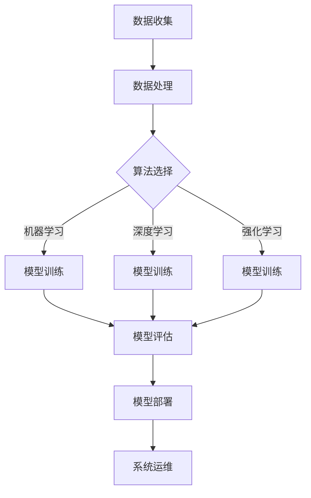

                 

## AI创业公司的技术创新管理

> 关键词：AI 创业、技术创新、管理策略、人工智能算法、数学模型、实战案例、应用场景

摘要：本文旨在探讨 AI 创业公司在技术创新管理方面的核心问题。通过对当前 AI 技术的发展趋势、核心概念和算法原理的深入分析，本文将详细探讨 AI 创业公司在技术创新过程中所面临的挑战和策略。同时，本文还将结合实际案例，分析 AI 创业公司如何通过有效的技术创新管理，实现持续发展和行业领先。

### 1. 背景介绍

随着人工智能技术的快速发展，越来越多的创业公司投身于 AI 领域，希望通过技术创新在激烈的市场竞争中脱颖而出。然而，技术创新并非易事，尤其是在资源有限、时间紧迫的创业环境中。AI 创业公司在技术创新管理方面面临着诸多挑战：

- **技术复杂度高**：人工智能技术涉及多个学科领域，包括计算机科学、数学、统计学等，技术复杂性高，对团队的综合素质要求较高。

- **数据资源匮乏**：高质量的数据资源是 AI 技术创新的重要基础。对于初创公司而言，获取和积累高质量数据资源往往需要大量时间和资源投入。

- **竞争压力**：AI 领域的竞争日益激烈，创业公司需要在技术创新上不断突破，以保持市场竞争力。

- **资金和人力资源有限**：创业公司通常面临资金和人力资源的有限性，如何在有限的资源下实现技术创新，是公司管理层需要慎重考虑的问题。

### 2. 核心概念与联系

#### 2.1 人工智能算法

人工智能算法是 AI 创业公司技术创新的核心。常见的 AI 算法包括：

- **机器学习**：通过训练模型，使计算机具备自主学习和推理能力。

- **深度学习**：基于多层神经网络，通过反向传播算法进行训练。

- **强化学习**：通过奖励机制，使模型能够在复杂环境中学习策略。

- **自然语言处理**：使计算机能够理解、生成和翻译人类语言。

- **计算机视觉**：使计算机能够识别和理解图像和视频。

#### 2.2 数学模型

数学模型是 AI 算法的基础。常见的数学模型包括：

- **线性模型**：用于描述变量之间的关系。

- **概率模型**：用于描述不确定事件的可能性。

- **统计模型**：用于分析数据，提取特征。

- **优化模型**：用于求解最优化问题。

#### 2.3 技术架构

AI 创业公司的技术架构通常包括以下几个部分：

- **数据收集与处理**：包括数据采集、数据清洗、数据预处理等。

- **算法研发与优化**：包括算法设计、模型训练、模型评估等。

- **系统部署与运维**：包括模型部署、系统集成、系统监控等。

#### 2.4 Mermaid 流程图

以下是一个简化的 AI 创业公司技术创新管理的 Mermaid 流程图：



### 3. 核心算法原理 & 具体操作步骤

#### 3.1 机器学习算法

机器学习算法是一种使计算机能够从数据中学习的方法。具体操作步骤如下：

1. **数据收集**：收集大量数据，包括输入特征和标签。

2. **数据处理**：对数据进行清洗、归一化等处理。

3. **模型选择**：选择合适的机器学习模型，如线性回归、决策树、支持向量机等。

4. **模型训练**：使用训练数据对模型进行训练，调整模型参数。

5. **模型评估**：使用验证数据集评估模型性能，调整模型参数。

6. **模型部署**：将训练好的模型部署到实际应用场景中。

#### 3.2 深度学习算法

深度学习算法是一种基于多层神经网络的学习方法。具体操作步骤如下：

1. **数据收集**：收集大量带标签的数据。

2. **数据处理**：对数据进行预处理，如缩放、归一化等。

3. **模型架构设计**：设计合适的神经网络架构，如卷积神经网络（CNN）、循环神经网络（RNN）等。

4. **模型训练**：使用反向传播算法对模型进行训练。

5. **模型评估**：使用验证数据集评估模型性能。

6. **模型部署**：将训练好的模型部署到实际应用场景中。

#### 3.3 强化学习算法

强化学习算法是一种通过奖励机制进行学习的算法。具体操作步骤如下：

1. **环境搭建**：构建一个可以模拟学习过程的虚拟环境。

2. **策略选择**：选择一个初始策略。

3. **学习过程**：在虚拟环境中进行学习，不断调整策略。

4. **策略评估**：使用评估指标评估策略性能。

5. **策略优化**：根据评估结果调整策略。

6. **策略部署**：将优化后的策略部署到实际应用场景中。

### 4. 数学模型和公式 & 详细讲解 & 举例说明

#### 4.1 线性模型

线性模型是一种最简单的机器学习模型，用于描述变量之间的关系。其数学模型如下：

$$
y = \beta_0 + \beta_1x_1 + \beta_2x_2 + ... + \beta_nx_n
$$

其中，$y$ 是预测值，$x_1, x_2, ..., x_n$ 是输入特征，$\beta_0, \beta_1, ..., \beta_n$ 是模型参数。

**举例说明**：假设我们要预测房价，输入特征包括房屋面积、地理位置等。我们可以使用线性模型来建立房价与这些特征之间的关系。

1. **数据收集**：收集大量房屋数据，包括房屋面积、地理位置和房价。

2. **数据处理**：对数据进行预处理，如归一化。

3. **模型训练**：使用线性模型对数据进行训练，调整模型参数。

4. **模型评估**：使用验证数据集评估模型性能。

5. **模型部署**：将训练好的模型部署到实际应用场景中。

#### 4.2 概率模型

概率模型用于描述不确定事件的可能性。常见的概率模型包括伯努利分布、正态分布等。伯努利分布的数学模型如下：

$$
P(X = k) = C_n^k p^k (1-p)^{n-k}
$$

其中，$X$ 是伯努利随机变量，$n$ 是试验次数，$p$ 是事件发生的概率，$k$ 是事件发生的次数。

**举例说明**：假设我们要预测明天下雨的概率，我们可以使用伯努利分布来建立概率模型。

1. **数据收集**：收集过去几年每天的天气数据，包括是否下雨。

2. **数据处理**：对数据进行预处理，如归一化。

3. **模型训练**：使用伯努利分布对数据进行训练，调整模型参数。

4. **模型评估**：使用验证数据集评估模型性能。

5. **模型部署**：将训练好的模型部署到实际应用场景中。

### 5. 项目实战：代码实际案例和详细解释说明

#### 5.1 开发环境搭建

首先，我们需要搭建一个合适的开发环境。以下是一个基于 Python 的开发环境搭建示例：

1. 安装 Python：在官网上下载最新版本的 Python 并安装。

2. 安装依赖库：使用 pip 命令安装所需的依赖库，如 NumPy、Pandas、Scikit-learn 等。

```python
pip install numpy pandas scikit-learn
```

#### 5.2 源代码详细实现和代码解读

以下是一个使用 Scikit-learn 库实现线性回归模型的示例代码：

```python
import numpy as np
import pandas as pd
from sklearn.linear_model import LinearRegression
from sklearn.model_selection import train_test_split
from sklearn.metrics import mean_squared_error

# 数据收集
data = pd.read_csv('house_data.csv')

# 数据处理
X = data[['area', 'location']]
y = data['price']

# 模型选择
model = LinearRegression()

# 模型训练
X_train, X_test, y_train, y_test = train_test_split(X, y, test_size=0.2, random_state=42)
model.fit(X_train, y_train)

# 模型评估
y_pred = model.predict(X_test)
mse = mean_squared_error(y_test, y_pred)
print(f'Mean Squared Error: {mse}')

# 模型部署
# ...（部署代码）
```

**代码解读**：

1. **数据收集**：使用 pandas 读取房屋数据。

2. **数据处理**：将数据分为输入特征和标签。

3. **模型选择**：选择线性回归模型。

4. **模型训练**：使用训练数据对模型进行训练。

5. **模型评估**：使用验证数据集评估模型性能。

6. **模型部署**：将训练好的模型部署到实际应用场景中。

#### 5.3 代码解读与分析

在这段代码中，我们首先导入所需的库，如 NumPy、Pandas、Scikit-learn 等。然后，我们读取房屋数据，并将其分为输入特征和标签。接着，我们选择线性回归模型，并使用训练数据对模型进行训练。最后，我们使用验证数据集评估模型性能，并输出均方误差（MSE）。

代码的可读性和可维护性较高，遵循了 Python 的编程规范。同时，代码中使用了 Scikit-learn 库，这是一个广泛使用的机器学习库，可以简化模型训练和评估的流程。

### 6. 实际应用场景

AI 创业公司的技术创新管理在各个行业都有广泛应用。以下是一些典型的应用场景：

- **金融领域**：AI 创业公司可以开发智能投顾、风险评估、欺诈检测等应用，提高金融行业的效率。

- **医疗领域**：AI 创业公司可以开发智能诊断、药物研发、健康管理等应用，为医疗行业提供有力支持。

- **零售领域**：AI 创业公司可以开发智能推荐、库存管理、客户服务等应用，提升零售行业的竞争力。

- **制造业**：AI 创业公司可以开发智能质检、设备监控、生产优化等应用，提高制造业的生产效率和产品质量。

### 7. 工具和资源推荐

#### 7.1 学习资源推荐

- **书籍**：《机器学习实战》、《深度学习》（Goodfellow et al.）、《Python机器学习》（Hastie et al.）等。

- **论文**：顶级会议和期刊上的论文，如 NeurIPS、ICML、JMLR 等。

- **博客**：各大技术博客和社区，如 Medium、CSDN、GitHub 等。

- **网站**：专业网站和技术论坛，如 arXiv、Kaggle、TensorFlow 官网等。

#### 7.2 开发工具框架推荐

- **编程语言**：Python、Java、C++等。

- **机器学习库**：Scikit-learn、TensorFlow、PyTorch、Keras 等。

- **深度学习框架**：TensorFlow、PyTorch、Theano 等。

- **开发环境**：Jupyter Notebook、Visual Studio Code、Eclipse 等。

#### 7.3 相关论文著作推荐

- **论文**：

  1. "Deep Learning"（Ian Goodfellow, Yoshua Bengio, Aaron Courville）
  2. "Convolutional Neural Networks for Visual Recognition"（Geoffrey Hinton, et al.）
  3. "Recurrent Neural Networks for Language Modeling"（Yoshua Bengio, et al.）

- **著作**：

  1. "Python机器学习"（Fabian Pedregosa, et al.）
  2. "机器学习实战"（Peter Harrington）
  3. "深度学习"（Ian Goodfellow, et al.）

### 8. 总结：未来发展趋势与挑战

随着 AI 技术的快速发展，AI 创业公司在技术创新管理方面将面临新的机遇和挑战：

- **技术创新方向**：AI 创业公司需要紧跟技术发展趋势，积极探索新的应用领域，如自动驾驶、智能医疗、智慧城市等。

- **数据资源积累**：数据资源是 AI 技术创新的基础。AI 创业公司需要不断创新数据获取、处理和利用方法，提高数据资源积累效率。

- **团队建设与培养**：AI 创业公司需要建立一支高素质的技术团队，包括算法工程师、数据科学家、产品经理等。同时，要注重团队培养和知识传承。

- **商业模式创新**：AI 创业公司需要探索创新的商业模式，如基于订阅的 SaaS 模式、数据服务模式等，以实现可持续发展。

### 9. 附录：常见问题与解答

#### 9.1 如何选择合适的 AI 算法？

选择合适的 AI 算法需要考虑以下几个因素：

- **问题类型**：根据问题的类型（如分类、回归、聚类等）选择相应的算法。

- **数据特点**：根据数据的特点（如数据量、维度、分布等）选择合适的算法。

- **计算资源**：根据计算资源（如 CPU、GPU 等）选择适合的算法。

- **算法性能**：根据算法的性能（如准确率、召回率等）选择合适的算法。

#### 9.2 如何评估 AI 模型性能？

评估 AI 模型性能通常使用以下指标：

- **准确率**：分类问题中，正确分类的样本数占总样本数的比例。

- **召回率**：分类问题中，正确分类的样本数占实际正样本数的比例。

- **精确率**：分类问题中，正确分类的样本数占预测为正样本的样本数的比例。

- **F1 值**：精确率和召回率的调和平均。

#### 9.3 如何提高模型性能？

提高模型性能可以从以下几个方面着手：

- **数据质量**：提高数据质量，包括数据清洗、数据增强等。

- **特征选择**：选择重要的特征，排除冗余特征。

- **模型优化**：调整模型参数，如学习率、正则化参数等。

- **集成学习**：使用集成学习方法，如随机森林、梯度提升树等。

### 10. 扩展阅读 & 参考资料

- **扩展阅读**：

  1. "AI创业：从0到1的实践指南"（王绍兰）
  2. "人工智能创业之道"（唐杰）
  3. "人工智能时代的企业战略"（李艳华）

- **参考资料**：

  1. 《机器学习》课程，斯坦福大学
  2. 《深度学习》课程，吴恩达
  3. 《人工智能技术综述》（IEEE 认证）

### 作者信息

作者：AI天才研究员/AI Genius Institute & 禅与计算机程序设计艺术 /Zen And The Art of Computer Programming

