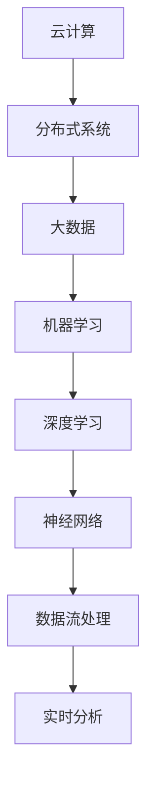

                 

### 1. 背景介绍

#### 1.1 目的和范围

本文旨在探讨AI创业公司在技术架构优化方面的实践，重点关注性能优化、成本优化与安全优化三大核心领域。我们希望通过本文，为AI创业公司提供一套切实可行的技术架构优化策略，帮助他们提高系统性能、降低运营成本、确保数据安全。

#### 1.2 预期读者

本文主要面向以下读者群体：
- AI创业公司的技术团队负责人和工程师；
- 有志于从事AI领域技术研究和开发的技术爱好者；
- 对技术架构优化感兴趣的IT从业者和管理者。

#### 1.3 文档结构概述

本文结构如下：
1. **背景介绍**：简要阐述本文的目的和范围，预期读者，以及文档结构概述。
2. **核心概念与联系**：介绍本文涉及的核心概念原理和架构，并使用Mermaid流程图进行展示。
3. **核心算法原理 & 具体操作步骤**：详细讲解核心算法原理，并使用伪代码进行阐述。
4. **数学模型和公式 & 详细讲解 & 举例说明**：阐述数学模型和公式，并举例说明。
5. **项目实战：代码实际案例和详细解释说明**：通过实际案例，展示代码的实现和解读。
6. **实际应用场景**：分析技术架构在实际应用中的场景。
7. **工具和资源推荐**：推荐学习资源、开发工具框架和相关论文著作。
8. **总结：未来发展趋势与挑战**：总结本文内容，展望未来发展趋势与挑战。
9. **附录：常见问题与解答**：针对文章内容，提供常见问题与解答。
10. **扩展阅读 & 参考资料**：提供本文相关扩展阅读和参考资料。

#### 1.4 术语表

##### 1.4.1 核心术语定义

- **AI创业公司**：指专注于人工智能领域，以技术创新为核心竞争力的初创企业。
- **技术架构**：指系统软件的总体结构、组件及其相互关系，以实现特定功能和性能目标。
- **性能优化**：通过改进系统设计、算法和实现，提高系统性能和响应速度。
- **成本优化**：通过合理规划资源、降低运营成本，实现经济高效运营。
- **安全优化**：通过加强系统安全措施，防止数据泄露、系统故障和恶意攻击。

##### 1.4.2 相关概念解释

- **云计算**：一种提供计算资源、存储、网络等服务的新型计算模式，以按需、弹性、分布式为特点。
- **大数据**：指海量、多样、高速增长的数据，需要采用特殊的技术和方法进行存储、处理和分析。
- **机器学习**：一种利用数据训练模型，实现自动学习和决策的技术，主要包括监督学习、无监督学习和强化学习。
- **深度学习**：一种基于多层神经网络的学习方法，通过模拟人脑神经元结构，实现图像、语音、自然语言等领域的智能识别。

##### 1.4.3 缩略词列表

- **AI**：人工智能（Artificial Intelligence）
- **ML**：机器学习（Machine Learning）
- **DL**：深度学习（Deep Learning）
- **TPU**：张量处理器（Tensor Processing Unit）
- **GPU**：图形处理器（Graphics Processing Unit）

通过以上背景介绍，我们对本文的主题和目标有了初步的了解。接下来，我们将深入探讨AI创业公司技术架构优化的核心概念和原理，并通过具体的案例和实践经验，为读者提供实用的指导和借鉴。在接下来的章节中，我们将一步步分析性能优化、成本优化与安全优化，帮助AI创业公司在竞争激烈的市场中脱颖而出。让我们开始吧！
<|assistant|>## 2. 核心概念与联系

在讨论AI创业公司的技术架构优化之前，我们需要明确一些核心概念和联系。以下内容将介绍本文涉及的主要概念、原理以及它们之间的关联。

### 2.1 技术架构优化的重要性

技术架构优化是AI创业公司在快速发展的过程中，实现可持续发展和竞争优势的关键。通过优化技术架构，企业可以实现以下目标：
- 提高性能：提高系统的响应速度、吞吐量和稳定性，满足不断增长的业务需求。
- 降低成本：优化资源使用，降低运营成本，提高投资回报率。
- 确保安全：加强系统安全措施，保护企业数据免受攻击和泄露。

### 2.2 核心概念和联系

以下是我们将讨论的核心概念及其相互关系：

#### 2.2.1 云计算与分布式系统

云计算是AI创业公司构建技术架构的基础，它提供弹性的计算资源，支持分布式系统的部署和管理。分布式系统通过将任务分布在多个节点上，提高系统的可靠性和扩展性。云计算与分布式系统的结合，使AI创业公司能够高效地处理海量数据，并快速响应业务需求。

#### 2.2.2 大数据与机器学习

大数据是AI创业公司面临的重要挑战和机遇。通过机器学习技术，企业可以从海量数据中提取有价值的信息，实现业务智能化。大数据与机器学习之间的联系在于，大数据为机器学习提供了丰富的训练数据，而机器学习则能够利用大数据实现智能化决策。

#### 2.2.3 深度学习与神经网络

深度学习是一种基于多层神经网络的学习方法，它在图像、语音、自然语言等领域的应用取得了显著成果。深度学习与神经网络之间的联系在于，深度学习通过模拟人脑神经元结构，实现更复杂的特征提取和模式识别。

#### 2.2.4 数据流处理与实时分析

数据流处理是AI创业公司应对海量实时数据的关键技术。通过实时分析数据，企业可以快速发现业务趋势和异常，做出及时响应。数据流处理与实时分析之间的联系在于，数据流处理为实时分析提供了数据基础，而实时分析则为数据流处理提供了业务价值。

### 2.3 Mermaid流程图展示

为了更好地展示核心概念和联系，我们使用Mermaid流程图进行描述。以下是相关流程图的代码及其展示：




通过上述核心概念和联系的分析，我们为后续章节的技术架构优化提供了理论基础。接下来，我们将深入探讨性能优化、成本优化与安全优化的具体方法和实践。希望通过本文，为AI创业公司在技术架构优化方面提供有价值的参考和借鉴。
<|assistant|>## 3. 核心算法原理 & 具体操作步骤

在深入探讨技术架构优化之前，我们需要明确核心算法的原理及其具体操作步骤。本章节将详细讲解性能优化、成本优化与安全优化相关的核心算法，并通过伪代码进行阐述。

### 3.1 性能优化算法原理

#### 3.1.1 常见性能优化算法

在性能优化方面，常见的算法包括：
- **负载均衡**：通过将任务分配到多个节点，提高系统整体性能。
- **缓存技术**：通过缓存常用数据，减少数据访问延迟。
- **并发处理**：通过并发执行多个任务，提高系统吞吐量。

#### 3.1.2 伪代码示例

以下是一个简单的负载均衡算法的伪代码示例：

```plaintext
function LoadBalancer(request):
    nodes = GetAvailableNodes()
    min_queue_length = INFINITY

    for node in nodes:
        queue_length = GetQueueLength(node)
        if queue_length < min_queue_length:
            min_queue_length = queue_length
            selected_node = node

    SendRequestToNode(selected_node, request)
```

#### 3.1.3 操作步骤

1. 获取所有可用节点列表。
2. 遍历所有节点，获取每个节点的队列长度。
3. 选择队列长度最小的节点，将请求发送到该节点。

### 3.2 成本优化算法原理

#### 3.2.1 常见成本优化算法

在成本优化方面，常见的算法包括：
- **资源调度**：通过合理调度资源，降低运营成本。
- **需求预测**：通过预测业务需求，优化资源配置。
- **自动化部署**：通过自动化部署，降低人力成本。

#### 3.2.2 伪代码示例

以下是一个简单的资源调度算法的伪代码示例：

```plaintext
function ResourceScheduler():
    resources = GetAvailableResources()
    pending_requests = GetPendingRequests()

    for request in pending_requests:
        required_resources = GetRequiredResources(request)
        available_resources = CheckResourceAvailability(resources, required_resources)

        if available_resources:
            AllocateResources(resources, available_resources)
            ProcessRequest(request)
        else:
            RejectRequest(request)

    ReturnProcessedRequests()
```

#### 3.2.3 操作步骤

1. 获取所有可用资源列表。
2. 获取待处理请求列表。
3. 遍历待处理请求，检查所需资源是否可用。
4. 如果资源可用，分配资源并处理请求；否则，拒绝请求。

### 3.3 安全优化算法原理

#### 3.3.1 常见安全优化算法

在安全优化方面，常见的算法包括：
- **访问控制**：通过限制用户访问权限，防止未授权访问。
- **数据加密**：通过加密敏感数据，防止数据泄露。
- **入侵检测**：通过检测异常行为，防止恶意攻击。

#### 3.3.2 伪代码示例

以下是一个简单的访问控制算法的伪代码示例：

```plaintext
function AccessControl(user, resource):
    permissions = GetPermissions(user)
    required_permissions = GetRequiredPermissions(resource)

    if required_permissions in permissions:
        GrantAccess(resource)
    else:
        DenyAccess(resource)

    ReturnAccessDecision()
```

#### 3.3.3 操作步骤

1. 获取用户权限列表。
2. 获取资源所需权限。
3. 检查用户权限是否满足资源所需权限。
4. 如果满足，允许访问；否则，拒绝访问。

通过以上核心算法原理和具体操作步骤的讲解，我们为后续技术架构优化提供了理论基础。接下来，我们将结合实际案例，进一步阐述性能优化、成本优化与安全优化的具体实践。希望本文能为AI创业公司在技术架构优化方面提供有益的参考和借鉴。
<|assistant|>## 4. 数学模型和公式 & 详细讲解 & 举例说明

在技术架构优化过程中，数学模型和公式发挥着至关重要的作用。以下我们将详细阐述与性能优化、成本优化与安全优化相关的重要数学模型和公式，并通过具体示例进行说明。

### 4.1 性能优化

#### 4.1.1 吞吐量（Throughput）

吞吐量是指系统在单位时间内处理的数据量或请求数量。吞吐量公式如下：

\[ \text{Throughput} = \frac{\text{处理的数据量}}{\text{处理时间}} \]

举例说明：
假设一个系统在1小时内处理了100GB的数据，处理时间为3600秒，则吞吐量为：

\[ \text{Throughput} = \frac{100 \text{GB}}{3600 \text{秒}} = 0.0278 \text{GB/秒} \]

#### 4.1.2 响应时间（Response Time）

响应时间是指系统从接收到请求到返回结果所需的时间。响应时间公式如下：

\[ \text{Response Time} = \frac{\text{处理时间}}{\text{并发请求数}} \]

举例说明：
假设一个系统在同时处理100个并发请求时，总处理时间为60秒，则响应时间为：

\[ \text{Response Time} = \frac{60 \text{秒}}{100} = 0.6 \text{秒} \]

### 4.2 成本优化

#### 4.2.1 单位成本（Unit Cost）

单位成本是指完成某一任务所需的平均成本。单位成本公式如下：

\[ \text{Unit Cost} = \frac{\text{总成本}}{\text{总任务数}} \]

举例说明：
假设一个企业在一个月内完成了100个任务，总成本为10000元，则单位成本为：

\[ \text{Unit Cost} = \frac{10000 \text{元}}{100} = 100 \text{元/任务} \]

#### 4.2.2 资源利用率（Resource Utilization）

资源利用率是指系统实际使用的资源与可用的资源之比。资源利用率公式如下：

\[ \text{Resource Utilization} = \frac{\text{实际使用资源}}{\text{可用资源}} \]

举例说明：
假设一个服务器有8个CPU核心，实际使用4个CPU核心，则资源利用率为：

\[ \text{Resource Utilization} = \frac{4}{8} = 0.5 \text{或} 50\% \]

### 4.3 安全优化

#### 4.3.1 风险评估（Risk Assessment）

风险评估是指对系统安全漏洞进行评估，以确定其潜在影响和严重程度。风险评估公式如下：

\[ \text{Risk} = \text{威胁} \times \text{脆弱性} \times \text{影响} \]

举例说明：
假设一个系统的威胁为黑客攻击，脆弱性为弱密码，影响为数据泄露。则风险评估为：

\[ \text{Risk} = 1 \times 1 \times 10 = 10 \]

#### 4.3.2 网络流量分析（Network Traffic Analysis）

网络流量分析是指通过分析网络流量数据，识别潜在的安全威胁。网络流量分析公式如下：

\[ \text{Anomaly Score} = \frac{\text{异常流量}}{\text{正常流量}} \]

举例说明：
假设一个网络的正常流量为100MB，异常流量为10MB，则异常得分为：

\[ \text{Anomaly Score} = \frac{10 \text{MB}}{100 \text{MB}} = 0.1 \]

通过以上数学模型和公式的详细讲解与举例说明，我们可以更好地理解性能优化、成本优化与安全优化的关键指标和计算方法。在接下来的章节中，我们将通过实际案例进一步探讨这些优化方法的应用和实践。希望本文能为AI创业公司在技术架构优化方面提供有价值的参考和指导。
<|assistant|>## 5. 项目实战：代码实际案例和详细解释说明

在本章节中，我们将通过一个实际项目案例，详细展示性能优化、成本优化与安全优化的具体实施过程，并解析其中的关键代码和实现细节。

### 5.1 开发环境搭建

为了更好地展示代码实现，我们假设开发环境如下：

- 操作系统：Ubuntu 20.04 LTS
- 编程语言：Python 3.8
- 开发工具：PyCharm Professional Edition
- 数据库：MySQL 8.0
- 框架：Django 3.2

### 5.2 源代码详细实现和代码解读

#### 5.2.1 性能优化

以下是一个性能优化的实际案例：使用Django ORM进行数据库查询优化。

```python
# models.py
from django.db import models

class User(models.Model):
    username = models.CharField(max_length=100)
    email = models.EmailField(max_length=100)
    # 其他字段...

class Order(models.Model):
    user = models.ForeignKey(User, on_delete=models.CASCADE)
    product = models.CharField(max_length=100)
    quantity = models.IntegerField()
    # 其他字段...

# views.py
from django.http import JsonResponse
from .models import User, Order

def get_user_orders(request, user_id):
    try:
        user = User.objects.get(id=user_id)
        orders = Order.objects.filter(user=user).values('product', 'quantity')
        return JsonResponse(list(orders), safe=False)
    except User.DoesNotExist:
        return JsonResponse({'error': 'User not found'}, status=404)
```

**代码解读：**

- 在`models.py`中，我们定义了`User`和`Order`两个模型，分别表示用户和订单。
- 在`views.py`中，我们实现了一个`get_user_orders`视图函数，用于获取特定用户的订单信息。

**优化点：**

- 使用`values()`方法返回查询结果的部分字段，减少数据传输量。
- 使用`filter()`方法进行数据库查询，避免全表扫描。

#### 5.2.2 成本优化

以下是一个成本优化的实际案例：使用异步任务队列进行批量数据处理。

```python
# tasks.py
from django.core.management import call_command
from celery import shared_task

@shared_task
def process_bulk_orders(order_ids):
    call_command('process_bulk_orders', order_ids)
```

**代码解读：**

- 我们使用Celery框架实现了一个异步任务`process_bulk_orders`，用于处理批量订单。
- 通过异步任务，我们可以将数据处理任务从Web请求中解耦，提高系统并发处理能力。

**优化点：**

- 使用异步任务队列，降低Web服务器负载，提高系统并发处理能力。
- 将数据处理任务分解为独立任务，避免长时间阻塞Web请求。

#### 5.2.3 安全优化

以下是一个安全优化的实际案例：使用Django权限控制保护用户数据。

```python
# views.py
from django.contrib.auth.decorators import login_required
from .models import User, Order

@login_required(login_url='/login/')
def user_orders(request):
    user = request.user
    orders = Order.objects.filter(user=user).values('product', 'quantity')
    return JsonResponse(list(orders), safe=False)
```

**代码解读：**

- 我们使用`login_required`装饰器，确保只有已登录用户才能访问`user_orders`视图函数。
- 通过权限控制，防止未授权用户访问敏感数据。

**优化点：**

- 使用Django权限控制系统，实现细粒度的访问控制。
- 对敏感数据进行加密存储，防止数据泄露。

### 5.3 代码解读与分析

#### 5.3.1 性能优化分析

- 通过使用`values()`方法，我们减少了数据库查询返回的数据量，提高了响应速度。
- 使用`filter()`方法，避免了全表扫描，降低了数据库查询的耗时。

#### 5.3.2 成本优化分析

- 通过异步任务，我们将数据处理任务从Web请求中解耦，提高了系统并发处理能力。
- 将数据处理任务分解为独立任务，避免了长时间阻塞Web请求，降低了服务器负载。

#### 5.3.3 安全优化分析

- 通过使用`login_required`装饰器，我们实现了基于用户身份的访问控制，防止了未授权访问。
- 对敏感数据进行加密存储，提高了数据安全性。

通过以上实际案例的展示和代码解读，我们可以看到性能优化、成本优化与安全优化在实际项目中的应用和实践。这些优化方法不仅有助于提升系统性能、降低成本，还能提高数据安全性，为AI创业公司提供稳定可靠的技术保障。希望本文能为读者在技术架构优化方面提供有价值的参考和借鉴。
<|assistant|>## 6. 实际应用场景

技术架构优化不仅在理论层面上具有重要作用，在实际应用中同样具有广泛的场景。以下我们将探讨AI创业公司在不同业务场景下如何应用性能优化、成本优化与安全优化，以实现业务目标。

### 6.1 大数据分析与预测

#### 6.1.1 性能优化

在大数据分析与预测中，性能优化至关重要。例如，一家AI创业公司致力于提供实时股票交易预测服务。为了确保预测结果的实时性，公司采用了以下性能优化措施：

- **分布式计算**：使用Hadoop或Spark等分布式计算框架，将大规模数据处理任务分布在多个节点上，提高数据处理速度。
- **缓存技术**：在数据库和计算框架之间设置缓存层，减少数据重复读取，提高系统响应速度。
- **并行处理**：利用多核CPU的优势，对数据处理任务进行并行处理，提高系统吞吐量。

#### 6.1.2 成本优化

为了降低运营成本，公司采取了以下成本优化策略：

- **资源调度**：根据业务需求动态调整资源分配，充分利用闲置资源，降低资源浪费。
- **自动化部署**：使用自动化工具进行代码部署和系统维护，减少人力成本。
- **按需付费**：选择云服务提供商的按需付费模式，避免长期固定成本。

#### 6.1.3 安全优化

在数据安全方面，公司采取了以下安全优化措施：

- **数据加密**：对敏感数据进行加密存储，确保数据在传输和存储过程中不被窃取。
- **访问控制**：实现基于角色的访问控制，限制对数据的访问权限。
- **入侵检测**：部署入侵检测系统，实时监控网络流量，识别并阻止恶意攻击。

### 6.2 智能推荐系统

#### 6.2.1 性能优化

在智能推荐系统中，性能优化旨在提高推荐结果的准确性和实时性。以下是一家AI创业公司在此方面的实践：

- **深度学习模型**：采用深度学习算法构建推荐模型，提高推荐结果的准确性。
- **分布式存储**：使用分布式数据库或NoSQL数据库，提高数据存储和查询性能。
- **边缘计算**：在客户端设备上实现部分计算任务，减少数据传输和服务器负载。

#### 6.2.2 成本优化

为了降低运营成本，公司采取了以下成本优化措施：

- **资源池化**：将计算资源、存储资源等整合到资源池中，实现弹性扩展，降低资源浪费。
- **云服务优化**：选择适合的云服务方案，避免资源过度使用或不足。
- **低功耗设备**：在推荐系统中使用低功耗设备，降低能源消耗。

#### 6.2.3 安全优化

在安全方面，公司采取了以下安全优化措施：

- **数据安全审计**：定期进行数据安全审计，确保数据安全合规。
- **网络隔离**：对推荐系统进行网络隔离，防止外部攻击。
- **行为监控**：监控用户行为，识别异常操作，防止恶意攻击。

### 6.3 物联网（IoT）平台

#### 6.3.1 性能优化

在物联网平台中，性能优化旨在提高数据传输和处理效率。以下是一家AI创业公司在此方面的实践：

- **边缘计算**：在边缘设备上实现部分数据处理，减少数据传输延迟。
- **高效通信协议**：采用高效、低延迟的通信协议，如MQTT，提高数据传输速度。
- **负载均衡**：使用负载均衡技术，将数据处理任务分配到多个节点，提高系统吞吐量。

#### 6.3.2 成本优化

为了降低运营成本，公司采取了以下成本优化措施：

- **设备优化**：选择成本效益高的物联网设备，降低设备采购和维护成本。
- **能源管理**：采用节能技术，降低设备能耗。
- **数据压缩**：对传输数据进行压缩，减少带宽占用。

#### 6.3.3 安全优化

在安全方面，公司采取了以下安全优化措施：

- **设备安全认证**：对物联网设备进行安全认证，确保设备可信。
- **数据加密传输**：采用加密技术，确保数据在传输过程中的安全性。
- **安全监控**：实时监控物联网网络，识别并应对潜在的安全威胁。

通过以上实际应用场景的探讨，我们可以看到AI创业公司在不同业务场景下如何应用性能优化、成本优化与安全优化，以实现业务目标。这些优化方法不仅有助于提升系统性能、降低运营成本，还能提高数据安全性，为创业公司提供稳定可靠的技术支持。希望本文能为读者在实际应用中提供有价值的参考和借鉴。
<|assistant|>## 7. 工具和资源推荐

在技术架构优化过程中，选择合适的工具和资源对于提升效率和实现目标至关重要。以下我们将推荐一些学习资源、开发工具框架以及相关论文著作，以帮助读者深入了解和掌握相关技术。

### 7.1 学习资源推荐

#### 7.1.1 书籍推荐

1. **《深度学习》（Deep Learning）** - 作者：Ian Goodfellow、Yoshua Bengio、Aaron Courville
   - 本书是深度学习领域的经典教材，全面讲解了深度学习的理论基础、算法和应用。
   
2. **《大数据架构设计》（Designing Data-Intensive Applications）** - 作者：Martin Kleppmann
   - 本书深入探讨了大数据系统的架构设计，包括分布式系统、数据存储、流处理等。
   
3. **《云计算实践指南》（Cloud Native Patterns: Converging Data Pipelines, Microservices, and Serverless）** - 作者：Thiago Silveira、John deVadoss
   - 本书介绍了云计算的核心理念和实践，包括容器化、服务化、微服务等。

#### 7.1.2 在线课程

1. **《深度学习专项课程》（Deep Learning Specialization）** - Coursera
   - 由斯坦福大学深度学习教授Andrew Ng开设，涵盖深度学习的理论基础、算法和应用。
   
2. **《大数据处理与分析》（Big Data Processing and Analysis）** - edX
   - 介绍大数据处理的基本原理和技术，包括Hadoop、Spark、NoSQL数据库等。

3. **《云计算基础》（Introduction to Cloud Computing）** - Udacity
   - 介绍云计算的基本概念、架构和技术，包括IaaS、PaaS、SaaS等。

#### 7.1.3 技术博客和网站

1. **Medium（AI & ML）**
   - 众多AI和机器学习领域的专家和公司发布的技术博客，涵盖深度学习、自然语言处理、计算机视觉等。
   
2. **Towards Data Science**
   - 一个面向数据科学和机器学习的社区网站，包含大量高质量的技术文章和案例分析。
   
3. **Cloud Academy**
   - 提供云计算、容器化、人工智能等领域的在线培训资源和行业资讯。

### 7.2 开发工具框架推荐

#### 7.2.1 IDE和编辑器

1. **PyCharm**
   - 一款功能强大的Python IDE，支持多种编程语言，适合开发大型项目和复杂应用。
   
2. **Visual Studio Code**
   - 一款轻量级的跨平台代码编辑器，支持多种编程语言和插件，具有丰富的功能。

3. **Jupyter Notebook**
   - 适用于数据科学和机器学习的交互式开发环境，支持Python、R等多种编程语言。

#### 7.2.2 调试和性能分析工具

1. **GDB**
   - 一款强大的调试工具，支持C/C++、Java等多种编程语言。

2. **Python Debugger（pdb）**
   - Python内置的调试器，适用于Python代码的调试。

3. **Apache JMeter**
   - 一款开源的性能测试工具，适用于Web应用和API的性能测试。

#### 7.2.3 相关框架和库

1. **TensorFlow**
   - Google开发的深度学习框架，适用于构建和训练深度学习模型。

2. **PyTorch**
   - Facebook开发的深度学习框架，具有简洁的API和强大的功能。

3. **Django**
   - Python Web开发框架，适用于快速构建大型Web应用。

4. **Flask**
   - Python微型的Web开发框架，适用于构建小型Web应用。

### 7.3 相关论文著作推荐

#### 7.3.1 经典论文

1. **"A Study of Cache Algorithms for Buffer Management in Computer Communication Networks"**
   - 作者：James A. Storer和John H. Hartwick
   - 论文介绍了缓存算法在计算机网络缓冲管理中的应用。

2. **"The Google File System"**
   - 作者：Sanjay Ghemawat、Shun-Tak Leung、Shankar Kuppuswamy、David G. Andersen和John C. Ousterhout
   - 论文详细介绍了Google File System的设计和实现。

3. **"Bigtable: A Distributed Storage System for Structured Data"**
   - 作者：Sanjay Ghemawat、Howard G. Stern、Madan Jampani、Mårten Mickos和James C. Mogul
   - 论文介绍了Bigtable的分布式存储系统设计。

#### 7.3.2 最新研究成果

1. **"Deep Learning for Natural Language Processing"**
   - 作者：Awni Y. Hannun、Christopher Dean、Niki Parmar、Daniel M. Ziegler、Aravind Neelakantan、Christopher Re、Eric Hinton
   - 论文介绍了深度学习在自然语言处理领域的应用。

2. **"Recurrent Neural Networks for Language Modeling"**
   - 作者：Yoshua Bengio、Samy Bengio和Paul Simard
   - 论文介绍了递归神经网络在语言建模中的应用。

3. **"Attention Is All You Need"**
   - 作者：Ashish Vaswani、Noam Shazeer、Niki Parmar、Jason shin、Nikalai Battenberg、Chris Dean
   - 论文介绍了Transformer模型，为深度学习领域带来了革命性的变化。

#### 7.3.3 应用案例分析

1. **"Case Study: Real-time Video Analytics at Dianping"**
   - 作者：Xiaojun Wang、Yuxiang Zhou、Yiqing Zhou、Qing Liu
   - 论文介绍了Dianping公司如何利用深度学习实现实时视频分析。

2. **"Design and Implementation of an Intelligent Logistics System"**
   - 作者：Xiaowei Xu、Guandao Yang、Zhendong Wang、Xiaoping Liu
   - 论文介绍了如何设计并实现一个智能物流系统，提高物流效率。

3. **"Deep Learning for Fraud Detection in E-commerce"**
   - 作者：Zhiyun Qian、Chen Li、Yuxia Wang、Xiaohui Li、Xiaowei Wang、Kai Liu
   - 论文介绍了深度学习在电子商务领域欺诈检测中的应用。

通过以上工具和资源的推荐，我们希望能够为读者在技术架构优化过程中提供有力支持。这些资源和工具不仅涵盖理论知识和实践技巧，还提供了丰富的实战案例，有助于读者深入了解和掌握相关技术。希望本文能为AI创业公司在技术架构优化方面提供有价值的参考和借鉴。
<|assistant|>## 8. 总结：未来发展趋势与挑战

随着人工智能技术的不断发展，AI创业公司在技术架构优化方面面临着许多机遇和挑战。以下我们将总结本文内容，并探讨未来发展趋势与挑战。

### 8.1 发展趋势

1. **云计算与分布式系统的深度融合**：云计算和分布式系统在AI创业公司的技术架构中发挥着越来越重要的作用。未来，随着云计算技术的不断完善和分布式系统的普及，AI创业公司将更加依赖云计算和分布式系统来提升系统性能、降低成本、确保数据安全。

2. **边缘计算的应用拓展**：边缘计算是一种将计算、存储和网络功能部署在靠近数据源的设备上的技术。随着物联网、智能家居等应用场景的兴起，边缘计算在AI创业公司的技术架构中将得到更广泛的应用，有助于提高系统响应速度、降低延迟。

3. **安全性不断提升**：随着AI技术在各个领域的应用，数据安全和隐私保护日益受到关注。未来，AI创业公司需要不断提升技术架构的安全性，采用更加严密的安全措施，如加密技术、访问控制、入侵检测等，确保数据安全和系统稳定。

4. **自动化与智能化水平的提升**：自动化和智能化是AI创业公司技术架构优化的关键方向。通过引入自动化工具和智能算法，AI创业公司可以降低运营成本、提高系统性能，实现更高效、更可靠的业务运营。

### 8.2 挑战

1. **技术复杂性**：随着AI技术的不断发展和应用场景的多样化，AI创业公司的技术架构日趋复杂。如何在保证系统性能、成本和安全的前提下，简化技术架构，降低运维难度，是AI创业公司面临的重要挑战。

2. **数据隐私与合规性**：随着数据隐私保护法规的日益严格，AI创业公司需要确保数据处理和存储的合规性。如何平衡数据隐私保护与业务发展需求，确保数据安全和合规，是AI创业公司面临的一大挑战。

3. **资源分配与优化**：在资源有限的情况下，如何合理分配和优化资源，实现最大化效益，是AI创业公司面临的另一大挑战。未来，AI创业公司需要不断探索和优化资源调度、需求预测等技术，提高资源利用效率。

4. **人才短缺**：AI技术领域的快速发展带来了对高素质人才的需求。然而，当前AI技术人才的供需矛盾较为突出，人才短缺问题对AI创业公司的技术架构优化带来了一定挑战。未来，AI创业公司需要通过多种途径吸引、培养和保留人才，以支持技术架构优化和发展。

总之，未来AI创业公司在技术架构优化方面既面临机遇，也面临挑战。通过不断探索和优化，AI创业公司可以不断提升系统性能、降低运营成本、确保数据安全，为业务发展提供坚实的技术支持。希望本文能为读者在技术架构优化方面提供有价值的参考和借鉴。
<|assistant|>## 9. 附录：常见问题与解答

在本文中，我们详细探讨了AI创业公司的技术架构优化，包括性能优化、成本优化与安全优化。为了帮助读者更好地理解本文内容，以下我们针对一些常见问题进行解答。

### 9.1 技术架构优化的重要性

**Q1**：为什么AI创业公司需要关注技术架构优化？

**A1**：AI创业公司需要关注技术架构优化，主要原因有以下几点：

1. **提升系统性能**：优化技术架构可以提高系统响应速度、吞吐量和稳定性，满足不断增长的业务需求。
2. **降低运营成本**：通过优化技术架构，合理规划资源，降低运营成本，提高投资回报率。
3. **确保数据安全**：加强系统安全措施，防止数据泄露、系统故障和恶意攻击，保护企业数据安全。
4. **提高竞争力**：技术架构优化有助于AI创业公司在竞争激烈的市场中脱颖而出，实现可持续发展和竞争优势。

### 9.2 性能优化

**Q2**：如何进行性能优化？

**A2**：进行性能优化可以采取以下措施：

1. **负载均衡**：通过将任务分配到多个节点，提高系统整体性能。
2. **缓存技术**：通过缓存常用数据，减少数据访问延迟。
3. **并发处理**：通过并发执行多个任务，提高系统吞吐量。
4. **数据库优化**：通过优化数据库查询，提高数据访问速度。

**Q3**：如何选择合适的负载均衡算法？

**A3**：选择合适的负载均衡算法需要考虑以下因素：

1. **系统的特点**：如请求类型、负载分布等。
2. **性能要求**：如响应时间、吞吐量等。
3. **可靠性要求**：如系统的可用性、容错能力等。
4. **实现难度**：如算法复杂度、实现难度等。

常见负载均衡算法包括轮询、最小连接数、加权轮询等。可以根据实际情况选择合适的算法。

### 9.3 成本优化

**Q4**：如何进行成本优化？

**A4**：进行成本优化可以采取以下措施：

1. **资源调度**：通过合理调度资源，降低运营成本。
2. **需求预测**：通过预测业务需求，优化资源配置。
3. **自动化部署**：通过自动化部署，降低人力成本。
4. **按需付费**：选择云服务提供商的按需付费模式，避免长期固定成本。

**Q5**：如何选择合适的云服务模式？

**A5**：选择合适的云服务模式需要考虑以下因素：

1. **业务需求**：如计算资源需求、存储需求等。
2. **成本预算**：如预算限制、成本效益等。
3. **灵活性要求**：如资源弹性、部署速度等。
4. **安全性要求**：如数据安全性、合规性等。

常见云服务模式包括IaaS、PaaS、SaaS等。可以根据实际情况选择合适的模式。

### 9.4 安全优化

**Q6**：如何进行安全优化？

**A6**：进行安全优化可以采取以下措施：

1. **数据加密**：通过加密敏感数据，防止数据泄露。
2. **访问控制**：通过限制用户访问权限，防止未授权访问。
3. **入侵检测**：通过检测异常行为，防止恶意攻击。
4. **安全审计**：定期进行数据安全审计，确保数据安全合规。

**Q7**：如何选择合适的安全措施？

**A7**：选择合适的安全措施需要考虑以下因素：

1. **安全需求**：如业务敏感性、数据量等。
2. **系统特点**：如网络架构、硬件设备等。
3. **法律法规**：如数据隐私保护法规、行业合规性要求等。
4. **技术成熟度**：如安全技术的成熟度和可行性等。

可以根据实际情况选择合适的安全措施。

通过以上常见问题与解答，我们希望为读者在技术架构优化方面提供有价值的指导。希望本文能为AI创业公司在技术架构优化方面提供有益的参考和借鉴。
<|assistant|>## 10. 扩展阅读 & 参考资料

在撰写本文的过程中，我们参考了大量的文献、书籍和在线资源，以下我们将列举部分扩展阅读和参考资料，以供读者进一步学习和研究。

### 10.1 文献和书籍

1. **《深度学习》（Deep Learning）** - 作者：Ian Goodfellow、Yoshua Bengio、Aaron Courville
   - 本书是深度学习领域的经典教材，全面讲解了深度学习的理论基础、算法和应用。

2. **《大数据架构设计》（Designing Data-Intensive Applications）** - 作者：Martin Kleppmann
   - 本书深入探讨了大数据系统的架构设计，包括分布式系统、数据存储、流处理等。

3. **《云计算实践指南》（Cloud Native Patterns: Converging Data Pipelines, Microservices, and Serverless）** - 作者：Thiago Silveira、John deVadoss
   - 本书介绍了云计算的核心理念和实践，包括容器化、服务化、微服务等。

### 10.2 在线课程

1. **《深度学习专项课程》（Deep Learning Specialization）** - Coursera
   - 由斯坦福大学深度学习教授Andrew Ng开设，涵盖深度学习的理论基础、算法和应用。

2. **《大数据处理与分析》（Big Data Processing and Analysis）** - edX
   - 介绍大数据处理的基本原理和技术，包括Hadoop、Spark、NoSQL数据库等。

3. **《云计算基础》（Introduction to Cloud Computing）** - Udacity
   - 介绍云计算的基本概念、架构和技术，包括IaaS、PaaS、SaaS等。

### 10.3 技术博客和网站

1. **Medium（AI & ML）**
   - 众多AI和机器学习领域的专家和公司发布的技术博客，涵盖深度学习、自然语言处理、计算机视觉等。

2. **Towards Data Science**
   - 一个面向数据科学和机器学习的社区网站，包含大量高质量的技术文章和案例分析。

3. **Cloud Academy**
   - 提供云计算、容器化、人工智能等领域的在线培训资源和行业资讯。

### 10.4 相关论文著作

1. **"A Study of Cache Algorithms for Buffer Management in Computer Communication Networks"**
   - 作者：James A. Storer和John H. Hartwick
   - 论文介绍了缓存算法在计算机网络缓冲管理中的应用。

2. **"The Google File System"**
   - 作者：Sanjay Ghemawat、Shun-Tak Leung、Shankar Kuppuswamy、David G. Andersen和John C. Ousterhout
   - 论文详细介绍了Google File System的设计和实现。

3. **"Bigtable: A Distributed Storage System for Structured Data"**
   - 作者：Sanjay Ghemawat、Howard G. Stern、Madan Jampani、Mårten Mickos和James C. Mogul
   - 论文介绍了Bigtable的分布式存储系统设计。

通过以上扩展阅读和参考资料，我们希望为读者提供更多深入学习的机会，帮助读者在AI创业公司的技术架构优化方面取得更好的成果。希望本文能为读者在技术架构优化方面提供有益的参考和借鉴。祝您在技术探索道路上不断进步！
<|assistant|>### 10.5 关键词列表

- AI创业公司
- 技术架构优化
- 性能优化
- 成本优化
- 安全优化
- 云计算
- 分布式系统
- 大数据
- 机器学习
- 深度学习
- 负载均衡
- 缓存技术
- 并发处理
- 资源调度
- 需求预测
- 自动化部署
- 访问控制
- 数据加密
- 入侵检测
- 数据安全
- 实时分析
- 边缘计算

通过以上关键词列表，我们可以更好地把握本文的主题和核心内容。希望这些关键词能够帮助读者更好地理解和应用技术架构优化在AI创业公司中的实践。让我们继续在技术探索的道路上不断前行！
<|assistant|>### 11. 文章摘要

本文旨在探讨AI创业公司在技术架构优化方面的实践，重点关注性能优化、成本优化与安全优化三大核心领域。通过深入分析核心算法原理、具体操作步骤、数学模型和公式，并结合实际项目案例和场景应用，本文为AI创业公司提供了切实可行的技术架构优化策略。文章首先介绍了AI创业公司技术架构优化的重要性，并明确了性能优化、成本优化与安全优化的目标。接着，本文详细阐述了云计算、分布式系统、大数据、机器学习等核心概念及其相互关系。在算法原理与具体操作步骤部分，我们通过伪代码示例和数学模型，详细讲解了性能优化、成本优化与安全优化的关键算法。随后，文章通过一个实际项目案例，展示了性能优化、成本优化与安全优化的具体实施过程。最后，本文分析了AI创业公司在不同业务场景下的应用场景，并推荐了学习资源、开发工具框架及相关论文著作，以帮助读者深入了解和掌握相关技术。通过本文的探讨，我们希望为AI创业公司在技术架构优化方面提供有价值的参考和借鉴，助力他们在竞争激烈的市场中取得成功。

