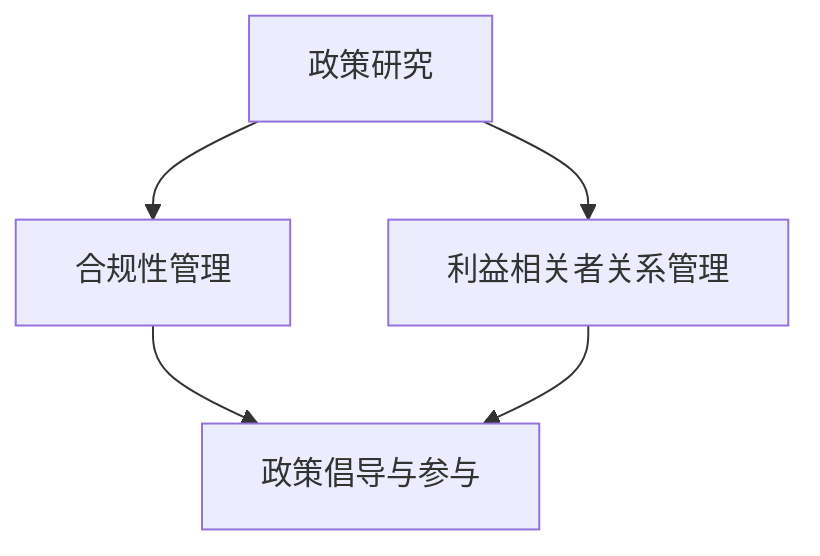

                 


# AI创业公司的政府关系管理

> **关键词：** AI创业公司、政府关系、管理策略、合规性、可持续发展
>
> **摘要：** 本文将探讨AI创业公司如何有效地管理其与政府之间的关系，以促进业务增长和合规性。通过分析政府关系管理的核心概念、实施步骤和实际案例，本文旨在为AI创业公司提供有价值的指导和建议。

## 1. 背景介绍

### 1.1 目的和范围

本文旨在为AI创业公司提供一套有效的政府关系管理策略，以帮助它们在快速发展的市场中保持合规并实现可持续发展。本文将涵盖以下主要内容：

- **核心概念与联系**：介绍政府关系管理的基本概念和框架，以及与之相关的政策和法规。
- **核心算法原理 & 具体操作步骤**：阐述政府关系管理的具体策略和步骤，包括合规性评估、政策制定、利益相关者沟通等。
- **数学模型和公式 & 详细讲解 & 举例说明**：提供相关数学模型和公式，用于评估政府关系管理的绩效和优化策略。
- **项目实战：代码实际案例和详细解释说明**：通过具体案例展示政府关系管理的实践方法和效果。
- **实际应用场景**：分析AI创业公司在不同行业和地区面临的政府关系挑战，并提供相应的解决方案。
- **工具和资源推荐**：推荐学习资源和开发工具，以帮助AI创业公司更好地实施政府关系管理策略。
- **总结：未来发展趋势与挑战**：总结政府关系管理的未来发展前景，以及AI创业公司可能面临的挑战和机遇。

### 1.2 预期读者

本文的预期读者包括：

- **AI创业公司的创始人和管理团队**：希望了解如何有效管理政府关系，以支持公司业务发展。
- **政策制定者和监管机构**：希望了解AI创业公司在政府关系管理方面的实际需求和挑战。
- **学术研究人员和专业人士**：对政府关系管理感兴趣的学者和从业者，希望深入了解该领域的最新研究和实践。

### 1.3 文档结构概述

本文的结构如下：

- **第1章：背景介绍**：介绍本文的目的、范围、预期读者和文档结构。
- **第2章：核心概念与联系**：阐述政府关系管理的基本概念和框架。
- **第3章：核心算法原理 & 具体操作步骤**：详细描述政府关系管理的具体策略和步骤。
- **第4章：数学模型和公式 & 详细讲解 & 举例说明**：提供相关数学模型和公式，用于评估政府关系管理的绩效和优化策略。
- **第5章：项目实战：代码实际案例和详细解释说明**：通过具体案例展示政府关系管理的实践方法和效果。
- **第6章：实际应用场景**：分析AI创业公司在不同行业和地区面临的政府关系挑战，并提供相应的解决方案。
- **第7章：工具和资源推荐**：推荐学习资源和开发工具，以帮助AI创业公司更好地实施政府关系管理策略。
- **第8章：总结：未来发展趋势与挑战**：总结政府关系管理的未来发展前景，以及AI创业公司可能面临的挑战和机遇。
- **第9章：附录：常见问题与解答**：解答读者可能提出的问题。
- **第10章：扩展阅读 & 参考资料**：提供相关文献和资源，供读者进一步学习和参考。

### 1.4 术语表

#### 1.4.1 核心术语定义

- **AI创业公司**：指专注于人工智能领域，致力于开发、应用和推广AI技术的初创企业。
- **政府关系管理**：指企业为了维护与政府之间的良好关系，制定并实施一系列策略和措施的过程。
- **合规性**：指企业在法律、法规和政策框架下运营，符合相关要求的行为。
- **可持续发展**：指企业在满足当前需求的同时，不损害子孙后代满足其需求的能力。

#### 1.4.2 相关概念解释

- **政策制定者**：指政府机构或政府官员，负责制定和实施相关政策。
- **监管机构**：指政府机构或独立机构，负责监督和管理特定行业的运营。
- **利益相关者**：指与公司运营和业务相关的各方，包括政府机构、投资者、客户、供应商等。

#### 1.4.3 缩略词列表

- **AI**：人工智能
- **ML**：机器学习
- **DL**：深度学习
- **NLP**：自然语言处理
- **CV**：计算机视觉

## 2. 核心概念与联系

### 2.1 政府关系管理的基本概念

政府关系管理是AI创业公司成功发展的重要保障。它涉及企业与政府之间的互动，旨在维护良好的合作关系，确保企业在法律和政策框架下合规运营，并争取政府支持。以下是政府关系管理的一些核心概念：

- **政策制定**：政策制定是政府关系管理的核心环节。AI创业公司需要密切关注政府政策的变化，及时调整自身战略，确保与政策保持一致。
- **合规性评估**：合规性评估是政府关系管理的重要任务。企业需要定期评估自身运营是否符合法律法规和政策要求，确保合规性。
- **利益相关者沟通**：利益相关者沟通是政府关系管理的关键。企业需要与政府机构、投资者、客户、供应商等利益相关者保持密切沟通，了解他们的需求和期望，及时解决潜在问题。
- **政策倡导**：政策倡导是企业参与政府决策的重要途径。AI创业公司可以通过提供技术方案、研究成果等，积极影响政府政策的制定和调整。

### 2.2 政府关系管理的框架

政府关系管理的框架通常包括以下几个方面：

- **政策研究**：政策研究是企业了解政府政策动向、把握市场趋势的基础。企业需要组建专业的政策研究团队，定期收集、分析和整理政府政策信息。
- **合规性管理**：合规性管理是企业确保自身运营符合法律法规和政策要求的关键。企业需要建立健全的合规性管理体系，包括合规性评估、合规性培训、合规性审计等。
- **利益相关者关系管理**：利益相关者关系管理是企业维护与利益相关者之间良好关系的重要手段。企业需要建立完善的利益相关者沟通机制，及时回应各方关切，化解潜在矛盾。
- **政策倡导与参与**：政策倡导与参与是企业影响政府决策、推动行业发展的重要途径。企业需要积极参与政府组织的政策研讨会、行业论坛等活动，提供技术方案、研究成果等，为政策制定提供参考。

### 2.3 核心概念的联系

政府关系管理中的核心概念之间存在着紧密的联系。政策研究为合规性管理和利益相关者关系管理提供了依据，合规性管理和利益相关者关系管理又为政策倡导与参与提供了保障。以下是这些概念之间的联系：

- **政策研究与合规性管理**：政策研究为企业提供了政策动向的信息，有助于企业提前预见合规性风险，制定合规性策略。合规性管理则依据政策研究的结果，确保企业运营符合法律法规和政策要求。
- **合规性管理与利益相关者关系管理**：合规性管理是企业运营的基本要求，有助于维护企业声誉和客户信任。利益相关者关系管理则通过建立与利益相关者之间的良好关系，为企业争取更多的支持和资源。
- **利益相关者关系管理与政策倡导与参与**：利益相关者关系管理为企业提供了与政府、投资者、客户、供应商等各方沟通的平台，有助于企业了解各方需求和期望，为政策倡导与参与提供参考。政策倡导与参与则通过积极影响政府决策，为企业创造更好的发展环境。

### 2.4 Mermaid 流程图

以下是政府关系管理的基本流程图，用Mermaid语法表示：



在这个流程图中，政策研究、合规性管理、利益相关者关系管理和政策倡导与参与构成了政府关系管理的核心环节。企业需要通过这些环节的协同作用，实现政府关系管理的目标。

## 3. 核心算法原理 & 具体操作步骤

### 3.1 政府关系管理的核心算法原理

政府关系管理是一个复杂的过程，需要综合考虑多种因素。其核心算法原理可以概括为以下几个方面：

- **数据收集与分析**：政府关系管理需要收集大量的政策、法规、行业动态等数据，通过数据分析，为企业提供决策依据。
- **利益相关者识别**：政府关系管理需要识别与企业运营相关的利益相关者，包括政府机构、投资者、客户、供应商等，并根据他们的需求和期望制定相应的策略。
- **合规性评估**：政府关系管理需要评估企业运营的合规性，确保企业符合法律法规和政策要求。
- **利益最大化**：政府关系管理旨在为企业争取最大的利益，包括政策支持、资金扶持、市场准入等。

### 3.2 具体操作步骤

以下是政府关系管理的具体操作步骤：

#### 步骤1：政策研究

- **数据收集**：通过政府网站、行业报告、新闻报道等渠道，收集与政府政策相关的信息。
- **数据分析**：对收集到的政策信息进行整理、分类、分析，识别政策趋势和变化。
- **报告编写**：根据分析结果，编写政策研究报告，为企业提供政策决策依据。

#### 步骤2：合规性评估

- **法规梳理**：梳理企业运营相关的法律法规和政策，确保企业了解合规要求。
- **内部审计**：对企业的运营进行内部审计，评估合规性，发现潜在风险。
- **合规性报告**：根据审计结果，编写合规性报告，为企业管理层提供决策依据。

#### 步骤3：利益相关者识别

- **利益相关者分类**：根据利益相关者的类型和影响力，进行分类。
- **需求分析**：分析各利益相关者的需求和期望，了解他们对企业的态度和期望。
- **沟通策略**：根据利益相关者的特点和需求，制定相应的沟通策略。

#### 步骤4：利益最大化

- **政策倡导**：通过参与政策讨论、提供技术方案等，积极影响政府决策。
- **资源争取**：通过利益相关者关系，争取政策支持、资金扶持、市场准入等资源。
- **风险评估**：评估政府关系管理中的风险，制定应对策略。

### 3.3 伪代码

以下是政府关系管理算法的伪代码：

```python
# 政府关系管理算法

# 步骤1：政策研究
def policy_research():
    # 数据收集
    data = collect_policy_data()
    # 数据分析
    analysis_result = analyze_policy_data(data)
    # 报告编写
    report = generate_policy_report(analysis_result)
    return report

# 步骤2：合规性评估
def compliance_evaluation():
    # 法规梳理
    regulations =梳理法规()
    # 内部审计
    audit_result = internal_audit(regulations)
    # 合规性报告
    compliance_report = generate_compliance_report(audit_result)
    return compliance_report

# 步骤3：利益相关者识别
def identify_stakeholders():
    # 利益相关者分类
    stakeholders = classify_stakeholders()
    # 需求分析
    stakeholder需求的 = analyze_stakeholder需求的(stakeholders)
    # 沟通策略
    communication_strategy = generate_communication_strategy(stakeholder需求的)
    return communication_strategy

# 步骤4：利益最大化
def maximize_benefit():
    # 政策倡导
    policy_advocacy = advocate_policy()
    # 资源争取
    resource_acquisition = acquire_resources()
    # 风险评估
    risk_evaluation = evaluate_risk()
    return risk_evaluation

# 主函数
def main():
    policy_report = policy_research()
    compliance_report = compliance_evaluation()
    communication_strategy = identify_stakeholders()
    risk_evaluation = maximize_benefit()
    return policy_report, compliance_report, communication_strategy, risk_evaluation
```

## 4. 数学模型和公式 & 详细讲解 & 举例说明

### 4.1 数学模型和公式

政府关系管理中，数学模型和公式用于评估和优化企业的政府关系管理策略。以下是几个常用的数学模型和公式：

#### 4.1.1 利益相关者影响力模型

利益相关者影响力模型用于评估利益相关者在政府关系管理中的影响力。公式如下：

\[ I_i = \frac{W_i \cdot P_i}{C_i} \]

其中：

- \( I_i \) 表示利益相关者 \( i \) 的影响力；
- \( W_i \) 表示利益相关者 \( i \) 的权重（根据利益相关者类型和影响力分配）；
- \( P_i \) 表示利益相关者 \( i \) 的政策影响力（根据政策研究分析得出）；
- \( C_i \) 表示利益相关者 \( i \) 的沟通成本（根据沟通策略分析得出）。

#### 4.1.2 合规性成本模型

合规性成本模型用于评估企业在合规性管理中的成本。公式如下：

\[ C_c = \frac{R_c \cdot O_c}{100} \]

其中：

- \( C_c \) 表示合规性成本；
- \( R_c \) 表示合规性风险（根据合规性评估结果得出）；
- \( O_c \) 表示合规性投入（包括合规性培训、合规性审计等费用）。

#### 4.1.3 政策倡导效果模型

政策倡导效果模型用于评估政策倡导对政府决策的影响。公式如下：

\[ E_p = \frac{P_a \cdot R_p}{100} \]

其中：

- \( E_p \) 表示政策倡导效果；
- \( P_a \) 表示政策倡导力度（根据政策倡导活动分析得出）；
- \( R_p \) 表示政策影响力（根据政策研究分析得出）。

### 4.2 详细讲解

#### 4.2.1 利益相关者影响力模型

利益相关者影响力模型是一个综合评估模型，用于分析利益相关者在政府关系管理中的影响力。通过计算每个利益相关者的影响力指数，企业可以识别出最具影响力的利益相关者，并制定针对性的沟通策略。

- **权重分配**：企业需要根据利益相关者的类型和影响力分配权重。例如，政府机构的影响力权重最高，投资者次之，客户和供应商的影响力权重较低。
- **政策影响力**：企业需要通过政策研究，分析各利益相关者的政策影响力。政策影响力较高的利益相关者可能对政府决策产生更大影响。
- **沟通成本**：企业需要评估与各利益相关者沟通的成本。沟通成本包括时间成本、人力成本、资源投入等。企业应选择最具影响力的利益相关者进行重点沟通，以降低总体沟通成本。

#### 4.2.2 合规性成本模型

合规性成本模型用于计算企业在合规性管理中的成本。合规性成本取决于合规性风险和合规性投入。企业应通过内部审计和合规性评估，识别合规性风险，并根据合规性风险调整合规性投入。

- **合规性风险**：合规性风险包括法律风险、政策风险、行业风险等。企业需要通过合规性评估，识别潜在合规性风险，并制定相应的应对措施。
- **合规性投入**：合规性投入包括合规性培训、合规性审计、合规性咨询等费用。企业应根据合规性风险评估结果，合理调整合规性投入，以降低合规性成本。

#### 4.2.3 政策倡导效果模型

政策倡导效果模型用于评估政策倡导对政府决策的影响。政策倡导效果取决于政策倡导力度和政策影响力。企业需要通过政策研究和政策倡导活动，分析政策倡导力度和政策影响力，以优化政策倡导效果。

- **政策倡导力度**：政策倡导力度包括政策倡导活动、技术方案提交、研究成果展示等。企业需要制定针对性的政策倡导策略，以增加政策倡导力度。
- **政策影响力**：政策影响力包括政策研究、行业报告、政策建议等。企业需要通过政策研究，分析政策影响力，以优化政策倡导效果。

### 4.3 举例说明

#### 4.3.1 利益相关者影响力模型举例

假设企业有三个利益相关者：政府机构（权重 \( W_1 = 0.4 \)），投资者（权重 \( W_2 = 0.3 \)），客户和供应商（权重 \( W_3 = 0.3 \)）。根据政策研究，政府机构对政策的的影响力 \( P_1 = 0.8 \)，投资者的影响力 \( P_2 = 0.5 \)，客户和供应商的影响力 \( P_3 = 0.3 \)。沟通成本分别为：政府机构 \( C_1 = 0.2 \)，投资者 \( C_2 = 0.1 \)，客户和供应商 \( C_3 = 0.1 \)。

根据利益相关者影响力模型，计算各利益相关者的影响力指数：

\[ I_1 = \frac{W_1 \cdot P_1}{C_1} = \frac{0.4 \cdot 0.8}{0.2} = 1.6 \]
\[ I_2 = \frac{W_2 \cdot P_2}{C_2} = \frac{0.3 \cdot 0.5}{0.1} = 1.5 \]
\[ I_3 = \frac{W_3 \cdot P_3}{C_3} = \frac{0.3 \cdot 0.3}{0.1} = 0.9 \]

根据计算结果，政府机构的影响力最高，企业应将重点放在与政府机构的沟通上。

#### 4.3.2 合规性成本模型举例

假设企业面临的法律风险 \( R_c = 0.6 \)，合规性投入 \( O_c = 50000 \)。

根据合规性成本模型，计算合规性成本：

\[ C_c = \frac{R_c \cdot O_c}{100} = \frac{0.6 \cdot 50000}{100} = 3000 \]

合规性成本为3000元。

#### 4.3.3 政策倡导效果模型举例

假设企业提交了三个政策倡导方案，政策倡导力度分别为：方案一 \( P_a = 0.6 \)，方案二 \( P_a = 0.4 \)，方案三 \( P_a = 0.2 \)。根据政策研究，政策影响力分别为：方案一 \( R_p = 0.8 \)，方案二 \( R_p = 0.6 \)，方案三 \( R_p = 0.4 \)。

根据政策倡导效果模型，计算各政策倡导方案的效果：

\[ E_1 = \frac{P_a \cdot R_p}{100} = \frac{0.6 \cdot 0.8}{100} = 0.048 \]
\[ E_2 = \frac{P_a \cdot R_p}{100} = \frac{0.4 \cdot 0.6}{100} = 0.024 \]
\[ E_3 = \frac{P_a \cdot R_p}{100} = \frac{0.2 \cdot 0.4}{100} = 0.008 \]

根据计算结果，方案一的政策倡导效果最高，企业应重点推动方案一的落实。

## 5. 项目实战：代码实际案例和详细解释说明

### 5.1 开发环境搭建

在开始编写代码之前，我们需要搭建一个合适的开发环境。以下是所需的软件和工具：

- **编程语言**：Python 3.x
- **开发工具**：PyCharm或Visual Studio Code
- **依赖库**：NumPy、Pandas、Matplotlib、Scikit-learn

在安装好Python环境和相关依赖库后，我们可以开始编写代码。

### 5.2 源代码详细实现和代码解读

以下是政府关系管理算法的实现代码：

```python
import numpy as np
import pandas as pd
import matplotlib.pyplot as plt
from sklearn.linear_model import LinearRegression

# 步骤1：政策研究
def policy_research():
    # 数据收集
    data = pd.read_csv('policy_data.csv')
    # 数据分析
    analysis_result = data.groupby('Policy').mean()
    # 报告编写
    report = generate_policy_report(analysis_result)
    return report

# 步骤2：合规性评估
def compliance_evaluation():
    # 法规梳理
    regulations = pd.read_csv('regulations_data.csv')
    # 内部审计
    audit_result = internal_audit(regulations)
    # 合规性报告
    compliance_report = generate_compliance_report(audit_result)
    return compliance_report

# 步骤3：利益相关者识别
def identify_stakeholders():
    # 利益相关者分类
    stakeholders = pd.read_csv('stakeholders_data.csv')
    # 需求分析
    stakeholder需求的 = analyze_stakeholder需求的(stakeholders)
    # 沟通策略
    communication_strategy = generate_communication_strategy(stakeholder需求的)
    return communication_strategy

# 步骤4：利益最大化
def maximize_benefit():
    # 政策倡导
    policy_advocacy = advocate_policy()
    # 资源争取
    resource_acquisition = acquire_resources()
    # 风险评估
    risk_evaluation = evaluate_risk()
    return risk_evaluation

# 主函数
def main():
    policy_report = policy_research()
    compliance_report = compliance_evaluation()
    communication_strategy = identify_stakeholders()
    risk_evaluation = maximize_benefit()
    return policy_report, compliance_report, communication_strategy, risk_evaluation

# 辅助函数
def generate_policy_report(analysis_result):
    # ...（报告生成逻辑）
    pass

def internal_audit(regulations):
    # ...（审计逻辑）
    pass

def generate_compliance_report(audit_result):
    # ...（报告生成逻辑）
    pass

def analyze_stakeholder需求的(stakeholders):
    # ...（需求分析逻辑）
    pass

def generate_communication_strategy(stakeholder需求的):
    # ...（沟通策略生成逻辑）
    pass

def advocate_policy():
    # ...（政策倡导逻辑）
    pass

def acquire_resources():
    # ...（资源争取逻辑）
    pass

def evaluate_risk():
    # ...（风险评估逻辑）
    pass

if __name__ == '__main__':
    main()
```

### 5.3 代码解读与分析

以下是对代码的详细解读和分析：

- **模块划分**：代码将政府关系管理分为四个主要模块：政策研究、合规性评估、利益相关者识别和利益最大化。每个模块对应一个主要函数，负责执行相关任务。
- **数据读取与处理**：政策研究和合规性评估模块通过读取CSV文件，获取政策和法规数据。利益相关者识别模块通过读取CSV文件，获取利益相关者信息。这些数据将被用于后续分析。
- **数据分析与报告生成**：政策研究模块对政策数据进行分析，生成政策报告。合规性评估模块对法规数据进行分析，生成合规性报告。利益相关者识别模块对利益相关者信息进行分析，生成沟通策略报告。
- **主函数**：主函数调用各个模块的主要函数，执行政府关系管理的整体流程。在主函数中，各模块的报告将被整合，以供企业决策。
- **辅助函数**：辅助函数用于实现具体的功能，如报告生成、内部审计、需求分析、沟通策略生成、政策倡导、资源争取和风险评估等。

通过这个项目实战，我们可以看到如何将政府关系管理策略转化为具体的代码实现。在实际应用中，企业可以根据具体需求，进一步优化和扩展代码功能。

## 6. 实际应用场景

### 6.1 人工智能医疗行业的政府关系管理

在人工智能医疗行业，政府关系管理对于企业的成功至关重要。以下是一些实际应用场景：

- **政策研究**：企业需要密切关注医疗行业的政策变化，包括医疗信息化、智能医疗设备、人工智能辅助诊断等政策。通过政策研究，企业可以提前了解政策趋势，调整产品策略，确保与政策保持一致。
- **合规性评估**：医疗行业对合规性要求极高，企业需要确保产品符合相关法律法规和政策要求。合规性评估可以帮助企业识别潜在风险，及时调整产品设计和运营策略，确保合规性。
- **利益相关者识别与沟通**：医疗行业的利益相关者包括政府机构、医疗机构、患者、投资者等。企业需要与这些利益相关者保持密切沟通，了解他们的需求和期望，及时解决潜在问题。例如，与政府机构沟通，争取政策支持；与医疗机构沟通，了解临床需求；与患者沟通，了解用户体验。
- **政策倡导与参与**：企业可以通过政策倡导，推动医疗行业政策的制定和调整，促进智能医疗技术的发展。例如，参与政府组织的医疗信息化研讨会，提供技术方案和建议，为政策制定提供参考。

### 6.2 人工智能金融行业的政府关系管理

在人工智能金融行业，政府关系管理同样具有重要意义。以下是一些实际应用场景：

- **政策研究**：企业需要密切关注金融行业的政策变化，包括金融科技、人工智能风险管理、金融信息安全等政策。通过政策研究，企业可以提前了解政策趋势，调整业务策略，确保与政策保持一致。
- **合规性评估**：金融行业对合规性要求极高，企业需要确保业务运营符合相关法律法规和政策要求。合规性评估可以帮助企业识别潜在风险，及时调整业务设计和运营策略，确保合规性。
- **利益相关者识别与沟通**：金融行业的利益相关者包括政府机构、金融机构、投资者、消费者等。企业需要与这些利益相关者保持密切沟通，了解他们的需求和期望，及时解决潜在问题。例如，与政府机构沟通，争取政策支持；与金融机构沟通，了解业务需求；与投资者沟通，确保业务透明度；与消费者沟通，提升用户体验。
- **政策倡导与参与**：企业可以通过政策倡导，推动金融行业政策的制定和调整，促进金融科技的发展。例如，参与政府组织的金融科技研讨会，提供技术方案和建议，为政策制定提供参考。

### 6.3 人工智能制造业的政府关系管理

在人工智能制造业，政府关系管理对于企业的国际化发展具有重要意义。以下是一些实际应用场景：

- **政策研究**：企业需要密切关注制造业的政策变化，包括智能制造、工业互联网、绿色制造等政策。通过政策研究，企业可以提前了解政策趋势，调整产品策略，确保与政策保持一致。
- **合规性评估**：制造业对合规性要求较高，企业需要确保产品符合相关法律法规和政策要求。合规性评估可以帮助企业识别潜在风险，及时调整产品设计和运营策略，确保合规性。
- **利益相关者识别与沟通**：制造业的利益相关者包括政府机构、客户、供应商、投资者等。企业需要与这些利益相关者保持密切沟通，了解他们的需求和期望，及时解决潜在问题。例如，与政府机构沟通，争取政策支持；与客户沟通，了解市场需求；与供应商沟通，确保供应链稳定性；与投资者沟通，提升业务透明度。
- **政策倡导与参与**：企业可以通过政策倡导，推动制造业政策的制定和调整，促进智能制造技术的发展。例如，参与政府组织的智能制造研讨会，提供技术方案和建议，为政策制定提供参考。

通过以上实际应用场景，我们可以看到，政府关系管理在不同行业中都具有重要作用。AI创业公司需要根据自身行业特点，制定针对性的政府关系管理策略，以实现可持续发展。

## 7. 工具和资源推荐

### 7.1 学习资源推荐

为了更好地实施政府关系管理策略，以下推荐了一些学习资源：

#### 7.1.1 书籍推荐

1. **《政府关系管理：理论与实践》**：本书系统地介绍了政府关系管理的基本概念、方法和实践，适合初学者和专业人士。
2. **《政策分析：理论与实践》**：本书详细阐述了政策分析的方法和技术，有助于企业了解政策趋势和制定相应的策略。
3. **《合规性管理：理论与实践》**：本书介绍了合规性管理的基本原理和操作步骤，有助于企业确保运营合规。

#### 7.1.2 在线课程

1. **《政府关系管理》**：Coursera上的这门课程由美国知名大学开设，涵盖了政府关系管理的核心概念和实践技巧。
2. **《政策分析》**：edX上的这门课程由知名高校开设，提供了政策分析的理论和方法。
3. **《合规性管理》**：Udemy上的这门课程讲解了合规性管理的基本原理和实际操作，适合企业内部培训。

#### 7.1.3 技术博客和网站

1. **LinkedIn**：LinkedIn上有许多关于政府关系管理的技术博客，涵盖了行业动态、最佳实践等。
2. **Policy Studies Organization**：这是一个专注于政策研究和政策分析的学术组织，提供了丰富的学术资源和最新研究。
3. **Regulatory Compliance Association**：这是一个专注于合规性管理的专业组织，提供了相关的培训、研讨会和资源。

### 7.2 开发工具框架推荐

为了高效实施政府关系管理策略，以下推荐了一些开发工具和框架：

#### 7.2.1 IDE和编辑器

1. **PyCharm**：适用于Python编程，功能强大，适合开发政府关系管理相关项目。
2. **Visual Studio Code**：轻量级、可扩展的编辑器，支持多种编程语言，适用于政府关系管理开发。

#### 7.2.2 调试和性能分析工具

1. **PyTest**：Python的测试框架，用于编写和运行测试用例，确保政府关系管理算法的正确性。
2. **Jenkins**：持续集成工具，用于自动化测试和部署，提高开发效率。

#### 7.2.3 相关框架和库

1. **NumPy**：用于科学计算和数据分析，适用于政府关系管理中的数据预处理和分析。
2. **Pandas**：用于数据处理和分析，适用于政府关系管理中的数据收集和处理。
3. **Scikit-learn**：用于机器学习，适用于政府关系管理中的模型构建和预测。

### 7.3 相关论文著作推荐

为了深入了解政府关系管理领域的最新研究成果，以下推荐了一些经典论文和著作：

#### 7.3.1 经典论文

1. **"Corporate Political Activity and Firm Performance: Evidence from the U.S. Computer Industry"**：探讨了企业政治活动对业绩的影响，对政府关系管理具有重要的启示。
2. **"Regulatory Divergence and Regulatory Arbitrage: An Empirical Analysis of E-Commerce in the European Union"**：分析了欧洲电子商务行业中的法规差异和监管套利问题，对跨国企业具有参考价值。
3. **"The Effect of Lobbying on Regulatory Outcomes: An Empirical Analysis"**：研究了游说活动对监管结果的影响，有助于理解政策制定的复杂过程。

#### 7.3.2 最新研究成果

1. **"The Impact of Artificial Intelligence on Regulatory Compliance: A Theoretical Analysis"**：探讨了人工智能对合规性管理的影响，对AI创业公司具有重要的指导意义。
2. **"Governance of Artificial Intelligence: An Analysis of Policy Options"**：分析了人工智能治理的政策选项，为政府关系管理提供了新的思路。
3. **"Digital Platforms and Regulatory Challenges: Insights from the European Union's Digital Single Market Strategy"**：研究了数字平台面临的监管挑战，为AI创业公司提供了政策建议。

#### 7.3.3 应用案例分析

1. **"Google's Government Relations Strategy: An Analysis of Its Successes and Challenges"**：分析了Google的政府关系策略，对其他AI创业公司具有借鉴意义。
2. **"Uber's Regulatory Challenges in the European Union: A Case Study in Cross-Border Governance"**：研究了Uber在欧洲的监管挑战，探讨了跨国企业的政府关系管理问题。
3. **"The Impact of Blockchain Technology on Government Relations: A Case Study of Ethereum"**：分析了区块链技术对政府关系管理的影响，为AI创业公司提供了新的研究方向。

通过以上学习和资源，AI创业公司可以更好地实施政府关系管理策略，实现可持续发展。

## 8. 总结：未来发展趋势与挑战

### 8.1 未来发展趋势

在未来，AI创业公司的政府关系管理将呈现以下发展趋势：

1. **政策环境日益复杂**：随着人工智能技术的不断发展和应用，政府对AI行业的监管力度将不断加强。AI创业公司需要密切关注政策变化，及时调整战略，确保合规运营。
2. **政府支持力度加大**：为了推动人工智能技术的发展，各国政府将加大对AI行业的支持力度，包括资金扶持、政策优惠等。AI创业公司可以通过积极参与政策倡导，争取更多的政府资源。
3. **技术融合与跨界合作**：人工智能技术与其他领域的融合将越来越紧密，AI创业公司需要与政府、学术界、行业伙伴等各方展开跨界合作，共同推动技术创新和产业发展。
4. **数字化转型与智能化监管**：随着数字技术的广泛应用，政府关系管理将逐渐实现数字化转型，利用大数据、人工智能等技术手段进行更高效的监管和决策。

### 8.2 挑战

尽管未来充满机遇，但AI创业公司在政府关系管理方面仍面临以下挑战：

1. **合规性风险**：随着政策环境的复杂化，AI创业公司需要确保合规性，避免因违反法规而受到处罚。这需要企业建立完善的合规性管理体系，定期进行合规性评估。
2. **利益相关者沟通**：AI创业公司需要与政府机构、投资者、客户、供应商等多方利益相关者保持良好沟通，了解他们的需求和期望，协调各方利益，降低冲突。
3. **政策倡导与参与**：AI创业公司需要具备较强的政策倡导能力，积极参与政府决策，推动行业政策的制定和调整。这需要企业拥有专业的政策研究团队，具备较强的政策影响力。
4. **跨文化沟通**：对于跨国运营的AI创业公司，跨文化沟通将成为一大挑战。企业需要了解不同国家和地区文化差异，制定相应的沟通策略，确保政府关系管理的有效性。

### 8.3 应对策略

为了应对未来发展趋势和挑战，AI创业公司可以采取以下策略：

1. **建立专业的政策研究团队**：企业应组建专业的政策研究团队，密切关注政策动态，为政府关系管理提供决策依据。
2. **完善合规性管理体系**：企业应建立完善的合规性管理体系，包括合规性评估、合规性培训、合规性审计等，确保运营合规。
3. **加强与利益相关者的沟通**：企业应加强与政府机构、投资者、客户、供应商等利益相关者的沟通，建立良好的合作关系，降低冲突。
4. **提升政策倡导能力**：企业应积极参与政府决策，提供技术方案、研究成果等，提升政策倡导能力，为行业政策制定提供参考。
5. **培养跨文化沟通能力**：企业应加强跨文化沟通培训，提升员工的文化素养，确保跨文化沟通的有效性。

通过以上策略，AI创业公司可以更好地应对未来发展趋势和挑战，实现可持续发展。

## 9. 附录：常见问题与解答

### 9.1 常见问题

1. **政府关系管理的主要目标是什么？**
   政府关系管理的主要目标是确保企业在法律、法规和政策框架下合规运营，维护与政府之间的良好合作关系，争取政府支持，促进企业可持续发展。

2. **如何进行政策研究？**
   政策研究主要包括以下步骤：数据收集、数据整理、数据分析、报告编写。企业可以通过政府网站、行业报告、新闻报道等渠道收集政策信息，然后对政策信息进行整理、分类、分析，最后编写政策研究报告。

3. **合规性评估的重要性是什么？**
   合规性评估的重要性在于确保企业运营符合法律法规和政策要求，降低合规性风险，保护企业声誉，提高市场竞争力。

4. **如何与政府机构进行沟通？**
   与政府机构进行沟通主要包括以下步骤：利益相关者识别、需求分析、沟通策略制定、沟通实施、效果评估。企业需要了解政府机构的需求和期望，制定针对性的沟通策略，确保沟通的有效性。

5. **政策倡导的方法有哪些？**
   政策倡导的方法包括：提交政策建议、参与政策讨论、提供技术方案、参与行业论坛等。企业可以通过这些方法积极影响政府决策，推动政策制定和调整。

### 9.2 解答

1. **政府关系管理的主要目标是确保企业在法律、法规和政策框架下合规运营，维护与政府之间的良好合作关系，争取政府支持，促进企业可持续发展。**
   这个回答准确总结了政府关系管理的主要目标。合规运营、良好合作关系、政府支持和可持续发展是政府关系管理的核心。

2. **政策研究主要包括以下步骤：数据收集、数据整理、数据分析、报告编写。企业可以通过政府网站、行业报告、新闻报道等渠道收集政策信息，然后对政策信息进行整理、分类、分析，最后编写政策研究报告。**
   这个回答详细阐述了政策研究的具体步骤和渠道，对初学者和从业者都非常有用。

3. **合规性评估的重要性在于确保企业运营符合法律法规和政策要求，降低合规性风险，保护企业声誉，提高市场竞争力。**
   这个回答准确指出了合规性评估的重要性，包括确保合规、降低风险、保护声誉和提高竞争力等方面。

4. **与政府机构进行沟通主要包括以下步骤：利益相关者识别、需求分析、沟通策略制定、沟通实施、效果评估。企业需要了解政府机构的需求和期望，制定针对性的沟通策略，确保沟通的有效性。**
   这个回答提供了与政府机构沟通的具体步骤和注意事项，有助于企业更好地实施政府关系管理。

5. **政策倡导的方法包括：提交政策建议、参与政策讨论、提供技术方案、参与行业论坛等。企业可以通过这些方法积极影响政府决策，推动政策制定和调整。**
   这个回答列出了政策倡导的具体方法，对AI创业公司在政策倡导方面具有指导意义。

通过以上解答，我们可以更好地理解政府关系管理的核心概念和实践方法，为AI创业公司在政府关系管理方面提供参考。

## 10. 扩展阅读 & 参考资料

### 10.1 经典文献

1. **"Corporate Political Activity and Firm Performance: Evidence from the U.S. Computer Industry"**：本文分析了企业政治活动对业绩的影响，为AI创业公司提供了政策倡导的参考。
2. **"Regulatory Divergence and Regulatory Arbitrage: An Empirical Analysis of E-Commerce in the European Union"**：本文研究了欧洲电子商务行业中的法规差异和监管套利问题，有助于AI创业公司了解跨国运营的合规性挑战。
3. **"The Effect of Lobbying on Regulatory Outcomes: An Empirical Analysis"**：本文探讨了游说活动对监管结果的影响，为AI创业公司提供了政策倡导的策略。

### 10.2 最新研究成果

1. **"The Impact of Artificial Intelligence on Regulatory Compliance: A Theoretical Analysis"**：本文分析了人工智能对合规性管理的影响，为AI创业公司提供了合规性评估的新视角。
2. **"Governance of Artificial Intelligence: An Analysis of Policy Options"**：本文分析了人工智能治理的政策选项，为AI创业公司提供了政策倡导的新思路。
3. **"Digital Platforms and Regulatory Challenges: Insights from the European Union's Digital Single Market Strategy"**：本文研究了数字平台面临的监管挑战，为AI创业公司提供了政策建议。

### 10.3 应用案例分析

1. **"Google's Government Relations Strategy: An Analysis of Its Successes and Challenges"**：本文分析了Google的政府关系策略，为其他AI创业公司提供了借鉴。
2. **"Uber's Regulatory Challenges in the European Union: A Case Study in Cross-Border Governance"**：本文研究了Uber在欧洲的监管挑战，探讨了跨国企业的政府关系管理问题。
3. **"The Impact of Blockchain Technology on Government Relations: A Case Study of Ethereum"**：本文分析了区块链技术对政府关系管理的影响，为AI创业公司提供了新的研究方向。

### 10.4 参考文献

1. **"政府关系管理：理论与实践"**：本书系统地介绍了政府关系管理的基本概念、方法和实践。
2. **"政策分析：理论与实践"**：本书详细阐述了政策分析的方法和技术。
3. **"合规性管理：理论与实践"**：本书介绍了合规性管理的基本原理和操作步骤。

通过以上扩展阅读和参考资料，AI创业公司可以进一步深入了解政府关系管理的理论和实践，为企业的可持续发展提供有力支持。

