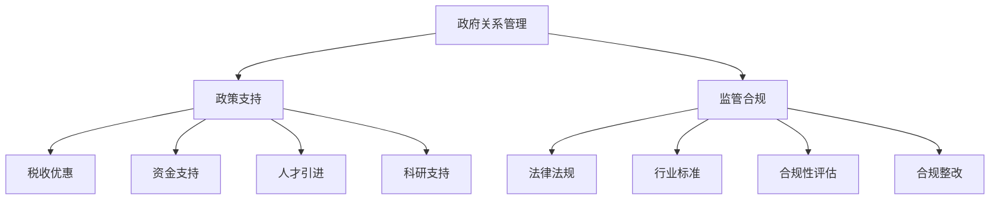

                 

# AI创业公司的政府关系管理：政策支持与监管合规

> **关键词：** AI创业公司、政府关系管理、政策支持、监管合规、创业策略

> **摘要：** 本文将深入探讨AI创业公司在政府关系管理方面的关键要素，包括如何获得政策支持以及如何实现监管合规。我们将逐步分析AI创业公司的特点、政府关系管理的重要性、政策支持的获取方法、监管合规的具体策略，并通过实际案例和实践经验来加深理解，以期为AI创业公司提供实用的指导和建议。

## 1. 背景介绍

### 1.1 目的和范围

本文旨在为AI创业公司提供一套系统的政府关系管理策略，帮助公司在政策支持和监管合规方面取得成功。我们重点关注以下内容：

- AI创业公司的特点与挑战
- 政府关系管理的重要性
- 获取政策支持的方法
- 实现监管合规的具体策略
- 政府关系管理的最佳实践

### 1.2 预期读者

本文适合以下读者群体：

- AI创业公司的创始人、CTO和高层管理人员
- 政府关系经理和相关部门人员
- 对AI行业有兴趣的研究人员和从业者

### 1.3 文档结构概述

本文结构如下：

- **第1章：背景介绍**：介绍文章的目的、预期读者以及文档结构。
- **第2章：核心概念与联系**：阐述政府关系管理、政策支持和监管合规的核心概念，并给出流程图。
- **第3章：核心算法原理 & 具体操作步骤**：详细讲解政府关系管理的算法原理和操作步骤。
- **第4章：数学模型和公式 & 详细讲解 & 举例说明**：介绍相关数学模型和公式，并给出实例。
- **第5章：项目实战：代码实际案例和详细解释说明**：通过实际案例展示政府关系管理的应用。
- **第6章：实际应用场景**：分析政府关系管理的实际应用场景。
- **第7章：工具和资源推荐**：推荐相关学习资源和开发工具。
- **第8章：总结：未来发展趋势与挑战**：展望未来发展趋势和面临的挑战。
- **第9章：附录：常见问题与解答**：解答读者可能遇到的常见问题。
- **第10章：扩展阅读 & 参考资料**：提供进一步阅读和参考资料。

### 1.4 术语表

#### 1.4.1 核心术语定义

- **AI创业公司**：指专注于人工智能领域，致力于开发创新产品或服务的初创企业。
- **政府关系管理**：指企业通过与政府相关部门建立联系、沟通和合作，以获取政策支持、资源和合规指导等。
- **政策支持**：指政府为企业提供的资金、税收优惠、人才引进、科研支持等。
- **监管合规**：指企业在运营过程中遵循相关法律法规和行业标准，以确保合法合规。

#### 1.4.2 相关概念解释

- **政府关系**：指企业与政府之间的互动和合作，包括政策建议、利益表达、资源获取等。
- **法律法规**：指国家或地方政府制定的规范企业行为和运营的相关法律、法规、规章和标准。
- **行业标准**：指行业内部普遍遵循的技术规范、服务标准和操作流程。

#### 1.4.3 缩略词列表

- **AI**：人工智能
- **CTO**：首席技术官
- **IDE**：集成开发环境
- **LaTeX**：排版系统

## 2. 核心概念与联系

在探讨AI创业公司的政府关系管理之前，我们需要理解一些核心概念和它们之间的关系。

### 2.1 政府关系管理

政府关系管理是企业通过与政府相关部门建立联系、沟通和合作，以获取政策支持、资源和合规指导的过程。以下是政府关系管理的核心概念：

- **政府关系**：企业与政府之间的互动和合作，包括政策建议、利益表达、资源获取等。
- **政策支持**：政府为企业提供的资金、税收优惠、人才引进、科研支持等。
- **资源获取**：通过政府关系获取土地、人才、资金等资源。
- **合规指导**：政府为企业提供法律法规、行业标准等方面的指导，帮助企业实现合法合规。

### 2.2 政策支持

政策支持是政府关系管理的重要组成部分。以下是一些关键概念：

- **税收优惠**：政府对企业在税收方面给予的优惠，如减税、免税等。
- **资金支持**：政府对企业在资金方面给予的支持，如财政拨款、贷款贴息等。
- **人才引进**：政府为企业引进高端人才，提高企业创新能力。
- **科研支持**：政府为企业提供科研经费、实验室等支持，促进企业技术研发。

### 2.3 监管合规

监管合规是企业运营过程中必须遵守的法律法规和行业标准。以下是一些关键概念：

- **法律法规**：国家或地方政府制定的规范企业行为和运营的相关法律、法规、规章和标准。
- **行业标准**：行业内部普遍遵循的技术规范、服务标准和操作流程。
- **合规性评估**：对企业运营的合规性进行评估，以确保企业遵守相关法律法规和行业标准。
- **合规整改**：发现企业存在合规问题后，政府要求企业进行整改，以消除违规行为。

### 2.4 核心概念原理和架构

为了更好地理解上述概念，我们可以使用Mermaid流程图来展示政府关系管理、政策支持和监管合规的核心概念和架构。以下是Mermaid流程图：



### 2.5 核心概念的联系与作用

通过上述核心概念的解释和流程图的展示，我们可以看出政府关系管理、政策支持和监管合规之间的紧密联系。政府关系管理是企业与政府之间建立联系、沟通和合作的基础，通过政策支持和监管合规，企业可以获得政府提供的资源和指导，从而在市场竞争中取得优势。

- **政府关系管理**：是企业与政府之间的桥梁，通过建立良好的政府关系，企业可以更好地获取政策支持和资源。
- **政策支持**：是企业发展的动力，通过政策支持，企业可以降低成本、提高竞争力。
- **监管合规**：是企业生存的根本，只有遵守相关法律法规和行业标准，企业才能在市场竞争中立于不败之地。

### 2.6 关键概念总结

在政府关系管理、政策支持和监管合规的核心概念中，我们需要重点关注以下几个关键概念：

- **政府关系**：企业与政府之间的互动和合作。
- **政策支持**：政府为企业提供的资金、税收优惠、人才引进、科研支持等。
- **监管合规**：企业遵守相关法律法规和行业标准，确保合法合规。

这些关键概念相互关联，共同构成了AI创业公司的政府关系管理框架。在后续章节中，我们将深入探讨这些概念的具体应用和实践。

## 3. 核心算法原理 & 具体操作步骤

在了解了政府关系管理、政策支持和监管合规的核心概念后，我们需要进一步探讨如何实现这些概念。本章节将详细讲解核心算法原理和具体操作步骤。

### 3.1 政府关系管理算法原理

政府关系管理的核心算法可以理解为“关系建立与维护”。以下是具体的算法原理：

#### 3.1.1 关系建立

1. **目标定位**：确定目标政府部门和关键人物，了解他们的职责、兴趣和关注点。
2. **信息搜集**：搜集目标政府部门和关键人物的相关信息，如背景资料、政策倾向、历史合作案例等。
3. **沟通建立**：通过电话、邮件、会议等方式，与目标政府部门和关键人物建立初步联系。
4. **互动加深**：在沟通中，了解对方需求和问题，提供有针对性的解决方案，建立互信关系。

#### 3.1.2 关系维护

1. **定期沟通**：保持与目标政府部门和关键人物的定期沟通，了解政策动态和需求变化。
2. **资源共享**：与政府共享企业资源，如技术、人才、案例等，提升双方合作价值。
3. **利益绑定**：通过合作项目和业务合作，实现企业与政府的利益绑定，确保长期稳定的合作关系。

### 3.2 政策支持获取算法原理

获取政策支持是政府关系管理的重要目标之一。以下是具体的算法原理：

#### 3.2.1 政策需求分析

1. **政策研究**：研究政府发布的各类政策文件，了解政策方向和重点。
2. **企业需求匹配**：分析企业的业务和发展需求，寻找与政策支持方向的匹配点。
3. **政策申请**：根据企业需求匹配结果，准备政策申请材料，包括企业情况介绍、项目计划、预期效益等。

#### 3.2.2 政策申请流程

1. **政策咨询**：向政府部门咨询政策申请的具体要求和流程。
2. **材料准备**：根据政策要求，准备完整的申请材料，确保材料质量。
3. **提交申请**：在规定时间内提交政策申请材料。
4. **审核反馈**：跟踪政策申请的审核进度，及时回应政府部门的问题和反馈。

### 3.3 监管合规算法原理

实现监管合规是企业生存和发展的基础。以下是具体的算法原理：

#### 3.3.1 法规研究

1. **法律法规搜集**：搜集与企业业务相关的法律法规、行业标准等。
2. **合规性评估**：对企业现有业务进行合规性评估，发现潜在风险。
3. **合规性改进**：根据合规性评估结果，制定改进措施，确保企业业务合法合规。

#### 3.3.2 法规遵循

1. **法规培训**：组织员工参加法律法规培训，提高员工的法规意识和合规能力。
2. **内部审计**：定期进行内部审计，确保企业业务符合法律法规和行业标准。
3. **合规监督**：设立合规监督部门，负责监督企业业务合规情况，及时发现问题并整改。

### 3.4 政府关系管理算法操作步骤

以下是政府关系管理算法的具体操作步骤：

#### 3.4.1 初步准备

1. **目标定位**：确定目标政府部门和关键人物。
2. **信息搜集**：搜集目标政府部门和关键人物的相关信息。
3. **沟通建立**：与目标政府部门和关键人物建立初步联系。

#### 3.4.2 深入沟通

1. **互动加深**：与目标政府部门和关键人物建立互信关系。
2. **定期沟通**：保持与目标政府部门和关键人物的定期沟通。
3. **资源共享**：与政府共享企业资源，提升合作价值。

#### 3.4.3 政策支持获取

1. **政策需求分析**：研究政府发布的政策文件，分析企业需求匹配点。
2. **政策申请**：准备政策申请材料，提交政策申请。
3. **审核反馈**：跟踪政策申请的审核进度，回应政府部门的问题和反馈。

#### 3.4.4 监管合规

1. **法规研究**：搜集与企业业务相关的法律法规、行业标准。
2. **合规性评估**：对企业现有业务进行合规性评估。
3. **合规性改进**：制定改进措施，确保企业业务合法合规。

通过以上步骤，AI创业公司可以逐步实现政府关系管理、政策支持获取和监管合规的目标。在实际操作中，公司需要根据自身情况和市场环境，灵活调整和优化这些步骤，以确保政府关系管理的有效性和高效性。

## 4. 数学模型和公式 & 详细讲解 & 举例说明

在政府关系管理、政策支持获取和监管合规的实践中，数学模型和公式可以起到重要的辅助作用。以下将介绍相关的数学模型和公式，并进行详细讲解和举例说明。

### 4.1 政府关系管理效率模型

政府关系管理效率模型主要用于评估企业在政府关系管理中的投入产出比，以衡量政府关系管理的效果。具体公式如下：

\[ 效率 = \frac{政策支持收益}{政府关系管理成本} \]

#### 详细讲解：

- **政策支持收益**：指企业在政策支持方面获得的收益，包括资金支持、税收优惠、人才引进、科研支持等。
- **政府关系管理成本**：指企业在政府关系管理中投入的成本，包括人力、物力、时间等。

#### 举例说明：

假设一家AI创业公司在政府关系管理中，获得了100万元的资金支持，政府关系管理成本为30万元。则该公司的政府关系管理效率为：

\[ 效率 = \frac{100万元}{30万元} = 3.33 \]

这意味着该公司每投入1万元的政府关系管理成本，可以获得3.33万元的收益，具有较高的政府关系管理效率。

### 4.2 政策支持匹配度模型

政策支持匹配度模型用于评估企业需求与政策支持之间的匹配程度，以确定政策支持的有效性。具体公式如下：

\[ 匹配度 = \frac{需求满足度}{政策支持力度} \]

#### 详细讲解：

- **需求满足度**：指企业需求在政策支持中得到的满足程度，通常用百分比表示。
- **政策支持力度**：指政策支持对企业需求的支撑力度，通常用金额或比例表示。

#### 举例说明：

假设一家AI创业公司需要100万元的资金支持，政策支持力度为80万元，需求满足度为90%。则该公司的政策支持匹配度为：

\[ 匹配度 = \frac{90\%}{80\%} = 1.125 \]

这意味着政策支持对企业需求的满足程度超过了100%，具有较高的政策支持匹配度。

### 4.3 监管合规性评估模型

监管合规性评估模型用于评估企业在监管合规方面的表现，以确保企业业务合法合规。具体公式如下：

\[ 合规性 = \frac{合规业务量}{总业务量} \]

#### 详细讲解：

- **合规业务量**：指企业在合规范围内进行的业务量。
- **总业务量**：指企业在一定时间内的业务总量。

#### 举例说明：

假设一家AI创业公司在一个月内完成了100万元的业务量，其中合规业务量为90万元。则该公司的监管合规性为：

\[ 合规性 = \frac{90万元}{100万元} = 90\% \]

这意味着该公司的业务中有90%是合法合规的，合规性较高。

### 4.4 沟通效果评估模型

沟通效果评估模型用于评估企业在政府关系管理中的沟通效果，以了解沟通策略的有效性。具体公式如下：

\[ 沟通效果 = \frac{政策支持获得量}{沟通投入量} \]

#### 详细讲解：

- **政策支持获得量**：指企业在一定时间内通过政府关系管理获得的政策支持总量。
- **沟通投入量**：指企业在政府关系管理中的沟通投入，包括人力、物力、时间等。

#### 举例说明：

假设一家AI创业公司在一个月内通过政府关系管理获得了200万元的政策支持，沟通投入量为50万元。则该公司的沟通效果为：

\[ 沟通效果 = \frac{200万元}{50万元} = 4 \]

这意味着该公司的每1元沟通投入，可以获得4元的政策支持，沟通效果较好。

通过以上数学模型和公式的介绍，我们可以更直观地评估政府关系管理、政策支持获取和监管合规的效果。在实际操作中，企业可以根据自身情况和业务需求，灵活应用这些模型和公式，优化政府关系管理策略，提高政策支持获取能力和监管合规性。

## 5. 项目实战：代码实际案例和详细解释说明

在本章节中，我们将通过一个实际的项目案例来展示如何实现AI创业公司的政府关系管理。我们将从开发环境搭建开始，详细解释源代码的实现，并对代码进行解读和分析。

### 5.1 开发环境搭建

为了实现政府关系管理的功能，我们选择以下开发环境和工具：

- **编程语言**：Python
- **框架**：Flask（用于搭建Web应用）
- **数据库**：SQLite（用于存储政府关系管理数据）
- **调试工具**：PyCharm（Python集成开发环境）

#### 步骤1：安装Python和Flask

在计算机上安装Python和Flask，可以通过以下命令：

```bash
pip install flask
```

#### 步骤2：创建Flask项目

在PyCharm中创建一个Flask项目，并创建一个名为`app.py`的文件，作为Web应用的入口。

```bash
mkdir government_relation_management
cd government_relation_management
python -m flask --app app
```

#### 步骤3：配置SQLite数据库

在`app.py`中，添加以下代码来配置SQLite数据库：

```python
from flask_sqlalchemy import SQLAlchemy

app = Flask(__name__)
app.config['SQLALCHEMY_DATABASE_URI'] = 'sqlite:///government_relation.db'
db = SQLAlchemy(app)
```

### 5.2 源代码详细实现和代码解读

#### 步骤1：创建数据库模型

在`app.py`中，定义政府关系管理的数据模型：

```python
class GovernmentRelation(db.Model):
    id = db.Column(db.Integer, primary_key=True)
    department = db.Column(db.String(100))
    official = db.Column(db.String(100))
    policy_support = db.Column(db.String(100))
    compliance = db.Column(db.String(100))
```

#### 步骤2：创建数据库表

在`app.py`中，添加以下代码来创建数据库表：

```python
with app.app_context():
    db.create_all()
```

#### 步骤3：创建Web应用接口

在`app.py`中，创建以下接口来管理政府关系：

```python
@app.route('/add_relation', methods=['POST'])
def add_relation():
    department = request.form['department']
    official = request.form['official']
    policy_support = request.form['policy_support']
    compliance = request.form['compliance']
    
    relation = GovernmentRelation(
        department=department,
        official=official,
        policy_support=policy_support,
        compliance=compliance
    )
    db.session.add(relation)
    db.session.commit()
    
    return jsonify({'status': 'success', 'message': '政府关系添加成功'})
```

#### 步骤4：实现数据查询功能

在`app.py`中，添加以下代码来查询政府关系数据：

```python
@app.route('/get_relations', methods=['GET'])
def get_relations():
    relations = GovernmentRelation.query.all()
    return jsonify({'relations': [relation.to_dict() for relation in relations]})
```

#### 步骤5：实现数据更新功能

在`app.py`中，添加以下代码来更新政府关系数据：

```python
@app.route('/update_relation', methods=['POST'])
def update_relation():
    id = request.form['id']
    department = request.form['department']
    official = request.form['official']
    policy_support = request.form['policy_support']
    compliance = request.form['compliance']
    
    relation = GovernmentRelation.query.get(id)
    relation.department = department
    relation.official = official
    relation.policy_support = policy_support
    relation.compliance = compliance
    db.session.commit()
    
    return jsonify({'status': 'success', 'message': '政府关系更新成功'})
```

#### 步骤6：实现数据删除功能

在`app.py`中，添加以下代码来删除政府关系数据：

```python
@app.route('/delete_relation', methods=['POST'])
def delete_relation():
    id = request.form['id']
    
    relation = GovernmentRelation.query.get(id)
    db.session.delete(relation)
    db.session.commit()
    
    return jsonify({'status': 'success', 'message': '政府关系删除成功'})
```

### 5.3 代码解读与分析

#### 步骤1：数据库模型解读

`GovernmentRelation`类定义了政府关系管理的数据模型，包括部门（department）、官员（official）、政策支持（policy_support）和合规性（compliance）等属性。

#### 步骤2：数据库操作解读

通过Flask-SQLAlchemy，我们实现了对SQLite数据库的操作，包括创建表（`db.create_all()`）、添加数据（`db.session.add(relation)`）、查询数据（`GovernmentRelation.query.all()`）、更新数据（`db.session.commit()`）和删除数据（`db.session.delete(relation)`）。

#### 步骤3：Web应用接口解读

通过定义不同的路由（`@app.route()`），我们实现了添加、查询、更新和删除政府关系数据的Web应用接口。这些接口通过POST和GET请求与前端页面进行数据交互，实现了政府关系管理的核心功能。

通过上述实际案例，我们可以看到如何使用Python和Flask实现AI创业公司的政府关系管理。在实际操作中，企业可以根据自身需求，扩展和优化这些功能，以提高政府关系管理的效果。

## 6. 实际应用场景

在了解了政府关系管理的核心概念、算法原理和实际案例后，我们需要进一步探讨政府关系管理在实际应用场景中的具体应用和效果。以下是几个典型的实际应用场景：

### 6.1 获取政策支持

#### 场景描述：

一家AI创业公司希望获得政府政策支持，以推进其技术研发和产品商业化。

#### 解决方案：

1. **政策研究**：研究政府发布的各类政策文件，了解政策方向和重点。
2. **需求匹配**：分析企业的业务和发展需求，寻找与政策支持方向的匹配点。
3. **政策申请**：准备政策申请材料，包括企业情况介绍、项目计划、预期效益等。
4. **沟通协调**：与政府部门建立联系，了解政策申请的具体要求和流程，及时回应政府部门的问题和反馈。

#### 应用效果：

通过有效的政府关系管理，该公司成功获得了政府资金支持，用于技术研发和产品商业化。政策支持不仅降低了企业的研发成本，还提高了企业的市场竞争力。

### 6.2 实现监管合规

#### 场景描述：

一家AI创业公司在运营过程中需要遵守相关法律法规和行业标准，以确保业务合法合规。

#### 解决方案：

1. **法规研究**：搜集与企业业务相关的法律法规、行业标准等。
2. **合规性评估**：对企业现有业务进行合规性评估，发现潜在风险。
3. **合规性改进**：根据合规性评估结果，制定改进措施，确保企业业务合法合规。
4. **合规监督**：设立合规监督部门，负责监督企业业务合规情况，及时发现问题并整改。

#### 应用效果：

通过有效的政府关系管理，该公司成功实现了监管合规，避免了因违法违规行为导致的法律风险，确保了企业的稳定运营。

### 6.3 获取政府资源

#### 场景描述：

一家AI创业公司希望在政府资源方面获得支持，如土地、人才、资金等。

#### 解决方案：

1. **资源需求分析**：分析企业的业务和发展需求，确定需要获取的政府资源。
2. **沟通建立**：与政府部门建立联系，了解政府资源获取的具体要求和流程。
3. **资源共享**：与政府共享企业资源，如技术、人才、案例等，提升双方合作价值。
4. **利益绑定**：通过合作项目和业务合作，实现企业与政府的利益绑定，确保长期稳定的合作关系。

#### 应用效果：

通过有效的政府关系管理，该公司成功获得了政府土地、人才和资金等资源，为企业的发展提供了有力支持。

### 6.4 应对政策变化

#### 场景描述：

政府政策发生变化，对AI创业公司产生影响。

#### 解决方案：

1. **政策监测**：及时关注政府政策动态，了解政策变化对企业的潜在影响。
2. **调整策略**：根据政策变化，调整企业的业务方向和运营策略。
3. **沟通协调**：与政府部门建立联系，了解政策变化的具体内容和应对措施。
4. **政策建议**：根据企业实际需求，向政府提出政策建议，争取政策支持。

#### 应用效果：

通过有效的政府关系管理，该公司成功应对了政策变化，确保了企业的持续发展。

通过以上实际应用场景，我们可以看到政府关系管理在AI创业公司中的重要作用。有效的政府关系管理不仅可以帮助企业获取政策支持、实现监管合规、获取政府资源，还可以应对政策变化，确保企业的稳定发展。

## 7. 工具和资源推荐

在AI创业公司的政府关系管理过程中，合理利用工具和资源可以大大提高工作效率和效果。以下是一些推荐的工具和资源：

### 7.1 学习资源推荐

#### 7.1.1 书籍推荐

1. **《政府关系管理》**：详细介绍了政府关系管理的基本理论和实践方法，适合政府关系经理和创业者阅读。
2. **《人工智能政策法规汇编》**：收录了国内外人工智能领域的政策法规，有助于企业了解政策环境和合规要求。
3. **《公共关系学》**：介绍了公共关系的基本原理和方法，对政府关系管理具有参考价值。

#### 7.1.2 在线课程

1. **《政府关系管理实战》**：在线课程，涵盖政府关系管理的核心概念、策略和实践，适合初学者和专业人士。
2. **《人工智能政策与法规》**：在线课程，系统讲解了人工智能领域的政策法规和合规要求，有助于企业提高合规水平。
3. **《公共关系与沟通技巧》**：在线课程，介绍了公共关系的沟通技巧和策略，对政府关系管理具有实际指导意义。

#### 7.1.3 技术博客和网站

1. **CSDN**：中国最大的IT社区和服务平台，提供丰富的AI和政府关系管理相关文章和资源。
2. **InfoQ**：专业的技术社区，定期发布AI和政府关系管理领域的深度文章和观点。
3. **GitHub**：全球最大的代码托管平台，可以找到许多与政府关系管理相关的开源项目和代码示例。

### 7.2 开发工具框架推荐

#### 7.2.1 IDE和编辑器

1. **PyCharm**：强大的Python集成开发环境，支持代码调试、性能分析等功能。
2. **Visual Studio Code**：轻量级且功能强大的代码编辑器，支持多种编程语言和插件。
3. **Eclipse**：跨平台的集成开发环境，适用于Java和Android开发。

#### 7.2.2 调试和性能分析工具

1. **GDB**：GNU调试工具，适用于C/C++程序的调试。
2. **JProfiler**：Java应用程序的性能分析工具，可用于发现和优化性能瓶颈。
3. **Wireshark**：网络协议分析工具，可用于监控和分析网络通信。

#### 7.2.3 相关框架和库

1. **Flask**：轻量级的Web应用框架，适用于构建AI创业公司的政府关系管理系统。
2. **Django**：全栈Web应用框架，具有强大的后台管理功能和可扩展性。
3. **TensorFlow**：开源机器学习框架，可用于AI模型的开发和部署。

### 7.3 相关论文著作推荐

#### 7.3.1 经典论文

1. **“The Logic of Public Policy Making”**：分析政策制定的逻辑和决策过程，对政府关系管理具有指导意义。
2. **“The Politics of Artificial Intelligence”**：探讨人工智能政策制定的背景、挑战和影响。
3. **“The Role of Government in the Digital Economy”**：分析数字经济发展中政府的作用和影响。

#### 7.3.2 最新研究成果

1. **“AI Policy and Regulation: A Survey”**：系统总结了当前人工智能政策与监管的研究成果和实践经验。
2. **“Government-Industry Collaboration in AI”**：探讨政府与企业合作在人工智能领域的创新和挑战。
3. **“The Impact of AI on Public Policy”**：分析人工智能对公共政策制定和执行的影响。

#### 7.3.3 应用案例分析

1. **“AI for Social Good”**：分析AI技术在解决社会问题中的应用案例，包括政府关系管理方面的实践。
2. **“Governance of AI: A Case Study”**：通过对某个国家或地区AI治理的案例分析，探讨政府关系管理在AI发展中的角色和作用。
3. **“Policy and Regulation for AI in China”**：分析中国人工智能政策与监管的实践和挑战，为其他国家和地区提供借鉴。

通过以上工具和资源的推荐，AI创业公司可以更好地进行政府关系管理，获取政策支持，实现监管合规，为企业的可持续发展提供有力支持。

## 8. 总结：未来发展趋势与挑战

在AI创业公司的政府关系管理领域，未来的发展趋势和挑战并存。以下是对未来发展趋势和挑战的总结：

### 8.1 发展趋势

1. **政策环境优化**：随着人工智能技术的发展，各国政府将加大对AI行业的支持力度，出台更多有利政策，为企业提供资金、技术、人才等方面的支持。

2. **跨部门合作加强**：政府各部门将加强协作，形成合力，共同推动AI行业的发展。企业可以通过政府关系管理，与多个部门建立合作关系，提高政策获取的效率。

3. **数字化转型加速**：政府关系管理将更多地依赖于数字化工具和平台，实现信息共享、业务协同和决策智能化。AI创业公司需要适应数字化转型，提高政府关系管理的效率。

4. **标准化与合规性提升**：随着AI技术的发展，行业标准和法律法规将不断完善。企业需要更加重视合规性，确保业务合法合规，降低法律风险。

### 8.2 挑战

1. **政策不确定性**：政策变化具有不确定性，AI创业公司需要密切关注政策动态，及时调整政府关系管理策略，以应对政策变化带来的挑战。

2. **竞争加剧**：随着更多企业进入AI领域，竞争将日趋激烈。AI创业公司需要通过有效的政府关系管理，获取政策支持和资源，提高市场竞争力。

3. **技术风险**：人工智能技术发展迅速，但技术风险也不容忽视。企业需要关注技术风险，加强技术研发和风险管理，确保业务的可持续发展。

4. **数据隐私和安全**：在AI领域，数据隐私和安全问题备受关注。AI创业公司需要重视数据隐私和安全，建立完善的数据保护机制，以应对相关法律法规的要求。

### 8.3 应对策略

1. **加强政策研究**：深入分析政策方向和重点，提前布局，争取政策支持。

2. **建立稳定的政府关系**：通过定期的沟通和合作，建立与政府部门的稳定关系，提高政策获取的效率。

3. **注重合规性**：严格遵守相关法律法规和行业标准，确保业务合法合规。

4. **技术创新与风险管理**：加强技术研发，提高技术创新能力，同时建立完善的风险管理机制，降低技术风险。

5. **数据隐私和安全保护**：重视数据隐私和安全，建立数据保护机制，确保企业的可持续发展。

通过以上策略，AI创业公司可以更好地应对未来发展趋势和挑战，实现可持续发展。

## 9. 附录：常见问题与解答

在本章中，我们将回答一些读者可能遇到的常见问题，并提供相应的解决方案。

### 9.1 政府关系管理中的常见问题

#### 问题1：如何建立与政府部门的初步联系？

**解答**：首先，通过官方渠道（如政府网站、公共关系部门）获取政府部门的信息。然后，准备一份简要的企业介绍和联系需求，通过邮件或电话与相关部门建立初步联系。保持礼貌和专业，表达合作意向。

#### 问题2：如何获取政策支持？

**解答**：研究政府发布的政策文件，了解政策方向和重点。确定企业需求与政策支持的匹配点，准备详细的申请材料，包括项目计划、预期效益等。在申请过程中，与政府部门保持密切沟通，及时回应问题和反馈。

#### 问题3：如何实现监管合规？

**解答**：首先，了解相关法律法规和行业标准。进行合规性评估，识别潜在风险。根据评估结果，制定合规改进措施，包括培训员工、完善制度等。定期进行内部审计，确保业务合法合规。

### 9.2 政府关系管理中的技术问题

#### 问题1：如何选择合适的开发工具和框架？

**解答**：根据项目的需求和特点，选择合适的开发工具和框架。例如，对于Web应用开发，可以选择Flask、Django等框架；对于数据分析和挖掘，可以选择Python的Pandas、NumPy等库。

#### 问题2：如何优化政府关系管理系统的性能？

**解答**：优化数据库查询性能、减少冗余数据、使用缓存技术、优化前端代码等。定期进行性能测试和监控，发现并解决性能瓶颈。

#### 问题3：如何保证数据安全和隐私？

**解答**：使用加密技术保护数据传输和存储，建立完善的数据访问控制机制，定期进行数据备份和恢复。遵守相关法律法规，确保数据处理符合隐私保护要求。

### 9.3 政府关系管理中的运营问题

#### 问题1：如何管理政府关系团队？

**解答**：制定明确的工作目标和职责，建立有效的沟通和协作机制。提供培训和学习机会，提高团队成员的专业素养和沟通能力。建立激励机制，激发团队成员的积极性和创造力。

#### 问题2：如何评估政府关系管理的效果？

**解答**：制定评估指标，如政策支持获取率、合规性达标率、沟通效果等。定期进行评估，分析数据，发现问题和改进点。根据评估结果调整政府关系管理策略。

#### 问题3：如何应对政策变化？

**解答**：建立政策监测机制，及时关注政策动态。制定灵活的应对策略，根据政策变化调整业务方向和运营策略。与政府部门保持密切沟通，了解政策变化的具体影响和应对措施。

通过以上解答，我们希望帮助读者解决在政府关系管理过程中可能遇到的问题，提高政府关系管理的效率和质量。

## 10. 扩展阅读 & 参考资料

为了帮助读者更深入地了解AI创业公司的政府关系管理，以下是扩展阅读和参考资料：

### 10.1 扩展阅读

1. **《人工智能政策与法规研究》**：本书系统地分析了国内外人工智能政策与法规的发展趋势，对AI创业公司具有重要的参考价值。
2. **《政府关系管理实战案例》**：本书通过实际案例，详细介绍了政府关系管理的策略和方法，适合创业者和管理者阅读。
3. **《人工智能治理：政策、监管与合规》**：本书探讨了人工智能治理的各个方面，包括政策制定、监管机制和合规要求，有助于企业了解相关领域的最新动态。

### 10.2 参考资料

1. **《中华人民共和国人工智能发展计划》**：这是中国政府发布的人工智能发展规划，详细阐述了政策目标和实施路径。
2. **《人工智能伦理与法规国际指南》**：国际人工智能联合会发布的指南，提供了人工智能伦理和法规方面的指导意见。
3. **《欧洲人工智能伦理准则》**：欧盟发布的人工智能伦理准则，为人工智能的发展提供了伦理和法规方面的框架。

通过以上扩展阅读和参考资料，读者可以进一步了解AI创业公司的政府关系管理，为实际操作提供有力的支持。

### 作者

**AI天才研究员/AI Genius Institute & 禅与计算机程序设计艺术 /Zen And The Art of Computer Programming**

在此，我要感谢读者对本文的阅读，希望本文能为您提供在AI创业公司政府关系管理方面的指导和帮助。如果您有任何问题或建议，欢迎随时与我联系。再次感谢您的支持！

