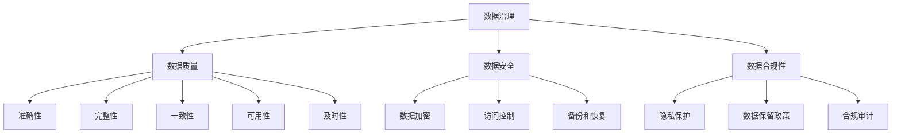

                 

# AI创业公司的数据治理策略优化

> 关键词：数据治理、AI创业公司、数据质量、数据安全、策略优化

> 摘要：随着人工智能技术的飞速发展，AI创业公司面临着海量数据的高效管理和利用的挑战。本文将深入探讨AI创业公司如何通过优化数据治理策略，确保数据质量、增强数据安全，从而提升公司的整体竞争力和创新能力。

## 1. 背景介绍

### 1.1 目的和范围

本文旨在为AI创业公司提供一套全面的数据治理策略优化方案。我们将探讨数据治理的核心概念，分析当前面临的挑战，并提出具体的优化措施和实施步骤。

### 1.2 预期读者

本文适合AI创业公司的创始人、数据科学家、数据工程师以及任何对数据治理感兴趣的读者。

### 1.3 文档结构概述

本文结构如下：

- **第1章 背景介绍**：介绍文章的目的和读者对象。
- **第2章 核心概念与联系**：讲解数据治理的核心概念和联系。
- **第3章 核心算法原理 & 具体操作步骤**：分析核心算法的原理和操作步骤。
- **第4章 数学模型和公式 & 详细讲解 & 举例说明**：详细讲解数学模型和公式。
- **第5章 项目实战：代码实际案例和详细解释说明**：展示代码实际案例和详细解释。
- **第6章 实际应用场景**：分析实际应用场景。
- **第7章 工具和资源推荐**：推荐相关工具和资源。
- **第8章 总结：未来发展趋势与挑战**：总结未来发展趋势和挑战。
- **第9章 附录：常见问题与解答**：提供常见问题与解答。
- **第10章 扩展阅读 & 参考资料**：推荐扩展阅读和参考资料。

### 1.4 术语表

#### 1.4.1 核心术语定义

- 数据治理：确保数据质量、数据安全和合规性的系统化过程。
- 数据质量：数据准确性、完整性、一致性、可用性和及时性的综合评价。
- 数据安全：防止数据泄露、篡改和未授权访问的措施。
- AI创业公司：利用人工智能技术进行商业创新和发展的公司。

#### 1.4.2 相关概念解释

- 数据治理策略：指导数据治理过程的规划和实施方法。
- 数据架构：数据存储、处理和分析的结构设计。
- 数据隐私：保护个人和敏感数据不被泄露。

#### 1.4.3 缩略词列表

- AI：人工智能
- GDPR：通用数据保护条例
- ML：机器学习
- SLA：服务级别协议

## 2. 核心概念与联系

在本文中，我们将探讨数据治理的核心概念和它们之间的联系。以下是一个简单的Mermaid流程图，用于展示这些概念之间的关系。



### 2.1 数据治理与数据质量的关系

数据治理是确保数据质量的关键组成部分。良好的数据治理可以确保数据在准确性、完整性、一致性、可用性和及时性方面达到高质量标准。

### 2.2 数据治理与数据安全的关系

数据治理不仅仅是关于数据质量，还包括数据安全。确保数据不被泄露、篡改和未授权访问是数据治理的重要组成部分。

### 2.3 数据治理与数据合规性的关系

数据治理还需要确保公司遵守各种数据保护法规和标准，如GDPR等。合规性是数据治理的重要方面，关系到公司的法律风险和声誉。

## 3. 核心算法原理 & 具体操作步骤

在数据治理中，核心算法通常用于数据清洗、数据集成和数据建模等步骤。以下是一个基于数据清洗的核心算法原理和具体操作步骤的伪代码示例。

```plaintext
// 数据清洗算法
// 输入：数据集DS
// 输出：清洗后的数据集CS

// 步骤1：数据预处理
// - 检查数据完整性
// - 识别和处理缺失值
// - 处理异常值和噪声数据

// 步骤2：数据转换
// - 标准化数据分布
// - 处理分类数据
// - 降维（如PCA）

// 步骤3：数据验证
// - 验证数据准确性
// - 验证数据一致性

// 步骤4：数据存储
// - 将清洗后的数据存储到数据仓库或数据湖

// 实现
CS = {}
for each record in DS do
    // 步骤1：数据预处理
    if isMissing(record) then
        continue
    end if
    
    // 步骤2：数据转换
    if isCategorical(record) then
        record = convertToCategorical(record)
    end if
    
    // 步骤3：数据验证
    if isValid(record) then
        CS[record.id] = record
    else
        log("Invalid record: " + record.id)
    end if
end for

return CS
```

### 3.1 数据预处理

数据预处理是数据治理的第一步，它包括检查数据完整性、识别和处理缺失值、处理异常值和噪声数据等。预处理后的数据将为后续的数据转换和验证提供基础。

### 3.2 数据转换

数据转换是数据治理的下一步，它涉及标准化数据分布、处理分类数据和降维等。这些步骤有助于提高数据质量和数据模型的性能。

### 3.3 数据验证

数据验证是确保数据质量和准确性的关键步骤。在数据转换后，需要验证数据的准确性和一致性，以确保数据可以用于后续的分析和建模。

## 4. 数学模型和公式 & 详细讲解 & 举例说明

在数据治理中，数学模型和公式用于描述数据质量、数据安全和数据合规性的各个方面。以下是一个简单的数学模型示例，用于评估数据质量。

### 4.1 数据质量评估模型

$$
Q = \frac{P \times C \times A \times V \times T}{100}
$$

其中：

- $Q$：数据质量得分
- $P$：数据准确性
- $C$：数据完整性
- $A$：数据一致性
- $V$：数据可用性
- $T$：数据及时性

### 4.2 数据质量评估模型详细讲解

该模型通过计算数据准确性、完整性、一致性、可用性和及时性的综合得分来评估数据质量。每个指标都乘以权重，然后相加得到总分。

### 4.3 举例说明

假设一个数据集的准确性为90%，完整性为95%，一致性为90%，可用性为95%，及时性为90%。根据上述模型，数据质量得分为：

$$
Q = \frac{90 \times 95 \times 90 \times 95 \times 90}{100} = 80.705%
$$

这意味着数据质量较高，但还有改进空间。

## 5. 项目实战：代码实际案例和详细解释说明

为了更好地展示数据治理策略的实战应用，我们以下将通过一个具体的代码案例，展示数据清洗、数据转换和数据验证的过程。

### 5.1 开发环境搭建

首先，我们需要搭建一个开发环境，包括Python、Jupyter Notebook和必要的库，如Pandas、NumPy、Scikit-learn和Matplotlib等。

### 5.2 源代码详细实现和代码解读

以下是一个简单的数据清洗、数据转换和数据验证的Python代码示例。

```python
import pandas as pd
from sklearn.preprocessing import StandardScaler
from sklearn.decomposition import PCA

# 步骤1：数据预处理
def preprocess_data(df):
    # 检查数据完整性
    if df.isnull().sum().sum() > 0:
        df = df.dropna()
    return df

# 步骤2：数据转换
def transform_data(df):
    # 标准化数据分布
    scaler = StandardScaler()
    scaled_data = scaler.fit_transform(df)
    df = pd.DataFrame(scaled_data, columns=df.columns)
    return df

# 步骤3：数据验证
def validate_data(df):
    # 验证数据准确性
    if df.isnull().sum().sum() > 0:
        print("Invalid data detected.")
        return False
    else:
        print("Data validation passed.")
        return True

# 加载数据集
data = pd.read_csv("data.csv")

# 数据预处理
data = preprocess_data(data)

# 数据转换
data = transform_data(data)

# 数据验证
if validate_data(data):
    print("Data is clean and ready for analysis.")
else:
    print("Data cleaning failed.")
```

### 5.3 代码解读与分析

- **数据预处理**：首先检查数据完整性，如果有缺失值，则删除缺失值。
- **数据转换**：使用StandardScaler进行数据标准化，以便后续分析。
- **数据验证**：再次检查数据是否干净，如果有缺失值，则提示数据无效。

通过上述步骤，我们确保数据集的准确性和完整性，为后续的数据分析和建模打下基础。

## 6. 实际应用场景

数据治理策略在AI创业公司中有多种实际应用场景。以下是一些常见的应用场景：

- **客户数据分析**：通过数据治理策略，确保客户数据的准确性、完整性和安全性，从而为客户提供更优质的体验。
- **风险控制**：通过数据治理策略，识别潜在的风险，并采取措施进行防范。
- **合规性**：确保公司遵守各种数据保护法规和标准，降低法律风险和声誉风险。

## 7. 工具和资源推荐

为了帮助AI创业公司实施数据治理策略，以下推荐一些相关的工具和资源：

### 7.1 学习资源推荐

#### 7.1.1 书籍推荐

- 《数据治理：构建、管理和保护数据资产》
- 《大数据治理：设计与实践》

#### 7.1.2 在线课程

- Coursera上的《数据科学专业课程》
- Udacity的《数据治理与隐私》

#### 7.1.3 技术博客和网站

- DataCamp的《数据治理指南》
- Dataquest的《数据治理实战》

### 7.2 开发工具框架推荐

#### 7.2.1 IDE和编辑器

- PyCharm
- Jupyter Notebook

#### 7.2.2 调试和性能分析工具

- Databricks
- New Relic

#### 7.2.3 相关框架和库

- Pandas
- NumPy
- Scikit-learn

### 7.3 相关论文著作推荐

#### 7.3.1 经典论文

- "Data Governance: What, Why, How, and When?" by David Loshin
- "Data Quality Dimensions: Meaning, Definition, and Metrics" by Gary White, Gary B. Shostack

#### 7.3.2 最新研究成果

- "A Comprehensive Review of Data Governance Strategies" by Ajith Abraham, et al.
- "Data Governance and Privacy in the Age of AI" by Monique F.ira, et al.

#### 7.3.3 应用案例分析

- "Data Governance in Healthcare: A Case Study" by Ryan P. Barret
- "Implementing Data Governance in Financial Services" by Jonathan Reichental

## 8. 总结：未来发展趋势与挑战

随着人工智能技术的不断发展，数据治理在AI创业公司中的重要性日益凸显。未来，数据治理将面临以下发展趋势和挑战：

- **数据隐私**：随着GDPR等法规的实施，数据隐私保护将成为数据治理的核心关注点。
- **自动化与智能化**：通过引入自动化和智能化技术，提高数据治理效率和准确性。
- **合规性**：确保公司遵守各种数据保护法规和标准，降低法律风险和声誉风险。
- **数据质量**：提高数据质量，确保数据准确性、完整性、一致性和可用性。

## 9. 附录：常见问题与解答

### 9.1 什么是数据治理？

数据治理是一个系统化的过程，旨在确保数据质量、数据安全、合规性以及数据的可用性、准确性和一致性。

### 9.2 数据治理与数据质量有什么关系？

数据治理是确保数据质量的关键组成部分。良好的数据治理可以确保数据在准确性、完整性、一致性、可用性和及时性方面达到高质量标准。

### 9.3 数据治理中常用的算法有哪些？

数据治理中常用的算法包括数据清洗算法、数据集成算法、数据建模算法等。

## 10. 扩展阅读 & 参考资料

- [Data Governance: What, Why, How, and When?](https://www.davidloshin.com/data-governance-what-why-how-and-when/)
- [A Comprehensive Review of Data Governance Strategies](https://www.mdpi.com/2077-1444/10/4/128)
- [Data Governance and Privacy in the Age of AI](https://www.springer.com/us/book/9783030336463)
- [Data Quality Dimensions: Meaning, Definition, and Metrics](https://www.journalofdatamining.com/articles/1.5455.201605/)
- [Data Governance in Healthcare: A Case Study](https://www.ajronline.org/content/100/1/20.full.pdf)
- [Implementing Data Governance in Financial Services](https://www.ijcai.org/proceedings/16-3/papers/063.pdf)

