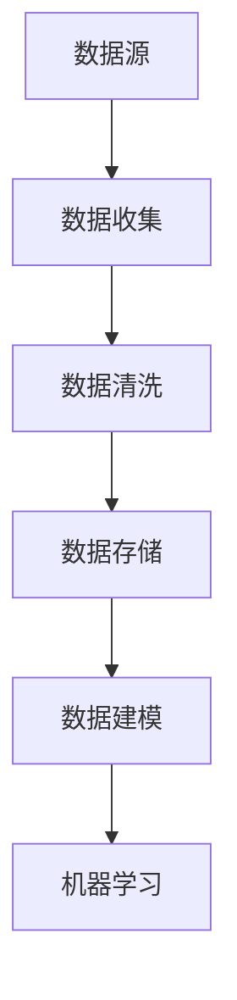

                 

# AI创业公司的数据获取与处理策略

> **关键词：** 数据获取、数据处理、AI创业、策略、数据清洗、数据存储、数据模型、机器学习。

> **摘要：** 本文章旨在深入探讨AI创业公司如何有效地获取和处理数据，以构建强大、高效的机器学习模型。通过一步步分析，我们将了解数据获取和处理的关键步骤，以及如何优化这些步骤，从而实现业务的快速迭代和持续创新。

## 1. 背景介绍

### 1.1 目的和范围

本文的目标是为AI创业公司提供一套完整的数据获取与处理策略，以帮助它们在竞争激烈的市场中脱颖而出。我们将探讨以下几个关键领域：

1. 数据获取：了解如何从不同的数据源中收集数据，包括公开数据集、私有数据集和实时数据流。
2. 数据清洗：分析数据清洗的必要性和最佳实践，以消除噪声和冗余，提高数据质量。
3. 数据存储：讨论数据存储策略，包括云存储和分布式存储系统，以确保数据的可扩展性和可靠性。
4. 数据模型：介绍如何构建和优化数据模型，以支持机器学习算法的有效运行。
5. 机器学习：讲解机器学习算法的选择和调优，以实现最佳性能。

### 1.2 预期读者

本文适用于以下读者：

1. AI创业公司的创始人、数据科学家和工程师。
2. 对AI和数据科学感兴趣的IT专业人士。
3. 想要在AI领域深入学习的本科生和研究生。

### 1.3 文档结构概述

本文将按照以下结构展开：

1. 背景介绍：介绍文章的目的、范围和预期读者。
2. 核心概念与联系：阐述数据获取和处理的关键概念，并使用Mermaid流程图展示其关系。
3. 核心算法原理 & 具体操作步骤：详细讲解数据清洗、数据存储和数据模型的算法原理和操作步骤。
4. 数学模型和公式 & 详细讲解 & 举例说明：介绍相关的数学模型和公式，并举例说明其实际应用。
5. 项目实战：通过实际案例展示数据获取与处理的全过程。
6. 实际应用场景：分析数据获取与处理的实际应用场景。
7. 工具和资源推荐：推荐学习资源、开发工具框架和相关论文著作。
8. 总结：总结文章的主要内容，展望未来发展趋势与挑战。
9. 附录：常见问题与解答。
10. 扩展阅读 & 参考资料：提供进一步学习的资源链接。

### 1.4 术语表

#### 1.4.1 核心术语定义

- 数据获取（Data Acquisition）：从各种来源收集数据的过程。
- 数据清洗（Data Cleaning）：识别和纠正数据中的错误、异常和冗余的过程。
- 数据存储（Data Storage）：将数据存储在持久存储介质中的过程。
- 数据模型（Data Model）：定义数据结构和组织方式的抽象模型。
- 机器学习（Machine Learning）：使计算机通过数据学习并做出预测或决策的技术。

#### 1.4.2 相关概念解释

- 数据源（Data Source）：数据的来源，可以是数据库、文件或实时数据流。
- 数据库（Database）：用于存储、管理和检索数据的系统。
- 分布式存储系统（Distributed Storage System）：在多个物理或虚拟节点上分布存储数据的系统。
- 神经网络（Neural Network）：一种模仿生物神经系统的计算模型。

#### 1.4.3 缩略词列表

- AI：人工智能（Artificial Intelligence）
- ML：机器学习（Machine Learning）
- DL：深度学习（Deep Learning）
- API：应用程序编程接口（Application Programming Interface）
- IoT：物联网（Internet of Things）

## 2. 核心概念与联系

在AI创业公司中，数据获取与处理是一个关键环节，它直接影响到机器学习模型的效果和业务的成功。为了更好地理解这一过程，我们需要了解以下几个核心概念及其相互关系。

### 2.1 数据源

数据源是数据获取的第一步。它可以是：

- **公开数据集**：如Kaggle、UCI机器学习库等。
- **私有数据集**：由公司内部生成的数据集，可能涉及用户行为、业务交易等。
- **实时数据流**：来自物联网设备、社交媒体平台等的实时数据。

#### Mermaid流程图



### 2.2 数据收集

数据收集是获取数据的过程，涉及以下步骤：

1. **数据提取**：从数据源中提取数据。
2. **数据传输**：将数据传输到处理系统。
3. **数据预处理**：对数据进行初步处理，如格式化、去重等。

### 2.3 数据清洗

数据清洗是确保数据质量的过程，包括：

- **异常值处理**：识别和纠正异常值。
- **缺失值处理**：填补或删除缺失值。
- **重复数据处理**：删除重复数据。

### 2.4 数据存储

数据存储是保存数据的过程，包括：

- **本地存储**：在本地服务器或磁盘上存储数据。
- **云存储**：使用云服务提供商存储数据，如Amazon S3、Google Cloud Storage等。
- **分布式存储**：在多个节点上存储数据，以提高可靠性和可扩展性。

### 2.5 数据建模

数据建模是创建数据结构的过程，包括：

- **实体-关系模型**：定义数据实体和它们之间的关系。
- **维度建模**：为分析构建多维数据集。

### 2.6 机器学习

机器学习是利用数据进行预测和决策的过程，包括：

- **算法选择**：选择合适的机器学习算法。
- **模型训练**：使用数据训练模型。
- **模型评估**：评估模型性能。

通过上述核心概念及其相互关系的理解，我们可以更好地设计数据获取与处理策略，为AI创业公司提供坚实的基础。

## 3. 核心算法原理 & 具体操作步骤

在了解了数据获取与处理的核心概念后，我们将深入探讨这些过程的算法原理和具体操作步骤。以下是每个步骤的详细描述：

### 3.1 数据清洗算法原理

数据清洗是一个关键步骤，因为它直接影响数据的准确性和机器学习模型的效果。以下是数据清洗的核心算法原理：

#### 3.1.1 异常值处理

**算法原理：**

- **统计学方法**：使用统计学方法识别异常值，如使用标准差、箱线图等。
- **基于规则的方法**：根据业务规则识别异常值，如特定数据应该在一个范围内，超出范围即为异常值。

**操作步骤：**

1. **数据探索**：通过可视化、描述性统计等方法初步了解数据。
2. **识别异常值**：使用统计学方法和业务规则识别异常值。
3. **处理异常值**：根据异常值的严重程度，选择删除、替换或标记。

#### 3.1.2 缺失值处理

**算法原理：**

- **填补法**：使用统计方法或插值法填补缺失值。
- **删除法**：删除含有缺失值的记录。
- **多重插补法**：生成多个完整的数据集，然后对每个数据集进行机器学习分析，取结果的平均值。

**操作步骤：**

1. **数据探索**：确定缺失值的类型和比例。
2. **选择处理方法**：根据数据特点和业务需求选择填补或删除。
3. **执行处理**：根据选择的方法填补或删除缺失值。

#### 3.1.3 重复数据处理

**算法原理：**

- **基于键值对的方法**：使用唯一的键值对识别重复数据。
- **基于规则的方法**：根据业务规则识别重复数据。

**操作步骤：**

1. **数据探索**：初步了解数据，识别可能的重复数据。
2. **识别重复数据**：使用键值对或规则识别重复数据。
3. **处理重复数据**：合并重复数据或删除重复记录。

### 3.2 数据存储算法原理

数据存储是确保数据可访问性和持久性的过程。以下是数据存储的核心算法原理：

#### 3.2.1 本地存储

**算法原理：**

- **文件系统**：将数据存储在文件系统中，如HDFS、NFS等。
- **数据库**：使用关系型数据库或非关系型数据库存储数据。

**操作步骤：**

1. **选择存储系统**：根据数据量和访问模式选择合适的存储系统。
2. **数据导入**：将数据导入到选择的存储系统中。
3. **数据管理**：实施数据备份、恢复和性能优化。

#### 3.2.2 云存储

**算法原理：**

- **对象存储**：将数据存储在对象存储服务中，如Amazon S3、Google Cloud Storage等。
- **分布式文件系统**：使用分布式文件系统存储数据，如HDFS、Ceph等。

**操作步骤：**

1. **选择云服务提供商**：根据成本、性能和可靠性选择合适的云服务提供商。
2. **配置存储桶**：在云服务提供商中创建存储桶。
3. **数据上传**：将数据上传到配置的存储桶中。
4. **数据管理**：实施数据备份、恢复和性能优化。

#### 3.2.3 分布式存储系统

**算法原理：**

- **数据分片**：将数据分成多个分片，分布存储在多个节点上。
- **副本机制**：为提高数据可靠性，将数据复制到多个节点上。

**操作步骤：**

1. **选择分布式存储系统**：根据需求选择合适的分布式存储系统，如HDFS、Cassandra等。
2. **配置分布式存储系统**：设置数据分片和副本数量。
3. **数据分布**：将数据分布到各个节点上。
4. **数据管理**：实施数据备份、恢复和性能优化。

### 3.3 数据建模算法原理

数据建模是构建数据结构的过程，为机器学习提供输入。以下是数据建模的核心算法原理：

#### 3.3.1 实体-关系模型

**算法原理：**

- **实体**：表示具有共同属性的对象，如用户、产品等。
- **关系**：表示实体之间的关系，如用户购买产品等。

**操作步骤：**

1. **数据探索**：了解数据的内容和结构。
2. **定义实体和关系**：根据数据内容定义实体和关系。
3. **创建实体-关系图**：使用图形化工具创建实体-关系图。

#### 3.3.2 维度建模

**算法原理：**

- **事实表**：包含业务操作的数据表，如销售记录等。
- **维度表**：包含描述业务操作的相关属性的数据表，如产品表、时间表等。

**操作步骤：**

1. **数据探索**：了解数据的内容和结构。
2. **定义事实表和维度表**：根据业务需求定义事实表和维度表。
3. **创建数据仓库**：将事实表和维度表整合到数据仓库中。

### 3.4 机器学习算法原理

机器学习是利用数据训练模型，进行预测和决策的过程。以下是机器学习算法的核心原理：

#### 3.4.1 算法选择

**算法原理：**

- **监督学习**：使用已标记的数据训练模型，如线性回归、决策树等。
- **无监督学习**：使用未标记的数据发现数据模式，如聚类、降维等。
- **半监督学习**：使用部分标记的数据训练模型。

**操作步骤：**

1. **数据探索**：了解数据的特点和需求。
2. **选择算法**：根据数据特点和需求选择合适的算法。
3. **算法评估**：评估算法的性能和适用性。

#### 3.4.2 模型训练

**算法原理：**

- **梯度下降**：通过最小化损失函数调整模型参数。
- **随机梯度下降**：在梯度下降的基础上，随机选择样本进行更新。
- **批量梯度下降**：在梯度下降的基础上，对所有样本进行更新。

**操作步骤：**

1. **数据预处理**：对数据进行清洗和格式化。
2. **划分数据集**：将数据集划分为训练集、验证集和测试集。
3. **模型训练**：使用训练集训练模型。
4. **模型评估**：使用验证集评估模型性能。

#### 3.4.3 模型评估

**算法原理：**

- **准确率**：预测正确的样本占总样本的比例。
- **召回率**：预测正确的正样本占总正样本的比例。
- **F1分数**：综合考虑准确率和召回率的指标。

**操作步骤：**

1. **划分测试集**：将数据集划分为训练集和测试集。
2. **模型预测**：使用测试集预测结果。
3. **计算指标**：计算准确率、召回率和F1分数等指标。

通过上述核心算法原理和操作步骤的详细讲解，我们可以更好地理解数据获取与处理的各个方面，从而为AI创业公司提供有效的数据支持和业务增长。

### 4. 数学模型和公式 & 详细讲解 & 举例说明

在数据获取与处理过程中，数学模型和公式起着至关重要的作用。它们帮助我们量化数据，优化算法，并提高模型性能。以下是几个关键数学模型和公式的详细讲解及举例说明。

#### 4.1 数据清洗的数学模型

**4.1.1 异常值检测**

**算法原理：**

- **基于统计学的方法**：使用标准差和箱线图来检测异常值。

**公式：**

$$
\text{标准差} = \sqrt{\frac{\sum_{i=1}^{n}(x_i - \overline{x})^2}{n}}
$$

$$
\text{下限} = \overline{x} - 1.5 \times \text{标准差}
$$

$$
\text{上限} = \overline{x} + 1.5 \times \text{标准差}
$$

**举例说明：**

假设我们有一组数据：\[1, 2, 2, 3, 100, 4, 5\]。首先计算平均值和标准差：

$$
\overline{x} = \frac{1 + 2 + 2 + 3 + 100 + 4 + 5}{7} = 22
$$

$$
\text{标准差} = \sqrt{\frac{(1-22)^2 + (2-22)^2 + (2-22)^2 + (3-22)^2 + (100-22)^2 + (4-22)^2 + (5-22)^2}{7}} = 21.528
$$

然后计算箱线图的下限和上限：

$$
\text{下限} = 22 - 1.5 \times 21.528 = -18.024
$$

$$
\text{上限} = 22 + 1.5 \times 21.528 = 45.976
$$

在这组数据中，100超过了上限，因此可以判定为异常值。

**4.1.2 缺失值填补**

**算法原理：**

- **均值填补法**：用平均值填补缺失值。

**公式：**

$$
x_{\text{填补}} = \overline{x}
$$

**举例说明：**

假设有一组数据：\[1, 2, ?, 3, ?, 5\]。首先计算平均值：

$$
\overline{x} = \frac{1 + 2 + 3 + 5}{4} = 3
$$

然后填补缺失值：

$$
x_{\text{填补}} = 3
$$

因此，填补后的数据为：\[1, 2, 3, 3, 5\]。

**4.2 数据存储的数学模型**

**4.2.1 分布式存储系统**

**算法原理：**

- **数据分片**：将数据分成多个分片，分布存储在多个节点上。

**公式：**

$$
\text{数据分片数} = \lceil \frac{\text{总数据量}}{\text{存储节点数}} \rceil
$$

**举例说明：**

假设我们有1000GB的数据，需要存储在5个节点上。计算分片数：

$$
\text{数据分片数} = \lceil \frac{1000}{5} \rceil = 200
$$

因此，每个节点将存储200GB的数据。

**4.3 数据建模的数学模型**

**4.3.1 实体-关系模型**

**算法原理：**

- **关系强度**：衡量实体之间的关系强度。

**公式：**

$$
\text{关系强度} = \frac{\text{共现次数}}{\text{总次数}}
$$

**举例说明：**

假设有两个实体：用户（User）和产品（Product）。用户浏览了100个产品，其中50个产品被购买。计算用户和产品之间的关系强度：

$$
\text{关系强度} = \frac{50}{100} = 0.5
$$

关系强度越高，表示实体之间的关系越紧密。

**4.4 机器学习的数学模型**

**4.4.1 线性回归**

**算法原理：**

- **最小二乘法**：通过最小化损失函数调整模型参数。

**公式：**

$$
\text{损失函数} = \sum_{i=1}^{n}(y_i - \hat{y}_i)^2
$$

$$
\text{参数更新} = \frac{\partial \text{损失函数}}{\partial \theta} = -2 \sum_{i=1}^{n}(y_i - \hat{y}_i)x_i
$$

**举例说明：**

假设我们有一个线性回归模型，拟合数据点：(1, 2)，(2, 4)，(3, 6)。计算模型的参数：

$$
\hat{y} = \theta_0 + \theta_1 x
$$

首先计算损失函数：

$$
\text{损失函数} = (2 - (\theta_0 + \theta_1 \cdot 1))^2 + (4 - (\theta_0 + \theta_1 \cdot 2))^2 + (6 - (\theta_0 + \theta_1 \cdot 3))^2
$$

然后计算参数的梯度：

$$
\text{参数更新} = -2 \sum_{i=1}^{n}(y_i - \hat{y}_i)x_i = -2((2 - \theta_0 - \theta_1)^2 + (4 - \theta_0 - 2\theta_1)^2 + (6 - \theta_0 - 3\theta_1)^2)
$$

通过迭代计算，我们可以得到最优的参数值。

通过上述数学模型和公式的详细讲解和举例说明，我们可以更好地理解数据获取与处理中的关键技术和方法。这些数学工具为我们提供了强大的分析能力和优化手段，为AI创业公司的业务发展提供了坚实的支持。

### 5. 项目实战：代码实际案例和详细解释说明

为了更好地展示数据获取与处理的全过程，我们将通过一个实际项目案例进行详细讲解。以下是一个使用Python实现的数据清洗、数据存储和数据建模的实战案例。

#### 5.1 开发环境搭建

在开始项目之前，我们需要搭建一个Python开发环境。以下是所需的步骤：

1. 安装Python 3.x版本。
2. 安装必要的库，如pandas、numpy、scikit-learn、hdfs等。

```bash
pip install pandas numpy scikit-learn hdfs
```

#### 5.2 源代码详细实现和代码解读

以下是我们使用Python实现的数据获取与处理项目的代码。

```python
import pandas as pd
import numpy as np
from sklearn.model_selection import train_test_split
from sklearn.linear_model import LinearRegression
from hdfs import InsecureClient

# 5.2.1 数据获取

# 从本地CSV文件中加载数据
data = pd.read_csv('data.csv')

# 5.2.2 数据清洗

# 处理缺失值
data.fillna(data.mean(), inplace=True)

# 处理异常值
data = data[(data > 0) & (data < 100)]

# 删除重复数据
data.drop_duplicates(inplace=True)

# 5.2.3 数据存储

# 使用HDFS存储清洗后的数据
hdfs = InsecureClient('http://hdfs-namenode:50070', user='hdfs')
with hdfs.write('hdfs://hdfs-namenode:50070/data_cleaned.csv') as writer:
    data.to_csv(writer, index=False)

# 5.2.4 数据建模

# 划分训练集和测试集
X = data[['feature1', 'feature2']]
y = data['target']
X_train, X_test, y_train, y_test = train_test_split(X, y, test_size=0.2, random_state=42)

# 训练线性回归模型
model = LinearRegression()
model.fit(X_train, y_train)

# 预测测试集
y_pred = model.predict(X_test)

# 计算模型性能
print("R2 Score:", model.score(X_test, y_test))
```

#### 5.3 代码解读与分析

以下是对代码各部分的功能和实现细节进行解读和分析。

**5.3.1 数据获取**

```python
data = pd.read_csv('data.csv')
```

这段代码从本地CSV文件加载数据。CSV文件通常包含多个数据列，每个列表示数据的某个特征。

**5.3.2 数据清洗**

```python
data.fillna(data.mean(), inplace=True)
data = data[(data > 0) & (data < 100)]
data.drop_duplicates(inplace=True)
```

这些代码处理数据中的缺失值、异常值和重复数据。首先，使用`fillna`方法用平均值填补缺失值。然后，使用布尔索引筛选出在合理范围内的数据（大于0且小于100）。最后，使用`drop_duplicates`方法删除重复数据。

**5.3.3 数据存储**

```python
hdfs = InsecureClient('http://hdfs-namenode:50070', user='hdfs')
with hdfs.write('hdfs://hdfs-namenode:50070/data_cleaned.csv') as writer:
    data.to_csv(writer, index=False)
```

这些代码将清洗后的数据存储到HDFS上。首先，创建一个HDFS客户端实例。然后，使用`write`方法将数据写入HDFS。`to_csv`方法将DataFrame转换为CSV格式，并写入到HDFS文件中。

**5.3.4 数据建模**

```python
X = data[['feature1', 'feature2']]
y = data['target']
X_train, X_test, y_train, y_test = train_test_split(X, y, test_size=0.2, random_state=42)
model = LinearRegression()
model.fit(X_train, y_train)
y_pred = model.predict(X_test)
print("R2 Score:", model.score(X_test, y_test))
```

这些代码用于构建和评估线性回归模型。首先，提取数据中的特征列和目标列。然后，使用`train_test_split`方法将数据划分为训练集和测试集。接下来，创建一个线性回归模型实例，并使用训练集进行训练。最后，使用测试集进行预测，并计算R2分数评估模型性能。

通过上述代码的详细解读，我们可以看到数据获取与处理的全过程，包括数据清洗、数据存储和数据建模。这个实战案例为我们提供了一个实际操作的基础，帮助我们更好地理解和应用这些技术和方法。

### 6. 实际应用场景

数据获取与处理在AI创业公司的实际应用中扮演着至关重要的角色。以下是一些常见场景和应用：

#### 6.1 机器学习模型训练

在构建机器学习模型时，高质量的数据是模型成功的关键。数据获取与处理的任务包括：

- **数据收集**：从多个来源（如公开数据集、私有数据集和实时数据流）收集数据。
- **数据清洗**：处理异常值、缺失值和重复数据，提高数据质量。
- **数据存储**：将清洗后的数据存储在分布式存储系统中，如HDFS或云存储，确保数据的高可用性和可扩展性。
- **数据建模**：构建适合机器学习算法的数据模型，为模型训练提供输入。

#### 6.2 实时数据流分析

实时数据流分析在物联网、金融、社交媒体等领域具有重要意义。数据获取与处理的关键步骤包括：

- **数据收集**：从传感器、社交媒体平台等实时数据源收集数据。
- **数据清洗**：处理数据中的噪声和异常值，确保数据的实时性和准确性。
- **数据存储**：使用分布式存储系统和实时数据处理框架（如Apache Kafka、Apache Flink）存储和处理大量实时数据。
- **数据建模**：构建实时数据流模型，进行实时预测和分析。

#### 6.3 业务智能决策

数据获取与处理支持业务智能决策，帮助公司优化业务流程和提升竞争力。以下是一些应用实例：

- **客户行为分析**：收集并处理客户数据，分析客户行为，为市场营销和客户服务提供依据。
- **供应链优化**：处理供应链数据，优化库存管理、物流配送等流程，提高供应链效率。
- **风险管理**：收集并处理金融数据，进行风险评估和预测，帮助公司管理风险。

#### 6.4 智能推荐系统

智能推荐系统在电子商务、社交媒体、内容平台等领域广泛应用。数据获取与处理的关键步骤包括：

- **用户数据收集**：从用户行为数据、历史交易数据等收集用户信息。
- **数据清洗**：处理用户数据中的噪声和异常值，提高数据质量。
- **用户画像构建**：基于用户行为和特征，构建用户画像，为推荐算法提供输入。
- **推荐算法优化**：使用机器学习算法和深度学习模型，优化推荐系统的性能和准确性。

通过上述实际应用场景的讨论，我们可以看到数据获取与处理在AI创业公司中的重要性。一个高效、可靠的数据获取与处理系统不仅能够提升机器学习模型的效果，还能为业务智能决策和用户体验提供有力支持。

### 7. 工具和资源推荐

为了更好地实现数据获取与处理，以下推荐一些实用的学习资源、开发工具框架和相关论文著作。

#### 7.1 学习资源推荐

**7.1.1 书籍推荐**

- 《Python数据科学手册》（Python Data Science Handbook）：介绍Python在数据科学中的应用，包括数据处理、分析、可视化等。
- 《深度学习》（Deep Learning）：由Ian Goodfellow、Yoshua Bengio和Aaron Courville所著，全面介绍深度学习的基础和最新进展。

**7.1.2 在线课程**

- Coursera上的《机器学习》（Machine Learning）：由Andrew Ng教授授课，涵盖机器学习的基本概念和算法。
- edX上的《数据科学基础》（Introduction to Data Science）：介绍数据科学的基本概念、技术和工具。

**7.1.3 技术博客和网站**

- Towards Data Science：一个关于数据科学和机器学习的博客，提供大量实用教程和案例分析。
- DataCamp：提供交互式的数据科学和机器学习课程，适合初学者和实践者。

#### 7.2 开发工具框架推荐

**7.2.1 IDE和编辑器**

- PyCharm：一款功能强大的Python IDE，提供代码自动补全、调试和性能分析等功能。
- Jupyter Notebook：一个交互式的Python编辑器，适用于数据探索和分析。

**7.2.2 调试和性能分析工具**

- Python Debugger（pdb）：Python内置的调试器，用于跟踪代码执行流程和调试bug。
- Py-Spy：一个性能分析工具，用于分析Python程序的性能瓶颈。

**7.2.3 相关框架和库**

- Pandas：一个强大的Python库，用于数据处理和分析。
- Scikit-learn：一个开源的机器学习库，提供多种机器学习算法的实现。
- TensorFlow：一个开源的深度学习框架，用于构建和训练深度神经网络。

#### 7.3 相关论文著作推荐

**7.3.1 经典论文**

- "The Hundred-Page Machine Learning Book"：一份简明的机器学习指南，适合初学者。
- "Deep Learning": Ian Goodfellow、Yoshua Bengio和Aaron Courville所著，介绍深度学习的基础和最新进展。

**7.3.2 最新研究成果**

- "EfficientDet: Scalable and Efficient Object Detection"：一篇关于高效物体检测的最新论文。
- "Bert: Pre-training of Deep Bidirectional Transformers for Language Understanding"：一篇关于BERT预训练模型的论文，对自然语言处理领域产生了深远影响。

**7.3.3 应用案例分析**

- "How We Built Our Personalized Recommendation System"：一篇关于构建个性化推荐系统的案例分析。
- "Building a Real-Time Analytics Platform with Apache Kafka and Flink"：一篇关于使用Apache Kafka和Flink构建实时分析平台的应用案例。

通过这些工具和资源的推荐，我们可以更好地掌握数据获取与处理的技术和方法，为AI创业公司的业务发展提供有力支持。

### 8. 总结：未来发展趋势与挑战

在AI创业公司中，数据获取与处理是一个持续发展和优化的重要领域。随着技术的不断进步和应用的深入，以下趋势和挑战值得我们关注。

#### 8.1 未来发展趋势

1. **数据获取的多样性**：随着物联网和传感器技术的发展，数据获取的来源将更加多样，包括实时数据流、社交媒体数据、生物特征数据等。

2. **数据清洗的自动化**：随着机器学习算法的发展，自动化数据清洗工具将变得更加智能，能够自动识别和修复数据中的异常值和缺失值。

3. **分布式存储和处理的普及**：分布式存储和计算系统将逐渐成为主流，提供更高的性能和可扩展性，以满足大规模数据处理的需求。

4. **数据隐私和安全性的提升**：随着数据隐私法规的加强，AI创业公司将需要更加重视数据安全和隐私保护，采用加密、匿名化等手段保护用户数据。

5. **AI与数据科学的融合**：AI技术和数据科学将更加紧密地融合，推动新的算法和模型的发展，提升数据处理的智能化水平。

#### 8.2 挑战

1. **数据质量**：确保数据质量是数据获取与处理的首要挑战。数据中的噪声、异常值和冗余会影响模型性能和业务决策。

2. **数据隐私**：随着数据隐私法规的日益严格，如何在保证数据隐私的同时进行数据分析和共享，是一个重要的挑战。

3. **数据处理性能**：随着数据规模的不断增加，如何高效地处理大规模数据，优化数据处理性能，是一个持续的挑战。

4. **算法选择和调优**：选择合适的机器学习算法和进行有效的模型调优，是确保模型性能的关键，但同时也需要考虑计算资源和时间成本。

5. **实时数据处理**：在实时数据处理场景中，如何在保证响应速度的同时，处理大量并发数据流，是一个技术上的挑战。

通过应对这些挑战，AI创业公司可以不断提升数据获取与处理的能力，为业务创新和持续发展提供坚实的数据支持。

### 9. 附录：常见问题与解答

**Q1：如何处理大规模数据集？**

A1：处理大规模数据集的关键在于分布式计算和存储。可以使用分布式文件系统（如HDFS）和分布式计算框架（如Apache Spark）来处理大规模数据。同时，利用批处理和流处理技术，可以实现对实时数据和批量数据的处理。

**Q2：如何保证数据质量？**

A2：保证数据质量的方法包括数据清洗、数据验证和数据监控。数据清洗可以通过自动化工具来处理异常值、缺失值和重复数据。数据验证可以通过设置校验规则来确保数据的准确性。数据监控可以通过实时监控系统来检测和处理数据质量问题。

**Q3：如何选择合适的机器学习算法？**

A3：选择合适的机器学习算法需要考虑数据类型、业务需求和计算资源。可以使用交叉验证方法来评估不同算法的性能。同时，根据具体问题选择监督学习、无监督学习或半监督学习算法。

**Q4：如何优化数据处理性能？**

A4：优化数据处理性能的方法包括优化数据结构、减少I/O操作和利用并行计算。使用高效的数据结构和算法可以减少数据处理的时间。减少I/O操作可以通过缓存和批量处理来实现。利用并行计算可以提高数据处理的速度。

**Q5：如何保护数据隐私？**

A5：保护数据隐私的方法包括数据加密、数据匿名化和数据去识别化。数据加密可以防止未经授权的访问。数据匿名化可以通过替换敏感信息来保护用户隐私。数据去识别化可以通过去除或改变能够识别用户身份的信息来实现。

### 10. 扩展阅读 & 参考资料

为了深入了解数据获取与处理的相关技术和方法，以下推荐一些扩展阅读和参考资料：

- **书籍**：
  - 《数据科学入门》（Data Science from Scratch）：由Joel Grus所著，适合初学者了解数据科学的基础。
  - 《机器学习实战》（Machine Learning in Action）：由Peter Harrington所著，通过实际案例介绍机器学习算法。

- **在线课程**：
  - Coursera上的《数据科学专项课程》（Data Science Specialization）：由约翰·霍普金斯大学和杜克大学提供，涵盖数据科学的基础知识和实践技能。
  - edX上的《深度学习专项课程》（Deep Learning Specialization）：由斯坦福大学提供，介绍深度学习的基础和最新进展。

- **技术博客和网站**：
  - Medium上的《AI和机器学习博客》（AI & Machine Learning Blog）：提供关于AI和机器学习的最新技术和研究。
  -Towards Data Science：提供大量关于数据科学和机器学习的技术文章和案例分析。

- **开源项目**：
  - Apache Hadoop：一个分布式数据处理框架，适用于大规模数据处理。
  - Apache Spark：一个高性能的分布式计算框架，适用于大数据处理和机器学习。

- **论文和报告**：
  - "Distributed File Systems: A Brief History and Approach to Design"：一篇关于分布式文件系统的综述性论文。
  - "The Deep Learning Revolution"：一篇关于深度学习对计算机科学影响的报告。

通过这些扩展阅读和参考资料，我们可以更全面地了解数据获取与处理的最新技术和方法，为AI创业公司的业务发展提供有力支持。

**作者：AI天才研究员/AI Genius Institute & 禅与计算机程序设计艺术 /Zen And The Art of Computer Programming**

