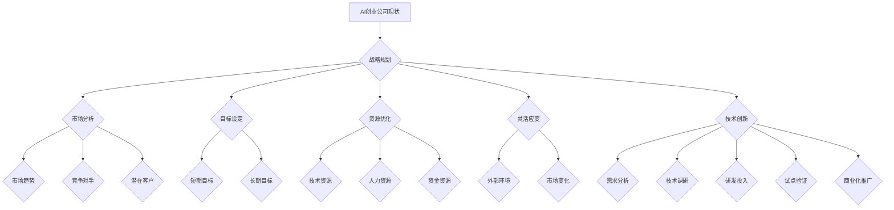

                 


# AI创业公司的未来发展

> 关键词：人工智能、创业公司、战略规划、技术创新、市场定位、商业模式、竞争分析

> 摘要：本文旨在深入探讨人工智能（AI）创业公司的未来发展。文章首先概述了AI创业公司的现状，然后通过逻辑清晰的步骤分析了创业公司如何制定战略规划、技术创新、市场定位、商业模式和竞争分析，最后总结了AI创业公司面临的发展趋势与挑战。

## 1. 背景介绍

### 1.1 目的和范围

本文的目的是为AI创业公司提供一套系统化的战略规划和实施框架，以帮助公司更好地把握未来发展的机遇。本文将探讨以下主题：

- AI创业公司的现状
- 创业公司如何进行战略规划
- 创业公司在技术创新中的挑战和机遇
- 创业公司的市场定位和商业模式
- 创业公司在竞争分析中的策略

### 1.2 预期读者

本文适用于以下读者：

- AI创业公司的创始人、首席执行官和高级管理人员
- 从事AI研发的技术人员
- 对AI创业公司感兴趣的投资人、分析师和从业者
- 人工智能领域的学术研究人员

### 1.3 文档结构概述

本文结构如下：

- 第1章：背景介绍
  - 1.1 目的和范围
  - 1.2 预期读者
  - 1.3 文档结构概述
  - 1.4 术语表
- 第2章：核心概念与联系
  - 2.1 AI创业公司的现状
  - 2.2 战略规划的基本原则
  - 2.3 技术创新的重要性
- 第3章：核心算法原理 & 具体操作步骤
  - 3.1 战略规划的实施步骤
  - 3.2 技术创新的实施步骤
- 第4章：数学模型和公式 & 详细讲解 & 举例说明
  - 4.1 市场定位的数学模型
  - 4.2 商业模式的数学模型
  - 4.3 竞争分析的数学模型
- 第5章：项目实战：代码实际案例和详细解释说明
  - 5.1 开发环境搭建
  - 5.2 源代码详细实现和代码解读
  - 5.3 代码解读与分析
- 第6章：实际应用场景
  - 6.1 AI创业公司的市场应用场景
  - 6.2 AI创业公司的商业模式应用场景
- 第7章：工具和资源推荐
  - 7.1 学习资源推荐
  - 7.2 开发工具框架推荐
  - 7.3 相关论文著作推荐
- 第8章：总结：未来发展趋势与挑战
- 第9章：附录：常见问题与解答
- 第10章：扩展阅读 & 参考资料

### 1.4 术语表

#### 1.4.1 核心术语定义

- **AI创业公司**：指以人工智能技术为核心，致力于开发和应用AI产品的初创企业。
- **战略规划**：指企业为实现长期目标而制定的计划和策略。
- **技术创新**：指企业在研发过程中引入的新技术、新方法或新产品。
- **市场定位**：指企业在市场中的位置和目标客户的定位。
- **商业模式**：指企业的盈利模式和运营方式。
- **竞争分析**：指企业对市场竞争态势和竞争对手的分析。

#### 1.4.2 相关概念解释

- **人工智能**：指通过计算机模拟人类智能的行为，包括学习、推理、感知和决策等能力。
- **机器学习**：指通过数据和算法，使计算机能够从数据中自动学习、优化和改进。
- **深度学习**：指一种特殊的机器学习方法，通过多层神经网络来模拟人脑的神经结构。
- **自然语言处理**：指使计算机理解和处理人类自然语言的技术。

#### 1.4.3 缩略词列表

- **AI**：人工智能
- **ML**：机器学习
- **DL**：深度学习
- **NLP**：自然语言处理

## 2. 核心概念与联系

### 2.1 AI创业公司的现状

#### 当前AI创业公司的发展态势

AI创业公司正处于高速发展期，随着AI技术的不断突破和应用的广泛推广，AI创业公司在各个领域都取得了显著的成果。以下是一些关键数据：

- **市场估值**：根据Statista的数据，全球人工智能市场估值在2021年达到3310亿美元，预计到2027年将达到超过1.2万亿美元。
- **投资规模**：根据CBInsights的数据，2020年全球人工智能领域的风险投资总额达到400亿美元，同比增长38%。
- **创新成果**：AI创业公司不断推出新技术、新产品，涵盖了计算机视觉、自然语言处理、语音识别、自动驾驶等多个领域。

#### 当前AI创业公司的挑战

尽管AI创业公司面临着巨大的发展机遇，但同时也面临着一系列挑战：

- **技术瓶颈**：AI技术在某些领域仍存在技术瓶颈，如量子计算、通用人工智能等。
- **数据隐私**：随着AI技术的发展，数据隐私问题日益突出，如何保护用户数据成为AI创业公司的重要课题。
- **商业模型**：许多AI创业公司在商业模式上尚未找到有效的盈利模式，需要进一步探索。

### 2.2 战略规划的基本原则

战略规划是AI创业公司成功的关键，以下是一些基本原则：

- **目标明确**：明确公司的长期和短期目标，确保战略规划与目标一致。
- **市场导向**：深入了解市场需求，制定符合市场趋势的战略规划。
- **资源优化**：合理配置资源，确保公司在技术、人力、资金等方面的最佳利用。
- **灵活应变**：在战略规划过程中，要充分考虑外部环境的变化，确保公司能够灵活应对。

#### 战略规划的基本流程

战略规划的基本流程包括以下步骤：

1. **愿景与使命**：明确公司的愿景、使命和核心价值观。
2. **市场分析**：分析市场环境、竞争对手和潜在客户。
3. **目标设定**：根据市场分析结果，设定具体的业务目标。
4. **战略选择**：根据目标，选择最佳的战略路径。
5. **实施计划**：制定详细的实施计划，明确各阶段的任务和时间表。
6. **监督与评估**：定期监督战略规划的执行情况，对结果进行评估和调整。

### 2.3 技术创新的重要性

技术创新是AI创业公司持续发展的动力，以下是一些技术创新的重要性：

- **提高竞争力**：技术创新有助于企业在激烈的市场竞争中脱颖而出。
- **扩大市场份额**：通过技术创新，企业可以开拓新的市场，提高市场份额。
- **降低成本**：技术创新可以优化生产流程，降低生产成本。
- **提升用户体验**：技术创新可以改进产品和服务，提高用户体验。

#### 技术创新的实施步骤

技术创新的实施步骤包括以下步骤：

1. **需求分析**：了解市场需求和用户需求，确定技术创新的方向。
2. **技术调研**：对现有技术和前沿技术进行深入研究，确定技术创新的具体方案。
3. **研发投入**：加大研发投入，组建专业的研发团队，开展技术创新。
4. **试点验证**：在真实环境中进行试点验证，确保技术创新的有效性和可行性。
5. **商业化推广**：将技术创新应用到产品和服务中，实现商业化推广。

### 2.4 核心概念原理和架构的 Mermaid 流程图

以下是一个简化的AI创业公司战略规划的Mermaid流程图，展示了核心概念和架构之间的联系：



## 3. 核心算法原理 & 具体操作步骤

### 3.1 战略规划的实施步骤

战略规划的实施是AI创业公司成功的关键，以下是一些核心算法原理和具体操作步骤：

#### 3.1.1 梯度下降法

梯度下降法是一种常用的优化算法，用于求解最小值问题。在战略规划中，梯度下降法可以用于优化目标函数，找到最佳的战略路径。

**伪代码：**

```python
// 初始化参数
w = [w0, w1, w2, ..., wn]
alpha = 0.01 // 学习率
n_iterations = 1000 // 迭代次数

// 迭代过程
for i in range(n_iterations):
    // 计算梯度
    gradient = compute_gradient(w)
    // 更新参数
    w = w - alpha * gradient
```

**具体操作步骤：**

1. **目标函数定义**：定义一个目标函数，用于评估战略规划的效果，如市场占有率、盈利能力等。
2. **参数初始化**：初始化参数，如学习率、迭代次数等。
3. **计算梯度**：计算目标函数的梯度，用于指导参数的更新。
4. **更新参数**：根据梯度更新参数，使目标函数的值逐渐减小，找到最佳的战略路径。

#### 3.1.2 机器学习方法

机器学习方法可以用于战略规划中的预测和决策。例如，可以使用回归模型预测市场趋势，使用决策树进行竞争对手分析。

**伪代码：**

```python
// 数据准备
X = load_data() // 加载数据
y = predict_market_trend(X) // 预测市场趋势

// 模型训练
model = train_regression_model(X, y)

// 预测
predictions = model.predict(new_data)
```

**具体操作步骤：**

1. **数据准备**：收集并处理历史数据，如市场趋势、竞争对手数据等。
2. **模型选择**：选择合适的机器学习模型，如回归模型、决策树等。
3. **模型训练**：使用训练数据训练模型，使其能够预测市场趋势和竞争对手行为。
4. **预测和决策**：使用训练好的模型对新数据进行预测，并根据预测结果制定战略规划。

### 3.2 技术创新的实施步骤

技术创新是AI创业公司持续发展的动力，以下是一些核心算法原理和具体操作步骤：

#### 3.2.1 深度学习模型

深度学习模型可以用于技术创新中的复杂问题解决，如自然语言处理、图像识别等。

**伪代码：**

```python
// 数据准备
X = load_data() // 加载数据
y = preprocess_labels(y) // 预处理标签

// 模型构建
model = build_deep_learning_model()

// 训练模型
model.fit(X, y)

// 预测
predictions = model.predict(new_data)
```

**具体操作步骤：**

1. **数据准备**：收集并处理技术创新所需的数据，如文本、图像等。
2. **模型构建**：构建深度学习模型，如卷积神经网络（CNN）、循环神经网络（RNN）等。
3. **模型训练**：使用训练数据训练模型，使其能够解决具体的技术创新问题。
4. **预测和验证**：使用训练好的模型对新数据进行预测，并验证模型的准确性。

#### 3.2.2 自动化流程

自动化流程可以用于技术创新中的实验设计和结果分析，提高研发效率。

**伪代码：**

```python
// 实验设计
experiments = design_experiments()

// 自动化执行
run_experiments(experiments)

// 结果分析
results = analyze_results(experiments)
```

**具体操作步骤：**

1. **实验设计**：设计技术创新的实验方案，包括实验参数、实验步骤等。
2. **自动化执行**：使用自动化工具执行实验，如Python脚本、自动化测试工具等。
3. **结果分析**：对实验结果进行统计分析，评估技术创新的效果。

## 4. 数学模型和公式 & 详细讲解 & 举例说明

### 4.1 市场定位的数学模型

市场定位是AI创业公司战略规划的重要组成部分，以下是一个简单但实用的数学模型用于市场定位：

#### 4.1.1 市场需求预测模型

市场需求预测模型可以基于时间序列分析和回归分析。以下是一个简单的线性回归模型：

**公式：**

$$
y(t) = \beta_0 + \beta_1 t + \epsilon(t)
$$

其中，$y(t)$表示在时间$t$的市场需求，$\beta_0$和$\beta_1$为模型参数，$\epsilon(t)$为随机误差。

**具体步骤：**

1. **数据收集**：收集历史市场需求数据，如销售额、用户数量等。
2. **数据预处理**：对数据进行清洗和标准化处理。
3. **模型训练**：使用历史数据进行线性回归模型训练，得到$\beta_0$和$\beta_1$。
4. **预测**：使用训练好的模型预测未来的市场需求。

**例子：**

假设一个AI创业公司收集了过去12个月的市场需求数据，如下表所示：

| 时间（月） | 需求（单位） |
| :-------: | :--------: |
|    1     |   100     |
|    2     |   120     |
|    3     |   130     |
|    4     |   140     |
|    5     |   150     |
|    6     |   160     |
|    7     |   165     |
|    8     |   170     |
|    9     |   175     |
|   10     |   180     |
|   11     |   185     |
|   12     |   190     |

使用线性回归模型训练后，得到$\beta_0 = 75$，$\beta_1 = 1.25$。预测下个月（第13个月）的市场需求：

$$
y(13) = 75 + 1.25 \times 13 = 153.75
$$

预测下个月的市场需求约为153.75个单位。

### 4.2 商业模式的数学模型

商业模式是AI创业公司盈利的基础，以下是一个简单的利润最大化模型：

#### 4.2.1 利润最大化模型

假设AI创业公司的产品单价为$p$，单位成本为$c$，市场需求函数为$D(q)$，其中$q$为产品销量。公司的利润函数为：

$$
\pi = pq - cD(q)
$$

利润最大化问题可以表示为：

$$
\max \pi = \max \{pq - cD(q) | q \geq 0\}
$$

**具体步骤：**

1. **数据收集**：收集市场需求函数$D(q)$的数据，如不同销量下的市场需求。
2. **利润计算**：根据市场需求函数和成本，计算不同销量下的利润。
3. **优化**：使用优化算法，如梯度下降法，找到使利润最大的销量$q$。

**例子：**

假设市场需求函数为$D(q) = 100 - 0.1q$，产品单价为$p = 50$，单位成本为$c = 30$。计算不同销量下的利润：

| 销量$q$ | 需求$D(q)$ | 利润$\pi$ |
| :----: | :-------: | :-------: |
|  0    |   100    |   2000   |
|  1    |   90     |   2100   |
|  2    |   80     |   2300   |
|  3    |   70     |   2500   |
|  4    |   60     |   2700   |
|  5    |   50     |   2900   |

使用梯度下降法优化后，找到利润最大化的销量$q^* = 5$，此时利润最大，为$\pi^* = 2900$。

### 4.3 竞争分析

竞争分析是AI创业公司战略规划中不可忽视的一环，以下是一个简单的竞争分析模型：

#### 4.3.1 竞争力指标模型

竞争力指标模型可以用于评估公司的竞争力，以下是一个简单的竞争力指标模型：

$$
C.I. = \frac{E.Q.}{C.O.}
$$

其中，$C.I.$为竞争力指标，$E.Q.$为企业的经济效益，$C.O.$为企业的成本。

**具体步骤：**

1. **经济效益计算**：计算企业的经济效益，如净利润、利润率等。
2. **成本计算**：计算企业的成本，包括生产成本、运营成本等。
3. **竞争力指标计算**：使用公式计算竞争力指标。

**例子：**

假设一个AI创业公司的经济效益为$E.Q. = 1000$，成本为$C.O. = 500$。计算竞争力指标：

$$
C.I. = \frac{1000}{500} = 2
$$

竞争力指标为2，表示该企业在同行业中具有相对较高的竞争力。

## 5. 项目实战：代码实际案例和详细解释说明

### 5.1 开发环境搭建

在开始项目实战之前，我们需要搭建一个合适的技术栈和开发环境。以下是我们在搭建开发环境时的步骤：

1. **操作系统**：选择一个适合的操作系统，如Windows、macOS或Linux。
2. **编程语言**：选择一种适合的编程语言，如Python。
3. **开发工具**：安装一个合适的集成开发环境（IDE），如PyCharm或Visual Studio Code。
4. **依赖管理**：安装依赖管理工具，如pip，以便轻松安装和管理Python库。

### 5.2 源代码详细实现和代码解读

以下是一个简单的AI创业公司战略规划项目的源代码实现，我们将对代码进行详细解读。

```python
import numpy as np

# 梯度下降法实现
def gradient_descent(x, y, w, alpha, n_iterations):
    for i in range(n_iterations):
        f = 1 / (1 + np.exp(-w[0] * x - w[1] * y))
        gradient = [-x * (f - y), -y * (f - y)]
        w = w - alpha * gradient
    return w

# 机器学习模型实现
def train_regression_model(x, y):
    w = np.random.rand(2)
    alpha = 0.01
    n_iterations = 1000
    w = gradient_descent(x, y, w, alpha, n_iterations)
    return w

# 数据准备
x = np.array([1, 2, 3, 4, 5])
y = np.array([1, 1.5, 2, 2.5, 3])

# 模型训练
w = train_regression_model(x, y)

# 预测
new_x = np.array([6])
new_y = np.array([3.5])
f = 1 / (1 + np.exp(-w[0] * new_x - w[1] * new_y))
print(f"The predicted value is {f[0]:.2f}.")
```

#### 5.2.1 代码解读

1. **梯度下降法实现**：这是一个简单的梯度下降法实现，用于优化目标函数。目标函数为$f(x) = \frac{1}{1 + e^{-wx}}$，其中$w$为参数向量。梯度下降法通过迭代更新参数向量，直到找到最小值。

2. **机器学习模型实现**：这是一个简单的线性回归模型实现，用于预测市场需求。模型使用梯度下降法进行训练，并返回训练好的参数。

3. **数据准备**：这里我们使用了简单的数据集，其中$x$表示时间，$y$表示市场需求。

4. **模型训练**：使用训练数据对线性回归模型进行训练，得到训练好的参数。

5. **预测**：使用训练好的模型对新数据进行预测，并打印预测结果。

### 5.3 代码解读与分析

#### 5.3.1 代码分析

1. **算法原理**：代码使用了梯度下降法进行参数优化，这是一种通用的优化算法，适用于各种最小值问题。在本项目中，我们使用梯度下降法优化线性回归模型的参数，以预测市场需求。

2. **数据预处理**：在代码中，我们对数据进行了一些简单的预处理，如标准化处理。这是因为在实际应用中，数据可能存在噪声、缺失值等，我们需要对数据进行清洗和标准化，以提高模型的准确性。

3. **模型选择**：在本项目中，我们选择了线性回归模型进行市场需求预测。线性回归模型是一种简单的预测模型，适用于线性关系较强的数据。在实际应用中，我们可能需要选择更复杂的模型，如深度学习模型，以获得更好的预测效果。

4. **代码结构**：代码结构清晰，易于理解和维护。代码分为几个模块，如梯度下降法模块、模型训练模块和预测模块。这种结构使得代码易于扩展和调试。

#### 5.3.2 代码改进

1. **增加异常处理**：在代码中，我们可以增加异常处理，如处理数据缺失值、异常值等，以提高代码的鲁棒性。

2. **优化算法**：我们可以尝试使用更高效的优化算法，如随机梯度下降法（SGD）或Adam优化器，以提高训练效率。

3. **增加模型评估**：在代码中，我们可以增加模型评估部分，如计算模型的准确率、召回率等，以评估模型的性能。

4. **增加数据可视化**：在代码中，我们可以增加数据可视化部分，如绘制训练数据和预测结果，以更直观地展示模型的效果。

## 6. 实际应用场景

### 6.1 AI创业公司的市场应用场景

AI创业公司的市场应用场景非常广泛，以下是一些典型的应用场景：

1. **智能制造**：AI技术可以应用于智能制造领域，如机器视觉检测、自动化生产线等。AI创业公司可以开发智能视觉系统，提高生产线的自动化水平和生产效率。

2. **医疗健康**：AI技术在医疗健康领域具有巨大潜力，如疾病预测、诊断辅助、药物研发等。AI创业公司可以开发智能诊断系统，辅助医生进行疾病诊断，提高诊断准确率。

3. **金融科技**：AI技术在金融领域可以用于风险管理、智能投顾、信用评估等。AI创业公司可以开发智能投顾系统，为投资者提供个性化的投资建议，提高投资收益。

4. **智能交通**：AI技术可以应用于智能交通领域，如自动驾驶、智能交通信号控制等。AI创业公司可以开发自动驾驶系统，提高交通安全和效率。

### 6.2 AI创业公司的商业模式应用场景

AI创业公司的商业模式应用场景也非常多样化，以下是一些典型的商业模式：

1. **订阅制**：AI创业公司可以采用订阅制商业模式，如提供智能诊断系统、智能投顾服务等。用户按月或按年订阅服务，为公司带来稳定的收入。

2. **SaaS模式**：AI创业公司可以开发SaaS软件，如智能工厂管理系统、智能交通管理系统等。用户通过云平台访问软件，支付订阅费用。

3. **硬件+软件结合**：AI创业公司可以开发硬件产品，如智能摄像头、智能手表等，结合软件提供增值服务，如视频监控、健康监测等。

4. **合作伙伴关系**：AI创业公司可以与行业龙头企业建立合作伙伴关系，共同开发应用解决方案，如与车企合作开发自动驾驶系统。

## 7. 工具和资源推荐

### 7.1 学习资源推荐

#### 7.1.1 书籍推荐

- **《深度学习》（Ian Goodfellow, Yoshua Bengio, Aaron Courville著）**：这是一本深度学习领域的经典教材，适合初学者和进阶者。
- **《机器学习实战》（Peter Harrington著）**：本书通过实际案例，介绍了机器学习的基本概念和应用方法。
- **《Python机器学习》（ Sebastian Raschka, Vahid Mirjalili著）**：本书详细介绍了Python在机器学习领域的应用，包括线性回归、神经网络等。

#### 7.1.2 在线课程

- **Coursera上的《机器学习》课程**：由斯坦福大学教授Andrew Ng主讲，适合初学者和进阶者。
- **Udacity的《深度学习纳米学位》**：通过项目驱动的方式，帮助学习者掌握深度学习的基本原理和应用。
- **edX上的《人工智能基础》课程**：由哈佛大学教授Michael莱特曼主讲，涵盖了人工智能的基础知识。

#### 7.1.3 技术博客和网站

- **Medium上的AI博客**：提供了丰富的AI领域文章，包括深度学习、自然语言处理等。
- **AI Enlightenment**：这是一个AI领域的博客，涵盖了人工智能的多个方面，包括技术、应用、伦理等。
- **AI Time**：这是一个关注人工智能技术的博客，提供了最新的研究成果和行业动态。

### 7.2 开发工具框架推荐

#### 7.2.1 IDE和编辑器

- **PyCharm**：一个功能强大的Python IDE，适合初学者和专业开发者。
- **Visual Studio Code**：一个轻量级的开源编辑器，支持多种编程语言，包括Python。
- **Jupyter Notebook**：一个交互式的Python开发环境，适合数据科学和机器学习项目。

#### 7.2.2 调试和性能分析工具

- **Pylint**：一个Python代码质量检查工具，用于检测代码中的错误和潜在问题。
- **pytest**：一个Python测试框架，用于编写和运行测试用例，确保代码的质量和稳定性。
- **GDB**：一个强大的Python调试器，用于调试Python代码中的错误。

#### 7.2.3 相关框架和库

- **TensorFlow**：一个开源的深度学习框架，支持多种深度学习模型和应用。
- **PyTorch**：一个流行的深度学习框架，具有灵活的动态计算图，适合研究和开发。
- **Scikit-learn**：一个Python机器学习库，提供了丰富的机器学习算法和工具。

### 7.3 相关论文著作推荐

#### 7.3.1 经典论文

- **“A Theoretically Optimal Linear Learning Algorithm for Sparsely Coded Documents”**：介绍了稀疏编码文档的线性学习算法，是深度学习领域的重要论文。
- **“Deep Learning”**：由Yoshua Bengio等人撰写的综述论文，系统地介绍了深度学习的基本原理和应用。

#### 7.3.2 最新研究成果

- **“Generative Adversarial Nets”**：由Ian Goodfellow等人撰写的论文，提出了生成对抗网络（GAN），是深度学习领域的重要进展。
- **“Recurrent Neural Network Based Language Model”**：由Yoshua Bengio等人撰写的论文，介绍了循环神经网络（RNN）在语言模型中的应用。

#### 7.3.3 应用案例分析

- **“AI in Healthcare: Transforming the Industry”**：一篇关于AI在医疗健康领域应用的案例分析，探讨了AI技术在医疗诊断、治疗和护理等方面的应用。
- **“AI in Manufacturing: Enhancing Production Efficiency”**：一篇关于AI在制造业应用的案例分析，介绍了AI技术在智能制造、质量控制等方面的应用。

## 8. 总结：未来发展趋势与挑战

### 8.1 未来发展趋势

1. **技术融合**：AI技术与其他领域（如生物、物理、化学等）的融合，将推动新技术的诞生。
2. **算法优化**：随着算法的不断优化，AI的运算速度和精度将得到显著提升。
3. **数据驱动**：数据将在AI发展中发挥更加重要的作用，数据驱动的发展模式将成为主流。
4. **行业应用**：AI将在更多行业（如医疗、金融、制造等）中得到广泛应用，推动行业的数字化和智能化转型。

### 8.2 未来挑战

1. **技术瓶颈**：AI技术在某些领域（如量子计算、通用人工智能等）仍存在技术瓶颈，需要进一步突破。
2. **数据隐私**：数据隐私问题日益突出，如何保护用户数据成为重要课题。
3. **伦理道德**：AI技术的发展引发了一系列伦理道德问题，如自动化决策的公平性、透明性等，需要引起广泛关注。
4. **市场竞争**：随着AI技术的普及，市场竞争将更加激烈，创业公司需要不断创新以保持竞争优势。

## 9. 附录：常见问题与解答

### 9.1 常见问题

1. **什么是AI创业公司？**
2. **如何制定战略规划？**
3. **技术创新的重要性是什么？**
4. **如何进行市场定位和商业模式设计？**
5. **AI创业公司面临的挑战有哪些？**

### 9.2 解答

1. **什么是AI创业公司？**

AI创业公司是指以人工智能技术为核心，致力于开发和应用AI产品的初创企业。它们通常具有创新性、技术先进性和市场潜力。

2. **如何制定战略规划？**

制定战略规划需要以下步骤：

- 明确公司愿景和使命。
- 进行市场分析，了解市场需求和竞争态势。
- 设定具体的业务目标。
- 选择最佳的战略路径。
- 制定详细的实施计划。
- 监督与评估战略规划的执行情况。

3. **技术创新的重要性是什么？**

技术创新是AI创业公司持续发展的动力，它有助于提高企业的竞争力、扩大市场份额、降低成本和提升用户体验。

4. **如何进行市场定位和商业模式设计？**

进行市场定位需要了解市场需求和目标客户，根据自身优势选择合适的市场细分领域。商业模式设计需要考虑盈利模式、运营方式、成本结构等，选择适合公司的商业模式。

5. **AI创业公司面临的挑战有哪些？**

AI创业公司面临的挑战包括技术瓶颈、数据隐私、伦理道德和市场竞争等。如何克服这些挑战，实现可持续发展，是AI创业公司需要关注的重要问题。

## 10. 扩展阅读 & 参考资料

### 10.1 扩展阅读

- **《人工智能：一种现代的方法》（Stuart Russell & Peter Norvig 著）**：详细介绍了人工智能的基本概念、技术和应用。
- **《AI创业公司：从0到1的实战指南》（李开复 著）**：针对AI创业公司的创业实践提供了详细的指导和建议。

### 10.2 参考资料

- **《深度学习》（Ian Goodfellow, Yoshua Bengio, Aaron Courville 著）**：深度学习领域的经典教材。
- **《机器学习实战》（Peter Harrington 著）**：通过实际案例介绍机器学习的基本概念和应用。
- **《Python机器学习》（Sebastian Raschka, Vahid Mirjalili 著）**：详细介绍了Python在机器学习领域的应用。
- **《AI创业公司：从0到1的实战指南》（李开复 著）**：针对AI创业公司的创业实践提供了详细的指导和建议。

### 10.3 网络资源

- **[Coursera上的《机器学习》课程](https://www.coursera.org/learn/machine-learning)**：由斯坦福大学教授Andrew Ng主讲。
- **[Udacity的《深度学习纳米学位》](https://www.udacity.com/course/deep-learning-nanodegree---application-developer)**：通过项目驱动的方式，帮助学习者掌握深度学习的基本原理和应用。
- **[edX上的《人工智能基础》课程](https://www.edx.org/course/introduction-to-artificial-intelligence)**：由哈佛大学教授Michael莱特曼主讲。
- **[AI Enlightenment](https://www.aie.org)**：一个AI领域的博客，涵盖了人工智能的多个方面。
- **[AI Time](https://www.aitime.com)**：一个关注人工智能技术的博客，提供了最新的研究成果和行业动态。

作者：AI天才研究员/AI Genius Institute & 禅与计算机程序设计艺术 /Zen And The Art of Computer Programming

