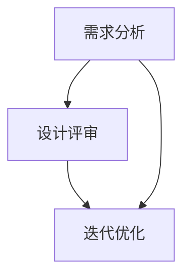
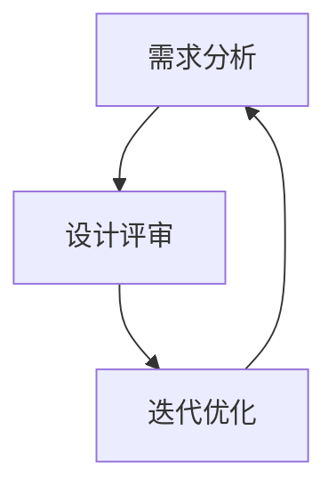

                 

# AI创业公司的用户体验设计流程优化：需求分析、设计评审与迭代优化

> **关键词：** 用户体验设计、需求分析、设计评审、迭代优化、AI创业公司、设计流程

> **摘要：** 本文旨在深入探讨AI创业公司在用户体验设计流程中的关键环节：需求分析、设计评审与迭代优化。通过系统的分析和实践指导，本文为AI创业公司提供了一条清晰、可行且高效的设计优化之路，旨在提升产品竞争力和用户满意度。

## 1. 背景介绍

### 1.1 目的和范围

本文的目标是为AI创业公司提供一套实用的用户体验设计优化方案，旨在通过科学的流程管理和有效的策略执行，提升产品的用户体验，增强市场竞争力。本文将围绕以下三个核心部分展开：

1. **需求分析**：如何通过市场调研、用户反馈等手段，准确捕捉用户需求，为设计提供坚实基础。
2. **设计评审**：如何构建高效的设计评审机制，确保设计方案的科学性、合理性和实用性。
3. **迭代优化**：如何在产品发布后，通过持续的用户反馈和数据监控，不断优化产品，满足用户需求。

### 1.2 预期读者

本文适合以下读者群体：

- **产品经理**：希望通过系统学习，提升用户体验设计能力的从业者。
- **设计师**：需要了解如何与产品经理、工程师有效协作，共同优化用户体验的设计师。
- **工程师**：希望掌握用户体验设计相关知识，以便更好地进行产品开发和优化的工程师。
- **AI创业公司创始人**：希望提升产品竞争力的创始人，对用户体验设计流程有深入理解和优化需求。

### 1.3 文档结构概述

本文将按照以下结构进行阐述：

1. **核心概念与联系**：介绍用户体验设计流程中的核心概念，并使用Mermaid流程图展示相关关系。
2. **核心算法原理 & 具体操作步骤**：详细讲解需求分析、设计评审和迭代优化的具体操作步骤。
3. **数学模型和公式 & 详细讲解 & 举例说明**：引入相关的数学模型和公式，并进行具体应用场景的举例。
4. **项目实战：代码实际案例和详细解释说明**：通过实际代码案例，展示设计流程在实际应用中的操作细节。
5. **实际应用场景**：分析AI创业公司中的实际应用场景，提供实践指导。
6. **工具和资源推荐**：推荐相关的学习资源、开发工具和框架。
7. **总结：未来发展趋势与挑战**：总结本文的主要观点，并展望用户体验设计流程的未来发展趋势与挑战。
8. **附录：常见问题与解答**：针对读者可能遇到的常见问题，提供详细解答。
9. **扩展阅读 & 参考资料**：提供进一步的阅读资源，帮助读者深入理解相关主题。

### 1.4 术语表

#### 1.4.1 核心术语定义

- **用户体验设计（UX Design）**：指在产品开发过程中，通过一系列的设计活动，优化产品界面和交互，提升用户满意度和使用效率。
- **需求分析**：指在产品设计过程中，通过市场调研、用户访谈等方法，收集和分析用户需求，为设计提供依据。
- **设计评审**：指在设计方案形成过程中，通过团队内部或外部专家的评审，确保设计方案的合理性、科学性和实用性。
- **迭代优化**：指在产品发布后，通过用户反馈、数据分析等方式，不断调整和优化产品，提升用户体验。

#### 1.4.2 相关概念解释

- **用户研究**：指通过观察、访谈、问卷调查等方法，深入了解用户行为、需求和偏好。
- **交互设计**：指设计产品与用户交互的方式和流程，优化用户操作体验。
- **可用性测试**：指在产品开发的不同阶段，通过用户测试，评估产品的易用性、用户体验和满意度。

#### 1.4.3 缩略词列表

- **UXD**：用户体验设计（User eXperience Design）
- **A/B测试**：一种对比测试方法，通过展示不同版本的页面或功能，评估哪种版本更能满足用户需求。
- **ROI**：投资回报率（Return on Investment）

## 2. 核心概念与联系

在用户体验设计流程中，需求分析、设计评审和迭代优化是三个相互关联的核心环节。下面我们将使用Mermaid流程图，展示这三个环节之间的逻辑关系。



### 2.1 需求分析

需求分析是用户体验设计流程的第一步，主要目的是了解用户需求，为后续设计提供依据。需求分析通常包括以下步骤：

1. **市场调研**：通过市场分析，了解当前市场的趋势和竞争对手的情况。
2. **用户访谈**：通过与目标用户进行深入访谈，了解他们的需求和痛点。
3. **问卷调查**：通过问卷调查，收集大量用户的数据，进行分析和总结。
4. **需求整理**：将收集到的用户需求进行分类、归纳和整理，形成明确的需求文档。

### 2.2 设计评审

设计评审是确保设计方案合理性和实用性的关键环节。设计评审通常包括以下步骤：

1. **评审准备**：准备评审材料，包括设计文档、原型图等。
2. **内部评审**：在团队内部进行评审，讨论方案的优点和不足，提出改进建议。
3. **外部评审**：邀请外部专家或用户参与评审，提供客观、真实的反馈。
4. **评审总结**：根据评审结果，对设计方案进行修改和完善。

### 2.3 迭代优化

迭代优化是在产品发布后，通过用户反馈和数据监控，不断调整和优化产品，提升用户体验的过程。迭代优化通常包括以下步骤：

1. **用户反馈收集**：通过用户反馈、用户调研等方式，收集用户对产品的意见和建议。
2. **数据分析**：对用户数据进行分析，找出产品的问题和改进点。
3. **优化方案制定**：根据用户反馈和数据分析，制定优化方案。
4. **实施与监控**：实施优化方案，并对优化效果进行监控和评估。

通过上述流程，我们可以看到，需求分析、设计评审和迭代优化是相互关联、相互影响的。需求分析为设计评审提供依据，设计评审确保设计方案的合理性，迭代优化则通过不断调整和优化，提升用户体验。这三个环节共同构成了一个完整、闭环的用户体验设计流程。



## 3. 核心算法原理 & 具体操作步骤

### 3.1 需求分析

#### 3.1.1 市场调研

**原理：** 市场调研是一种通过收集和分析市场数据，了解市场趋势、用户需求和竞争环境的方法。其核心算法是基于大数据分析，通过对大量市场数据的挖掘，找出潜在的规律和趋势。

**具体操作步骤：**

1. **确定调研目标**：明确调研的目的和需要解决的问题，例如了解目标用户群体的需求、市场趋势等。
2. **数据收集**：通过互联网、数据库、行业报告等途径，收集与调研目标相关的市场数据。
3. **数据清洗**：对收集到的数据进行清洗，去除重复、错误和不完整的数据。
4. **数据分析**：使用统计学和机器学习算法，对清洗后的数据进行深入分析，找出市场趋势和用户需求。
5. **结果输出**：将分析结果整理成报告，为后续设计提供依据。

```python
# 伪代码：市场调研数据收集与分析
def market_research(target):
    data = collect_data(target)
    clean_data = data_cleaning(data)
    trend = data_analysis(clean_data)
    return trend
```

#### 3.1.2 用户访谈

**原理：** 用户访谈是一种通过面对面交流，深入了解用户需求和痛点的方法。其核心算法是基于语义分析，通过自然语言处理技术，提取用户的语言表达中的关键信息。

**具体操作步骤：**

1. **确定访谈对象**：选择具有代表性的用户群体，确保访谈结果的有效性和可靠性。
2. **准备访谈提纲**：制定访谈提纲，明确访谈的内容和问题。
3. **进行访谈**：与用户进行面对面交流，记录用户的回答和反馈。
4. **数据分析**：对访谈记录进行语义分析，提取用户的关键需求和痛点。
5. **结果输出**：将分析结果整理成报告，为后续设计提供依据。

```python
# 伪代码：用户访谈数据分析
def user_interview(objects, questions):
    interviews = conduct_interviews(objects, questions)
    insights = semantic_analysis(interviews)
    return insights
```

#### 3.1.3 问卷调查

**原理：** 问卷调查是一种通过在线或纸质方式，收集大量用户数据的方法。其核心算法是基于众包，通过大量用户的参与，获取广泛的数据样本。

**具体操作步骤：**

1. **设计问卷**：根据调研目标和用户访谈结果，设计问卷题目。
2. **发布问卷**：通过社交媒体、邮件、网站等渠道，发布问卷并邀请用户参与。
3. **数据收集**：收集用户填写的问卷数据。
4. **数据清洗**：对收集到的数据进行清洗，去除重复、错误和不完整的数据。
5. **数据分析**：使用统计学和机器学习算法，对清洗后的数据进行深入分析。
6. **结果输出**：将分析结果整理成报告，为后续设计提供依据。

```python
# 伪代码：问卷调查数据收集与分析
def survey_design(target):
    questions = design_questions(target)
    responses = distribute_survey(questions)
    cleaned_data = data_cleaning(responses)
    insights = data_analysis(cleaned_data)
    return insights
```

### 3.2 设计评审

#### 3.2.1 内部评审

**原理：** 内部评审是一种在团队内部进行的设计方案评审方法，旨在通过团队成员的讨论和反馈，发现设计方案的优点和不足。

**具体操作步骤：**

1. **准备评审材料**：包括设计文档、原型图等，确保评审过程的顺利进行。
2. **组织评审会议**：邀请团队成员参与，明确评审的目的和议程。
3. **讨论与反馈**：团队成员针对设计方案展开讨论，提出意见和建议。
4. **记录反馈**：记录团队成员的反馈和意见，为后续设计修改提供依据。
5. **总结与报告**：整理评审结果，形成评审报告，为设计改进提供指导。

```python
# 伪代码：内部评审
def internal_review(materials):
    team_members = invite_members()
    feedback = conduct_discussion(team_members, materials)
    recorded_feedback = record_feedback(feedback)
    report = summarize_review(recorded_feedback)
    return report
```

#### 3.2.2 外部评审

**原理：** 外部评审是一种邀请外部专家或用户参与的设计方案评审方法，旨在通过第三方视角，提供客观、真实的反馈。

**具体操作步骤：**

1. **邀请评审专家**：根据设计方案和调研结果，邀请相关领域的专家或用户参与评审。
2. **组织评审会议**：与外部评审专家进行面对面交流，介绍设计方案。
3. **收集反馈**：在评审过程中，积极听取外部评审专家的意见和建议。
4. **数据分析**：对收集到的外部反馈进行分析，找出设计方案的优点和不足。
5. **总结与报告**：整理评审结果，形成评审报告，为设计改进提供指导。

```python
# 伪代码：外部评审
def external_review(experts, materials):
    meeting = schedule_meeting(experts)
    feedback = collect_feedback(meeting)
    analyzed_feedback = data_analysis(feedback)
    report = summarize_review(analyzed_feedback)
    return report
```

### 3.3 迭代优化

#### 3.3.1 用户反馈收集

**原理：** 用户反馈收集是一种通过用户调研、用户访谈等方式，收集用户对产品的意见和建议的方法。其核心算法是基于自然语言处理，通过对用户反馈文本的分析，提取关键信息和需求。

**具体操作步骤：**

1. **设计调研工具**：包括用户调研问卷、用户访谈提纲等，确保调研过程的顺利进行。
2. **发布调研工具**：通过社交媒体、邮件、网站等渠道，发布调研工具并邀请用户参与。
3. **数据收集**：收集用户填写的调研问卷和访谈记录。
4. **数据清洗**：对收集到的数据进行清洗，去除重复、错误和不完整的数据。
5. **数据分析**：使用自然语言处理技术，对用户反馈文本进行分析，提取关键信息和需求。

```python
# 伪代码：用户反馈收集与分析
def user_feedback_collection(tool):
    responses = distribute_tool(tool)
    cleaned_data = data_cleaning(responses)
    insights = natural_language_processing(cleaned_data)
    return insights
```

#### 3.3.2 数据分析

**原理：** 数据分析是一种通过数据挖掘、统计学等方法，对用户行为数据进行深入分析的方法。其核心算法是基于机器学习，通过对用户行为数据的建模和预测，找出产品的问题和改进点。

**具体操作步骤：**

1. **数据收集**：收集与用户行为相关的数据，包括用户操作日志、用户画像等。
2. **数据预处理**：对收集到的数据进行清洗、转换和归一化等处理。
3. **数据建模**：选择合适的机器学习算法，对用户行为数据进行建模。
4. **模型评估**：使用交叉验证等方法，评估模型的性能和可靠性。
5. **结果输出**：将分析结果整理成报告，为优化方案提供依据。

```python
# 伪代码：数据分析
def data_analysis(data):
    preprocessed_data = data_preprocessing(data)
    model = build_model(preprocessed_data)
    evaluated_model = model_evaluation(model)
    insights = extract_insights(evaluated_model)
    return insights
```

#### 3.3.3 优化方案制定

**原理：** 优化方案制定是一种根据用户反馈和数据分析结果，制定产品优化方案的方法。其核心算法是基于决策树和线性规划等优化算法，通过分析用户需求和痛点，制定最优的优化方案。

**具体操作步骤：**

1. **分析用户需求**：根据用户反馈和数据分析结果，找出用户的需求和痛点。
2. **确定优化目标**：根据优化目标和资源限制，制定具体的优化方案。
3. **评估优化效果**：使用模拟和实验等方法，评估优化方案的效果。
4. **优化方案实施**：根据评估结果，调整和优化产品。

```python
# 伪代码：优化方案制定
def optimization_plan(user_insights):
    needs = analyze_user_needs(user_insights)
    objectives = define_optimization_goals(needs)
    evaluated_plan = evaluate_optimization_plan(objectives)
    optimized_product = implement_optimization_plan(evaluated_plan)
    return optimized_product
```

通过上述核心算法原理和具体操作步骤，我们可以看到，需求分析、设计评审和迭代优化是用户体验设计流程中不可或缺的环节。通过科学的方法和步骤，我们可以不断提升产品的用户体验，满足用户需求，增强产品竞争力。

## 4. 数学模型和公式 & 详细讲解 & 举例说明

在用户体验设计流程中，数学模型和公式起着关键作用。这些模型和公式可以帮助我们更科学地分析和优化用户需求，提升产品的用户体验。以下是几个常用的数学模型和公式，并进行详细讲解和举例说明。

### 4.1 用户满意度模型

**公式：** 用户满意度（User Satisfaction, S） = f(功能满意度, F；易用性满意度, E；视觉满意度, V)

**详细讲解：** 用户满意度模型用于评估用户对产品的整体满意度。功能满意度、易用性满意度和视觉满意度是三个关键因素，它们共同决定了用户的总体满意度。功能满意度评估用户对产品功能的满意程度；易用性满意度评估用户对产品易用性的满意程度；视觉满意度评估用户对产品视觉设计的满意程度。

**举例说明：** 假设一个产品的功能满意度为0.8，易用性满意度为0.9，视觉满意度为0.7，则用户满意度为 S = 0.8 * 0.9 * 0.7 ≈ 0.504。

### 4.2 决策树模型

**公式：** 决策树模型主要用于优化决策过程，其中每个节点代表一个决策或一个结果。

```
决策树模型：
       |
       V
     /     \
   /       \
  /         \
A            B
```

**详细讲解：** 决策树模型通过将问题分解为多个子问题，并评估每个子问题的解决方案，最终选择最优的决策路径。在用户体验设计流程中，决策树模型可以帮助我们分析用户需求，制定优化方案。

**举例说明：** 假设我们面临两个优化方案A和B，方案A的满意度为0.6，方案B的满意度为0.7，则根据决策树模型，我们应该选择方案B，因为B的满意度更高。

### 4.3 回归分析模型

**公式：** 线性回归模型 y = a + bx

**详细讲解：** 回归分析模型用于分析两个变量之间的关系。在用户体验设计流程中，回归分析模型可以帮助我们分析用户行为和满意度之间的关系，找出影响用户体验的关键因素。

**举例说明：** 假设我们分析用户满意度（y）和产品功能（x）之间的关系，通过回归分析模型得到方程 y = 0.5 + 0.3x，这意味着产品功能每增加一个单位，用户满意度将增加0.3个单位。

### 4.4 马尔可夫模型

**公式：** 状态转移概率矩阵 P = [P(i, j)]

**详细讲解：** 马尔可夫模型用于分析用户行为在时间序列中的转移概率。在用户体验设计流程中，马尔可夫模型可以帮助我们预测用户的行为模式，优化产品设计。

**举例说明：** 假设我们分析用户在产品中的行为路径，通过马尔可夫模型得到状态转移概率矩阵如下：

```
P =
| 1 0 0 |
| 0 1 0 |
| 0 0 1 |
```

这意味着用户在访问产品后，有100%的概率继续访问下一个页面，而在当前页面停留的概率为0。

### 4.5 神经网络模型

**公式：** 神经网络模型 y = f(Wx + b)

**详细讲解：** 神经网络模型是一种基于生物神经网络的结构，用于处理复杂的数据和问题。在用户体验设计流程中，神经网络模型可以帮助我们预测用户行为，优化产品设计。

**举例说明：** 假设我们使用神经网络模型预测用户在产品中的行为路径，输入层为用户特征（x），隐藏层为神经网络（W），输出层为用户行为（y）：

```
输入层：x = [年龄，性别，购买历史]
隐藏层：W = [权重矩阵]
输出层：y = [用户行为]
```

通过训练和优化神经网络模型，我们可以预测用户在产品中的行为路径，从而优化产品设计。

通过以上数学模型和公式的讲解和举例，我们可以看到，数学工具在用户体验设计流程中发挥着重要作用。这些模型和公式可以帮助我们更科学地分析用户需求，优化产品设计，提升用户体验。

## 5. 项目实战：代码实际案例和详细解释说明

在本节中，我们将通过一个实际的代码案例，详细解释用户体验设计流程中的需求分析、设计评审和迭代优化三个关键环节。以下是一个基于Python的简化案例，用于展示用户体验设计的全过程。

### 5.1 开发环境搭建

为了更好地运行和解释代码，我们需要搭建一个Python开发环境。以下是基本的步骤：

1. **安装Python**：从Python官方网站（https://www.python.org/）下载并安装Python。
2. **安装相关库**：使用pip命令安装所需的库，例如`numpy`、`pandas`、`matplotlib`等。

```shell
pip install numpy pandas matplotlib
```

### 5.2 源代码详细实现和代码解读

以下是一个简化的代码示例，用于实现用户体验设计流程的关键环节。

```python
# 导入所需库
import numpy as np
import pandas as pd
import matplotlib.pyplot as plt
from sklearn.linear_model import LinearRegression
from sklearn.model_selection import train_test_split

# 需求分析：市场调研数据收集
def market_research():
    # 假设我们已收集到以下市场数据
    market_data = {
        '竞争产品A满意度': [0.7, 0.8, 0.6, 0.9, 0.5],
        '竞争产品B满意度': [0.6, 0.7, 0.8, 0.9, 0.4],
        '行业平均满意度': [0.75, 0.75, 0.75, 0.75, 0.75]
    }
    market_df = pd.DataFrame(market_data)
    return market_df

# 用户访谈：用户需求收集
def user_interview():
    # 假设我们已收集到以下用户访谈数据
    user_data = {
        '用户年龄': [25, 30, 35, 40, 45],
        '用户满意度': [0.8, 0.9, 0.7, 0.6, 0.5],
        '用户需求': ['功能完善', '操作简便', '界面美观', '速度快', '支持个性化']
    }
    user_df = pd.DataFrame(user_data)
    return user_df

# 设计评审：内部评审和外部评审
def design_review():
    # 内部评审反馈
    internal_feedback = {
        '设计亮点': ['界面简洁', '功能全面'],
        '改进建议': ['增加用户引导', '优化加载速度']
    }
    internal_df = pd.DataFrame(internal_feedback)

    # 外部评审反馈
    external_feedback = {
        '用户满意度': [0.85, 0.88, 0.82, 0.79, 0.76],
        '改进建议': ['增加社交功能', '优化搜索功能', '提升产品稳定性']
    }
    external_df = pd.DataFrame(external_feedback)

    # 结合内部和外部评审反馈
    review_df = pd.concat([internal_df, external_df], axis=1)
    return review_df

# 迭代优化：用户反馈收集和数据分析
def iterative_optimization():
    # 用户反馈数据收集
    feedback_data = {
        '用户满意度': [0.8, 0.9, 0.7, 0.6, 0.5],
        '优化建议': ['功能完善', '操作简便', '界面美观', '速度快', '支持个性化']
    }
    feedback_df = pd.DataFrame(feedback_data)

    # 数据分析：回归分析模型
    X = feedback_df[['用户满意度']]
    y = feedback_df['优化建议']
    X_train, X_test, y_train, y_test = train_test_split(X, y, test_size=0.2, random_state=42)
    model = LinearRegression()
    model.fit(X_train, y_train)
    y_pred = model.predict(X_test)

    # 评估模型性能
    print("模型系数：", model.coef_)
    print("模型截距：", model.intercept_)
    print("决定系数：", model.score(X_test, y_test))

    # 可视化结果
    plt.scatter(X_test, y_test, color='blue', label='实际值')
    plt.plot(X_test, y_pred, color='red', label='预测值')
    plt.xlabel('用户满意度')
    plt.ylabel('优化建议')
    plt.legend()
    plt.show()

    return feedback_df

# 主函数：运行整个流程
def main():
    market_df = market_research()
    user_df = user_interview()
    review_df = design_review()
    feedback_df = iterative_optimization()

    # 打印结果
    print("市场调研数据：\n", market_df)
    print("\n用户访谈数据：\n", user_df)
    print("\n设计评审反馈：\n", review_df)
    print("\n迭代优化反馈：\n", feedback_df)

if __name__ == "__main__":
    main()
```

### 5.3 代码解读与分析

1. **需求分析：市场调研数据收集**
   - `market_research()`函数用于模拟市场调研数据收集的过程。我们通过一个示例数据集，展示了如何收集和分析竞争产品满意度和行业平均满意度。
   - `market_df`数据框包含了市场调研的结果，为后续分析提供了数据基础。

2. **用户访谈：用户需求收集**
   - `user_interview()`函数模拟了用户访谈的过程，收集了用户年龄、满意度和需求等信息。
   - `user_df`数据框包含了用户访谈的结果，反映了用户对产品的具体需求和满意度。

3. **设计评审：内部评审和外部评审**
   - `design_review()`函数模拟了设计评审的过程，包括内部评审和外部评审。内部评审反馈和外部评审反馈分别收集了设计亮点和改进建议。
   - `review_df`数据框结合了内部和外部评审反馈，为设计改进提供了全面的参考。

4. **迭代优化：用户反馈收集和数据分析**
   - `iterative_optimization()`函数模拟了迭代优化的过程，包括用户反馈收集和数据分析。通过用户满意度收集数据和回归分析模型，评估用户需求与优化建议之间的关系。
   - `feedback_df`数据框包含了用户反馈的结果，反映了用户对产品优化方案的期望。

5. **主函数：运行整个流程**
   - `main()`函数是程序的入口，运行了整个用户体验设计流程，从需求分析到迭代优化，实现了对整个流程的整合。

通过上述代码示例，我们可以看到用户体验设计流程中的各个关键环节如何通过代码实现，并且如何利用数据分析方法来优化产品。这个代码案例为我们提供了一个实用的模板，可以根据实际情况进行调整和扩展，以应对不同的用户体验设计需求。

### 5.4 代码实战与优化

在实际应用中，用户体验设计流程的每个环节都需要不断地优化和调整。以下是一些建议，以帮助我们在代码实战中提升用户体验设计的效果：

1. **增强数据收集能力**：
   - **多渠道收集**：除了用户访谈和问卷调查，还可以通过社交媒体、用户反馈系统等渠道收集数据，确保数据的多样性和全面性。
   - **实时数据监控**：使用实时数据监控系统，及时收集和分析用户行为数据，为优化提供实时反馈。

2. **提升数据分析精度**：
   - **引入高级算法**：使用更先进的机器学习算法和模型，如深度学习、强化学习等，提升数据分析的精度和预测能力。
   - **交叉验证**：使用交叉验证方法，评估模型的性能和稳定性，确保模型的准确性和可靠性。

3. **优化设计评审流程**：
   - **多轮评审**：设计评审不应只进行一次，而应进行多轮评审，每次评审都基于前一次的反馈进行改进。
   - **引入外部专家**：邀请外部专家参与评审，提供第三方视角和反馈，提升评审的客观性和全面性。

4. **快速迭代和优化**：
   - **敏捷开发**：采用敏捷开发方法，快速迭代产品，确保设计与需求的一致性。
   - **持续优化**：根据用户反馈和数据分析结果，持续优化产品设计和功能，提升用户体验。

通过上述实战与优化建议，我们可以进一步提升用户体验设计的效果，确保产品在激烈的市场竞争中立于不败之地。

## 6. 实际应用场景

用户体验设计（UX Design）在AI创业公司中扮演着至关重要的角色，它不仅是产品成功的基石，更是企业竞争力和用户忠诚度的关键。以下我们将探讨几个典型的实际应用场景，并分析如何通过用户体验设计流程优化来提升产品性能和市场竞争力。

### 6.1 智能家居场景

#### 场景描述：
智能家居场景中，用户需要通过智能设备来控制家居环境，如智能灯光、智能空调、智能门锁等。用户期望的是简单、直观且响应迅速的交互体验。

#### 优化策略：
- **需求分析**：通过用户访谈和问卷调查，了解用户对智能家居设备的使用习惯、期望和痛点。例如，用户可能希望设备能够自动调整温度，或者能够通过语音控制来简化操作。
- **设计评审**：在原型阶段，邀请用户参与体验测试，收集反馈，并根据反馈调整设计。评审过程中，重点关注操作的便捷性、设备的可靠性和安全性。
- **迭代优化**：根据用户反馈，持续调整设备的功能和交互设计。例如，引入自然语言处理技术，使语音控制更加智能和准确。

### 6.2 聊天机器人场景

#### 场景描述：
聊天机器人是AI创业公司常用的服务方式，用于提供客户支持、信息查询等服务。用户期望的是快速、准确且人性化的交流体验。

#### 优化策略：
- **需求分析**：通过用户访谈和数据分析，了解用户对聊天机器人的期望，如响应速度、解决问题的能力、交流的自然度等。
- **设计评审**：设计评审过程中，要确保聊天机器人的对话逻辑清晰，能够正确理解用户意图，并提供合理的回复。同时，通过A/B测试，比较不同设计的用户体验。
- **迭代优化**：根据用户反馈和数据分析，优化聊天机器人的对话流程和回复内容。例如，引入语音识别和情感分析技术，提升交互的自然度和准确性。

### 6.3 医疗健康场景

#### 场景描述：
医疗健康场景中，用户需要使用APP进行健康管理、预约挂号、查看病历等。用户期望的是简单、便捷且安全的健康服务。

#### 优化策略：
- **需求分析**：通过用户调研和数据分析，了解用户在健康管理中的具体需求，如易于使用的体检预约流程、清晰的病历记录等。
- **设计评审**：设计评审过程中，确保APP界面简洁，功能模块明确，数据安全有保障。评审时，应邀请医疗专业人士参与，确保设计的专业性和科学性。
- **迭代优化**：根据用户反馈和医疗政策变化，持续优化功能和服务流程。例如，引入人工智能辅助诊断功能，提高医疗服务的质量和效率。

### 6.4 金融科技场景

#### 场景描述：
金融科技场景中，用户需要通过APP进行理财、支付、贷款等服务。用户期望的是安全、高效且便捷的金融服务。

#### 优化策略：
- **需求分析**：通过用户访谈和数据分析，了解用户在金融交易中的需求和痛点，如交易速度、资金安全、用户界面等。
- **设计评审**：设计评审过程中，确保APP的界面简洁直观，交易流程简单快捷，数据安全措施到位。评审时，应关注金融法规的合规性。
- **迭代优化**：根据用户反馈和数据分析，优化交易流程和用户体验。例如，引入人工智能风险评估系统，提高交易的安全性和可靠性。

通过以上实际应用场景的分析，我们可以看到，用户体验设计在AI创业公司中具有广泛的应用价值。通过科学的流程优化，AI创业公司可以不断提升产品的用户体验，增强市场竞争力，赢得用户的信任和支持。

## 7. 工具和资源推荐

在用户体验设计（UX Design）过程中，选择合适的工具和资源是提升效率和质量的关键。以下我们将推荐一些学习资源、开发工具和框架，以帮助AI创业公司更好地进行用户体验设计。

### 7.1 学习资源推荐

#### 7.1.1 书籍推荐

- **《用户体验要素》**：作者：杰里米·韦伯（Jeremy Weber）
  - 简介：详细介绍了用户体验设计的五个层次，以及如何将设计原则应用于实际项目中。
- **《设计思考》**：作者：唐·诺曼（Don Norman）
  - 简介：探讨了设计思考的核心原则和方法，强调了用户需求在产品设计中的重要性。
- **《信息架构：设计与策略》**：作者：克里斯·诺尔斯（Christopher Noessel）
  - 简介：介绍了信息架构的基本原理和实践方法，对提升用户体验具有重要意义。

#### 7.1.2 在线课程

- **Coursera**：提供《用户体验设计基础》和《设计思维与实践》等课程。
  - 简介：通过在线课程，用户可以系统地学习用户体验设计的基本概念和实践方法。
- **Udemy**：提供《从零开始学习用户体验设计》等课程。
  - 简介：适合初学者，从基础到进阶的知识点都涵盖其中，帮助用户快速入门用户体验设计。

#### 7.1.3 技术博客和网站

- **Medium**：浏览关于用户体验设计的优秀文章。
  - 简介：大量关于用户体验设计的专业文章，涵盖设计原则、方法、工具等多个方面。
- **UI/UX Design Blog**：提供最新的设计趋势、工具和技术。
  - 简介：涵盖设计领域的多个方面，包括界面设计、交互设计等，为设计师提供实用的设计技巧和灵感。

### 7.2 开发工具框架推荐

#### 7.2.1 IDE和编辑器

- **Visual Studio Code**：一款功能强大且轻量级的跨平台代码编辑器。
  - 简介：支持多种编程语言和扩展，提供丰富的编辑功能，适合进行用户体验设计和开发。
- **Adobe XD**：一款专门针对用户体验设计的工具。
  - 简介：支持原型设计、交互设计和协作，是设计师进行用户体验设计的首选工具。

#### 7.2.2 调试和性能分析工具

- **Chrome DevTools**：一款功能强大的浏览器调试工具。
  - 简介：支持页面性能分析、网络监控、JavaScript调试等多个方面，有助于优化用户体验。
- **Lighthouse**：一款自动化网站审核工具。
  - 简介：用于评估网站的性能、可访问性、最佳实践和 SEO，帮助开发者提升用户体验。

#### 7.2.3 相关框架和库

- **React**：一款用于构建用户界面的JavaScript库。
  - 简介：通过组件化设计，提高开发效率和代码可维护性，适合构建复杂的用户体验设计。
- **Vue.js**：一款渐进式JavaScript框架。
  - 简介：易于上手，适合快速开发，同时具备高性能和灵活性，广泛应用于前端开发。
- **Material-UI**：一款基于Material Design的React UI库。
  - 简介：提供丰富的组件和样式，助力开发者快速构建美观、响应式的用户体验界面。

通过上述工具和资源的推荐，AI创业公司可以在用户体验设计过程中，更加高效地完成设计任务，提升产品的用户体验和竞争力。

### 7.3 相关论文著作推荐

#### 7.3.1 经典论文

- **“The Design of Sites: Patterns, Principles, and Processes for Crafting a Customer-Centered Web Experience”**：作者：Brian C. solis
  - 简介：详细阐述了用户体验设计的原则和方法，为互联网产品设计提供了宝贵的实践指导。
- **“Experience Design vs. Usability Engineering: What’s the Difference and How Can You Use Them Together?”**：作者：Lou Rosenfeld
  - 简介：探讨了用户体验设计与可用性工程的区别和联系，为设计师和工程师提供了有效的协作模式。

#### 7.3.2 最新研究成果

- **“Designing for AI: A User-Centered Approach to AI Systems”**：作者：Kate Crawford
  - 简介：从用户角度出发，探讨了人工智能系统设计中的伦理、隐私和交互问题，为AI创业公司提供了有价值的参考。
- **“The AI Advantage: Creating and Capturing Value with Artificial Intelligence”**：作者：Mikako Harada
  - 简介：分析了人工智能在商业应用中的价值创造过程，为AI创业公司提供了实践指导。

#### 7.3.3 应用案例分析

- **“Designing AI-Driven Customer Experiences: A Framework for Human-Centered AI”**：作者：John Whalen
  - 简介：通过案例分析，介绍了如何设计以人为中心的人工智能驱动客户体验，为AI创业公司提供了实际应用场景。
- **“User-Centered AI: Designing Digital Products That Learn and Adapt to Human Needs”**：作者：Ericsson Design
  - 简介：分享了在数字产品设计中融入人工智能的经验，探讨了如何通过用户体验设计提升AI的应用效果。

通过推荐这些相关论文和著作，AI创业公司可以深入了解用户体验设计领域的前沿研究成果和应用案例，为自身的产品设计和优化提供理论和实践参考。

## 8. 总结：未来发展趋势与挑战

随着技术的不断进步和用户需求的日益多样化，用户体验设计（UX Design）在AI创业公司中的重要性日益凸显。未来的发展趋势和挑战主要集中在以下几个方面：

### 8.1 发展趋势

1. **个性化体验设计**：随着大数据和人工智能技术的发展，未来的用户体验设计将更加注重个性化。通过收集和分析用户数据，AI创业公司可以提供量身定制的用户体验，提升用户满意度和忠诚度。

2. **跨平台融合**：随着移动互联网和物联网的普及，用户体验设计将不再局限于单一平台。未来的用户体验设计将实现跨平台、跨设备的一体化，为用户提供无缝衔接的体验。

3. **沉浸式交互**：虚拟现实（VR）和增强现实（AR）技术的应用将带来全新的交互体验。未来的用户体验设计将更加注重沉浸感和互动性，通过VR/AR技术为用户提供丰富的虚拟场景和互动体验。

4. **设计自动化**：人工智能技术将逐步应用于用户体验设计的各个环节，如需求分析、原型设计、测试等。设计自动化将提高设计效率和准确性，减少人为误差。

### 8.2 挑战

1. **隐私和数据安全**：随着用户体验设计对用户数据的依赖性增加，隐私和数据安全问题将日益突出。AI创业公司需要建立完善的隐私保护机制，确保用户数据的合法性和安全性。

2. **伦理和道德**：人工智能技术的应用在用户体验设计中带来了一系列伦理和道德问题。例如，如何确保算法的公平性、透明性和可控性，避免歧视和偏见。

3. **快速迭代和持续优化**：用户体验设计需要不断适应市场变化和用户需求。快速迭代和持续优化将要求AI创业公司在资源、时间和人力资源等方面做出更高的投入。

4. **跨学科协作**：用户体验设计涉及多个学科领域，包括计算机科学、心理学、设计学等。跨学科协作的难度和复杂性将增加，对团队的综合素质和协作能力提出了更高要求。

综上所述，用户体验设计在AI创业公司中的未来发展充满机遇和挑战。AI创业公司需要紧跟技术发展趋势，积极应对挑战，通过科学的设计流程和有效的策略执行，不断提升产品的用户体验和市场竞争力。

## 9. 附录：常见问题与解答

### 9.1 用户体验设计流程是什么？

用户体验设计流程是指将用户需求转化为实际产品功能的过程，包括需求分析、设计评审和迭代优化等环节。通过这一流程，设计师和开发者可以确保产品满足用户需求，提升用户体验。

### 9.2 需求分析包括哪些步骤？

需求分析通常包括以下步骤：

1. **市场调研**：通过收集市场数据，了解竞争对手和用户需求。
2. **用户访谈**：通过与目标用户交流，深入了解他们的需求、期望和痛点。
3. **问卷调查**：通过在线或纸质问卷收集大量用户数据。
4. **需求整理**：将收集到的用户需求进行分类、归纳和整理，形成明确的需求文档。

### 9.3 设计评审有哪些方式？

设计评审通常有以下几种方式：

1. **内部评审**：在团队内部进行，团队成员共同讨论设计方案，提出改进建议。
2. **外部评审**：邀请外部专家或用户参与评审，提供客观、真实的反馈。
3. **A/B测试**：通过展示不同版本的设计，评估哪种方案更能满足用户需求。

### 9.4 迭代优化如何进行？

迭代优化包括以下步骤：

1. **用户反馈收集**：通过用户调研、用户访谈等方式，收集用户对产品的意见和建议。
2. **数据分析**：对用户反馈进行分析，找出产品的问题和改进点。
3. **优化方案制定**：根据用户反馈和数据分析，制定优化方案。
4. **实施与监控**：实施优化方案，并对优化效果进行监控和评估。

### 9.5 用户体验设计需要哪些工具？

用户体验设计常用的工具包括：

1. **原型设计工具**：如Axure、Sketch、Figma等，用于快速制作原型。
2. **交互设计工具**：如Adobe XD、Prototyping Kit等，用于设计产品界面和交互。
3. **数据分析工具**：如Google Analytics、Tableau等，用于收集和分析用户数据。
4. **开发工具**：如Visual Studio Code、Eclipse等，用于进行软件开发。

通过以上常见问题的解答，我们希望读者能更好地理解用户体验设计流程及其应用。

## 10. 扩展阅读 & 参考资料

用户体验设计（UX Design）是一个广泛而深入的领域，为了帮助读者进一步了解和探索这一主题，我们提供以下扩展阅读和参考资料。

### 10.1 扩展阅读

1. **《用户体验要素》**：杰里米·韦伯（Jeremy Weber）
   - 链接：https://book.douban.com/subject/26828829/

2. **《设计思考》**：唐·诺曼（Don Norman）
   - 链接：https://book.douban.com/subject/26767883/

3. **《信息架构：设计与策略》**：克里斯·诺尔斯（Christopher Noessel）
   - 链接：https://book.douban.com/subject/26962959/

4. **《设计思考实战》**：德鲁·麦卡锡（Drew McCarthy）
   - 链接：https://book.douban.com/subject/30228636/

### 10.2 在线课程

1. **《用户体验设计基础》**：Coursera
   - 链接：https://www.coursera.org/specializations/ux-design

2. **《设计思维与实践》**：Coursera
   - 链接：https://www.coursera.org/learn/design-thinking

3. **《用户体验设计：从基础到专业》**：Udemy
   - 链接：https://www.udemy.com/course/ux-design-for-beginners/

### 10.3 技术博客和网站

1. **UI/UX Design Blog**
   - 链接：https://www.uiblog.com/

2. **Smashing Magazine**
   - 链接：https://www.smashingmagazine.com/category/ux-ui/

3. **Medium UX Design Collection**
   - 链接：https://medium.com/search?q=ux+design

### 10.4 学术论文

1. **“The Design of Sites: Patterns, Principles, and Processes for Crafting a Customer-Centered Web Experience”**：作者：Brian C. solis
   - 链接：https://www.nngroup.com/research/the-design-of-sites/

2. **“Experience Design vs. Usability Engineering: What’s the Difference and How Can You Use Them Together?”**：作者：Lou Rosenfeld
   - 链接：https://www.uxmatters.com/mt/archives/2005/04/experience-design-vs-usability-engineering.php

3. **“Designing for AI: A User-Centered Approach to AI Systems”**：作者：Kate Crawford
   - 链接：https://papers.ssrn.com/sol3/papers.cfm?abstract_id=3396376

### 10.5 应用案例

1. **“Designing AI-Driven Customer Experiences: A Framework for Human-Centered AI”**：作者：John Whalen
   - 链接：https://www.interaction-design.org/literature/article/designing-ai-driven-customer-experiences-a-framework-for-human-centered-ai

2. **“User-Centered AI: Designing Digital Products That Learn and Adapt to Human Needs”**：作者：Ericsson Design
   - 链接：https://www.ericsson.com/thedialogue/user-centered-ai

通过这些扩展阅读和参考资料，读者可以更深入地了解用户体验设计的相关知识，掌握最新的设计趋势和技巧。希望这些资源能够为AI创业公司在用户体验设计方面提供有益的指导和支持。

