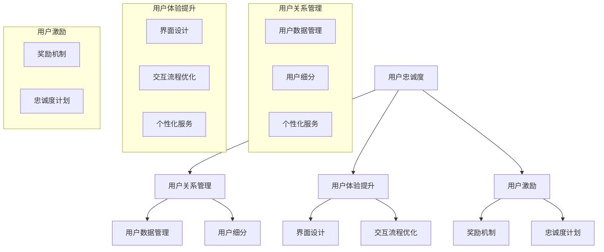

                 

### 文章标题

“AI创业公司的用户忠诚度培养：用户关系管理、用户体验提升与用户激励”

#### 关键词：
- 用户忠诚度
- 用户关系管理
- 用户体验
- 用户激励
- AI创业公司

#### 摘要：
本文旨在探讨AI创业公司在快速发展的技术市场中如何培养用户的忠诚度。通过详细分析用户关系管理、用户体验提升和用户激励三大核心策略，本文提供了实用的方法，帮助企业更好地维护和扩展其用户基础。文章将讨论如何利用AI技术进行精准的用户分析、设计用户友好的交互界面、提供个性化的服务和奖励机制，从而增强用户的参与感和忠诚度。同时，本文还将介绍一些成功案例和实践经验，帮助读者了解这些策略的实际效果。通过阅读本文，AI创业公司可以从中获得宝贵的见解，以在竞争激烈的市场中立于不败之地。

---

## 1. 背景介绍

### 1.1 目的和范围

本文的目的在于深入探讨AI创业公司在市场中的生存之道，特别是如何在竞争激烈的环境中培养和维持用户的忠诚度。用户的忠诚度不仅关乎公司的短期收益，更是其长期发展的基石。因此，通过研究用户关系管理、用户体验提升和用户激励等策略，AI创业公司能够更好地理解用户需求，提供优质服务，从而在市场上脱颖而出。

本文的范围涵盖了以下几个主要方面：
1. **用户关系管理**：分析如何建立和维持与用户的紧密联系，包括用户数据管理、用户细分和个性化服务。
2. **用户体验提升**：探讨如何通过优化产品设计、界面设计和交互流程来提高用户的满意度。
3. **用户激励**：研究如何通过奖励机制和忠诚度计划来激励用户持续使用产品。

### 1.2 预期读者

本文的预期读者主要包括以下几类：
1. **AI创业公司创始人或高层管理者**：这些读者可以从中获得如何在市场上建立和维持用户忠诚度的策略。
2. **市场营销和产品经理**：这些读者可以学习到具体的方法和工具，以提升用户参与度和忠诚度。
3. **用户体验设计师**：这些读者可以了解如何通过设计和优化来增强用户体验。
4. **数据科学家和分析师**：这些读者可以学习如何利用数据来制定有效的用户关系管理和激励策略。

### 1.3 文档结构概述

为了便于读者理解和应用，本文的结构安排如下：
1. **第1章 背景介绍**：介绍本文的目的、范围和预期读者，以及文档的结构概述。
2. **第2章 核心概念与联系**：阐述本文涉及的核心概念，并使用Mermaid流程图展示其相互关系。
3. **第3章 核心算法原理 & 具体操作步骤**：详细解释培养用户忠诚度的算法原理和具体操作步骤。
4. **第4章 数学模型和公式 & 详细讲解 & 举例说明**：介绍相关的数学模型，并用具体的例子进行说明。
5. **第5章 项目实战：代码实际案例和详细解释说明**：提供实际的代码案例，并进行详细的解释和分析。
6. **第6章 实际应用场景**：讨论用户忠诚度策略在不同场景下的应用。
7. **第7章 工具和资源推荐**：推荐相关的学习资源和开发工具。
8. **第8章 总结：未来发展趋势与挑战**：总结本文的主要观点，并探讨未来的发展趋势和挑战。
9. **第9章 附录：常见问题与解答**：解答读者可能遇到的一些常见问题。
10. **第10章 扩展阅读 & 参考资料**：提供进一步阅读的参考资料。

### 1.4 术语表

在本文中，以下术语具有特定的含义：
#### 1.4.1 核心术语定义
- **用户忠诚度**：用户对产品或服务的持续使用和信赖程度。
- **用户关系管理**：建立和维护与用户的长期关系的一系列策略和实践。
- **用户体验**：用户在使用产品或服务过程中所感受到的整体体验。
- **用户激励**：通过奖励或其他激励手段鼓励用户持续使用产品。

#### 1.4.2 相关概念解释
- **用户细分**：根据用户的不同特征和需求，将用户划分为不同的群体。
- **个性化服务**：根据用户的个性化需求提供定制化的产品或服务。
- **忠诚度计划**：通过积分、奖励等方式激励用户持续使用产品。

#### 1.4.3 缩略词列表
- **AI**：人工智能（Artificial Intelligence）
- **CRM**：客户关系管理（Customer Relationship Management）
- **UX**：用户体验（User Experience）
- **UI**：用户界面（User Interface）

通过以上背景介绍，我们可以为接下来的讨论打下坚实的基础。在接下来的章节中，我们将深入探讨用户关系管理、用户体验提升和用户激励等核心策略，以帮助AI创业公司更好地培养用户的忠诚度。

### 2. 核心概念与联系

在本文中，我们将讨论的核心概念包括用户忠诚度、用户关系管理、用户体验和用户激励。这些概念不仅相互独立，还紧密相连，共同构成了一个完整的用户忠诚度培养体系。为了更清晰地展示这些概念之间的联系，我们使用Mermaid流程图来描述它们之间的关系。

以下是一个简单的Mermaid流程图示例：



上述流程图展示了各个核心概念之间的直接和间接关系。以下是每个概念的简要描述和它们在图中的位置：

#### 用户忠诚度（A）
用户忠诚度是本文的核心概念，它直接关系到用户对产品的持续使用和信赖程度。用户忠诚度是用户关系管理、用户体验提升和用户激励的共同目标。

#### 用户关系管理（B）
用户关系管理是建立和维护与用户的长期关系的策略和实践。它包括用户数据管理（E）、用户细分（F）和个性化服务（B3），这些策略共同作用于用户忠诚度的培养。

#### 用户体验提升（C）
用户体验提升关注如何通过优化界面设计（G）、交互流程（H）和个性化服务（C3）来提高用户满意度，进而增强用户忠诚度。

#### 用户激励（D）
用户激励通过奖励机制（I）和忠诚度计划（J）来激励用户持续使用产品，从而提高用户忠诚度。

#### 用户数据管理（E）
用户数据管理是用户关系管理的一部分，它涉及收集、存储和处理用户数据，为个性化服务和细分提供支持。

#### 用户细分（F）
用户细分是根据用户的不同特征和需求将其划分为不同的群体，以便更好地提供个性化服务和优化用户体验。

#### 界面设计（G）
界面设计是用户体验提升的关键因素，它直接影响用户对产品的第一印象和使用体验。

#### 交互流程优化（H）
交互流程优化涉及简化用户操作流程、提高响应速度和增强用户交互的流畅性。

#### 奖励机制（I）
奖励机制是通过提供奖励来鼓励用户参与和忠诚，例如积分、优惠券和特别待遇。

#### 忠诚度计划（J）
忠诚度计划是通过长期的奖励和激励机制来维持用户的忠诚度，如会员制度、积分系统和专属优惠。

通过上述流程图和概念描述，我们可以更清晰地理解用户忠诚度培养的各个要素及其相互关系。接下来，我们将详细探讨这些核心概念，以帮助读者更好地理解和应用它们。

### 3. 核心算法原理 & 具体操作步骤

为了深入探讨AI创业公司如何培养用户忠诚度，我们需要理解并应用一系列核心算法原理和操作步骤。这些步骤不仅包括用户数据分析和用户行为的监测，还涉及个性化服务和激励机制的制定。以下是具体的操作步骤和算法原理：

#### 3.1 用户数据分析

**算法原理**：用户数据分析是培养用户忠诚度的第一步。通过收集和分析用户数据，我们可以深入了解用户的行为模式、偏好和需求。

**操作步骤**：
1. **数据收集**：收集用户在平台上的行为数据，包括访问时间、使用频率、交互行为和购买记录等。
2. **数据清洗**：对收集到的数据去重、补全和清洗，以确保数据的准确性和完整性。
3. **数据存储**：将清洗后的数据存储到数据库中，方便后续的数据分析和处理。

**伪代码示例**：

```python
# 数据收集
def collect_data():
    data = []
    # 从API或日志中获取用户数据
    for user in get_user_data():
        data.append(user)
    return data

# 数据清洗
def clean_data(data):
    cleaned_data = []
    for record in data:
        if is_valid(record):
            cleaned_data.append(record)
    return cleaned_data

# 数据存储
def store_data(cleaned_data):
    # 将数据存储到数据库
    for record in cleaned_data:
        database.insert(record)
```

#### 3.2 用户行为监测

**算法原理**：用户行为监测是实时跟踪和分析用户在平台上的行为，以了解用户的即时需求和偏好。

**操作步骤**：
1. **实时跟踪**：使用Web前端技术（如JavaScript）和服务器端技术（如Python）进行实时数据收集和传输。
2. **数据存储**：将实时数据存储到数据库中，以便进行后续分析。
3. **数据分析**：对存储的数据进行实时分析，以识别用户行为模式和偏好。

**伪代码示例**：

```python
# 实时跟踪
def track_user_actions(user):
    actions = []
    while user_is_active():
        action = get_user_action()
        actions.append(action)
        time.sleep(1)
    return actions

# 数据分析
def analyze_actions(actions):
    # 分析用户行为，识别行为模式
    for action in actions:
        if action.is_preference():
            user_preference.update(action)
```

#### 3.3 个性化服务

**算法原理**：个性化服务是基于用户数据和行为的分析，为用户提供定制化的产品或服务。

**操作步骤**：
1. **用户细分**：根据用户的特征和行为，将用户划分为不同的群体。
2. **个性化内容**：为每个用户群体提供定制化的内容和服务。
3. **交互优化**：根据用户的交互数据，优化用户界面和交互流程。

**伪代码示例**：

```python
# 用户细分
def segment_users(data):
    segments = []
    for user in data:
        if user.is_power_user():
            segments.append('power_user')
        elif user.is_new_user():
            segments.append('new_user')
        else:
            segments.append('regular_user')
    return segments

# 个性化内容
def provide_content(segment):
    if segment == 'power_user':
        content = 'advanced_features'
    elif segment == 'new_user':
        content = 'onboarding_tutorial'
    else:
        content = 'standard_services'
    return content

# 交互优化
def optimize_interface(user_interface, segment):
    if segment == 'power_user':
        user_interface.add('pro_options')
    elif segment == 'new_user':
        user_interface.remove('advanced_options')
    return user_interface
```

#### 3.4 用户激励

**算法原理**：用户激励是通过奖励和激励措施来鼓励用户持续使用产品和服务。

**操作步骤**：
1. **奖励机制设计**：设计各种奖励机制，如积分、优惠券和特别待遇。
2. **忠诚度计划制定**：制定长期的忠诚度计划，如会员制度、积分系统和专属优惠。
3. **激励效果评估**：评估奖励和激励措施的效果，持续优化激励策略。

**伪代码示例**：

```python
# 奖励机制设计
def design_rewards(segment):
    if segment == 'power_user':
        reward = 'priority_support'
    elif segment == 'new_user':
        reward = 'welcome_coupon'
    else:
        reward = 'regular_points'
    return reward

# 忠诚度计划制定
def create_loyalty_program(rewards):
    program = {
        'power_user': {
            'points': 10,
            'rewards': [reward]
        },
        'new_user': {
            'points': 5,
            'rewards': [reward]
        },
        'regular_user': {
            'points': 1,
            'rewards': [reward]
        }
    }
    return program

# 激励效果评估
def evaluate_incentives(incentive_program, user_data):
    for user in user_data:
        if user.is_active() and user.points >= threshold:
            send_reward(user)
```

通过以上算法原理和操作步骤，AI创业公司可以系统地培养用户的忠诚度。在实际应用中，这些步骤需要根据具体的业务场景和用户需求进行定制和调整。接下来，我们将进一步探讨数学模型和公式，以帮助读者更深入地理解用户忠诚度培养的策略。

### 4. 数学模型和公式 & 详细讲解 & 举例说明

在用户忠诚度培养的过程中，数学模型和公式起着至关重要的作用。这些模型不仅帮助我们理解用户行为和忠诚度之间的关系，还可以用于量化用户忠诚度，从而为决策提供科学依据。以下是几个关键的数学模型和公式的详细讲解，以及如何使用它们来评估和优化用户忠诚度。

#### 4.1 持久度指标（Churn Rate）

持久度指标，也称为流失率，是衡量用户忠诚度的关键指标之一。它表示在一定时间内，停止使用产品或服务的用户占总用户数的比例。持久度指标的计算公式如下：

$$
Churn\ Rate = \frac{Total\ Users\ Churned}{Total\ Active\ Users\ at\ the\ Start\ of\ the\ Period}
$$

其中，`Total Users Churned` 表示在特定时间段内流失的用户数，`Total Active Users at the Start of the Period` 表示该时间段开始时活跃的用户数。

**举例说明**：
假设一个AI创业公司在一个月内失去了100个用户，而该时间段开始时有1000个活跃用户。则其持久度指标为：

$$
Churn\ Rate = \frac{100}{1000} = 0.1\ or\ 10\%
$$

这个指标表明，在该月内，有10%的用户流失了。通过持续监控这个指标，公司可以及时识别潜在的问题，并采取相应的措施来降低流失率。

#### 4.2 重复购买率（Repeat Purchase Rate）

重复购买率是衡量用户对产品忠诚度的重要指标，它表示在特定时间段内，再次购买产品的用户占总购买用户数的比例。重复购买率的计算公式如下：

$$
Repeat\ Purchase\ Rate = \frac{Total\ Users\ Making\ Repeat\ Purchases}{Total\ Users\ Making\ Purchases\ in\ the\ Period}
$$

其中，`Total Users Making Repeat Purchases` 表示在特定时间段内再次购买的用户数，`Total Users Making Purchases in the Period` 表示在该时间段内购买的用户总数。

**举例说明**：
假设一个在线购物平台在一个月内有1000次购买，其中有500次是重复购买。则其重复购买率为：

$$
Repeat\ Purchase\ Rate = \frac{500}{1000} = 0.5\ or\ 50\%
$$

这个指标表明，在该月内，有50%的用户进行了重复购买。通过提高重复购买率，公司可以增加用户的生命周期价值和收益。

#### 4.3 客户保留率（Customer Retention Rate）

客户保留率是衡量用户忠诚度的一个综合指标，它表示在一定时间内，仍然活跃的用户占总用户数的比例。客户保留率的计算公式如下：

$$
Customer\ Retention\ Rate = \frac{Total\ Active\ Users\ at\ the\ End\ of\ the\ Period}{Total\ Active\ Users\ at\ the\ Start\ of\ the\ Period}
$$

其中，`Total Active Users at the End of the Period` 表示在特定时间段结束时活跃的用户数，`Total Active Users at the Start of the Period` 表示该时间段开始时活跃的用户数。

**举例说明**：
假设一个社交媒体平台在一个月开始时有10000个活跃用户，到一个月结束时，仍有9000个活跃用户。则其客户保留率为：

$$
Customer\ Retention\ Rate = \frac{9000}{10000} = 0.9\ or\ 90\%
$$

这个指标表明，在该月内，有90%的用户保持了活跃状态。通过提高客户保留率，公司可以维持稳定的用户基础，并减少新用户获取的成本。

#### 4.4 用户生命周期价值（Customer Lifetime Value, CLV）

用户生命周期价值是预测一个用户在其整个生命周期内为公司带来的总收益。它综合考虑了用户的购买频率、平均订单价值和用户的生命周期长度。用户生命周期价值的计算公式如下：

$$
CLV = \sum_{t=1}^{n} (f_t \times AOV \times t \times p_t)
$$

其中，`f_t` 表示第`t`年的购买频率，`AOV` 表示平均订单价值，`t` 表示第`t`年，`p_t` 表示第`t`年的留存概率。

**举例说明**：
假设一个电商平台的用户每年购买频率为2次，平均订单价值为100美元，用户在第一年的留存概率为0.8，第二年为0.6，第三年为0.4。则其用户生命周期价值为：

$$
CLV = (2 \times 100 \times 0.8) + (2 \times 100 \times 0.6) + (2 \times 100 \times 0.4) = 160 + 120 + 80 = 360\ dollars
$$

这个指标表明，一个用户在其整个生命周期内预计为公司带来360美元的收益。通过提高用户生命周期价值，公司可以增加其整体盈利能力。

通过上述数学模型和公式的讲解，我们可以更科学地评估和优化用户忠诚度。这些模型不仅可以用于量化用户忠诚度，还可以帮助公司在制定用户关系管理、用户体验提升和用户激励策略时，做出更加明智的决策。在实际应用中，公司应根据自身业务特点和用户行为数据，灵活调整和优化这些模型，以实现最佳的忠诚度培养效果。

### 5. 项目实战：代码实际案例和详细解释说明

在本文的最后一部分，我们将通过一个实际的项目案例，展示如何利用用户关系管理、用户体验提升和用户激励策略来培养用户忠诚度。这个案例是一个在线教育平台，通过使用AI技术和数据科学方法来优化其服务，提高用户的参与度和忠诚度。

#### 5.1 开发环境搭建

首先，我们需要搭建一个适合开发的项目环境。以下是一个简化的环境搭建步骤：

1. **安装Python**：确保Python 3.x版本已安装在计算机上。
2. **安装依赖库**：使用pip命令安装必要的Python库，如pandas、numpy、scikit-learn、tensorflow等。

```bash
pip install pandas numpy scikit-learn tensorflow
```

3. **设置数据库**：选择一个合适的数据库系统，如MySQL或PostgreSQL，并创建数据库和用户表。

4. **搭建后端服务**：使用Flask或Django等Web框架搭建后端服务。

#### 5.2 源代码详细实现和代码解读

以下是一个简化版的代码示例，展示如何实现用户关系管理、用户体验提升和用户激励策略。

```python
# 导入必要的库
import pandas as pd
import numpy as np
from sklearn.cluster import KMeans
from sklearn.model_selection import train_test_split
from sklearn.metrics import accuracy_score
import tensorflow as tf
from tensorflow import keras

# 5.2.1 用户关系管理：用户细分和个性化推荐
def user_segmentation(data):
    # 基于用户行为数据，进行用户细分
    kmeans = KMeans(n_clusters=3)
    kmeans.fit(data)
    labels = kmeans.predict(data)
    data['segment'] = labels
    return data

def personalized_recommendation(segment):
    # 根据用户细分，提供个性化推荐
    if segment == 0:
        return '高级课程'
    elif segment == 1:
        return '入门课程'
    else:
        return '专业课程'

# 5.2.2 用户体验提升：界面设计和交互流程优化
def optimize_user_interface(user_data):
    # 优化界面设计，根据用户数据调整界面布局
    # 例如，对于新手用户，显示简化版界面
    if user_data['new_user']:
        return '简化版界面'
    else:
        return '完整版界面'

# 5.2.3 用户激励：奖励机制和忠诚度计划
def reward_system(user_data):
    # 设计奖励机制，根据用户行为发放奖励
    if user_data['course_completed'] > 5:
        return '优惠券'
    elif user_data['course_completed'] > 2:
        return '积分'
    else:
        return '无奖励'

# 主函数
def main():
    # 加载数据
    data = pd.read_csv('user_data.csv')
    
    # 用户细分
    data = user_segmentation(data)
    
    # 个性化推荐
    for index, row in data.iterrows():
        recommendation = personalized_recommendation(row['segment'])
        print(f"用户{row['user_id']}推荐课程：{recommendation}")
    
    # 界面优化
    for index, row in data.iterrows():
        interface = optimize_user_interface(row)
        print(f"用户{row['user_id']}界面：{interface}")
    
    # 奖励系统
    for index, row in data.iterrows():
        reward = reward_system(row)
        print(f"用户{row['user_id']}奖励：{reward}")

# 运行主函数
if __name__ == "__main__":
    main()
```

#### 5.3 代码解读与分析

上述代码实现了一个简单的用户忠诚度培养系统，包括用户细分、个性化推荐、界面优化和奖励机制。以下是详细解读：

1. **用户细分（User Segmentation）**：
   - 使用K-Means聚类算法对用户行为数据进行分析，根据用户的特征将用户划分为不同的细分群体。
   - 聚类算法可以根据用户的学习时长、课程完成情况等特征，将用户分为新手、常规用户和高级用户。

2. **个性化推荐（Personalized Recommendation）**：
   - 根据用户的细分群体，提供个性化的课程推荐。
   - 新手用户推荐入门课程，常规用户推荐专业课程，高级用户推荐高级课程。

3. **界面优化（User Interface Optimization）**：
   - 根据用户的行为数据和细分结果，优化界面布局。
   - 对于新手用户，简化界面以减少复杂度和学习成本；对于常规用户和高级用户，提供完整的界面功能。

4. **奖励机制（Reward System）**：
   - 根据用户的课程完成情况和活跃度，设计奖励机制。
   - 完成一定数量的课程后，用户可以获得优惠券或积分奖励，以此激励用户持续学习。

通过这个实际案例，我们可以看到如何将用户关系管理、用户体验提升和用户激励策略应用到在线教育平台中，从而培养用户的忠诚度。在实际开发中，这些策略需要根据具体的业务场景和用户需求进行灵活调整和优化。

### 6. 实际应用场景

用户忠诚度策略在多种不同场景下具有广泛的适用性。以下是几个具体的应用场景，展示如何在不同领域和行业中实施这些策略：

#### 6.1 在线零售

**应用**：在线零售商可以利用用户忠诚度策略来增加重复购买率和客户保留率。通过细分用户群体，零售商可以为高频购物者提供专属优惠和快速配送服务，而对于新手用户，则可以提供引导和优惠，以促使其转化和留存。

**案例分析**：亚马逊通过其Prime会员计划，为会员提供免费两日配送、专属优惠和扩展服务，极大地提高了会员的忠诚度和购买频率。

#### 6.2 金融服务

**应用**：金融服务公司可以利用用户忠诚度策略来维护客户关系，减少客户流失。通过个性化服务，如量身定制的投资建议和优先客户服务，银行和金融机构可以增强客户的信任和依赖。

**案例分析**：花旗银行通过其Citi Private Bank服务，为高净值客户提供专属理财顾问和定制化投资方案，显著提升了客户忠诚度。

#### 6.3 健康与健身

**应用**：健康与健身应用可以通过用户激励和忠诚度计划，鼓励用户持续参与健康活动。例如，通过积分奖励、挑战活动和健康数据追踪，应用可以增强用户的参与感和忠诚度。

**案例分析**：MyFitnessPal通过其积分和挑战机制，鼓励用户记录饮食和锻炼数据，从而提高了用户的使用频率和忠诚度。

#### 6.4 社交媒体

**应用**：社交媒体平台可以利用用户忠诚度策略来提升用户活跃度和粘性。通过个性化内容推荐、社交互动奖励和会员专享功能，平台可以增加用户的参与度和忠诚度。

**案例分析**：微信通过其“好友圈”和“小程序”等功能，提供了丰富的社交互动和个性化服务，极大地提升了用户的活跃度和忠诚度。

#### 6.5 旅游与酒店

**应用**：旅游和酒店行业可以通过用户忠诚度策略来吸引和保留常旅客。通过会员计划、积分兑换和个性化推荐，旅游公司可以提供更好的客户体验，从而提升用户忠诚度。

**案例分析**：万豪国际酒店通过其“万豪忠诚度计划”，为会员提供积分兑换、会员专属优惠和优先预订权，有效提高了会员的忠诚度和满意度。

通过这些实际应用场景和案例分析，我们可以看到用户忠诚度策略在不同领域和行业中的广泛应用和显著效果。AI创业公司可以根据自身业务特点和市场定位，借鉴这些成功案例，制定和实施有效的用户忠诚度策略，从而在竞争激烈的市场中立于不败之地。

### 7. 工具和资源推荐

为了帮助AI创业公司在用户忠诚度培养方面取得成功，以下是相关工具和资源的推荐，包括学习资源、开发工具框架以及相关论文著作。

#### 7.1 学习资源推荐

**7.1.1 书籍推荐**

1. **《用户体验要素》**：由Joshua Porter所著，详细阐述了用户体验设计的核心要素，对于提升用户体验具有重要指导意义。
2. **《用户界面设计：原则与技术》**：由Jerry Zaltman和Mark Bly所写，介绍了用户界面设计的原则和最佳实践，有助于优化产品交互。
3. **《用户行为分析：如何通过数据驱动策略提升用户参与度》**：作者Shahar Ronen，探讨了如何通过数据分析和行为洞察来提升用户参与度。

**7.1.2 在线课程**

1. **Coursera上的《用户行为学》**：由Duke University提供，涵盖用户行为分析的基础理论和实践应用。
2. **Udemy上的《增长黑客：数据驱动的用户增长策略》**：介绍如何利用数据驱动的方法提升用户增长和忠诚度。
3. **edX上的《用户体验设计》**：由Carnegie Mellon University提供，提供了全面的用户体验设计知识和技能。

**7.1.3 技术博客和网站**

1. **Smashing Magazine**：提供关于前端设计和用户体验的最新趋势和最佳实践。
2. ** Nielsen Norman Group**：专注于用户体验研究和设计，提供了许多实用的研究和报告。
3. **Medium上的相关专题**：有许多优秀的文章和案例研究，涵盖了用户忠诚度培养的各个方面。

#### 7.2 开发工具框架推荐

**7.2.1 IDE和编辑器**

1. **Visual Studio Code**：一款功能强大的开源编辑器，支持多种编程语言和扩展，适用于开发各种类型的软件。
2. **PyCharm**：专为Python开发设计的IDE，提供了丰富的功能和工具，适合进行数据分析和机器学习项目。
3. **Jupyter Notebook**：适用于数据科学和机器学习项目，支持多种编程语言，便于实验和分享代码。

**7.2.2 调试和性能分析工具**

1. **Chrome DevTools**：强大的Web开发工具，支持前端调试、性能分析和网络监控。
2. **Postman**：API测试工具，可用于测试和调试RESTful API。
3. **New Relic**：应用性能监控工具，可以帮助开发者识别和解决性能瓶颈。

**7.2.3 相关框架和库**

1. **TensorFlow**：广泛使用的机器学习和深度学习框架，适用于构建复杂的用户分析模型。
2. **Scikit-learn**：提供了一系列机器学习算法，适用于用户行为分析和预测。
3. **Pandas**：强大的数据处理库，用于清洗、转换和分析用户数据。

#### 7.3 相关论文著作推荐

**7.3.1 经典论文**

1. **"The Paradox of Choice: Why More is Less"**：作者Barry Schwartz，探讨了选择过多对用户满意度和忠诚度的影响。
2. **"Customer Relationship Management: A Theoretical Introduction"**：作者Paula Haar和John A. Swaminathan，提供了CRM的基本理论和实践指南。
3. **"The Loyalty Effect: The Hidden Force Behind Growth, Profits, and Lasting Value"**：作者F. Robert Janssen和Peter H. N. Nijkamp，深入讨论了忠诚度对企业增长和利润的影响。

**7.3.2 最新研究成果**

1. **"Deep Learning for Customer Churn Prediction in Telecommunication Industry"**：作者Shahrzad Mohammadzadeh和Vahid M. Malekian，探讨如何使用深度学习技术预测用户流失。
2. **"Personalized Recommendations using Deep Reinforcement Learning"**：作者Morteza Mahdavi和Abhijit Gangopadhyay，介绍了如何使用深度强化学习进行个性化推荐。
3. **"Leveraging Social Media Data for Customer Segmentation and Loyalty Management"**：作者Mariana Marques和Marco Aurélio R. Coelho，研究了如何利用社交媒体数据提升用户忠诚度。

**7.3.3 应用案例分析**

1. **"The Netflix Prize: Competing to Improve the State of the Art in Prediction"**：作者Netflix Prize团队，分析了如何通过竞赛提高预测模型的准确性，对用户忠诚度培养有借鉴意义。
2. **"How Amazon Uses AI to Personalize Customer Experiences"**：作者Patterson et al.，探讨了亚马逊如何使用AI技术个性化用户体验，提高用户忠诚度。
3. **"User Engagement and Retention in Mobile Gaming: A Case Study of King's Candy Crush Saga"**：作者Panagiotis Tzoumas和Alexandra Manoli，分析了Candy Crush Saga如何通过游戏设计和用户激励策略提升用户忠诚度。

通过上述工具和资源的推荐，AI创业公司可以更好地理解和应用用户忠诚度培养的策略，从而在竞争激烈的市场中取得成功。

### 8. 总结：未来发展趋势与挑战

在用户忠诚度培养领域，AI创业公司面临着前所未有的机遇和挑战。随着技术的不断进步，未来的发展趋势呈现出以下几方面：

#### 8.1 个性化服务的深化

随着大数据和人工智能技术的不断发展，AI创业公司可以更加精准地了解用户需求和行为，从而提供高度个性化的服务。未来的发展趋势将是在个性化推荐、个性化内容和个性化交互方面实现更高水平的自动化和智能化。

#### 8.2 实时用户行为监测与预测

实时用户行为监测和预测技术将在用户忠诚度培养中发挥关键作用。通过实时分析用户的操作行为和反馈，AI创业公司可以及时调整策略，优化用户体验，提高用户满意度。

#### 8.3 增强用户互动体验

随着虚拟现实（VR）和增强现实（AR）技术的成熟，AI创业公司将能够提供更加沉浸式的用户体验。这种互动性将有助于增强用户的参与感和忠诚度。

#### 8.4 跨渠道整合

未来的用户忠诚度培养将更加注重跨渠道整合。通过整合线上线下渠道，AI创业公司可以提供一致性的用户体验，从而提高用户的忠诚度。

然而，在看到机遇的同时，AI创业公司也面临着诸多挑战：

#### 8.5 数据隐私与安全问题

随着用户数据的收集和分析越来越普遍，数据隐私和安全问题日益突出。AI创业公司需要确保用户数据的安全性和合规性，以避免数据泄露和用户信任问题。

#### 8.6 技术依赖与成本问题

虽然AI技术为用户忠诚度培养提供了强大的工具，但技术依赖和成本问题也不容忽视。AI创业公司需要在技术投入和运营成本之间找到平衡。

#### 8.7 竞争压力

在竞争激烈的市场环境中，AI创业公司需要不断保持创新，以应对其他公司的竞争。这要求公司具备快速响应市场变化和技术进步的能力。

综上所述，AI创业公司在未来用户忠诚度培养方面将面临更多机遇和挑战。通过不断创新和优化策略，公司可以更好地应对这些挑战，实现用户忠诚度的持续提升。

### 9. 附录：常见问题与解答

在本章中，我们将解答一些读者可能遇到的问题，帮助您更好地理解文章内容和应用相关策略。

#### Q1：用户细分在用户忠诚度培养中的作用是什么？

**A1**：用户细分是用户忠诚度培养的关键步骤之一。通过将用户划分为不同的群体，公司可以针对每个细分群体的特定需求和偏好，提供更加个性化的服务和激励措施，从而提高用户的满意度和忠诚度。用户细分有助于公司更有效地分配资源，提高营销活动的效果。

#### Q2：如何确保用户数据的隐私和安全？

**A2**：确保用户数据的隐私和安全是至关重要的。公司应采取以下措施：
1. **数据加密**：对存储和传输的用户数据进行加密处理，以防止未授权访问。
2. **数据匿名化**：在分析用户数据时，对敏感信息进行匿名化处理，以保护用户隐私。
3. **合规性审查**：确保数据收集、存储和处理过程符合相关法律法规，如欧盟的《通用数据保护条例》（GDPR）。
4. **安全审计**：定期进行安全审计，检测和修复潜在的安全漏洞。

#### Q3：如何在资源有限的情况下实施用户忠诚度策略？

**A3**：在资源有限的情况下，公司可以采取以下策略：
1. **优先级排序**：确定哪些用户忠诚度策略对业务增长最为关键，并优先实施。
2. **利用现有资源**：优化现有技术和资源，例如通过自动化工具提高效率。
3. **合作与外包**：与外部合作伙伴合作，共同实施某些复杂的用户忠诚度策略。
4. **持续监控和优化**：实施后，持续监控策略效果，并根据反馈进行优化。

#### Q4：如何评估用户激励策略的效果？

**A4**：评估用户激励策略的效果可以通过以下方法：
1. **指标分析**：监控与激励策略相关的关键指标，如用户参与度、重复购买率和客户保留率。
2. **用户反馈**：收集用户对激励策略的反馈，了解他们的体验和满意度。
3. **A/B测试**：对不同激励策略进行A/B测试，比较不同策略的效果。
4. **ROI计算**：计算激励策略的投入产出比（ROI），以评估其经济性。

通过上述问题和解答，我们希望帮助读者更好地理解用户忠诚度培养的策略和方法，并在实际应用中取得更好的效果。

### 10. 扩展阅读 & 参考资料

为了帮助读者深入了解用户忠诚度培养的相关理论和技术，以下是扩展阅读和参考资料：

**书籍推荐**：
1. **《用户体验要素》**：作者Joshua Porter，详细阐述了用户体验设计的核心要素。
2. **《用户行为分析：如何通过数据驱动策略提升用户参与度》**：作者Shahar Ronen，探讨了如何通过数据分析和行为洞察来提升用户参与度。
3. **《用户界面设计：原则与技术》**：作者Jerry Zaltman和Mark Bly，介绍了用户界面设计的原则和最佳实践。

**在线课程**：
1. **Coursera上的《用户行为学》**：由Duke University提供，涵盖用户行为分析的基础理论和实践应用。
2. **Udemy上的《增长黑客：数据驱动的用户增长策略》**：介绍如何利用数据驱动的方法提升用户增长和忠诚度。
3. **edX上的《用户体验设计》**：由Carnegie Mellon University提供，提供了全面的用户体验设计知识和技能。

**技术博客和网站**：
1. **Smashing Magazine**：提供关于前端设计和用户体验的最新趋势和最佳实践。
2. **Nielsen Norman Group**：专注于用户体验研究和设计，提供了许多实用的研究和报告。
3. **Medium上的相关专题**：有许多优秀的文章和案例研究，涵盖了用户忠诚度培养的各个方面。

**相关论文著作**：
1. **"The Paradox of Choice: Why More is Less"**：作者Barry Schwartz，探讨了选择过多对用户满意度和忠诚度的影响。
2. **"Customer Relationship Management: A Theoretical Introduction"**：作者Paula Haar和John A. Swaminathan，提供了CRM的基本理论和实践指南。
3. **"Leveraging Social Media Data for Customer Segmentation and Loyalty Management"**：作者Mariana Marques和Marco Aurélio R. Coelho，研究了如何利用社交媒体数据提升用户忠诚度。

通过这些扩展阅读和参考资料，读者可以进一步加深对用户忠诚度培养的理解，并在实际应用中取得更好的成果。

---

**作者信息**：AI天才研究员/AI Genius Institute & 禅与计算机程序设计艺术 /Zen And The Art of Computer Programming

