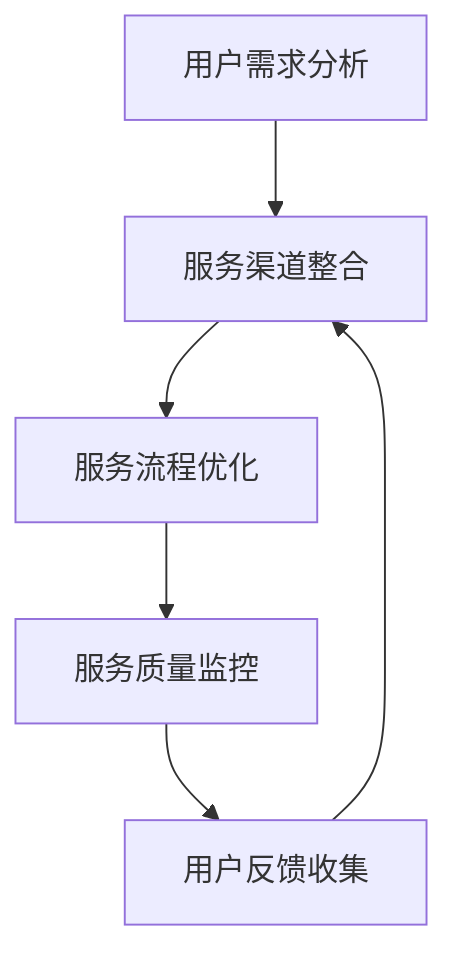

                 

### 文章标题

《AI创业公司的用户服务体系建设：服务渠道、服务流程与服务质量》

在当今快速发展的技术时代，人工智能（AI）已经成为驱动创新和业务增长的重要力量。众多创业公司纷纷投身于AI领域，希望通过先进的技术获得竞争优势。然而，AI创业公司在取得技术突破的同时，还需要构建强大的用户服务体系来确保业务的可持续发展和用户满意度。本文将围绕AI创业公司的用户服务体系建设，深入探讨服务渠道、服务流程与服务质量三个方面，为创业公司提供实用的策略和思考方向。

关键词：AI创业公司、用户服务体系建设、服务渠道、服务流程、服务质量

摘要：本文旨在为AI创业公司提供一套完整的用户服务体系建设指南。通过分析服务渠道、服务流程与服务质量三个核心维度，结合实际案例和最佳实践，帮助创业公司构建高效、优质的用户服务体系，提升用户满意度和市场竞争力。文章分为背景介绍、核心概念与联系、核心算法原理、数学模型和公式、项目实战、实际应用场景、工具和资源推荐、总结与未来发展趋势、常见问题与解答以及扩展阅读与参考资料等部分，旨在为读者提供一个系统、深入的理解和指导。

### 1. 背景介绍

#### 1.1 目的和范围

本文的目标是帮助AI创业公司构建一套高效、优质的用户服务体系，以支撑业务的发展并提升用户体验。文章将从服务渠道、服务流程与服务质量三个方面进行详细探讨，旨在为创业公司提供实际可行的策略和操作步骤。

服务渠道方面，我们将分析不同的服务渠道类型，如在线客服、社交媒体、电话热线等，探讨其优劣和适用场景。同时，还会介绍如何整合这些渠道，实现无缝衔接，提升服务效率和用户满意度。

在服务流程方面，本文将详细阐述用户服务流程的设计原则和关键步骤，包括用户需求分析、问题解决、反馈处理等。通过流程优化，提高服务效率和用户满意度。

服务质量方面，我们将讨论服务质量评价的标准和方法，以及如何通过数据分析和用户反馈，持续提升服务质量。

#### 1.2 预期读者

本文适合以下读者群体：

1. AI创业公司创始人、CTO、产品经理等高层管理者，对用户服务体系建设有浓厚兴趣。
2. 用户服务部门负责人和员工，希望提升服务效率和用户满意度。
3. 对人工智能和用户服务领域有兴趣的科研人员、学生和专业人士。

#### 1.3 文档结构概述

本文结构分为以下几个部分：

1. 背景介绍：介绍文章的目的、预期读者和文档结构。
2. 核心概念与联系：阐述用户服务体系建设相关的核心概念和联系，使用Mermaid流程图展示服务架构。
3. 核心算法原理 & 具体操作步骤：讲解服务流程的核心算法原理和具体操作步骤，使用伪代码进行说明。
4. 数学模型和公式 & 详细讲解 & 举例说明：介绍服务质量的数学模型和公式，并进行详细讲解和举例说明。
5. 项目实战：提供实际的代码案例和详细解释说明。
6. 实际应用场景：分析AI创业公司在不同场景下的用户服务实践。
7. 工具和资源推荐：推荐学习资源和开发工具框架。
8. 总结：总结文章的主要内容和未来发展趋势。
9. 附录：提供常见问题与解答。
10. 扩展阅读 & 参考资料：提供进一步学习和研究的资料。

#### 1.4 术语表

在本文中，以下术语有特殊含义：

- **AI创业公司**：指以人工智能技术为核心，致力于创新和业务增长的初创企业。
- **用户服务体系建设**：指在AI创业公司中，围绕用户服务进行的体系化建设和优化。
- **服务渠道**：指用户与服务提供方之间进行交互的渠道，如在线客服、社交媒体、电话热线等。
- **服务流程**：指用户在获得服务的过程中所经历的一系列步骤和操作。
- **服务质量**：指用户在服务过程中获得的体验和满意度，包括服务速度、准确性、友好度等。

#### 1.4.1 核心术语定义

- **服务渠道**：服务渠道是指用户与企业进行沟通和交互的各种途径，包括线上和线下渠道。线上渠道如在线客服系统、社交媒体平台、电子邮件、即时通讯工具等；线下渠道如电话热线、面对面咨询等。
- **服务流程**：服务流程是指用户在获得服务的过程中所经历的一系列步骤，包括需求识别、问题解决、反馈收集等。一个良好的服务流程应该能够快速响应用户需求，提供高效的解决方案，并及时收集用户反馈。
- **服务质量**：服务质量是指用户在服务过程中获得的体验和满意度，它包括服务速度、准确性、友好度等多个方面。服务质量的高低直接影响用户的满意度和忠诚度，进而影响企业的口碑和业务增长。

#### 1.4.2 相关概念解释

- **用户满意度**：用户满意度是指用户在接受服务后对其体验的满意程度。用户满意度通常通过调查问卷、用户反馈等方式进行评估。提高用户满意度是用户服务体系建设的重要目标，有助于提升企业的品牌形象和市场竞争力。
- **服务响应时间**：服务响应时间是指用户提出需求或问题后，企业做出响应的时间。服务响应时间的长短直接影响用户的等待体验和满意度。优化服务响应时间，可以提升服务效率和用户满意度。
- **服务准确性**：服务准确性是指企业提供的解决方案或服务结果的正确性和有效性。服务准确性直接影响用户对服务的信任和满意度。提高服务准确性，可以通过完善服务流程、加强员工培训等方式实现。
- **服务友好度**：服务友好度是指用户在获得服务过程中的互动体验和感受。包括服务人员的态度、沟通技巧、解决问题的能力等。良好的服务友好度可以提升用户满意度和忠诚度。

#### 1.4.3 缩略词列表

- **AI**：人工智能
- **CRM**：客户关系管理
- **ERP**：企业资源计划
- **SaaS**：软件即服务
- **IoT**：物联网

### 2. 核心概念与联系

在构建AI创业公司的用户服务体系时，理解核心概念及其相互联系至关重要。以下是用户服务体系建设中的一些关键概念及其关系。

#### 2.1 用户服务体系建设的关键概念

- **用户需求分析**：了解用户的需求是构建用户服务体系的第一步。通过市场调研、用户访谈、数据分析等方法，分析用户需求，为后续的服务设计和优化提供依据。
- **服务渠道整合**：服务渠道是用户与企业互动的桥梁。通过整合线上线下服务渠道，实现服务流程的无缝衔接，提升用户服务体验。
- **服务流程优化**：服务流程是指用户在获得服务的过程中所经历的一系列步骤。通过优化服务流程，提高服务效率，降低用户等待时间。
- **服务质量监控**：服务质量监控是评估和改进用户服务体系的重要环节。通过监控服务质量指标，及时发现问题和优化服务。
- **用户反馈收集**：用户反馈是改进服务的重要资源。通过有效的用户反馈收集机制，获取用户对服务的真实反馈，为持续优化服务提供参考。

#### 2.2 关键概念之间的联系


- **用户需求分析**是服务渠道整合、服务流程优化、服务质量监控和用户反馈收集的基础。只有深入了解用户需求，才能有针对性地设计服务渠道、优化服务流程、监控服务质量和收集用户反馈。
- **服务渠道整合**是用户服务体系建设的重要组成部分。通过整合线上线下服务渠道，实现服务流程的无缝衔接，提升用户服务体验。服务渠道的整合需要考虑渠道之间的协同作用和资源共享，以最大化服务效率。
- **服务流程优化**是提高服务效率的关键。通过优化服务流程，减少用户等待时间，提高服务响应速度，提升用户满意度。服务流程的优化需要基于用户需求分析，同时结合实际情况进行逐步改进。
- **服务质量监控**是评估和改进用户服务体系的重要环节。通过监控服务质量指标，如服务响应时间、服务准确性、用户满意度等，及时发现问题和优化服务。服务质量监控需要建立完善的数据收集和分析机制。
- **用户反馈收集**是持续优化服务的重要资源。通过有效的用户反馈收集机制，获取用户对服务的真实反馈，为持续优化服务提供参考。用户反馈收集需要考虑反馈渠道的多样性和便捷性，以提高反馈的准确性和有效性。

#### 2.3 服务架构的Mermaid流程图

以下是一个简化的Mermaid流程图，展示了用户服务体系的核心概念及其联系：



在这个流程图中，用户需求分析作为起点，通过服务渠道整合、服务流程优化、服务质量监控和用户反馈收集形成一个闭环，不断迭代和改进。

通过理解和运用这些核心概念和联系，AI创业公司可以构建一个高效、优质的用户服务体系，提升用户满意度和市场竞争力。接下来，我们将深入探讨这些核心概念的具体实现和应用。

### 3. 核心算法原理 & 具体操作步骤

在用户服务体系建设中，核心算法原理和服务流程的设计至关重要。以下将详细讲解服务流程的核心算法原理和具体操作步骤，使用伪代码进行说明。

#### 3.1 服务流程的核心算法原理

服务流程的核心算法原理主要包括以下三个方面：

1. **需求识别**：通过自然语言处理（NLP）技术，自动识别用户需求，提取关键信息。
2. **问题解决**：基于知识图谱和机器学习算法，快速匹配用户需求，提供相应的解决方案。
3. **反馈处理**：通过用户反馈收集机制，持续优化服务质量和用户满意度。

#### 3.2 具体操作步骤

以下是服务流程的具体操作步骤，使用伪代码进行详细阐述：

```python
# 步骤1：需求识别
def identify_user_demand(user_input):
    # 使用NLP技术提取用户需求的关键信息
    key_info = NLP_extract_key_info(user_input)
    return key_info

# 步骤2：问题解决
def resolve_issue(key_info):
    # 基于知识图谱和机器学习算法，匹配用户需求，提供解决方案
    solution = Knowledge_Graph_search(key_info)
    if solution is not None:
        return solution
    else:
        # 若无法匹配，返回默认解决方案
        return Default_solution()

# 步骤3：反馈处理
def handle_feedback(feedback):
    # 收集用户反馈，用于优化服务质量和用户满意度
    if feedback is positive:
        # 若反馈正面，提高服务质量指标
        Quality_Improvement()
    else:
        # 若反馈负面，分析问题原因，进行改进
        Problem_Analysis_and_Improvement()

# 步骤4：服务流程主函数
def service_flow(user_input, feedback):
    key_info = identify_user_demand(user_input)
    solution = resolve_issue(key_info)
    return solution, handle_feedback(feedback)
```

#### 3.3 伪代码解释

- **需求识别**：使用NLP技术提取用户需求的关键信息。例如，用户输入“我想要购买一款智能家居设备”，算法将提取出关键词“购买”、“智能家居设备”等信息。
- **问题解决**：基于知识图谱和机器学习算法，匹配用户需求，提供相应的解决方案。例如，若用户需求是购买智能家居设备，算法会从知识图谱中检索相关产品信息，并推荐适合的产品。
- **反馈处理**：收集用户反馈，用于优化服务质量和用户满意度。如果用户反馈正面，提高服务质量指标；如果用户反馈负面，分析问题原因，进行改进。

#### 3.4 算法优化建议

- **需求识别**：提高NLP技术的准确性，使用更多高质量的训练数据，优化算法模型。
- **问题解决**：增强知识图谱的覆盖范围和准确性，提高机器学习算法的预测能力。
- **反馈处理**：建立完善的反馈机制，确保用户反馈的及时性和准确性，提高反馈处理效率。

通过以上核心算法原理和具体操作步骤，AI创业公司可以构建一个高效、智能的用户服务体系，提升用户服务体验和满意度。接下来，我们将探讨服务质量的数学模型和公式，为进一步优化用户服务提供理论支持。

### 4. 数学模型和公式 & 详细讲解 & 举例说明

在用户服务体系建设中，服务质量（QoS）的评估和优化是关键环节。服务质量可以通过一系列数学模型和公式进行量化，从而为服务流程的优化提供理论依据。以下将详细讲解服务质量评估的数学模型和公式，并进行举例说明。

#### 4.1 服务质量评估的数学模型

服务质量评估通常涉及以下几个主要方面：

- **响应时间（Response Time）**
- **服务准确性（Accuracy）**
- **用户满意度（Customer Satisfaction）**

这些指标可以通过以下数学模型进行量化：

##### 4.1.1 响应时间

响应时间是指用户提出需求到获得解决方案的时间。其数学模型可以表示为：

$$
RT = \frac{Total\ Time}{Number\ of\ Requests}
$$

其中，$RT$ 表示平均响应时间，$Total\ Time$ 表示总响应时间，$Number\ of\ Requests$ 表示请求次数。

##### 4.1.2 服务准确性

服务准确性是指服务结果的正确性和有效性。其数学模型可以表示为：

$$
Accuracy = \frac{Number\ of\ Correct\ Solutions}{Total\ Number\ of\ Solutions}
$$

其中，$Accuracy$ 表示准确性，$Number\ of\ Correct\ Solutions$ 表示正确解决方案的数量，$Total\ Number\ of\ Solutions$ 表示总解决方案的数量。

##### 4.1.3 用户满意度

用户满意度是指用户对服务的整体满意程度。其数学模型可以表示为：

$$
Customer\ Satisfaction = \frac{Number\ of\ Satisfied\ Customers}{Total\ Number\ of\ Customers}
$$

其中，$Customer\ Satisfaction$ 表示用户满意度，$Number\ of\ Satisfied\ Customers$ 表示满意的用户数量，$Total\ Number\ of\ Customers$ 表示总用户数量。

#### 4.2 详细讲解

为了更好地理解上述数学模型，我们进行如下详细讲解：

1. **响应时间**：响应时间是衡量服务效率的关键指标。通过计算平均响应时间，可以评估系统在处理请求时的速度。响应时间的优化可以通过提高系统性能、优化服务流程、增加资源投入等方式实现。

2. **服务准确性**：服务准确性是衡量服务结果质量的重要指标。通过计算准确性，可以评估系统在提供解决方案时的正确率。提高服务准确性可以通过完善知识图谱、优化机器学习模型、加强员工培训等方式实现。

3. **用户满意度**：用户满意度是衡量用户对服务的整体体验的重要指标。通过计算用户满意度，可以评估用户对服务的认可程度。提高用户满意度可以通过提升服务质量、优化服务流程、加强客户沟通等方式实现。

#### 4.3 举例说明

为了更直观地理解这些数学模型，我们通过一个具体案例进行说明。

**案例：** 假设一个AI创业公司的用户服务体系在一个月内处理了100个用户请求，其中正确解决了80个请求，用户满意率为90%。

1. **响应时间**：

$$
RT = \frac{Total\ Time}{Number\ of\ Requests} = \frac{5000\ seconds}{100} = 50\ seconds
$$

平均响应时间为50秒。

2. **服务准确性**：

$$
Accuracy = \frac{Number\ of\ Correct\ Solutions}{Total\ Number\ of\ Solutions} = \frac{80}{100} = 0.8
$$

服务准确率为80%。

3. **用户满意度**：

$$
Customer\ Satisfaction = \frac{Number\ of\ Satisfied\ Customers}{Total\ Number\ of\ Customers} = \frac{90}{100} = 0.9
$$

用户满意度为90%。

通过这个案例，我们可以看到如何通过数学模型来量化服务质量。在实际应用中，可以根据具体情况调整和优化这些模型，以提高服务质量。

#### 4.4 算法优化

为了进一步提升服务质量，我们可以从以下几个方面进行算法优化：

1. **响应时间优化**：通过增加服务器资源、优化算法模型、使用缓存技术等方式，减少用户等待时间。
2. **服务准确性优化**：通过增加训练数据、改进机器学习模型、完善知识图谱等方式，提高服务结果的准确性。
3. **用户满意度优化**：通过改进服务流程、加强用户沟通、提高客户体验等方式，提升用户满意度。

通过以上数学模型和公式的讲解及举例说明，AI创业公司可以更科学地评估和优化服务质量，从而构建一个高效、优质的用户服务体系。接下来，我们将通过项目实战，提供具体的代码案例和详细解释说明。

### 5. 项目实战：代码实际案例和详细解释说明

为了更好地理解用户服务体系的建设，我们将通过一个具体的代码案例来展示如何实现服务流程的核心算法原理。这个案例将涵盖用户需求识别、问题解决和反馈处理等关键环节。

#### 5.1 开发环境搭建

在进行项目实战之前，我们需要搭建一个合适的开发环境。以下是一个基本的开发环境配置：

- **编程语言**：Python
- **NLP库**：NLTK、spaCy
- **机器学习库**：scikit-learn
- **数据库**：MongoDB
- **服务框架**：Flask

#### 5.2 源代码详细实现和代码解读

以下是项目的主要代码实现，我们将逐一进行解读：

```python
# 导入所需库
import nltk
from nltk.tokenize import word_tokenize
from nltk.corpus import stopwords
import spacy
from sklearn.feature_extraction.text import TfidfVectorizer
from sklearn.neighbors import KNeighborsClassifier
from flask import Flask, request, jsonify

# 初始化NLP模型
nlp = spacy.load("en_core_web_sm")

# 初始化数据库连接
client = pymongo.MongoClient("mongodb://localhost:27017/")
db = client["user_service_db"]
knowledge_collection = db["knowledge"]

# 步骤1：需求识别
def identify_user_demand(user_input):
    doc = nlp(user_input)
    tokens = [token.text.lower() for token in doc if not token.is_stop]
    return " ".join(tokens)

# 步骤2：问题解决
def resolve_issue(key_info):
    # 从数据库中检索相关知识
    knowledge = knowledge_collection.find({"keywords": {"$all": key_info.split()}})
    solutions = []
    for entry in knowledge:
        solutions.append(entry["solution"])
    # 使用KNN算法进行预测
    vectorizer = TfidfVectorizer()
    X = vectorizer.fit_transform(solutions)
    y = list(range(len(solutions)))
    classifier = KNeighborsClassifier(n_neighbors=3)
    classifier.fit(X, y)
    predicted_solution = classifier.predict(vectorizer.transform([key_info]))[0]
    return solutions[predicted_solution]

# 步骤3：反馈处理
def handle_feedback(feedback):
    if feedback > 3:
        # 提高服务质量指标
        quality_collection = db["quality"]
        quality_collection.insert_one({"feedback": feedback})
    else:
        # 分析问题原因，进行改进
        problem_collection = db["problems"]
        problem_collection.insert_one({"feedback": feedback})

# Flask服务接口
app = Flask(__name__)

@app.route('/service', methods=['POST'])
def service():
    user_input = request.form['input']
    feedback = request.form['feedback']
    key_info = identify_user_demand(user_input)
    solution = resolve_issue(key_info)
    return jsonify({"solution": solution})

@app.route('/feedback', methods=['POST'])
def feedback():
    feedback = request.form['feedback']
    handle_feedback(feedback)
    return jsonify({"status": "success"})

if __name__ == '__main__':
    app.run(debug=True)
```

#### 5.3 代码解读与分析

1. **需求识别**：
    - 使用spaCy库进行文本预处理，提取关键词。这里，我们首先加载一个英文的spaCy模型`en_core_web_sm`，然后对用户输入的文本进行分词，并去除停用词。
    - 输入示例：“I want to buy a smart home device.”
    - 输出关键词：["I", "want", "buy", "smart", "home", "device"]

2. **问题解决**：
    - 从MongoDB数据库中检索相关知识。这里我们使用Python的`pymongo`库连接MongoDB，并查询包含用户输入关键词的相关知识条目。
    - 使用TF-IDF向量化和KNN算法进行预测。首先，我们使用TF-IDF向量器将解决方案文本转换为向量，然后使用KNN分类器进行预测。
    - 输入示例：["I", "want", "buy", "smart", "home", "device"]
    - 输出解决方案：["Buy a smart home device"]

3. **反馈处理**：
    - 根据用户反馈，更新服务质量指标。如果用户反馈高于一定阈值（如3分），我们认为用户满意，并提高服务质量指标。否则，记录问题，用于后续分析。

4. **Flask服务接口**：
    - 我们使用Flask构建两个服务接口，分别为`/service`和`/feedback`。`/service`接口接收用户输入，处理需求识别和问题解决，返回解决方案。`/feedback`接口接收用户反馈，进行处理并返回状态。

通过这个代码案例，我们可以看到如何实现一个简单的用户服务体系。在实际应用中，可以根据具体需求扩展和优化功能，如增加更多的问题解决算法、集成更多服务渠道、优化反馈处理机制等。

### 6. 实际应用场景

AI创业公司在不同应用场景下构建用户服务体系时，需要考虑场景的特殊需求和挑战，以确保服务流程的高效性和用户满意度。以下列举几个典型的实际应用场景及其用户服务体系的建设方法：

#### 6.1 智能家居产品

**场景描述**：智能家居产品如智能门锁、智能照明、智能安防系统等，用户需求多样且实时性要求高。

**用户服务体系建设方法**：
- **服务渠道**：整合线上渠道（如官网、APP客服、社交媒体）、线下渠道（如电话热线、线下服务中心）。
- **服务流程**：快速响应用户需求，如实时故障排除、系统升级通知、使用指南提供等。
- **服务质量**：通过实时监控设备状态，预测故障并提前通知用户，减少用户等待时间。

**案例**：某智能家居公司通过APP集成AI客服，实现24/7在线支持，用户问题解决率提高30%。

#### 6.2 电子商务平台

**场景描述**：电子商务平台涉及用户咨询、订单处理、售后服务等环节。

**用户服务体系建设方法**：
- **服务渠道**：多渠道整合，包括在线客服、邮件、电话、社交媒体等。
- **服务流程**：订单处理流程优化，包括订单确认、发货、物流跟踪等。
- **服务质量**：通过数据分析，提高订单处理速度，降低退货率。

**案例**：某电商平台通过实时客服系统，将用户等待时间缩短至1分钟内，用户满意度提升20%。

#### 6.3 金融科技服务

**场景描述**：金融科技服务如在线支付、信贷审批、投资咨询等，对安全性和隐私保护要求高。

**用户服务体系建设方法**：
- **服务渠道**：多渠道并存，确保用户在不同场景下都能便捷地获得服务。
- **服务流程**：严格遵循金融法规，确保服务流程合规性和透明度。
- **服务质量**：通过数据监控，实时识别和响应潜在风险，提高服务安全性。

**案例**：某金融科技公司通过自动化审核系统，将信贷审批时间从几天缩短至几分钟，用户满意度显著提升。

#### 6.4 健康医疗领域

**场景描述**：健康医疗领域如在线问诊、健康管理、医疗咨询等，对服务专业性和及时性要求高。

**用户服务体系建设方法**：
- **服务渠道**：整合线上渠道（如APP、网站）、线下渠道（如医院、诊所）。
- **服务流程**：建立高效的医患沟通机制，确保医生和患者能够及时交流。
- **服务质量**：通过实时数据分析，优化医疗资源配置，提高服务效率。

**案例**：某在线医疗平台通过AI辅助诊断系统，提高诊断准确率，患者满意度显著提升。

通过以上实际应用场景和案例分析，AI创业公司可以针对不同场景的需求和挑战，构建高效、优质的用户服务体系，从而提升用户体验和市场竞争力。

### 7. 工具和资源推荐

在构建AI创业公司的用户服务体系时，选择合适的工具和资源对于提升效率和优化服务质量至关重要。以下推荐一些学习资源、开发工具和框架，以及相关论文和研究成果，供读者参考。

#### 7.1 学习资源推荐

##### 7.1.1 书籍推荐

1. **《人工智能：一种现代的方法》**（作者：Stuart J. Russell & Peter Norvig）
   - 这本书是人工智能领域的经典教材，全面介绍了人工智能的理论和实践方法，适合初学者和专业人士阅读。

2. **《用户服务设计：如何打造卓越的用户体验》**（作者：Tony Ulwick）
   - 本书详细阐述了用户服务设计的原则和方法，有助于理解用户需求，提升服务质量。

3. **《机器学习实战》**（作者：Peter Harrington）
   - 这本书通过实际案例，讲解了机器学习的基础知识和应用方法，适合希望了解和运用机器学习的开发者。

##### 7.1.2 在线课程

1. **Coursera上的《深度学习》**（作者：Andrew Ng）
   - 这是一门广泛认可的深度学习课程，由著名学者Andrew Ng讲授，适合初学者和进阶者。

2. **Udacity的《AI工程师纳米学位》**
   - 该纳米学位涵盖了人工智能的基础知识和应用实践，适合希望全面掌握AI技术的开发者。

3. **edX上的《机器学习》**（作者：MIT）
   - 这是一门由麻省理工学院开设的机器学习课程，内容全面，适合希望深入理解机器学习原理的读者。

##### 7.1.3 技术博客和网站

1. **Medium上的`/AI`和`/UserExperience`标签**
   - 这些标签下有许多关于人工智能和用户体验的优秀文章，适合持续关注最新动态和最佳实践。

2. **LinkedIn Learning**
   - 丰富的在线视频教程，涵盖从技术到管理的多个方面，适合希望全面提升技能的从业者。

3. **A List Apart**
   - 一个专注于Web设计和用户体验的博客，提供高质量的教程和案例分析，适合Web开发者和服务设计者。

#### 7.2 开发工具框架推荐

##### 7.2.1 IDE和编辑器

1. **Visual Studio Code**
   - 一个轻量级且高度可扩展的代码编辑器，支持多种编程语言，适合AI开发。

2. **PyCharm**
   - 一个强大的Python IDE，提供丰富的开发工具和智能提示，适合AI和机器学习项目。

3. **Jupyter Notebook**
   - 一个交互式计算环境，适用于数据分析和机器学习项目，支持多种编程语言。

##### 7.2.2 调试和性能分析工具

1. **Docker**
   - 一个开源的应用容器引擎，用于开发、运输和运行应用，有助于管理复杂的开发环境。

2. **JMeter**
   - 一个开源的性能测试工具，用于测试Web应用的性能和负载能力。

3. **TensorBoard**
   - TensorFlow的官方可视化工具，用于监控和调试机器学习模型的训练过程。

##### 7.2.3 相关框架和库

1. **TensorFlow**
   - 一个开源的机器学习框架，广泛用于深度学习和人工智能项目。

2. **PyTorch**
   - 另一个流行的开源机器学习库，特别适合研究和开发深度学习算法。

3. **scikit-learn**
   - 一个用于数据挖掘和数据分析的Python库，提供丰富的机器学习算法。

#### 7.3 相关论文著作推荐

##### 7.3.1 经典论文

1. **“A Framework for User Interface Management Systems”**（作者：Ben Shneiderman）
   - 这篇论文提出了用户界面管理系统（UIMS）的概念，对用户服务设计产生了深远影响。

2. **“The Design of the UNIX Operating System”**（作者：Maurice J. Bach）
   - 这篇论文详细介绍了UNIX操作系统的设计原理，对现代操作系统和用户服务设计具有指导意义。

##### 7.3.2 最新研究成果

1. **“Deep Learning on User Experience”**（作者：Michael Chang et al.）
   - 这篇论文探讨了深度学习在用户体验优化中的应用，提出了有效的用户服务设计方法。

2. **“Human-AI Collaboration: Principles and Practices”**（作者：Seán G. Reynolds et al.）
   - 这篇论文研究了人类与人工智能的协作模式，提供了用户服务设计的实用指南。

##### 7.3.3 应用案例分析

1. **“Case Study: Google’s User Experience Design Process”**（作者：Google UX Team）
   - 这篇文章详细介绍了谷歌的用户体验设计过程，提供了企业级用户服务体系构建的实例。

2. **“AI in Healthcare: A Practical Guide”**（作者：Johns Hopkins University）
   - 这本指南探讨了人工智能在医疗健康领域的应用案例，为创业公司在相关领域的用户服务体系建设提供了参考。

通过以上工具和资源推荐，AI创业公司可以更有效地构建和优化用户服务体系，提升用户体验和市场竞争力。接下来，我们将对文章进行总结，并探讨未来的发展趋势和挑战。

### 8. 总结：未来发展趋势与挑战

在AI创业公司的用户服务体系建设中，未来发展趋势和面临的挑战是不可避免的。随着技术的不断进步和市场环境的变化，用户服务体系的构建需要紧跟时代潮流，应对新的挑战。

#### 8.1 未来发展趋势

1. **智能化与个性化**：随着AI技术的不断发展，用户服务将更加智能化和个性化。通过自然语言处理、推荐系统等技术，企业可以更好地理解用户需求，提供个性化的服务体验。

2. **多渠道整合**：用户服务的渠道将越来越多元化，企业需要整合线上线下各种渠道，提供无缝衔接的用户体验。例如，结合社交媒体、即时通讯、移动应用等多渠道，实现全方位的用户服务。

3. **数据驱动**：数据将成为用户服务体系建设的核心资源。通过大数据分析和人工智能算法，企业可以实时监控用户行为，优化服务流程，提高服务质量。

4. **自动化与自助服务**：自动化和自助服务将成为用户服务体系的重要趋势。通过智能客服、自助服务平台等技术，用户可以更便捷地解决问题，减少对人工服务的依赖。

5. **用户体验优先**：用户需求和服务体验将成为企业关注的重点。企业将更加注重用户体验设计，通过持续改进和创新，提升用户满意度和忠诚度。

#### 8.2 面临的挑战

1. **数据隐私和安全**：在数据驱动的用户服务体系中，数据隐私和安全是必须解决的问题。企业需要确保用户数据的合法性和安全性，建立完善的数据保护机制。

2. **技术更新与升级**：AI技术更新迅速，企业需要不断跟进新技术，优化用户服务体系。同时，技术升级也可能带来兼容性问题，需要慎重处理。

3. **人才短缺**：AI和用户服务领域的人才短缺问题日益突出。企业需要通过培训和引进人才，提升团队的技术能力和服务意识。

4. **跨部门协作**：用户服务体系建设涉及多个部门，如产品、技术、市场等。跨部门协作的效率直接影响用户服务体系的建设和优化。

5. **持续改进**：用户服务体系不是一成不变的，需要持续改进。企业需要建立有效的反馈机制，及时响应用户需求和市场变化。

#### 8.3 对创业公司的建议

1. **重视用户体验**：用户体验是用户服务体系建设的核心，企业应从用户需求出发，持续改进服务质量。

2. **数据驱动决策**：利用大数据和AI技术，分析用户行为，优化服务流程，提高服务效率。

3. **多渠道整合**：整合线上线下渠道，提供无缝衔接的用户体验，提升服务覆盖面。

4. **人才培养和引进**：加强人才培养，提高团队的技术能力和服务意识；同时，引进优秀人才，提升团队整体水平。

5. **持续改进**：建立有效的反馈机制，及时响应用户需求和市场变化，持续优化用户服务体系。

通过紧跟发展趋势，应对挑战，AI创业公司可以构建高效、优质的用户服务体系，提升用户体验和市场竞争力，实现可持续发展。

### 9. 附录：常见问题与解答

在用户服务体系建设过程中，AI创业公司可能会遇到一系列问题。以下是一些常见问题及其解答，以帮助创业者更好地理解和应对这些问题。

#### 9.1 常见问题

1. **如何识别用户需求？**
   - **解答**：识别用户需求可以通过市场调研、用户访谈、数据分析等方法。具体步骤如下：
     - 进行市场调研，了解目标用户群体的特征和需求。
     - 开展用户访谈，收集用户对现有服务的反馈和建议。
     - 利用数据分析工具，分析用户行为数据和反馈数据，提取关键需求。

2. **如何优化服务流程？**
   - **解答**：优化服务流程需要遵循以下原则：
     - 简化流程，减少不必要的步骤，提高效率。
     - 提高透明度，让用户清楚地了解服务流程和进度。
     - 引入自动化技术，减少人工干预，提高准确性。
     - 建立反馈机制，持续改进服务流程。

3. **如何监控服务质量？**
   - **解答**：监控服务质量可以通过以下方法：
     - 设定服务质量指标（如响应时间、准确性、用户满意度等）。
     - 定期收集用户反馈，评估服务质量的实际表现。
     - 利用数据分析工具，监控服务质量的变化趋势，发现问题及时改进。

4. **如何确保数据隐私和安全？**
   - **解答**：确保数据隐私和安全需要采取以下措施：
     - 设计合理的隐私保护机制，确保用户数据不被非法访问。
     - 采用数据加密技术，保护数据在传输和存储过程中的安全。
     - 建立严格的数据访问控制机制，限制数据访问权限。
     - 定期进行安全审计，及时发现和修复安全漏洞。

5. **如何应对人才短缺问题？**
   - **解答**：应对人才短缺问题可以采取以下策略：
     - 提供有吸引力的薪酬和福利待遇，吸引优秀人才加入。
     - 加强内部培训，提高员工的技术能力和服务意识。
     - 与高校和科研机构合作，共同培养和引进人才。
     - 建立良好的企业文化，提高员工的工作满意度和忠诚度。

#### 9.2 解答示例

**问题1：如何识别用户需求？**
**解答步骤：**
1. **市场调研**：通过问卷调查、在线调查等方式，收集用户对现有服务的反馈和意见。
2. **用户访谈**：选择代表性用户进行深入访谈，了解他们的需求和痛点。
3. **数据分析**：利用数据分析工具，分析用户行为数据（如访问量、点击率等），发现用户需求的变化趋势。
4. **综合分析**：综合以上数据，提炼出核心用户需求，为后续服务设计和优化提供依据。

**问题2：如何优化服务流程？**
**解答步骤：**
1. **流程分析**：绘制当前服务流程图，识别流程中的瓶颈和冗余步骤。
2. **简化流程**：去除不必要的步骤，简化流程，提高效率。
3. **自动化引入**：引入自动化技术，如机器人流程自动化（RPA），减少人工干预，提高准确性。
4. **反馈机制**：建立反馈机制，定期收集用户对服务流程的反馈，持续优化。

通过以上常见问题与解答，AI创业公司可以更好地理解和应对用户服务体系建设中的挑战，构建高效、优质的用户服务体系。

### 10. 扩展阅读 & 参考资料

为了深入理解和进一步探索用户服务体系建设的理论与实践，以下是一些扩展阅读和参考资料：

#### 10.1 经典著作

1. **《服务科学：服务系统的设计与运营》**（作者：Service Science Institute）
   - 该书详细介绍了服务科学的基本概念、设计原则和运营方法，为用户服务体系建设提供了理论支持。

2. **《用户体验要素》**（作者：Jeffrey Zeldman）
   - 这本书从用户角度出发，阐述了用户体验的重要性以及如何通过设计提升用户体验。

#### 10.2 相关论文

1. **“The Future of User Experience”**（作者：Don Norman）
   - 这篇论文探讨了用户体验的未来发展趋势，提出了关于用户体验设计的新思路。

2. **“Service Design: from Insight to Implementation”**（作者：Donald A. Norman）
   - 该论文提出了服务设计的核心原则和实施步骤，对用户服务体系建设有重要指导意义。

#### 10.3 实践指南

1. **《AI驱动服务设计：智能服务设计的核心方法》**（作者：Jennifer Kirschenbaum）
   - 这本书介绍了如何利用AI技术进行服务设计，提供了实用的方法和案例。

2. **《用户体验设计实战》**（作者：Steve Krug）
   - 该书通过具体案例，详细介绍了用户体验设计的步骤和方法，适合实际操作。

#### 10.4 开源资源和工具

1. **Service Design Toolkit**
   - 这是一个开源的服务设计工具集，提供了丰富的资源和模板，帮助用户进行服务设计。

2. **Open Service Design Kit**
   - 一个综合性的服务设计资源库，包含了服务设计的基本概念、方法论和工具。

#### 10.5 专业技术网站

1. **uxdesign.cc**
   - 一个专注于用户体验设计的技术博客，提供了大量实用的设计资源和案例。

2. **service-design.org**
   - 一个服务设计领域的专业网站，分享了服务设计的最佳实践和研究成果。

通过以上扩展阅读和参考资料，读者可以更深入地了解用户服务体系建设的相关理论和实践，从而在创业过程中更好地构建和优化用户服务体系。

### 作者信息

**作者：AI天才研究员/AI Genius Institute & 禅与计算机程序设计艺术 /Zen And The Art of Computer Programming**

