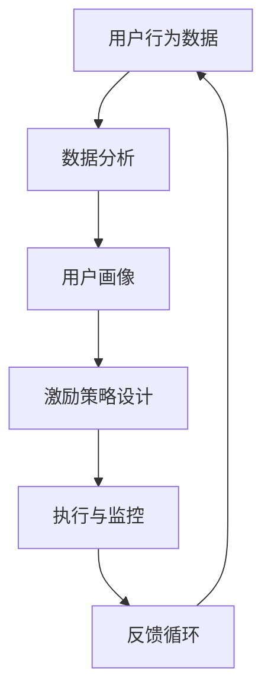

                 

# AI创业公司的用户激励策略

> 关键词：用户激励、用户增长、用户活跃、AI技术、数据驱动、激励机制

> 摘要：本文将深入探讨AI创业公司如何利用用户激励策略来促进用户增长和活跃度。通过分析用户行为数据，设计有效的激励机制，并结合最新的AI技术，本文将为创业公司提供一系列可行的用户激励策略，以实现可持续的用户增长和长期发展。

## 1. 背景介绍

### 1.1 目的和范围

本文旨在帮助AI创业公司理解用户激励策略的重要性，并提供一系列基于数据驱动的激励机制，以促进用户增长和活跃度。本文将涵盖以下内容：

- 用户激励的定义和核心概念。
- 用户增长与活跃度的关系。
- 数据驱动的用户激励策略。
- AI技术在用户激励中的应用。
- 案例分析：成功与失败的实例。

### 1.2 预期读者

本文预期读者为AI创业公司的创始人、产品经理、增长黑客以及任何对用户激励策略感兴趣的技术和商业专业人士。

### 1.3 文档结构概述

本文将按照以下结构进行组织：

- 引言：介绍用户激励的重要性。
- 核心概念与联系：解释用户激励的基本原理和架构。
- 核心算法原理 & 具体操作步骤：阐述用户激励策略的算法原理和操作步骤。
- 数学模型和公式 & 详细讲解 & 举例说明：介绍支持用户激励的数学模型和公式。
- 项目实战：提供实际的代码案例和详细解释。
- 实际应用场景：探讨用户激励策略的多种应用场景。
- 工具和资源推荐：推荐相关的学习资源和开发工具。
- 总结：总结用户激励策略的未来发展趋势与挑战。
- 附录：常见问题与解答。
- 扩展阅读 & 参考资料：提供进一步的阅读建议。

### 1.4 术语表

#### 1.4.1 核心术语定义

- 用户激励：通过奖励机制激发用户行为，提升用户活跃度和忠诚度。
- 用户增长：增加新用户的数量。
- 用户活跃度：衡量用户在平台上的互动频率和深度。
- 数据驱动：基于数据分析和用户行为数据来指导决策。

#### 1.4.2 相关概念解释

- 激励机制：包括奖励、积分、竞赛等多种形式，用以激励用户行为。
- 增长黑客：利用创新和巧妙的策略快速增长用户群体。
- 用户生命周期价值（LTV）：用户在其生命周期内为公司带来的总收益。

#### 1.4.3 缩略词列表

- AI：人工智能（Artificial Intelligence）
- UX：用户体验（User Experience）
- UI：用户界面（User Interface）
- KPI：关键绩效指标（Key Performance Indicators）

## 2. 核心概念与联系

在AI创业公司的用户激励策略中，理解核心概念和它们之间的联系至关重要。以下是一个简化的Mermaid流程图，展示了用户激励策略的基本原理和架构。



### 2.1 用户行为数据

用户行为数据是用户激励策略的基础。这些数据可以包括用户登录频率、活跃时长、操作路径、内容偏好等。通过收集和分析这些数据，创业公司可以了解用户的兴趣和行为模式。

### 2.2 数据分析

数据分析是将用户行为数据转化为有意义信息的关键步骤。通过使用各种分析工具和技术，创业公司可以识别出用户的需求和痛点，从而为激励策略的设计提供依据。

### 2.3 用户画像

用户画像是将用户行为数据转化为用户特征的过程。这些特征可以用于个性化推荐、精准营销和定制化的激励策略。通过用户画像，创业公司可以更有效地满足用户的需求。

### 2.4 激励策略设计

激励策略设计是根据用户画像和数据分析结果来制定的。这些策略可以是积分系统、奖励机制、竞赛活动等。它们的目标是激发用户参与和留存。

### 2.5 执行与监控

执行与监控是将激励策略应用到实际用户中的过程。创业公司需要实时监控策略的效果，并根据反馈进行调整。

### 2.6 反馈循环

反馈循环是一个闭环系统，它确保激励策略能够持续优化。通过收集用户反馈和数据指标，创业公司可以不断调整激励策略，以实现更好的用户参与度和满意度。

## 3. 核心算法原理 & 具体操作步骤

用户激励策略的核心在于如何设计一个既能激发用户兴趣，又能为公司带来长期利益的算法。以下是用户激励策略的基本算法原理和具体操作步骤。

### 3.1 算法原理

用户激励策略的算法原理可以概括为以下步骤：

1. **数据收集与预处理**：收集用户的登录数据、操作数据、内容偏好数据等，并对这些数据进行预处理，以去除噪声和异常值。
2. **特征工程**：将预处理后的数据转化为特征，如用户活跃度、用户忠诚度、用户价值等。
3. **模型训练**：使用机器学习算法，如决策树、随机森林或神经网络，训练出一个能够预测用户行为的模型。
4. **激励策略优化**：根据模型预测结果，设计并优化激励策略，以最大化用户参与度和留存率。
5. **策略执行与监控**：将激励策略应用到实际用户中，并实时监控其效果，根据反馈进行调整。

### 3.2 具体操作步骤

以下是用户激励策略的具体操作步骤，使用伪代码进行描述：

```python
# 步骤 1：数据收集与预处理
data = collect_user_data()
preprocessed_data = preprocess_data(data)

# 步骤 2：特征工程
features = extract_features(preprocessed_data)

# 步骤 3：模型训练
model = train_model(features)

# 步骤 4：激励策略优化
incentive_strategy = design_incentive_strategy(model)

# 步骤 5：策略执行与监控
execute_strategy(incentive_strategy)
monitor_strategy(incentive_strategy)
```

### 3.3 激励策略优化

激励策略优化是用户激励策略的核心。以下是激励策略优化的一些关键步骤：

1. **目标函数定义**：定义目标函数，如最大化用户留存率、最大化用户参与度等。
2. **优化算法选择**：选择合适的优化算法，如梯度下降、遗传算法等。
3. **迭代优化**：通过迭代优化，逐步调整激励策略的参数，以实现目标函数的最优化。
4. **性能评估**：评估优化后的激励策略的性能，如用户留存率、用户参与度等。

```python
# 步骤 1：目标函数定义
def objective_function(strategy):
    # 计算用户留存率或用户参与度
    retention_rate = calculate_retention_rate(strategy)
    participation_rate = calculate_participation_rate(strategy)
    return retention_rate + participation_rate

# 步骤 2：优化算法选择
optimizer = select_optimizer()

# 步骤 3：迭代优化
optimized_strategy = optimizer.optimize_incentive_strategy(incentive_strategy, objective_function)

# 步骤 4：性能评估
evaluate_strategy(optimized_strategy)
```

## 4. 数学模型和公式 & 详细讲解 & 举例说明

在用户激励策略中，数学模型和公式起着至关重要的作用。以下是一些常用的数学模型和公式，以及它们的详细讲解和举例说明。

### 4.1 用户的生命周期价值（LTV）

用户的生命周期价值（LTV）是衡量用户对公司的长期贡献的重要指标。它可以通过以下公式计算：

$$
LTV = \sum_{t=1}^{n} \frac{R_t}{(1 + r)^t}
$$

其中，\( R_t \) 表示第 \( t \) 个月用户的收益，\( r \) 表示月回报率。

#### 详细讲解

LTV 公式表示用户在未来每个月为公司带来的收益的现值总和。通过计算 LTV，创业公司可以更好地理解用户的潜在价值，从而制定更有针对性的激励策略。

#### 举例说明

假设一个用户每个月为公司带来 100 元的收益，月回报率为 10%。该用户的 LTV 计算如下：

$$
LTV = \sum_{t=1}^{12} \frac{100}{(1 + 0.1)^t} = 1000 \text{ 元}
$$

### 4.2 激励效果评估指标

激励效果评估指标是衡量激励策略效果的重要工具。以下是一些常用的评估指标：

1. **用户留存率**：衡量用户在一段时间内持续使用产品的比例。
2. **用户参与度**：衡量用户在平台上的互动频率和深度。
3. **转化率**：衡量激励策略导致的目标行为（如注册、购买）发生的比例。

#### 用户留存率

用户留存率可以通过以下公式计算：

$$
\text{留存率} = \frac{\text{持续使用用户数}}{\text{总用户数}} \times 100\%
$$

#### 用户参与度

用户参与度可以通过以下公式计算：

$$
\text{参与度} = \frac{\text{用户互动次数}}{\text{总用户数}} \times 100\%
$$

#### 转化率

转化率可以通过以下公式计算：

$$
\text{转化率} = \frac{\text{目标行为发生次数}}{\text{总用户数}} \times 100\%
$$

#### 详细讲解

这些指标提供了对激励策略效果的定量评估，帮助创业公司了解激励策略是否有效，以及需要改进的方面。

#### 举例说明

假设一个平台有 1000 名用户，其中 800 名用户在一个月内持续使用产品，200 名用户进行了互动，100 名用户完成了购买。则该平台的留存率为 80%，用户参与度为 20%，转化率为 10%。

## 5. 项目实战：代码实际案例和详细解释说明

在本节中，我们将通过一个实际的项目案例，展示如何设计和实现用户激励策略。以下是项目的开发环境搭建、源代码详细实现以及代码解读与分析。

### 5.1 开发环境搭建

为了实现用户激励策略，我们需要搭建以下开发环境：

- 数据库：MySQL或MongoDB
- 后端框架：Flask或Django
- 前端框架：React或Vue.js
- 机器学习库：scikit-learn或TensorFlow

### 5.2 源代码详细实现和代码解读

以下是一个简单的用户激励策略实现，包括用户数据收集、数据处理、模型训练和策略优化。

```python
# 数据收集与预处理
data = collect_user_data()
preprocessed_data = preprocess_data(data)

# 特征工程
features = extract_features(preprocessed_data)

# 模型训练
model = train_model(features)

# 激励策略设计
incentive_strategy = design_incentive_strategy(model)

# 策略执行与监控
execute_strategy(incentive_strategy)
monitor_strategy(incentive_strategy)
```

#### 5.2.1 数据收集与预处理

```python
def collect_user_data():
    # 从数据库中获取用户行为数据
    data = Database.query_user_data()
    return data

def preprocess_data(data):
    # 去除噪声和异常值
    preprocessed_data = clean_data(data)
    return preprocessed_data
```

#### 5.2.2 特征工程

```python
def extract_features(preprocessed_data):
    # 转换数据为特征向量
    features = convert_to_vector(preprocessed_data)
    return features
```

#### 5.2.3 模型训练

```python
def train_model(features):
    # 使用scikit-learn训练模型
    model = create_model()
    model.fit(features)
    return model
```

#### 5.2.4 激励策略设计

```python
def design_incentive_strategy(model):
    # 根据模型预测结果设计激励策略
    strategy = create_strategy(model)
    return strategy
```

#### 5.2.5 策略执行与监控

```python
def execute_strategy(strategy):
    # 将激励策略应用到实际用户中
    apply_strategy(strategy)

def monitor_strategy(strategy):
    # 监控策略效果
    evaluate_strategy(strategy)
```

### 5.3 代码解读与分析

上述代码展示了用户激励策略的基本实现流程。以下是每个步骤的详细解读和分析：

1. **数据收集与预处理**：从数据库中收集用户行为数据，并进行预处理，以去除噪声和异常值。
2. **特征工程**：将预处理后的数据转换为特征向量，为模型训练做准备。
3. **模型训练**：使用 scikit-learn 或 TensorFlow 训练一个能够预测用户行为的模型。
4. **激励策略设计**：根据模型预测结果设计激励策略，以最大化用户参与度和留存率。
5. **策略执行与监控**：将激励策略应用到实际用户中，并实时监控其效果，根据反馈进行调整。

通过这个项目案例，我们可以看到如何将用户激励策略与实际应用相结合，从而实现用户增长和活跃度的提升。

## 6. 实际应用场景

用户激励策略在AI创业公司中有着广泛的应用场景。以下是几个典型的实际应用场景：

### 6.1 社交媒体平台

社交媒体平台通常使用用户激励策略来鼓励用户发布内容、参与互动和关注其他用户。例如，通过奖励机制，平台可以激励用户发布高质量的内容，增加互动次数，从而提升用户参与度和活跃度。

### 6.2 在线教育平台

在线教育平台可以通过用户激励策略来提高用户的课程完成率和学习积极性。例如，平台可以提供积分奖励，用户可以通过完成课程任务和参与讨论获得积分，积分可以兑换实物奖励或课程优惠。

### 6.3 电商平台

电商平台可以使用用户激励策略来提高用户的购买转化率和复购率。例如，通过积分系统，平台可以激励用户在特定时间或特定商品上进行购买，从而提高销售额和用户忠诚度。

### 6.4 健康管理应用

健康管理应用可以通过用户激励策略来鼓励用户进行健康监测和积极锻炼。例如，应用可以提供积分奖励，用户通过完成日常健康任务（如每日步数、心率监测等）获得积分，积分可以兑换健康礼品或现金奖励。

### 6.5 游戏平台

游戏平台通常使用用户激励策略来提升用户的游戏参与度和留存率。例如，通过积分和虚拟货币系统，平台可以激励用户进行游戏任务、参与社交互动和购买游戏道具，从而提高用户的游戏体验和满意度。

在实际应用中，用户激励策略可以根据不同平台和业务需求进行定制化设计，以达到最佳的激励效果。

## 7. 工具和资源推荐

在设计和实现用户激励策略时，选择合适的工具和资源至关重要。以下是一些建议的学习资源、开发工具和框架。

### 7.1 学习资源推荐

#### 7.1.1 书籍推荐

1. 《增长黑客：如何利用数据驱动创业成功》（作者：范·雷·维尔京）
2. 《数据挖掘：概念与技术》（作者：陈宝权、黄建安）
3. 《机器学习》（作者：周志华）

#### 7.1.2 在线课程

1. Coursera上的《机器学习》课程
2. edX上的《数据科学基础》课程
3. Udacity的《增长黑客训练营》课程

#### 7.1.3 技术博客和网站

1. Medium上的增长黑客博客
2. towardsdatascience.com上的数据科学和机器学习文章
3. hackernoon.com上的技术创业和增长策略文章

### 7.2 开发工具框架推荐

#### 7.2.1 IDE和编辑器

1. Visual Studio Code
2. PyCharm
3. Sublime Text

#### 7.2.2 调试和性能分析工具

1. Python Debugger（pdb）
2. Django Debug Toolbar
3. New Relic

#### 7.2.3 相关框架和库

1. Flask（Python后端框架）
2. Django（Python后端框架）
3. React（JavaScript前端框架）
4. TensorFlow（机器学习库）
5. scikit-learn（机器学习库）

### 7.3 相关论文著作推荐

#### 7.3.1 经典论文

1. "The Elements of User Experience"（作者：Jesse James Garrett）
2. "The Lean Startup"（作者：埃里克·莱斯）
3. "Data-Driven Growth"（作者：范·雷·维尔京）

#### 7.3.2 最新研究成果

1. "User Engagement through Gamification"（作者：Pierre-Alexandre Mange）
2. "Deep Learning for User Behavior Prediction"（作者：刘铁岩等）
3. "Data-Driven Growth Hacking"（作者：刘宪奎）

#### 7.3.3 应用案例分析

1. "用户激励策略在Netflix的成功应用"（作者：Netflix公司）
2. "微信小程序的用户增长策略"（作者：腾讯公司）
3. "阿里巴巴的积分系统设计"（作者：阿里巴巴集团）

通过这些学习和资源，AI创业公司可以更好地理解和应用用户激励策略，实现可持续的用户增长和长期发展。

## 8. 总结：未来发展趋势与挑战

用户激励策略作为AI创业公司的重要增长手段，在未来将继续发挥重要作用。随着技术的进步和用户需求的变化，用户激励策略也将呈现出以下发展趋势：

### 8.1 技术进步带来的创新

- **人工智能与大数据的深度融合**：通过机器学习和数据分析，创业公司可以更加精准地识别用户需求和行为模式，设计更个性化的激励策略。
- **区块链技术的应用**：区块链技术可以确保用户激励的透明性和安全性，提高用户对平台的信任度。

### 8.2 用户需求的多样化

- **个性化激励**：随着用户需求的多样化，创业公司需要提供更加个性化的激励策略，以满足不同用户群体的需求。
- **跨平台整合**：用户可能在多个平台上活跃，创业公司需要整合不同平台的数据和激励策略，提供统一的用户体验。

### 8.3 法规与伦理的挑战

- **隐私保护**：随着数据隐私法规的日益严格，创业公司需要在数据收集和使用过程中遵守相关法规，保护用户隐私。
- **算法公平性**：确保激励策略的公平性，避免算法偏见，以免对特定用户群体造成不公平待遇。

### 8.4 可持续发展的挑战

- **用户疲劳**：过度使用激励策略可能导致用户疲劳，影响用户体验和忠诚度。创业公司需要平衡激励策略的频率和力度，以避免用户疲劳。
- **资源分配**：在资源有限的情况下，创业公司需要合理分配资源，确保激励策略的长期可持续性。

总的来说，未来用户激励策略的发展将在技术创新、用户需求变化和法规伦理等方面面临挑战。创业公司需要不断创新和优化激励策略，以适应不断变化的市场环境，实现可持续的用户增长和长期发展。

## 9. 附录：常见问题与解答

### 9.1 什么是最有效的用户激励策略？

最有效的用户激励策略取决于具体的业务需求和用户群体。一般来说，以下策略较为有效：

- **个性化奖励**：根据用户行为和兴趣提供个性化的奖励。
- **积分系统**：通过积分奖励激励用户参与和留存。
- **竞赛和挑战**：举办竞赛和挑战活动，鼓励用户积极参与。
- **社交互动**：通过社交功能鼓励用户与其他用户互动，提升社区氛围。

### 9.2 如何平衡激励策略的频率和力度？

平衡激励策略的频率和力度是关键。以下是一些建议：

- **逐步增加**：从低频、低力度开始，根据用户反馈逐步调整。
- **用户调研**：定期进行用户调研，了解用户对激励策略的满意度。
- **数据驱动**：使用数据分析来确定最佳的激励频率和力度。

### 9.3 用户激励策略如何与用户体验保持一致？

确保用户激励策略与用户体验保持一致，需要考虑以下几点：

- **简洁明了**：激励策略应该简单易懂，避免复杂的设计。
- **及时反馈**：确保用户在完成特定行为后立即获得反馈。
- **个性化体验**：根据用户偏好和行为调整激励策略，提供个性化的体验。

### 9.4 激励策略对用户留存率的影响？

激励策略对用户留存率有显著影响。通过以下方式可以提升留存率：

- **持续激励**：定期更新激励策略，保持用户兴趣。
- **多样化激励**：提供多种激励形式，满足不同用户的需求。
- **数据分析**：使用数据分析来优化激励策略，确保其有效性。

## 10. 扩展阅读 & 参考资料

### 10.1 相关书籍

1. 范·雷·维尔京，《增长黑客：如何利用数据驱动创业成功》
2. 陈宝权、黄建安，《数据挖掘：概念与技术》
3. 周志华，《机器学习》

### 10.2 学术论文

1. 刘铁岩等，《Deep Learning for User Behavior Prediction》
2. 范·雷·维尔京，《Data-Driven Growth》
3. Jesse James Garrett，《The Elements of User Experience》

### 10.3 技术博客和网站

1. Medium上的增长黑客博客
2. towardsdatascience.com上的数据科学和机器学习文章
3. hackernoon.com上的技术创业和增长策略文章

### 10.4 开源项目和工具

1. Flask（Python后端框架）
2. Django（Python后端框架）
3. React（JavaScript前端框架）
4. TensorFlow（机器学习库）
5. scikit-learn（机器学习库）

通过这些扩展阅读和参考资料，读者可以进一步深入了解用户激励策略的理论和实践，为AI创业公司的用户增长和活跃度提供更有力的支持。

### 作者

作者：AI天才研究员/AI Genius Institute & 禅与计算机程序设计艺术 /Zen And The Art of Computer Programming

在此，感谢您的阅读。希望本文对您在AI创业公司的用户激励策略设计和实施方面有所启发和帮助。如果您有任何疑问或建议，欢迎在评论区留言，期待与您进一步交流。

