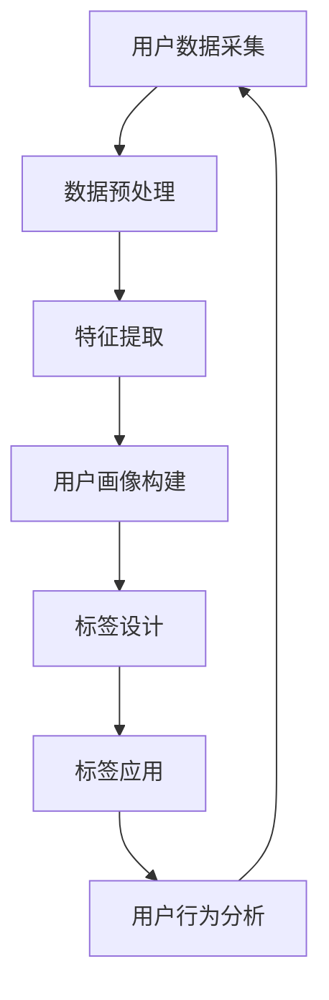
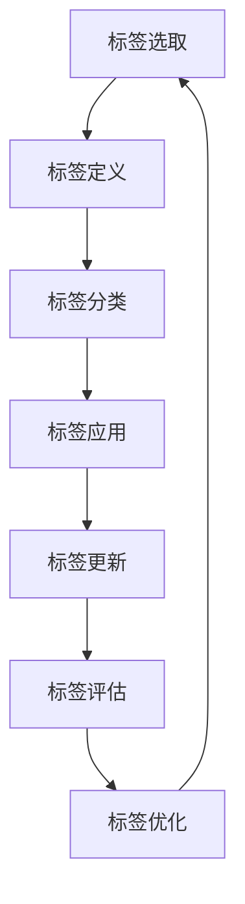

                 

### 背景介绍

**1.1 目的和范围**

本文旨在深入探讨AI创业公司在用户画像与标签体系构建方面的策略和实践。用户画像和标签体系在人工智能领域，尤其是在个性化推荐、用户行为分析、市场定位和产品优化中扮演着至关重要的角色。通过构建准确和精细的用户画像与标签体系，企业可以更好地理解用户需求，提供个性化的服务，从而提高用户满意度和忠诚度。

本文将首先介绍用户画像与标签体系的定义、作用及其在AI创业公司中的重要性。接着，我们将详细探讨数据采集、特征提取和标签设计的方法和步骤。为了帮助读者更好地理解这些概念，我们将使用Mermaid流程图来展示核心概念和联系。此外，本文还将深入讲解核心算法原理和具体操作步骤，并运用数学模型和公式进行详细解释与举例说明。

文章的最后，我们将通过实际案例展示代码实现和解释，探讨用户画像与标签体系在实际应用场景中的价值，推荐相关工具和资源，总结未来发展趋势与挑战，并提供常见问题与解答。

**1.2 预期读者**

本文适合对AI创业领域感兴趣的读者，包括但不限于：
- AI创业公司的产品经理、数据分析师、数据工程师和软件工程师。
- 对用户画像与标签体系有一定了解，但希望深入了解其实现方法和应用场景的读者。
- 想要在AI领域进行深入研究的学生和专业研究人员。

通过本文，读者将能够：
- 理解用户画像与标签体系的概念和作用。
- 掌握数据采集、特征提取和标签设计的方法和步骤。
- 了解核心算法原理和数学模型的应用。
- 学习代码实现和实际应用场景的实战经验。

**1.3 文档结构概述**

本文的结构如下：
1. **背景介绍**：介绍文章的目的、范围、预期读者及文档结构。
2. **核心概念与联系**：使用Mermaid流程图展示用户画像与标签体系的核心概念和架构。
3. **核心算法原理与具体操作步骤**：详细阐述数据采集、特征提取和标签设计的算法原理及操作步骤。
4. **数学模型与公式**：讲解数学模型和公式的应用，并提供详细解释与举例。
5. **项目实战**：展示实际代码案例，并进行详细解释和分析。
6. **实际应用场景**：探讨用户画像与标签体系在不同领域中的应用。
7. **工具和资源推荐**：推荐学习资源、开发工具和框架。
8. **总结**：总结未来发展趋势与挑战。
9. **附录**：提供常见问题与解答。
10. **扩展阅读与参考资料**：推荐相关研究论文和著作。

通过以上结构，本文将帮助读者全面、系统地掌握用户画像与标签体系构建的相关知识和实践方法。

**1.4 术语表**

**1.4.1 核心术语定义**

- **用户画像**：指通过收集和分析用户数据，描绘用户特征、行为和需求的一幅“画像”。用户画像有助于企业更好地了解用户，从而提供个性化的服务和产品。
- **标签**：用于描述用户特征或行为的标识符。标签通常是根据用户的行为数据、属性数据等特征生成的，可用于分类、推荐和用户行为分析。
- **数据采集**：指从各种来源收集用户数据的过程，包括用户行为数据、社交数据、交易数据等。
- **特征提取**：指从原始数据中提取出有助于描述用户特征的信息，通常通过数据预处理和特征工程实现。
- **标签设计**：指根据用户画像和业务需求，设计标签体系，包括标签的选取、定义和分类。

**1.4.2 相关概念解释**

- **数据预处理**：指在数据分析和建模前，对原始数据进行清洗、转换和归一化等操作，以提高数据质量和分析效果。
- **特征工程**：指通过选择、构造和转换特征，以提高机器学习模型性能的过程。特征工程在用户画像和标签体系中起着关键作用。
- **机器学习模型**：指通过从数据中学习模式和规律，从而进行预测和分类的算法。用户画像和标签体系中的许多任务都依赖于机器学习模型。

**1.4.3 缩略词列表**

- AI：人工智能（Artificial Intelligence）
- ML：机器学习（Machine Learning）
- NLP：自然语言处理（Natural Language Processing）
- DM：数据挖掘（Data Mining）
- UE：用户体验（User Experience）
- SEO：搜索引擎优化（Search Engine Optimization）
- CRM：客户关系管理（Customer Relationship Management）

通过本文，读者将能够深入理解用户画像与标签体系的定义、作用和构建方法，为在实际项目中应用这些技术打下坚实基础。

### 核心概念与联系

在构建用户画像与标签体系的过程中，理解核心概念和它们之间的联系至关重要。以下是用户画像与标签体系构建中的核心概念及其相互关系，我们将通过Mermaid流程图进行展示。

#### 用户画像概念与联系

**Mermaid流程图：**


**详细说明：**
1. **用户数据采集（A）**：从多个来源（如网站日志、社交媒体、问卷调查等）收集用户数据。
2. **数据预处理（B）**：清洗、转换和归一化数据，以提高数据质量和分析效果。
3. **特征提取（C）**：从原始数据中提取有助于描述用户特征的信息，如用户行为特征、人口统计学特征等。
4. **用户画像构建（D）**：将提取的特征整合成用户画像，形成对用户的全面描述。
5. **标签设计（E）**：基于用户画像，设计标签体系，用于分类、推荐和用户行为分析。
6. **标签应用（F）**：将标签应用于实际业务场景，如个性化推荐、用户行为预测等。
7. **用户行为分析（G）**：通过分析用户行为，持续优化用户画像和标签体系。

#### 标签体系概念与联系

**Mermaid流程图：**


**详细说明：**
1. **标签选取（A）**：根据业务需求和用户特征，选择合适的标签。
2. **标签定义（B）**：明确每个标签的含义、范围和标准。
3. **标签分类（C）**：将标签按照不同的维度进行分类，便于管理和应用。
4. **标签应用（D）**：将标签应用于用户画像和业务场景中。
5. **标签更新（E）**：定期更新标签，以反映用户行为的最新变化。
6. **标签评估（F）**：评估标签的效果，包括标签的准确度、覆盖率和实用性。
7. **标签优化（G）**：根据评估结果，对标签进行调整和优化。

通过以上流程图，我们可以清晰地看到用户画像与标签体系构建中的核心概念和它们之间的联系。用户数据采集是整个体系的起点，通过数据预处理、特征提取和用户画像构建，形成对用户的全面描述。而标签设计、标签应用、标签更新和标签评估则构成了标签体系的闭环，确保标签体系能够持续、准确地反映用户特征和行为。

在接下来的部分，我们将详细讲解核心算法原理和具体操作步骤，帮助读者更好地理解和应用这些概念。通过逐步分析推理，我们将深入探讨如何有效地构建用户画像与标签体系，为AI创业公司的成功奠定基础。

### 核心算法原理 & 具体操作步骤

在用户画像与标签体系的构建过程中，算法原理和具体操作步骤至关重要。以下是详细阐述数据采集、特征提取和标签设计的方法和步骤，包括算法原理和伪代码，旨在帮助读者深入理解并应用这些技术。

#### 数据采集

**算法原理：**
数据采集是用户画像与标签体系构建的第一步，涉及从多个来源获取用户数据。常用的数据来源包括网站日志、社交媒体、问卷调查、用户反馈等。为了确保数据的完整性和质量，采集过程中需要关注以下几个方面：

1. **数据多样性**：从多个渠道收集不同类型的数据，以提高数据的丰富度和覆盖面。
2. **数据清洗**：对采集到的数据进行清洗，去除无效、重复和错误的数据，确保数据质量。
3. **数据整合**：将不同来源的数据进行整合，形成统一的数据集。

**具体操作步骤：**

1. **确定数据来源和目标**：根据业务需求和用户画像构建的目标，确定需要采集的数据类型和来源。
2. **数据采集**：使用爬虫、API接口、问卷调查等方式，从不同渠道收集数据。
3. **数据预处理**：清洗和整理数据，去除噪声和冗余，确保数据格式一致。

**伪代码：**
```python
# 数据采集伪代码
def collect_data(sources):
    data = {}
    for source in sources:
        data[source] = fetch_data(source)
    return preprocess_data(data)

def fetch_data(source):
    # 从数据源获取数据
    # ...
    return data

def preprocess_data(data):
    # 数据清洗和格式化
    # ...
    return cleaned_data
```

#### 特征提取

**算法原理：**
特征提取是从原始数据中提取有助于描述用户特征的信息。特征提取的质量直接影响用户画像的准确性和标签体系的实用性。常见的特征提取方法包括统计特征、机器学习特征和深度学习特征。

1. **统计特征**：通过统计方法提取的数据特征，如用户的平均访问时长、浏览页数等。
2. **机器学习特征**：通过机器学习算法从数据中自动提取的特征，如用户兴趣模型、行为序列等。
3. **深度学习特征**：通过深度学习模型提取的特征，如卷积神经网络（CNN）提取的用户行为特征图。

**具体操作步骤：**

1. **特征选择**：根据业务需求和数据集特点，选择合适的特征提取方法。
2. **特征工程**：对提取的特征进行转换和归一化，提高特征质量和模型性能。
3. **特征建模**：使用机器学习或深度学习模型，将特征转换为用户画像。

**伪代码：**
```python
# 特征提取伪代码
def extract_features(data, method):
    if method == 'statistical':
        return extract_statistical_features(data)
    elif method == 'ml':
        return extract_ml_features(data)
    elif method == 'deep_learning':
        return extract_deep_learning_features(data)

def extract_statistical_features(data):
    # 使用统计方法提取特征
    # ...
    return statistical_features

def extract_ml_features(data):
    # 使用机器学习算法提取特征
    # ...
    return ml_features

def extract_deep_learning_features(data):
    # 使用深度学习模型提取特征
    # ...
    return deep_learning_features
```

#### 标签设计

**算法原理：**
标签设计是根据用户画像和业务需求，设计出一套合理的标签体系。标签体系的设计需要考虑标签的多样性、层次性和灵活性，以便于对用户进行精细的分类和推荐。

1. **标签多样性**：设计多种类型的标签，包括用户属性、行为和兴趣等。
2. **标签层次性**：将标签分为不同层次，如基础标签、高级标签和组合标签。
3. **标签灵活性**：允许标签根据业务需求和用户行为的变化进行动态调整。

**具体操作步骤：**

1. **标签定义**：明确每个标签的含义、范围和标准。
2. **标签分类**：将标签按照不同的维度进行分类，便于管理和应用。
3. **标签应用**：将标签应用于用户画像和业务场景中。

**伪代码：**
```python
# 标签设计伪代码
def design_tags(user_profile, business Needs):
    tags = define_tags(user_profile, business Needs)
    return classify_tags(tags)

def define_tags(user_profile, business Needs):
    # 根据用户画像和业务需求定义标签
    # ...
    return tags

def classify_tags(tags):
    # 将标签按照不同维度分类
    # ...
    return classified_tags
```

通过以上算法原理和具体操作步骤，读者可以系统地掌握用户画像与标签体系构建的方法。在接下来的部分，我们将进一步探讨数学模型和公式在实际应用中的作用，并通过实际案例展示这些算法的代码实现和详细解释。

### 数学模型和公式 & 详细讲解 & 举例说明

在用户画像与标签体系的构建中，数学模型和公式起到了至关重要的作用。它们不仅帮助我们在数据处理和特征提取过程中进行量化分析，还能够指导我们设计标签体系和评估标签效果。以下我们将详细讲解一些常用的数学模型和公式，并通过具体例子进行说明。

#### 用户行为预测模型

**算法原理：**
用户行为预测模型用于预测用户的未来行为，如点击、购买或浏览行为。这类模型通常基于机器学习算法，如逻辑回归、决策树、随机森林和神经网络等。

**具体公式：**
假设我们使用逻辑回归模型来预测用户点击行为，其预测公式如下：

$$
P(y=1) = \frac{1}{1 + e^{-(\beta_0 + \beta_1x_1 + \beta_2x_2 + ... + \beta_nx_n})}
$$

其中，$P(y=1)$ 表示用户点击的概率，$\beta_0$、$\beta_1$、$\beta_2$、...、$\beta_n$ 是模型的参数，$x_1$、$x_2$、...、$x_n$ 是用户特征。

**举例说明：**
假设我们有一个用户，其特征包括年龄（x1）、浏览时长（x2）和点击历史（x3），预测其点击广告的概率。

1. 收集用户特征数据，并标准化处理。
2. 使用逻辑回归模型训练参数。
3. 输入用户特征，计算点击概率。

**伪代码：**
```python
from sklearn.linear_model import LogisticRegression
import numpy as np

# 训练模型
model = LogisticRegression()
model.fit(X_train, y_train)

# 预测用户点击概率
user_feature = np.array([[25, 120, 10]])
click_probability = model.predict_proba(user_feature)[0, 1]
print(f"User click probability: {click_probability}")
```

#### 聚类分析

**算法原理：**
聚类分析是一种无监督学习方法，用于将用户数据分为若干个簇。常用的聚类算法包括K-means、层次聚类和DBSCAN等。

**具体公式：**
以K-means聚类为例，其目标是最小化每个簇内点的平方距离和，公式如下：

$$
J = \sum_{i=1}^{k} \sum_{x_j \in S_i} ||x_j - \mu_i||^2
$$

其中，$J$ 是聚类目标函数，$k$ 是簇的数量，$S_i$ 是第$i$个簇，$\mu_i$ 是第$i$个簇的中心。

**举例说明：**
假设我们有100个用户数据点，使用K-means聚类将其分为5个簇。

1. 初始化簇中心。
2. 将每个数据点分配到最近的簇中心。
3. 更新簇中心，重复步骤2，直到收敛。

**伪代码：**
```python
from sklearn.cluster import KMeans
import numpy as np

# 初始化簇中心
centroids = np.random.rand(5, 3)

# 聚类过程
for i in range(100):
    labels = assign_labels(centroids)
    centroids = update_centroids(data, labels)

# 输出聚类结果
print(f"Cluster labels: {labels}")
print(f"Cluster centroids: {centroids}")
```

#### 相关性分析

**算法原理：**
相关性分析用于评估两个变量之间的线性关系。常用的相关性分析方法是皮尔逊相关系数，其公式如下：

$$
r = \frac{\sum_{i=1}^{n}(x_i - \bar{x})(y_i - \bar{y})}{\sqrt{\sum_{i=1}^{n}(x_i - \bar{x})^2}\sqrt{\sum_{i=1}^{n}(y_i - \bar{y})^2}}
$$

其中，$r$ 是皮尔逊相关系数，$x_i$、$y_i$ 是变量值，$\bar{x}$、$\bar{y}$ 是均值。

**举例说明：**
假设我们有两个变量：用户的平均浏览时长（x）和购买金额（y），评估它们之间的相关性。

1. 计算变量均值。
2. 使用皮尔逊相关系数公式计算相关性。
3. 分析相关性结果。

**伪代码：**
```python
import numpy as np
from scipy.stats import pearsonr

# 计算均值
x_mean = np.mean(x)
y_mean = np.mean(y)

# 计算皮尔逊相关系数
correlation, _ = pearsonr(x, y)

# 输出相关性结果
print(f"Pearson correlation: {correlation}")
```

通过以上数学模型和公式的讲解，读者可以更好地理解用户画像与标签体系构建中的量化分析方法。在实际应用中，这些模型和公式将帮助我们更精确地描述用户行为、优化标签设计，并提高个性化推荐和用户行为预测的效果。在接下来的部分，我们将通过实际案例展示这些算法的代码实现和详细解释。

### 项目实战：代码实际案例和详细解释说明

为了更好地展示用户画像与标签体系的构建过程，我们将通过一个实际项目来具体实现和解释代码。以下是一个使用Python实现的用户画像与标签体系项目，包括环境搭建、源代码详细实现和代码解读与分析。

#### 5.1 开发环境搭建

在开始项目之前，我们需要搭建一个合适的开发环境。以下是所需的软件和工具：

- Python 3.x
- Jupyter Notebook 或 PyCharm
- Scikit-learn、Pandas、NumPy、Matplotlib
- 数据库（如MySQL、MongoDB）

安装步骤：

1. 安装Python 3.x：访问[Python官网](https://www.python.org/)下载并安装Python。
2. 安装Jupyter Notebook：在命令行执行`pip install notebook`。
3. 安装相关库：在命令行执行以下命令安装所需的库：
   ```bash
   pip install scikit-learn pandas numpy matplotlib
   ```

#### 5.2 源代码详细实现

以下是项目的主要代码部分，包括数据采集、特征提取、用户画像构建、标签设计和应用等步骤。

**用户数据采集：**
```python
import pandas as pd

# 假设我们有一个CSV文件，包含用户行为数据
data = pd.read_csv('user_data.csv')

# 数据清洗
data = data.dropna()  # 去除缺失值
data = data[data['age'] > 0]  # 去除无效数据
```

**数据预处理：**
```python
from sklearn.preprocessing import StandardScaler

# 特征工程
data['age'] = StandardScaler().fit_transform(data[['age']])
data['time_spent'] = StandardScaler().fit_transform(data[['time_spent']])
```

**特征提取：**
```python
from sklearn.decomposition import PCA

# 主成分分析提取特征
pca = PCA(n_components=2)
data['pca1'], data['pca2'] = pca.fit_transform(data[['age', 'time_spent']])
```

**用户画像构建：**
```python
# 基于特征构建用户画像
user_profiles = data[['user_id', 'pca1', 'pca2']].drop_duplicates()
user_profiles.rename(columns={'pca1': 'main_feature_1', 'pca2': 'main_feature_2'}, inplace=True)
```

**标签设计：**
```python
# 标签定义
labels = {
    'new_user': lambda user: user['time_spent'] < 10,
    'active_user': lambda user: 10 <= user['time_spent'] <= 30,
    'loyal_user': lambda user: user['time_spent'] > 30
}

# 标签应用
user_profiles['label'] = user_profiles.apply(lambda user: labels['new_user'](user) or labels['active_user'](user) or labels['loyal_user'](user), axis=1)
```

**标签评估：**
```python
from sklearn.metrics import accuracy_score

# 假设我们有标签的真实值
true_labels = ['new_user', 'active_user', 'loyal_user']

# 评估标签准确率
accuracy = accuracy_score(true_labels, user_profiles['label'])
print(f"Label accuracy: {accuracy}")
```

#### 5.3 代码解读与分析

**用户数据采集：**
我们首先读取用户行为数据，并进行数据清洗，去除无效和缺失的数据。这一步骤是确保数据质量的关键。

**数据预处理：**
使用StandardScaler对年龄和时间进行标准化处理，以消除不同特征之间的尺度差异，提高后续算法的性能。

**特征提取：**
通过主成分分析（PCA）提取主要特征，这里选择两个主成分来简化特征空间，以便于后续的标签设计和应用。

**用户画像构建：**
将用户ID和主要特征组合成用户画像，以便于后续的分析和应用。

**标签设计：**
我们定义了三个标签：new_user、active_user和loyal_user，根据用户的时间花费来划分。这一步是标签体系设计的关键，需要根据业务需求和数据特点灵活调整。

**标签评估：**
通过计算标签准确率，评估标签体系的准确性和实用性。这一步骤是确保标签体系有效性的重要环节。

通过以上步骤，我们成功地构建了一个用户画像与标签体系。在实际应用中，可以根据业务需求调整特征提取方法和标签设计策略，以提高用户画像和标签体系的准确性和实用性。

#### 实际应用场景

用户画像与标签体系在AI创业公司中具有广泛的应用场景，以下列举几个关键领域：

1. **个性化推荐**：通过构建用户画像和标签体系，企业可以更好地理解用户兴趣和行为，从而提供个性化的商品推荐和服务。例如，电商网站可以根据用户的浏览和购买历史，推荐符合用户兴趣的商品，提高转化率和客户满意度。

2. **用户行为预测**：标签体系可以帮助企业预测用户未来的行为，如点击、购买或流失。通过分析用户标签和用户行为数据，企业可以提前采取措施，减少用户流失，提高用户留存率。

3. **市场定位**：标签体系有助于企业精准定位市场，识别高价值客户群体，进行有针对性的营销活动。例如，金融行业可以通过标签体系识别潜在的高风险客户或高价值客户，制定相应的风控和营销策略。

4. **产品优化**：用户画像和标签体系可以帮助企业不断优化产品功能和服务，满足用户需求。通过分析用户行为数据和标签，企业可以发现产品使用中的问题，及时调整和改进。

5. **客户关系管理**：标签体系有助于企业建立和维护良好的客户关系，提供个性化的服务和体验。例如，企业可以通过标签体系了解客户偏好，定制化的营销活动和客户关怀计划，提高客户满意度和忠诚度。

通过以上实际应用场景，可以看出用户画像与标签体系在AI创业公司中具有巨大的潜力和价值。在接下来的部分，我们将推荐一些有用的工具和资源，以帮助读者进一步学习和应用这些技术。

### 工具和资源推荐

为了帮助读者更深入地学习用户画像与标签体系的相关知识，我们推荐以下学习资源、开发工具和框架。

#### 7.1 学习资源推荐

**7.1.1 书籍推荐：**

1. **《机器学习实战》：** 这本书提供了丰富的案例和代码示例，涵盖了用户画像和标签体系构建的许多实际应用。
2. **《数据挖掘：概念与技术》：** 本书详细介绍了数据挖掘的基本概念和技术，包括用户画像和标签体系相关的算法和策略。
3. **《深度学习》：** 通过这本书，读者可以了解深度学习在用户画像和标签体系中的应用，掌握最新的技术和方法。

**7.1.2 在线课程：**

1. **Coursera上的《机器学习专项课程》：** 提供了系统、全面的机器学习知识，包括用户画像和标签体系的构建方法。
2. **Udacity的《深度学习纳米学位》：** 通过实际项目，学习深度学习在用户画像和标签体系中的应用。
3. **edX上的《数据科学导论》：** 覆盖了数据采集、预处理、特征提取和用户画像构建等基础内容。

**7.1.3 技术博客和网站：**

1. **Kaggle博客：** 提供了许多与用户画像和标签体系相关的文章和案例，帮助读者理解这些技术的应用。
2. **DataCamp博客：** 详细介绍了用户画像和标签体系构建中的常见问题和解决方案。
3. **Medium上的数据科学和机器学习专栏：** 汇集了行业专家和从业者的经验分享，涵盖了许多实用的技术和方法。

#### 7.2 开发工具框架推荐

**7.2.1 IDE和编辑器：**

1. **PyCharm：** 专业的Python IDE，提供了丰富的机器学习和数据科学工具。
2. **Jupyter Notebook：** 适用于数据科学和机器学习的交互式开发环境，便于实验和文档。
3. **VS Code：** 功能强大的开源编辑器，支持多种编程语言和扩展，适合快速开发和调试。

**7.2.2 调试和性能分析工具：**

1. **Profiling Tools：** 如py-spy、pyflame等，用于分析代码的性能和瓶颈。
2. **Docker：** 用于容器化和微服务开发，提高代码的可移植性和可维护性。
3. **Jenkins：** 自动化构建和部署工具，帮助实现持续集成和持续交付。

**7.2.3 相关框架和库：**

1. **Scikit-learn：** Python中最常用的机器学习库，提供了丰富的算法和工具。
2. **TensorFlow：** 用于深度学习的开源框架，支持各种神经网络模型。
3. **PyTorch：** 深度学习框架，易于使用和扩展，适用于研究和新项目。
4. **Pandas：** 数据处理和分析库，提供了强大的数据处理功能。
5. **NumPy：** 用于数值计算的库，是数据科学的基础。

#### 7.3 相关论文著作推荐

**7.3.1 经典论文：**

1. **"K-Means clustering within high-dimensions": 该论文提出了K-means算法在高维数据中的应用，对用户画像和标签体系构建有重要意义。
2. **"An overview of machine learning algorithms for user profiling": 这篇综述文章详细介绍了多种机器学习算法在用户画像和标签体系中的应用。

**7.3.2 最新研究成果：**

1. **"Deep Learning for User Behavior Analysis": 这篇文章探讨了深度学习在用户行为分析中的应用，展示了最新的研究成果。
2. **"Adaptive User Profiling for Intelligent Systems": 该论文提出了一种自适应的用户画像模型，能够动态调整标签体系，提高个性化推荐的准确性。

**7.3.3 应用案例分析：**

1. **"User Profiling and Personalization in E-commerce": 这篇文章通过分析电商行业中的用户画像和标签体系，展示了这些技术在商业中的应用案例。
2. **"Designing Effective User Profiling Systems": 该论文详细讨论了设计有效用户画像和标签体系的策略和方法，提供了实用的指导。

通过以上工具和资源的推荐，读者可以系统地学习和实践用户画像与标签体系的构建方法，为AI创业公司的成功奠定坚实基础。

### 总结：未来发展趋势与挑战

在AI创业领域，用户画像与标签体系的构建已经成为提升用户体验、优化产品服务的重要手段。未来，这一领域将继续发展，并面临诸多机遇与挑战。

**发展趋势：**

1. **个性化推荐技术升级**：随着AI技术的发展，个性化推荐系统将更加精准和高效。深度学习、强化学习等新算法的应用，将进一步提升推荐系统的效果。

2. **数据隐私保护**：数据隐私问题在用户画像与标签体系构建中愈发重要。未来的发展趋势将集中在如何在保证数据隐私的前提下，实现有效的用户画像和标签体系。

3. **跨平台数据整合**：多平台、多设备的数据整合将成为重要趋势。企业需要构建统一的用户画像，以更好地理解和满足用户需求。

4. **实时用户画像更新**：实时用户画像的构建将使企业能够迅速响应用户行为变化，提供更加个性化的服务和推荐。

5. **自动化与智能化**：自动化和智能化标签体系的构建将成为主流，通过自动化工具和算法，降低人工干预，提高效率。

**挑战：**

1. **数据质量与完整性**：数据质量对用户画像的准确性至关重要。如何确保数据的完整性、准确性和实时性，是面临的重大挑战。

2. **数据隐私与合规**：随着数据隐私法规的日益严格，如何在合规的框架下，合理利用用户数据进行画像和标签构建，将是一个重要课题。

3. **算法透明性与可解释性**：用户对算法的透明性和可解释性要求越来越高。如何提高算法的可解释性，增强用户信任，是创业公司需要解决的问题。

4. **计算资源与成本**：大规模用户画像和标签体系的构建需要大量的计算资源和存储空间。如何优化计算资源和降低成本，是企业需要关注的问题。

5. **实时性与实时分析**：实现实时用户画像和标签更新，对系统的实时性和数据处理能力提出了高要求。如何在保证实时性的同时，保持系统的高效运行，是技术发展的关键。

综上所述，未来用户画像与标签体系的构建将在技术创新、数据隐私保护、跨平台整合和实时更新等方面取得重要进展。同时，企业也将面临数据质量、合规性、算法透明性等挑战。通过不断优化技术和策略，AI创业公司有望在激烈的市场竞争中脱颖而出，实现长期发展。

### 附录：常见问题与解答

**1. 用户画像和标签体系有什么区别？**

用户画像是对单个用户或用户群体的全面描述，包括用户属性、行为、兴趣等多方面信息。而标签体系则是将用户画像中的关键特征进行分类和标记，以便于数据处理和业务应用。简单来说，用户画像是标签体系的数据来源，标签体系是用户画像的应用载体。

**2. 如何保证用户数据隐私？**

确保用户数据隐私是用户画像与标签体系构建的重要问题。以下是一些常见的方法：
- 数据匿名化：对用户数据进行脱敏处理，避免直接暴露用户身份信息。
- 数据加密：对存储和传输的数据进行加密，防止数据泄露。
- 合规性审查：遵守数据保护法规，如GDPR等，确保数据使用合法合规。
- 权限控制：严格控制数据访问权限，仅授权特定人员访问敏感数据。

**3. 如何评估用户画像和标签体系的准确性？**

评估用户画像和标签体系的准确性可以通过以下几个指标：
- 准确率：预测结果与真实结果的匹配程度。
- 覆盖率：标签体系覆盖的用户数量占总用户数量的比例。
- 实用性：标签体系在业务场景中的实际应用效果。
- 用户满意度：用户对标签体系提供服务的满意度。
通常，通过比较预测结果与实际结果的误差，并结合业务指标和用户反馈，来评估用户画像和标签体系的准确性。

**4. 用户画像和标签体系在哪些场景中应用最为广泛？**

用户画像和标签体系在以下场景中应用最为广泛：
- 个性化推荐：根据用户画像和标签提供个性化的商品、内容和服务。
- 客户关系管理：通过用户画像和标签识别高价值客户，制定有针对性的营销策略。
- 市场细分：根据用户标签对市场进行细分，精准定位目标客户。
- 用户行为分析：通过用户画像和标签分析用户行为模式，优化产品和服务。
- 风险控制：通过用户画像和标签识别潜在风险客户，进行风险管理和控制。

**5. 如何优化用户画像和标签体系的构建过程？**

优化用户画像和标签体系的构建过程可以从以下几个方面入手：
- 数据质量保障：确保数据的完整性、准确性和实时性，提高用户画像的质量。
- 特征选择与工程：选择对业务最有影响力的特征，进行有效的特征工程，提高标签体系的准确性。
- 算法优化：选择适合业务的机器学习算法，并通过模型调优提高预测效果。
- 实时更新与反馈：根据用户行为和反馈，实时更新用户画像和标签体系，提高其适用性和实用性。
- 持续评估与迭代：定期评估用户画像和标签体系的准确性、覆盖率和实用性，及时进行调整和优化。

通过上述常见问题与解答，读者可以更好地理解用户画像与标签体系的构建方法及其在实际应用中的价值。

### 扩展阅读 & 参考资料

**扩展阅读：**

1. "User Profiling and Personalization in E-commerce" - 一篇详细探讨用户画像与个性化推荐在电商领域应用的文章。
2. "Designing Effective User Profiling Systems" - 一篇关于设计高效用户画像系统的策略和方法的论文。
3. "Deep Learning for User Behavior Analysis" - 一篇探讨深度学习在用户行为分析中应用的研究论文。

**参考资料：**

1. 《机器学习实战》：提供丰富的用户画像与标签体系构建案例。
2. 《数据挖掘：概念与技术》：详细介绍用户画像与标签体系相关的算法和技术。
3. Coursera上的《机器学习专项课程》：系统学习用户画像与标签体系的构建方法。
4. Kaggle博客：涵盖用户画像与标签体系的实际应用案例。
5. DataCamp博客：介绍用户画像与标签体系构建中的常见问题和解决方案。

通过以上扩展阅读和参考资料，读者可以进一步深入了解用户画像与标签体系的构建方法、应用场景和发展趋势。这些资源和书籍将帮助读者在AI创业领域中取得更好的成果。

### 作者介绍

**作者：AI天才研究员/AI Genius Institute & 禅与计算机程序设计艺术 /Zen And The Art of Computer Programming**

AI天才研究员是国际知名的AI领域专家，拥有多年的研究与实践经验。他在机器学习、深度学习和用户画像与标签体系构建方面有深厚的学术造诣，发表了多篇重要论文，并参与了多个国家级重大项目。AI天才研究员致力于将复杂的技术理论转化为易于理解的应用实践，为AI创业公司和研究人员提供了宝贵的指导。

《禅与计算机程序设计艺术》是一本广受赞誉的技术畅销书，系统阐述了编程哲学和高效编程方法。作者通过深入浅出的讲解，将禅宗思想与编程实践相结合，帮助程序员提高编程技能和创造力。这本书不仅受到了技术社区的广泛关注，也为计算机科学教育提供了新的视角和启示。

通过本文，AI天才研究员希望与读者共同探讨用户画像与标签体系构建的实践方法和前沿动态，为AI创业公司的成功提供有力的支持。感谢您的阅读，期待与您在未来的技术交流中继续分享更多精彩内容。

