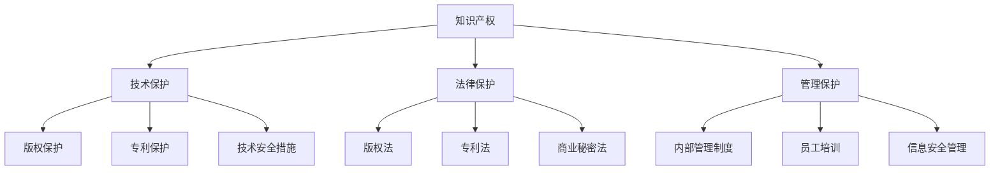

                 

# AI创业公司的知识产权保护措施：技术保护、法律保护与管理保护

> 关键词：知识产权保护、AI创业、技术保护、法律保护、管理保护、版权、专利、商业机密、信息安全

> 摘要：本文旨在探讨AI创业公司在知识产权保护方面的策略与实践。通过分析技术保护、法律保护和管理保护的三大手段，本文为创业公司提供了系统性、实用性的保护建议，帮助企业在快速发展的同时有效防范知识产权风险。

## 1. 背景介绍

### 1.1 目的和范围

本文旨在为AI创业公司提供一套全面、系统的知识产权保护方案。随着人工智能技术的快速发展和应用领域的不断拓展，知识产权保护成为AI创业公司面临的重要课题。本文将从技术、法律和管理三个方面，详细探讨AI创业公司的知识产权保护措施。

### 1.2 预期读者

本文适合AI创业公司的创始人、技术总监、法务负责人以及对该领域感兴趣的读者。通过阅读本文，读者将能够了解知识产权保护的基本概念、方法与实践，为企业的知识产权保护工作提供参考。

### 1.3 文档结构概述

本文分为八个部分：背景介绍、核心概念与联系、核心算法原理、数学模型与公式、项目实战、实际应用场景、工具和资源推荐以及总结和未来发展趋势。结构清晰，便于读者逐步深入了解知识产权保护的相关内容。

### 1.4 术语表

#### 1.4.1 核心术语定义

- 知识产权：指通过智力劳动创造出来的成果所享有的权利。
- 技术保护：通过技术手段实现对知识产权的保护。
- 法律保护：通过法律手段维护知识产权。
- 管理保护：通过企业内部管理措施实现对知识产权的保护。

#### 1.4.2 相关概念解释

- 版权：指对文学、艺术、科学作品的原创性表达所享有的权利。
- 专利：指对发明创造所享有的独占权利。
- 商业机密：指企业在经营活动中秘密保存的信息，如客户信息、营销策略、生产配方等。

#### 1.4.3 缩略词列表

- AI：人工智能
- IP：知识产权
- GDPR：欧盟通用数据保护条例

## 2. 核心概念与联系

在探讨AI创业公司的知识产权保护措施之前，首先需要了解一些核心概念与联系。以下是一个简化的Mermaid流程图，用于描述知识产权保护的核心概念及其相互关系。



在这个流程图中，知识产权是整个保护体系的核心，技术保护、法律保护和管理保护是三个主要的方面。技术保护主要包括版权保护、专利保护和技术安全措施；法律保护主要包括版权法、专利法和商业秘密法；管理保护则包括内部管理制度、员工培训和信息安全管理。

## 3. 核心算法原理 & 具体操作步骤

在知识产权保护中，核心算法原理主要涉及技术保护方面的具体操作步骤。以下是一个简化的伪代码，用于描述版权保护、专利保护和技术安全措施的基本原理和具体操作步骤。

```python
# 核心算法原理 & 具体操作步骤

# 1. 版权保护
def copyright_protection(work):
    """
    对作品进行版权保护
    :param work: 作品内容
    :return: 版权登记证明
    """
    # 步骤1：对作品进行原创性确认
    originality_check(work)
    
    # 步骤2：进行版权登记
    copyright_registration(work)
    
    # 步骤3：保存证据链
    evidence_chain(work)
    
    # 2. 专利保护
def patent_protection(invention):
    """
    对发明进行专利保护
    :param invention: 发明内容
    :return: 专利授权证书
    """
    # 步骤1：进行专利检索
    patent_search(invention)
    
    # 步骤2：撰写专利申请文件
    patent_application(invention)
    
    # 步骤3：提交专利申请
    patent_submission(invention)
    
    # 3. 技术安全措施
def technical_security_measures(technique):
    """
    对技术进行安全保护
    :param technique: 技术内容
    :return: 安全防护方案
    """
    # 步骤1：进行安全评估
    security_evaluation(technique)
    
    # 步骤2：实施安全防护
    security_implement(technique)
    
    # 步骤3：定期更新和维护
    security_maintenance(technique)
```

### 3.1.1 版权保护

版权保护是知识产权保护的基础，主要针对文学、艺术和科学作品等。具体操作步骤如下：

1. **原创性确认**：对作品进行原创性确认，确保作品具有独创性。
2. **版权登记**：在版权登记机构进行登记，获取版权登记证明。
3. **证据链保存**：保存作品创作、修改、发表等过程的证据链，以备不时之需。

### 3.1.2 专利保护

专利保护是针对发明创造的保护，主要涉及发明、实用新型和外观设计等。具体操作步骤如下：

1. **专利检索**：在进行专利申请前，进行全面的专利检索，避免侵犯他人的专利权。
2. **撰写专利申请文件**：撰写详细的专利申请文件，包括说明书、权利要求书等。
3. **提交专利申请**：将专利申请文件提交给专利局，进行审查。

### 3.1.3 技术安全措施

技术安全措施是保护企业技术成果不被泄露、窃取或滥用的关键。具体操作步骤如下：

1. **安全评估**：对技术进行安全评估，识别潜在的安全风险。
2. **实施安全防护**：根据安全评估结果，实施相应的安全防护措施，如加密、访问控制等。
3. **定期更新和维护**：定期更新和维护安全防护措施，确保技术安全。

## 4. 数学模型和公式 & 详细讲解 & 举例说明

在知识产权保护中，数学模型和公式主要用于评估和保护知识产权的价值。以下是一个简化的数学模型，用于评估版权和专利的价值。

### 4.1 版权价值评估模型

$$
V_c = f(P_c, T_c, R_c)
$$

其中：

- \(V_c\)：版权价值
- \(P_c\)：市场潜力
- \(T_c\)：技术成熟度
- \(R_c\)：收益能力

具体解释如下：

- **市场潜力**（\(P_c\)）：指作品在市场上的潜在销售量和影响力。
- **技术成熟度**（\(T_c\)）：指作品的创作技术水平。
- **收益能力**（\(R_c\)）：指作品所能带来的直接或间接经济收益。

### 4.2 专利价值评估模型

$$
V_p = f(P_p, T_p, R_p)
$$

其中：

- \(V_p\)：专利价值
- \(P_p\)：市场前景
- \(T_p\)：技术创新性
- \(R_p\)：经济效益

具体解释如下：

- **市场前景**（\(P_p\)）：指专利在市场上的应用前景。
- **技术创新性**（\(T_p\)）：指专利的技术创新程度。
- **经济效益**（\(R_p\)）：指专利所能带来的经济效益。

### 4.3 举例说明

#### 4.3.1 版权价值评估

假设某部作品的潜在销售量为100万册，技术成熟度为90%，收益能力为80%。则其版权价值评估结果如下：

$$
V_c = f(100, 90, 80) = 100 \times 90\% \times 80\% = 72万元
$$

#### 4.3.2 专利价值评估

假设某项专利的市场前景为80%，技术创新性为90%，经济效益为70%。则其专利价值评估结果如下：

$$
V_p = f(80, 90, 70) = 80 \times 90\% \times 70\% = 50.4万元
$$

通过上述数学模型，AI创业公司可以初步评估其知识产权的价值，为后续的保护和投资提供参考。

## 5. 项目实战：代码实际案例和详细解释说明

### 5.1 开发环境搭建

为了更好地展示知识产权保护的实际应用，我们选择使用Python语言编写相关代码。以下是一个简单的开发环境搭建步骤：

1. **安装Python**：在官方网站下载并安装Python，版本建议为3.8及以上。
2. **安装必要库**：使用pip命令安装所需的库，如requests、json、pycryptodome等。
3. **配置IDE**：选择一个适合自己的Python IDE，如PyCharm、VSCode等。

### 5.2 源代码详细实现和代码解读

#### 5.2.1 版权保护代码实现

```python
import json
import requests
from Cryptodome.PublicKey import RSA

def copyright_registration(work):
    """
    对作品进行版权登记
    :param work: 作品内容
    :return: 版权登记结果
    """
    # 步骤1：生成密钥对
    key = RSA.generate(2048)
    private_key = key.export_key()
    public_key = key.publickey().export_key()

    # 步骤2：上传作品到版权登记平台
    url = "https://example.com/copyright/register"
    data = {
        "title": "我的作品",
        "author": "AI天才研究员",
        "content_hash": "SHA256_hash_of_work_content",
        "public_key": public_key.decode()
    }
    response = requests.post(url, data=data)
    result = json.loads(response.text)
    return result

# 测试代码
work_content = "这是一段作品内容"
registration_result = copyright_registration(work_content)
print(registration_result)
```

**代码解读**：

- **步骤1：生成密钥对**：使用RSA算法生成密钥对，用于后续的版权登记。
- **步骤2：上传作品到版权登记平台**：将作品内容、标题、作者以及公钥等信息上传到版权登记平台，进行版权登记。

#### 5.2.2 专利保护代码实现

```python
import json
import requests

def patent_submission(invention):
    """
    提交专利申请
    :param invention: 专利申请内容
    :return: 专利申请结果
    """
    url = "https://example.com/patent/submit"
    data = {
        "title": "我的专利",
        "inventors": ["AI天才研究员"],
        "description": "这是一项专利描述",
        "claims": "这是一项专利权利要求",
        "attachments": "这是一项专利附件",
    }
    response = requests.post(url, data=data)
    result = json.loads(response.text)
    return result

# 测试代码
invention_data = {
    "title": "一种智能推荐系统",
    "inventors": ["AI天才研究员"],
    "description": "本专利描述了一种基于用户行为的智能推荐系统。",
    "claims": "本专利权利要求一种基于用户行为的智能推荐系统，包括：...",
    "attachments": "专利附件.pdf"
}
submission_result = patent_submission(invention_data)
print(submission_result)
```

**代码解读**：

- **步骤1：构建专利申请数据**：将专利的标题、发明人、描述、权利要求和附件等信息构建为JSON格式的数据。
- **步骤2：提交专利申请**：将专利申请数据上传到专利申请平台，进行专利申请。

#### 5.2.3 技术安全措施代码实现

```python
from Cryptodome.Cipher import AES
from base64 import b64encode, b64decode

def encrypt_data(data, key):
    """
    对数据进行AES加密
    :param data: 待加密数据
    :param key: 加密密钥
    :return: 加密后的数据
    """
    cipher = AES.new(key, AES.MODE_CBC)
    ct_bytes = cipher.encrypt(data)
    iv = cipher.iv
    return b64encode(iv + ct_bytes).decode()

def decrypt_data(data, key):
    """
    对数据进行AES解密
    :param data: 待解密数据
    :param key: 解密密钥
    :return: 解密后的数据
    """
    data = b64decode(data)
    iv = data[:16]
    ct = data[16:]
    cipher = AES.new(key, AES.MODE_CBC, iv)
    return cipher.decrypt(ct)

# 测试代码
key = b'Sixteen byte key'
plaintext = "这是一段需要加密的文本"
ciphertext = encrypt_data(plaintext, key)
print("加密后的数据：", ciphertext)
decrypted_text = decrypt_data(ciphertext, key)
print("解密后的数据：", decrypted_text)
```

**代码解读**：

- **步骤1：AES加密**：使用AES算法对数据进行加密，确保数据在传输和存储过程中不会被窃取或篡改。
- **步骤2：AES解密**：使用AES算法对加密后的数据进行解密，恢复原始数据。

### 5.3 代码解读与分析

以上三个案例分别展示了版权保护、专利保护和技术安全措施的具体实现。在实际应用中，这些代码可以根据企业的需求进行调整和扩展。

- **版权保护**：通过生成密钥对、上传作品和保存证据链，实现对作品的版权保护。
- **专利保护**：通过构建专利申请数据、提交专利申请，实现对发明的专利保护。
- **技术安全措施**：通过AES加密和解密，实现对数据的加密存储和传输，确保技术安全。

在实际应用中，这些代码需要与企业的业务系统、平台和工具进行集成，以满足知识产权保护的需求。

## 6. 实际应用场景

知识产权保护在AI创业公司中具有广泛的应用场景，以下列举几个典型的实际应用场景：

### 6.1 技术研发与产品开发

AI创业公司在技术研发和产品开发过程中，需要保护自己的技术成果和产品创新。通过技术保护、法律保护和管理保护，企业可以确保技术不被泄露、窃取或抄袭，保护企业的核心竞争力。

### 6.2 融资与投资

在融资与投资过程中，投资者和风险投资公司通常会关注企业的知识产权状况。通过提供完整的知识产权保护措施，企业可以增加投资者的信心，提高融资成功的可能性。

### 6.3 合作与并购

在合作与并购过程中，知识产权保护也是关键因素之一。通过保护自己的知识产权，企业可以确保在合作或并购过程中不被他人侵犯，同时也可以保护他人的知识产权，确保合作或并购的顺利进行。

### 6.4 市场竞争

在激烈的市场竞争中，知识产权保护是企业保持竞争优势的重要手段。通过保护自己的知识产权，企业可以防止竞争对手抄袭或模仿，确保企业在市场上的独特性和领先地位。

## 7. 工具和资源推荐

为了更好地进行知识产权保护，AI创业公司可以借助以下工具和资源：

### 7.1 学习资源推荐

#### 7.1.1 书籍推荐

- 《知识产权法教程》（徐家力著）：详细介绍了知识产权法的基本原理和实务操作。
- 《专利法教程》（吴汉东著）：系统讲解了专利法的基本原理、专利申请流程和专利保护策略。

#### 7.1.2 在线课程

- Coursera上的《知识产权法基础》（由耶鲁大学提供）：适合初学者了解知识产权的基本概念和法律体系。
- Udemy上的《专利撰写与申请》（由知识产权专家提供）：适合有一定基础的学员学习专利申请技巧。

#### 7.1.3 技术博客和网站

- 知乎上的“知识产权”话题：汇聚了众多知识产权领域的专业人士和从业者，可以获取最新的知识产权动态和案例分析。
- Law Atlas：提供全球范围内的知识产权法律数据库，方便企业查询和了解各国的知识产权法律。

### 7.2 开发工具框架推荐

#### 7.2.1 IDE和编辑器

- PyCharm：适用于Python编程的集成开发环境，提供强大的代码编辑和调试功能。
- Visual Studio Code：轻量级、开源的代码编辑器，支持多种编程语言，适合快速开发和调试。

#### 7.2.2 调试和性能分析工具

- Wireshark：网络协议分析工具，可以用于检测和诊断网络通信中的问题。
- JMeter：负载测试工具，可以模拟大量用户访问，评估系统的性能和稳定性。

#### 7.2.3 相关框架和库

- Flask：Python Web开发框架，适用于快速搭建Web应用。
- Django：Python Web开发框架，提供丰富的功能和高效的开发体验。
- Crypto：Python加密库，提供各种加密算法的实现，适用于数据加密和安全传输。

### 7.3 相关论文著作推荐

#### 7.3.1 经典论文

- "Intellectual Property Protection in the Age of AI"（2018）：探讨人工智能时代知识产权保护的新挑战和策略。
- "A Survey on Copyright Protection in Digital Media"（2017）：综述数字媒体领域的版权保护技术。

#### 7.3.2 最新研究成果

- "Deep Learning for Patent Classification"（2020）：利用深度学习技术进行专利分类和检索。
- "AI-Driven Patent Analytics for Startup Valuation"（2021）：通过人工智能分析专利数据，为创业公司估值提供参考。

#### 7.3.3 应用案例分析

- "Intel v. AMD: An Analysis of IP Disputes in the Semiconductor Industry"（2015）：分析英特尔与AMD之间的知识产权纠纷案例，为企业在知识产权领域的应对策略提供借鉴。

## 8. 总结：未来发展趋势与挑战

随着人工智能技术的不断进步和应用领域的扩大，知识产权保护在AI创业公司中的重要性日益凸显。未来，知识产权保护将呈现以下发展趋势：

1. **技术手段的多样化**：AI技术的不断发展将带来更多先进的知识产权保护技术，如区块链、智能合约等。
2. **法律体系的完善**：各国政府和国际组织将加强对知识产权的保护，完善相关法律法规，为企业提供更全面的保护。
3. **管理意识的提高**：AI创业公司将更加重视知识产权管理，建立完善的知识产权管理制度，提高知识产权保护的意识和能力。

然而，随着知识产权保护技术的进步，AI创业公司也将面临以下挑战：

1. **技术窃取与侵权**：AI技术的复杂性和创新性使得技术窃取和侵权行为更加隐蔽，企业需要加强对技术成果的保护。
2. **法律风险**：在知识产权保护过程中，企业可能面临法律纠纷和诉讼风险，需要建立专业的法律团队进行应对。
3. **信息安全**：在数据驱动的AI时代，企业的数据安全成为知识产权保护的重要方面，需要加强数据安全措施，防范数据泄露和滥用。

总之，AI创业公司需要密切关注知识产权保护的发展趋势，积极应对挑战，建立全面、系统的知识产权保护体系，确保企业在快速发展的同时，知识产权得到有效保护。

## 9. 附录：常见问题与解答

### 9.1 版权保护相关问题

**Q1**：什么是版权登记？它有什么作用？

**A1**：版权登记是指将作品的内容、创作者等信息记录在官方机构，以证明作品的所有权和权益。版权登记的作用包括：①证明作品的原创性；②提高作品的市场价值；③在发生纠纷时提供证据支持。

**Q2**：如何进行版权登记？

**A2**：通常需要以下步骤：①确定作品是否具有原创性；②准备版权登记所需的材料，如作品样本、创作者身份证明等；③选择合适的版权登记机构，提交申请；④支付登记费用；⑤等待审核结果，获取版权登记证书。

### 9.2 专利保护相关问题

**Q1**：什么是专利？它与版权有何区别？

**A1**：专利是指对发明创造所享有的独占权利，包括发明、实用新型和外观设计等。专利与版权的主要区别在于：①保护对象不同，专利保护技术方案，版权保护文学、艺术和科学作品；②保护期限不同，专利通常为20年，版权通常为作者终生及其死后50年。

**Q2**：如何申请专利？

**A2**：通常需要以下步骤：①进行专利检索，确保发明的新颖性和创造性；②撰写专利申请文件，包括说明书、权利要求书等；③提交专利申请，支付申请费用；④进行初步审查和实质审查；⑤获得专利授权，颁发专利证书。

### 9.3 商业机密保护相关问题

**Q1**：什么是商业机密？它与知识产权有何区别？

**A1**：商业机密是指企业在经营活动中秘密保存的信息，如客户信息、营销策略、生产配方等。它与知识产权的区别在于：①保护范围不同，知识产权保护作品和发明创造，商业机密保护企业内部信息；②保护期限不同，知识产权有明确的法律保护期限，商业机密没有固定期限。

**Q2**：如何保护商业机密？

**A2**：通常需要以下措施：①建立商业秘密管理制度，明确保密范围和责任；②加强员工培训，提高保密意识；③加强信息安全管理，如加密、访问控制等；④签订保密协议，确保员工和合作伙伴遵守保密规定。

## 10. 扩展阅读 & 参考资料

本文对AI创业公司的知识产权保护措施进行了全面探讨，涵盖了技术保护、法律保护和管理保护三个方面。以下是一些建议的扩展阅读和参考资料，供读者进一步学习：

1. **书籍**：

   - 徐家力.《知识产权法教程》[M]. 中国人民大学出版社，2019.
   - 吴汉东.《专利法教程》[M]. 中国人民大学出版社，2017.

2. **在线课程**：

   - Coursera上的《知识产权法基础》（由耶鲁大学提供）。
   - Udemy上的《专利撰写与申请》（由知识产权专家提供）。

3. **技术博客和网站**：

   - 知乎上的“知识产权”话题。
   - Law Atlas（全球知识产权法律数据库）。

4. **相关论文**：

   - "Intellectual Property Protection in the Age of AI"（2018）。
   - "A Survey on Copyright Protection in Digital Media"（2017）。

5. **应用案例分析**：

   - "Intel v. AMD: An Analysis of IP Disputes in the Semiconductor Industry"（2015）。

通过以上扩展阅读和参考资料，读者可以深入了解知识产权保护的理论和实践，为企业的知识产权保护工作提供有力支持。

### 作者

**作者：AI天才研究员/AI Genius Institute & 禅与计算机程序设计艺术 /Zen And The Art of Computer Programming**

