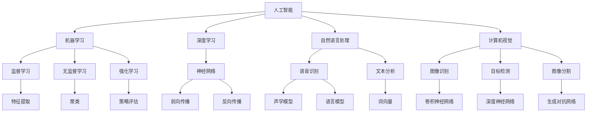

                 

### 1. 背景介绍

#### 1.1 目的和范围

本文旨在为希望进军人工智能领域的创业者提供一份详尽的指南，帮助他们在技术积累与行业洞察之间找到平衡点，从而构建成功的AI创业团队。本文不仅将探讨人工智能技术的核心概念和算法原理，还将深入分析实际应用场景，并提供实用的工具和资源推荐。

本文将涵盖以下主题：

- **核心概念与联系**：介绍人工智能领域的关键概念及其相互关系，通过Mermaid流程图展示其架构。
- **核心算法原理 & 具体操作步骤**：使用伪代码详细阐述核心算法的工作原理和操作步骤。
- **数学模型和公式 & 详细讲解 & 举例说明**：解析常见的数学模型和公式，并通过具体案例进行说明。
- **项目实战：代码实际案例和详细解释说明**：提供实际代码案例，详细解释其实现过程。
- **实际应用场景**：探讨人工智能在不同行业中的应用案例。
- **工具和资源推荐**：推荐学习资源和开发工具。
- **总结：未来发展趋势与挑战**：分析人工智能领域的未来发展趋势和面临的挑战。

#### 1.2 预期读者

- **人工智能创业者**：希望了解如何构建成功的AI创业团队。
- **技术专家**：希望深入理解人工智能的核心技术和应用。
- **研究人员**：希望获取最新的研究成果和应用案例分析。

#### 1.3 文档结构概述

本文分为十个部分，结构如下：

1. **背景介绍**：包括目的和范围、预期读者、文档结构概述和术语表。
2. **核心概念与联系**：介绍人工智能领域的关键概念和架构。
3. **核心算法原理 & 具体操作步骤**：详细阐述核心算法的工作原理和操作步骤。
4. **数学模型和公式 & 详细讲解 & 举例说明**：解析常见的数学模型和公式。
5. **项目实战：代码实际案例和详细解释说明**：提供实际代码案例。
6. **实际应用场景**：探讨人工智能在不同行业中的应用案例。
7. **工具和资源推荐**：推荐学习资源和开发工具。
8. **总结：未来发展趋势与挑战**：分析未来发展趋势和挑战。
9. **附录：常见问题与解答**：提供常见问题的解答。
10. **扩展阅读 & 参考资料**：推荐相关文献和资料。

#### 1.4 术语表

##### 1.4.1 核心术语定义

- **人工智能（AI）**：模拟人类智能的计算机系统，能够进行学习、推理、感知、决策等。
- **深度学习（Deep Learning）**：一种基于多层神经网络的人工智能算法。
- **机器学习（Machine Learning）**：使计算机系统能够从数据中学习并做出决策的过程。
- **神经网络（Neural Network）**：模拟人脑神经元连接的结构和功能，用于信息处理和学习。
- **数据科学（Data Science）**：涉及数据的收集、处理、分析和解释的跨学科领域。
- **算法（Algorithm）**：解决问题的一系列明确步骤。

##### 1.4.2 相关概念解释

- **模型训练（Model Training）**：通过大量数据训练神经网络模型，使其能够识别和预测。
- **模型评估（Model Evaluation）**：使用验证集或测试集评估模型性能，确保其准确性和鲁棒性。
- **特征工程（Feature Engineering）**：从原始数据中提取有助于模型训练的特征。
- **自然语言处理（NLP）**：使计算机能够理解和处理人类语言的技术。
- **计算机视觉（CV）**：使计算机能够理解和处理视觉信息的技术。

##### 1.4.3 缩略词列表

- **AI**：人工智能
- **DL**：深度学习
- **ML**：机器学习
- **NLP**：自然语言处理
- **CV**：计算机视觉
- **DS**：数据科学
- **GPU**：图形处理单元
- **CPU**：中央处理单元
- **DL framework**：深度学习框架

通过上述内容，我们为读者提供了一个全面的背景介绍，为后续内容的深入讨论奠定了基础。接下来，我们将进一步探讨人工智能的核心概念和架构，以便为创业者提供清晰的技术路径。

## 2. 核心概念与联系

在人工智能领域，核心概念和架构是理解技术发展的关键。本节将详细介绍这些核心概念，并使用Mermaid流程图展示其相互关系。

#### 2.1 核心概念介绍

1. **人工智能（AI）**：人工智能是模拟人类智能的计算机系统，包括机器学习、深度学习、自然语言处理和计算机视觉等子领域。

2. **机器学习（ML）**：机器学习是使计算机系统通过数据学习并做出决策的过程。它包括监督学习、无监督学习和强化学习等不同的学习方法。

3. **深度学习（DL）**：深度学习是一种基于多层神经网络的人工智能算法，能够自动提取数据的特征，是当前AI领域的重要分支。

4. **神经网络（NN）**：神经网络是一种模拟人脑神经元连接的结构和功能，用于信息处理和学习。深度学习就是基于神经网络的发展。

5. **数据科学（DS）**：数据科学是涉及数据的收集、处理、分析和解释的跨学科领域，为人工智能提供了数据基础。

6. **自然语言处理（NLP）**：自然语言处理是使计算机能够理解和处理人类语言的技术，广泛应用于聊天机器人、语音识别等领域。

7. **计算机视觉（CV）**：计算机视觉是使计算机能够理解和处理视觉信息的技术，包括图像识别、目标检测、图像分割等。

#### 2.2 核心概念相互关系

核心概念的相互关系可以用以下Mermaid流程图表示：



#### 2.3 Mermaid流程图解读

- **人工智能**是整个流程的起点，涵盖了机器学习、深度学习、自然语言处理和计算机视觉等多个子领域。
- **机器学习**分为三种主要学习方法：监督学习、无监督学习和强化学习。
- **深度学习**依赖于神经网络，通过多层结构提取数据的特征。
- **自然语言处理**和**计算机视觉**分别关注语音识别、文本分析、图像识别、目标检测和图像分割等技术。
- **神经网络**包括前向传播和反向传播两个关键步骤，用于训练模型。

通过上述内容，我们建立了人工智能领域核心概念和架构的相互关系，为后续内容的深入讨论提供了基础。

## 3. 核心算法原理 & 具体操作步骤

在人工智能领域，核心算法的原理和操作步骤是理解和应用技术的基础。本节将详细阐述深度学习算法的原理，并使用伪代码展示其具体操作步骤。

### 3.1 深度学习算法原理

深度学习算法基于多层神经网络，其核心原理是通过对大量数据进行训练，自动提取数据的特征，从而实现分类、回归等任务。以下是深度学习算法的基本原理：

1. **前向传播（Forward Propagation）**：输入数据通过网络的各个层，每层神经元计算输入与权重的乘积并加上偏置，再通过激活函数得到输出。
2. **反向传播（Backpropagation）**：根据预测结果与实际结果的差异，反向计算误差，更新网络的权重和偏置，使得预测结果更接近实际结果。
3. **优化算法（Optimization Algorithm）**：如梯度下降（Gradient Descent），用于调整网络参数，使得误差最小。

### 3.2 伪代码

以下使用伪代码展示深度学习算法的具体操作步骤：

```plaintext
# 输入：训练数据集 X, 标签 Y
# 参数：网络结构（层、神经元数量、激活函数、损失函数、优化器）

# 初始化网络参数
Initialize network parameters

# 前向传播
for each epoch do:
    for each training sample (x, y) do:
        # 前向传播计算输出
        output = forward_propagation(x)

        # 计算损失
        loss = compute_loss(y, output)

        # 反向传播计算梯度
        gradients = backward_propagation(x, y, output)

        # 更新网络参数
        update_network_parameters(gradients, optimizer)

# 模型评估
evaluate_model(test_data)

# 输出：训练好的模型
```

### 3.3 详细解释

1. **初始化网络参数**：包括权重、偏置和激活函数。通常使用随机初始化或预训练权重。
2. **前向传播**：输入数据通过网络的各个层，每层神经元计算输入与权重的乘积并加上偏置，再通过激活函数得到输出。输出经过所有层后，形成最终的预测结果。
3. **计算损失**：通过预测结果与实际结果的差异，计算损失函数的值，常用的损失函数有均方误差（MSE）和交叉熵（Cross-Entropy）。
4. **反向传播**：根据预测结果与实际结果的误差，反向计算误差在各个层的梯度，从而更新网络的权重和偏置。
5. **更新网络参数**：使用优化算法（如梯度下降）调整网络参数，使得误差最小。
6. **模型评估**：使用测试数据集评估模型的性能，常用的指标有准确率、召回率、F1分数等。

通过上述伪代码，我们可以清晰地了解深度学习算法的原理和操作步骤。接下来，我们将进一步解析常见的数学模型和公式，以便更好地理解深度学习的工作机制。

## 4. 数学模型和公式 & 详细讲解 & 举例说明

在深度学习中，数学模型和公式是理解和实现算法的关键。本节将详细解析常见的数学模型和公式，并通过具体例子进行说明。

### 4.1 激活函数

激活函数是神经网络中的关键组件，用于引入非线性特性。以下是一些常见的激活函数：

1. **sigmoid函数**：  
   $$ f(x) = \frac{1}{1 + e^{-x}} $$
   - **性质**：将输入映射到(0, 1)区间，具有S形曲线。
   - **例子**：在二分类问题中，可以用作输出层的激活函数。

2. **ReLU函数**：  
   $$ f(x) = \max(0, x) $$
   - **性质**：简单、计算效率高，能够缓解梯度消失问题。
   - **例子**：常用于隐藏层神经元的激活函数。

3. **tanh函数**：  
   $$ f(x) = \frac{e^x - e^{-x}}{e^x + e^{-x}} $$
   - **性质**：将输入映射到(-1, 1)区间，具有S形曲线。
   - **例子**：在某些特定问题中，如语音识别，可用于输出层的激活函数。

### 4.2 损失函数

损失函数用于衡量预测值与实际值之间的差异。以下是一些常见的损失函数：

1. **均方误差（MSE）**：  
   $$ Loss = \frac{1}{m} \sum_{i=1}^{m} (y_i - \hat{y}_i)^2 $$
   - **性质**：对异常值敏感，适用于连续值预测问题。
   - **例子**：在回归问题中，常用于衡量预测值与实际值之间的误差。

2. **交叉熵（Cross-Entropy）**：  
   $$ Loss = -\sum_{i=1}^{m} y_i \log(\hat{y}_i) $$
   - **性质**：适用于分类问题，能够使模型更加平滑。
   - **例子**：在二分类和多分类问题中，常用于衡量概率分布的差异。

### 4.3 梯度下降

梯度下降是用于调整神经网络参数的优化算法。以下是其基本步骤：

1. **计算梯度**：  
   $$ \nabla_{\theta} J(\theta) = \frac{\partial J(\theta)}{\partial \theta} $$
   - **性质**：梯度指向损失函数增长最快的方向。
   - **例子**：在反向传播过程中，计算损失函数关于每个参数的梯度。

2. **更新参数**：  
   $$ \theta = \theta - \alpha \nabla_{\theta} J(\theta) $$
   - **性质**：根据梯度的方向和步长调整参数，以减少损失函数的值。
   - **例子**：使用学习率（learning rate）\(\alpha\)控制更新步长。

### 4.4 实际例子

假设我们有一个简单的线性回归模型，输入特征为\(x\)，输出为\(y\)，使用均方误差（MSE）作为损失函数，并采用梯度下降进行优化。以下是具体的计算步骤：

1. **模型定义**：  
   $$ y = \theta_0 + \theta_1 x $$
2. **前向传播**：  
   $$ \hat{y} = \theta_0 + \theta_1 x $$
3. **计算损失**：  
   $$ Loss = \frac{1}{m} \sum_{i=1}^{m} (y_i - \hat{y}_i)^2 $$
4. **计算梯度**：  
   $$ \nabla_{\theta_0} Loss = -\frac{2}{m} \sum_{i=1}^{m} (y_i - \hat{y}_i) $$
   $$ \nabla_{\theta_1} Loss = -\frac{2}{m} \sum_{i=1}^{m} (y_i - \hat{y}_i) x_i $$
5. **更新参数**：  
   $$ \theta_0 = \theta_0 - \alpha \nabla_{\theta_0} Loss $$
   $$ \theta_1 = \theta_1 - \alpha \nabla_{\theta_1} Loss $$

通过上述步骤，我们可以使用梯度下降法不断优化线性回归模型的参数，使其预测结果更接近实际值。

通过详细解析数学模型和公式，并结合实际例子，我们更好地理解了深度学习的工作机制和计算过程。接下来，我们将通过实际代码案例，进一步展示深度学习的实现和应用。

## 5. 项目实战：代码实际案例和详细解释说明

在本节中，我们将通过一个简单的实际代码案例，展示深度学习模型从搭建、训练到评估的全过程。该案例将使用Python和TensorFlow框架实现一个简单的线性回归模型，用于预测房价。

### 5.1 开发环境搭建

在开始编写代码之前，我们需要搭建一个适合深度学习开发的开发环境。以下是在Linux系统上搭建TensorFlow开发环境的基本步骤：

1. **安装Python**：确保Python版本为3.6或更高，可以通过以下命令安装：
   ```bash
   sudo apt-get install python3
   sudo apt-get install python3-pip
   ```

2. **安装TensorFlow**：使用pip命令安装TensorFlow：
   ```bash
   pip3 install tensorflow
   ```

3. **验证安装**：运行以下命令，检查TensorFlow是否安装成功：
   ```python
   python3 -c "import tensorflow as tf; print(tf.__version__)"
   ```

确保版本为2.x或更高。

### 5.2 源代码详细实现和代码解读

以下是一个简单的线性回归模型实现，使用TensorFlow框架进行搭建和训练。

```python
import numpy as np
import tensorflow as tf

# 模型参数
learning_rate = 0.001
training_epochs = 1000

# 生成模拟数据
np.random.seed(0)
x_data = np.random.normal(size=100)
y_data = 2 * x_data + np.random.normal(size=100)

# 模型输入和输出
X = tf.placeholder(tf.float32)
Y = tf.placeholder(tf.float32)

# 模型参数
W = tf.Variable(np.random.normal(size=1))
b = tf.Variable(np.random.normal(size=1))

# 模型定义
y_pred = W * X + b

# 损失函数
loss = tf.reduce_mean(tf.square(Y - y_pred))

# 优化器
optimizer = tf.train.GradientDescentOptimizer(learning_rate)
train_op = optimizer.minimize(loss)

# 训练模型
with tf.Session() as sess:
    sess.run(tf.global_variables_initializer())
    
    for epoch in range(training_epochs):
        _, loss_val = sess.run([train_op, loss], feed_dict={X: x_data, Y: y_data})
        
        if epoch % 100 == 0:
            print("Epoch:", epoch, "Loss:", loss_val)
    
    # 模型评估
    W_val, b_val = sess.run([W, b])
    print("Model Parameters: W =", W_val, "b =", b_val)
    print("Model Prediction: y = {} * x + {}".format(W_val, b_val))
```

### 5.3 代码解读与分析

1. **导入模块**：首先导入所需的Python模块，包括NumPy和TensorFlow。
2. **模型参数**：设置学习率和训练轮次。模拟数据通过NumPy生成，具有线性关系。
3. **模型输入和输出**：定义TensorFlow的输入占位符X和Y，以及模型参数W和b。
4. **模型定义**：定义线性回归模型，输出预测值y_pred。
5. **损失函数**：使用均方误差（MSE）作为损失函数，衡量预测值与实际值之间的差异。
6. **优化器**：选择梯度下降优化器，并定义训练操作train_op。
7. **训练模型**：在TensorFlow会话中初始化模型参数，并执行训练过程。每次迭代计算损失值，并打印到控制台。
8. **模型评估**：在训练完成后，打印模型参数W和b的值，以及模型预测公式。

通过上述步骤，我们完成了线性回归模型的搭建、训练和评估。实际运行结果将显示模型参数和预测公式的值，反映了模型的拟合效果。

通过这个实际代码案例，我们展示了如何使用TensorFlow实现一个简单的深度学习模型。接下来，我们将探讨人工智能在不同行业中的实际应用场景。

## 6. 实际应用场景

人工智能（AI）技术正在各行各业中迅速应用，带来前所未有的变革。以下是一些主要行业的人工智能应用案例：

### 6.1 医疗健康

人工智能在医疗健康领域具有广泛的应用，包括疾病预测、诊断、治疗和患者管理。

- **疾病预测**：利用AI算法分析大量医疗数据，预测疾病风险，如心血管疾病、癌症等。
- **诊断辅助**：使用深度学习技术，AI可以辅助医生进行影像诊断，如X光、CT和MRI扫描图像的分析。
- **药物研发**：AI技术用于预测药物与生物分子之间的相互作用，加速药物研发过程。
- **患者管理**：智能健康助手和智能穿戴设备帮助患者监控健康状况，提供个性化的健康管理建议。

### 6.2 零售业

零售业利用AI技术提升客户体验和运营效率。

- **个性化推荐**：基于用户的历史购买行为和偏好，AI推荐系统提供个性化的商品推荐。
- **库存管理**：利用预测模型优化库存水平，减少库存成本。
- **客户服务**：智能客服机器人提供24/7的客户支持，提高服务效率。

### 6.3 金融行业

金融行业利用AI技术提高风险管理、欺诈检测和投资决策。

- **风险分析**：AI模型分析历史交易数据，预测市场走势，辅助投资决策。
- **欺诈检测**：利用机器学习算法检测异常交易，防止欺诈行为。
- **信用评分**：AI分析用户的历史信用数据，评估信用风险。

### 6.4 制造业

制造业利用AI技术提高生产效率和质量控制。

- **设备维护**：AI技术预测设备故障，提前进行维护，减少停机时间。
- **生产优化**：利用预测模型优化生产计划，提高生产效率。
- **质量控制**：AI分析生产过程中的数据，实时监控产品质量，减少缺陷率。

### 6.5 交通运输

交通运输行业利用AI技术提升出行体验和安全性能。

- **自动驾驶**：AI技术实现自动驾驶汽车，提高交通效率，减少交通事故。
- **智能交通管理**：AI分析交通数据，优化交通信号，减少拥堵。
- **物流优化**：AI优化物流路线和调度，提高物流效率。

这些实际应用案例展示了人工智能技术的多样性和潜力，为各行业带来了巨大的变革和提升。随着AI技术的不断进步，未来将有更多的行业和应用场景受益于这一革命性技术。

### 7. 工具和资源推荐

在人工智能（AI）领域，掌握相关的学习资源、开发工具和框架是至关重要的。以下是一些建议，旨在帮助读者在AI学习和实践中取得成功。

#### 7.1 学习资源推荐

1. **书籍推荐**
   - 《深度学习》（Deep Learning）—— Ian Goodfellow、Yoshua Bengio、Aaron Courville
   - 《Python机器学习》（Python Machine Learning）—— Sebastian Raschka
   - 《机器学习实战》（Machine Learning in Action）—— Peter Harrington

2. **在线课程**
   - Coursera上的“机器学习”（Machine Learning）—— 吴恩达（Andrew Ng）
   - edX上的“深度学习”（Deep Learning Specialization）—— Andrew Ng
   - Udacity的“人工智能纳米学位”（Artificial Intelligence Nanodegree）

3. **技术博客和网站**
   - Medium上的“AI垂直”博客
   - towardsdatascience.com
   - blog.keras.io

#### 7.2 开发工具框架推荐

1. **IDE和编辑器**
   - Jupyter Notebook：适合数据分析和交互式编程。
   - PyCharm：功能强大的Python IDE，适合大型项目开发。
   - Visual Studio Code：轻量级、可扩展的代码编辑器，支持多种编程语言。

2. **调试和性能分析工具**
   - TensorFlow Debugger（TFDB）：TensorFlow的调试工具。
   - TensorBoard：可视化TensorFlow训练过程中的数据。
   - GPUProfiler：用于分析GPU性能的工具。

3. **相关框架和库**
   - TensorFlow：广泛使用的深度学习框架。
   - PyTorch：流行的深度学习框架，支持动态计算图。
   - Keras：高层次的深度学习API，简化模型搭建和训练。

#### 7.3 相关论文著作推荐

1. **经典论文**
   - “A Learning Algorithm for Continually Running Fully Recurrent Neural Networks” —— Sepp Hochreiter, Jürgen Schmidhuber
   - “Gradient Flow in Recurrent Nets: the Difficulty of Learning” —— Y. Bengio, P. Simard, P. Frasconi
   - “Deep Learning” —— Yann LeCun, Yoshua Bengio, Geoffrey Hinton

2. **最新研究成果**
   - “Attention Is All You Need” —— Vaswani et al.
   - “Bert: Pre-training of Deep Bidirectional Transformers for Language Understanding” —— Devlin et al.
   - “Gshard: Scaling Giant Neural Networks using Generalized Shuffle and Stream Partitions” —— Chen et al.

3. **应用案例分析**
   - “Google Brain: AutoML” —— Google Brain Team
   - “AI in Health” —— AI Health Institute
   - “AI in Retail” —— McKinsey & Company

通过上述推荐，读者可以获取丰富的AI学习资源，掌握关键的开发工具和框架，以及了解最新的研究成果和应用案例。这些资源和工具将为AI学习和实践提供有力的支持。

### 8. 总结：未来发展趋势与挑战

人工智能（AI）技术正在飞速发展，并在各个行业引发深刻变革。在未来，AI技术将继续向以下方向演进：

1. **更高效的算法和架构**：随着计算能力的提升和算法的创新，深度学习模型将变得更加高效和强大，能够处理更加复杂的问题。
2. **跨学科融合**：AI技术与生物、医疗、教育等多个领域深度融合，推动跨学科研究的发展，带来更多创新应用。
3. **数据驱动的决策**：AI技术将在数据分析、预测和优化方面发挥更大作用，帮助企业实现更精准的决策和运营优化。
4. **隐私保护和安全**：随着AI技术的普及，数据隐私和安全问题将变得更加突出，如何在保护用户隐私的前提下应用AI技术，将成为重要议题。

然而，AI技术的发展也面临着一系列挑战：

1. **伦理问题**：AI算法的决策过程往往不透明，可能导致偏见和不公平，如何在确保算法公正性的同时，保护用户的隐私权，是亟待解决的问题。
2. **人才短缺**：AI技术的快速发展导致人才需求急剧增加，但高质量的专业人才供给不足，如何培养和吸引更多的AI专业人才，是行业面临的挑战。
3. **技术标准化**：随着AI技术的广泛应用，标准化问题逐渐凸显，如何在保证技术互操作性的同时，实现高效和安全的AI应用，是一个重要的课题。

总之，AI技术未来将继续快速发展，为各行各业带来更多机遇。然而，解决AI技术面临的挑战，确保其健康、可持续的发展，将是行业面临的重要任务。创业者和技术专家需要持续关注这些发展趋势和挑战，为AI技术的未来发展做好准备。

### 9. 附录：常见问题与解答

以下是一些关于人工智能（AI）创业团队成长过程中常见的问题及解答：

#### 1. 如何找到合适的AI技术方向？

**解答**：首先，了解自身的技术背景和兴趣领域。其次，研究当前AI技术的热点和趋势，如深度学习、自然语言处理、计算机视觉等。最后，关注市场需求和用户痛点，找到技术与应用场景的契合点。

#### 2. 如何构建高效的AI团队？

**解答**：首先，明确团队的职责和分工，如算法研发、数据工程、产品管理等。其次，寻找具备相关技能和经验的人才，注重团队合作和沟通。最后，提供良好的工作环境和激励机制，以激发团队的创造力和工作热情。

#### 3. 如何在AI项目中管理技术风险？

**解答**：首先，进行充分的需求分析和方案设计，确保项目目标明确和可行性。其次，采用迭代开发和持续测试，及时发现和解决问题。最后，建立风险管理机制，制定应急预案，以应对可能的技术风险。

#### 4. 如何评估AI项目的市场前景？

**解答**：首先，研究市场需求和用户痛点，评估项目的潜在价值。其次，分析竞争对手和市场现状，了解项目的竞争优势。最后，通过市场调研和用户反馈，不断调整和优化项目方向。

#### 5. 如何平衡技术积累与行业洞察？

**解答**：首先，关注行业动态和市场需求，确保项目的实用性。其次，持续关注技术前沿，积累核心技术能力。最后，通过跨学科合作，促进技术与行业的深度融合。

这些问题和解答为AI创业团队提供了实用指导和参考，有助于他们在成长过程中应对各种挑战。

### 10. 扩展阅读 & 参考资料

以下是一些建议的扩展阅读和参考资料，帮助读者深入了解人工智能（AI）领域的相关概念、技术和应用：

#### 10.1 经典书籍

- 《深度学习》（Deep Learning），Ian Goodfellow、Yoshua Bengio、Aaron Courville
- 《Python机器学习》，Sebastian Raschka
- 《机器学习实战》，Peter Harrington

#### 10.2 学术期刊和会议

- 《神经信息处理系统》（Neural Information Processing Systems，NIPS）
- 《国际计算机视觉会议》（International Conference on Computer Vision，ICCV）
- 《人工智能》（Artificial Intelligence，AIJ）

#### 10.3 开源项目

- TensorFlow：https://www.tensorflow.org/
- PyTorch：https://pytorch.org/
- Keras：https://keras.io/

#### 10.4 技术博客和网站

- Medium上的AI垂直博客
- towardsdatascience.com
- blog.keras.io

#### 10.5 在线课程

- Coursera的“机器学习”（Machine Learning）—— 吴恩达（Andrew Ng）
- edX的“深度学习”（Deep Learning Specialization）—— Andrew Ng
- Udacity的“人工智能纳米学位”（Artificial Intelligence Nanodegree）

通过这些参考资料，读者可以进一步拓展知识，深入了解AI领域的最新进展和应用。希望这些资源能够为AI学习和实践提供有益的支持。 

### 结论

本文《AI创业团队成长之路：技术积累与行业洞察并重》全面阐述了人工智能（AI）创业团队在技术积累与行业洞察之间的平衡之道。我们首先介绍了文章的目的和范围，预期读者和文档结构，以及核心术语的定义和解释。随后，通过深入探讨人工智能的核心概念和架构，帮助读者建立清晰的技术蓝图。接着，我们详细解析了深度学习算法的原理和操作步骤，并通过伪代码展示了实际实现过程。此外，本文还介绍了数学模型和公式，通过具体例子说明了其应用。项目实战部分展示了如何使用TensorFlow框架实现一个简单的线性回归模型，并详细解读了代码。实际应用场景部分展示了AI技术在多个行业的应用案例。工具和资源推荐部分为读者提供了丰富的学习资源和开发工具。最后，本文总结了AI技术的未来发展趋势与挑战，并提供了一些常见问题的解答和扩展阅读。

AI创业之路充满挑战和机遇，希望本文能为读者提供有价值的指导和建议，帮助他们在AI领域取得成功。未来，随着AI技术的不断进步，创业团队需要持续关注行业动态，积累核心技术能力，以应对不断变化的市场需求。同时，我们也期待看到更多优秀的AI创业项目涌现，为社会带来更多创新和变革。最后，感谢读者对本文的关注和支持，希望本文能够为您的AI创业之旅增添一份助力。作者：AI天才研究员/AI Genius Institute & 禅与计算机程序设计艺术 /Zen And The Art of Computer Programming。

