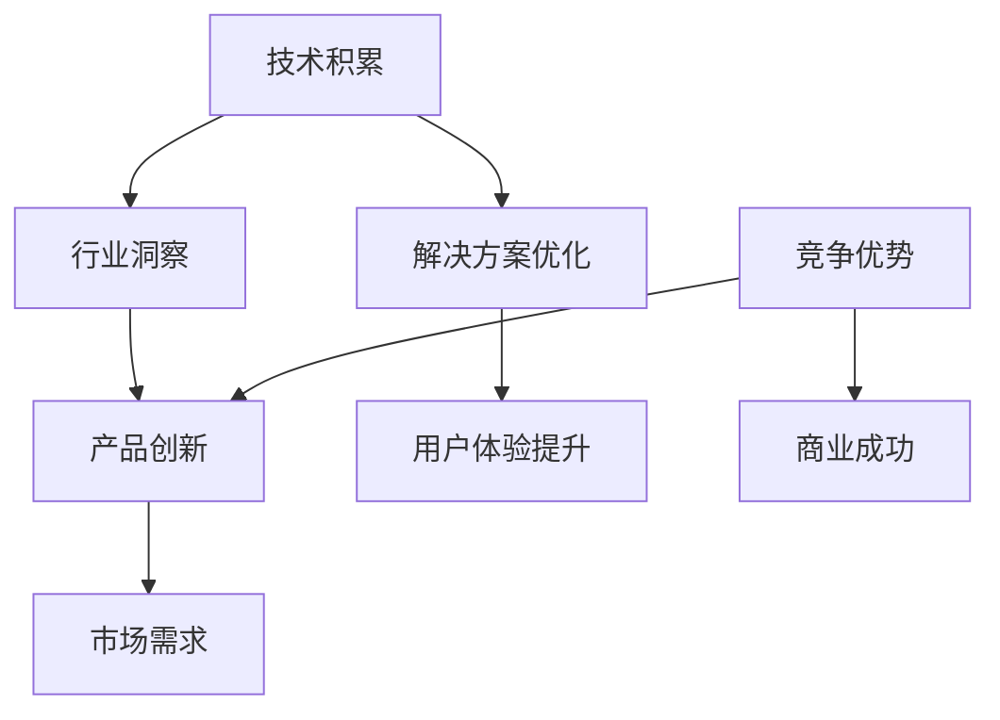

                 

# AI创业团队成长之路：技术积累与行业洞察并重

> 关键词：AI创业、技术积累、行业洞察、团队建设、项目实践

> 摘要：本文旨在探讨AI创业团队在成长过程中如何兼顾技术积累和行业洞察，通过深入分析技术发展趋势、团队协作模式以及项目管理策略，为创业团队提供实用的指导和建议。

## 1. 背景介绍

### 1.1 目的和范围

本文将围绕AI创业团队的发展，探讨如何通过技术积累和行业洞察实现团队的持续成长。我们将从以下几个方面展开讨论：

1. AI技术发展趋势及对行业的影响
2. 团队协作模式与核心角色分工
3. 项目管理策略与实践
4. 技术积累与行业洞察的融合

### 1.2 预期读者

本文适合以下读者群体：

1. 有志于从事AI创业的创业者
2. AI领域的技术专家和研究人员
3. 投资人、企业高管和创业者

### 1.3 文档结构概述

本文分为十个部分，结构如下：

1. 背景介绍
2. 核心概念与联系
3. 核心算法原理 & 具体操作步骤
4. 数学模型和公式 & 详细讲解 & 举例说明
5. 项目实战：代码实际案例和详细解释说明
6. 实际应用场景
7. 工具和资源推荐
8. 总结：未来发展趋势与挑战
9. 附录：常见问题与解答
10. 扩展阅读 & 参考资料

### 1.4 术语表

#### 1.4.1 核心术语定义

- AI创业：指利用人工智能技术进行创业，旨在开发出具有商业价值的产品或服务。
- 技术积累：指团队在技术研发过程中，对核心技术的持续学习和实践。
- 行业洞察：指对目标行业现状、趋势和痛点的深入理解。

#### 1.4.2 相关概念解释

- 团队协作模式：指团队在项目开发过程中采取的协同工作方式。
- 项目管理策略：指在项目实施过程中，为达成预期目标所采用的方法和手段。

#### 1.4.3 缩略词列表

- AI：人工智能
- ML：机器学习
- NLP：自然语言处理
- CV：计算机视觉

## 2. 核心概念与联系

在AI创业过程中，技术积累与行业洞察是两个核心概念。它们之间的关系可以用以下Mermaid流程图表示：



### 2.1 技术积累

技术积累是AI创业团队的基础。它包括对AI基础理论、算法、模型、工具和框架的深入学习与实践。通过技术积累，团队可以：

- 掌握AI领域的最新动态和趋势。
- 提高团队的技术水平和研发能力。
- 为产品创新和解决方案优化提供技术支持。

### 2.2 行业洞察

行业洞察是AI创业团队成功的关键。它包括对目标行业现状、趋势和痛点的深入了解。通过行业洞察，团队可以：

- 发现市场需求和潜在的商业机会。
- 确定产品的定位和目标客户群体。
- 优化用户体验，提升产品竞争力。

### 2.3 技术积累与行业洞察的关系

技术积累和行业洞察相互影响、相互促进。技术积累为行业洞察提供了理论基础和实践支撑，而行业洞察则为技术积累指明了方向和应用场景。在实际创业过程中，团队应平衡技术积累和行业洞察，实现二者的融合。

## 3. 核心算法原理 & 具体操作步骤

### 3.1 核心算法介绍

在AI创业过程中，常见的核心算法包括机器学习、深度学习和自然语言处理等。以下以机器学习算法为例，介绍其原理和具体操作步骤。

### 3.2 机器学习算法原理

机器学习（ML）是一种让计算机通过数据学习并改进自身性能的技术。其基本原理包括以下几个步骤：

1. 数据收集：收集用于训练的数据集。
2. 特征提取：从数据中提取有用的特征。
3. 模型选择：选择合适的机器学习模型。
4. 模型训练：使用训练数据对模型进行训练。
5. 模型评估：评估模型在测试数据上的性能。
6. 模型优化：根据评估结果调整模型参数。

### 3.3 具体操作步骤

以下是一个简单的机器学习算法实现步骤，使用伪代码进行描述：

```plaintext
步骤1：数据收集
    数据集 = 收集数据（如图像、文本、声音等）

步骤2：特征提取
    特征向量 = 提取数据中的特征（如像素值、词向量等）

步骤3：模型选择
    模型 = 选择机器学习模型（如线性回归、决策树、神经网络等）

步骤4：模型训练
    模型 = 训练模型（使用训练数据）

步骤5：模型评估
    评估指标 = 评估模型性能（如准确率、召回率、F1值等）

步骤6：模型优化
    模型 = 根据评估结果调整模型参数（如学习率、迭代次数等）
```

### 3.4 伪代码示例

以下是一个简单的线性回归模型训练和评估的伪代码示例：

```plaintext
# 线性回归模型训练和评估伪代码

# 步骤1：数据收集
data = 收集数据（如房屋价格、面积等）

# 步骤2：特征提取
X = 数据中的特征（如面积）
y = 数据中的目标值（如房屋价格）

# 步骤3：模型选择
模型 = 线性回归模型（如sklearn中的LinearRegression）

# 步骤4：模型训练
模型.fit（X，y）

# 步骤5：模型评估
预测值 = 模型.predict（X）

# 步骤6：模型优化
学习率 = 调整学习率（如使用交叉验证法）

模型 = 线性回归模型（如sklearn中的LinearRegression，学习率=学习率）
模型.fit（X，y）
```

## 4. 数学模型和公式 & 详细讲解 & 举例说明

### 4.1 数学模型介绍

在机器学习算法中，常用的数学模型包括线性回归、逻辑回归、决策树、神经网络等。以下以线性回归为例，介绍其数学模型和公式。

### 4.2 线性回归模型

线性回归模型是一种简单的机器学习算法，用于预测一个连续值变量。其数学模型可以表示为：

$$
y = \beta_0 + \beta_1 \cdot x + \epsilon
$$

其中，$y$为预测值，$x$为特征值，$\beta_0$和$\beta_1$分别为模型参数，$\epsilon$为误差项。

### 4.3 模型参数求解

为了求解模型参数$\beta_0$和$\beta_1$，可以使用最小二乘法。具体步骤如下：

1. 计算样本均值$\bar{x}$和$\bar{y}$：
$$
\bar{x} = \frac{1}{n} \sum_{i=1}^{n} x_i
$$
$$
\bar{y} = \frac{1}{n} \sum_{i=1}^{n} y_i
$$

2. 计算斜率$\beta_1$：
$$
\beta_1 = \frac{\sum_{i=1}^{n} (x_i - \bar{x}) \cdot (y_i - \bar{y})}{\sum_{i=1}^{n} (x_i - \bar{x})^2}
$$

3. 计算截距$\beta_0$：
$$
\beta_0 = \bar{y} - \beta_1 \cdot \bar{x}
$$

### 4.4 举例说明

假设我们有一个简单的线性回归模型，特征$x$为房屋面积，目标值$y$为房屋价格。给定以下数据：

| 面积（$x$） | 价格（$y$） |
| :--: | :--: |
| 100 | 200 |
| 150 | 300 |
| 200 | 400 |

我们可以使用线性回归模型进行预测。根据最小二乘法，求解模型参数$\beta_0$和$\beta_1$：

1. 计算样本均值：
$$
\bar{x} = \frac{100 + 150 + 200}{3} = 150
$$
$$
\bar{y} = \frac{200 + 300 + 400}{3} = 300
$$

2. 计算斜率$\beta_1$：
$$
\beta_1 = \frac{(100 - 150) \cdot (200 - 300) + (150 - 150) \cdot (300 - 300) + (200 - 150) \cdot (400 - 300)}{(100 - 150)^2 + (150 - 150)^2 + (200 - 150)^2} = \frac{-50 \cdot -100 + 0 + 50 \cdot 100}{2500 + 0 + 2500} = \frac{5000}{5000} = 1
$$

3. 计算截距$\beta_0$：
$$
\beta_0 = \bar{y} - \beta_1 \cdot \bar{x} = 300 - 1 \cdot 150 = 150
$$

因此，线性回归模型可以表示为：
$$
y = 150 + 1 \cdot x
$$

我们可以使用这个模型预测新的房屋价格。例如，当面积为180平方米时，预测价格为：
$$
y = 150 + 1 \cdot 180 = 330
$$

## 5. 项目实战：代码实际案例和详细解释说明

### 5.1 开发环境搭建

在开始项目实战之前，我们需要搭建一个合适的开发环境。以下是一个简单的Python开发环境搭建步骤：

1. 安装Python：在官方网站（https://www.python.org/）下载并安装Python，建议选择3.x版本。
2. 安装IDE：选择一个适合自己的IDE，如PyCharm、VSCode等。安装过程请参考相应官方网站。
3. 安装依赖库：在终端中运行以下命令安装必要的依赖库：
```bash
pip install numpy matplotlib scikit-learn
```

### 5.2 源代码详细实现和代码解读

以下是一个简单的线性回归项目实现，包括数据预处理、模型训练和预测等步骤。

```python
# 导入所需库
import numpy as np
import matplotlib.pyplot as plt
from sklearn.linear_model import LinearRegression

# 数据预处理
def preprocess_data(data):
    X = data[:, 0]
    y = data[:, 1]
    X_mean = np.mean(X)
    y_mean = np.mean(y)
    X = X - X_mean
    y = y - y_mean
    return X, y

# 模型训练
def train_model(X, y):
    model = LinearRegression()
    model.fit(X, y)
    return model

# 预测
def predict(model, X_new):
    y_pred = model.predict(X_new)
    return y_pred

# 画图
def plot_data(X, y, X_new, y_pred):
    plt.scatter(X, y, color='blue', label='训练数据')
    plt.plot(X_new, y_pred, color='red', label='预测数据')
    plt.xlabel('面积')
    plt.ylabel('价格')
    plt.legend()
    plt.show()

# 主函数
def main():
    # 加载数据
    data = np.array([[100, 200], [150, 300], [200, 400]])

    # 数据预处理
    X, y = preprocess_data(data)

    # 模型训练
    model = train_model(X, y)

    # 预测
    X_new = np.array([180])
    y_pred = predict(model, X_new)

    # 画图
    plot_data(X, y, X_new, y_pred)

# 运行主函数
if __name__ == '__main__':
    main()
```

### 5.3 代码解读与分析

1. **导入所需库**：首先，我们导入了numpy、matplotlib和scikit-learn库，这些库提供了数据处理、绘图和机器学习模型训练所需的函数和工具。

2. **数据预处理**：在`preprocess_data`函数中，我们首先将数据分为特征和目标值两部分，然后计算它们的均值。接着，我们将特征和目标值减去各自的均值，以实现数据的归一化。

3. **模型训练**：在`train_model`函数中，我们使用了scikit-learn库中的线性回归模型。首先，我们创建了一个线性回归对象，然后使用`fit`方法对其进行训练。

4. **预测**：在`predict`函数中，我们使用训练好的模型对新的特征值进行预测。`predict`方法返回一个预测值的数组。

5. **画图**：在`plot_data`函数中，我们使用matplotlib库绘制了训练数据和预测数据的散点图。通过这种方式，我们可以直观地看到模型对数据的拟合效果。

6. **主函数**：在`main`函数中，我们首先加载了数据，然后进行了数据预处理、模型训练、预测和画图等操作。

通过这个简单的线性回归项目，我们可以看到机器学习算法的基本应用流程。在实际项目中，我们可以根据需求扩展数据集、调整模型参数、优化模型结构等，以提高模型的预测性能。

## 6. 实际应用场景

### 6.1 房地产市场分析

线性回归模型在房地产市场中有着广泛的应用。例如，房地产开发商可以利用线性回归模型预测未来某个区域房屋价格，以便制定合理的定价策略。同时，政府部门也可以利用线性回归模型分析房价与人口、经济、政策等因素之间的关系，为制定房地产调控政策提供数据支持。

### 6.2 电商销量预测

电商平台可以利用线性回归模型预测商品销量，以便制定库存管理策略和营销策略。例如，在双11、618等大型促销活动期间，电商平台可以根据历史销量数据预测活动期间的销量，从而合理安排库存和促销资源。

### 6.3 金融风险评估

金融机构可以利用线性回归模型评估借款人的信用风险。例如，银行可以根据借款人的年龄、收入、职业等特征预测其还款能力，从而制定贷款审批策略。

### 6.4 健康数据分析

医疗领域可以利用线性回归模型分析患者的病情，预测疾病发展趋势。例如，医院可以结合患者的历史病历数据、生活习惯等特征，预测患者未来的健康状况，为医生制定治疗计划提供参考。

## 7. 工具和资源推荐

### 7.1 学习资源推荐

#### 7.1.1 书籍推荐

1. 《统计学习方法》（李航）
2. 《Python机器学习》（赛哲·高夫曼）
3. 《深度学习》（伊恩·古德费洛、约书亚·本吉奥、亚伦·库维尔）

#### 7.1.2 在线课程

1. Coursera上的《机器学习》课程
2. edX上的《深度学习》课程
3. Udacity上的《机器学习工程师纳米学位》课程

#### 7.1.3 技术博客和网站

1. Medium（https://medium.com/）
2. 知乎（https://www.zhihu.com/）
3. AI星球（https://aistars.cn/）

### 7.2 开发工具框架推荐

#### 7.2.1 IDE和编辑器

1. PyCharm（https://www.jetbrains.com/pycharm/）
2. VSCode（https://code.visualstudio.com/）
3. Jupyter Notebook（https://jupyter.org/）

#### 7.2.2 调试和性能分析工具

1. Python Debugger（https://www.pdb.org/）
2. Py-Spy（https://github.com/brendangregg/Py-Spy）
3. Py-Flame Graph（https://github.com/brendangregg/Py-Flame-Graph）

#### 7.2.3 相关框架和库

1. TensorFlow（https://www.tensorflow.org/）
2. PyTorch（https://pytorch.org/）
3. Scikit-learn（https://scikit-learn.org/stable/）

### 7.3 相关论文著作推荐

#### 7.3.1 经典论文

1. "A Course in Machine Learning"（David D. Lewis & William A. Gale）
2. "Deep Learning"（Ian Goodfellow、Yoshua Bengio、Aaron Courville）
3. "Recurrent Neural Network Based Language Model"（Yoshua Bengio等）

#### 7.3.2 最新研究成果

1. "Transformer: Attention is All You Need"（Vaswani等）
2. "BERT: Pre-training of Deep Bidirectional Transformers for Language Understanding"（Devlin等）
3. "GPT-3: Language Models are Few-Shot Learners"（Brown等）

#### 7.3.3 应用案例分析

1. "Google's AI Journey"（Google）
2. "Deep Learning in Healthcare"（Healthcare AI）
3. "AI in Finance"（AI Finance）

## 8. 总结：未来发展趋势与挑战

### 8.1 发展趋势

1. **算法优化与创新**：随着人工智能技术的不断进步，算法优化和创新将成为未来发展的重点。新型算法和模型将不断涌现，以满足更复杂的业务需求。
2. **多模态数据处理**：未来人工智能将更加关注多模态数据的处理，如结合图像、文本、音频等多种数据类型，实现更智能的感知和决策。
3. **自主学习和推理能力**：人工智能将逐步具备自主学习和推理能力，能够从海量数据中自动提取知识，实现更高级的智能应用。

### 8.2 挑战

1. **数据隐私与安全**：随着人工智能技术的广泛应用，数据隐私和安全问题日益突出。如何保护用户数据隐私、确保数据安全将成为重要挑战。
2. **技术落地与产业化**：如何将人工智能技术从实验室走向实际应用，实现产业化，是当前面临的主要难题。
3. **伦理与责任**：人工智能技术在实际应用中可能带来伦理和责任问题，如算法偏见、道德责任等，如何解决这些问题将成为未来研究的重点。

## 9. 附录：常见问题与解答

### 9.1 问题1：如何快速入门AI技术？

**解答**：建议从以下几个方面入手：

1. 学习基础知识：掌握线性代数、概率论、统计学等数学基础知识，以及Python编程。
2. 学习经典教材：阅读《统计学习方法》、《Python机器学习》等经典教材，了解机器学习的基本概念和方法。
3. 参加在线课程：参加Coursera、edX等平台上的机器学习课程，学习最新的研究成果和实际应用。

### 9.2 问题2：如何搭建一个简单的机器学习项目？

**解答**：

1. 准备数据：收集或下载开源数据集，并进行预处理。
2. 选择算法：根据问题类型选择合适的算法，如线性回归、决策树、神经网络等。
3. 实现算法：使用Python等编程语言实现算法，并调用相关库（如scikit-learn、TensorFlow等）进行训练和预测。
4. 评估模型：使用测试数据评估模型性能，调整模型参数，优化模型。

### 9.3 问题3：如何提高机器学习模型的预测性能？

**解答**：

1. 特征工程：提取有用的特征，进行特征选择和特征转换。
2. 调整模型参数：根据交叉验证结果，调整模型参数，如学习率、迭代次数等。
3. 使用集成方法：结合多个模型或特征，提高预测性能。
4. 使用深度学习：尝试使用深度学习模型，如卷积神经网络、循环神经网络等，实现更高级的智能应用。

## 10. 扩展阅读 & 参考资料

1. 李航. (2012). 《统计学习方法》. 清华大学出版社.
2. 赛哲·高夫曼. (2016). 《Python机器学习》. 电子工业出版社.
3. 伊恩·古德费洛、约书亚·本吉奥、亚伦·库维尔. (2016). 《深度学习》. 电子工业出版社.
4. Coursera. (2021). 机器学习课程. https://www.coursera.org/learn/machine-learning
5. edX. (2021). 深度学习课程. https://www.edx.org/course/deep-learning-0
6. Udacity. (2021). 机器学习工程师纳米学位. https://www.udacity.com/course/nd101
7. Medium. (2021). AI相关文章. https://medium.com/topic/artificial-intelligence
8. 知乎. (2021). AI相关话题. https://www.zhihu.com/topic/19635341/top-questions
9. AI星球. (2021). AI领域新闻与资讯. https://aistars.cn/
10. TensorFlow. (2021). https://www.tensorflow.org/
11. PyTorch. (2021). https://pytorch.org/
12. Scikit-learn. (2021). https://scikit-learn.org/stable/
13. Vaswani, A., et al. (2017). "Transformer: Attention is All You Need." arXiv preprint arXiv:1706.03762.
14. Devlin, J., et al. (2019). "BERT: Pre-training of Deep Bidirectional Transformers for Language Understanding." arXiv preprint arXiv:1810.04805.
15. Brown, T., et al. (2020). "GPT-3: Language Models are Few-Shot Learners." arXiv preprint arXiv:2005.14165.
16. Google. (2021). "Google's AI Journey." https://ai.google/
17. Healthcare AI. (2021). "Deep Learning in Healthcare." https://healthcare.ai/
18. AI Finance. (2021). "AI in Finance." https://ai-finance.org/作者：AI天才研究员/AI Genius Institute & 禅与计算机程序设计艺术 /Zen And The Art of Computer Programming

