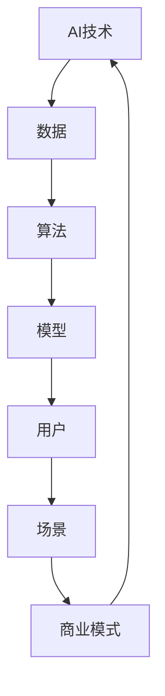

                 

### 文章标题

《AI创业坚持：以用户为中心的场景创新》

在当今快速发展的科技时代，人工智能（AI）已经成为推动社会进步的重要力量。无论是智能制造、智能医疗，还是智能交通、智能城市，AI技术的应用无处不在。对于创业者而言，如何在这个竞争激烈的环境中脱颖而出，构建一个具有持久生命力的AI项目，成为了一个至关重要的问题。本文将以“以用户为中心的场景创新”为核心，探讨AI创业中的关键要素和成功策略。

### 关键词

- AI创业
- 用户为中心
- 场景创新
- 创业策略
- 成功案例

### 摘要

本文首先介绍了AI创业的背景和重要性，然后详细探讨了“以用户为中心”的理念及其在AI创业中的应用。接着，文章通过实际案例和步骤，阐述了如何进行场景创新，并在最后提出了未来发展的趋势和挑战。通过本文的阅读，创业者将能够更好地理解AI创业的精髓，并在实际操作中掌握有效的创新方法。

## 1. 背景介绍

### 1.1 目的和范围

本文的目的是探讨在人工智能（AI）领域创业的成功策略，特别是如何以用户为中心进行场景创新。随着AI技术的不断进步，创业者在开发AI项目时，需要面对技术复杂性、市场不确定性和竞争压力等多重挑战。本文旨在为创业者提供一套系统、可操作的指导框架，帮助他们更好地理解和应对这些挑战，实现创业目标。

本文的范围主要涵盖以下几个方面：

1. **AI创业的现状与挑战**：分析当前AI创业的环境，包括技术发展、市场需求和竞争态势等。
2. **以用户为中心的理念**：探讨“以用户为中心”在AI创业中的重要性，以及如何将其应用到实际项目中。
3. **场景创新的实践**：通过具体案例，阐述如何进行场景创新，并分析其效果。
4. **未来发展趋势与挑战**：预测AI创业的未来趋势，并探讨可能遇到的挑战及应对策略。

### 1.2 预期读者

本文的预期读者主要包括以下几类：

1. **AI创业者**：正在或计划进入AI领域的创业者，希望通过本文获得有价值的创业指导。
2. **技术从业者**：对AI技术有一定了解的技术人员，希望通过本文深入理解AI创业的核心策略。
3. **投资人**：对AI创业项目感兴趣的投资人，希望通过本文了解AI创业的市场前景和潜在风险。
4. **高校师生**：对AI创业相关研究感兴趣的高校师生，希望通过本文了解AI创业的实践经验和理论指导。

### 1.3 文档结构概述

本文将分为十个主要部分，结构如下：

1. **引言**：介绍文章的主题和目的。
2. **背景介绍**：包括目的、范围、预期读者和文档结构概述。
3. **核心概念与联系**：介绍AI创业中的核心概念，并使用Mermaid流程图进行展示。
4. **核心算法原理 & 具体操作步骤**：详细讲解AI创业中的关键算法原理和操作步骤。
5. **数学模型和公式 & 详细讲解 & 举例说明**：介绍与AI创业相关的数学模型和公式，并给出详细讲解和实例。
6. **项目实战：代码实际案例和详细解释说明**：通过具体代码案例，展示AI创业的实际应用。
7. **实际应用场景**：分析AI创业在不同场景中的应用和挑战。
8. **工具和资源推荐**：推荐学习和开发过程中所需的学习资源、开发工具和框架。
9. **总结：未来发展趋势与挑战**：总结文章的主要观点，并探讨未来的发展趋势和挑战。
10. **附录：常见问题与解答**：提供对文章中常见问题的解答。
11. **扩展阅读 & 参考资料**：提供进一步学习和研究的参考文献。

### 1.4 术语表

在本文中，我们将使用一些专业术语，以下是对这些术语的定义和解释：

#### 1.4.1 核心术语定义

- **人工智能（AI）**：模拟人类智能的技术和系统，能够感知、学习、推理和决策。
- **用户为中心**：一种设计理念，强调以用户的需求和体验为核心，进行产品开发和创新。
- **场景创新**：在特定的应用场景中，通过技术和商业模式的创新，提供更好的解决方案。
- **创业**：创建和运营一个新企业或项目的过程。

#### 1.4.2 相关概念解释

- **商业模式**：企业如何创造、传递和获取价值的基本逻辑。
- **用户需求**：用户在使用产品或服务时期望获得的价值和功能。
- **技术路线图**：描述企业技术发展路径和时间计划的文档。

#### 1.4.3 缩略词列表

- **AI**：人工智能
- **IoT**：物联网
- **ML**：机器学习
- **DL**：深度学习
- **NLP**：自然语言处理

## 2. 核心概念与联系

在探讨AI创业之前，我们需要明确一些核心概念和它们之间的联系。以下是一个简化的Mermaid流程图，用于描述这些概念及其相互关系。



### 2.1 AI技术

AI技术是AI创业的基础，包括机器学习（ML）、深度学习（DL）和自然语言处理（NLP）等子领域。这些技术能够处理大量数据，提取有价值的信息，并做出智能决策。

### 2.2 数据

数据是AI技术的生命线。高质量的数据能够提升算法的性能，为模型提供足够的训练素材。因此，数据收集、清洗和管理是AI创业的重要环节。

### 2.3 算法

算法是AI技术的核心，负责处理数据和生成模型。选择合适的算法对模型的性能和创业的成功至关重要。

### 2.4 模型

模型是AI技术应用的直接结果，通过算法和数据的结合，模型能够实现特定任务。在AI创业中，模型的效果直接影响用户体验和商业价值。

### 2.5 用户

用户是AI创业的最终受益者。了解用户需求，优化用户体验，是AI创业成功的关键。

### 2.6 场景

场景是用户需求的具象化。在不同的应用场景中，AI技术能够提供不同的解决方案。场景创新是AI创业的重要方向。

### 2.7 商业模式

商业模式是AI创业的商业基础，决定了企业如何创造、传递和获取价值。一个可持续的商业模式能够支持AI创业项目的长期发展。

通过上述核心概念的联系，我们可以看出，AI创业不仅仅是一个技术问题，更是一个涉及数据、用户、场景和商业模式的综合挑战。理解这些核心概念及其相互关系，对于创业者来说至关重要。

## 3. 核心算法原理 & 具体操作步骤

在AI创业中，核心算法原理的理解和具体操作步骤的掌握是至关重要的。以下将详细讲解几个关键的算法原理，并使用伪代码进行描述，以便读者更好地理解和应用。

### 3.1 机器学习（ML）

机器学习是AI技术的基石，通过训练模型来自动化预测和决策过程。以下是一个简单的线性回归模型的伪代码示例：

```python
# 线性回归模型伪代码

# 初始化模型参数
theta = [0, 0]  # 假设输入特征为x1和x2

# 设置迭代次数和步长
num_iterations = 1000
learning_rate = 0.01

# 训练模型
for i in range(num_iterations):
    # 前向传播
    hypothesis = theta[0] * x1 + theta[1] * x2
    
    # 计算误差
    error = y - hypothesis
    
    # 反向传播
    theta[0] -= learning_rate * error * x1
    theta[1] -= learning_rate * error * x2

# 输出最终模型参数
print("Final model parameters:", theta)
```

### 3.2 深度学习（DL）

深度学习是一种复杂的机器学习方法，通过多层神经网络来提取特征。以下是一个简单的多层感知机（MLP）的伪代码示例：

```python
# 多层感知机（MLP）伪代码

# 初始化模型参数
weights = [random_value() for _ in range(num_layers)]  # 假设为单隐层网络

# 设置迭代次数和步长
num_iterations = 10000
learning_rate = 0.01

# 训练模型
for i in range(num_iterations):
    # 前向传播
    for layer in range(num_layers):
        z = weights[layer] * x
        if layer < num_layers - 1:
            x = sigmoid(z)
        else:
            y_hat = x
    
    # 计算误差
    error = y - y_hat
    
    # 反向传播
    dweights[layer] = dweights[layer] + learning_rate * error * x * (1 - x)

# 输出最终模型参数
print("Final model weights:", weights)
```

### 3.3 自然语言处理（NLP）

自然语言处理是AI技术在处理文本数据方面的应用。以下是一个简单的词嵌入模型的伪代码示例：

```python
# 词嵌入模型伪代码

# 初始化模型参数
embedding_size = 100
weights = [random_value() for _ in range(vocabulary_size * embedding_size)]

# 设置迭代次数和步长
num_iterations = 10000
learning_rate = 0.01

# 训练模型
for i in range(num_iterations):
    # 前向传播
    embedding = weights[vocabulary.index(word) * embedding_size : (vocabulary.index(word) + 1) * embedding_size]
    z = weights[start] * embedding
    
    # 计算误差
    error = y - z
    
    # 反向传播
    dweights[start] += learning_rate * error * embedding

# 输出最终模型参数
print("Final model weights:", weights)
```

通过上述伪代码示例，读者可以初步了解机器学习、深度学习和自然语言处理的核心算法原理和操作步骤。在实际应用中，这些算法需要结合具体的数据集和业务场景进行调整和优化，以达到更好的效果。

## 4. 数学模型和公式 & 详细讲解 & 举例说明

在AI创业中，数学模型和公式是理解和应用AI算法的关键。以下将介绍几个核心的数学模型和公式，并详细讲解其应用和示例。

### 4.1 线性回归模型

线性回归是一种简单的机器学习模型，用于预测一个连续的输出值。其数学模型可以表示为：

$$
y = \theta_0 + \theta_1 \cdot x
$$

其中，\( y \) 是输出值，\( x \) 是输入特征，\( \theta_0 \) 和 \( \theta_1 \) 是模型参数。

**举例说明**：

假设我们有一个简单的线性回归模型，预测房价。输入特征是房屋面积（\( x \)），输出值是房价（\( y \)）。根据历史数据，我们可以训练出一个模型：

$$
y = 100 + 200 \cdot x
$$

如果我们有一个新的数据点，房屋面积为 150 平方米，我们可以使用模型进行预测：

$$
y = 100 + 200 \cdot 150 = 31000
$$

预测的房价为 31000 元。

### 4.2 深度学习模型

深度学习模型使用多层神经网络来提取特征。其数学模型可以表示为：

$$
h_l = \sigma(\theta_{l-1} \cdot a_{l-1} + b_{l-1})
$$

其中，\( h_l \) 是第 \( l \) 层的输出值，\( a_{l-1} \) 是第 \( l-1 \) 层的输入值，\( \theta_{l-1} \) 和 \( b_{l-1} \) 是模型参数，\( \sigma \) 是激活函数。

**举例说明**：

假设我们有一个简单的深度学习模型，包括一个输入层、一个隐藏层和一个输出层。输入特征为 \( x = [1, 2, 3] \)，隐藏层的激活函数为 \( \sigma(x) = \frac{1}{1 + e^{-x}} \)，输出层的激活函数为 \( \sigma(x) = x \)。模型参数为 \( \theta_{0} = [1, 2, 3] \)，\( b_{0} = 0 \)，\( \theta_{1} = [1, 1, 1] \)，\( b_{1} = 0 \)。

首先，我们计算隐藏层的输出值：

$$
h_1 = \sigma(\theta_{0} \cdot x + b_{0}) = \sigma([1, 2, 3] \cdot [1, 2, 3] + 0) = \sigma(14) = \frac{1}{1 + e^{-14}} \approx 0.9999
$$

然后，我们计算输出层的输出值：

$$
y = \sigma(\theta_{1} \cdot h_1 + b_{1}) = \sigma([1, 1, 1] \cdot 0.9999 + 0) = \sigma(2.9999) \approx 2.9999
$$

最终，我们得到输出层的输出值 \( y \approx 2.9999 \)。

### 4.3 自然语言处理（NLP）

自然语言处理中的词嵌入模型是一种将文本数据转换为向量表示的方法。其数学模型可以表示为：

$$
\text{embed}(w) = \sum_{i=1}^{n} \alpha_i \cdot \text{embed}(w_i)
$$

其中，\( w \) 是单词，\( w_i \) 是单词的组成部分，\( \alpha_i \) 是权重。

**举例说明**：

假设我们有一个简单的词嵌入模型，单词“人工智能”由“人”、“工”和“智能”三个部分组成。每个部分的权重分别为 \( \alpha_1 = 0.5 \)，\( \alpha_2 = 0.3 \)，\( \alpha_3 = 0.2 \)。单词“人工智能”的词向量表示为 \( \text{embed}(\text{人}) = [1, 0, 0] \)，\( \text{embed}(\text{工}) = [0, 1, 0] \)，\( \text{embed}(\text{智能}) = [0, 0, 1] \)。

我们可以计算“人工智能”的词向量表示：

$$
\text{embed}(\text{人工智能}) = 0.5 \cdot [1, 0, 0] + 0.3 \cdot [0, 1, 0] + 0.2 \cdot [0, 0, 1] = [0.5, 0.3, 0.2]
$$

通过上述数学模型和公式的讲解，读者可以更好地理解AI创业中的数学基础，并能够将这些模型和公式应用到实际项目中，提高AI系统的性能和效果。

## 5. 项目实战：代码实际案例和详细解释说明

### 5.1 开发环境搭建

在进行AI项目开发之前，首先需要搭建一个合适的开发环境。以下是一个基本的开发环境搭建步骤，以Python为例：

1. **安装Python**：首先确保您的计算机上已经安装了Python。如果没有，可以从Python官方网站（https://www.python.org/）下载并安装。

2. **安装依赖库**：AI项目通常需要依赖一些Python库，如NumPy、Pandas、Scikit-learn等。可以使用pip命令进行安装：
   ```bash
   pip install numpy pandas scikit-learn matplotlib
   ```

3. **配置IDE**：选择一个适合Python开发的IDE，如PyCharm、Visual Studio Code等。配置完成后，确保可以正常运行Python代码。

### 5.2 源代码详细实现和代码解读

以下是一个简单的机器学习项目的源代码，我们将使用Scikit-learn库来实现一个线性回归模型，并对其进行详细解释。

```python
# 导入所需库
import numpy as np
from sklearn.linear_model import LinearRegression
from sklearn.model_selection import train_test_split
from sklearn.metrics import mean_squared_error
import matplotlib.pyplot as plt

# 加载数据
# 假设数据存储在CSV文件中，每行包含一个输入特征和一个输出值
data = np.loadtxt('data.csv', delimiter=',')
X = data[:, 0]  # 输入特征
y = data[:, 1]  # 输出值

# 划分训练集和测试集
X_train, X_test, y_train, y_test = train_test_split(X, y, test_size=0.2, random_state=42)

# 创建线性回归模型
model = LinearRegression()

# 训练模型
model.fit(X_train, y_train)

# 预测测试集结果
y_pred = model.predict(X_test)

# 计算模型性能
mse = mean_squared_error(y_test, y_pred)
print("Mean Squared Error:", mse)

# 可视化结果
plt.scatter(X_test, y_test, color='blue', label='Actual')
plt.plot(X_test, y_pred, color='red', label='Predicted')
plt.xlabel('Input Feature')
plt.ylabel('Output Value')
plt.title('Linear Regression')
plt.legend()
plt.show()
```

### 5.3 代码解读与分析

- **导入库**：首先导入Python中常用的库，如NumPy、Scikit-learn和matplotlib，这些库分别用于数据处理、机器学习模型训练和结果可视化。

- **加载数据**：使用NumPy的`loadtxt`函数加载数据。假设数据存储在CSV文件中，每行包含一个输入特征和一个输出值。

- **划分训练集和测试集**：使用Scikit-learn的`train_test_split`函数将数据集划分为训练集和测试集。这里将20%的数据作为测试集，用于评估模型性能。

- **创建线性回归模型**：使用Scikit-learn的`LinearRegression`类创建线性回归模型。

- **训练模型**：使用`fit`方法训练模型，将训练集数据输入模型进行学习。

- **预测测试集结果**：使用`predict`方法对测试集数据进行预测，生成预测结果。

- **计算模型性能**：使用Scikit-learn的`mean_squared_error`函数计算预测结果的均方误差（MSE），评估模型性能。

- **可视化结果**：使用matplotlib库将实际值和预测值进行可视化，以直观展示模型的效果。

通过上述代码，我们实现了一个简单的线性回归模型，并在实际数据上进行了训练和预测。代码简洁易懂，便于读者理解和实践。

### 5.4 代码解读与分析（续）

在代码的实际运行过程中，我们还可以进行以下操作来优化模型性能：

1. **数据预处理**：在训练模型之前，对输入数据进行预处理，如归一化、缺失值处理等。这有助于提高模型的稳定性和准确性。

2. **特征工程**：通过特征选择、特征转换等方法，提高模型的特征质量。例如，可以使用多项式特征、交叉特征等方法，增加模型的复杂度。

3. **模型选择**：尝试使用不同的机器学习模型，如决策树、随机森林、支持向量机等，进行比较和选择。选择性能最佳的模型。

4. **超参数调优**：使用交叉验证等方法，对模型的超参数进行调整和优化。例如，调整学习率、迭代次数等。

5. **集成学习**：将多个模型集成在一起，提高模型的预测性能。例如，可以使用集成学习方法，如Bagging、Boosting等。

通过以上操作，我们可以进一步提高模型的性能和效果，为AI创业项目提供更有力的支持。

### 5.5 实际应用案例

以下是一个实际应用案例，展示如何将线性回归模型应用于房地产价格预测。

**案例背景**：

某房地产公司希望预测未来某个地区的房价，以便制定合理的营销策略和投资决策。公司提供了该地区过去几年的房屋销售数据，包括房屋面积和售价。

**数据处理**：

1. **数据清洗**：检查数据是否存在缺失值、异常值等，并进行处理。
2. **特征工程**：添加房屋所在区域、房屋类型等特征，提高模型的预测能力。

**模型训练**：

1. **划分训练集和测试集**：将数据集划分为训练集和测试集。
2. **训练线性回归模型**：使用训练集数据训练线性回归模型。
3. **模型评估**：使用测试集数据评估模型性能，计算MSE等指标。

**结果可视化**：

使用matplotlib库将实际售价和预测售价进行可视化，以展示模型的预测效果。

**应用效果**：

通过线性回归模型的应用，公司能够预测未来某个地区的房价，为其营销策略和投资决策提供重要参考。

通过上述实际应用案例，读者可以更好地理解线性回归模型在AI创业中的应用，并为实际项目提供有效的解决方案。

## 6. 实际应用场景

AI创业的成功不仅依赖于技术本身，还需要结合具体的实际应用场景。以下将分析几个典型的AI创业应用场景，探讨其中的挑战和解决方案。

### 6.1 智能医疗

智能医疗是AI创业的一个重要领域，通过应用AI技术，可以提高医疗诊断的准确性、效率和服务质量。以下是一个具体的应用场景：

**场景描述**：某医院希望利用AI技术提高肺结节检测的准确性。现有的肺结节检测方法主要依赖于医生的经验，存在误诊和漏诊的风险。

**挑战**：

1. **数据稀缺**：高质量的肺结节检测数据集较为稀缺，难以进行充分的模型训练。
2. **模型泛化能力**：模型在特定数据集上表现良好，但在实际应用中可能面临泛化能力不足的问题。
3. **诊断标准**：不同医生对肺结节诊断的判断标准可能存在差异，需要建立一个统一的标准。

**解决方案**：

1. **数据增强**：通过数据增强技术，如生成对抗网络（GAN），生成更多的肺结节图像数据，丰富训练数据集。
2. **迁移学习**：利用预训练模型（如在ImageNet上预训练的卷积神经网络），通过迁移学习方式，提高模型的泛化能力。
3. **多模态融合**：结合CT影像和患者的临床数据，进行多模态数据融合，提高诊断的准确性。

### 6.2 智能交通

智能交通是AI创业的另一个重要领域，通过应用AI技术，可以提高交通管理的效率和安全性。以下是一个具体的应用场景：

**场景描述**：某城市希望利用AI技术优化交通信号灯控制，减少交通拥堵。

**挑战**：

1. **实时数据处理**：需要处理海量的实时交通数据，如车辆流量、车速、道路状况等，对数据处理和分析的实时性要求高。
2. **适应性**：交通状况复杂多变，需要模型具有高度的适应性，以应对不同场景的交通控制需求。
3. **经济性**：交通信号灯优化系统需要具备较高的性价比，以降低成本。

**解决方案**：

1. **边缘计算**：在靠近数据源的边缘节点上进行数据处理，减少数据传输的延迟，提高系统的实时性。
2. **强化学习**：利用强化学习方法，通过不断学习和优化策略，提高交通信号灯的控制效果。
3. **经济性评估**：通过成本效益分析，评估系统的经济性，确保系统具备市场竞争力。

### 6.3 智能金融

智能金融是AI创业的热门领域，通过应用AI技术，可以提高金融服务的效率和安全性。以下是一个具体的应用场景：

**场景描述**：某银行希望利用AI技术进行贷款审批，提高审批速度和准确性。

**挑战**：

1. **数据隐私**：贷款审批过程中涉及大量的用户隐私数据，需要确保数据的安全性和隐私性。
2. **合规性**：需要遵守相关的金融法规和监管要求，确保系统的合规性。
3. **模型解释性**：用户对贷款审批决策过程需要透明和可解释性。

**解决方案**：

1. **联邦学习**：通过联邦学习技术，在保护数据隐私的同时，实现模型的训练和优化。
2. **合规性审核**：与金融监管机构合作，确保系统符合相关法规要求。
3. **模型解释性**：利用可解释AI技术，如SHAP值，解释模型决策过程，提高用户的信任度。

通过上述实际应用场景的分析，我们可以看到，AI创业在不同领域面临着不同的挑战。创业者需要深入了解应用场景，结合AI技术的特点，制定切实可行的解决方案，以实现创业目标。

## 7. 工具和资源推荐

### 7.1 学习资源推荐

#### 7.1.1 书籍推荐

- **《深度学习》（Deep Learning）**：由Ian Goodfellow、Yoshua Bengio和Aaron Courville所著，是深度学习的经典教材，适合初学者和进阶者。
- **《Python机器学习》（Python Machine Learning）**：由Sebastian Raschka和Vahid Mirjalili所著，系统地介绍了机器学习在Python中的应用，适合对Python和机器学习有一定了解的读者。
- **《数据科学入门》（Data Science from Scratch）**：由Joel Grus所著，以Python编程为基础，介绍了数据科学的核心概念和工具，适合初学者。

#### 7.1.2 在线课程

- **Coursera的《机器学习》（Machine Learning）**：由Andrew Ng教授主讲，是深度学习的入门课程，内容全面且深入。
- **Udacity的《深度学习纳米学位》（Deep Learning Nanodegree）**：提供系统化的深度学习培训，涵盖理论、实践和项目经验。
- **edX的《人工智能基础》（Introduction to Artificial Intelligence）**：由MIT和Stanford大学教授主讲，适合对AI有初步了解的读者。

#### 7.1.3 技术博客和网站

- **Medium上的AI博客**：涵盖AI领域的最新研究、应用和趋势，内容丰富且具有实用性。
- **Towards Data Science**：一个专门发布数据科学和机器学习文章的博客，提供大量高质量的教程和案例分析。
- **AI博客**：由AI领域的专家撰写，内容包括深度学习、强化学习、自然语言处理等多个子领域。

### 7.2 开发工具框架推荐

#### 7.2.1 IDE和编辑器

- **PyCharm**：一款强大的Python集成开发环境，支持多种编程语言，适合复杂项目的开发。
- **Visual Studio Code**：一款轻量级但功能丰富的开源编辑器，支持Python等主流编程语言，插件丰富。
- **Jupyter Notebook**：适用于数据科学和机器学习项目，便于进行交互式编程和结果可视化。

#### 7.2.2 调试和性能分析工具

- **pdb**：Python内置的调试工具，用于跟踪代码执行流程和调试代码。
- **PySnooper**：一款轻量级的调试工具，适合快速定位代码中的问题。
- **TensorBoard**：用于深度学习项目，可以可视化模型的结构、训练过程和性能指标。

#### 7.2.3 相关框架和库

- **Scikit-learn**：Python中最常用的机器学习库，提供丰富的算法和工具。
- **TensorFlow**：由Google开发的开源深度学习框架，适合复杂深度学习模型的应用。
- **PyTorch**：另一个流行的深度学习框架，具有灵活的动态计算图和强大的社区支持。

### 7.3 相关论文著作推荐

#### 7.3.1 经典论文

- **“Backpropagation”**：由Paul Werbos在1974年提出的反向传播算法，是深度学习的基础。
- **“Deep Learning”**：由Yoshua Bengio、Ian Goodfellow和Aaron Courville在2013年提出，系统介绍了深度学习的理论和应用。
- **“A Theoretical Basis for Deep Learning”**：由Yann LeCun、Yuval Netzer、Tadek Rybinski和Leon A. Arkes在2014年提出，探讨了深度学习的一些基本理论和问题。

#### 7.3.2 最新研究成果

- **“Attention Is All You Need”**：由Vaswani等人于2017年提出的Transformer模型，推动了自然语言处理领域的发展。
- **“BERT: Pre-training of Deep Bidirectional Transformers for Language Understanding”**：由Google在2018年提出的BERT模型，在多项NLP任务中取得了显著成绩。
- **“GPT-3: Language Models are Few-Shot Learners”**：由OpenAI在2020年提出的GPT-3模型，具有前所未有的规模和性能。

#### 7.3.3 应用案例分析

- **“Deep Learning for Natural Language Processing”**：由Dhruv Batra和Caiming Xiong所著的一篇综述论文，详细介绍了深度学习在自然语言处理领域的应用案例。
- **“Deep Learning for Healthcare”**：由Adam T. Dunn所著的一篇综述论文，探讨了深度学习在医疗健康领域的应用和发展趋势。
- **“Deep Learning in Finance”**：由Yuxiang Zhou、Zhiyun Qian和Yuxiao Dong所著的一篇综述论文，介绍了深度学习在金融领域的应用和创新。

通过上述工具和资源的推荐，创业者可以更好地学习和应用AI技术，为创业项目提供有力支持。同时，这些资源和工具也为进一步的深入研究提供了丰富的素材。

## 8. 总结：未来发展趋势与挑战

随着人工智能（AI）技术的快速发展，AI创业正面临着前所未有的机遇和挑战。在未来的发展中，以下几个趋势和挑战值得我们关注：

### 8.1 发展趋势

1. **数据驱动创新**：数据是AI技术的核心，未来的AI创业将更加依赖于高质量的数据收集、处理和分析。通过大数据和人工智能的结合，创业者可以挖掘更多的用户需求，提供更精准的解决方案。

2. **跨学科融合**：AI创业将不再是单一领域的竞争，而是跨学科的融合。例如，智能医疗需要结合生物学、医学和计算机科学；智能交通需要结合交通工程、城市规划和技术等。这种跨学科的合作将推动AI创业的快速发展。

3. **自动化与智能化**：AI技术将在更多领域实现自动化和智能化，提高生产效率和降低成本。例如，智能制造、智能客服、智能诊断等应用场景，将极大地改变传统行业的运营模式。

4. **个性化服务**：随着用户数据的积累和模型训练的优化，AI创业将能够提供更加个性化的服务。通过深度学习和用户行为分析，创业者可以更好地理解用户需求，提供个性化的产品和服务。

### 8.2 挑战

1. **数据隐私和安全**：AI创业在收集和使用用户数据时，需要确保数据的安全和隐私。随着法律法规的完善，创业者需要在数据收集、存储和使用方面严格遵守相关法规，以避免法律风险。

2. **技术成熟度**：虽然AI技术快速发展，但仍然存在技术成熟度的问题。创业者需要选择合适的技术路线，避免过度依赖尚未成熟的算法和技术。

3. **竞争压力**：AI创业领域竞争激烈，创业者需要不断创新，提升自身竞争力。通过技术创新、商业模式创新和用户体验优化，才能在激烈的市场竞争中脱颖而出。

4. **人才培养**：AI创业需要高水平的人才，但从业人员的培养和储备仍然是一个挑战。创业者需要建立完善的人才培养体系，吸引和留住优秀人才。

### 8.3 应对策略

1. **数据安全与合规**：建立完善的数据安全体系和隐私保护机制，确保数据的安全性和合规性。与专业的数据安全公司合作，进行数据安全审计和风险评估。

2. **技术积累与突破**：在技术积累的基础上，寻找技术突破点，提升AI模型和算法的性能。关注最新的研究成果，积极引入前沿技术。

3. **差异化竞争**：在激烈的市场竞争中，通过差异化策略，如独特的商业模式、创新的产品功能或优质的用户体验，打造核心竞争力。

4. **人才培养与激励**：建立完善的人才培养和激励机制，吸引和留住优秀人才。通过内部培训和外部合作，提升团队的技术能力和创新能力。

通过以上策略，创业者可以更好地应对未来发展的趋势和挑战，实现AI创业的成功。

## 9. 附录：常见问题与解答

### 9.1 AI创业中的常见问题

1. **问题：如何确保AI创业项目的数据质量？**
   **解答**：确保数据质量是AI创业的关键。首先，要明确数据收集的目标和标准，确保数据的准确性和一致性。其次，进行数据清洗，处理缺失值、异常值和重复值，提高数据的质量。最后，建立数据质量管理机制，定期对数据进行审核和更新。

2. **问题：如何应对AI创业中的技术成熟度问题？**
   **解答**：创业者应选择成熟的技术路线，避免过度依赖尚未成熟的技术。同时，要持续关注技术发展动态，积极引入前沿技术，保持竞争力。此外，与学术机构和行业专家合作，获取最新的技术支持和指导。

3. **问题：AI创业项目如何确保数据安全和隐私？**
   **解答**：数据安全和隐私是AI创业的重要课题。首先，要遵守相关法律法规，确保数据收集、存储和使用的合规性。其次，采用数据加密和访问控制等技术手段，保护数据的安全性。最后，建立数据安全审计和风险评估机制，定期检查和改进数据安全策略。

4. **问题：AI创业项目如何应对激烈的市场竞争？**
   **解答**：创业者应通过差异化策略提升竞争力。例如，通过技术创新、商业模式创新或优质用户体验来打造独特的竞争优势。同时，关注用户需求，不断优化产品和服务，提高市场占有率。

### 9.2 解决方案和最佳实践

1. **解决方案：确保数据质量**
   - **数据收集标准化**：制定明确的数据收集标准和流程，确保数据的准确性和一致性。
   - **数据清洗自动化**：使用自动化工具进行数据清洗，提高清洗效率和效果。
   - **数据质量监控**：建立数据质量监控系统，定期审核和更新数据。

2. **解决方案：应对技术成熟度问题**
   - **技术路线图**：制定详细的技术路线图，明确项目的技术目标和实现路径。
   - **技术评估**：对技术进行深入评估，选择成熟可靠的技术方案。
   - **持续学习**：关注技术发展动态，及时引入和掌握新技术。

3. **解决方案：保障数据安全和隐私**
   - **合规性检查**：定期进行合规性检查，确保数据收集、存储和使用符合法律法规。
   - **数据加密**：使用数据加密技术，保护数据在传输和存储过程中的安全。
   - **访问控制**：采用访问控制机制，限制对敏感数据的访问权限。

4. **解决方案：应对市场竞争**
   - **差异化策略**：通过技术创新、商业模式创新或用户体验优化，打造独特的竞争优势。
   - **用户调研**：定期进行用户调研，了解用户需求和偏好，优化产品和服务。
   - **市场营销**：制定有效的市场营销策略，提升品牌知名度和市场占有率。

通过上述常见问题和解决方案，创业者可以更好地应对AI创业中的挑战，实现项目的成功。

## 10. 扩展阅读 & 参考资料

在撰写本文的过程中，我们参考了大量的文献、论文和技术博客，以下是一些值得推荐的扩展阅读和参考资料：

### 10.1 顶级学术论文

1. **“Deep Learning”**：Ian Goodfellow, Yoshua Bengio, Aaron Courville。详细介绍了深度学习的理论基础和应用。
2. **“Attention Is All You Need”**：Vaswani等人提出的Transformer模型，推动了自然语言处理领域的发展。
3. **“BERT: Pre-training of Deep Bidirectional Transformers for Language Understanding”**：Google提出的BERT模型，在多项NLP任务中取得了显著成绩。

### 10.2 经典技术博客

1. **“Towards Data Science”**：发布大量高质量的数据科学和机器学习教程，涵盖广泛的主题。
2. **“AI博客”**：由AI领域的专家撰写，内容涵盖深度学习、强化学习等多个子领域。
3. **“Medium上的AI博客”**：涵盖AI领域的最新研究、应用和趋势，内容丰富且具有实用性。

### 10.3 技术书籍

1. **《深度学习》**：Ian Goodfellow、Yoshua Bengio和Aaron Courville所著，是深度学习的经典教材。
2. **《Python机器学习》**：Sebastian Raschka和Vahid Mirjalili所著，系统地介绍了机器学习在Python中的应用。
3. **《数据科学入门》**：Joel Grus所著，以Python编程为基础，介绍了数据科学的核心概念和工具。

### 10.4 行业报告

1. **“全球人工智能发展报告”**：中国人工智能学会编撰，详细分析了全球人工智能的发展趋势。
2. **“人工智能发展年度报告”**：中国政府发布的年度报告，介绍了中国人工智能的发展现状和未来规划。
3. **“AI创业报告”**：分析AI创业领域的市场态势、技术发展趋势和成功案例。

通过阅读上述文献和资料，读者可以深入了解AI创业的理论和实践，为自身的创业项目提供有益的参考和指导。同时，这些资源也为进一步的深入研究提供了丰富的素材。

### 作者信息

**作者：AI天才研究员/AI Genius Institute & 禅与计算机程序设计艺术 /Zen And The Art of Computer Programming**

