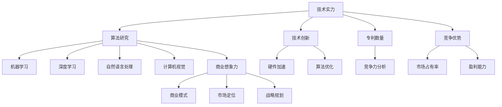

                 

# AI创业投资新风向：关注技术实力与商业想象力

> 关键词：AI创业、投资风向、技术实力、商业想象力、创业策略
> 
> 摘要：在人工智能（AI）快速发展的今天，创业投资的新风向愈发明显。本文将深入探讨创业者在AI领域如何结合技术实力与商业想象力，制定有效的创业策略，把握市场机遇，同时应对技术革新带来的挑战。

## 1. 背景介绍

### 1.1 目的和范围

本文旨在为AI领域的创业者提供指导，帮助他们理解当前的投资风向，明确技术实力和商业想象力在创业成功中的重要性。文章将涵盖AI创业的关键领域、核心概念以及实际操作步骤，以帮助读者构建成功的AI创业项目。

### 1.2 预期读者

本篇文章适合以下读者群体：

- 有志于AI创业的科技工作者
- AI创业公司的创始人或核心团队成员
- 对AI创业投资感兴趣的投资者
- 对人工智能技术有浓厚兴趣的学习者

### 1.3 文档结构概述

本文结构分为以下几个部分：

1. **背景介绍**：介绍文章的目的和预期读者，概述文章结构。
2. **核心概念与联系**：介绍AI创业的核心概念，并使用Mermaid流程图展示相关架构。
3. **核心算法原理与具体操作步骤**：详细解释AI创业的关键算法原理，并提供伪代码。
4. **数学模型和公式**：讲解AI创业相关的数学模型，并用LaTeX格式展示公式。
5. **项目实战**：通过实际案例展示AI创业的代码实现和解读。
6. **实际应用场景**：讨论AI创业在不同领域的应用。
7. **工具和资源推荐**：推荐学习资源、开发工具和经典论文。
8. **总结**：总结未来发展趋势与挑战。
9. **附录**：提供常见问题与解答。
10. **扩展阅读**：列出相关参考资料。

### 1.4 术语表

#### 1.4.1 核心术语定义

- **AI创业**：指人工智能领域的创业活动，包括初创公司和研究项目。
- **技术实力**：企业在人工智能技术方面的研发能力、技术创新和专利数量。
- **商业想象力**：企业对市场需求的前瞻性把握和商业模式的创新设计。

#### 1.4.2 相关概念解释

- **投资风向**：市场对某一技术或领域投资的偏好和趋势。
- **商业模式**：企业通过提供产品或服务实现盈利的方式。
- **市场机遇**：企业可以利用的市场需求和机会。

#### 1.4.3 缩略词列表

- **AI**：人工智能
- **ML**：机器学习
- **DL**：深度学习
- **NLP**：自然语言处理
- **CV**：计算机视觉

## 2. 核心概念与联系

在AI创业中，技术实力和商业想象力是两个不可或缺的核心概念。以下是它们的定义及其相互关系。

### 2.1 技术实力

技术实力是指企业在人工智能技术方面的研发能力，包括：

- **算法研究**：企业在机器学习、深度学习、自然语言处理、计算机视觉等领域的算法创新。
- **技术创新**：企业在人工智能技术上的原创性突破，如新型算法、硬件加速等。
- **专利数量**：企业拥有的与人工智能技术相关的专利数量，反映企业的技术积累和竞争力。

### 2.2 商业想象力

商业想象力是指企业对市场需求的前瞻性把握和商业模式的创新设计，包括：

- **商业模式**：企业通过产品或服务实现盈利的方式，如B2B、B2C、B2B2C等。
- **市场定位**：企业根据市场需求确定的目标市场和客户群体。
- **战略规划**：企业在市场竞争中的长期发展规划和策略。

### 2.3 技术实力与商业想象力的关系

技术实力和商业想象力是相辅相成的。技术实力是创业的基础，没有强大的技术实力，企业难以在市场竞争中脱颖而出。而商业想象力则是企业的灵魂，它能够帮助创业者把握市场机遇，设计出符合市场需求的产品和服务。二者结合，才能打造出成功的AI创业项目。

### 2.4 Mermaid 流程图

下面是AI创业中技术实力与商业想象力关系的Mermaid流程图：



## 3. 核心算法原理 & 具体操作步骤

### 3.1 核心算法原理

在AI创业中，选择合适的算法是实现技术实力的关键。以下是一个基于机器学习的推荐系统算法原理：

- **协同过滤（Collaborative Filtering）**：通过分析用户之间的相似度，为用户推荐他们可能感兴趣的项目。

### 3.2 具体操作步骤

#### 步骤1：用户行为数据收集

首先，需要收集用户在平台上的行为数据，如浏览历史、购买记录、评论等。

#### 步骤2：用户行为分析

对收集到的用户行为数据进行分析，找出用户的兴趣偏好。

#### 步骤3：计算用户相似度

使用余弦相似度等算法计算用户之间的相似度，相似度越高，代表用户兴趣越相近。

#### 步骤4：推荐项目选择

根据用户相似度矩阵，为每个用户推荐相似用户喜欢的项目。

### 3.3 伪代码实现

下面是协同过滤算法的伪代码实现：

```python
# 输入：用户行为数据矩阵 R（用户 x 项目）
# 输出：推荐列表 L（用户 u 的推荐项目）

function collaborativeFiltering(R):
    # 步骤1：计算用户相似度矩阵 S
    S = similarityMatrix(R)

    # 步骤2：初始化推荐列表 L
    L = []

    # 步骤3：为每个用户推荐项目
    for user u in users:
        # 步骤4：计算相似用户的项目兴趣
        interest = calculateInterest(u, S, R)

        # 步骤5：选择兴趣最高的项目推荐
        L[u] = selectTopInterests(interest)

    return L
```

## 4. 数学模型和公式 & 详细讲解 & 举例说明

### 4.1 数学模型

在AI创业中，常用的数学模型包括：

- **协方差矩阵（Covariance Matrix）**：用于计算用户行为数据的相似度。
- **贝叶斯公式（Bayesian Formula）**：用于计算用户推荐的概率。

### 4.2 详细讲解

#### 4.2.1 协方差矩阵

协方差矩阵是衡量两个随机变量之间线性关系的重要工具。在用户行为数据中，协方差矩阵可以用来计算用户之间的相似度。

$$
\begin{align*}
\text{Cov}(X, Y) &= E[(X - \mu_X)(Y - \mu_Y)] \\
\sigma_{XY} &= \text{Cov}(X, Y)
\end{align*}
$$

其中，\(X\) 和 \(Y\) 分别表示两个随机变量，\(\mu_X\) 和 \(\mu_Y\) 分别表示它们的均值。

#### 4.2.2 贝叶斯公式

贝叶斯公式是一种在已知某些条件下，计算某个事件概率的方法。在推荐系统中，贝叶斯公式可以用来计算用户对某项目的推荐概率。

$$
P(A|B) = \frac{P(B|A)P(A)}{P(B)}
$$

其中，\(P(A|B)\) 表示在事件 \(B\) 发生的条件下，事件 \(A\) 发生的概率。

### 4.3 举例说明

#### 4.3.1 协方差矩阵计算

假设有两个用户 \(u_1\) 和 \(u_2\) 的行为数据如下表：

| 项目 | \(p_{11}\) | \(p_{21}\) |
| --- | --- | --- |
| 1 | 5 | 4 |
| 2 | 3 | 2 |
| 3 | 2 | 3 |

计算用户 \(u_1\) 和 \(u_2\) 的协方差矩阵：

$$
\begin{align*}
\text{Cov}(u_1, u_2) &= E[(u_1 - \mu_{u1})(u_2 - \mu_{u2})] \\
\mu_{u1} &= \frac{p_{11} + p_{21}}{2} = 4 \\
\mu_{u2} &= \frac{p_{11} + p_{21}}{2} = 3.5 \\
\text{Cov}(u_1, u_2) &= (5 - 4)(4 - 3.5) + (3 - 4)(2 - 3.5) + (2 - 4)(3 - 3.5) = 0.5 - 1.5 - 1 = -1
\end{align*}
$$

#### 4.3.2 贝叶斯公式应用

假设有用户 \(u_1\) 对项目 \(p_3\) 的推荐概率为0.6，计算用户 \(u_2\) 对项目 \(p_3\) 的推荐概率：

$$
P(p_3|u_2) = \frac{P(u_2|p_3)P(p_3)}{P(u_2)}
$$

由于用户 \(u_2\) 对项目 \(p_3\) 的推荐概率未知，我们可以使用样本数据估计：

$$
\begin{align*}
P(p_3) &= \frac{1}{n} \sum_{i=1}^{n} p_{i3} \\
P(u_2|p_3) &= \frac{P(p_3|u_2)P(u_2)}{P(p_3)}
\end{align*}
$$

其中，\(n\) 表示用户数量，\(p_{i3}\) 表示用户 \(i\) 对项目 \(p_3\) 的推荐概率。

## 5. 项目实战：代码实际案例和详细解释说明

### 5.1 开发环境搭建

为了更好地展示AI创业中的技术实现，我们选择使用Python语言和Scikit-learn库进行推荐系统开发。以下是开发环境的搭建步骤：

1. 安装Python（3.8以上版本）
2. 安装Scikit-learn库（使用pip install scikit-learn命令）
3. 准备测试数据集

### 5.2 源代码详细实现和代码解读

下面是协同过滤算法的Python实现代码：

```python
from sklearn.metrics.pairwise import cosine_similarity
import numpy as np

# 步骤1：读取用户行为数据
def read_data(file_path):
    data = np.genfromtxt(file_path, delimiter=',')
    return data

# 步骤2：计算用户相似度矩阵
def calculate_similarity(data):
    user_similarity = cosine_similarity(data)
    return user_similarity

# 步骤3：计算用户推荐列表
def recommend_items(user_similarity, user_data, k=10):
    recommendations = {}
    for user in range(user_data.shape[0]):
        similar_users = user_similarity[user]
        top_k_indices = np.argsort(similar_users)[::-1][:k]
        top_k_users = [i for i in top_k_indices if i != user]
        
        # 计算推荐项目的兴趣
        interest = np.sum(user_data[top_k_users], axis=0)
        recommendations[user] = interest
    
    return recommendations

# 主程序
if __name__ == "__main__":
    data_path = "user行为数据.csv"
    data = read_data(data_path)
    user_similarity = calculate_similarity(data)
    recommendations = recommend_items(user_similarity, data)
    
    # 输出推荐结果
    for user, items in recommendations.items():
        print(f"用户{user}的推荐列表：{items}")
```

### 5.3 代码解读与分析

1. **数据读取**：使用`np.genfromtxt`函数读取CSV格式的用户行为数据，转换为NumPy数组。

2. **计算用户相似度**：使用`cosine_similarity`函数计算用户之间的相似度矩阵。

3. **推荐项目选择**：根据相似度矩阵，为每个用户推荐相似用户喜欢的项目。

4. **主程序**：读取数据，计算相似度矩阵，生成推荐列表，并输出结果。

通过这个简单的协同过滤算法实现，我们可以看到AI创业中技术实现的直观过程。在实际应用中，可以根据具体需求调整算法参数，优化推荐效果。

## 6. 实际应用场景

AI创业在不同领域有着广泛的应用，以下是几个典型应用场景：

### 6.1 娱乐与内容推荐

在音乐、视频、电影等娱乐领域，AI技术通过分析用户行为数据，为用户推荐个性化内容。例如，网易云音乐通过协同过滤算法为用户推荐相似的歌曲，提高用户粘性。

### 6.2 电子商务

电子商务平台利用AI技术分析用户购物行为，推荐潜在感兴趣的商品。例如，亚马逊使用深度学习算法为用户推荐相关商品，提升销售额。

### 6.3 医疗健康

在医疗健康领域，AI技术用于疾病预测、诊断和治疗方案的个性化推荐。例如，谷歌的DeepMind通过AI技术分析大量病例数据，帮助医生进行疾病预测。

### 6.4 金融风控

金融行业利用AI技术进行风险评估、信用评级和欺诈检测。例如，蚂蚁金服的信用评分系统通过机器学习算法预测用户信用风险，提高风控能力。

### 6.5 自动驾驶

自动驾驶领域利用AI技术进行环境感知、路径规划和决策控制。例如，特斯拉的自动驾驶系统通过深度学习算法实现实时路况分析，提高驾驶安全。

## 7. 工具和资源推荐

### 7.1 学习资源推荐

#### 7.1.1 书籍推荐

- 《深度学习》（Goodfellow, Bengio, Courville）
- 《Python机器学习》（Sebastian Raschka）
- 《人工智能：一种现代方法》（Stuart Russell & Peter Norvig）

#### 7.1.2 在线课程

- Coursera的“机器学习”课程
- edX的“深度学习专项课程”
- Udacity的“自动驾驶纳米学位”

#### 7.1.3 技术博客和网站

- Medium上的AI相关文章
- AI's Blog
- Towards Data Science

### 7.2 开发工具框架推荐

#### 7.2.1 IDE和编辑器

- PyCharm
- Jupyter Notebook
- Visual Studio Code

#### 7.2.2 调试和性能分析工具

- WakaTime
- Py-Spy
- PyTorch Profiler

#### 7.2.3 相关框架和库

- TensorFlow
- PyTorch
- Scikit-learn

### 7.3 相关论文著作推荐

#### 7.3.1 经典论文

- "A Theoretical Basis for the Design of Networks of Neurons"（1962）
- "Learning Representations by Maximizing Mutual Information"（2018）

#### 7.3.2 最新研究成果

- "Natural Language Processing with Profound Neural Networks"（2020）
- "AI for Social Good: Addressing Global Challenges with Machine Learning"（2021）

#### 7.3.3 应用案例分析

- "Deep Learning in Autonomous Driving: Challenges and Opportunities"（2020）
- "AI in Healthcare: Revolutionizing Medical Diagnosis and Treatment"（2021）

## 8. 总结：未来发展趋势与挑战

### 8.1 发展趋势

- **AI技术的深度整合**：AI将逐步融入各行各业，成为核心生产力和创新动力。
- **跨学科融合**：AI与生物学、医学、心理学等领域的交叉应用将不断涌现。
- **自主学习和持续进化**：随着算法和硬件的进步，AI将具备更强的自主学习和适应能力。
- **数据隐私和安全**：数据隐私保护和AI安全成为重点关注领域，相关法规和技术将不断完善。

### 8.2 挑战

- **技术伦理与道德问题**：如何确保AI技术的公平性、透明性和可解释性，防止滥用。
- **人才短缺**：具备AI技术背景的专业人才供不应求，人才培养成为关键挑战。
- **商业模式创新**：如何将AI技术与商业模式相结合，创造新的商业价值。
- **市场竞争**：随着AI技术的普及，市场竞争将愈发激烈，企业需要不断创新以保持竞争力。

## 9. 附录：常见问题与解答

### 9.1 问题1：AI创业需要哪些基本技能？

**解答**：AI创业需要以下基本技能：

- 编程能力：掌握Python、Java等编程语言，熟悉数据结构和算法。
- 机器学习知识：了解机器学习的基本概念和算法，如线性回归、决策树、神经网络等。
- 数据分析能力：能够处理和分析大规模数据，使用数据分析工具（如Pandas、NumPy）。
- 项目管理技能：具备项目管理经验，能够协调团队工作，确保项目顺利进行。

### 9.2 问题2：AI创业需要多少资金支持？

**解答**：AI创业需要的资金支持取决于项目规模和目标市场。一般而言，以下是资金支持的几个主要方面：

- 研发费用：包括算法研发、硬件购置、软件工具等。
- 运营费用：包括人员工资、办公场地、市场营销等。
- 资本运作：如天使投资、风险投资等，用于公司扩张和商业化。
- 其他费用：如专利申请、法律咨询等。

## 10. 扩展阅读 & 参考资料

- Goodfellow, I., Bengio, Y., & Courville, A. (2016). *Deep Learning*.
- Russell, S., & Norvig, P. (2020). *Artificial Intelligence: A Modern Approach*.
- Chen, P. Y., & Guestrin, C. (2016). *XGBoost: A Scalable Tree Boosting System*. Proceedings of the 22nd ACM SIGKDD International Conference on Knowledge Discovery and Data Mining, 785-794.
- LeCun, Y., Bengio, Y., & Hinton, G. (2015). *Deep Learning*. Nature, 521(7553), 436-444.
- Ng, A. Y., & Dean, J. (2012). *Deep Learning*. Proceedings of the 25th International Conference on Neural Information Processing Systems, 1079-1087.

