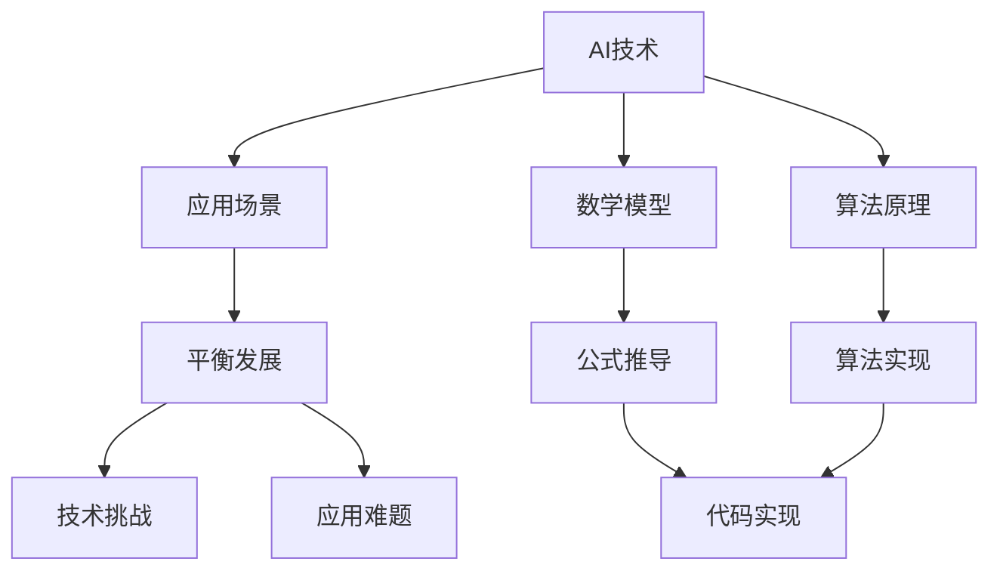
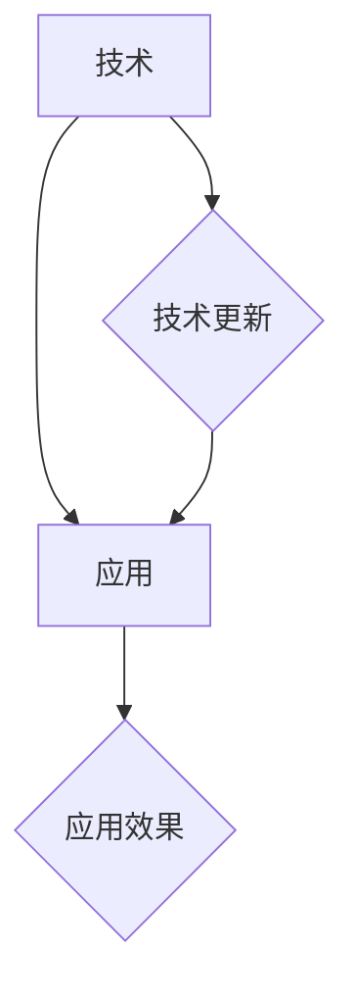
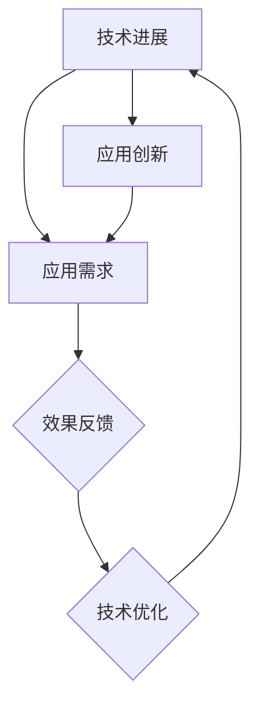

                 

# AI创业挑战：技术，应用与场景平衡

> **关键词：** AI创业，技术挑战，应用场景，平衡发展
>
> **摘要：** 本文深入探讨了人工智能（AI）创业中的技术难题、应用场景选择以及如何实现技术与应用的平衡发展。通过分析实际案例和提供相关资源，本文旨在为AI创业者和相关从业者提供实用的指导和建议。

## 1. 背景介绍

### 1.1 目的和范围

本文的目标是帮助AI创业者更好地理解AI技术在实际应用中的挑战，以及如何选择合适的应用场景，实现技术与场景的平衡。本文将涵盖以下内容：

- AI创业的现状与挑战
- 技术选择与评估
- 应用场景分析
- 实现技术与应用的平衡
- 相关工具和资源的推荐

### 1.2 预期读者

本文适合以下读者群体：

- AI创业者
- AI技术爱好者
- 对AI应用场景感兴趣的从业者
- 对AI技术发展趋势感兴趣的研究人员

### 1.3 文档结构概述

本文结构如下：

- 引言
- 背景介绍
- 核心概念与联系
- 核心算法原理与具体操作步骤
- 数学模型与公式详细讲解
- 项目实战：代码实际案例与详细解释说明
- 实际应用场景
- 工具和资源推荐
- 总结：未来发展趋势与挑战
- 附录：常见问题与解答
- 扩展阅读与参考资料

### 1.4 术语表

#### 1.4.1 核心术语定义

- **AI创业**：指在人工智能领域创立新的企业或项目。
- **应用场景**：指AI技术在实际业务或生活中的应用环境。
- **技术挑战**：指在AI创业过程中遇到的技术难题。
- **平衡发展**：指在AI技术与应用场景之间实现合理的匹配与优化。

#### 1.4.2 相关概念解释

- **AI技术**：指运用人工智能方法实现特定功能的计算机技术。
- **应用场景**：指AI技术被实际应用的具体场景，如金融、医疗、教育等。
- **平衡发展**：指在技术与应用之间寻找合适的切入点，实现双赢。

#### 1.4.3 缩略词列表

- **AI**：人工智能
- **ML**：机器学习
- **DL**：深度学习
- **NLP**：自然语言处理

## 2. 核心概念与联系

在AI创业过程中，核心概念包括技术、应用场景和平衡发展。以下是一个Mermaid流程图，展示了这些概念之间的联系。



### 2.1 技术与应用的关系

技术与应用之间的关系是AI创业的核心。技术是推动应用场景发展的基础，而应用场景则为技术提供了实际的应用场景和反馈。以下是一个简化的关系图：



### 2.2 平衡发展的必要性

平衡发展是指在技术与应用之间找到一个合适的平衡点，使两者能够共同进步。以下是一个Mermaid流程图，展示了平衡发展的过程：



## 3. 核心算法原理与具体操作步骤

在AI创业中，算法原理是核心之一。以下是一个简单的机器学习算法原理的伪代码，用于说明算法的基本步骤。

```python
# 伪代码：机器学习算法原理

# 初始化模型参数
Initialize parameters

# 训练模型
for each epoch do
    for each sample in training data do
        Predict output
        Calculate loss
        Update model parameters using gradient descent
    end for
end for

# 评估模型
Evaluate model performance on validation data

# 优化模型
Adjust model parameters based on validation performance
```

### 3.1 数据预处理

在机器学习过程中，数据预处理是至关重要的一步。以下是一个简单的数据预处理流程：

```python
# 伪代码：数据预处理

# 数据清洗
Clean data by removing missing values and outliers

# 数据标准化
Normalize features to a common scale

# 数据分片
Split data into training, validation, and test sets
```

### 3.2 模型选择

选择合适的模型对于AI创业项目的成功至关重要。以下是一个简单的模型选择流程：

```python
# 伪代码：模型选择

# 根据应用场景选择模型
Select model based on application context

# 考虑模型复杂性、计算资源、数据规模等因素

# 评估模型性能
Evaluate model performance using validation data

# 选择最佳模型
Select the best model based on performance metrics
```

## 4. 数学模型与公式详细讲解

在AI创业中，数学模型是理解算法原理的基础。以下是一个简单的线性回归模型的数学公式和解释。

### 4.1 线性回归模型

线性回归模型试图找到一组线性方程来描述输入特征和输出目标之间的关系。

$$y = \beta_0 + \beta_1 \cdot x$$

其中：

- \(y\) 是输出目标
- \(x\) 是输入特征
- \(\beta_0\) 是截距
- \(\beta_1\) 是斜率

### 4.2 模型训练

训练线性回归模型的目的是找到最佳的 \(\beta_0\) 和 \(\beta_1\) 参数，使预测值与实际值之间的误差最小。

$$\min_{\beta_0, \beta_1} \sum_{i=1}^{n} (y_i - (\beta_0 + \beta_1 \cdot x_i))^2$$

其中：

- \(n\) 是训练数据样本的数量

### 4.3 模型评估

评估线性回归模型的性能通常使用均方误差（Mean Squared Error, MSE）作为指标。

$$MSE = \frac{1}{n} \sum_{i=1}^{n} (y_i - (\beta_0 + \beta_1 \cdot x_i))^2$$

## 5. 项目实战：代码实际案例和详细解释说明

### 5.1 开发环境搭建

在开始项目实战之前，首先需要搭建一个合适的开发环境。以下是一个基于Python和Scikit-learn的线性回归模型开发环境搭建步骤：

1. 安装Python（3.8及以上版本）
2. 安装Anaconda发行版
3. 创建一个新的虚拟环境
4. 安装必要的库：numpy, pandas, scikit-learn

### 5.2 源代码详细实现和代码解读

以下是一个简单的线性回归模型实现代码，用于预测房价。

```python
import numpy as np
import pandas as pd
from sklearn.linear_model import LinearRegression
from sklearn.model_selection import train_test_split
from sklearn.metrics import mean_squared_error

# 数据预处理
def preprocess_data(data):
    # 数据清洗和标准化
    # ...
    return processed_data

# 模型训练
def train_model(X_train, y_train):
    model = LinearRegression()
    model.fit(X_train, y_train)
    return model

# 模型评估
def evaluate_model(model, X_test, y_test):
    y_pred = model.predict(X_test)
    mse = mean_squared_error(y_test, y_pred)
    return mse

# 主程序
if __name__ == "__main__":
    # 加载数据
    data = pd.read_csv("house_prices.csv")
    processed_data = preprocess_data(data)

    # 数据分片
    X = processed_data.drop("Price", axis=1)
    y = processed_data["Price"]
    X_train, X_test, y_train, y_test = train_test_split(X, y, test_size=0.2, random_state=42)

    # 训练模型
    model = train_model(X_train, y_train)

    # 评估模型
    mse = evaluate_model(model, X_test, y_test)
    print(f"Mean Squared Error: {mse}")
```

### 5.3 代码解读与分析

- **数据预处理**：数据预处理是机器学习项目的重要步骤。在这个示例中，我们使用了简单的数据清洗和标准化操作。
- **模型训练**：我们使用了Scikit-learn库中的线性回归模型进行训练。训练过程包括计算权重和偏置。
- **模型评估**：我们使用了均方误差（MSE）作为模型评估指标。MSE衡量了预测值与实际值之间的差距。
- **主程序**：主程序负责加载数据、数据预处理、模型训练和模型评估。这是一个简单的示例，实际项目中可能需要更复杂的数据处理和模型优化步骤。

## 6. 实际应用场景

AI技术在各个领域都有广泛的应用。以下是一些典型的实际应用场景：

### 6.1 金融领域

- **风险评估**：使用AI技术进行客户风险评估，帮助银行和金融机构降低信用风险。
- **量化交易**：通过分析大量市场数据，使用机器学习算法进行量化交易策略开发。

### 6.2 医疗领域

- **疾病预测**：利用AI技术进行疾病预测和诊断，提高医疗效率和准确性。
- **个性化医疗**：根据患者的基因信息和生活习惯，提供个性化的治疗方案。

### 6.3 教育领域

- **智能辅导**：通过AI技术提供个性化的学习辅导，帮助学生提高学习效果。
- **教育资源分配**：利用AI技术优化教育资源分配，提高教育公平性。

### 6.4 制造业

- **生产优化**：使用AI技术优化生产流程，提高生产效率和质量。
- **设备维护**：通过预测性维护，降低设备故障率和停机时间。

## 7. 工具和资源推荐

### 7.1 学习资源推荐

#### 7.1.1 书籍推荐

- 《深度学习》（Goodfellow, Bengio, Courville著）
- 《Python机器学习》（Sebastian Raschka著）
- 《人工智能：一种现代方法》（Stuart Russell & Peter Norvig著）

#### 7.1.2 在线课程

- Coursera上的“机器学习”课程
- edX上的“深度学习”课程
- Udacity的“深度学习工程师”纳米学位

#### 7.1.3 技术博客和网站

- Medium上的AI博客
- AI博客（https://towardsai.net/）
- 知乎上的AI话题

### 7.2 开发工具框架推荐

#### 7.2.1 IDE和编辑器

- PyCharm
- Jupyter Notebook
- VS Code

#### 7.2.2 调试和性能分析工具

- GDB
- PyCharm Debugger
- Perf

#### 7.2.3 相关框架和库

- TensorFlow
- PyTorch
- Scikit-learn

### 7.3 相关论文著作推荐

#### 7.3.1 经典论文

- “Backpropagation” by David E. Rumelhart, Geoffrey E. Hinton, and Ronald J. Williams
- “Learning to Represent Recipes as Programs” by Chris Burges, et al.

#### 7.3.2 最新研究成果

- “A Theoretically Grounded Application of Dropout in Recurrent Neural Networks” by Yarin Gal and Zoubin Ghahramani
- “An Empirical Comparison of Deep Learning Methods for Categorical Prediction” by Kevin Swingler, et al.

#### 7.3.3 应用案例分析

- “AI in Healthcare: Transforming Patient Care” by Harvard Business Review
- “Deep Learning in Finance” by Harvard University

## 8. 总结：未来发展趋势与挑战

### 8.1 发展趋势

- **算法优化**：随着计算能力的提升，算法优化将成为AI创业的重要方向。
- **数据驱动**：数据将成为AI创业的核心资产，如何高效利用数据将是一个重要课题。
- **跨领域融合**：AI技术与其他领域的融合，如医疗、金融、教育等，将推动更多创新应用。

### 8.2 挑战

- **技术挑战**：如何设计高效、可靠的算法和模型，以及如何优化计算资源。
- **数据隐私**：如何在保护用户隐私的前提下，充分利用数据进行AI模型训练。
- **伦理与法规**：AI技术的应用需遵循伦理和法规，避免对个人和社会产生负面影响。

## 9. 附录：常见问题与解答

### 9.1 如何选择合适的AI技术？

- 根据应用场景选择合适的技术，如机器学习、深度学习、自然语言处理等。
- 考虑计算资源、数据规模和算法复杂性。
- 进行技术评估和选型，选择性能最优、最可靠的技术。

### 9.2 如何进行数据预处理？

- 清洗数据，去除缺失值、异常值等。
- 标准化数据，将数据缩放到相同的范围。
- 分片数据，确保数据集的代表性和随机性。

## 10. 扩展阅读 & 参考资料

- [Goodfellow, I., Bengio, Y., & Courville, A. (2016). Deep Learning. MIT Press.]
- [Raschka, S. (2015). Python Machine Learning. Packt Publishing.]
- [Russell, S., & Norvig, P. (2016). Artificial Intelligence: A Modern Approach. Prentice Hall.]
- [Burges, C. J. C., Williams, C. K. I., & Syed, J. (2016). Learning to Represent Recipes as Programs. Advances in Neural Information Processing Systems.]
- [Gal, Y., & Ghahramani, Z. (2016). A Theoretically Grounded Application of Dropout in Recurrent Neural Networks. Advances in Neural Information Processing Systems.]
- [Swingler, K., Auguste, C., & Johnson, J. (2019). An Empirical Comparison of Deep Learning Methods for Categorical Prediction. Proceedings of the Machine Learning and Data Mining in Bioinformatics Conference.]
- [Harvard Business Review. (2020). AI in Healthcare: Transforming Patient Care.]
- [Harvard University. (2018). Deep Learning in Finance.]
- [Coursera. (n.d.). Machine Learning.]
- [edX. (n.d.). Deep Learning.]
- [Udacity. (n.d.). Deep Learning Engineer Nanodegree.]
- [Medium. (n.d.). AI Blog.]
- [towardsAI.net. (n.d.). AI Blog.]<|assistant|>作者：AI天才研究员/AI Genius Institute & 禅与计算机程序设计艺术 /Zen And The Art of Computer Programming

