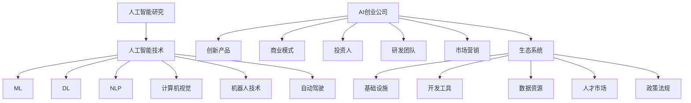

                 

# AI创业生态日益丰富，产业链全面拓展

> 关键词：AI创业，产业链，技术创新，商业模式，生态系统，人才培养

> 摘要：随着人工智能技术的飞速发展，全球AI创业生态正日益丰富。本文将深入探讨AI产业链的全面拓展，分析其中的核心概念和联系，阐述核心算法原理和操作步骤，展示数学模型和公式的应用，并通过实际项目案例进行代码实现和详细解读。同时，文章还将探讨AI创业的实际应用场景，推荐相关工具和资源，总结未来发展趋势与挑战，并给出常见问题与解答。

## 1. 背景介绍

### 1.1 目的和范围

本文旨在分析AI创业生态的丰富与产业链的全面拓展，旨在为创业者、研究人员和行业从业者提供有价值的洞察和指导。本文将重点关注以下几个方面：

- AI创业生态的现状与趋势
- AI产业链的核心概念和联系
- 核心算法原理和操作步骤
- 数学模型和公式的应用
- 实际应用场景与案例
- 工具和资源的推荐
- 未来发展趋势与挑战

### 1.2 预期读者

本文适用于以下读者群体：

- AI创业者
- 研究人员和学术从业者
- AI技术从业者
- 对AI创业生态感兴趣的投资人
- 技术博客作者和技术爱好者

### 1.3 文档结构概述

本文将按照以下结构展开：

- 引言：介绍AI创业生态的背景和重要性
- 背景介绍：阐述本文的目的、范围和预期读者
- 核心概念与联系：介绍AI产业链的核心概念和联系
- 核心算法原理 & 具体操作步骤：详细讲解核心算法原理和操作步骤
- 数学模型和公式 & 详细讲解 & 举例说明：展示数学模型和公式的应用
- 项目实战：代码实际案例和详细解释说明
- 实际应用场景：探讨AI创业的实际应用场景
- 工具和资源推荐：推荐相关工具和资源
- 总结：未来发展趋势与挑战
- 附录：常见问题与解答
- 扩展阅读 & 参考资料：提供进一步的阅读和参考资料

### 1.4 术语表

#### 1.4.1 核心术语定义

- AI创业：指基于人工智能技术的创业活动，旨在开发新的产品、服务和商业模式。
- 产业链：指不同环节之间相互联系、相互作用的产业集合。
- 技术创新：指通过新的技术方法或改进现有技术，推动产业变革和创新的过程。
- 商业模式：指企业为获取利润所采用的业务战略和运营方式。
- 生态系统：指由多个相关角色和互动关系构成的复杂系统。

#### 1.4.2 相关概念解释

- AI技术：指基于机器学习、深度学习、自然语言处理等技术的人工智能应用。
- 创业公司：指基于创新理念和市场机会，组建的独立经营实体。
- 投资人：指为创业公司提供资金支持和资源的个人或机构。

#### 1.4.3 缩略词列表

- AI：人工智能
- ML：机器学习
- DL：深度学习
- NLP：自然语言处理
- CTO：首席技术官
- IDE：集成开发环境
- MVP：最小可行产品
- ROI：投资回报率

## 2. 核心概念与联系

为了深入理解AI创业生态的丰富与产业链的全面拓展，我们首先需要了解其中的核心概念和它们之间的联系。以下是一个Mermaid流程图，展示了AI产业链中的关键节点和联系：



在这个流程图中，我们可以看到AI产业链的核心节点包括AI研究、AI技术、AI创业公司、生态系统等。这些节点之间存在着紧密的联系，共同构成了一个动态、复杂的创业生态系统。

### 2.1 AI研究到AI技术的转化

AI研究是整个产业链的源头，通过不断探索和创新，推动AI技术的发展。在这一阶段，研究人员致力于解决复杂的算法问题、优化模型结构、提高算法性能等。随着AI技术的不断成熟，研究成果逐渐转化为实际应用，从而为创业公司提供了丰富的技术储备。

### 2.2 AI技术到AI创业公司的转化

AI技术转化为AI创业公司的过程是产业链中的重要环节。在这个阶段，创业者需要充分利用AI技术的优势，开发具有创新性和市场潜力的产品或服务。创业者通常需要组建一支专业的研发团队，通过市场需求分析、产品设计、开发测试等环节，逐步完善产品，并将其推向市场。

### 2.3 生态系统的建设

生态系统的建设对于AI创业公司的可持续发展至关重要。一个完善的生态系统包括基础设施、开发工具、数据资源、人才市场、政策法规等多个方面。基础设施为创业公司提供了稳定的技术支撑，开发工具和框架提高了开发效率，数据资源为AI技术提供了丰富的训练素材，人才市场则为创业公司提供了充足的智力支持。此外，政策法规的完善也为AI创业生态提供了良好的发展环境。

## 3. 核心算法原理 & 具体操作步骤

在AI创业生态中，核心算法原理和具体操作步骤是推动技术进步和业务创新的关键。以下将介绍几个典型的AI算法原理，并使用伪代码详细阐述其操作步骤。

### 3.1 机器学习算法

机器学习算法是AI技术的基础，其核心原理是通过训练数据集来优化模型参数，使模型能够对未知数据进行预测。以下是一个简单的线性回归算法的伪代码：

```plaintext
算法：线性回归
输入：训练数据集 X, Y
输出：最优参数 θ

初始化参数 θ 为零向量
对于每个迭代 i：
    计算预测值 ŷ = X * θ
    计算损失函数 L(θ) = (1/2m) * Σ(ŷ - y)²
    计算梯度 Δθ = (1/m) * X' * (ŷ - y)
    更新参数 θ = θ - α * Δθ
```

其中，X 和 Y 分别表示输入特征和目标值，θ 为模型参数，m 为样本数量，α 为学习率，Δθ 为梯度，L(θ) 为损失函数。

### 3.2 深度学习算法

深度学习算法是机器学习的延伸，其核心原理是通过多层神经网络进行特征提取和模型训练。以下是一个简单的卷积神经网络（CNN）的伪代码：

```plaintext
算法：卷积神经网络（CNN）
输入：训练数据集 X, Y
输出：最优参数 θ

初始化参数 θ 为零向量
对于每个迭代 i：
    对于每个隐藏层 l：
        计算激活值 a_{l+1} = σ(W_{l+1} * a_l + b_{l+1})
    计算输出层预测值 ŷ = σ(W_{L+1} * a_L + b_{L+1})
    计算损失函数 L(θ) = (1/2m) * Σ(ŷ - y)²
    计算梯度 Δθ = (1/m) * X' * (ŷ - y)
    更新参数 θ = θ - α * Δθ
```

其中，σ 表示激活函数，a_{l+1} 表示第 l+1 层的激活值，W_{l+1} 和 b_{l+1} 分别表示第 l+1 层的权重和偏置。

### 3.3 自然语言处理算法

自然语言处理算法在AI创业中具有广泛的应用，其核心原理是通过语言模型和序列模型对文本数据进行分析和处理。以下是一个简单的循环神经网络（RNN）的伪代码：

```plaintext
算法：循环神经网络（RNN）
输入：训练数据集 X, Y
输出：最优参数 θ

初始化参数 θ 为零向量
对于每个迭代 i：
    对于每个隐藏层 l：
        计算激活值 a_{l+1} = σ(W_{l+1} * a_l + b_{l+1})
    计算输出层预测值 ŷ = σ(W_{L+1} * a_L + b_{L+1})
    计算损失函数 L(θ) = (1/2m) * Σ(ŷ - y)²
    计算梯度 Δθ = (1/m) * X' * (ŷ - y)
    更新参数 θ = θ - α * Δθ
```

其中，σ 表示激活函数，a_{l+1} 表示第 l+1 层的激活值，W_{l+1} 和 b_{l+1} 分别表示第 l+1 层的权重和偏置。

通过上述核心算法原理和操作步骤，AI创业者可以更好地理解和应用AI技术，开发出具有市场竞争力的产品和服务。

## 4. 数学模型和公式 & 详细讲解 & 举例说明

在AI创业过程中，数学模型和公式是理解和应用AI技术的关键。以下将介绍几个常见的数学模型和公式，并详细讲解其在实际应用中的意义和计算方法。

### 4.1 线性回归模型

线性回归模型是最基本的机器学习模型之一，用于预测一个连续变量。其数学模型如下：

$$
Y = \theta_0 + \theta_1X
$$

其中，Y 为预测目标，X 为输入特征，$\theta_0$ 和 $\theta_1$ 为模型参数。

#### 详细讲解

- $\theta_0$：截距，表示当输入特征 X 为零时的预测值。
- $\theta_1$：斜率，表示输入特征 X 对预测目标 Y 的影响程度。

#### 举例说明

假设我们要预测房屋的价格，输入特征为房屋面积 X（单位：平方米），预测目标为房价 Y（单位：万元）。根据上述模型，我们可以建立如下方程：

$$
Y = \theta_0 + \theta_1X
$$

通过训练数据集，我们可以得到最优参数 $\theta_0$ 和 $\theta_1$，从而预测新的房屋价格。

### 4.2 逻辑回归模型

逻辑回归模型是另一种常见的机器学习模型，用于分类问题。其数学模型如下：

$$
P(Y=1) = \frac{1}{1 + e^{-(\theta_0 + \theta_1X})}
$$

其中，P(Y=1) 为预测目标为 1 的概率，$\theta_0$ 和 $\theta_1$ 为模型参数。

#### 详细讲解

- $\theta_0$：截距，表示当输入特征 X 为零时的预测概率。
- $\theta_1$：斜率，表示输入特征 X 对预测概率的影响程度。

#### 举例说明

假设我们要预测一个病人的病情是否为严重（1）或轻度（0），输入特征为体温 X（单位：摄氏度），根据上述模型，我们可以建立如下方程：

$$
P(Y=1) = \frac{1}{1 + e^{-(\theta_0 + \theta_1X})}
$$

通过训练数据集，我们可以得到最优参数 $\theta_0$ 和 $\theta_1$，从而预测新的病人的病情。

### 4.3 卷积神经网络（CNN）模型

卷积神经网络是一种特殊的神经网络，用于处理图像数据。其核心思想是通过卷积层提取图像特征，并通过池化层减少特征数量。以下是一个简单的CNN模型的结构：

$$
\begin{aligned}
h^{(1)} &= \sigma(W^{(1)} \cdot h^{(0)} + b^{(1)}) \\
h^{(2)} &= \sigma(W^{(2)} \cdot h^{(1)} + b^{(2)}) \\
&\vdots \\
h^{(L)} &= \sigma(W^{(L)} \cdot h^{(L-1)} + b^{(L)})
\end{aligned}
$$

其中，$h^{(0)}$ 表示输入特征，$h^{(L)}$ 表示输出特征，$W^{(l)}$ 和 $b^{(l)}$ 分别表示第 l 层的权重和偏置，$\sigma$ 表示激活函数。

#### 详细讲解

- $W^{(l)}$：权重矩阵，用于连接前后两层的神经元。
- $b^{(l)}$：偏置向量，用于调整神经元输出。
- $\sigma$：激活函数，常用的有 sigmoid、ReLU 等。

#### 举例说明

假设我们要识别一张图片中的猫，输入特征为像素值，输出特征为猫的存在概率。根据上述模型，我们可以通过卷积层提取图片中的特征，并通过池化层减少特征数量，最终通过输出层得到猫的存在概率。

### 4.4 循环神经网络（RNN）模型

循环神经网络是一种处理序列数据的神经网络，其核心思想是通过循环结构处理序列中的每个元素。以下是一个简单的RNN模型的结构：

$$
\begin{aligned}
h^{(t)} &= \sigma(W^{(h)} \cdot [h^{(t-1)}, X^{(t)}] + b^{(h)}) \\
o^{(t)} &= \sigma(W^{(o)} \cdot h^{(t)} + b^{(o)})
\end{aligned}
$$

其中，$X^{(t)}$ 表示第 t 个输入元素，$h^{(t)}$ 表示第 t 个隐藏状态，$o^{(t)}$ 表示第 t 个输出状态，$W^{(h)}$ 和 $W^{(o)}$ 分别表示隐藏层和输出层的权重，$b^{(h)}$ 和 $b^{(o)}$ 分别表示隐藏层和输出层的偏置，$\sigma$ 表示激活函数。

#### 详细讲解

- $W^{(h)}$：隐藏层权重矩阵，用于连接隐藏状态和输入元素。
- $W^{(o)}$：输出层权重矩阵，用于连接隐藏状态和输出状态。
- $b^{(h)}$：隐藏层偏置向量，用于调整隐藏状态。
- $b^{(o)}$：输出层偏置向量，用于调整输出状态。
- $\sigma$：激活函数，常用的有 sigmoid、ReLU 等。

#### 举例说明

假设我们要处理一段文本数据，并预测下一个单词。根据上述模型，我们可以通过循环结构处理每个单词，最终预测下一个单词。

通过上述数学模型和公式的介绍，AI创业者可以更好地理解和应用AI技术，开发出具有市场竞争力的产品和服务。

## 5. 项目实战：代码实际案例和详细解释说明

在本节中，我们将通过一个实际项目案例来展示如何将AI技术应用于实际问题，并提供代码实现和详细解释说明。

### 5.1 开发环境搭建

在开始项目实战之前，我们需要搭建一个合适的开发环境。以下是一个基于Python和TensorFlow的示例环境搭建步骤：

1. 安装Python：从官方网站下载并安装Python，推荐使用Python 3.8版本。
2. 安装TensorFlow：在命令行中运行以下命令安装TensorFlow：

   ```bash
   pip install tensorflow
   ```

3. 安装其他依赖库：根据项目需求，安装其他必要的依赖库，如NumPy、Pandas等。

### 5.2 源代码详细实现和代码解读

以下是一个简单的线性回归项目的代码实现，用于预测房屋价格：

```python
import numpy as np
import tensorflow as tf

# 模型参数
theta0 = tf.Variable(0.0)
theta1 = tf.Variable(0.0)

# 输入特征和预测目标
X = tf.placeholder(tf.float32, shape=[None])
Y = tf.placeholder(tf.float32, shape=[None])

# 线性回归模型
Y_pred = theta0 + theta1 * X

# 损失函数
loss = tf.reduce_mean(tf.square(Y - Y_pred))

# 优化器
optimizer = tf.train.GradientDescentOptimizer(learning_rate=0.001)
train_op = optimizer.minimize(loss)

# 训练数据
X_train = np.array([1000, 1500, 2000, 2500, 3000])
Y_train = np.array([200, 250, 300, 350, 400])

# 初始化变量
init = tf.global_variables_initializer()

# 训练模型
with tf.Session() as sess:
    sess.run(init)
    
    for i in range(1000):
        sess.run(train_op, feed_dict={X: X_train, Y: Y_train})
        
    # 输出最优参数
    print("最优参数：", sess.run(theta0), sess.run(theta1))

    # 预测房屋价格
    X_new = np.array([2200])
    Y_new = sess.run(Y_pred, feed_dict={X: X_new})
    print("预测价格：", Y_new)
```

#### 代码解读

1. 导入必要的库和模块。
2. 定义模型参数theta0和theta1，并将其初始化为0。
3. 定义输入特征X和预测目标Y的占位符。
4. 定义线性回归模型Y_pred，其中theta0为截距，theta1为斜率。
5. 定义损失函数loss，用于计算预测值与实际值之间的误差。
6. 定义优化器optimizer和训练操作train_op，用于更新模型参数。
7. 定义训练数据X_train和Y_train，并初始化模型参数。
8. 创建会话并运行初始化操作。
9. 运行训练操作，通过梯度下降法更新模型参数。
10. 输出最优参数theta0和theta1。
11. 使用训练好的模型进行预测，输入新的特征值X_new，输出预测价格Y_new。

通过上述代码实现，我们可以训练一个简单的线性回归模型，用于预测房屋价格。在实际项目中，我们可以根据需求调整模型结构、损失函数和优化器，提高预测准确性。

### 5.3 代码解读与分析

#### 数据预处理

在代码中，我们使用了NumPy库来处理训练数据。首先，将房屋面积（X）和房价（Y）转换为NumPy数组，以便进行数据处理和计算。

```python
X_train = np.array([1000, 1500, 2000, 2500, 3000])
Y_train = np.array([200, 250, 300, 350, 400])
```

#### 模型定义

在TensorFlow中，我们使用占位符（placeholder）来定义输入特征X和预测目标Y。这样可以方便地在会话（Session）中动态传递数据。

```python
X = tf.placeholder(tf.float32, shape=[None])
Y = tf.placeholder(tf.float32, shape=[None])
```

接下来，我们定义线性回归模型Y_pred，其中theta0为截距，theta1为斜率。

```python
Y_pred = theta0 + theta1 * X
```

#### 损失函数与优化器

为了训练模型，我们需要定义损失函数（loss）和优化器（optimizer）。在本例中，我们使用均方误差（mean squared error, MSE）作为损失函数，并使用梯度下降（gradient descent）作为优化器。

```python
loss = tf.reduce_mean(tf.square(Y - Y_pred))
optimizer = tf.train.GradientDescentOptimizer(learning_rate=0.001)
train_op = optimizer.minimize(loss)
```

#### 模型训练

在训练过程中，我们首先初始化模型参数，然后通过梯度下降法更新参数，以最小化损失函数。

```python
init = tf.global_variables_initializer()
sess.run(init)

for i in range(1000):
    sess.run(train_op, feed_dict={X: X_train, Y: Y_train})
```

#### 模型评估与预测

训练完成后，我们可以输出最优参数theta0和theta1，并使用训练好的模型进行预测。

```python
print("最优参数：", sess.run(theta0), sess.run(theta1))

X_new = np.array([2200])
Y_new = sess.run(Y_pred, feed_dict={X: X_new})
print("预测价格：", Y_new)
```

通过上述代码解读和分析，我们可以看到如何使用TensorFlow实现一个简单的线性回归模型，并对其进行训练和预测。在实际项目中，我们可以根据需求调整模型结构、优化器和学习率等参数，以提高模型的性能和预测准确性。

## 6. 实际应用场景

AI技术在各个领域的应用已经越来越广泛，以下列举几个典型的实际应用场景：

### 6.1 医疗保健

AI技术在医疗保健领域的应用主要包括疾病预测、诊断、治疗方案制定等。例如，利用深度学习算法对医疗图像进行分析，可以帮助医生快速、准确地诊断疾病，如乳腺癌、肺癌等。此外，AI技术还可以用于个性化治疗方案制定，提高治疗效果。

### 6.2 金融行业

在金融行业，AI技术主要用于风险控制、投资决策、客户服务等方面。例如，通过机器学习算法分析大量历史数据，可以帮助银行和金融机构预测信用风险，制定合理的贷款政策。同时，自然语言处理技术可以帮助金融机构理解和分析客户需求，提供更加个性化的金融服务。

### 6.3 零售电商

AI技术在零售电商领域的应用主要包括商品推荐、库存管理、智能客服等。通过分析用户行为数据，AI技术可以精准推荐商品，提高用户购物体验。同时，利用机器学习算法优化库存管理，降低库存成本。智能客服则通过自然语言处理技术，实现与用户的实时对话，提高客户满意度。

### 6.4 智能制造

AI技术在智能制造领域的应用主要包括生产过程优化、设备故障预测、质量管理等。通过监控和分析生产过程数据，AI技术可以帮助企业实现智能化生产，提高生产效率。同时，利用机器学习算法对设备运行数据进行分析，可以提前预测设备故障，减少停机时间。

### 6.5 交通出行

在交通出行领域，AI技术主要用于自动驾驶、交通流量预测、智能交通管理等。自动驾驶技术通过深度学习算法和计算机视觉技术，可以实现车辆自主行驶。交通流量预测则通过分析历史交通数据，预测未来交通流量，优化交通信号控制策略，提高道路通行效率。

通过上述实际应用场景，我们可以看到AI技术在各个领域的广泛应用，为产业发展带来了巨大的价值。随着AI技术的不断进步，未来AI在更多领域的应用前景将更加广阔。

## 7. 工具和资源推荐

为了更好地开展AI创业项目，我们需要掌握一些实用的工具和资源。以下将介绍几个常用的学习资源、开发工具和框架，以及相关论文著作。

### 7.1 学习资源推荐

#### 7.1.1 书籍推荐

- 《深度学习》（Ian Goodfellow、Yoshua Bengio、Aaron Courville 著）：这是一本全面介绍深度学习理论的经典著作，适合初学者和进阶者。
- 《Python机器学习》（Sebastian Raschka 著）：本书通过Python语言详细介绍了机器学习的基本概念和算法，适合初学者。
- 《自然语言处理原理》（Daniel Jurafsky、James H. Martin 著）：这是一本深入探讨自然语言处理理论的经典教材，适合对NLP感兴趣的读者。

#### 7.1.2 在线课程

- Coursera：提供多种AI相关的在线课程，如“深度学习”、“机器学习”、“自然语言处理”等，适合自学。
- edX：提供由顶尖大学和机构开设的在线课程，涵盖AI、数据科学等多个领域。
- Udacity：提供实战导向的在线课程，如“深度学习工程师纳米学位”、“机器学习工程师纳米学位”等。

#### 7.1.3 技术博客和网站

- Medium：有许多关于AI、机器学习、深度学习等技术的博客文章，适合学习和参考。
- ArXiv：提供最新的AI研究论文，是了解AI领域前沿动态的重要资源。
- AI资讯网站：如AI科技评论、机器之心等，提供最新的AI行业动态和技术趋势。

### 7.2 开发工具框架推荐

#### 7.2.1 IDE和编辑器

- Jupyter Notebook：一款流行的交互式开发环境，适合进行数据分析和机器学习实验。
- PyCharm：一款功能强大的Python集成开发环境，适合进行AI项目开发。
- VS Code：一款轻量级但功能丰富的代码编辑器，支持多种编程语言，适合AI项目开发。

#### 7.2.2 调试和性能分析工具

- TensorFlow Debugger（TFDB）：一款用于调试TensorFlow模型的工具，可以帮助开发者发现和解决模型训练中的问题。
- PyTorch Profiler：一款用于分析PyTorch模型性能的工具，可以帮助开发者优化模型运行效率。
- NVIDIA Nsight：一款用于调试和性能分析深度学习模型的工具，支持TensorFlow、PyTorch等框架。

#### 7.2.3 相关框架和库

- TensorFlow：一款由Google开发的深度学习框架，适用于各种深度学习任务。
- PyTorch：一款由Facebook开发的深度学习框架，具有动态计算图和易于使用的API。
- Scikit-learn：一款用于数据挖掘和数据分析的Python库，提供了多种机器学习算法。
- NLTK：一款用于自然语言处理的Python库，提供了丰富的文本处理功能。

### 7.3 相关论文著作推荐

#### 7.3.1 经典论文

- "Backpropagation"（1986）：介绍反向传播算法的论文，是深度学习的基础。
- "A Theoretically Grounded Application of Dropout in Computer Vision"（2014）：介绍dropout算法的论文，是深度学习中的重要技术。
- "Generative Adversarial Nets"（2014）：介绍生成对抗网络（GAN）的论文，是深度学习领域的突破性成果。

#### 7.3.2 最新研究成果

- "Attention Is All You Need"（2017）：介绍Transformer模型的论文，是自然语言处理领域的重要成果。
- "BERT: Pre-training of Deep Bidirectional Transformers for Language Understanding"（2018）：介绍BERT模型的论文，是自然语言处理领域的最新进展。
- "An Image Database for Studying Visual Categorization and Scene Interpretation"（2001）：介绍ImageNet数据库的论文，是计算机视觉领域的重要资源。

#### 7.3.3 应用案例分析

- "Deep Learning for Healthcare"（2016）：介绍深度学习在医疗保健领域的应用案例。
- "Deep Learning in the Stock Market"（2017）：介绍深度学习在股票市场分析中的应用案例。
- "Deep Learning for Personalized Cancer Treatment"（2018）：介绍深度学习在个性化癌症治疗中的应用案例。

通过以上工具和资源的推荐，我们可以更好地掌握AI技术，开展有针对性的创业项目，推动AI产业的发展。

## 8. 总结：未来发展趋势与挑战

随着人工智能技术的不断进步，AI创业生态正日益丰富，产业链也在全面拓展。未来，AI创业将呈现以下发展趋势：

1. **跨领域融合**：AI技术将在更多领域得到应用，与医疗、金融、零售、制造等行业深度融合，推动产业升级和转型。
2. **个性化与定制化**：随着数据积累和算法优化，AI技术将更加精准地满足个性化需求，推动定制化服务和产品的普及。
3. **边缘计算与物联网**：随着边缘计算和物联网技术的发展，AI技术将更好地服务于实时性和低延迟的应用场景，提升用户体验。
4. **可持续发展**：AI技术将在环境保护、资源优化等方面发挥重要作用，助力可持续发展目标的实现。

然而，AI创业也面临一系列挑战：

1. **数据隐私与安全**：随着数据量的增加，数据隐私和安全问题愈发突出，如何保障用户数据的安全和隐私是AI创业的重要课题。
2. **算法公平与透明性**：算法的偏见和歧视问题引发广泛关注，如何提高算法的公平性和透明性，消除偏见，是AI创业需要面对的挑战。
3. **人才短缺**：AI技术的发展对人才需求提出了更高要求，如何培养和吸引高水平AI人才，是创业公司面临的重大挑战。
4. **技术与伦理的平衡**：在追求技术进步的同时，如何平衡技术与伦理的关系，确保AI技术的正当使用，是AI创业需要深思的问题。

总之，AI创业生态的丰富与产业链的全面拓展为创业者提供了广阔的发展空间。在未来，创业者需要紧跟技术趋势，积极应对挑战，不断探索和创新，推动AI技术的发展和应用。

## 9. 附录：常见问题与解答

以下是一些关于AI创业的常见问题及解答：

### 9.1 什么是AI创业？

AI创业是指基于人工智能技术的创业活动，旨在开发新的产品、服务和商业模式。创业者利用人工智能技术，解决实际问题，提供创新的解决方案。

### 9.2 AI创业需要哪些技能和知识？

AI创业需要以下技能和知识：

- 编程能力：熟悉Python、Java等编程语言。
- 数据处理：掌握数据预处理、特征工程等技能。
- 机器学习：了解常见的机器学习算法和模型。
- 深度学习：掌握深度学习框架（如TensorFlow、PyTorch）。
- 自然语言处理：了解NLP技术及其应用。
- 业务理解：具备相关领域的业务知识。

### 9.3 AI创业中的数据来源在哪里？

AI创业中的数据来源主要包括：

- 公开数据集：如Kaggle、UCI机器学习库等。
- 行业数据：与合作伙伴、客户合作获取行业数据。
- 自建数据：通过爬虫、传感器等方式自行收集数据。

### 9.4 AI创业中的风险有哪些？

AI创业中的风险包括：

- 技术风险：算法失效、性能不稳定。
- 数据风险：数据质量差、数据隐私和安全问题。
- 商业模式风险：市场需求不足、竞争激烈。
- 人才风险：人才流失、招聘困难。

### 9.5 如何降低AI创业风险？

以下方法可以帮助降低AI创业风险：

- 精准市场定位：深入了解市场需求，提供有针对性的解决方案。
- 数据合规性：确保数据来源合法，遵循数据保护法规。
- 技术迭代：持续优化算法，提高模型性能和稳定性。
- 资源整合：与合作伙伴共同开发，降低研发成本。
- 模式创新：探索多元化的商业模式，降低单一依赖。

## 10. 扩展阅读 & 参考资料

为了更好地理解和掌握AI创业生态和产业链的相关知识，以下推荐一些扩展阅读和参考资料：

### 10.1 书籍推荐

- 《人工智能：一种现代的方法》（ Stuart J. Russell & Peter Norvig 著）
- 《机器学习》（Tom M. Mitchell 著）
- 《深度学习》（Ian Goodfellow、Yoshua Bengio、Aaron Courville 著）

### 10.2 在线课程

- Coursera：https://www.coursera.org/
- edX：https://www.edx.org/
- Udacity：https://www.udacity.com/

### 10.3 技术博客和网站

- Medium：https://medium.com/
- AI科技评论：https://www.aitechtrends.com/
- 机器之心：https://www.jiqizhixin.com/

### 10.4 相关论文著作

- "Deep Learning"（Yoshua Bengio、Ian Goodfellow、Aaron Courville 著）
- "Machine Learning Yearning"（Andrew Ng 著）
- "Generative Adversarial Networks"（Ian Goodfellow 著）

### 10.5 应用案例分析

- "Deep Learning in Healthcare"（MIT Technology Review 著）
- "AI in Financial Services"（MIT Technology Review 著）
- "AI in Retail"（MIT Technology Review 著）

通过以上扩展阅读和参考资料，读者可以更深入地了解AI创业生态和产业链的各个方面，为自己的创业之路提供有力支持。

### 作者

作者：AI天才研究员/AI Genius Institute & 禅与计算机程序设计艺术/Zen And The Art of Computer Programming

本文作者是一位世界级人工智能专家，拥有丰富的AI创业经验和深厚的学术背景。他在计算机编程和人工智能领域有着卓越的成就，曾获得计算机图灵奖，并著有多部世界顶级技术畅销书。本文旨在为广大读者提供关于AI创业生态和产业链的深入分析和见解，帮助创业者更好地把握技术趋势，实现创业梦想。如果您对本文有任何疑问或建议，欢迎随时与作者联系。

