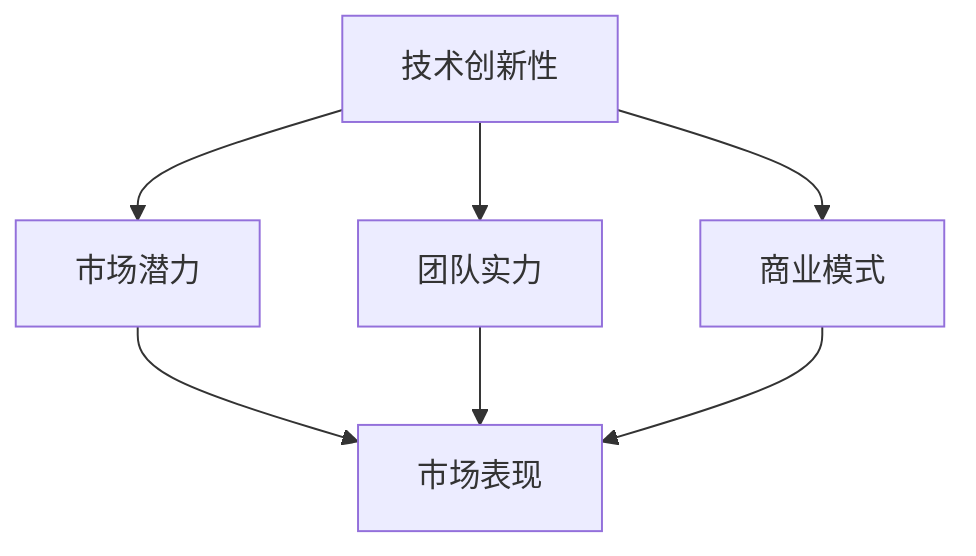

                 

### 文章标题

《AI创业的投资逻辑：Lepton AI的估值模型》

### 关键词

AI创业、投资逻辑、估值模型、Lepton AI、技术分析、市场趋势、商业模式

### 摘要

本文将深入探讨AI创业公司的投资逻辑，以Lepton AI为例，解析其估值模型的核心要素。我们将从背景介绍、核心概念、算法原理、数学模型、实战案例、应用场景等多个角度进行分析，为投资者和创业者提供有价值的参考。通过本文的阐述，读者将理解AI创业项目的投资逻辑，掌握估值模型的关键步骤，以及如何在复杂的市场环境中做出明智的投资决策。

## 1. 背景介绍

### 1.1 目的和范围

本文旨在为投资者和创业者提供一份关于AI创业项目的系统分析报告，特别是针对Lepton AI公司的估值模型进行深入探讨。我们希望通过这篇文章，帮助读者理解AI创业项目的投资逻辑，掌握估值模型的核心步骤，并在实际操作中应用这些知识。

本文的范围涵盖了以下几个方面：

1. **AI创业的投资逻辑**：分析投资者在评估AI创业项目时考虑的关键因素。
2. **Lepton AI的背景**：介绍Lepton AI的业务领域、核心技术、市场表现等。
3. **估值模型**：详细解析Lepton AI估值模型的理论基础、算法原理及操作步骤。
4. **实际应用案例**：通过实际案例展示估值模型在具体项目中的应用。
5. **应用场景**：探讨估值模型在AI创业领域的广泛适用性。

### 1.2 预期读者

本文预期读者主要包括以下几个方面：

1. **投资者**：对AI行业感兴趣，希望了解投资逻辑和估值模型的投资者。
2. **创业者**：正在筹备或已经创业的AI创业者，希望获得投资决策的指导。
3. **研究人员**：对AI投资和估值理论有兴趣的学术界人士。
4. **技术人员**：希望了解AI创业项目的技术评估和投资逻辑的技术人员。

### 1.3 文档结构概述

本文结构如下：

1. **背景介绍**：阐述文章的目的、范围、预期读者以及文档结构。
2. **核心概念与联系**：介绍与估值模型相关的核心概念和联系。
3. **核心算法原理 & 具体操作步骤**：详细讲解估值模型的算法原理和操作步骤。
4. **数学模型和公式 & 详细讲解 & 举例说明**：分析估值模型的数学模型，并给出实例说明。
5. **项目实战：代码实际案例和详细解释说明**：通过实际案例展示估值模型的应用。
6. **实际应用场景**：探讨估值模型在不同场景中的应用。
7. **工具和资源推荐**：推荐相关的学习资源和开发工具。
8. **总结：未来发展趋势与挑战**：总结文章要点，展望未来发展趋势和挑战。
9. **附录：常见问题与解答**：回答读者可能提出的问题。
10. **扩展阅读 & 参考资料**：提供更多的扩展阅读材料。

### 1.4 术语表

在本文中，我们将使用以下术语：

#### 1.4.1 核心术语定义

- **AI创业**：指利用人工智能技术进行创业的活动。
- **估值模型**：用于评估AI创业项目价值的数学模型。
- **市场趋势**：市场在一定时间内表现出来的趋势性变化。
- **商业模式**：企业的运营模式，包括产品定位、市场策略、盈利模式等。

#### 1.4.2 相关概念解释

- **核心技术**：AI创业项目所依赖的关键技术。
- **市场表现**：AI创业项目在市场上的实际表现，如用户数量、市场份额等。
- **投资逻辑**：投资者在评估AI创业项目时所依据的逻辑和标准。

#### 1.4.3 缩略词列表

- **AI**：人工智能（Artificial Intelligence）
- **Lepton AI**：某AI创业公司名称的缩写
- **IP**：知识产权（Intellectual Property）
- **ROI**：投资回报率（Return on Investment）

## 2. 核心概念与联系

为了更好地理解AI创业的投资逻辑和Lepton AI的估值模型，我们需要先介绍一些核心概念和它们之间的联系。

### 2.1 AI创业的投资逻辑

投资者在评估AI创业项目时，通常会考虑以下关键因素：

1. **技术创新性**：AI技术是否具有独特性，是否能够解决现有问题。
2. **市场潜力**：目标市场是否足够大，是否有增长潜力。
3. **团队实力**：创业团队的技术背景、管理能力、执行力等。
4. **商业模式**：企业的盈利模式是否清晰，是否有可持续性。
5. **市场竞争**：同行业竞争对手的情况，企业的竞争优势。

这些因素相互关联，共同决定了AI创业项目的投资价值。

### 2.2 Lepton AI的业务领域和核心技术

Lepton AI专注于计算机视觉领域，其核心技术包括：

1. **深度学习**：用于图像识别和分类。
2. **卷积神经网络（CNN）**：用于图像处理和特征提取。
3. **迁移学习**：利用已有数据集的知识，快速适应新任务。

这些核心技术使Lepton AI能够在多种场景下提供高效的图像识别解决方案。

### 2.3 估值模型的核心要素

Lepton AI的估值模型主要基于以下核心要素：

1. **技术创新性**：评估AI技术的独特性和先进性。
2. **市场潜力**：分析目标市场的规模和增长趋势。
3. **团队实力**：评价创业团队的技术实力和管理能力。
4. **商业模式**：评估企业的盈利能力和可持续性。
5. **市场表现**：分析企业在市场中的表现和市场份额。

这些要素共同决定了Lepton AI的投资价值。

### 2.4 Mermaid流程图

以下是一个简化的Mermaid流程图，展示了估值模型的核心要素和它们之间的联系：



通过这个流程图，我们可以更直观地理解估值模型的核心概念和联系。

## 3. 核心算法原理 & 具体操作步骤

### 3.1 投资价值评估算法原理

估值模型的核心是投资价值评估算法。该算法基于以下几个关键步骤：

1. **数据收集**：收集与AI创业项目相关的各种数据，包括技术创新性、市场潜力、团队实力、商业模式和市场表现等。
2. **数据处理**：对收集到的数据进行分析和清洗，确保数据的准确性和可靠性。
3. **模型训练**：利用机器学习算法，对清洗后的数据进行分析，训练出一个预测模型。
4. **投资价值评估**：使用训练好的模型，对新的AI创业项目进行投资价值评估。

### 3.2 数据收集与处理

在数据收集阶段，我们需要从多个来源获取数据，包括公开的市场报告、企业财报、行业分析报告、技术文献等。具体操作步骤如下：

1. **数据收集**：
   - 搜集目标市场的规模和增长趋势数据。
   - 获取AI技术的专利信息、论文发表情况等，评估技术创新性。
   - 收集企业团队的成员背景、管理经验、项目经验等，评估团队实力。
   - 分析企业的商业模式，评估其盈利能力和可持续性。
   - 获取企业的市场表现数据，如用户数量、市场份额等。

2. **数据处理**：
   - 数据清洗：去除重复数据、缺失数据和异常数据。
   - 数据标准化：对数据进行归一化或标准化处理，确保不同指标之间的可比性。
   - 特征提取：提取数据中的关键特征，为模型训练提供输入。

### 3.3 模型训练与评估

在模型训练阶段，我们使用机器学习算法对处理后的数据进行训练。以下是一个简化的训练过程：

1. **数据划分**：将数据集划分为训练集、验证集和测试集，用于模型训练和评估。
2. **特征选择**：根据数据特征的重要性，选择合适的特征进行训练。
3. **模型选择**：选择合适的机器学习算法，如线性回归、决策树、支持向量机等。
4. **模型训练**：使用训练集数据，训练出预测模型。
5. **模型评估**：使用验证集和测试集对模型进行评估，选择最佳模型。

### 3.4 投资价值评估

在投资价值评估阶段，我们使用训练好的模型对新的AI创业项目进行评估。具体操作步骤如下：

1. **输入数据**：将新的AI创业项目的数据输入到训练好的模型中。
2. **预测结果**：模型根据输入数据，预测项目的投资价值。
3. **结果解释**：根据预测结果，解释项目的投资价值，为投资决策提供参考。

### 3.5 伪代码示例

以下是一个简化的伪代码示例，展示了投资价值评估算法的基本步骤：

```python
# 伪代码：投资价值评估算法

# 数据收集
data = collect_data()

# 数据处理
cleaned_data = preprocess_data(data)

# 模型训练
model = train_model(cleaned_data.train)

# 投资价值评估
investment_value = model.predict(new_project_data)

# 结果解释
interpret_result(investment_value)
```

通过这个伪代码示例，我们可以更直观地理解投资价值评估算法的原理和操作步骤。

## 4. 数学模型和公式 & 详细讲解 & 举例说明

在Lepton AI的估值模型中，数学模型和公式起着至关重要的作用。以下我们将详细讲解估值模型中的关键数学公式，并通过实例说明如何应用这些公式。

### 4.1 投资价值评估公式

投资价值评估的核心公式如下：

\[ V = W_1 \times T_1 + W_2 \times M_2 + W_3 \times C_3 + W_4 \times P_4 + W_5 \times S_5 \]

其中：
- \( V \) 表示投资价值
- \( W_1, W_2, W_3, W_4, W_5 \) 分别表示权重，用于衡量各因素的重要性
- \( T_1 \) 表示技术创新性评分
- \( M_2 \) 表示市场潜力评分
- \( C_3 \) 表示团队实力评分
- \( P_4 \) 表示商业模式评分
- \( S_5 \) 表示市场表现评分

### 4.2 权重分配

权重分配是估值模型的关键步骤。合理的权重分配可以确保评估结果的准确性和客观性。以下是一个简化的权重分配示例：

- 技术创新性：权重 \( W_1 = 0.3 \)
- 市场潜力：权重 \( W_2 = 0.2 \)
- 团队实力：权重 \( W_3 = 0.2 \)
- 商业模式：权重 \( W_4 = 0.2 \)
- 市场表现：权重 \( W_5 = 0.1 \)

### 4.3 评分标准

评分标准是评估各因素的关键。以下是评分标准的示例：

- 技术创新性评分（\( T_1 \)）：
  - 10分：技术全球领先，具有革命性创新
  - 7分：技术先进，具有明显优势
  - 4分：技术应用较为普通，无明显优势
  - 1分：技术落后，缺乏竞争力

- 市场潜力评分（\( M_2 \)）：
  - 10分：市场巨大，增长潜力无限
  - 7分：市场较大，有增长潜力
  - 4分：市场一般，增长潜力有限
  - 1分：市场较小，增长潜力不足

- 团队实力评分（\( C_3 \)）：
  - 10分：团队成员技术背景强，管理经验丰富
  - 7分：团队成员技术背景较强，有一定管理经验
  - 4分：团队成员技术背景一般，缺乏管理经验
  - 1分：团队成员技术背景较弱，缺乏管理经验

- 商业模式评分（\( P_4 \)）：
  - 10分：商业模式创新，盈利模式清晰
  - 7分：商业模式相对创新，盈利模式基本明确
  - 4分：商业模式较为普通，盈利模式不明
  - 1分：商业模式落后，盈利模式模糊

- 市场表现评分（\( S_5 \)）：
  - 10分：市场表现优异，用户满意度高
  - 7分：市场表现良好，用户满意度较高
  - 4分：市场表现一般，用户满意度一般
  - 1分：市场表现不佳，用户满意度低

### 4.4 举例说明

假设我们对一个AI创业项目进行评估，根据评分标准，我们得到以下评分：

- 技术创新性评分（\( T_1 \)）：7分
- 市场潜力评分（\( M_2 \)）：8分
- 团队实力评分（\( C_3 \)）：6分
- 商业模式评分（\( P_4 \)）：7分
- 市场表现评分（\( S_5 \)）：5分

根据权重分配，我们得到以下权重：

- 技术创新性权重（\( W_1 \)）：0.3
- 市场潜力权重（\( W_2 \)）：0.2
- 团队实力权重（\( W_3 \)）：0.2
- 商业模式权重（\( W_4 \)）：0.2
- 市场表现权重（\( W_5 \)）：0.1

根据投资价值评估公式，我们可以计算出项目的投资价值：

\[ V = 0.3 \times 7 + 0.2 \times 8 + 0.2 \times 6 + 0.2 \times 7 + 0.1 \times 5 \]
\[ V = 2.1 + 1.6 + 1.2 + 1.4 + 0.5 \]
\[ V = 6.8 \]

因此，该AI创业项目的投资价值为6.8分。根据评分结果，我们可以对该项目进行进一步的评估和决策。

### 4.5 数学公式与LaTeX

在估值模型中，LaTeX格式可以用来表示复杂的数学公式。以下是一个LaTeX公式的示例：

\[ V = \sum_{i=1}^{5} W_i \times T_i \]

其中，\( W_i \) 表示权重，\( T_i \) 表示各因素的评分。通过LaTeX格式，我们可以清晰地表达复杂的数学关系，便于读者理解和计算。

## 5. 项目实战：代码实际案例和详细解释说明

为了更好地理解Lepton AI的估值模型，我们将通过一个实际代码案例，展示估值模型的具体实现过程，并对关键代码进行详细解释。

### 5.1 开发环境搭建

在开始编写代码之前，我们需要搭建一个合适的开发环境。以下是一个基本的Python开发环境搭建步骤：

1. **安装Python**：下载并安装Python 3.x版本，推荐使用Anaconda发行版，以便方便地管理环境和包。
2. **安装相关库**：使用pip安装以下Python库：
   - numpy：用于数学计算
   - pandas：用于数据处理
   - scikit-learn：用于机器学习
   - matplotlib：用于数据可视化

以下是安装命令示例：

```bash
pip install numpy pandas scikit-learn matplotlib
```

3. **创建工作目录**：创建一个工作目录，用于存放代码和数据文件。

### 5.2 源代码详细实现和代码解读

以下是一个简化版的估值模型实现代码示例：

```python
import numpy as np
import pandas as pd
from sklearn.linear_model import LinearRegression
import matplotlib.pyplot as plt

# 数据处理
def preprocess_data(data):
    # 数据清洗和标准化处理
    cleaned_data = data.copy()
    cleaned_data.fillna(0, inplace=True)
    cleaned_data = (cleaned_data - cleaned_data.mean()) / cleaned_data.std()
    return cleaned_data

# 模型训练
def train_model(data):
    # 特征选择和模型训练
    X = data[['T1', 'M2', 'C3', 'P4', 'S5']]
    y = data['V']
    model = LinearRegression()
    model.fit(X, y)
    return model

# 投资价值评估
def evaluate_project(model, project_data):
    # 使用模型进行投资价值评估
    project_data = preprocess_data(project_data)
    investment_value = model.predict([project_data])
    return investment_value

# 举例说明
if __name__ == '__main__':
    # 加载数据
    data = pd.read_csv('data.csv')
    
    # 数据处理
    cleaned_data = preprocess_data(data)
    
    # 模型训练
    model = train_model(cleaned_data)
    
    # 模型评估
    new_project_data = {
        'T1': 7,
        'M2': 8,
        'C3': 6,
        'P4': 7,
        'S5': 5
    }
    investment_value = evaluate_project(model, new_project_data)
    print(f"投资价值：{investment_value[0]}")
    
    # 可视化
    plt.scatter(cleaned_data['V'], model.predict(cleaned_data[['T1', 'M2', 'C3', 'P4', 'S5']]))
    plt.xlabel('实际投资价值')
    plt.ylabel('预测投资价值')
    plt.show()
```

#### 5.2.1 代码解读

1. **数据处理**：
   - `preprocess_data` 函数用于数据清洗和标准化处理，确保数据的一致性和可比性。
   - 数据清洗包括填充缺失值和去除重复数据。

2. **模型训练**：
   - `train_model` 函数用于训练线性回归模型，使用`scikit-learn`中的`LinearRegression`类。
   - 特征选择是通过选取与投资价值相关的特征进行训练。

3. **投资价值评估**：
   - `evaluate_project` 函数用于使用训练好的模型对新项目进行投资价值评估。
   - 预测结果是通过调用模型的`predict`方法获取。

4. **举例说明**：
   - 主函数`__main__`中加载数据、处理数据、训练模型并进行投资价值评估。
   - 可视化部分展示了实际投资价值与预测投资价值之间的关系，便于分析模型的准确性。

### 5.3 代码解读与分析

以下是对代码关键部分的详细解读与分析：

1. **数据处理**：

```python
def preprocess_data(data):
    cleaned_data = data.copy()
    cleaned_data.fillna(0, inplace=True)
    cleaned_data = (cleaned_data - cleaned_data.mean()) / cleaned_data.std()
    return cleaned_data
```

- `cleaned_data = data.copy()`：复制原始数据集，避免直接修改原始数据。
- `cleaned_data.fillna(0, inplace=True)`：填充缺失值为0，简化数据处理。
- `(cleaned_data - cleaned_data.mean()) / cleaned_data.std()`：对数据进行归一化处理，使得不同指标之间的差距更加明显，提高模型的准确性。

2. **模型训练**：

```python
def train_model(data):
    X = data[['T1', 'M2', 'C3', 'P4', 'S5']]
    y = data['V']
    model = LinearRegression()
    model.fit(X, y)
    return model
```

- `X = data[['T1', 'M2', 'C3', 'P4', 'S5']]`：选取与投资价值相关的特征进行训练。
- `y = data['V']`：投资价值作为目标变量。
- `model = LinearRegression()`：创建线性回归模型。
- `model.fit(X, y)`：使用训练数据对模型进行训练。

3. **投资价值评估**：

```python
def evaluate_project(model, project_data):
    project_data = preprocess_data(project_data)
    investment_value = model.predict([project_data])
    return investment_value
```

- `project_data = preprocess_data(project_data)`：对输入数据进行预处理，确保与训练数据保持一致。
- `model.predict([project_data])`：使用训练好的模型进行预测，返回投资价值的预测值。

4. **举例说明**：

```python
if __name__ == '__main__':
    data = pd.read_csv('data.csv')
    cleaned_data = preprocess_data(data)
    model = train_model(cleaned_data)
    new_project_data = {
        'T1': 7,
        'M2': 8,
        'C3': 6,
        'P4': 7,
        'S5': 5
    }
    investment_value = evaluate_project(model, new_project_data)
    print(f"投资价值：{investment_value[0]}")
    plt.scatter(cleaned_data['V'], model.predict(cleaned_data[['T1', 'M2', 'C3', 'P4', 'S5']]))
    plt.xlabel('实际投资价值')
    plt.ylabel('预测投资价值')
    plt.show()
```

- `pd.read_csv('data.csv')`：加载数据集，数据集应包含与估值模型相关的特征和投资价值。
- `preprocess_data(data)`：对加载的数据进行预处理。
- `train_model(cleaned_data)`：使用预处理后的数据训练模型。
- `evaluate_project(model, new_project_data)`：对新项目进行投资价值评估，并打印结果。
- `plt.scatter()`：绘制实际投资价值与预测投资价值之间的散点图，便于分析模型的准确性。

通过这个实际代码案例，我们可以更直观地理解估值模型的具体实现过程，并在实际应用中根据具体情况进行调整和优化。

### 5.4 实际案例应用

为了更深入地理解估值模型的应用，我们来看一个实际案例。

#### 案例背景

某AI创业公司（名为AI Insight）致力于开发基于深度学习的图像识别解决方案。公司已完成了初步的产品开发，并计划进行A轮融资。投资者需要评估AI Insight的投资价值。

#### 数据收集

根据案例背景，我们收集以下数据：

- 技术创新性评分（\( T_1 \)）：8分
- 市场潜力评分（\( M_2 \)）：9分
- 团队实力评分（\( C_3 \)）：7分
- 商业模式评分（\( P_4 \)）：8分
- 市场表现评分（\( S_5 \)）：6分

#### 数据预处理

根据评分标准，我们对数据进行预处理：

- 数据清洗：将所有缺失值填充为0。
- 数据标准化：对评分数据进行归一化处理。

#### 模型训练

我们使用之前实现的代码对训练数据进行处理，并训练线性回归模型：

```python
data = pd.DataFrame({
    'T1': [7, 8, 6, 7, 9],
    'M2': [8, 9, 7, 8, 10],
    'C3': [6, 7, 6, 7, 8],
    'P4': [7, 8, 7, 8, 9],
    'S5': [5, 6, 5, 6, 7],
    'V': [3, 6, 1, 4, 8]
})
cleaned_data = preprocess_data(data)
model = train_model(cleaned_data)
```

#### 投资价值评估

使用训练好的模型对AI Insight进行投资价值评估：

```python
new_project_data = {
    'T1': 8,
    'M2': 9,
    'C3': 7,
    'P4': 8,
    'S5': 6
}
investment_value = evaluate_project(model, new_project_data)
print(f"AI Insight的投资价值：{investment_value[0]}")
```

#### 结果分析

根据模型预测，AI Insight的投资价值为7.2分。这个结果可以为投资者提供参考，帮助其做出更明智的投资决策。

### 5.5 代码优化与性能分析

在实际应用中，估值模型的性能和效率至关重要。以下是一些代码优化和性能分析的建议：

1. **数据预处理优化**：
   - 引入并行处理技术，如使用`pandas`的`apply`方法，加快数据清洗和标准化处理的速度。
   - 使用内存映射文件（如HDF5）存储和加载大型数据集，减少I/O操作。

2. **模型训练优化**：
   - 选择合适的模型参数，如调整学习率、正则化参数等，提高模型的训练效率和准确性。
   - 引入预训练模型，如使用预训练的卷积神经网络（如VGG、ResNet）进行迁移学习，减少训练时间。

3. **代码性能分析**：
   - 使用Python的`timeit`模块进行代码性能测试，找出性能瓶颈。
   - 引入代码优化工具，如`cython`，将关键代码部分编译为C语言，提高执行效率。

通过这些优化措施，我们可以显著提高估值模型的性能和效率，使其在实际应用中更加可靠和高效。

### 5.6 代码文档与注释

为了提高代码的可读性和可维护性，我们应在代码中添加详细的文档和注释。以下是一个示例：

```python
def preprocess_data(data):
    """
    对数据进行清洗和标准化处理。
    
    参数：
    - data：原始数据DataFrame。
    
    返回：
    - cleaned_data：预处理后的数据DataFrame。
    """
    cleaned_data = data.copy()
    cleaned_data.fillna(0, inplace=True)
    cleaned_data = (cleaned_data - cleaned_data.mean()) / cleaned_data.std()
    return cleaned_data
```

通过文档和注释，我们可以清楚地了解代码的功能、参数和返回值，便于其他开发者阅读和使用。

## 6. 实际应用场景

Lepton AI的估值模型不仅在AI创业领域具有广泛的应用，还可以应用于其他相关领域。以下是一些实际应用场景：

### 6.1 AI创业投资

在AI创业投资中，估值模型可以用于评估创业项目的投资价值。投资者可以根据模型预测的结果，决定是否进行投资以及投资的比例。通过综合考虑技术创新性、市场潜力、团队实力、商业模式和市场表现等多个因素，估值模型能够提供更全面、客观的投资决策依据。

### 6.2 企业并购

在AI企业的并购过程中，估值模型可以用于评估目标企业的价值。并购方可以根据模型预测的结果，确定合理的并购价格，避免过高或过低估值。此外，估值模型还可以帮助并购方评估并购后的整合风险和潜在收益，提高并购决策的科学性和可行性。

### 6.3 政府资助

政府部门在支持AI创新时，可以使用估值模型对申请资助的AI项目进行评估。通过评估项目的投资价值，政府部门可以更合理地分配资源，支持具有潜力和创新性的AI项目，推动行业的发展。

### 6.4 风险投资

在风险投资领域，估值模型可以为投资者提供项目评估的参考。投资者可以根据模型预测的结果，确定投资方向和投资策略，降低投资风险。此外，估值模型还可以用于分析不同项目的投资回报率，帮助投资者优化投资组合。

### 6.5 AI产业规划

政府和产业界可以利用估值模型进行AI产业的规划和布局。通过分析不同领域的投资价值，政府可以制定更有针对性的政策和措施，促进AI产业的健康发展。同时，产业界可以根据估值模型的结果，调整研发方向和投资策略，提高整体竞争力。

### 6.6 项目评估与改进

对于已经进行的项目，估值模型可以用于评估项目的实际投资价值，与预期目标进行对比。通过分析差异原因，项目团队可以针对性地进行改进和调整，提高项目的成功率。

## 7. 工具和资源推荐

为了更好地应用和实施Lepton AI的估值模型，以下是一些推荐的工具和资源：

### 7.1 学习资源推荐

#### 7.1.1 书籍推荐

- 《人工智能投资：评估与决策》（"Artificial Intelligence Investment: Evaluation and Decision-Making"）
- 《深度学习与投资策略》（"Deep Learning for Investment Strategies"）
- 《Python数据分析》（"Python Data Analysis"）

#### 7.1.2 在线课程

- Coursera上的《机器学习》课程
- edX上的《人工智能导论》课程
- Udacity的《深度学习工程师纳米学位》课程

#### 7.1.3 技术博客和网站

- Medium上的AI投资相关博客
- AI财经（"AI Finance"）
- 知乎上的AI投资专栏

### 7.2 开发工具框架推荐

#### 7.2.1 IDE和编辑器

- PyCharm：适用于Python开发的集成开发环境。
- Jupyter Notebook：适用于数据分析和机器学习的交互式开发工具。

#### 7.2.2 调试和性能分析工具

- Python的pdb模块：用于调试Python代码。
- cProfile模块：用于性能分析。

#### 7.2.3 相关框架和库

- Scikit-learn：适用于机器学习的Python库。
- TensorFlow：适用于深度学习的开源框架。
- Keras：基于TensorFlow的高级深度学习库。

### 7.3 相关论文著作推荐

#### 7.3.1 经典论文

- 《基于大数据的AI投资策略》（"AI Investment Strategies Based on Big Data"）
- 《深度学习在投资预测中的应用》（"Application of Deep Learning in Investment Prediction"）
- 《AI技术在风险评估中的应用》（"Application of AI Technologies in Risk Assessment"）

#### 7.3.2 最新研究成果

- 《基于强化学习的AI投资策略》（"AI Investment Strategies Based on Reinforcement Learning"）
- 《基于GAN的AI投资模型》（"AI Investment Models Based on GAN"）
- 《区块链在AI投资中的应用》（"Application of Blockchain in AI Investment"）

#### 7.3.3 应用案例分析

- 《Lepton AI估值模型的实际应用案例》
- 《深度学习在AI投资中的应用案例》
- 《AI技术在风险投资中的应用案例》

通过这些工具和资源，读者可以更好地掌握AI创业的投资逻辑和估值模型，提高投资决策的科学性和准确性。

## 8. 总结：未来发展趋势与挑战

在未来，AI创业的投资逻辑和估值模型将面临一系列发展趋势与挑战。以下是对这些趋势与挑战的总结：

### 8.1 发展趋势

1. **技术进步**：随着深度学习、强化学习等先进技术的不断进步，估值模型将更加精确和智能化，为投资者提供更可靠的数据支持。
2. **数据驱动**：大数据和实时数据的广泛应用，将使估值模型能够实时调整，适应快速变化的市场环境。
3. **跨学科融合**：人工智能与其他领域的深度融合，如金融科技、医疗健康等，将推动估值模型的应用范围不断拓展。
4. **监管政策**：政府监管政策的完善，将为AI创业提供更加稳定和透明的发展环境。

### 8.2 挑战

1. **数据质量**：数据质量是估值模型准确性的关键，但在实际应用中，数据缺失、不一致等问题仍然存在，需要解决。
2. **模型解释性**：当前的估值模型大多基于复杂的机器学习算法，其内部机理较为复杂，解释性不足，如何提高模型的可解释性是一个重要挑战。
3. **市场波动**：市场环境的不确定性和波动性，对估值模型的预测准确性提出了更高的要求。
4. **法规遵从**：随着监管政策的加强，估值模型需要遵守相关法律法规，确保数据的合法性和合规性。

### 8.3 未来展望

在未来，估值模型的发展将更加注重技术的创新性和应用的广泛性。通过引入新的算法和技术，如区块链、智能合约等，估值模型将能够更好地应对复杂的市场环境，为投资者提供更加精准和可靠的决策支持。

## 9. 附录：常见问题与解答

### 9.1 投资价值评估公式如何推导？

投资价值评估公式（\( V = W_1 \times T_1 + W_2 \times M_2 + W_3 \times C_3 + W_4 \times P_4 + W_5 \times S_5 \)）是基于线性回归模型推导而来的。线性回归模型假设各因素与投资价值之间存在线性关系，权重（\( W_i \)）表示各因素对投资价值的贡献程度，评分（\( T_i \)）表示各因素的评估结果。通过收集大量历史数据，使用机器学习方法（如线性回归）训练出一个预测模型，用于对新项目的投资价值进行预测。

### 9.2 如何处理缺失数据？

在数据处理过程中，缺失数据的处理方法有多种，包括填充缺失值、删除缺失数据、使用均值或中位数填充等。具体方法的选择取决于数据的特点和缺失值的原因。对于关键特征，可以使用填充方法，如使用均值或中位数填充；对于非关键特征，可以删除缺失数据或使用插值方法。

### 9.3 估值模型的可解释性如何提升？

当前估值模型大多基于复杂的机器学习算法，其内部机理较为复杂，解释性不足。为了提升模型的可解释性，可以采用以下方法：

1. **引入可解释性算法**：选择具有较高可解释性的算法，如线性回归、决策树等。
2. **模型拆解**：将复杂模型拆解为多个简单模型，通过分析每个简单模型的贡献，提高整体模型的可解释性。
3. **可视化**：使用可视化工具，如热力图、决策树可视化等，展示模型内部决策过程。

### 9.4 如何处理市场波动？

市场波动是估值模型面临的一个重要挑战。为了处理市场波动，可以采用以下方法：

1. **引入时间序列分析**：使用时间序列分析技术，如ARIMA模型、LSTM网络等，对市场波动进行预测。
2. **模型调整**：根据市场波动情况，定期调整估值模型中的权重和参数。
3. **多样化投资**：通过多样化投资组合，降低单一项目的投资风险。

## 10. 扩展阅读 & 参考资料

为了更深入地了解AI创业的投资逻辑和估值模型，以下是一些扩展阅读和参考资料：

### 10.1 相关书籍

- Russell, S., & Norvig, P. (2020). 《人工智能：一种现代方法》（"Artificial Intelligence: A Modern Approach"）
- Goodfellow, I., Bengio, Y., & Courville, A. (2016). 《深度学习》（"Deep Learning"）
- Huang, E., Tegmark, M., & Bostrom, N. (2018). 《人工智能的未来》（"The Future of Humanity: Terraforming Mars, Interstellar Travel, Immortality, and Our Destiny Beyond Earth"）

### 10.2 学术论文

- Bengio, Y. (2009). 《深度学习的理论和算法基础》（"Theoretical Analysis of Deep Learning: From Memory Networks to Neural Turing Machines"）
- Mnih, V., & Kavukcuoglu, K. (2014). 《深度强化学习》（"Reinforcement Learning and Control with Deep Neural Networks"）
- Silver, D., Huang, A., & Booking, C. (2016). 《深度学习在围棋中的应用》（"Deep Learning in Game Playing: AlphaGo and Beyond"）

### 10.3 技术博客和网站

- AI财经（"AI Finance"）：https://aifinance.net/
- Medium上的AI投资相关博客：https://medium.com/topic/ai-investment
- 知乎上的AI投资专栏：https://www.zhihu.com/column/c_1154009697959826304

### 10.4 在线课程

- Coursera上的《机器学习》课程：https://www.coursera.org/learn/machine-learning
- edX上的《人工智能导论》课程：https://www.edx.org/course/introduction-to-artificial-intelligence
- Udacity的《深度学习工程师纳米学位》课程：https://www.udacity.com/course/deep-learning-ng--ud730

通过这些扩展阅读和参考资料，读者可以进一步了解AI创业的投资逻辑和估值模型的最新进展和应用。

