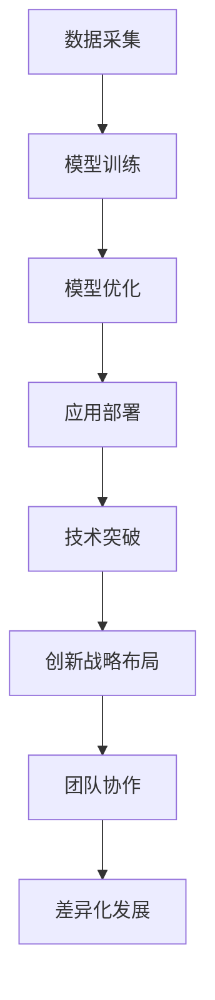

                 

# AI创业竞争加剧，差异化发展成制胜法宝

> 关键词：AI创业、竞争、差异化、制胜法宝、技术突破、创新、战略布局

> 摘要：在人工智能领域，创业公司之间的竞争愈发激烈。如何在红海市场中脱颖而出，实现可持续发展，差异化发展成为关键。本文将深入剖析AI创业领域的竞争态势，探讨如何通过技术突破、创新战略布局以及团队协作，实现差异化发展，成为制胜的法宝。

## 1. 背景介绍

### 1.1 目的和范围

本文旨在分析当前AI创业领域的竞争态势，探讨如何通过差异化发展，在激烈的市场竞争中脱颖而出。文章将从以下几个方面展开：

- AI创业竞争的现状及趋势
- 差异化发展的必要性和可行性
- 技术突破与创新在差异化发展中的作用
- 团队协作与战略布局对差异化发展的支持
- 成功案例分析及启示

### 1.2 预期读者

本文面向希望了解AI创业市场现状及未来趋势的创业者、投资人、行业从业者，以及关注AI技术发展的广大读者。

### 1.3 文档结构概述

本文结构如下：

- 第1章：背景介绍，阐述本文的目的、范围和预期读者。
- 第2章：核心概念与联系，介绍AI创业的核心概念及相关架构。
- 第3章：核心算法原理 & 具体操作步骤，讲解实现差异化发展的关键技术。
- 第4章：数学模型和公式 & 详细讲解 & 举例说明，阐述相关数学模型及其应用。
- 第5章：项目实战：代码实际案例和详细解释说明，通过实际案例展示差异化发展的应用。
- 第6章：实际应用场景，分析AI创业在不同领域的应用情况。
- 第7章：工具和资源推荐，介绍学习资源、开发工具框架及相关论文著作。
- 第8章：总结：未来发展趋势与挑战，对AI创业领域的未来发展进行展望。
- 第9章：附录：常见问题与解答，解答读者可能遇到的问题。
- 第10章：扩展阅读 & 参考资料，提供相关扩展阅读材料。

### 1.4 术语表

#### 1.4.1 核心术语定义

- AI创业：指以人工智能技术为核心，开展商业活动的创业项目。
- 差异化发展：指在竞争激烈的市场中，通过技术创新、产品特色、服务优势等手段，实现与竞争对手区分，形成独特竞争优势。
- 技术突破：指在现有技术基础上，实现重大创新，推动产业发展的关键因素。
- 创新战略布局：指企业根据市场需求、竞争态势等，制定创新战略，实现差异化发展。

#### 1.4.2 相关概念解释

- 人工智能：指通过模拟、延伸和扩展人的智能，实现智能机器的自主学习和决策能力。
- 红海市场：指竞争激烈、同质化严重的市场。
- 蓝海市场：指竞争较少、市场潜力巨大的市场。

#### 1.4.3 缩略词列表

- AI：人工智能
- ML：机器学习
- DL：深度学习
- NLP：自然语言处理
- CV：计算机视觉
- IoT：物联网

## 2. 核心概念与联系

在AI创业领域，以下核心概念及其相互联系构成了差异化发展的基础。

### 2.1 AI创业的核心概念

#### 2.1.1 人工智能

人工智能是指通过模拟、延伸和扩展人的智能，实现智能机器的自主学习和决策能力。人工智能可分为机器学习、深度学习、自然语言处理、计算机视觉等领域。

#### 2.1.2 机器学习

机器学习是一种人工智能技术，通过构建数学模型，利用数据训练算法，使计算机具备自主学习和预测能力。机器学习可分为监督学习、无监督学习、强化学习等类型。

#### 2.1.3 深度学习

深度学习是机器学习的一种类型，通过构建多层神经网络，对大量数据进行训练，实现高层次的抽象和特征提取。

#### 2.1.4 自然语言处理

自然语言处理是人工智能的一种应用，旨在使计算机能够理解和处理人类语言。自然语言处理包括文本分类、机器翻译、语音识别等任务。

#### 2.1.5 计算机视觉

计算机视觉是人工智能的一种应用，旨在使计算机能够识别和理解视觉信息。计算机视觉包括图像分类、目标检测、人脸识别等任务。

### 2.2 AI创业的核心架构

#### 2.2.1 数据采集

数据采集是AI创业的基础，通过收集大量高质量的数据，为后续的模型训练和优化提供支持。

#### 2.2.2 模型训练

模型训练是AI创业的核心，通过选择合适的算法和架构，对数据进行处理和训练，实现智能化的功能。

#### 2.2.3 模型优化

模型优化是提高AI创业项目性能的关键，通过调整模型参数、优化算法，提升模型的准确率和效率。

#### 2.2.4 应用部署

应用部署是将AI模型应用于实际场景的过程，通过搭建合适的平台和架构，实现AI创业项目的商业化。

### 2.3 差异化发展的联系

#### 2.3.1 技术突破

技术突破是实现差异化发展的关键，通过创新算法、优化架构、引入新技术等手段，实现与竞争对手的区分。

#### 2.3.2 创新战略布局

创新战略布局是企业实现差异化发展的指导思想，通过市场调研、竞争分析、技术规划等手段，制定符合市场需求的创新战略。

#### 2.3.3 团队协作

团队协作是实现差异化发展的保障，通过优化团队结构、明确职责分工、提升团队执行力等手段，确保项目的顺利推进。

### 2.4 Mermaid流程图



## 3. 核心算法原理 & 具体操作步骤

### 3.1 差异化发展的核心算法原理

实现差异化发展的核心算法主要包括以下几种：

#### 3.1.1 机器学习算法

机器学习算法是AI创业项目的基础，通过训练模型，使计算机具备自主学习和预测能力。常见的机器学习算法有：

- 监督学习算法：如线性回归、决策树、支持向量机等。
- 无监督学习算法：如聚类、主成分分析等。
- 强化学习算法：如Q学习、深度Q网络等。

#### 3.1.2 深度学习算法

深度学习算法是机器学习的一种类型，通过构建多层神经网络，实现高层次的抽象和特征提取。常见的深度学习算法有：

- 卷积神经网络（CNN）：适用于图像处理任务。
- 循环神经网络（RNN）：适用于序列数据处理任务。
- 生成对抗网络（GAN）：适用于图像生成、风格迁移等任务。

#### 3.1.3 自然语言处理算法

自然语言处理算法是AI创业项目的重要应用，通过理解、处理和生成人类语言，实现人机交互。常见的自然语言处理算法有：

- 词嵌入：将单词映射到高维向量空间。
- 语言模型：用于预测下一个词或句子。
- 语义分析：用于理解句子或文本的含义。

#### 3.1.4 计算机视觉算法

计算机视觉算法是AI创业项目的重要应用，通过识别和理解视觉信息，实现智能化的功能。常见的计算机视觉算法有：

- 目标检测：用于识别图像中的物体。
- 人脸识别：用于识别图像中的人脸。
- 图像分类：用于对图像进行分类。

### 3.2 差异化发展的具体操作步骤

实现差异化发展的具体操作步骤如下：

#### 3.2.1 技术突破

1. 调研市场需求，识别技术痛点。
2. 引入新技术或优化现有技术，实现技术突破。
3. 构建原型，验证技术可行性。
4. 优化技术，提高性能和可靠性。

#### 3.2.2 创新战略布局

1. 进行市场调研，了解竞争态势。
2. 制定创新战略，明确发展方向。
3. 调整产品和服务，实现差异化。
4. 持续优化战略，适应市场变化。

#### 3.2.3 团队协作

1. 明确团队职责，优化组织结构。
2. 提升团队执行力，确保项目推进。
3. 建立良好的沟通机制，促进协作。
4. 激发团队创新，推动项目发展。

### 3.3 伪代码示例

```python
# 伪代码：差异化发展实现过程

# 数据采集
data = collect_data()

# 模型训练
model = train_model(data)

# 模型优化
model = optimize_model(model)

# 应用部署
deploy_model(model)

# 技术突破
breakthrough = implement_technology()

# 创新战略布局
strategy = develop_strategy()

# 团队协作
collaboration = enhance_collaboration()

# 差异化发展
differentiation = achieve_differentiation(breakthrough, strategy, collaboration)
```

## 4. 数学模型和公式 & 详细讲解 & 举例说明

### 4.1 数学模型和公式

在AI创业过程中，数学模型和公式起着至关重要的作用。以下是一些常见的数学模型和公式及其详细讲解。

#### 4.1.1 线性回归模型

线性回归模型是一种监督学习算法，用于预测连续值。其公式如下：

$$ y = \beta_0 + \beta_1x + \epsilon $$

其中，$y$ 为因变量，$x$ 为自变量，$\beta_0$ 和 $\beta_1$ 为模型参数，$\epsilon$ 为误差项。

#### 4.1.2 逻辑回归模型

逻辑回归模型是一种用于分类的监督学习算法。其公式如下：

$$ P(y=1) = \frac{1}{1 + e^{-(\beta_0 + \beta_1x)}} $$

其中，$P(y=1)$ 为因变量为1的概率，$\beta_0$ 和 $\beta_1$ 为模型参数。

#### 4.1.3 卷积神经网络（CNN）的卷积操作

卷积神经网络是一种用于图像处理的深度学习算法。其卷积操作公式如下：

$$ (f * g)(x) = \sum_{y} f(y) \cdot g(x-y) $$

其中，$f$ 和 $g$ 分别为卷积核和输入图像，$x$ 为输入图像的坐标。

#### 4.1.4 循环神经网络（RNN）的递归操作

循环神经网络是一种用于序列数据的深度学习算法。其递归操作公式如下：

$$ h_t = \sigma(W_h \cdot [h_{t-1}, x_t] + b_h) $$

其中，$h_t$ 为第 $t$ 个时刻的隐藏状态，$x_t$ 为第 $t$ 个时刻的输入，$W_h$ 和 $b_h$ 分别为权重和偏置。

### 4.2 举例说明

以下通过一个简单的线性回归模型举例说明数学模型的应用。

#### 4.2.1 数据集

给定一个数据集，包含自变量 $x$ 和因变量 $y$：

| x | y |
| --- | --- |
| 1 | 2 |
| 2 | 4 |
| 3 | 6 |

#### 4.2.2 模型参数初始化

初始化模型参数 $\beta_0$ 和 $\beta_1$：

$$ \beta_0 = 0, \beta_1 = 0 $$

#### 4.2.3 模型训练

通过最小二乘法训练模型参数：

$$ \beta_0 = \frac{\sum_{i=1}^{n} y_i - \beta_1 \sum_{i=1}^{n} x_i}{n} $$

$$ \beta_1 = \frac{\sum_{i=1}^{n} (y_i - \beta_0 - \beta_1 x_i)(x_i - \bar{x})}{\sum_{i=1}^{n} (x_i - \bar{x})^2} $$

其中，$n$ 为数据集大小，$\bar{x}$ 和 $\bar{y}$ 分别为自变量和因变量的平均值。

#### 4.2.4 模型预测

使用训练好的模型进行预测：

$$ y = \beta_0 + \beta_1 x $$

例如，当 $x=4$ 时：

$$ y = 0 + 2 \cdot 4 = 8 $$

## 5. 项目实战：代码实际案例和详细解释说明

### 5.1 开发环境搭建

在本项目实战中，我们将使用Python作为编程语言，结合Jupyter Notebook进行开发和测试。以下为开发环境的搭建步骤：

1. 安装Python（版本3.8及以上）。
2. 安装Jupyter Notebook。
3. 安装必要的库，如NumPy、Pandas、Scikit-learn、TensorFlow等。

### 5.2 源代码详细实现和代码解读

以下为项目实战的源代码及详细解释说明：

```python
# 导入必要的库
import numpy as np
import pandas as pd
from sklearn.linear_model import LinearRegression
from sklearn.model_selection import train_test_split
from sklearn.metrics import mean_squared_error

# 数据集加载
data = pd.read_csv('data.csv')
X = data['x'].values.reshape(-1, 1)
y = data['y'].values

# 数据集划分
X_train, X_test, y_train, y_test = train_test_split(X, y, test_size=0.2, random_state=42)

# 模型训练
model = LinearRegression()
model.fit(X_train, y_train)

# 模型预测
y_pred = model.predict(X_test)

# 模型评估
mse = mean_squared_error(y_test, y_pred)
print(f'Mean Squared Error: {mse}')

# 代码解读
# 1. 导入必要的库，包括NumPy、Pandas、Scikit-learn等。
# 2. 加载数据集，将自变量和因变量分离。
# 3. 划分训练集和测试集，用于模型训练和评估。
# 4. 创建线性回归模型对象，并使用训练集进行训练。
# 5. 使用测试集进行模型预测。
# 6. 计算并输出模型评估指标，即均方误差（MSE）。
```

### 5.3 代码解读与分析

以下对上述代码进行详细解读和分析：

1. **库的导入**：
   - NumPy：提供高效的数组计算功能。
   - Pandas：提供数据操作和数据分析工具。
   - Scikit-learn：提供机器学习算法和评估指标。

2. **数据集加载**：
   - 使用Pandas读取CSV格式的数据集，将自变量和因变量分离。

3. **数据集划分**：
   - 使用Scikit-learn的`train_test_split`函数，将数据集划分为训练集和测试集，用于模型训练和评估。

4. **模型训练**：
   - 创建线性回归模型对象，并使用训练集进行训练。

5. **模型预测**：
   - 使用训练好的模型对测试集进行预测。

6. **模型评估**：
   - 计算并输出模型评估指标，即均方误差（MSE），用于评估模型性能。

通过以上步骤，我们实现了一个简单的线性回归模型，用于预测数据集中的因变量。该模型可以作为AI创业项目中的基础算法，为实现差异化发展提供支持。

## 6. 实际应用场景

AI创业在不同领域的应用场景丰富多样，以下列举几个典型应用场景：

### 6.1 金融领域

金融领域的AI应用包括风险控制、量化交易、客户服务等方面。例如，通过机器学习算法分析用户行为数据，实现精准营销和风险预警；通过深度学习算法构建量化交易模型，提高投资收益。

### 6.2 医疗健康领域

医疗健康领域的AI应用包括疾病诊断、医学图像分析、健康管理等。例如，通过计算机视觉技术实现医学图像自动诊断，提高诊断准确率和效率；通过自然语言处理技术分析病历数据，实现智能健康管理。

### 6.3 物流与交通领域

物流与交通领域的AI应用包括路线规划、车辆调度、智能配送等。例如，通过机器学习算法优化物流路线，降低运输成本；通过深度学习算法实现自动驾驶，提高交通安全性和效率。

### 6.4 消费者领域

消费者领域的AI应用包括个性化推荐、智能客服、广告投放等。例如，通过机器学习算法分析用户行为数据，实现个性化推荐，提高用户满意度；通过自然语言处理技术实现智能客服，提高客户服务水平。

### 6.5 能源领域

能源领域的AI应用包括智能电网、能源管理、电力预测等。例如，通过机器学习算法优化能源使用，降低能耗；通过深度学习算法实现电力负荷预测，提高电力系统运行效率。

## 7. 工具和资源推荐

### 7.1 学习资源推荐

#### 7.1.1 书籍推荐

- 《人工智能：一种现代的方法》
- 《深度学习》
- 《Python机器学习》
- 《自然语言处理编程》

#### 7.1.2 在线课程

- Coursera上的《机器学习》课程
- edX上的《深度学习》课程
- Udacity的《人工智能纳米学位》

#### 7.1.3 技术博客和网站

- Medium上的AI相关博客
- 知乎上的AI话题
- arXiv.org上的最新研究成果

### 7.2 开发工具框架推荐

#### 7.2.1 IDE和编辑器

- PyCharm
- Jupyter Notebook
- VS Code

#### 7.2.2 调试和性能分析工具

- PyDebug
- Profiler
- Jupyter Notebook内置调试工具

#### 7.2.3 相关框架和库

- TensorFlow
- PyTorch
- Scikit-learn
- NumPy

### 7.3 相关论文著作推荐

#### 7.3.1 经典论文

- "A Mathematical Theory of Communication"（香农信息论）
- "Backpropagation: Like a Dream That Is Never Ending, It Moves"（反向传播算法）
- "Learning to Represent Knowledge as Dynamic Knowledge Graph Embeddings"（知识图谱嵌入）

#### 7.3.2 最新研究成果

- "Unsupervised Pre-training for J

