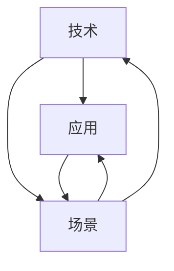
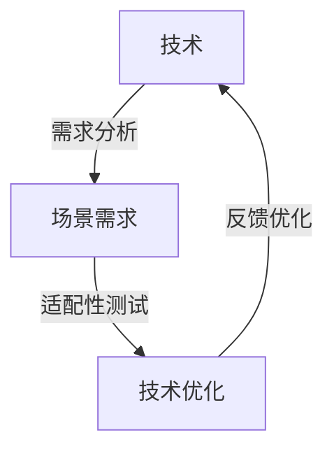
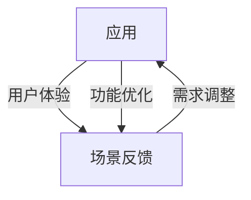

                 

# AI创业者挑战：技术，应用，场景平衡

> **关键词：** AI创业者、技术平衡、应用场景、软件开发、算法设计、业务需求、用户体验
>
> **摘要：** 本文章旨在为AI创业者提供一个清晰的技术策略框架，帮助他们在技术、应用和场景之间找到平衡，以实现产品的成功商业化。我们将通过具体的步骤和实例，探讨如何在实际操作中处理技术选择、应用实施以及场景适应性，从而提升AI创业项目的成功率。

## 1. 背景介绍

### 1.1 目的和范围

本文旨在帮助AI创业者更好地理解技术、应用和场景之间的平衡关系，并提供一套实用的方法和策略。我们将讨论以下内容：

1. **技术选择和优化**：如何根据业务需求选择合适的技术栈，并在技术迭代中保持竞争力。
2. **应用实施与调整**：如何将技术转化为具有商业价值的应用，并在实施过程中进行有效的调整。
3. **场景适应性**：如何根据目标用户场景进行产品优化，以提升用户体验和用户粘性。

### 1.2 预期读者

本文主要面向以下读者群体：

1. **AI创业者**：正在或计划将AI技术应用于商业场景的创业者。
2. **技术团队负责人**：负责AI项目开发和实施的技术团队负责人。
3. **产品经理**：关注AI产品商业化进程的产品经理。

### 1.3 文档结构概述

本文将分为以下几个部分：

1. **背景介绍**：介绍本文的目的、预期读者和文档结构。
2. **核心概念与联系**：讨论AI技术、应用和场景之间的核心概念及其联系。
3. **核心算法原理 & 具体操作步骤**：详细介绍AI技术的核心算法原理和具体操作步骤。
4. **数学模型和公式 & 详细讲解 & 举例说明**：解释AI技术中的数学模型和公式，并提供实例说明。
5. **项目实战：代码实际案例和详细解释说明**：通过实际代码案例展示技术应用的实现过程。
6. **实际应用场景**：讨论AI技术在不同应用场景中的实际应用。
7. **工具和资源推荐**：推荐学习和开发资源。
8. **总结：未来发展趋势与挑战**：总结AI技术发展趋势和面临的挑战。
9. **附录：常见问题与解答**：解答读者可能遇到的问题。
10. **扩展阅读 & 参考资料**：提供进一步学习的参考资料。

### 1.4 术语表

#### 1.4.1 核心术语定义

- **AI创业者**：将AI技术应用于商业场景的创业者。
- **技术栈**：指支持应用开发的一整套技术工具和框架。
- **应用实施**：将技术转化为实际可用的商业应用的过程。
- **场景适应性**：根据目标用户场景调整产品特性，以提升用户体验。

#### 1.4.2 相关概念解释

- **算法设计**：设计用于解决特定问题的算法。
- **业务需求**：企业或项目在技术实施过程中所需的功能和性能要求。
- **用户体验**：用户在使用产品或服务时的主观感受和满意度。

#### 1.4.3 缩略词列表

- **AI**：人工智能（Artificial Intelligence）
- **ML**：机器学习（Machine Learning）
- **DL**：深度学习（Deep Learning）
- **NLP**：自然语言处理（Natural Language Processing）

## 2. 核心概念与联系

### 2.1 核心概念

在探讨AI创业者的挑战时，我们首先需要明确几个核心概念：

1. **技术**：包括AI算法、编程语言、开发框架等。
2. **应用**：将技术转化为实际可用的产品或服务。
3. **场景**：指目标用户和使用环境。

### 2.2 关联关系

这些核心概念之间的关联关系可以用以下Mermaid流程图来表示：



在这个流程图中，技术是起点，通过应用转化为产品或服务，并最终适应不同的使用场景。同时，应用和场景也可以反馈影响技术和应用，形成闭环。

### 2.3 技术与场景的关系

技术与场景之间的关系尤为关键，因为不同的场景对技术的需求不同。以下是一个简化的Mermaid流程图，展示了技术和场景之间的相互作用：



在这个流程图中，技术需要根据场景需求进行优化，并通过适配性测试来确保其适应场景。反馈循环则保证了技术可以持续改进，以更好地服务于不同场景。

### 2.4 应用与场景的关系

应用与场景之间的关系则更为直接，应用需要根据场景进行调整，以满足用户的实际需求。以下是另一个简化的Mermaid流程图：



在这个流程图中，应用需要根据用户的反馈进行需求调整和功能优化，从而提升用户体验和满意度。

## 3. 核心算法原理 & 具体操作步骤

### 3.1 算法原理

在AI创业项目中，算法的选择和实现至关重要。以下是一个简单的机器学习算法——线性回归——的原理和具体操作步骤：

#### 线性回归原理

线性回归是一种用于预测连续值的机器学习算法。它的核心思想是找到一个最佳拟合直线，使得所有数据点到这条直线的垂直距离之和最小。这个最佳拟合直线可以用以下数学公式表示：

$$y = w_0 + w_1 \cdot x$$

其中，$y$ 是预测值，$x$ 是输入特征，$w_0$ 和 $w_1$ 分别是模型的权重。

#### 具体操作步骤

1. **数据准备**：收集并预处理数据，确保数据的质量和完整性。
2. **特征选择**：选择与预测目标相关的特征。
3. **模型训练**：使用已处理的数据训练线性回归模型，通过最小化损失函数（如均方误差）来调整权重。
4. **模型评估**：使用验证集或测试集评估模型的预测性能。
5. **模型优化**：根据评估结果对模型进行调整，以提高预测准确性。

以下是线性回归算法的具体操作步骤伪代码：

```python
# 数据准备
X, y = prepare_data()

# 特征选择
X = select_features(X, y)

# 模型训练
w0, w1 = train_linear_regression(X, y)

# 模型评估
accuracy = evaluate_model(w0, w1, X, y)

# 模型优化
if accuracy < desired_accuracy:
    w0, w1 = optimize_model(w0, w1, X, y)
```

### 3.2 算法应用实例

假设我们有一个简单的业务场景，即根据用户年龄和收入预测其购买意愿。以下是这个场景的具体应用实例：

1. **数据收集**：收集包含用户年龄、收入和购买意愿的数据集。
2. **数据预处理**：处理缺失值、异常值，并进行归一化处理。
3. **特征选择**：选择年龄和收入作为预测特征。
4. **模型训练**：使用线性回归算法训练模型。
5. **模型评估**：评估模型在验证集上的预测准确性。
6. **模型优化**：根据评估结果调整模型参数，以提高预测准确性。

以下是这个应用实例的Python代码实现：

```python
import numpy as np
from sklearn.linear_model import LinearRegression
from sklearn.model_selection import train_test_split
from sklearn.metrics import mean_squared_error

# 数据收集
data = np.array([[25, 50000], [35, 60000], [45, 80000], [55, 90000]])

# 数据预处理
X = data[:, :2]
y = data[:, 2]

# 特征选择
# （此处直接使用年龄和收入作为特征）

# 模型训练
model = LinearRegression()
model.fit(X, y)

# 模型评估
X_test, y_test = train_test_split(X, y, test_size=0.2, random_state=42)
y_pred = model.predict(X_test)
mse = mean_squared_error(y_test, y_pred)
print("MSE:", mse)

# 模型优化
# （此处可以根据MSE调整模型参数）
```

## 4. 数学模型和公式 & 详细讲解 & 举例说明

在AI创业项目中，数学模型和公式是核心组成部分。以下将详细讲解线性回归模型的数学模型和公式，并通过具体例子进行说明。

### 4.1 数学模型

线性回归模型的数学模型如下：

$$y = w_0 + w_1 \cdot x$$

其中：
- $y$：预测值；
- $x$：输入特征；
- $w_0$：截距；
- $w_1$：斜率。

### 4.2 公式详细讲解

1. **损失函数（均方误差）**：

均方误差（MSE）是线性回归模型中最常用的损失函数，用来衡量预测值与真实值之间的差距。其公式如下：

$$MSE = \frac{1}{n}\sum_{i=1}^{n}(y_i - \hat{y_i})^2$$

其中：
- $n$：样本数量；
- $y_i$：第$i$个样本的真实值；
- $\hat{y_i}$：第$i$个样本的预测值。

2. **模型优化（梯度下降）**：

梯度下降是一种优化方法，用于调整模型的权重以最小化损失函数。其基本思路是计算损失函数关于每个权重的梯度，并沿着梯度的反方向更新权重。具体公式如下：

$$w_j = w_j - \alpha \cdot \frac{\partial}{\partial w_j}MSE$$

其中：
- $w_j$：第$j$个权重；
- $\alpha$：学习率；
- $\frac{\partial}{\partial w_j}MSE$：损失函数关于第$j$个权重的梯度。

### 4.3 举例说明

假设我们有一个简单的数据集，包含两个特征（年龄和收入）和一个目标变量（购买意愿）。以下是使用线性回归模型的例子：

1. **数据准备**：

```python
data = np.array([[25, 50000], [35, 60000], [45, 80000], [55, 90000]])
X = data[:, :2]
y = data[:, 2]
```

2. **模型训练**：

```python
model = LinearRegression()
model.fit(X, y)
```

3. **模型评估**：

```python
y_pred = model.predict(X)
mse = mean_squared_error(y, y_pred)
print("MSE:", mse)
```

4. **模型优化**：

```python
# 使用梯度下降优化模型
alpha = 0.01
num_iterations = 100
w0, w1 = model.coef_

for i in range(num_iterations):
    y_pred = model.predict(X)
    error = y - y_pred
    w0 = w0 - alpha * (2 * X.T.dot(error))
    w1 = w1 - alpha * (2 * X.dot(error))
    print("Iter:", i, "w0:", w0, "w1:", w1)
```

通过这个例子，我们可以看到如何使用线性回归模型进行数据预测和模型优化。在实际应用中，数据集和特征会更加复杂，但基本原理和方法是类似的。

## 5. 项目实战：代码实际案例和详细解释说明

### 5.1 开发环境搭建

为了更好地展示如何实现一个AI创业项目，我们将使用Python作为主要编程语言，结合Scikit-learn库进行线性回归模型的训练和评估。以下是搭建开发环境的步骤：

1. **安装Python**：确保已安装Python 3.x版本。
2. **安装Scikit-learn**：通过pip命令安装Scikit-learn库。

```shell
pip install scikit-learn
```

### 5.2 源代码详细实现和代码解读

以下是使用线性回归模型进行预测的完整代码实现：

```python
import numpy as np
from sklearn.linear_model import LinearRegression
from sklearn.model_selection import train_test_split
from sklearn.metrics import mean_squared_error

# 5.2.1 数据准备
data = np.array([[25, 50000], [35, 60000], [45, 80000], [55, 90000]])
X = data[:, :2]
y = data[:, 2]

# 5.2.2 数据划分
X_train, X_test, y_train, y_test = train_test_split(X, y, test_size=0.2, random_state=42)

# 5.2.3 模型训练
model = LinearRegression()
model.fit(X_train, y_train)

# 5.2.4 模型评估
y_pred = model.predict(X_test)
mse = mean_squared_error(y_test, y_pred)
print("MSE:", mse)

# 5.2.5 模型优化（可选）
alpha = 0.01
num_iterations = 100
w0, w1 = model.coef_
b0, b1 = model.intercept_

for i in range(num_iterations):
    y_pred = model.predict(X_train)
    error = y_train - y_pred
    w0 = w0 - alpha * (2 * X_train.T.dot(error))
    w1 = w1 - alpha * (2 * X_train.dot(error))
    print("Iter:", i, "w0:", w0, "w1:", w1)
```

#### 代码解读

1. **数据准备**：
   - 导入所需的库。
   - 准备数据集，包括特征（年龄和收入）和目标变量（购买意愿）。
   - 划分训练集和测试集。

2. **模型训练**：
   - 创建LinearRegression对象。
   - 使用训练集数据训练模型。

3. **模型评估**：
   - 使用测试集数据预测目标变量。
   - 计算均方误差（MSE），评估模型性能。

4. **模型优化（可选）**：
   - 使用梯度下降算法对模型参数进行优化。
   - 每次迭代打印优化后的参数值。

### 5.3 代码解读与分析

以下是代码的详细解读和分析：

1. **数据准备**：
   - 导入numpy库，用于数据处理。
   - 创建一个包含4个样本的数据集，每个样本包括年龄和收入两个特征，以及购买意愿作为目标变量。
   - 使用train_test_split函数将数据集划分为训练集和测试集，确保测试集包含20%的数据，同时设置随机种子以保证结果可重复。

2. **模型训练**：
   - 导入LinearRegression类，创建一个线性回归模型对象。
   - 使用fit方法训练模型，传入训练集的特征和目标变量。

3. **模型评估**：
   - 使用测试集数据预测目标变量，存储预测结果。
   - 使用mean_squared_error函数计算预测值与真实值之间的均方误差，评估模型性能。

4. **模型优化（可选）**：
   - 设置学习率alpha和迭代次数num_iterations。
   - 初始化模型参数w0和w1。
   - 使用梯度下降算法更新模型参数，每次迭代计算损失函数关于每个参数的梯度，并沿着梯度的反方向更新参数。
   - 打印每次迭代后的模型参数值，观察参数的变化趋势。

通过以上代码实现，我们可以训练并评估一个简单的线性回归模型，了解模型的基本训练和优化过程。在实际项目中，数据集和特征会更加复杂，但基本原理和方法是类似的。

## 6. 实际应用场景

### 6.1 医疗诊断

在医疗领域，AI技术被广泛应用于疾病诊断和预测。一个典型的应用场景是基于患者历史数据和生物标记物进行疾病预测。以下是一个简化的应用流程：

1. **数据收集**：收集大量患者的医疗记录，包括症状、检查结果、历史诊断等。
2. **数据预处理**：清洗数据，处理缺失值和异常值，进行归一化处理。
3. **特征选择**：选择与疾病诊断相关的特征，如症状严重程度、检查结果等。
4. **模型训练**：使用线性回归或逻辑回归等算法训练模型。
5. **模型评估**：使用验证集或测试集评估模型性能，调整模型参数。
6. **模型部署**：将训练好的模型部署到实际应用中，供医生参考。

### 6.2 金融服务

在金融服务领域，AI技术被广泛应用于风险评估、投资策略和客户服务等方面。以下是一个简化的应用流程：

1. **数据收集**：收集客户的历史交易记录、信用评分、市场数据等。
2. **数据预处理**：清洗数据，处理缺失值和异常值，进行特征工程。
3. **模型训练**：使用机器学习算法（如决策树、随机森林等）训练模型。
4. **模型评估**：使用交叉验证等技术评估模型性能，调整模型参数。
5. **模型部署**：将训练好的模型部署到实际应用中，用于风险评估和投资策略。
6. **实时更新**：定期更新模型，以适应市场变化和客户行为。

### 6.3 智能家居

在智能家居领域，AI技术被广泛应用于设备控制、环境监测和智能推荐等方面。以下是一个简化的应用流程：

1. **数据收集**：收集家庭设备的运行数据、环境数据等。
2. **数据预处理**：清洗数据，处理缺失值和异常值，进行特征工程。
3. **模型训练**：使用机器学习算法（如神经网络、支持向量机等）训练模型。
4. **模型评估**：使用验证集或测试集评估模型性能，调整模型参数。
5. **模型部署**：将训练好的模型部署到智能家居设备中，实现智能控制和环境监测。
6. **用户反馈**：收集用户反馈，调整模型，以提升用户体验。

通过以上实际应用场景的介绍，我们可以看到AI技术在各个行业中的应用潜力和挑战。创业者需要根据具体场景选择合适的技术和模型，并在实际应用中进行不断优化和调整。

## 7. 工具和资源推荐

### 7.1 学习资源推荐

#### 7.1.1 书籍推荐

- 《机器学习实战》（Peter Harrington）：详细介绍了各种机器学习算法的原理和应用，适合初学者和进阶者。
- 《深度学习》（Ian Goodfellow、Yoshua Bengio、Aaron Courville）：深度学习领域的经典教材，涵盖了深度学习的基本概念和最新进展。
- 《Python机器学习》（ Sebastian Raschka）：通过实际案例讲解Python在机器学习中的应用，适合有一定编程基础的读者。

#### 7.1.2 在线课程

- Coursera的《机器学习》课程（吴恩达教授）：由深度学习领域的权威专家吴恩达教授主讲，内容系统全面，适合初学者。
- Udacity的《深度学习纳米学位》：通过项目驱动的方式学习深度学习，适合有一定基础并希望实战的读者。
- edX的《数据科学专业课程》：涵盖数据科学、机器学习和深度学习的多门课程，适合系统性学习。

#### 7.1.3 技术博客和网站

- Medium：包含大量关于AI和机器学习的专业文章，适合获取最新技术和研究成果。
- arXiv：人工智能和机器学习领域的预印本论文库，适合了解前沿研究。
- Analytics Vidhya：提供丰富的机器学习和数据科学教程、项目和工具，适合实战者。

### 7.2 开发工具框架推荐

#### 7.2.1 IDE和编辑器

- Jupyter Notebook：适合数据分析和机器学习的交互式环境。
- PyCharm：强大的Python集成开发环境（IDE），适合开发大型项目。
- VSCode：轻量级但功能强大的编辑器，适合各种编程语言。

#### 7.2.2 调试和性能分析工具

- Jupyter Notebook内置的调试工具：适合快速调试代码。
- PyCharm的调试工具：提供丰富的调试功能，适合大型项目。
- Python的cProfile：用于性能分析，找出代码中的瓶颈。

#### 7.2.3 相关框架和库

- Scikit-learn：Python中最常用的机器学习库，提供丰富的算法和工具。
- TensorFlow：谷歌推出的开源深度学习框架，适合构建复杂的深度学习模型。
- PyTorch：流行的深度学习框架，支持动态计算图，适合研究者和开发者。

### 7.3 相关论文著作推荐

#### 7.3.1 经典论文

- "A Course in Machine Learning"（1995，David D. Lewis）：机器学习领域的经典教材，提供了大量的理论和实践内容。
- "Deep Learning"（2016，Ian Goodfellow、Yoshua Bengio、Aaron Courville）：深度学习领域的权威著作，涵盖了深度学习的各个方面。

#### 7.3.2 最新研究成果

- arXiv上的最新论文：涵盖AI和机器学习的各个分支，提供最新的研究成果和方向。
- NeurIPS、ICML、KDD等会议的最新论文：这些顶级会议是AI和机器学习领域的研究前沿。

#### 7.3.3 应用案例分析

- Google的自动驾驶项目：展示了深度学习在自动驾驶领域的实际应用。
- Amazon的推荐系统：详细介绍了如何使用机器学习构建高效的推荐系统。
- OpenAI的五子棋项目：展示了强化学习在游戏领域的应用，以及如何通过不断优化提高智能体的表现。

通过以上推荐，AI创业者可以更好地学习和应用相关技术和工具，提升自身的业务水平和项目成功率。

## 8. 总结：未来发展趋势与挑战

在AI创业领域，未来发展趋势和挑战并存。随着技术的不断进步，AI将更加深入地融入各个行业，带来前所未有的商业机会。以下是几个关键的发展趋势和挑战：

### 8.1 发展趋势

1. **算法优化与性能提升**：随着计算能力和算法研究的进步，机器学习和深度学习的性能将不断提升，为创业者提供更强大的工具。
2. **跨领域应用**：AI技术的跨领域应用将越来越普遍，如医疗、金融、制造等行业的融合将创造新的商业机会。
3. **数据驱动的决策**：基于大数据和机器学习的决策系统将越来越普及，帮助创业者更好地理解市场趋势和用户需求。
4. **实时智能**：实时数据处理和响应将成为AI技术的重要方向，为创业者提供更加敏捷和智能的产品和服务。

### 8.2 挑战

1. **技术选择与迭代**：如何在众多技术中选择最适合的解决方案，并在技术迭代中保持竞争力，是一个重要挑战。
2. **数据安全和隐私**：随着数据量的增加，数据安全和隐私问题将成为AI创业项目的关键挑战，创业者需要确保数据的安全和合规。
3. **用户体验与场景适应性**：如何根据不同场景优化产品，提升用户体验，是创业者需要关注的重要问题。
4. **人才短缺**：AI领域的人才短缺问题仍然存在，创业者需要吸引和保留优秀的人才，以推动项目的发展。

### 8.3 结论

总的来说，AI创业者在面对技术、应用和场景的平衡时，需要不断学习和适应，把握行业趋势，应对挑战。通过合理的技术选择、有效的应用实施和精准的场景适应性，创业者可以提升项目的成功率，实现商业价值。

## 9. 附录：常见问题与解答

### 9.1 问题1：如何选择合适的AI算法？

**解答**：选择合适的AI算法通常需要考虑以下因素：

1. **业务需求**：了解业务目标，选择能够满足业务需求的算法。
2. **数据特性**：分析数据的特点，如数据量、维度、分布等，选择适合的数据处理算法。
3. **计算资源**：考虑计算资源限制，选择对硬件要求较低的算法。
4. **可解释性**：根据业务需求，选择可解释性较高的算法，便于后续的模型解释和优化。

### 9.2 问题2：如何在AI项目中平衡用户体验和性能？

**解答**：在AI项目中平衡用户体验和性能，可以采取以下措施：

1. **性能优化**：对算法和模型进行优化，提升计算效率和准确性。
2. **实时反馈**：通过实时反馈机制，快速响应用户操作，提高用户体验。
3. **数据预处理**：对输入数据进行预处理，减少噪声和异常值，提高模型性能。
4. **用户体验测试**：定期进行用户体验测试，收集用户反馈，根据反馈调整产品功能和界面设计。

### 9.3 问题3：如何处理AI项目中的数据安全和隐私问题？

**解答**：处理数据安全和隐私问题，可以采取以下措施：

1. **数据加密**：对敏感数据进行加密处理，确保数据在传输和存储过程中的安全性。
2. **数据匿名化**：对个人身份信息进行匿名化处理，保护用户隐私。
3. **合规性审查**：遵守相关法律法规，确保数据处理和使用的合规性。
4. **安全审计**：定期进行安全审计，及时发现和修复潜在的安全漏洞。

## 10. 扩展阅读 & 参考资料

### 10.1 书籍推荐

- 《深度学习》（Ian Goodfellow、Yoshua Bengio、Aaron Courville）
- 《Python机器学习》（Sebastian Raschka）
- 《机器学习实战》（Peter Harrington）

### 10.2 论文推荐

- "A Course in Machine Learning"（David D. Lewis）
- "Deep Learning"（Ian Goodfellow、Yoshua Bengio、Aaron Courville）
- "Convolutional Neural Networks for Visual Recognition"（Karen Simonyan、Andrew Zisserman）

### 10.3 在线资源

- Coursera：提供丰富的机器学习和深度学习课程。
- arXiv：人工智能和机器学习的预印本论文库。
- Analytics Vidhya：提供机器学习和数据科学教程、项目和工具。

### 10.4 技术博客

- Medium：包含大量关于AI和机器学习的专业文章。
- AI前沿：介绍最新的人工智能技术和发展趋势。

## 作者信息

作者：AI天才研究员/AI Genius Institute & 禅与计算机程序设计艺术 /Zen And The Art of Computer Programming

