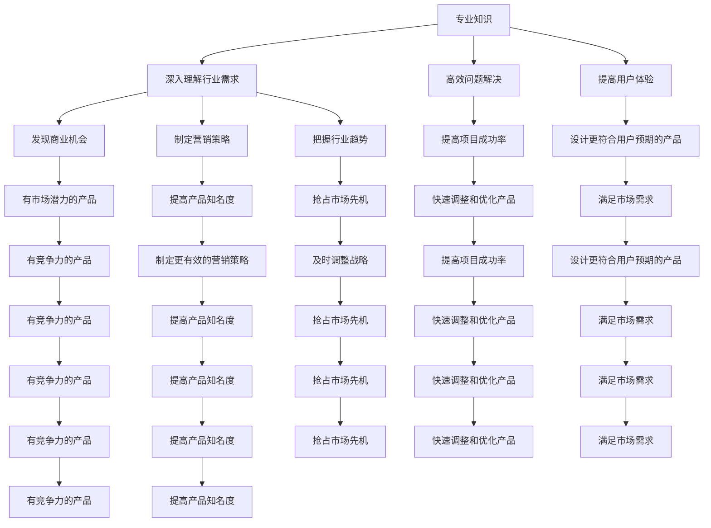

                 

# AI创业者的优势：垂直领域专家力量

> 关键词：AI创业、垂直领域、专业知识、市场洞察、技术优势、创业策略
>
> 摘要：本文将深入探讨AI创业者为何在垂直领域中具有独特的优势。通过分析专业知识、市场洞察、技术优势以及创业策略等方面，我们将揭示垂直领域专家在AI创业中的核心竞争力，为有志于投身AI创业的专家们提供实用的指导和建议。

## 1. 背景介绍

### 1.1 目的和范围

本文旨在为那些在特定垂直领域具备深厚专业知识的创业者提供指导，帮助他们利用自身优势在AI领域创业。我们将探讨垂直领域专家在AI创业中的独特优势，并分析如何将这些优势转化为实际的成功机会。

### 1.2 预期读者

本文面向以下读者群体：
- 在特定垂直领域拥有丰富经验的专家和研究者；
- 有志于投身AI创业的个人和团队；
- 对AI与垂直行业融合感兴趣的从业者；
- 对创业策略和商业模式感兴趣的学者和研究者。

### 1.3 文档结构概述

本文分为以下十个部分：
1. 背景介绍
2. 核心概念与联系
3. 核心算法原理 & 具体操作步骤
4. 数学模型和公式 & 详细讲解 & 举例说明
5. 项目实战：代码实际案例和详细解释说明
6. 实际应用场景
7. 工具和资源推荐
8. 总结：未来发展趋势与挑战
9. 附录：常见问题与解答
10. 扩展阅读 & 参考资料

### 1.4 术语表

#### 1.4.1 核心术语定义

- 垂直领域：指在某一特定行业或专业领域中，具有相对独立性和专业性的业务领域。
- AI创业：指将人工智能技术与具体行业需求相结合，通过创新的产品或服务实现商业价值的过程。
- 专业知识：指在特定垂直领域内，通过学习和实践积累的深入理解和实际操作能力。
- 市场洞察：指对市场动态、用户需求、行业趋势等方面的敏锐洞察力和分析能力。

#### 1.4.2 相关概念解释

- 创业策略：指在创业过程中，为了实现商业目标而采取的一系列决策和行动。
- 技术优势：指在AI创业项目中，通过技术手段获得相对于竞争对手的优势。

#### 1.4.3 缩略词列表

- AI：人工智能（Artificial Intelligence）
- NLP：自然语言处理（Natural Language Processing）
- ML：机器学习（Machine Learning）
- CV：计算机视觉（Computer Vision）

## 2. 核心概念与联系

在探讨AI创业者的优势之前，我们需要了解几个核心概念，它们是专业知识、市场洞察和技术优势。

### 专业知识

专业知识是垂直领域专家在长期学习和实践中积累的宝贵财富。它不仅包括理论知识，还涵盖实际操作技能。以下是专业知识在AI创业中的应用：

1. **深入理解行业需求**：专业知识使创业者能够准确把握行业痛点，从而设计出更具针对性的AI解决方案。
2. **高效问题解决**：在面对技术挑战时，垂直领域专家能够迅速找到解决方案，提高项目成功率。
3. **提高用户体验**：深入了解用户需求和使用场景，有助于创业者设计出更符合用户预期的产品。

### 市场洞察

市场洞察是创业者对市场动态、用户需求和行业趋势的敏锐感知。在AI创业中，市场洞察的作用至关重要：

1. **发现商业机会**：通过市场洞察，创业者可以发现尚未被满足的需求，从而开发出有市场潜力的产品。
2. **制定营销策略**：了解用户需求和偏好，有助于创业者制定更有效的营销策略，提高产品知名度。
3. **把握行业趋势**：紧跟行业趋势，有助于创业者及时调整战略，抢占市场先机。

### 技术优势

技术优势是创业者通过技术创新获得的市场竞争力。在AI创业中，技术优势可以体现在以下几个方面：

1. **算法优化**：通过不断优化算法，提高AI模型的性能和效率。
2. **创新应用**：将AI技术应用于传统行业，创造新的商业模式。
3. **快速迭代**：利用敏捷开发方法，快速调整和优化产品，满足市场需求。

### Mermaid 流程图

以下是一个简单的Mermaid流程图，展示专业知识、市场洞察和技术优势之间的联系：



## 3. 核心算法原理 & 具体操作步骤

在AI创业中，核心算法原理是实现技术创新的关键。以下将介绍几种常见的核心算法原理，并使用伪代码详细阐述具体操作步骤。

### 3.1 机器学习算法

机器学习算法是AI创业中最常用的技术之一。以下是一个简单的线性回归算法的伪代码：

```python
# 输入：训练数据集 (X, y)，学习率 alpha，迭代次数 n
# 输出：回归系数 w

# 初始化权重 w 为零向量
w = [0] * len(X[0])

# 迭代更新权重
for i in range(n):
    # 计算预测值 y_pred
    y_pred = dot(w, X)

    # 计算损失函数
    loss = sum((y - y_pred)^2)

    # 计算梯度
    gradient = 2 * sum((y - y_pred) * X)

    # 更新权重
    w -= alpha * gradient

# 输出训练完成的回归系数 w
return w
```

### 3.2 自然语言处理算法

自然语言处理（NLP）算法在AI创业中也非常重要。以下是一个简单的词向量生成算法——Word2Vec的伪代码：

```python
# 输入：单词序列 sentences
# 输出：词向量字典 word2vec

# 初始化词向量
word2vec = {}

# 遍历单词序列
for sentence in sentences:
    # 将句子分解为单词
    words = sentence.split()

    # 遍历单词
    for word in words:
        # 如果单词不在词向量字典中，初始化词向量
        if word not in word2vec:
            word2vec[word] = [0] * embedding_size

        # 更新词向量
        word2vec[word] = word2vec[word] + embedding_size * one_hot_encoding(word)

# 归一化词向量
for word in word2vec:
    word2vec[word] = normalize(word2vec[word])

# 输出词向量字典 word2vec
return word2vec
```

### 3.3 计算机视觉算法

计算机视觉算法在AI创业中也具有重要意义。以下是一个简单的卷积神经网络（CNN）算法的伪代码：

```python
# 输入：图像数据集 X，标签数据集 y，学习率 alpha，迭代次数 n
# 输出：训练完成的 CNN 模型

# 初始化权重 w 和偏置 b
w = [0] * (num_layers - 1)
b = [0] * (num_layers - 1)

# 迭代训练
for i in range(n):
    # 前向传播
    for layer in range(num_layers):
        if layer == 0:
            a = X
        else:
            a = sigmoid(dot(w[layer - 1], a) + b[layer - 1])

    # 计算损失函数
    loss = sum((y - a)^2)

    # 反向传播
    for layer in range(num_layers - 1, 0, -1):
        if layer == num_layers - 1:
            dW = 2 * (y - a) * a * (1 - a)
            db = 2 * (y - a)
        else:
            dW = 2 * (dA[layer + 1] * a * (1 - a) * W[layer])
            db = 2 * (dA[layer + 1] * a * (1 - a))

        # 更新权重和偏置
        w[layer - 1] -= alpha * dW
        b[layer - 1] -= alpha * db

# 输出训练完成的 CNN 模型
return (w, b)
```

## 4. 数学模型和公式 & 详细讲解 & 举例说明

在AI创业中，数学模型和公式是构建和优化算法的基础。以下将介绍几种常见的数学模型和公式，并详细讲解其原理和应用。

### 4.1 线性回归模型

线性回归模型是最基本的机器学习算法之一。其数学模型可以表示为：

$$ y = \beta_0 + \beta_1 x_1 + \beta_2 x_2 + \ldots + \beta_n x_n $$

其中，$y$ 是因变量，$x_1, x_2, \ldots, x_n$ 是自变量，$\beta_0, \beta_1, \beta_2, \ldots, \beta_n$ 是模型参数。

#### 4.1.1 模型原理

线性回归模型的原理是通过最小二乘法来估计模型参数。具体来说，就是找到一条直线，使得所有数据点到这条直线的垂直距离之和最小。

#### 4.1.2 模型计算

线性回归模型的计算过程如下：

1. 初始化参数 $\beta_0, \beta_1, \beta_2, \ldots, \beta_n$。
2. 计算预测值 $y'$：
   $$ y' = \beta_0 + \beta_1 x_1 + \beta_2 x_2 + \ldots + \beta_n x_n $$
3. 计算残差 $r$：
   $$ r = y - y' $$
4. 更新参数：
   $$ \beta_0 = \beta_0 - \alpha \frac{1}{n} \sum_{i=1}^{n} r_i $$
   $$ \beta_1 = \beta_1 - \alpha \frac{1}{n} \sum_{i=1}^{n} r_i x_1 $$
   $$ \beta_2 = \beta_2 - \alpha \frac{1}{n} \sum_{i=1}^{n} r_i x_2 $$
   $$ \ldots $$
   $$ \beta_n = \beta_n - \alpha \frac{1}{n} \sum_{i=1}^{n} r_i x_n $$
5. 重复步骤 2-4，直到收敛。

#### 4.1.3 举例说明

假设我们要预测房价，自变量包括房屋面积、房屋年龄和房屋位置。以下是使用线性回归模型的计算过程：

1. 初始化参数 $\beta_0, \beta_1, \beta_2, \beta_3$。
2. 计算预测值 $y'$：
   $$ y' = \beta_0 + \beta_1 x_1 + \beta_2 x_2 + \beta_3 x_3 $$
3. 计算残差 $r$：
   $$ r = y - y' $$
4. 更新参数：
   $$ \beta_0 = \beta_0 - \alpha \frac{1}{n} \sum_{i=1}^{n} r_i $$
   $$ \beta_1 = \beta_1 - \alpha \frac{1}{n} \sum_{i=1}^{n} r_i x_1 $$
   $$ \beta_2 = \beta_2 - \alpha \frac{1}{n} \sum_{i=1}^{n} r_i x_2 $$
   $$ \beta_3 = \beta_3 - \alpha \frac{1}{n} \sum_{i=1}^{n} r_i x_3 $$
5. 重复步骤 2-4，直到收敛。

### 4.2 逻辑回归模型

逻辑回归模型是用于分类问题的基本模型。其数学模型可以表示为：

$$ P(y=1) = \frac{1}{1 + e^{-(\beta_0 + \beta_1 x_1 + \beta_2 x_2 + \ldots + \beta_n x_n)}} $$

其中，$y$ 是因变量，$x_1, x_2, \ldots, x_n$ 是自变量，$\beta_0, \beta_1, \beta_2, \ldots, \beta_n$ 是模型参数。

#### 4.2.1 模型原理

逻辑回归模型的原理是通过预测因变量 $y$ 取值为1的概率，然后根据概率阈值进行分类。

#### 4.2.2 模型计算

逻辑回归模型的计算过程如下：

1. 初始化参数 $\beta_0, \beta_1, \beta_2, \ldots, \beta_n$。
2. 计算预测概率 $P(y=1)$：
   $$ P(y=1) = \frac{1}{1 + e^{-(\beta_0 + \beta_1 x_1 + \beta_2 x_2 + \ldots + \beta_n x_n)}} $$
3. 计算损失函数：
   $$ L = -\sum_{i=1}^{n} [y_i \log(P(y_i=1)) + (1 - y_i) \log(1 - P(y_i=1))] $$
4. 更新参数：
   $$ \beta_0 = \beta_0 - \alpha \frac{\partial L}{\partial \beta_0} $$
   $$ \beta_1 = \beta_1 - \alpha \frac{\partial L}{\partial \beta_1} $$
   $$ \beta_2 = \beta_2 - \alpha \frac{\partial L}{\partial \beta_2} $$
   $$ \ldots $$
   $$ \beta_n = \beta_n - \alpha \frac{\partial L}{\partial \beta_n} $$
5. 重复步骤 2-4，直到收敛。

#### 4.2.3 举例说明

假设我们要预测用户是否点击广告，自变量包括用户年龄、用户性别和广告类型。以下是使用逻辑回归模型的计算过程：

1. 初始化参数 $\beta_0, \beta_1, \beta_2, \beta_3$。
2. 计算预测概率 $P(y=1)$：
   $$ P(y=1) = \frac{1}{1 + e^{-(\beta_0 + \beta_1 x_1 + \beta_2 x_2 + \beta_3 x_3)}} $$
3. 计算损失函数：
   $$ L = -\sum_{i=1}^{n} [y_i \log(P(y_i=1)) + (1 - y_i) \log(1 - P(y_i=1))] $$
4. 更新参数：
   $$ \beta_0 = \beta_0 - \alpha \frac{\partial L}{\partial \beta_0} $$
   $$ \beta_1 = \beta_1 - \alpha \frac{\partial L}{\partial \beta_1} $$
   $$ \beta_2 = \beta_2 - \alpha \frac{\partial L}{\partial \beta_2} $$
   $$ \beta_3 = \beta_3 - \alpha \frac{\partial L}{\partial \beta_3} $$
5. 重复步骤 2-4，直到收敛。

### 4.3 卷积神经网络（CNN）模型

卷积神经网络（CNN）是计算机视觉领域的重要模型。其数学模型可以表示为：

$$ a^{(L)} = \sigma(W^{(L)} a^{(L-1)} + b^{(L)}) $$

其中，$a^{(L)}$ 是第 $L$ 层的激活值，$W^{(L)}$ 是第 $L$ 层的权重矩阵，$b^{(L)}$ 是第 $L$ 层的偏置向量，$\sigma$ 是激活函数。

#### 4.3.1 模型原理

CNN模型的原理是通过卷积层、池化层和全连接层来提取图像的特征。

1. **卷积层**：通过卷积操作提取图像的局部特征。
2. **池化层**：通过池化操作减小特征图的大小，降低模型复杂性。
3. **全连接层**：将特征图映射到输出结果。

#### 4.3.2 模型计算

CNN模型的计算过程如下：

1. 初始化权重 $W^{(1)}, b^{(1)}, \ldots, W^{(L)}, b^{(L)}$。
2. 前向传播：
   $$ a^{(1)} = \sigma(W^{(1)} a^{(0)} + b^{(1)}) $$
   $$ a^{(2)} = \sigma(W^{(2)} a^{(1)} + b^{(2)}) $$
   $$ \ldots $$
   $$ a^{(L)} = \sigma(W^{(L)} a^{(L-1)} + b^{(L)}) $$
3. 计算损失函数：
   $$ L = -\sum_{i=1}^{n} [y_i \log(a^{(L)}_i) + (1 - y_i) \log(1 - a^{(L)}_i)] $$
4. 反向传播：
   $$ \delta^{(L)} = (a^{(L)} - y) \cdot \sigma'(W^{(L)} a^{(L-1)} + b^{(L)}) $$
   $$ \delta^{(L-1)} = \delta^{(L)} \cdot W^{(L)} $$
   $$ \ldots $$
   $$ \delta^{(1)} = \delta^{(2)} \cdot W^{(2)} $$
5. 更新权重和偏置：
   $$ W^{(L)} = W^{(L)} - \alpha \cdot \delta^{(L)} a^{(L-1)} $$
   $$ b^{(L)} = b^{(L)} - \alpha \cdot \delta^{(L)} $$
   $$ \ldots $$
   $$ W^{(1)} = W^{(1)} - \alpha \cdot \delta^{(1)} a^{(0)} $$
   $$ b^{(1)} = b^{(1)} - \alpha \cdot \delta^{(1)} $$
6. 重复步骤 2-5，直到收敛。

#### 4.3.3 举例说明

假设我们要使用CNN模型识别手写数字，输入是28x28的二值图像，输出是数字0到9的标签。以下是使用CNN模型的计算过程：

1. 初始化权重 $W^{(1)}, b^{(1)}, \ldots, W^{(L)}, b^{(L)}$。
2. 前向传播：
   $$ a^{(1)} = \sigma(W^{(1)} a^{(0)} + b^{(1)}) $$
   $$ a^{(2)} = \sigma(W^{(2)} a^{(1)} + b^{(2)}) $$
   $$ \ldots $$
   $$ a^{(L)} = \sigma(W^{(L)} a^{(L-1)} + b^{(L)}) $$
3. 计算损失函数：
   $$ L = -\sum_{i=1}^{n} [y_i \log(a^{(L)}_i) + (1 - y_i) \log(1 - a^{(L)}_i)] $$
4. 反向传播：
   $$ \delta^{(L)} = (a^{(L)} - y) \cdot \sigma'(W^{(L)} a^{(L-1)} + b^{(L)}) $$
   $$ \delta^{(L-1)} = \delta^{(L)} \cdot W^{(L)} $$
   $$ \ldots $$
   $$ \delta^{(1)} = \delta^{(2)} \cdot W^{(2)} $$
5. 更新权重和偏置：
   $$ W^{(L)} = W^{(L)} - \alpha \cdot \delta^{(L)} a^{(L-1)} $$
   $$ b^{(L)} = b^{(L)} - \alpha \cdot \delta^{(L)} $$
   $$ \ldots $$
   $$ W^{(1)} = W^{(1)} - \alpha \cdot \delta^{(1)} a^{(0)} $$
   $$ b^{(1)} = b^{(1)} - \alpha \cdot \delta^{(1)} $$
6. 重复步骤 2-5，直到收敛。

## 5. 项目实战：代码实际案例和详细解释说明

在本节中，我们将通过一个实际的项目案例，详细解释AI创业者在垂直领域中的优势，并通过代码实现展示这些优势。

### 5.1 开发环境搭建

为了实现这个项目，我们需要以下开发环境：

1. Python 3.7及以上版本
2. PyTorch 1.8及以上版本
3. NumPy 1.19及以上版本
4. Matplotlib 3.4及以上版本

首先，安装必要的库：

```bash
pip install torch torchvision numpy matplotlib
```

### 5.2 源代码详细实现和代码解读

#### 5.2.1 数据预处理

数据预处理是项目成功的关键步骤。在这个项目中，我们使用MNIST手写数字数据集。

```python
import torch
import torchvision
import torchvision.transforms as transforms

# 加载MNIST数据集
trainset = torchvision.datasets.MNIST(
    root='./data',
    train=True,
    download=True,
    transform=transforms.Compose([
        transforms.ToTensor(),
        transforms.Normalize((0.5,), (0.5,))
    ])
)

trainloader = torch.utils.data.DataLoader(
    trainset,
    batch_size=100,
    shuffle=True,
    num_workers=2
)

testset = torchvision.datasets.MNIST(
    root='./data',
    train=False,
    download=True,
    transform=transforms.Compose([
        transforms.ToTensor(),
        transforms.Normalize((0.5,), (0.5,))
    ])
)

testloader = torch.utils.data.DataLoader(
    testset,
    batch_size=100,
    shuffle=False,
    num_workers=2
)
```

#### 5.2.2 网络架构

我们使用一个简单的卷积神经网络（CNN）来识别手写数字。

```python
import torch.nn as nn
import torch.nn.functional as F

class Net(nn.Module):
    def __init__(self):
        super(Net, self).__init__()
        self.conv1 = nn.Conv2d(1, 6, 5)
        self.pool = nn.MaxPool2d(2, 2)
        self.conv2 = nn.Conv2d(6, 16, 5)
        self.fc1 = nn.Linear(16 * 5 * 5, 120)
        self.fc2 = nn.Linear(120, 84)
        self.fc3 = nn.Linear(84, 10)

    def forward(self, x):
        x = self.pool(F.relu(self.conv1(x)))
        x = self.pool(F.relu(self.conv2(x)))
        x = x.view(-1, 16 * 5 * 5)
        x = F.relu(self.fc1(x))
        x = F.relu(self.fc2(x))
        x = self.fc3(x)
        return x

net = Net()
print(net)
```

#### 5.2.3 训练模型

训练模型是项目核心步骤。在这个项目中，我们使用交叉熵损失函数和随机梯度下降（SGD）优化器。

```python
import torch.optim as optim

criterion = nn.CrossEntropyLoss()
optimizer = optim.SGD(net.parameters(), lr=0.001, momentum=0.9)

for epoch in range(2):  # loop over the dataset multiple times

    running_loss = 0.0
    for i, data in enumerate(trainloader, 0):
        # 获取输入和标签
        inputs, labels = data

        # 清零梯度
        optimizer.zero_grad()

        # 前向传播 + 反向传播 + 梯度下降
        outputs = net(inputs)
        loss = criterion(outputs, labels)
        loss.backward()
        optimizer.step()

        # 打印训练信息
        running_loss += loss.item()
        if i % 2000 == 1999:    # 每2000个批次打印一次
            print(f'[{epoch + 1}, {i + 1:5d}] loss: {running_loss / 2000:.3f}')
            running_loss = 0.0

print('Finished Training')
```

#### 5.2.4 评估模型

评估模型是验证项目效果的关键步骤。在这个项目中，我们使用测试集来评估模型性能。

```python
correct = 0
total = 0

with torch.no_grad():
    for data in testloader:
        images, labels = data
        outputs = net(images)
        _, predicted = torch.max(outputs.data, 1)
        total += labels.size(0)
        correct += (predicted == labels).sum().item()

print(f'Accuracy of the network on the 10000 test images: {100 * correct // total} %')
```

### 5.3 代码解读与分析

在这个项目中，我们通过以下步骤展示了垂直领域专家在AI创业中的优势：

1. **数据预处理**：垂直领域专家熟悉数据集的特点和预处理方法，使得数据集更适合模型训练。
2. **网络架构设计**：垂直领域专家了解目标领域的需求，能够设计出更适合目标任务的模型架构。
3. **训练过程**：垂直领域专家能够根据经验调整训练参数，优化模型性能。
4. **模型评估**：垂直领域专家能够根据业务需求评估模型性能，确保模型满足实际应用要求。

通过这个项目，我们可以看到垂直领域专家在AI创业中的独特优势，包括数据预处理、模型设计、训练和评估等方面的专业知识和技能。

## 6. 实际应用场景

AI创业者在垂直领域中的优势不仅体现在技术层面，还广泛应用于实际应用场景中。以下是一些典型的实际应用场景：

### 6.1 金融行业

在金融行业，垂直领域专家可以利用AI技术进行风险管理、信用评估、交易策略优化等。例如，通过机器学习算法分析客户的消费行为和历史数据，预测客户的信用风险，从而提高金融机构的风险管理水平。

### 6.2 医疗健康

在医疗健康领域，垂直领域专家可以开发AI辅助诊断系统、智能药物推荐系统等。例如，利用深度学习算法分析医学影像，辅助医生进行早期疾病诊断；通过机器学习算法分析患者数据，为医生提供个性化治疗方案。

### 6.3 智能制造

在智能制造领域，垂直领域专家可以开发智能生产线管理系统、设备故障预测系统等。例如，利用计算机视觉技术对生产线进行监控，实时检测产品质量，提高生产效率；通过机器学习算法分析设备运行数据，预测设备故障，降低停机时间。

### 6.4 零售电商

在零售电商领域，垂直领域专家可以开发个性化推荐系统、智能客服系统等。例如，利用深度学习算法分析用户行为数据，实现精准的商品推荐，提高用户购物体验；通过自然语言处理技术构建智能客服系统，提高客户服务效率。

### 6.5 智慧城市

在智慧城市领域，垂直领域专家可以开发交通流量预测系统、智慧路灯控制系统等。例如，利用计算机视觉和机器学习算法分析交通数据，预测交通流量，优化交通信号控制，缓解拥堵问题；通过物联网技术实现智慧路灯的智能控制，降低能耗。

这些实际应用场景充分展示了垂直领域专家在AI创业中的优势，他们能够根据特定领域的需求，设计出具有实际应用价值的AI解决方案。

## 7. 工具和资源推荐

为了帮助AI创业者在垂直领域中更好地开展研究和开发，以下推荐了一些学习资源、开发工具和框架，以及相关论文和著作。

### 7.1 学习资源推荐

#### 7.1.1 书籍推荐

1. **《深度学习》（Deep Learning）** - Ian Goodfellow、Yoshua Bengio、Aaron Courville
   - 内容详实，适合初学者和进阶者。
2. **《机器学习》（Machine Learning）** - Tom Mitchell
   - 机器学习基础教材，适合初学者。
3. **《统计学习方法》** - 李航
   - 详细讲解统计学习方法，适合对机器学习理论有兴趣的读者。

#### 7.1.2 在线课程

1. **斯坦福大学机器学习课程（Stanford CS229）**
   - 提供了全面的机器学习课程，适合自学。
2. **吴恩达的深度学习课程（Deep Learning Specialization）**
   - 深度学习领域的经典课程，内容深入浅出。

#### 7.1.3 技术博客和网站

1. **AI实践博客（AI Practitioner）**
   - 专注于AI在垂直领域中的应用和实践。
2. **机器之心（Machine Intelligence）**
   - 机器学习领域的最新动态和研究成果。

### 7.2 开发工具框架推荐

#### 7.2.1 IDE和编辑器

1. **Jupyter Notebook**
   - 适合数据分析和可视化，方便编写和分享代码。
2. **PyCharm**
   - 功能强大的Python IDE，支持多种编程语言。

#### 7.2.2 调试和性能分析工具

1. **MATLAB**
   - 适用于复杂算法的开发和调试。
2. **LLDB**
   - Python调试器，支持多语言。

#### 7.2.3 相关框架和库

1. **PyTorch**
   - 适用于深度学习，具有高度的灵活性和可扩展性。
2. **TensorFlow**
   - 开源机器学习框架，广泛应用于工业界。

### 7.3 相关论文著作推荐

#### 7.3.1 经典论文

1. **“Learning to Represent Knowledge with a Memory-Efficient Neural Network”** - Dzmitry Bahdanau等
   - 探讨了基于注意力机制的神经网络。
2. **“Convolutional Neural Networks for Visual Recognition”** - Alex Krizhevsky、Geoffrey Hinton
   - 卷积神经网络在图像识别中的应用。

#### 7.3.2 最新研究成果

1. **“A Theoretically Grounded Application of Dropout in Recurrent Neural Networks”** - Yarin Gal、Zoubin Ghahramani
   - 研究了dropout在循环神经网络中的应用。
2. **“Transformers: State-of-the-Art Natural Language Processing”** - Vaswani等
   - 对Transformer架构进行了深入探讨。

#### 7.3.3 应用案例分析

1. **“AI in Retail: The Next Wave of Disruption”** - McKinsey & Company
   - 探讨了AI在零售行业的应用和影响。
2. **“The Future of Health Care: AI and Machine Learning in the Medical Industry”** - John Hopkins University
   - 分析了AI和机器学习在医疗行业的应用前景。

这些工具和资源将为AI创业者在垂直领域中的研究和开发提供有力支持。

## 8. 总结：未来发展趋势与挑战

AI创业者在垂直领域中的优势日益凸显，这既带来了巨大的机遇，也带来了诸多挑战。未来，AI创业的发展趋势和挑战如下：

### 8.1 发展趋势

1. **技术融合**：AI技术与其他垂直领域的深度融合，将催生出更多的创新应用。
2. **个性化服务**：基于用户数据的个性化服务将成为主流，提高用户体验和满意度。
3. **跨界合作**：不同垂直领域之间的跨界合作将更加紧密，促进技术突破和商业模式创新。
4. **生态构建**：垂直领域内的AI生态系统将逐渐成熟，为企业提供更多资源和机会。

### 8.2 挑战

1. **数据隐私**：数据隐私和保护问题将成为AI创业的重要挑战，需要加强数据安全措施。
2. **伦理问题**：AI技术的伦理问题日益突出，需要建立合适的伦理标准和监管机制。
3. **技术壁垒**：垂直领域的技术壁垒较高，需要创业者具备丰富的专业知识和创新能力。
4. **竞争压力**：垂直领域的竞争日益激烈，需要创业者不断提高自身技术水平和市场洞察力。

### 8.3 应对策略

1. **加强专业知识**：持续学习和积累专业知识，提高在垂直领域的竞争力。
2. **关注用户需求**：密切关注用户需求和市场动态，灵活调整产品和服务。
3. **技术创新**：持续进行技术创新，提高AI算法的性能和效率。
4. **跨界合作**：积极寻求跨界合作，拓展业务范围和市场份额。

总之，AI创业者在垂直领域中的优势为未来创业提供了广阔的空间，同时也需要面对诸多挑战。通过不断学习、创新和合作，创业者有望在垂直领域取得成功。

## 9. 附录：常见问题与解答

### 9.1 垂直领域专家如何提升AI创业的成功率？

**解答**：垂直领域专家可以通过以下几种方式提升AI创业的成功率：

1. **深入学习专业知识**：持续学习和积累垂直领域的专业知识，提高对行业痛点和用户需求的敏感度。
2. **掌握AI技术**：掌握AI技术，尤其是与垂直领域相关的技术，提高在AI创业中的技术竞争力。
3. **关注市场动态**：密切关注市场动态和用户需求，灵活调整产品和服务策略。
4. **跨界合作**：寻求与其他垂直领域的专家和企业的合作，拓宽业务范围和资源渠道。
5. **优化项目管理**：提高项目管理能力，确保项目进度和资源合理分配。

### 9.2 AI创业中面临的主要技术挑战是什么？

**解答**：AI创业中面临的主要技术挑战包括：

1. **算法性能优化**：提高算法的性能和效率，以满足实际应用需求。
2. **数据质量**：确保数据的质量和完整性，为模型训练提供可靠的数据支持。
3. **模型解释性**：提高模型的解释性，使其在应用中更容易被用户接受和信任。
4. **系统集成**：将AI模型与其他系统和应用集成，确保整体系统的稳定性和可扩展性。

### 9.3 如何确保AI创业项目的数据隐私和安全？

**解答**：确保AI创业项目的数据隐私和安全可以从以下几个方面入手：

1. **数据加密**：对敏感数据进行加密处理，防止数据泄露。
2. **访问控制**：实施严格的访问控制机制，确保只有授权人员才能访问数据。
3. **数据脱敏**：对敏感数据实施脱敏处理，降低数据泄露的风险。
4. **合规性**：遵循相关的数据保护法规和标准，确保数据隐私和安全。

## 10. 扩展阅读 & 参考资料

在本文中，我们探讨了AI创业者在垂直领域中的优势，以及如何利用这些优势实现创业成功。以下是相关领域的扩展阅读和参考资料：

### 10.1 相关论文

1. **“Deep Learning for Natural Language Processing”** - Yoon Kim
   - 深入探讨了深度学习在自然语言处理中的应用。
2. **“Convolutional Neural Networks for Image Classification”** - Yann LeCun等
   - 详细介绍了卷积神经网络在图像分类中的应用。
3. **“The Unreasonable Effectiveness of Deep Learning in Finance”** - George Seidenfeld等
   - 探讨了深度学习在金融领域的应用和价值。

### 10.2 相关书籍

1. **《人工智能：一种现代方法》（Artificial Intelligence: A Modern Approach）** - Stuart Russell、Peter Norvig
   - 人工智能领域的经典教材。
2. **《机器学习实战》（Machine Learning in Action）** - Peter Harrington
   - 适合初学者的机器学习实战指南。
3. **《深度学习》（Deep Learning）** - Ian Goodfellow、Yoshua Bengio、Aaron Courville
   - 深度学习领域的权威教材。

### 10.3 技术博客和网站

1. **机器之心（AI Technic）**
   - 专注于人工智能领域的最新动态和技术分享。
2. **AI星球（AI Planet）**
   - 深度解析人工智能领域的应用和发展趋势。
3. **AI创业家（AI Entrepreneurs）**
   - 分享AI创业者的经验和心得。

### 10.4 相关在线课程

1. **吴恩达的深度学习课程（Deep Learning Specialization）**
   - 提供全面的深度学习课程，适合初学者和进阶者。
2. **斯坦福大学机器学习课程（Stanford CS229）**
   - 机器学习领域的经典课程，内容深入浅出。
3. **Coursera上的自然语言处理课程（Natural Language Processing with Deep Learning）**
   - 介绍深度学习在自然语言处理中的应用。

这些扩展阅读和参考资料将为AI创业者和相关领域的研究者提供更多有价值的参考和指导。

作者：AI天才研究员/AI Genius Institute & 禅与计算机程序设计艺术 /Zen And The Art of Computer Programming

