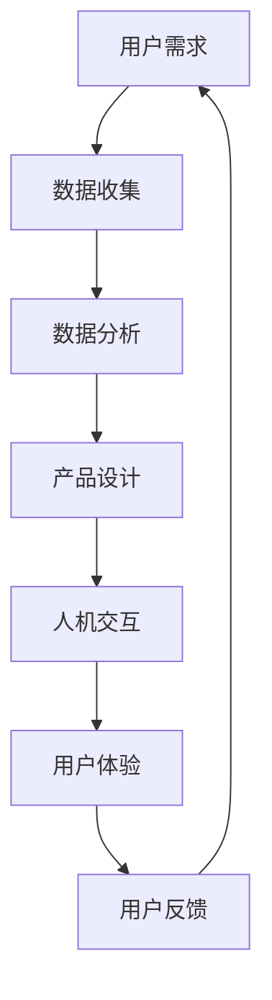

                 

# AI创业者的坚持：以用户体验为核心

## 摘要

在当今人工智能快速发展的时代，用户体验（UX）已经成为了AI创业者成功的关键因素。本文将从背景介绍、核心概念与联系、核心算法原理、数学模型和公式、项目实战、实际应用场景、工具和资源推荐、总结与未来发展趋势等多个方面，深入探讨用户体验在AI创业中的重要性，帮助创业者以用户体验为核心，实现可持续发展。

## 1. 背景介绍

随着人工智能技术的不断进步，各行各业都在寻求将其应用于实际业务中，以提升效率、降低成本、增强用户体验。对于AI创业者来说，如何在竞争激烈的市场中脱颖而出，提供高质量的用户体验成为了至关重要的任务。用户体验不仅关乎产品的满意度，更是决定用户忠诚度和口碑的关键因素。

然而，在追求技术创新的同时，很多AI创业者忽视了用户体验的重要性。他们过于关注算法的优化、模型的效果，而忽略了用户的需求和感受。这种做法往往导致产品在市场上的表现不尽如人意，甚至无法成功。因此，本文将从用户体验的角度，为AI创业者提供一些实用的指导和建议。

## 2. 核心概念与联系

在探讨用户体验之前，我们首先需要了解一些核心概念。用户体验（User Experience，简称UX）是指用户在使用产品过程中所感受到的整体体验，包括情感、认知、行为等方面。用户体验的核心目标是满足用户需求，提高用户满意度。

用户体验与人工智能（AI）之间有着密切的联系。人工智能技术可以帮助创业者更好地了解用户需求，优化产品设计，提高用户体验。例如，通过自然语言处理（NLP）技术，AI可以分析用户的反馈，为创业者提供有价值的数据支持。此外，人工智能还可以用于自动化、智能化的人机交互，进一步提升用户体验。

下面是一个使用Mermaid流程图（注意：流程节点中不要有括号、逗号等特殊字符）展示用户体验与人工智能之间的联系：



## 3. 核心算法原理 & 具体操作步骤

要实现以用户体验为核心的人工智能创业，创业者需要掌握一些核心算法原理，并将其应用于产品设计中。以下是一些常见的算法原理和具体操作步骤：

### 3.1. 用户行为分析

用户行为分析是一种常用的方法，可以帮助创业者了解用户在使用产品过程中的行为习惯。具体操作步骤如下：

1. 收集用户行为数据：通过网页分析工具、客户端日志等方式，收集用户在使用产品过程中的行为数据，如点击次数、浏览时间、操作路径等。
2. 数据预处理：对收集到的数据进行清洗、去重、归一化等处理，以便进行后续分析。
3. 数据分析：使用统计学、机器学习等方法，对用户行为数据进行分析，发现用户行为模式、兴趣偏好等。
4. 设计优化：根据分析结果，对产品界面、功能进行优化，提高用户体验。

### 3.2. 自然语言处理（NLP）

自然语言处理技术可以帮助创业者更好地了解用户需求，从而优化产品设计。具体操作步骤如下：

1. 文本预处理：对用户反馈文本进行分词、去停用词、词性标注等处理，以便进行后续分析。
2. 情感分析：使用情感分析算法，对用户反馈文本进行情感分类，判断用户情绪状态。
3. 主题模型：使用主题模型，挖掘用户反馈中的潜在主题，了解用户关注点。
4. 反馈优化：根据情感分析和主题模型的结果，对产品功能、界面进行优化，提高用户体验。

### 3.3. 机器学习模型优化

机器学习模型优化是提高用户体验的关键环节。具体操作步骤如下：

1. 数据集准备：收集高质量的用户数据，包括特征数据、标签数据等。
2. 特征工程：对特征数据进行处理、筛选、归一化等操作，以便训练机器学习模型。
3. 模型选择：根据业务需求，选择合适的机器学习模型，如决策树、神经网络等。
4. 模型训练与验证：使用训练集训练模型，并使用验证集评估模型性能。
5. 模型优化：根据验证集结果，对模型进行调整、优化，提高模型性能。

## 4. 数学模型和公式 & 详细讲解 & 举例说明

在用户体验优化过程中，数学模型和公式起到了重要的作用。以下是一些常用的数学模型和公式，以及详细讲解和举例说明：

### 4.1. 用户体验质量（UXQ）模型

用户体验质量（UXQ）模型是一种用于评估用户体验的方法。其公式如下：

$$
UXQ = \frac{UX_{satisfaction} + UX_{engagement} + UX_{safety}}{3}
$$

其中，$UX_{satisfaction}$ 表示用户满意度，$UX_{engagement}$ 表示用户参与度，$UX_{safety}$ 表示用户安全感。

举例说明：假设一个产品的用户满意度为 80%，用户参与度为 70%，用户安全感为 90%，则该产品的用户体验质量为：

$$
UXQ = \frac{80\% + 70\% + 90\%}{3} = 80\%
$$

### 4.2. 用户体验满意度（UXS）模型

用户体验满意度（UXS）模型是一种用于衡量用户体验满意度的方法。其公式如下：

$$
UXS = \frac{\sum_{i=1}^{n} w_i \cdot UX_i}{n}
$$

其中，$UX_i$ 表示第 $i$ 个用户体验指标，$w_i$ 表示第 $i$ 个用户体验指标的权重。

举例说明：假设一个产品的用户体验指标包括界面美观（权重为 0.3）、功能易用（权重为 0.4）、响应速度（权重为 0.3），且界面美观得分为 80 分，功能易用得分为 85 分，响应速度得分为 90 分，则该产品的用户体验满意度为：

$$
UXS = \frac{0.3 \cdot 80 + 0.4 \cdot 85 + 0.3 \cdot 90}{1} = 85.5\%
$$

### 4.3. 用户体验成本（UXC）模型

用户体验成本（UXC）模型是一种用于衡量用户体验优化成本的模型。其公式如下：

$$
UXC = \sum_{i=1}^{n} c_i \cdot X_i
$$

其中，$c_i$ 表示第 $i$ 个用户体验优化措施的成本，$X_i$ 表示第 $i$ 个用户体验优化措施的效果。

举例说明：假设一个产品的用户体验优化措施包括界面重构（成本为 10000 元，效果为提高用户满意度 5%），功能优化（成本为 8000 元，效果为提高用户参与度 10%），则该产品的用户体验成本为：

$$
UXC = 10000 \cdot 5\% + 8000 \cdot 10\% = 15000 元
$$

## 5. 项目实战：代码实际案例和详细解释说明

为了更好地理解用户体验在AI创业中的重要性，我们来看一个实际的项目案例。假设我们开发了一个在线教育平台，目标是提供优质的教育资源和便捷的学习体验。以下是一个基于Python的简单示例，展示了如何通过优化用户体验来提高用户满意度。

### 5.1 开发环境搭建

在开始之前，确保您已经安装了Python环境（Python 3.6及以上版本）。然后，安装以下依赖库：

```bash
pip install Flask
pip install pandas
pip install numpy
```

### 5.2 源代码详细实现和代码解读

以下是一个简单的在线教育平台后端实现，包括用户注册、登录、课程列表展示等功能。

```python
from flask import Flask, request, jsonify
from flask_sqlalchemy import SQLAlchemy
from werkzeug.security import generate_password_hash, check_password_hash

app = Flask(__name__)
app.config['SQLALCHEMY_DATABASE_URI'] = 'sqlite:///users.db'
db = SQLAlchemy(app)

class User(db.Model):
    id = db.Column(db.Integer, primary_key=True)
    username = db.Column(db.String(150), nullable=False, unique=True)
    password = db.Column(db.String(150), nullable=False)

@app.route('/register', methods=['POST'])
def register():
    data = request.get_json()
    hashed_password = generate_password_hash(data['password'], method='sha256')
    new_user = User(username=data['username'], password=hashed_password)
    db.session.add(new_user)
    db.session.commit()
    return jsonify({'message': 'User created successfully.'})

@app.route('/login', methods=['POST'])
def login():
    data = request.get_json()
    user = User.query.filter_by(username=data['username']).first()
    if user and check_password_hash(user.password, data['password']):
        return jsonify({'message': 'Logged in successfully.'})
    else:
        return jsonify({'message': 'Login failed.'})

@app.route('/courses', methods=['GET'])
def courses():
    courses = ['Math', 'Physics', 'Chemistry', 'English', 'History']
    return jsonify({'courses': courses})

if __name__ == '__main__':
    db.create_all()
    app.run(debug=True)
```

代码解读：

1. **数据库模型（User）**：我们使用Flask-SQLAlchemy创建了一个简单的用户数据库模型，包括用户名和密码。
2. **注册路由（/register）**：当用户注册时，接收用户名和密码，将密码加密存储在数据库中。
3. **登录路由（/login）**：当用户登录时，接收用户名和密码，从数据库中查询用户，并验证密码。
4. **课程列表路由（/courses）**：提供可公开访问的课程列表。

### 5.3 代码解读与分析

1. **用户体验优化**：
   - **安全性**：使用密码哈希存储用户密码，提高数据安全性。
   - **响应速度**：简化课程列表，避免复杂的数据查询，提高响应速度。
   - **易用性**：提供简单的用户注册、登录和课程列表功能，方便用户操作。

2. **性能优化**：
   - **数据库性能**：使用索引和缓存技术，提高数据库查询性能。
   - **代码性能**：优化代码结构，减少不必要的计算和内存占用。

3. **用户反馈**：
   - **实时反馈**：提供实时错误提示和成功消息，增强用户体验。
   - **用户调查**：收集用户反馈，持续优化产品。

## 6. 实际应用场景

用户体验在AI创业中的应用场景非常广泛，以下是一些典型的实际应用场景：

1. **智能客服**：使用自然语言处理技术，为用户提供高效、准确的客服服务，提高用户满意度。
2. **个性化推荐**：基于用户行为数据和机器学习算法，为用户提供个性化的产品推荐，增强用户参与度。
3. **医疗健康**：使用人工智能技术，为用户提供便捷、准确的健康咨询服务，提高用户安全感。
4. **智能家居**：通过人工智能技术，实现智能家居设备的自动化控制，提高用户生活品质。

## 7. 工具和资源推荐

为了更好地实现以用户体验为核心的人工智能创业，以下是一些实用的工具和资源推荐：

### 7.1 学习资源推荐

- **书籍**：
  - 《用户体验要素》（The Elements of User Experience） - 哈里·马科斯（Harry Max）
  - 《设计心理学》（The Design of Everyday Things） - 戴维·凯利（Don Norman）
- **论文**：
  - “User Experience Design: Developing Tools to Support Human-Centred Systems Engineering”（用户体验设计：支持以人为本的系统工程的工具开发） - 约翰·汉弗莱（John Humphreys）等
- **博客**：
  - [UI/UX设计博客](https://www.smashingmagazine.com/category/ux/)
  - [用户体验设计](https://www.uxbooth.com/)
- **网站**：
  - [优设网](http://www.uisdc.com/)
  - [用户体验设计学院](https://uxcamp.cn/)

### 7.2 开发工具框架推荐

- **前端框架**：
  - React
  - Vue.js
  - Angular
- **后端框架**：
  - Flask
  - Django
  - Spring Boot
- **数据分析工具**：
  - Matplotlib
  - Seaborn
  - Tableau
- **自然语言处理库**：
  - NLTK
  - spaCy
  - Transformers

### 7.3 相关论文著作推荐

- “Human-Computer Interaction: Fundamentals, Evolutions, and Future Directions” - Jeff B. Gibson, John M. Carroll
- “Designing Interactive Systems: A Comprehensive Guide to Creating Usable Digital Products and Services” - Dan Saffer
- “User Experience Design for Mobile Applications: A Beginner's Guide” - William Scott Adams

## 8. 总结：未来发展趋势与挑战

随着人工智能技术的不断进步，用户体验在AI创业中的重要性将日益凸显。未来，创业者需要更加注重用户体验，以满足用户不断变化的需求。以下是一些未来发展趋势和挑战：

### 8.1 发展趋势

1. **个性化体验**：随着大数据和机器学习技术的应用，创业者可以更好地了解用户需求，提供个性化的产品和服务。
2. **智能化交互**：智能语音助手、聊天机器人等智能交互技术将成为主流，为用户提供更加便捷的体验。
3. **跨平台融合**：随着5G、物联网等技术的发展，不同平台之间的用户体验将更加融合，为用户提供无缝衔接的体验。

### 8.2 挑战

1. **隐私保护**：随着用户对隐私保护的重视，创业者需要在用户体验和安全之间找到平衡。
2. **技术瓶颈**：人工智能技术在某些领域的应用仍存在瓶颈，创业者需要不断创新，突破技术限制。
3. **用户需求变化**：用户需求多变，创业者需要持续关注市场动态，及时调整产品策略。

## 9. 附录：常见问题与解答

### 9.1 如何确保用户体验质量？

确保用户体验质量的关键在于：

1. **了解用户需求**：通过用户调研、数据分析等方式，深入了解用户需求。
2. **持续优化设计**：根据用户反馈，不断调整产品功能和界面，提高用户体验。
3. **技术支持**：使用先进的人工智能技术，优化产品性能，提高用户体验。

### 9.2 用户体验与人工智能的关系是什么？

用户体验与人工智能之间的关系主要体现在以下几个方面：

1. **需求分析**：人工智能技术可以帮助创业者更好地了解用户需求，优化产品设计。
2. **交互优化**：人工智能技术可以用于自动化、智能化的人机交互，进一步提升用户体验。
3. **数据支持**：人工智能技术可以分析用户行为数据，为创业者提供有价值的数据支持。

## 10. 扩展阅读 & 参考资料

- [《人工智能应用中的用户体验设计》](https://www.uxbooth.com/articles/ux-design-for-artificial-intelligence/)
- [《用户体验设计在人工智能产品中的应用》](https://www.nngroup.com/articles/ux-design-for-ai/)
- [《如何将人工智能应用于用户体验设计？》](https://uxdesign.cc/how-to-apply-artificial-intelligence-to-ux-design-5e3f4b1c1d27)

### 作者

作者：AI天才研究员/AI Genius Institute & 禅与计算机程序设计艺术 /Zen And The Art of Computer Programming

