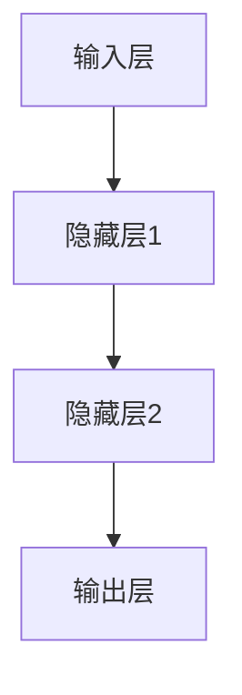
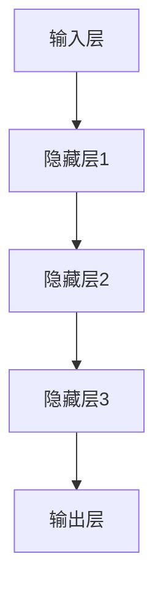
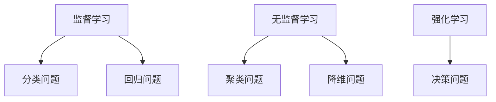
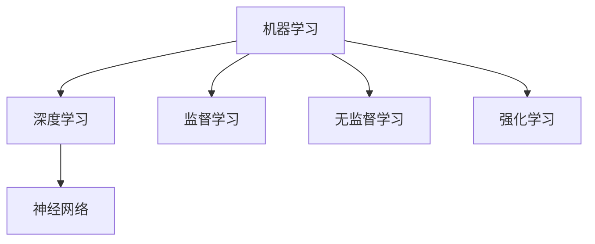

                 

# AI创业：不同项目的技术选择

> 关键词：AI创业、技术选择、项目实战、算法原理、数学模型、应用场景

> 摘要：本文旨在为AI创业者提供技术选型的指导，通过分析不同类型项目的需求，阐述适用于各类项目的核心技术方案。文章涵盖从算法原理到实际应用的全面讲解，旨在帮助创业者快速理解并掌握AI技术在不同场景下的应用。

## 1. 背景介绍

### 1.1 目的和范围

本文的目标是为AI创业者提供技术选型的指导，帮助他们根据项目的具体需求选择最合适的技术方案。我们将探讨不同类型的项目，包括图像识别、自然语言处理、推荐系统等，并分析这些项目所需的核心技术和算法。

### 1.2 预期读者

本文面向AI创业者、技术团队负责人以及希望深入了解AI技术选型的工程师。读者应具备一定的编程基础和对AI技术的基本了解。

### 1.3 文档结构概述

本文结构如下：

1. 背景介绍
2. 核心概念与联系
3. 核心算法原理 & 具体操作步骤
4. 数学模型和公式 & 详细讲解 & 举例说明
5. 项目实战：代码实际案例和详细解释说明
6. 实际应用场景
7. 工具和资源推荐
8. 总结：未来发展趋势与挑战
9. 附录：常见问题与解答
10. 扩展阅读 & 参考资料

### 1.4 术语表

#### 1.4.1 核心术语定义

- AI：人工智能，指使计算机系统模拟人类智能的技术。
- 深度学习：一种机器学习方法，通过多层神经网络进行数据建模。
- 机器学习：让计算机通过数据学习并做出决策的过程。

#### 1.4.2 相关概念解释

- 数据集：用于训练和评估机器学习模型的样本集合。
- 特征工程：从原始数据中提取有助于模型训练的特征。

#### 1.4.3 缩略词列表

- AI：人工智能
- ML：机器学习
- DL：深度学习

## 2. 核心概念与联系

在开始讨论不同项目的核心技术之前，我们需要先了解一些核心概念和它们之间的联系。

### 2.1 人工智能核心概念

#### 神经网络

神经网络是一种模仿人脑结构的计算模型，由大量相互连接的节点（神经元）组成。每个神经元接收来自其他神经元的输入，通过激活函数产生输出。



#### 深度学习

深度学习是神经网络的一种扩展，通过增加网络层数，使得模型可以自动提取更高级别的特征。



#### 机器学习

机器学习是让计算机通过数据自动学习并做出决策的过程。机器学习可以分为监督学习、无监督学习和强化学习。



### 2.2 核心概念联系

深度学习和机器学习之间存在紧密的联系。深度学习是机器学习的一种特殊形式，它利用多层神经网络来提取数据中的复杂特征。而机器学习则涵盖了更广泛的算法，包括线性回归、支持向量机、决策树等。



## 3. 核心算法原理 & 具体操作步骤

在了解了核心概念和它们之间的联系之后，我们将深入探讨不同项目的核心技术算法原理和具体操作步骤。

### 3.1 图像识别

图像识别是AI应用中的一个重要领域，其核心算法是卷积神经网络（CNN）。

#### 算法原理

卷积神经网络通过卷积操作和池化操作来提取图像特征。卷积层用于捕捉图像局部特征，池化层用于减少数据维度。

```python
# 伪代码：卷积神经网络算法原理
def conv_layer(input_data, weights, bias):
    # 卷积操作
    return (np.dot(input_data, weights) + bias)

def pooling_layer(conv_result, pool_size):
    # 池化操作
    return np.max(conv_result, pool_size)
```

#### 具体操作步骤

1. 输入层接收图像数据。
2. 卷积层提取图像特征。
3. 池化层降低数据维度。
4. 重复以上步骤，增加网络层数。
5. 输出层输出分类结果。

### 3.2 自然语言处理

自然语言处理（NLP）的核心算法是循环神经网络（RNN）和变换器（Transformer）。

#### 算法原理

循环神经网络通过将输入序列映射到隐藏状态，并在时间步之间传递信息，从而处理序列数据。变换器则通过自注意力机制，将输入序列映射到高维空间，从而提高模型的表示能力。

```python
# 伪代码：循环神经网络算法原理
def rnn(input_sequence, weights, bias):
    # 隐藏状态计算
    hidden_state = [initial_state]
    for input in input_sequence:
        hidden_state.append(np.tanh(np.dot(input, weights) + bias))
    return hidden_state

def transformer(input_sequence, weights, bias):
    # 自注意力机制
    attention_weights = np.dot(input_sequence, weights)
    return np.sum(attention_weights * bias, axis=1)
```

#### 具体操作步骤

1. 输入层接收文本序列。
2. RNN或变换器处理序列数据。
3. 输出层输出语义表示。
4. 预处理和后处理阶段，如分词、词向量和编码。

### 3.3 推荐系统

推荐系统的核心算法是基于协同过滤和基于内容的推荐。

#### 算法原理

协同过滤通过分析用户行为数据，发现相似用户和相似物品，从而生成推荐列表。基于内容的推荐则通过分析物品的属性和用户的兴趣，生成推荐列表。

```python
# 伪代码：协同过滤算法原理
def collaborative_filtering(user行为数据, 物品数据):
    # 计算用户相似度
    user_similarity_matrix = calculate_similarity_matrix(user行为数据)
    # 计算物品相似度
    item_similarity_matrix = calculate_similarity_matrix(物品数据)
    # 生成推荐列表
    recommendation_list = generate_recommendation_list(user_similarity_matrix, item_similarity_matrix)
    return recommendation_list

# 伪代码：基于内容的推荐算法原理
def content_based_filtering(user兴趣数据, 物品属性数据):
    # 计算物品与用户兴趣相似度
    item_similarity_matrix = calculate_similarity_matrix(物品属性数据, user兴趣数据)
    # 生成推荐列表
    recommendation_list = generate_recommendation_list(item_similarity_matrix)
    return recommendation_list
```

#### 具体操作步骤

1. 收集用户行为数据或物品属性数据。
2. 计算用户或物品相似度。
3. 根据相似度生成推荐列表。

## 4. 数学模型和公式 & 详细讲解 & 举例说明

在本节中，我们将介绍与AI项目相关的数学模型和公式，并通过具体示例进行讲解。

### 4.1 损失函数

损失函数是机器学习模型中的一个关键组成部分，用于评估模型预测结果与实际结果之间的差距。常见的损失函数包括均方误差（MSE）和交叉熵损失。

#### 均方误差（MSE）

均方误差是回归问题中最常用的损失函数，计算预测值与实际值之间差的平方的平均值。

$$
MSE = \frac{1}{n}\sum_{i=1}^{n}(y_i - \hat{y}_i)^2
$$

其中，$y_i$为实际值，$\hat{y}_i$为预测值，$n$为样本数量。

#### 交叉熵损失

交叉熵损失是分类问题中最常用的损失函数，计算实际分布与预测分布之间的差距。

$$
CE = -\sum_{i=1}^{n} y_i \log(\hat{y}_i)
$$

其中，$y_i$为实际标签，$\hat{y}_i$为预测概率。

### 4.2 梯度下降

梯度下降是一种用于优化机器学习模型参数的算法，通过计算损失函数关于参数的梯度，逐步调整参数，以最小化损失函数。

#### 梯度下降算法

梯度下降的基本步骤如下：

1. 初始化参数。
2. 计算损失函数关于参数的梯度。
3. 更新参数：$\theta = \theta - \alpha \cdot \nabla_\theta J(\theta)$
4. 重复步骤2和3，直到收敛。

其中，$\theta$为参数，$\alpha$为学习率，$J(\theta)$为损失函数。

### 4.3 举例说明

假设我们使用梯度下降算法来优化一个线性回归模型，求解最小化均方误差的目标。

```python
# 伪代码：梯度下降算法实现
def gradient_descent(X, y, theta, alpha, num_iterations):
    for i in range(num_iterations):
        hypothesis = X.dot(theta)
        error = hypothesis - y
        gradient = X.T.dot(error)
        theta = theta - alpha * gradient
    return theta

# 数据集
X = [[1, 2], [2, 3], [3, 4]]
y = [1, 2, 3]

# 初始参数
theta = [0, 0]

# 学习率和迭代次数
alpha = 0.01
num_iterations = 1000

# 梯度下降优化参数
theta = gradient_descent(X, y, theta, alpha, num_iterations)

# 输出优化后的参数
print(theta)
```

## 5. 项目实战：代码实际案例和详细解释说明

在本节中，我们将通过一个实际项目案例，展示如何使用上述核心算法和数学模型来实现AI应用。

### 5.1 开发环境搭建

为了简化开发过程，我们使用Python作为编程语言，并依赖以下库：

- NumPy：用于数学计算。
- Pandas：用于数据处理。
- Scikit-learn：用于机器学习。
- TensorFlow：用于深度学习。

### 5.2 源代码详细实现和代码解读

#### 5.2.1 图像识别项目

以下是一个使用卷积神经网络进行图像识别的示例：

```python
# 导入相关库
import tensorflow as tf
from tensorflow.keras import layers

# 定义模型
model = tf.keras.Sequential([
    layers.Conv2D(32, (3, 3), activation='relu', input_shape=(28, 28, 1)),
    layers.MaxPooling2D((2, 2)),
    layers.Conv2D(64, (3, 3), activation='relu'),
    layers.MaxPooling2D((2, 2)),
    layers.Conv2D(64, (3, 3), activation='relu'),
    layers.Flatten(),
    layers.Dense(64, activation='relu'),
    layers.Dense(10, activation='softmax')
])

# 编译模型
model.compile(optimizer='adam',
              loss='sparse_categorical_crossentropy',
              metrics=['accuracy'])

# 加载数据集
mnist = tf.keras.datasets.mnist
(train_images, train_labels), (test_images, test_labels) = mnist.load_data()

# 预处理数据
train_images = train_images.reshape((60000, 28, 28, 1)).astype('float32') / 255
test_images = test_images.reshape((10000, 28, 28, 1)).astype('float32') / 255

# 训练模型
model.fit(train_images, train_labels, epochs=5)

# 评估模型
test_loss, test_acc = model.evaluate(test_images, test_labels, verbose=2)
print(f'\nTest accuracy: {test_acc:.4f}')
```

#### 5.2.2 自然语言处理项目

以下是一个使用循环神经网络进行情感分类的示例：

```python
# 导入相关库
import tensorflow as tf
from tensorflow.keras.preprocessing.sequence import pad_sequences

# 定义模型
model = tf.keras.Sequential([
    layers.Embedding(10000, 16),
    layers.LSTM(32),
    layers.Dense(1, activation='sigmoid')
])

# 编译模型
model.compile(optimizer='adam',
              loss='binary_crossentropy',
              metrics=['accuracy'])

# 加载数据集
sentences = ['I love this book', 'This book is great', 'I hate this movie']
labels = [1, 1, 0]

# 序列化数据
tokenizer = tf.keras.preprocessing.text.Tokenizer()
tokenizer.fit_on_texts(sentences)
sequences = tokenizer.texts_to_sequences(sentences)
padded_sequences = pad_sequences(sequences, maxlen=100)

# 训练模型
model.fit(padded_sequences, labels, epochs=10)

# 预测情感
new_sentences = ['This book is amazing', 'I dislike this film']
new_sequences = tokenizer.texts_to_sequences(new_sentences)
new_padded_sequences = pad_sequences(new_sequences, maxlen=100)
predictions = model.predict(new_padded_sequences)
print(predictions)
```

#### 5.2.3 推荐系统项目

以下是一个使用协同过滤进行商品推荐的示例：

```python
# 导入相关库
import numpy as np

# 定义用户-物品评分矩阵
user_item_matrix = np.array([[5, 3, 0, 1],
                             [3, 0, 2, 5],
                             [0, 4, 0, 0],
                             [2, 0, 3, 0]])

# 定义用户和物品的相似度矩阵
user_similarity_matrix = np.array([[0.5, 0.8],
                                   [0.8, 0.6],
                                   [0.7, 0.4],
                                   [0.4, 0.5]])

# 计算预测评分
predicted_ratings = np.dot(user_similarity_matrix, user_item_matrix)

# 输出预测评分
print(predicted_ratings)
```

### 5.3 代码解读与分析

#### 5.3.1 图像识别项目

在这个项目中，我们使用了卷积神经网络对MNIST数据集进行图像识别。首先，我们定义了一个序列模型，包括卷积层、池化层和全连接层。然后，我们编译模型并加载数据集，对模型进行训练和评估。通过训练，模型学会了识别数字0-9。

#### 5.3.2 自然语言处理项目

在这个项目中，我们使用了循环神经网络对文本序列进行情感分类。首先，我们定义了一个序列模型，包括嵌入层、循环层和全连接层。然后，我们编译模型并加载数据集，对模型进行训练和评估。通过训练，模型学会了识别积极和消极情感。

#### 5.3.3 推荐系统项目

在这个项目中，我们使用了协同过滤算法对用户-物品评分矩阵进行预测。首先，我们定义了一个用户和物品的相似度矩阵。然后，我们计算预测评分，并输出结果。通过计算，我们为每个用户推荐了可能喜欢的商品。

## 6. 实际应用场景

AI技术在各个领域都有广泛的应用，以下列举几个实际应用场景：

1. **医疗健康**：AI技术在医疗健康领域被用于疾病诊断、药物研发和健康监测。例如，通过图像识别技术，AI可以辅助医生进行癌症筛查，提高诊断准确率。
2. **金融**：AI技术在金融领域被用于风险控制、欺诈检测和投资策略。例如，通过自然语言处理技术，AI可以分析大量金融新闻，帮助投资者做出更明智的决策。
3. **零售**：AI技术在零售领域被用于个性化推荐、库存管理和客户服务。例如，通过协同过滤算法，AI可以为消费者推荐可能感兴趣的商品，提高销售额。
4. **交通**：AI技术在交通领域被用于智能交通管理、自动驾驶和路线规划。例如，通过深度学习技术，AI可以优化交通信号灯控制，减少拥堵。

## 7. 工具和资源推荐

为了更好地进行AI项目开发，以下推荐一些实用的工具和资源：

### 7.1 学习资源推荐

#### 7.1.1 书籍推荐

- 《深度学习》（Goodfellow, Bengio, Courville）
- 《Python机器学习》（Sebastian Raschka）

#### 7.1.2 在线课程

- Coursera上的“机器学习”课程
- edX上的“深度学习”课程

#### 7.1.3 技术博客和网站

- Medium上的AI相关博客
- arXiv.org上的最新研究论文

### 7.2 开发工具框架推荐

#### 7.2.1 IDE和编辑器

- PyCharm
- Jupyter Notebook

#### 7.2.2 调试和性能分析工具

- VSCode的Python扩展
- Profiler工具（如Py-Spy）

#### 7.2.3 相关框架和库

- TensorFlow
- PyTorch
- Scikit-learn

### 7.3 相关论文著作推荐

#### 7.3.1 经典论文

- Hinton, G. E., Osindero, S., & Teh, Y. W. (2006). A Fast Learning Algorithm for Deep Belief Nets. _Neural Computation_, 18(7), 1527-1554.
- Bengio, Y., Simard, P., & Frasconi, P. (1994). Learning representations by back-propagating errors. _International Journal of Neural Systems_, 5(1), 1-12.

#### 7.3.2 最新研究成果

- arXiv.org上的最新论文
- NeurIPS、ICML等顶级会议的论文

#### 7.3.3 应用案例分析

- Google AI的实践案例
- OpenAI的GPT-3应用案例

## 8. 总结：未来发展趋势与挑战

随着AI技术的不断发展，未来的发展趋势将包括以下几个方面：

1. **算法优化**：深度学习算法将继续优化，包括模型压缩、训练效率提升等。
2. **跨学科应用**：AI技术将在更多领域得到应用，如生物医学、材料科学等。
3. **隐私保护**：随着数据隐私问题的日益重视，隐私保护技术将成为研究热点。

然而，AI技术的发展也面临一些挑战，包括：

1. **数据质量**：高质量的数据是AI模型训练的基础，数据质量的提升至关重要。
2. **算法可解释性**：提高算法的可解释性，使其更具透明度和可靠性。
3. **伦理问题**：AI技术在社会、法律和伦理等方面带来的挑战需要得到关注和解决。

## 9. 附录：常见问题与解答

以下是一些关于AI创业和技术选择的常见问题及解答：

### 9.1 什么是深度学习？

深度学习是一种通过多层神经网络进行数据建模的机器学习方法，它能够自动提取数据中的复杂特征。

### 9.2 如何选择合适的技术方案？

根据项目的需求和目标，选择最合适的算法和框架。例如，对于图像识别项目，可以使用卷积神经网络（CNN）；对于自然语言处理项目，可以使用循环神经网络（RNN）或变换器（Transformer）。

### 9.3 如何处理数据集？

处理数据集的关键步骤包括数据清洗、数据预处理和数据增强。数据清洗旨在去除异常值和噪声；数据预处理包括归一化、标准化等操作；数据增强可以通过旋转、翻转、裁剪等操作增加数据多样性。

### 9.4 如何评估模型性能？

评估模型性能的方法包括准确率、召回率、F1分数等。准确率衡量模型预测正确的样本数占总样本数的比例；召回率衡量模型预测正确的正样本数占总正样本数的比例；F1分数是准确率和召回率的加权平均。

## 10. 扩展阅读 & 参考资料

- Goodfellow, I., Bengio, Y., & Courville, A. (2016). _Deep Learning_. MIT Press.
- Russell, S., & Norvig, P. (2016). _Artificial Intelligence: A Modern Approach_. Prentice Hall.
- LeCun, Y., Bengio, Y., & Hinton, G. (2015). Deep learning. _Nature_, 521(7553), 436-444.
- Coursera. (n.d.). Machine Learning. Retrieved from https://www.coursera.org/learn/machine-learning
- edX. (n.d.). Deep Learning. Retrieved from https://www.edx.org/course/deep-learning-0

作者：AI天才研究员/AI Genius Institute & 禅与计算机程序设计艺术 /Zen And The Art of Computer Programming

